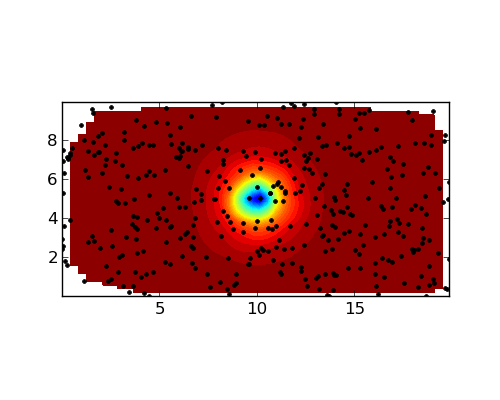

:author: Leonardo Uieda
:email: leouieda@gmail.com
:institution: Observatorio Nacional

:author: Vanderlei C. Oliveira Jr
:email: vandscoelho@gmail.com
:institution: Observatorio Nacional

:author: Valéria C. F. Barbosa
:email: valcris@on.br
:institution: Observatorio Nacional

========================================
Modeling the Earth with Fatiando a Terra
========================================

.. class:: abstract

    This is the abstract

.. class:: keywords

    goephysics, modeling, inverse problems

Introduction
------------

Geophysics studies the physical processes of the Earth.
The subarea commonly referred to as Solid Earth geophyscis
uses observations of physical phenomena
to infer the inner structure of the planet.
This task requires the numerical modeling of physical processes.
These numerical models
can then be used in inverse problems
to infer Earth structure
from observations.
Different geophysical methods
use different kinds of observations.
Electromagnetic (EM) methods
use electromagnetic waves and difusion.
Gravity and magnetics
use potential fields.

Seismics and seismology
use elastic waves
from active (man-made)
and passive (earthquakes) sources.
The seismic method is among the most widely stydied
due to the high industry demmand.
Thus,
a range of well established open-source software
have been developed for seismic processing.
These include
SU [Stockwell_Jr]_,
Madagascar [MadagascarDev]_,
OpendTect (http://opendtect.org),
and GêBR (http://www.gebrproject.com).
The Generic Mapping Tools [Wessel_Smith]_
is a well established collection
of command-line programs
for plotting maps
with a variety of
different map projections.
The Computational Infrastructure for Geodynamics (CIG)
(http://www.geodynamics.org)
has grouped varios codes
for geodynamic modeling.
However,
many geophysical modeling software
that are provided online
have no clear open-source license statement,
have criptic I/O files,
are hard to integrate into a pipeline,
and make code to reuse and remix challeging.
SEATREE [Milner_etal]_
tries to solve some of these problems
by providing a common graphycal interface
to existing software.
The actual computation
is perfomed C/Fortran programs
but the I/O and user interface
are written in Python.
This makes using these tools easier
and more approachable to students.
However,
the lack of a common API
means that the code for these programs
cannot be easily combined
to create new modeling tools.

Fatiando a Terra aims
to provide such an API
for geophysical modeling.
Functions in Fatiando
use compatible data and mesh formats
so that the output of one modeling function
can be used as input for another.
Furthermore,
routines can be combined and reused
to create new modeling algorihms.
Fatiando also automates common tasks
such as
gridding,
map plotting with Matplotlib [Hunter]_,
3D plotting with Mayavi [Ramachandran_Varoquaux]_,
etc.
Version 0.1 of Fatiando a Terra
is focused on gravity and magnetics.
However,
simple "toy" problems
for seismology and geothermics
are available
and can be useful
for teaching geophysics.

Gridding and plotting
---------------------

Forward modeling
----------------

Gravity and magnetic inversion
------------------------------

Inverse problem solvers
-----------------------

.. code-block:: python

    from fatiando import gridder, utils, gravmag, mesher
    from fatiando.vis import mpl

    x, y, z = gridder.scatter([0, 10000, 0, 20000], 400,
        z=-1)
    spheres = [mesher.Sphere(5000, 10000, 1000,
        radius=500, props={'density':1000})]
    gz = gravmag.sphere.gz(x, y, z, spheres)

    mpl.figure(figsize=(5,4))
    mpl.axis('scaled')
    mpl.plot(y, x, '.k')
    mpl.contourf(y, x, gz, (50, 50), 40, interp=True)
    mpl.m2km()
    mpl.savefig('grav_example.png')

   This is the caption of figure 1

References
----------

.. [Hunter] Hunter, J. D. (2007), Matplotlib: A 2D Graphics Environment,
    Computing in Science & Engineering, 9(3), 90–95, doi:10.1109/MCSE.2007.55.

.. [MadagascarDev] Madagascar Development Team. Madagascar Software, 2013,
    http://www.ahay.org/

.. [Milner_etal] Milner, K., Becker, T. W., Boschi, L., Sain, J.,
    Schorlemmer, D. and H. Waterhouse. The Solid Earth Research and Teaching
    Environment: a new software framework to share research tools in the
    classroom and across disciplines, Eos Trans. AGU, 90, 12, 2009.

.. [Ramachandran_Varoquaux] Ramachandran, P., and G. Varoquaux (2011), Mayavi:
    3D Visualization of Scientific Data, Computing in Science & Engineering,
    13(2), 40–51, doi:10.1109/MCSE.2011.35

.. [Stockwell_Jr] J. W. Stockwell Jr. The CWP/SU: Seismic Unx package,
    Computers & Geosciences, 25(4):415-419, 1999,
    doi:10.1016/S0098-3004(98)00145-9

.. [Wessel_Smith] P. Wessel and W. H. F. Smith. Free software helps map and
    display data, EOS Trans. AGU, 72, 441, 1991.
