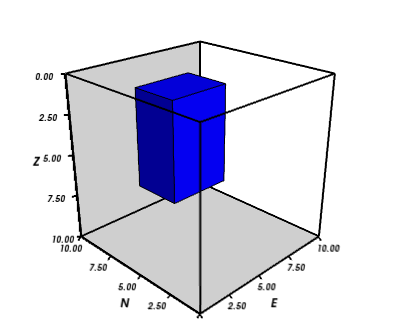

:author: Leonardo Uieda
:email: leouieda@gmail.com
:institution: Observatorio Nacional

:author: Vanderlei C. Oliveira Jr
:email: vandscoelho@gmail.com
:institution: Observatorio Nacional

:author: Valéria C. F. Barbosa
:email: valcris@on.br
:institution: Observatorio Nacional

========================================
Modeling the Earth with Fatiando a Terra
========================================

.. class:: abstract

    This is the abstract

.. class:: keywords

    goephysics, modeling, inverse problems

Introduction
------------

Geophysics studies the physical processes of the Earth.
The subarea commonly referred to as Solid Earth geophysics
uses observations of physical phenomena
to infer the inner structure of the planet.
This task requires the numerical modeling of physical processes.
These numerical models
can then be used in inverse problems
to infer inner Earth structure
from observations.
Different geophysical methods
use different kinds of observations.
Electromagnetic (EM) methods
use electromagnetic waves and difusion.
Gravity and magnetics
use potential fields.

Seismics and seismology
use elastic waves
from active (man-made)
and passive (earthquakes) sources.
The seismic method is among the most widely stydied
due to the high industry demmand.
Thus,
a range of well established open-source softwares
have been developed for seismic processing.
These include
SU [Stockwell_Jr]_,
Madagascar [MadagascarDev]_,
OpendTect (http://opendtect.org),
and GêBR (http://www.gebrproject.com).
The Generic Mapping Tools [Wessel_Smith]_
are a well established collection
of command-line programs
for plotting maps
with a variety of
different map projections.
The Computational Infrastructure for Geodynamics (CIG)
(http://www.geodynamics.org)
has grouped varios codes
for geodynamic modeling.
However,
many geophysical modeling softwares
that are provided online
have no clear open-source license statement,
have cryptic I/O files,
are hard to integrate into a pipeline,
and make code reuse and remixing challenging.
SEATREE [Milner_etal]_
tries to solve some of these problems
by providing a common graphycal interface
to existing software.
The numerical computations
are perfomed by
the existing C/Fortran programs.
Conversely, the SEATREE code that handles
the I/O and user interface
is written in Python.
This makes using these tools easier
and more approachable to students.
However,
the lack of a common API
means that the code for these programs
cannot be easily combined
to create new modeling tools.

Fatiando a Terra
(http://www.fatiando.org)
aims at providing such an API
for geophysical modeling.
Functions in Fatiando
use compatible data and mesh formats
so that the output of one modeling function
can be used as input for another.
Furthermore,
routines can be combined and reused
to create new modeling algorihms.
Fatiando also automates common tasks
such as
gridding,
map plotting with Matplotlib [Hunter]_,
3D plotting with Mayavi [Ramachandran_Varoquaux]_,
etc.
Version 0.1 of Fatiando a Terra
is focused on gravity and magnetics.
However,
simple "toy" problems
for seismology and geothermics
are available
and can be useful
for teaching geophysics.

The ``fatiando`` package
------------------------

The modules and packages
of Fatiando a Terra
are bundled into
the ``fatiando`` package.
Each type of geophysical method
has its own package.
As of version 0.1,
the available modules and packages are:

* ``fatiando.gravmag``:
  gravity and magnetic methods;
* ``fatiando.seismic``:
  seismics and seismology;
* ``fatiando.geothermal``:
  geothermal modeling;
* ``fatiando.mesher``:
  geometric elements and meshes;
* ``fatiando.gridder``:
  grid generation, slicing, interpolation, etc;
* ``fatiando.io``:
  I/O of models and data sets from web repositories;
* ``fatiando.utils``:
  miscelaneous utilities;
* ``fatiando.constants``:
  physical constants;
* ``fatiando.gui``:
  simple graphical user interfaces;
* ``fatiando.vis``:
  2D and 3D plotting;
* ``fatiando.inversion``:
  inverse problem solvers and regularization;

Gridding and plotting
---------------------

Fatiando a Terra handles map data as 1D Numpy arrays,
typically x-, y-, z-coordinates and an extra array with the corresponding data.
However, Matplotlib functions, like ``contourf`` and ``pcolor``, require
data to be passed as 2D arrays.
Moreover, geophysical datasets are often irregularly sampled
and require gridding before they can be plotted.
Thus, gridding and array reshaping are ideal targets for automation.

The ``fatiando.vis.mpl`` module
loads all the functions in ``matplotlib.pyplot``,
adds new functions,
and overwrites others
to automate repetitive tasks
(such as gridding).
The following example
illustrates the use
of the ``fatiando.vis.mpl.contourf`` function
to automatically grid and plot
some irregularly sampled data
(Figure 1):

.. code-block:: python

    from fatiando import gridder
    from fatiando.vis import mpl
    area = [-50, 50, -20, 20]
    x, y = gridder.scatter(area, n=100)
    data = x**2 + y**2
    mpl.figure()
    mpl.axis('scaled')
    mpl.contourf(x, y, data, shape=(50, 50),
        levels=30, interp=True)
    mpl.colorbar(orientation='horizontal')
    mpl.plot(x, y, '.k')
    mpl.show()

.. figure:: gridding_plotting_contourf.png
    :align: center

    Example of generating a random scatter of points, using that to make
    synthetic data, and automatically gridding and plotting it using a
    a Fatiando a Terra wrapper for the Matplotlib ``contourf``
    function.

Map projections
are handled by
the Matplotlib Basemap toolkit
(http://matplotlib.org/basemap).
The ``fatiando.vis.mpl`` module
also provides helper functions
to automate the use
of this toolkit (Figure 2):

.. code-block:: python

    mpl.figure()
    bm = mpl.basemap(area, projection='robin')
    bm.drawmapboundary()
    bm.drawcoastlines()
    mpl.contourf(x, y, data, shape=(50, 50), levels=30,
        interp=True, basemap=bm)
    mpl.colorbar(orientation='horizontal')
    mpl.show()

.. figure:: gridding_plotting_basemap.png
    :align: center

    Example of map plotting with the Robinson projection using the Matplotlib
    Basemap toolkit.

The ``fatiando.vis.myv`` module
contains functions
for 3D plotting
using Mayavi [Ramachandran_Varoquaux]_.
These functions create TVTK representations
of ``fatiando.mesher`` objects
and plot them in Mayavi
using the ``mayavi.mlab`` interface.
The ``fatiando.vis.myv.figure`` function
creates a figure
and rotates it so that
the z-axis points down,
as is standard in geophysics.
The following example
shows how to create and plot
a 3D right rectangular prism model
(Figure 3):

.. code-block:: python

    from fatiando import mesher
    from fatiando.vis import myv
    model = [mesher.Prism(5, 8, 3, 7, 1, 7)]
    bounds = [0, 10, 0, 10, 0, 10]
    myv.figure()
    myv.prisms(model)
    myv.axes(myv.outline(bounds))
    myv.wall_bottom(bounds)
    myv.wall_north(bounds)
    myv.show()

    Example of generating a right rectangular prism model and visualising it
    in Mayavi.

Forward modeling
----------------

In geophysics,
the term "forward modeling"
is used to describe
the process of generating model data
from a given Earth model.
Conversely,
geophysical inversion is
the process of estimating Earth model parameters
from observed data.

The Fatiando a Terra packages
have separate modules for
forward modeling
and inversion algorithms.
The forward modeling functions
usually take as arguments
geometric elements from ``fatiando.mesher``
with assigned physical properties
and return the modeled data.
For example,
the module ``fatiando.gravmag.tesseroid``
is a Python implementation of
the program Tesseroids (http://leouieda.github.io/tesseroids)
and calculates the gravity anomaly
of tesseroids, e.g. spherical prisms (Figure 4):

.. code-block:: python

    from fatiando import gravmag, gridder, mesher
    from fatiando.vis import mpl, myv
    model = [
        mesher.Tesseroid(-60, -55, -30, -27, 500000, 0,
            props={'density':200}),
        mesher.Tesseroid(-66, -62, -18, -12, 300000, 0,
            props={'density':-500})]
    area = [-80, -30, -40, 10]
    shape = (50, 50)
    lons, lats, heights = gridder.regular(area, shape,
        z=2500000)
    gz = gravmag.tesseroid.gz(lons, lats, heights, model)
    mpl.figure()
    bm = mpl.basemap(area, 'ortho')
    bm.drawcoastlines()
    bm.drawmapboundary()
    bm.bluemarble()
    mpl.title('Gravity anomaly (mGal)')
    mpl.contourf(lons, lats, gz, shape, 30, basemap=bm)
    mpl.colorbar()
    mpl.show()
    fig = myv.figure(zdown=False)
    scene = fig.scene
    myv.tesseroids(model, 'density')
    myv.continents(linewidth=2)
    myv.earth(opacity=0.8)
    myv.meridians(range(0, 360, 45), opacity=0.2)
    myv.parallels(range(-90, 90, 45), opacity=0.2)
    scene.camera.position = [21199620.406122234,
        -12390254.839673528, -14693312.866768979]
    scene.camera.focal_point = [-535799.97230670298,
        -774902.33205294283, 826712.82283183688]
    scene.camera.view_angle = 19.199999999999996
    scene.camera.view_up = [0.33256519487680014,
        -0.47008782429014295, 0.81756824095039038]
    scene.camera.clipping_range = [7009580.0037488714,
        55829873.658824757]
    scene.camera.compute_view_plane_normal()
    scene.render()
    myv.show()

.. figure:: gravmag_tesseroid.png
    :align: center

    Example of forward modeling using tesseroids (e.g., spherical prisms).
    a) a tesseroid model.
    b) the modeled gravity anomaly of the tesseroid model.

The module ``fatiando.gravmag.polyprism``
implements the method of [Plouff]_
to forward model the gravity fields
of a 3D right polygonal prism.
The following code sample
shows how to interactively generate
a polygonal prism model
and calculate its gravity anomaly
(Figures 5 and 6):

.. code-block:: python

    # Draw a polygon and make a polygonal prism
    bounds = [-1000, 1000, -1000, 1000, 0, 1000]
    area = bounds[:4]
    mpl.figure()
    mpl.axis('scaled')
    vertices = mpl.draw_polygon(area, mpl.gca(),
        xy2ne=True)
    model = [mesher.PolygonalPrism(vertices, z1=0,
        z2=500, props={'density':500})]
    # Calculate the gravity anomaly
    shape = (100, 100)
    x, y, z = gridder.scatter(area, 300, z=-1)
    gz = gravmag.polyprism.gz(x, y, z, model)
    mpl.figure()
    mpl.axis('scaled')
    mpl.title("Gravity anomaly (mGal)")
    mpl.contourf(y, x, gz, shape=(50, 50),
        levels=30, interp=True)
    mpl.colorbar()
    mpl.polygon(model[0], '.-k', xy2ne=True)
    mpl.set_area(area)
    mpl.m2km()
    mpl.show()
    myv.figure()
    myv.polyprisms(model, 'density')
    myv.axes(myv.outline(bounds),
            ranges=[i*0.001 for i in bounds])
    myv.wall_north(bounds)
    myv.wall_bottom(bounds)
    myv.show()

.. figure:: forward_modeling_polyprism_drawing.png
    :align: center

    Screenshot of interactively drawing the contour of a 3D polygonal prism,
    as view from above.

.. figure:: forward_modeling_polyprism.png
    :align: center

    Example of forward modeling the gravity anomaly of a 3D polygonal prism.
    a) forward modeled gravity anomaly.
    b) 3D plot of the polygonal prism.

Gravity and magnetic methods
----------------------------

Geophysics uses
anomalies in
the gravitational and magnetic fields
generated by density and magnetization contrasts
within the Earth
to investigate the inner Earth structure.
The Fatiando a Terra 0.1 release
has been focused on
gravity and magnetic methods.
Therefore,
the ``fatiando.gravmag`` package
contains the most advanced and state-of-the-art algorithms.

The module ``fatiando.gravmag.imaging``
implements the imaging methods
described in [Fedi_Pilkington]_.
These methods aim to produce
an image of the geologic source
from the observed
gravity or magnetic data.
The following code sample
uses the "sandwich model" method [Pedersen]_
to image the polygonal prism,
produced in the previous section,
based on its gravity anomaly (Figure 7):

.. code-block:: python

    estimate = gravmag.imaging.sandwich(x, y, z, gz,
        shape, zmin=0, zmax=1000, nlayers=20, power=0.2)
    body = mesher.vfilter(1.3*10**8, 1.7*10**8,
        'density', estimate)
    myv.figure()
    myv.prisms(body, 'density', edges=False)
    p = myv.polyprisms(model, 'density',
        style='wireframe', linewidth=4)
    p.actor.mapper.scalar_visibility = False
    p.actor.property.color = (0, 0, 0)
    myv.axes(myv.outline(bounds),
        ranges=[i*0.001 for i in bounds])
    myv.wall_north(bounds)
    myv.wall_bottom(bounds)
    myv.show()

.. figure:: gravmag_imaging.png
    :align: center

    Example of using the "sandwich model" imaging method to recover a 3D image
    of a geologic body based on its gravity anomaly. The colored blocks are a
    cutoff of the imaged body. The black contours are the true source of the
    gravity anomaly.

Also implemented are some recent developments
in gravity and magnetic inversion methods.
The method of "planting anomalous densities" by [Uieda_Barbosa]_
is implemented in
the ``fatiando.gravmag.harvester`` module.
In contrast to imaging methods,
this is an inversion method,
i.e., it estimates a physical property distribution
(density in the case of gravity data)
that fits the observed data.
This particular method
requires the user to specify
a "seed" (Figure 8) around which
the estimated density distribution grows (Figure 9):

.. code-block:: python

    # Make a mesh and a seed
    mesh = mesher.PrismMesh(bounds, (10, 20, 20))
    seeds = gravmag.harvester.sow(
        [[0, 0, 100, {'density':500}]],
        mesh)
    myv.figure()
    myv.prisms([mesh[s.i] for s in seeds])
    p = myv.polyprisms(model, 'density',
        style='wireframe', linewidth=4)
    p.actor.mapper.scalar_visibility = False
    p.actor.property.color = (0, 0, 0)
    myv.axes(myv.outline(bounds),
        ranges=[i*0.001 for i in bounds])
    myv.wall_north(bounds)
    myv.wall_bottom(bounds)
    myv.show()
    # Now perform the inversion
    data = [gravmag.harvester.Gz(x, y, z, gz)]
    estimate = gravmag.harvester.harvest(data, seeds,
        mesh, compactness=0.5, threshold=0.0005)[0]
    mesh.addprop('density', estimate['density'])
    body = mesher.vremove(0, 'density', mesh)
    myv.figure()
    myv.prisms(body, 'density')
    p = myv.polyprisms(model, 'density',
        style='wireframe', linewidth=4)
    p.actor.mapper.scalar_visibility = False
    p.actor.property.color = (0, 0, 0)
    myv.axes(myv.outline(bounds),
        ranges=[i*0.001 for i in bounds])
    myv.wall_north(bounds)
    myv.wall_bottom(bounds)
    myv.show()

.. figure:: gravmag_harvester_seed.png
    :align: center

    The blue prism is the seed used by ``fatiando.gravmag.harvester`` to
    perform the inversion of a gravity anomaly. The black contours are the true
    source of the gravity anomaly.

.. figure:: gravmag_harvester.png
    :align: center

    The blue prisms are the result of a gravity inversion using module
    ``fatiando.gravmag.harvester``. The black contours are the true source of
    the gravity anomaly. Notice how the inversion was able to recover the
    approximate geometry of the true source.

Conclusion
----------

The Fatiando a Terra package
provides an API
to develop modeling algorithms
for a variety of geophysical methods.
The current version (0.1)
has state-of-the-art
gravity and magnetic modeling and inversion algorithms.
There are also
toy problems in gravity, seismics and seismology
that are useful for teaching
basic concepts of
geophysics, modeling, and inverse problems.

Fatiando a Terra enables
quick prototyping of
new algorithms
because of
the collection of
fast forward modeling routines and
the simple syntax and high level of
the Python language.
After protyping,
the performance bottlenecks of these algorithms
can be easily diagnosed
using the advanced
profiling tools
available in the Python language.
Optimization of
only small components of code
can be done without loss of flexibility
using the Cython language.

The biggest challenge that Fatiando a Terra
faces in the near future
is the development of
a user and, consequently, a developer community.
This is a key part
for the survival of
any open-source project.

References
----------

.. [Fedi_Pilkington] Fedi, M., and M. Pilkington (2012), Understanding imaging
    methods for potential field data, Geophysics, 77(1), G13,
    doi:10.1190/geo2011-0078.1.

.. [Hunter] Hunter, J. D. (2007), Matplotlib: A 2D Graphics Environment,
    Computing in Science & Engineering, 9(3), 90-95, doi:10.1109/MCSE.2007.55.

.. [MadagascarDev] Madagascar Development Team. Madagascar Software, 2013,
    http://www.ahay.org/

.. [Milner_etal] Milner, K., Becker, T. W., Boschi, L., Sain, J.,
    Schorlemmer, D. and H. Waterhouse. The Solid Earth Research and Teaching
    Environment: a new software framework to share research tools in the
    classroom and across disciplines, Eos Trans. AGU, 90, 12, 2009.

.. [Pedersen] Pedersen, L. B., 1991, Relations between potential fields and some
    equivalent sources: Geophysics, 56, 961–971, doi: 10.1190/1.1443129.

.. [Plouff] Plouff, D. (1976), Gravity and magnetic fields of polygonal prisms
    and application to magnetic terrain corrections, Geophysics, 41(4), 727,
    doi:10.1190/1.1440645.

.. [Ramachandran_Varoquaux] Ramachandran, P., and G. Varoquaux (2011), Mayavi:
    3D Visualization of Scientific Data, Computing in Science & Engineering,
    13(2), 40-51, doi:10.1109/MCSE.2011.35

.. [Stockwell_Jr] J. W. Stockwell Jr. The CWP/SU: Seismic Unx package,
    Computers & Geosciences, 25(4):415-419, 1999,
    doi:10.1016/S0098-3004(98)00145-9

.. [Uieda_Barbosa] Uieda, L., and V. C. F. Barbosa (2012), Robust 3D gravity
    gradient inversion by planting anomalous densities, Geophysics, 77(4),
    G55-G66, doi:10.1190/geo2011-0388.1.

.. [Wessel_Smith] P. Wessel and W. H. F. Smith. Free software helps map and
    display data, EOS Trans. AGU, 72, 441, 1991.
