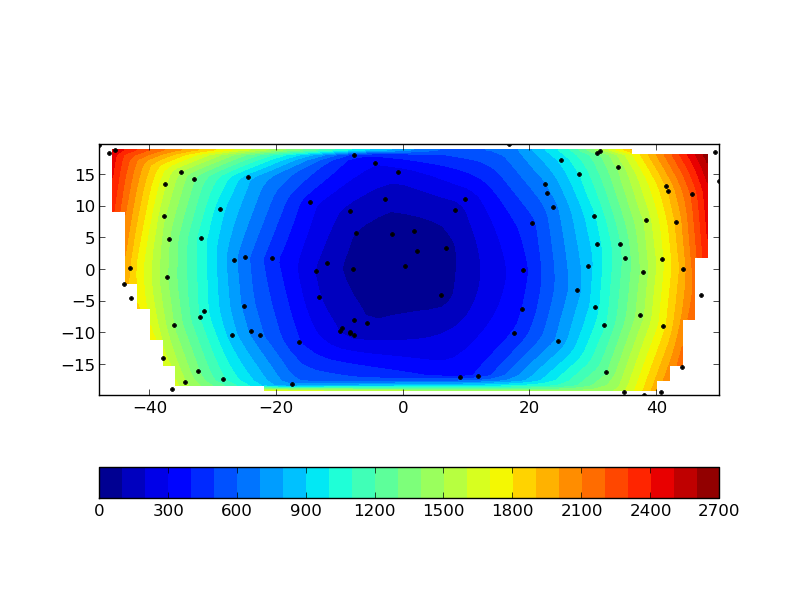
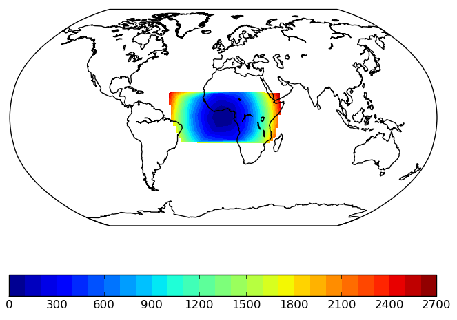
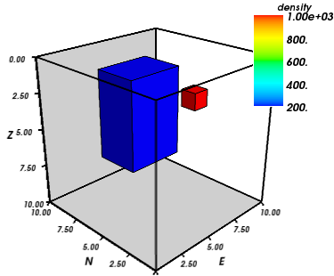
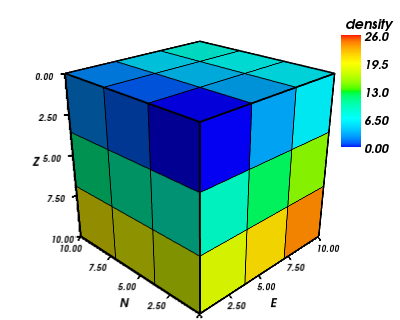
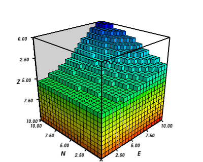
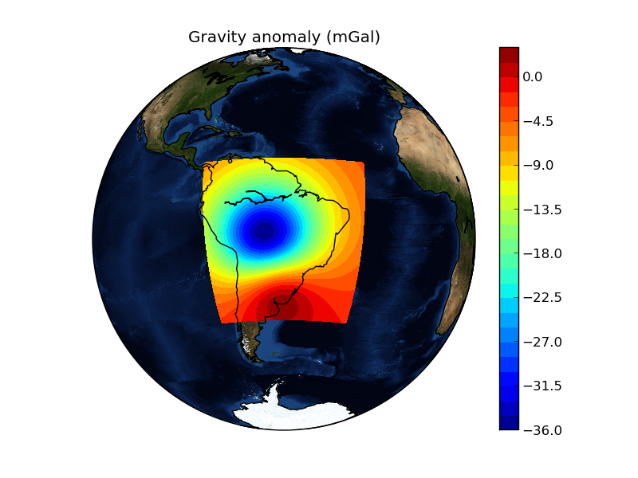
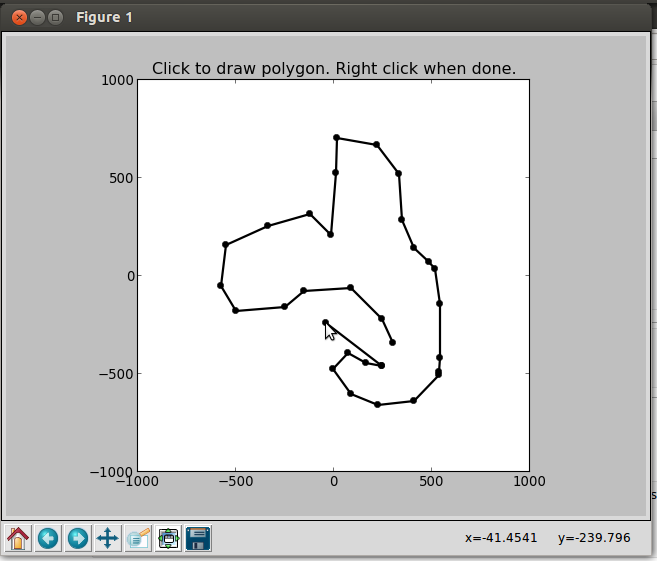
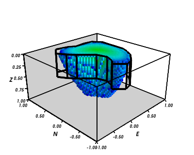
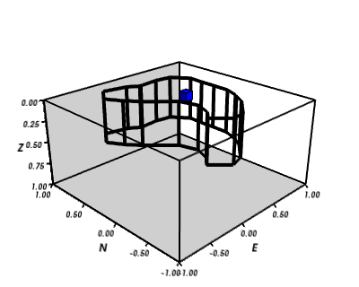
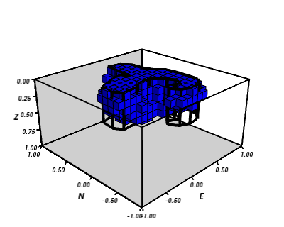

:author: Leonardo Uieda
:email: leouieda@gmail.com
:institution: Observatorio Nacional

:author: Vanderlei C. Oliveira Jr
:email: vandscoelho@gmail.com
:institution: Observatorio Nacional

:author: Valéria C. F. Barbosa
:email: valcris@on.br
:institution: Observatorio Nacional

========================================
Modeling the Earth with Fatiando a Terra
========================================

.. class:: abstract

    This is the abstract

.. class:: keywords

    geophysics, modeling, inverse problems

Introduction
------------

Geophysics studies the physical processes of the Earth.
Geophysicists make observations of physical phenomena
and use them to
infer the inner structure of the planet.
This task requires
the numerical modeling of physical processes.
These numerical models
can then be used in inverse problems
to infer inner Earth structure
from observations.
Different geophysical methods
use different kinds of observations.
Geothermal methods use
the temperature and heat flux
of the Earth's crust.
Potential field methods
use gravitational and magnetic field
measurements.
Seismics and seismology
use the ground motion
caused by elastic waves
from active (man-made)
and passive (earthquakes) sources, respectively.

The seismic method is among the most widely studied
due to the high industry demand.
Thus,
a range of well established open-source software
have been developed for seismic processing.
These include
`Seismic Un*x <http://www.cwp.mines.edu/cwpcodes/>`_ (SU) [SU]_,
`Madagascar <http://www.ahay.org/>`_ [MAD]_,
`OpendTect <http://opendtect.org>`_,
and `GêBR <http://www.gebrproject.com>`_.
A noteworthy open-source project
that is not seismic related
is the `Generic Mapping Tools <http://gmt.soest.hawaii.edu/>`_
(GMT) project [GMT]_.
The GMT are a well established collection
of command-line programs
for plotting maps
with a variety of
different map projections.
For geodynamic modeling
there is the
`Computational Infrastructure for Geodynamics <http://www.geodynamics.org>`_
(CIG),
which has grouped various
well documented software packages.
However,
even with this wide range
of well maintained software projects,
many geophysical modeling software
that are provided online
still have no open-source license statement,
have cryptic I/O files,
are hard to integrate into a pipeline,
and make code reuse and remixing challenging.
Some of these problems
are being worked on by the
`Solid Earth Teaching and Research Environment
<http://geosys.usc.edu/projects/seatree/>`_
(SEATREE) [SEATREE]_
by providing a common graphical interface
to existing software.
The numerical computations
are performed by
the pre-existing underlying C/Fortran programs.
Conversely, the SEATREE code that handles
the I/O and user interface
is written in Python.
This makes using these tools easier
and more approachable to students.
However,
the lack of a common API
means that the code for these programs
cannot be easily combined
to create new modeling tools.

`Fatiando a Terra <http://www.fatiando.org>`_
aims at providing such an API
for geophysical modeling.
Functions in the ``fatiando`` package
use compatible data and mesh formats
so that the output of one modeling function
can be used as input for another.
Furthermore,
routines can be combined and reused
to create new modeling algorithms.
Fatiando a Terra also automates common tasks
such as
griding,
map plotting with Matplotlib [MPL]_, and
3D plotting with Mayavi [MYV]_.
Version 0.1 of Fatiando a Terra
is focused on gravity and magnetic methods
because this is the main focus
of the developers.
However,
simple "toy" problems
for seismology and geothermics
are available
and can be useful
for teaching geophysics.

Package structure
-----------------

The modules and packages
of Fatiando a Terra
are bundled into
the ``fatiando`` package.
Each type of geophysical method
has its own package.
As of version 0.1,
the available modules and packages are:

* ``fatiando.gravmag``:
  gravity and magnetic methods;
* ``fatiando.seismic``:
  seismics and seismology;
* ``fatiando.geothermal``:
  geothermal modeling;
* ``fatiando.mesher``:
  geometric elements and meshes;
* ``fatiando.gridder``:
  grid generation, slicing, interpolation, etc;
* ``fatiando.io``:
  I/O of models and data sets from web repositories;
* ``fatiando.utils``:
  miscellaneous utilities;
* ``fatiando.constants``:
  physical constants;
* ``fatiando.gui``:
  simple graphical user interfaces;
* ``fatiando.vis``:
  2D and 3D plotting;
* ``fatiando.inversion``:
  inverse problem solvers and regularization;

Griding and map plotting
------------------------

Fatiando a Terra handles map data as 1D Numpy arrays,
typically x-, y-, z-coordinates and an extra array with the corresponding data.
However, Matplotlib functions, like ``contourf`` and ``pcolor``, require
data to be passed as 2D arrays.
Moreover, geophysical data sets are often irregularly sampled
and require griding before they can be plotted.
Thus, griding and array reshaping are ideal targets for automation.

The ``fatiando.vis.mpl`` module
loads all the functions in ``matplotlib.pyplot``,
adds new functions,
and overwrites others
to automate repetitive tasks
(such as griding).
The following example
illustrates the use
of the ``fatiando.vis.mpl.contourf`` function
to automatically grid and plot
some irregularly sampled data
(Figure :ref:`contourf`):

.. code-block:: python

    from fatiando import gridder
    from fatiando.vis import mpl
    area = [-50, 50, -20, 20]
    x, y = gridder.scatter(area, n=100)
    data = x**2 + y**2
    mpl.figure()
    mpl.axis('scaled')
    mpl.contourf(x, y, data, shape=(50, 50),
        levels=30, interp=True)
    mpl.colorbar(orientation='horizontal')
    mpl.plot(x, y, '.k')
    mpl.show()

    Example of generating a random scatter of points, using that to make
    synthetic data, and automatically gridding and plotting it using a
    Fatiando a Terra wrapper for the Matplotlib ``contourf``
    function.
    :label:`contourf`

Map projections
in Matplotlib
are handled by
the Basemap toolkit
(http://matplotlib.org/basemap).
The ``fatiando.vis.mpl`` module
also provides helper functions
to automate the use
of this toolkit.
The ``fatiando.vis.mpl.basemap`` function
automates the creation of
the ``Basemap`` objects
with common parameters.
This object can then be passed
to the ``contourf``, ``contour`` and ``pcolor``
functions in ``fatiando.vis.mpl``
and they will automatically plot
using the given projection
(Figure :ref:`basemap`):

.. code-block:: python

    mpl.figure()
    bm = mpl.basemap(area, projection='robin')
    bm.drawmapboundary()
    bm.drawcoastlines()
    mpl.contourf(x, y, data, shape=(50, 50), levels=30,
        interp=True, basemap=bm)
    mpl.colorbar(orientation='horizontal')
    mpl.show()

    Example of map plotting with the Robinson projection using the Matplotlib
    Basemap toolkit.
    :label:`basemap`

Meshes and 3D plotting
----------------------

The representation of
2D and 3D geometric elements
is handled by the classes in
the ``fatiando.mesher`` module.
Geometric elements in Fatiando a Terra
can be asigned physical property values,
like density, magnetization, seismic wave velocity,
impedance, etc.
This is done through a ``props`` dictionary
whose keys are the name of the physical property
and values are the corresponding values:

.. code-block:: python

    from fatiando import mesher
    model = [
        mesher.Prism(5, 8, 3, 7, 1, 7,
            props={'density':200}),
        mesher.Prism(1, 2, 4, 5, 1, 2,
            props={'density':1000})]

The ``fatiando.vis.myv`` module
contains functions
to automate 3D plotting
using Mayavi [MYV]_.
These functions create TVTK representations
of ``fatiando.mesher`` objects
and plot them in Mayavi
using the ``mayavi.mlab`` interface.
The ``fatiando.vis.myv.figure`` function
creates a figure
and rotates it so that
the z-axis points down,
as is standard in geophysics.
The following example
shows how to plot the
3D right rectangular prism model
that we created previously
(Figure :ref:`twoprisms`):

.. code-block:: python

    from fatiando.vis import myv
    bounds = [0, 10, 0, 10, 0, 10]
    myv.figure()
    myv.prisms(model, 'density')
    myv.axes(myv.outline(bounds))
    myv.wall_bottom(bounds)
    myv.wall_north(bounds)
    myv.show()

    Example of plotting a list of right rectangular prisms in Mayavi.
    :label:`twoprisms`

The ``fatiando.mesher`` module
also contains classes for
collections of elements
(e.g., meshes).
A good example is
the ``PrismMesh`` class
that represents a structured mesh
of right rectangular prisms.
This class behaves as
a list of ``fatiando.mesher.Prism`` objects
and can be passed to
functions that ask for a list of prisms,
like ``fatiando.vis.myv.prisms``.
Physical properties
can be asigned to the mesh
using the ``addprop`` method
(Figure :ref:`mesh`):

.. code-block:: python

    mesh = mesher.PrismMesh(bounds, shape=(3, 3, 3))
    mesh.addprop('density', range(mesh.size))
    myv.figure()
    myv.prisms(mesh, 'density')
    myv.axes(myv.outline(bounds))
    myv.show()

    Example of generating and visualizing a structured prism mesh.
    :label:`mesh`

Often times
the mesh is used
to make a detailed model of
an irregular region
of the Earth's surface.
In such cases,
it is necessary to consider
the topography of the region.
The ``PrismMesh`` class
has a ``carvetopo`` method
that masks the prisms
that fall above the topography.
The example bellow
illustrates this functionality
using synthetic topography
(Figure :ref:`meshtopo`):

.. code-block:: python

    from fatiando import utils
    x, y = gridder.regular(bounds[:4], (50, 50))
    heights = -5 + 5*utils.gaussian2d(x, y, 10, 5,
        x0=10, y0=10)
    mesh = mesher.PrismMesh(bounds, (20, 20, 20))
    mesh.addprop('density', range(mesh.size))
    mesh.carvetopo(x, y, heights)
    myv.figure()
    myv.prisms(mesh, 'density')
    myv.axes(myv.outline(bounds))
    myv.wall_north(bounds)
    myv.show()

    Example of generating and visualizing a prism mesh with masked topography.
    :label:`meshtopo`

When modeling involves
the whole Earth,
or a large area of it,
the geophysicist needs to
take into account the Earth's curvature.
In such cases,
rectangular prisms are
inadequate for modeling
and tesseroids (e.g., spherical prisms)
are better suited.
The ``fatiando.vis.myv`` module
contains auxiliary functions to
plot along with tesseroids:
an Earth-sized sphere,
meridians and parallels,
as well as continental borders
(Figure :ref:`tesseroid`):

.. code-block:: python

    model = [
        mesher.Tesseroid(-60, -55, -30, -27, 500000, 0,
            props={'density':200}),
        mesher.Tesseroid(-66, -55, -20, -10, 300000, 0,
            props={'density':-100})]
    fig = myv.figure(zdown=False)
    myv.tesseroids(model, 'density')
    myv.continents(linewidth=2)
    myv.earth(opacity=1)
    myv.meridians(range(0, 360, 45), opacity=0.2)
    myv.parallels(range(-90, 90, 45), opacity=0.2)
    # Rotate the camera to get a good view
    scene = fig.scene
    scene.camera.position = [21199620.406122234,
        -12390254.839673528, -14693312.866768979]
    scene.camera.focal_point = [-535799.97230670298,
        -774902.33205294283, 826712.82283183688]
    scene.camera.view_angle = 19.199999999999996
    scene.camera.view_up = [0.33256519487680014,
        -0.47008782429014295, 0.81756824095039038]
    scene.camera.clipping_range = [7009580.0037488714,
        55829873.658824757]
    scene.camera.compute_view_plane_normal()
    scene.render()
    myv.show()

.. figure:: meshes_3dplotting_tesseroid.png

    Example of creating a tesseroid (spherical prism) model and visualizing it
    in Mayavi.
    :label:`tesseroid`

Forward modeling
----------------

In geophysics,
the term "forward modeling"
is used to describe
the process of generating model data
from a given Earth model.
Conversely,
geophysical inversion is
the process of estimating Earth model parameters
from observed data.

The Fatiando a Terra packages
have separate modules for
forward modeling
and inversion algorithms.
The forward modeling functions
usually take as arguments
geometric elements from ``fatiando.mesher``
with assigned physical properties
and return the modeled data.
For example,
the module ``fatiando.gravmag.tesseroid``
is a Python implementation of
the program Tesseroids (http://leouieda.github.io/tesseroids)
and calculates the gravitational fields
of tesseroids (e.g., spherical prisms).
The following example
shows how to calculate
the gravity anomaly
of the tesseroid model
generated in the previous section
(Figure :ref:`tesseroidgrav`):

.. code-block:: python

    from fatiando import gravmag
    area = [-80, -30, -40, 10]
    shape = (50, 50)
    lons, lats, heights = gridder.regular(area, shape,
        z=2500000)
    gz = gravmag.tesseroid.gz(lons, lats, heights, model)
    mpl.figure()
    bm = mpl.basemap(area, 'ortho')
    bm.drawcoastlines()
    bm.drawmapboundary()
    bm.bluemarble()
    mpl.title('Gravity anomaly (mGal)')
    mpl.contourf(lons, lats, gz, shape, 30, basemap=bm)
    mpl.colorbar()
    mpl.show()

    Example of forward modeling the gravity anomaly using the tesseroid model
    shown in Figure :ref:`tesseroid`.
    :label:`tesseroidgrav`

The module ``fatiando.gravmag.polyprism``
implements the method of [PLOUFF]_
to forward model the gravity fields
of a 3D right polygonal prism.
The following code sample
shows how to interactively generate
a polygonal prism model
and calculate its gravity anomaly
(Figures :ref:`drawing` and :ref:`polyprism`):

.. code-block:: python

    # Draw a polygon and make a polygonal prism
    bounds = [-1000, 1000, -1000, 1000, 0, 1000]
    area = bounds[:4]
    mpl.figure()
    mpl.axis('scaled')
    vertices = mpl.draw_polygon(area, mpl.gca(),
        xy2ne=True)
    model = [mesher.PolygonalPrism(vertices, z1=0,
        z2=500, props={'density':500})]
    # Calculate the gravity anomaly
    shape = (100, 100)
    x, y, z = gridder.scatter(area, 300, z=-1)
    gz = gravmag.polyprism.gz(x, y, z, model)
    mpl.figure()
    mpl.axis('scaled')
    mpl.title("Gravity anomaly (mGal)")
    mpl.contourf(y, x, gz, shape=(50, 50),
        levels=30, interp=True)
    mpl.colorbar()
    mpl.polygon(model[0], '.-k', xy2ne=True)
    mpl.set_area(area)
    mpl.m2km()
    mpl.show()
    myv.figure()
    myv.polyprisms(model, 'density')
    myv.axes(myv.outline(bounds),
            ranges=[i*0.001 for i in bounds])
    myv.wall_north(bounds)
    myv.wall_bottom(bounds)
    myv.show()

    Screen-shot of interactively drawing the contour of a 3D polygonal prism,
    as viewed from above.
    :label:`drawing`

.. figure:: forward_modeling_polyprism.png

    Example of forward modeling the gravity anomaly of a 3D polygonal prism.
    a) forward modeled gravity anomaly.
    b) 3D plot of the polygonal prism.
    :label:`polyprism`

Gravity and magnetic methods
----------------------------

Geophysics uses
anomalies in
the gravitational and magnetic fields
generated by density and magnetization contrasts
within the Earth
to investigate the inner Earth structure.
The Fatiando a Terra 0.1 release
has been focused on
gravity and magnetic methods.
Therefore,
the ``fatiando.gravmag`` package
contains the most advanced and state-of-the-art algorithms.

The module ``fatiando.gravmag.imaging``
implements the imaging methods
described in [FP]_.
These methods aim to produce
an image of the geologic source
from the observed
gravity or magnetic data.
The following code sample
uses the "sandwich model" method [SNDW]_
to image the polygonal prism,
produced in the previous section,
based on its gravity anomaly
(Figure :ref:`imaging`):

.. code-block:: python

    estimate = gravmag.imaging.sandwich(x, y, z, gz,
        shape, zmin=0, zmax=1000, nlayers=20, power=0.2)
    body = mesher.vfilter(1.3*10**8, 1.7*10**8,
        'density', estimate)
    myv.figure()
    myv.prisms(body, 'density', edges=False)
    p = myv.polyprisms(model, 'density',
        style='wireframe', linewidth=4)
    p.actor.mapper.scalar_visibility = False
    p.actor.property.color = (0, 0, 0)
    myv.axes(myv.outline(bounds),
        ranges=[i*0.001 for i in bounds])
    myv.wall_north(bounds)
    myv.wall_bottom(bounds)
    myv.show()

    Example of using the "sandwich model" imaging method to recover a 3D image
    of a geologic body based on its gravity anomaly. The colored blocks are a
    cutoff of the imaged body. The black contours are the true source of the
    gravity anomaly.
    :label:`imaging`

Also implemented are some recent developments
in gravity and magnetic inversion methods.
The method of "planting anomalous densities" by [UB]_
is implemented in
the ``fatiando.gravmag.harvester`` module.
In contrast to imaging methods,
this is an inversion method,
i.e., it estimates a physical property distribution
(density in the case of gravity data)
that fits the observed data.
This particular method
requires the user to specify
a "seed" (Figure :ref:`seed`) around which
the estimated density distribution grows
(Figure :ref:`harvester`):

.. code-block:: python

    # Make a mesh and a seed
    mesh = mesher.PrismMesh(bounds, (10, 20, 20))
    seeds = gravmag.harvester.sow(
        [[0, 0, 100, {'density':500}]],
        mesh)
    myv.figure()
    myv.prisms([mesh[s.i] for s in seeds])
    p = myv.polyprisms(model, 'density',
        style='wireframe', linewidth=4)
    p.actor.mapper.scalar_visibility = False
    p.actor.property.color = (0, 0, 0)
    myv.axes(myv.outline(bounds),
        ranges=[i*0.001 for i in bounds])
    myv.wall_north(bounds)
    myv.wall_bottom(bounds)
    myv.show()
    # Now perform the inversion
    data = [gravmag.harvester.Gz(x, y, z, gz)]
    estimate = gravmag.harvester.harvest(data, seeds,
        mesh, compactness=0.5, threshold=0.0005)[0]
    mesh.addprop('density', estimate['density'])
    body = mesher.vremove(0, 'density', mesh)
    myv.figure()
    myv.prisms(body, 'density')
    p = myv.polyprisms(model, 'density',
        style='wireframe', linewidth=4)
    p.actor.mapper.scalar_visibility = False
    p.actor.property.color = (0, 0, 0)
    myv.axes(myv.outline(bounds),
        ranges=[i*0.001 for i in bounds])
    myv.wall_north(bounds)
    myv.wall_bottom(bounds)
    myv.show()

    The blue prism is the seed used by ``fatiando.gravmag.harvester`` to
    perform the inversion of a gravity anomaly. The black contours are the true
    source of the gravity anomaly.
    :label:`seed`

    The blue prisms are the result of a gravity inversion using module
    ``fatiando.gravmag.harvester``. The black contours are the true source of
    the gravity anomaly. Notice how the inversion was able to recover the
    approximate geometry of the true source.
    :label:`harvester`

Conclusion
----------

The Fatiando a Terra package
provides an API
to develop modeling algorithms
for a variety of geophysical methods.
The current version (0.1)
has state-of-the-art
gravity and magnetic modeling and inversion algorithms.
There are also
toy problems in gravity, seismics and seismology
that are useful for teaching
basic concepts of
geophysics, modeling, and inverse problems.

Fatiando a Terra enables
quick prototyping of
new algorithms
because of
the collection of
fast forward modeling routines and
the simple syntax and high level of
the Python language.
After prototyping,
the performance bottlenecks of these algorithms
can be easily diagnosed
using the advanced
profiling tools
available in the Python language.
Optimization of
only small components of code
can be done without loss of flexibility
using the Cython language.

The biggest challenge that Fatiando a Terra
faces in the near future
is the development of
a user and, consequently, a developer community.
This is a key part
for the survival of
any open-source project.

References
----------

.. [FP] Fedi, M., and M. Pilkington (2012), Understanding imaging
    methods for potential field data, Geophysics, 77(1), G13,
    doi:10.1190/geo2011-0078.1.

.. [MPL] Hunter, J. D. (2007), Matplotlib: A 2D Graphics Environment,
    Computing in Science & Engineering, 9(3), 90-95, doi:10.1109/MCSE.2007.55.

.. [MAD] Madagascar Development Team (2013), Madagascar Software,
    http://www.ahay.org, accessed May 2013.

.. [SEATREE] Milner, K., T. W. Becker, L. Boschi, J. Sain,
    D. Schorlemmer, and H. Waterhouse (2009), The Solid Earth Research and
    Teaching Environment: a new software framework to share research tools in
    the classroom and across disciplines, Eos Trans. AGU, 90(12).

.. [SNDW] Pedersen, L. B. (1991), Relations between potential fields and some
    equivalent sources, Geophysics, 56, 961–971, doi: 10.1190/1.1443129.

.. [PLOUFF] Plouff, D. (1976), Gravity and magnetic fields of polygonal prisms
    and application to magnetic terrain corrections, Geophysics, 41(4), 727,
    doi:10.1190/1.1440645.

.. [MYV] Ramachandran, P., and G. Varoquaux (2011), Mayavi:
    3D Visualization of Scientific Data, Computing in Science & Engineering,
    13(2), 40-51, doi:10.1109/MCSE.2011.35

.. [SU] Stockwell Jr., J. W. (1999), The CWP/SU: Seismic Unx package,
    Computers & Geosciences, 25(4), 415-419,
    doi:10.1016/S0098-3004(98)00145-9

.. [UB] Uieda, L., and V. C. F. Barbosa (2012), Robust 3D gravity
    gradient inversion by planting anomalous densities, Geophysics, 77(4),
    G55-G66, doi:10.1190/geo2011-0388.1.

.. [GMT] Wessel, P. and W. H. F. Smith (1991), Free software helps map and
    display data, EOS Trans. AGU, 72, 441.
