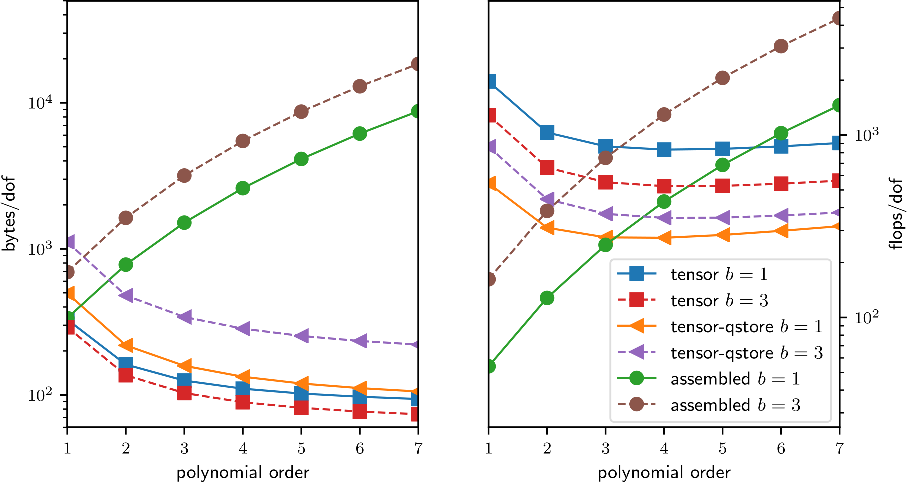
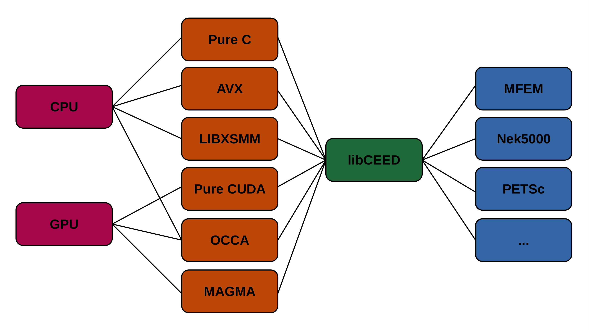
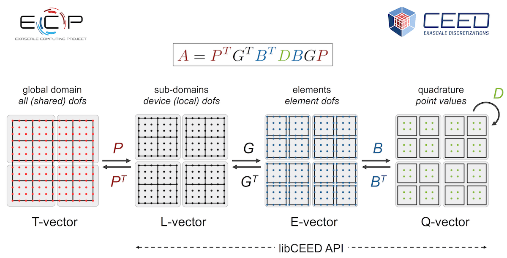

:author: Valeria Barra
:email: valeria.barra@colorado.edu
:institution: University of Colorado Boulder
:orcid: 0000-0003-1129-2056
:corresponding:

:author: Jed Brown
:email: jed@jedbrown.org
:institution: University of Colorado Boulder
:orcid: 0000-0002-9945-0639

:author: Jeremy Thompson
:email: jeremy.thompson@colorado.edu
:institution: University of Colorado Boulder
:orcid: 0000-0003-2980-0899

:author: Yohann Dudouit
:email: dudouit1@llnl.gov
:institution: Lawrence Livermore National Laboratory
:orcid: 0000-0001-5831-561X

:bibliography: bibliography

----------------------------------------------------------------------------------
High-performance operator evaluations with ease of use: libCEED's Python interface
----------------------------------------------------------------------------------

.. class:: abstract

   libCEED is a new lightweight, open-source library for high-performance matrix-free Finite Element computations.
   libCEED offers a portable interface to high-performance implementations, selectable at runtime, tuned for a variety of current and emerging computational architectures, including CPUs and GPUs.
   libCEED’s interface is purely algebraic, facilitating co-design with vendors and enabling unintrusive integration in new and legacy software.
   In this work, we present libCEED's newly-available Python interface, which opens up new strategies for parallelism and scaling in high-performance Python, without compromising ease of use.

.. class:: keywords

   High-performance Python, performance portability, scalability, parallelism, high-order finite elements

Introduction
----------------------------------------------------------------------------------

Historically, high-order Finite Element Methods (FEM) have seen very limited use for industrial problems because the matrix describing the action of the operator loses sparsity as the order is increased :cite:`Orszag1980`, leading to unaffordable solve times and memory requirements :cite:`brown2010`.
Consequently, most industrial applications have used at most quadratic polynomial bases, for which assembled matrices appear to be a good choice, at least when one seeks to minimize the number of floating point operations (FLOPs) per degree of freedom (DOF); see the right panel of Fig. :ref:`fig-assembledVsmatrix-free`.
Nowadays, high-order numerical methods, such as the spectral element method (SEM)—a special case of nodal p-Finite Element Method that can reuse the interpolation nodes for quadrature—are employed (e.g., in scientific computing packages such as MFEM :cite:`MFEMlibrary` and Nek5000 :cite:`Nekwebsite`), especially with applications for which implicit solves are limited to linear constant-coefficient separable equations on (nearly) affine elements, which can be efficiently solved with sum factorization and multigrid :cite:`LottesFischer`.

   Comparison of asymptotic memory transfer and floating point operations per degree of freedom for different representations of a linear operator for a PDE (on a 3D hexahedral mesh) with :math:`b` components and variable coefficients arising due to Newton linearization of a material nonlinearity. The representation labeled as *tensor* computes metric terms on the fly and stores a compact representation of the linearization at quadrature points. The representation labeled as *tensor-qstore* pulls the metric terms into the stored representation. The *assembled* representation uses a (block) CSR format. :label:`fig-assembledVsmatrix-free`

In Fig. :ref:`fig-assembledVsmatrix-free`, we analyze and compare the asymptotic costs of applying the action of a finite element matrix using different configurations: assembling the sparse matrix representing the action of the operator (labeled as *assembled*), applying the action without assembly while using a tensor-product decomposition of the basis and metric terms computed on the fly with a compact representation of the linearization stored at quadrature points (labeled as *tensor*), and similarly, but with a precomputed pull-back of the linearization to reference elements (labeled as *tensor-qstore*). In the right panel, we show the cost in terms of FLOPs/DOF. This metric for computational efficiency made sense historically, when performance was primarily limited by floating point arithmetic.
Memory bandwidth is the overwhelming bottleneck on today's machines, which can perform 40-100 FLOPs per floating point load from memory, and thus the left panel of Fig. :ref:`fig-assembledVsmatrix-free` becomes a more accurate performance model for modern architectures.
We can see that well-implemented high-order methods require low memory motion that decreases with polynomial order and FLOPs that are relatively insensitive to polynomial order for operator evaluation. Thus, high-order methods in matrix-free representation not only possess favorable properties, such as higher accuracy and faster convergence to solution, but also manifest an efficiency gain compared to their corresponding assembled representations.

For the reasons mentioned above, in recent years, high-order numerical methods have been widely used in Partial Differential Equation (PDE) solvers, but software packages that provide high-performance implementations have often been special-purpose and intrusive. In contrast, libCEED :cite:`libceed-dev-site`, the Code for Efficient Extensible Discretizations is light-weight, minimally intrusive, and very versatile. In fact, libCEED offers a purely algebraic interface for matrix-free operator representation and supports run-time selection of implementations tuned for a variety of computational device types, including CPUs and GPUs. libCEED's algebraic interface can unobtrusively be integrated in new and legacy software to provide performance portable interfaces. While libCEED's focus is on high-order finite elements, the approach is algebraic and thus applicable to other discretizations in factored form (e.g., spectral difference). libCEED's role, as a low-level library that allows a wide variety of applications to share highly optimized discretization kernels, is illustrated in Fig. :ref:`fig-libCEED-backends`, where a non-exhaustive list of specialized implementations (backends) is provided. libCEED provides a low-level Application Programming Interface (API) for user codes so that applications with their own discretization infrastructure (e.g., those in PETSc :cite:`PETScUserManual`, MFEM and Nek5000) can evaluate and use the core operations provided by libCEED. GPU implementations are available via pure CUDA :cite:`CUDAwebsite` as well as the OCCA :cite:`OCCAwebsite` and MAGMA :cite:`MAGMAwebsite` libraries. CPU implementations are available via pure C and AVX intrinsics as well as the LIBXSMM :cite:`LIBXSMM` library. libCEED provides a unified interface, so that users only need to write a single source code and can select the desired specialized implementation at run time. Moreover, each process or thread can instantiate an arbitrary number of backends.

   The role of libCEED as a lightweight, portable library that provides a low-level API for efficient, specialized implementations. libCEED allows different applications to share highly optimized discretization kernels. :label:`fig-libCEED-backends`

In this work, we first introduce libCEED’s conceptual model and interface, then illustrate its new Python interface, which was developed using the C Foreign Function Interface (CFFI) for Python. CFFI allows reuse of most of the C declarations and requires only a minimal adaptation of some of them. The C and Python APIs are mapped in a nearly 1:1 correspondence. For instance, a ``CeedVector`` object is exposed as ``libceed.Vector`` in Python, and may reference memory that is also accessed via Python arrays from the NumPy :cite:`NumPy` or Numba :cite:`Numba` packages, for handling host or device memory (when interested in GPU computations with CUDA). Flexible pointer handling in libCEED makes it easy to provide zero-copy host and (GPU) device support for any desired Python array container.

libCEED's API
----------------------------------------------------------------------------------

As illustrated in the Introduction, it is favorable to minimize memory motion, especially when computations are performed in parallel computing environments. In Finite Element codes that exploit data parallelism, the action of the operator can be described as *global*, when the operator is applied to data distributed across different nodes or compute devices, or *local*, when operating on a single portion of the data partition.
libCEED's API provides the local action of an operator (linear or nonlinear) without assembling its sparse representation. The purely algebraic nature of libCEED allows efficient operator evaluations (selectable at runtime) and offers matrix-free preconditioning ingredients.
While libCEED’s focus is on high-order finite elements, the approach with which it is designed is algebraic and thus applicable to other discretizations in factored form. This algebraic decomposition also presents the benefit that it can equally represent linear or non-linear finite element operators.

Let us define the global operator as

.. math::
   :label: eq-operator-decomposition

   A = P^T \underbrace{G^T B^T D B G}_{\text{libCEED's scope}} P \, ,

where :math:`P` is the parallel process decomposition operator (external to libCEED, which needs to be managed by the user via external packages, such as ``petsc4py`` :cite:`PETScUserManual,petsc4py`) in which the degrees of freedom (DOFs) are scattered to and gathered from the different compute devices. The operator denoted by :math:`A_L = G^T B^T D B G` gives the local action on a compute node or process, where :math:`G` is a local element restriction operation that localizes DOFs based on the elements, :math:`B` defines the action of the basis functions (or their gradients) on the nodes, and :math:`D` is the user-defined pointwise function describing the physics of the problem at the quadrature points, also called the QFunction (see Fig. :ref:`fig-operator-decomp`). Instead of forming a single operator using a sparse matrix representation, libCEED composes the different parts of the operator described in equation (:ref:`eq-operator-decomposition`) to apply the action of the operator :math:`A_L = G^T B^T D B G` in a fashion that is tuned for the different compute devices, according to the backend selected at run time.

In libCEED's terminology, the global or total vector is called a T-vector (cf. Fig. :ref:`fig-operator-decomp`). This stores the true degrees of freedom of the problem. In a T-vector, each unknown has exactly one copy, on exactly one processor, or rank. The process decomposition, denoted by :math:`P` in equation (:ref:`eq-operator-decomposition`), is a non-overlapping partitioning. The application of the operator :math:`P` to a T-vector results in an L-vector, or local vector. This stores the data owned by each rank. In an L-vector, each unknown has exactly one copy on each processor that owns an element containing it. This is an overlapping vector decomposition with overlaps only across different processors—there is no duplication of unknowns on a single processor. The nodes adjacent to different elements (at element corners or edges) will be the one that have more than one copy, on different processors. Applying an element restriction operator, denoted by :math:`G` in equation (:ref:`eq-operator-decomposition`), to an L-vector creates an E-vector. This stores the nodes grouped by the elements they belong to. In fact, in an E-vector each unknown has as many copies as the number of elements that contain it. The application of a basis operator :math:`B` to an E-vector returns a Q-vector. This has the same layout of an E-vector, but instead of holding the different unknown values, a Q-vector stores the values at quadrature points, grouped by element.

   Operator decomposition. :label:`fig-operator-decomp`

The mathematical formulation of QFunctions, described in weak form, is fully separated from the parallelization and meshing concerns. In fact, QFunctions, which can either be defined by the user or selected from a gallery of available built-in functions in the library, are pointwise functions that do not depend on element resolution, topology, or basis degree (selectable at run time). This easily allows :math:`hp`-refinement studies (where :math:`h` commonly denotes the average element size and :math:`p` the polynomial degree of the basis functions in 1D) and :math:`p`-multigrid solvers. libCEED also supports composition of different operators for multiphysics problems and mixed-element meshes (see Fig. :ref:`fig-schematic`). Currently, user-defined QFunctions are written in C and must be precompiled as a foreign function library and loaded via ``ctypes``. The single-source C QFunctions allow users to equally compute on CPU or GPU devices, all supported by libCEED. The ultimate goal is for users to write only Python code. This will be achieved in the near future by using the Numba high-performance Python compiler or Google's extensible system for composable function transformations, JAX :cite:`jax2018github`, which can use just-in-time (JIT) compilation to compile for coprocessors and speed-up executions when sequences of operations are performed.

.. figure:: QFunctionSketch.pdf
   :align: center
   :figclass: bht

   A schematic of element restriction and basis applicator operators for elements with different topology. This sketch shows the independence of QFunctions (in this case representing a Laplacian) element resolution, topology, or basis degree. :label:`fig-schematic`

Source Code Examples
----------------------------------------------------------------------------------
LibCEED for Python is distributed through PyPI :cite:`PyPI` and can be easily installed via

.. code-block:: bash

   $ pip install libceed

or

.. code-block:: bash

   $ python -m pip install libceed

The package can then be simply imported via

.. code-block:: python

   >>> import libceed

The simple declaration of a ``libceed.Ceed`` instance, with default resource (``/cpu/self``) can be obtained as

.. code-block:: python

   >>> ceed = libceed.Ceed()

If libCEED is built with GPU support, the user can specify a GPU backend, e.g., ``/gpu/occa`` or ``/gpu/cuda/gen``, with

.. code-block:: python

   >>> ceed = libceed.Ceed('/gpu/cuda/gen')

Next, we show the creation of a ``libceed.Vector`` of a specified size

.. code-block:: python

   >>> n = 10
   >>> x = ceed.Vector(n)

Similarly, this could have been achieved by running

.. code-block:: python

   >>> x = ceed.Vector(size=10)

In the following example, we associate the data stored in a ``libceed.Vector`` with a ``numpy.array`` and use it to set and read the ``libceed.Vector``'s data

.. code-block:: python

   >>> import numpy as np

   >>> x = ceed.Vector(size=3)

   >>> a = np.arange(1, 4, dtype="float64")
   >>> x.set_array(a, cmode=libceed.USE_POINTER)

   >>> with x.array_read() as b:
   ...     print(b)
   ...
   [1. 2. 3.]

Similarly, we can set all entries of a ``libceed.Vector`` to the same value (e.g., 10) via

.. code-block:: python

   >>> x.set_value(10)

If the user has installed libCEED with CUDA support and Numba, they can use device memory for ``libceed.Vector``\s. In the following example, we create a ``libceed.Vector`` with a libCEED context that supports CUDA, associate the data stored in a ``CeedVector`` with a ``numpy.array``, and get a Numba ``DeviceNDArray`` containing the data on the device.

.. code-block:: python

   >>> ceed_gpu = libceed.Ceed('/gpu/cuda')

   >>> n = 4
   >>> x = ceed_gpu.Vector(n)

   >>> a = np.arange(1, n + 1, dtype="float64")
   >>> x.set_array(a, cmode=libceed.USE_POINTER)

   >>> with x.array_read(memtype=libceed.MEM_DEVICE) as
           device_array:
   ...     print(device_array)
   ...
   [1. 2. 3. 4.]

Among the Finite Elements objects needed to compose an operator, in the following example we illustrate the creation and apply action of an element restriction, denoted by :math:`G` in equation (:ref:`eq-operator-decomposition`)

.. code-block:: python

   >>> ne = 3

   >>> x = ceed.Vector(ne+1)
   >>> a = np.arange(10, 10 + ne+1, dtype="float64")
   >>> x.set_array(a, cmode=libceed.USE_POINTER)

   >>> ind = np.zeros(2*ne, dtype="int32")
   >>> for i in range(ne):
   ...     ind[2*i+0] = i
   ...     ind[2*i+1] = i+1
   ...
   >>> r = ceed.ElemRestriction(ne, 2, 1, 1, ne+1, ind,
   ... cmode=libceed.USE_POINTER)

   >>> y = ceed.Vector(2*ne)
   >>> y.set_value(0)

   >>> r.apply(x, y)
   >>> with y.array_read() as y_array:
   ...     print('y =', y_array)
   ...
   y = [10. 11. 11. 12. 12. 13.]

An :math:`H^1` Lagrange basis in :math:`d` dimensions can be defined with the following code snippet

.. code-block:: python

   >>> d = 1
   >>> b = ceed.BasisTensorH1Lagrange(
   ... dim=d,   # topological dimension
   ... ncomp=1, # number of components
   ... P=2,     # number of basis functions (nodes)
   ...          # per dimension
   ... Q=2,     # number of quadrature points
   ...          # per dimension
   ... qmode=libceed.GAUSS_LOBATTO)
   >>> print(b)
   CeedBasis: dim=1 P=2 Q=2
         qref1d:	 -1.00000000	  1.00000000
      qweight1d:	  1.00000000	  1.00000000
       interp1d[0]:	  1.00000000	  0.00000000
       interp1d[1]:	  0.00000000	  1.00000000
         grad1d[0]:	 -0.50000000	  0.50000000
         grad1d[1]:	 -0.50000000	  0.50000000

In the following example, we show how to apply a 1D basis operator, denoted by :math:`B` in equation (:ref:`eq-operator-decomposition`), from an E-vector named ``Ev``, to a Q-vector named ``Qv``, and vice-versa, its transpose operator :math:`B^T`

.. code-block:: python

   >>> Q = 4
   >>> dim = 1
   >>> Xdim = 2**dim
   >>> Qdim = Q**dim
   >>> x = np.empty(Xdim*dim, dtype="float64")
   >>> for d in range(dim):
   ...     for i in range(Xdim):
   ...         x[d*Xdim + i] = 1 if (i % (2**(dim-d)))
   ... // (2**(dim-d-1)) else -1
   ...
   >>> Ev = ceed.Vector(Xdim*dim)
   >>> Ev.set_array(x, cmode=libceed.USE_POINTER)
   >>> Qv = ceed.Vector(Qdim*dim)
   >>> Qv.set_value(0)
   >>> bx = ceed.BasisTensorH1Lagrange(dim, dim, 2, Q,
   ... libceed.GAUSS_LOBATTO)
   >>> bx.apply(1, libceed.EVAL_INTERP, Ev, Qv)
   >>> print(Qv)
   CeedVector length 4
     -1.000000
     -0.447214
     0.447214
     1.000000

   >>> bx.T.apply(1, libceed.EVAL_INTERP, Qv, Ev)
   >>> print(Ev)
   CeedVector length 2
   -1.200000
   1.200000

In the following example, we create two QFunctions (for the setup and apply, respectively, of the mass operator in 1D) from the gallery of available built-in QFunctions in libCEED

.. code-block:: python

   >>> qf_setup = ceed.QFunctionByName("Mass1DBuild")
   >>> print(qf_setup)
   Gallery CeedQFunction Mass1DBuild
     2 Input Fields:
       Input Field [0]:
         Name: "dx"
         Size: 1
         EvalMode: "gradient"
       Input Field [1]:
         Name: "weights"
         Size: 1
         EvalMode: "quadrature weights"
     1 Output Field:
       Output Field [0]:
         Name: "qdata"
         Size: 1
         EvalMode: "none"

   >>> qf_mass = ceed.QFunctionByName("MassApply")
   >>> print(qf_mass)
   Gallery CeedQFunction MassApply
     2 Input Fields:
       Input Field [0]:
         Name: "u"
         Size: 1
         EvalMode: "interpolation"
       Input Field [1]:
         Name: "qdata"
         Size: 1
         EvalMode: "none"
     1 Output Field:
       Output Field [0]:
         Name: "v"
         Size: 1
         EvalMode: "interpolation"

The setup QFunction, named ``qf_setup`` in the previous example, is the one that defines the formulation of the geometric factors given by the correspondence between deformed finite element coordinates and reference ones. The apply QFunction, named ``qf_mass`` in the previous example, is the one that defines the action of the physics (in terms of the spatial discretization of the weak form of the PDE) the user wants to solve for. In this simple example, this represented the action of the mass matrix.

Finally, once all ingredients for a ``libceed.Operator`` are defined (i.e., element restriction, basis, and QFunction), one can create and apply a local operator as

.. code-block:: python

   >>> nelem = 15
   >>> P = 5
   >>> Q = 8
   >>> nx = nelem + 1
   >>> nu = nelem*(P-1) + 1

   >>> # Vectors
   >>> x = ceed.Vector(nx)
   >>> x_array = np.zeros(nx)
   >>> for i in range(nx):
   ...     x_array[i] = i / (nx - 1.0)
   ...
   >>> x.set_array(x_array, cmode=libceed.USE_POINTER)
   >>> qdata = ceed.Vector(nelem*Q)
   >>> u = ceed.Vector(nu)
   >>> v = ceed.Vector(nu)

   >>> # Restrictions
   >>> indx = np.zeros(nx*2, dtype="int32")
   >>> for i in range(nx):
   ...     indx[2*i+0] = i
   ...     indx[2*i+1] = i+1
   ...
   >>> rx = ceed.ElemRestriction(nelem, 2, 1, 1, nx, indx,
   ... cmode=libceed.USE_POINTER)
   >>> indu = np.zeros(nelem*P, dtype="int32")
   >>> for i in range(nelem):
   ...     for j in range(P):
   ...         indu[P*i+j] = i*(P-1) + j
   ...
   >>> ru = ceed.ElemRestriction(nelem, P, 1, 1, nu, indu,
   ... cmode=libceed.USE_POINTER)
   >>> strides = np.array([1, Q, Q], dtype="int32")
   >>> rui = ceed.StridedElemRestriction(nelem, Q, 1,
   ... Q*nelem, strides)

   >>> # Bases
   >>> bx = ceed.BasisTensorH1Lagrange(1, 1, 2, Q,
   ... libceed.GAUSS)
   >>> bu = ceed.BasisTensorH1Lagrange(1, 1, P, Q,
   ... libceed.GAUSS)

   >>> # QFunctions
   >>> qf_setup = ceed.QFunctionByName("Mass1DBuild")
   >>> qf_mass = ceed.QFunctionByName("MassApply")

   >>> # Setup operator
   >>> op_setup = ceed.Operator(qf_setup)
   >>> op_setup.set_field("dx", rx, bx,
   ... libceed.VECTOR_ACTIVE)
   >>> op_setup.set_field("weights",
   ... libceed.ELEMRESTRICTION_NONE, bx,
   ... libceed.VECTOR_NONE)
   >>> op_setup.set_field("qdata", rui,
   ... libceed.BASIS_COLLOCATED,
   ... libceed.VECTOR_ACTIVE)
   >>> print('Setup operator: ', op_setup)
   Setup operator:  CeedOperator
     3 Fields
     2 Input Fields:
       Input Field [0]:
         Name: "dx"
         Active vector
       Input Field [1]:
         Name: "weights"
         No vector
     1 Output Field:
       Output Field [0]:
         Name: "dx"
         Collocated basis
         Active vector

   >>> # Apply Setup operator
   >>> op_setup.apply(x, qdata)

For all of the illustrated classes of objects, ``libceed.Ceed``, ``libceed.Vector``, ``libceed.ElemRestriction``, ``libceed.Basis``, ``libceed.QFunction``, and ``libceed.Operator``, libCEED's Python interface provides a representation method so that they can be viewed/printed by simply typing

.. code-block:: python

   >>> print(x)

These and other examples can be found in the suite of Project Jupyter :cite:`ProjectJupyter` tutorials provided with libCEED in a Binder :cite:`libCEEDBinder` interactive environment, accessible on libCEED's development site :cite:`libceed-dev-site`. Finally, examples of integration of libCEED with other packages in the co-design Center for Efficient Exascale Discretizations (CEED), such as PETSc, MFEM, and Nek5000, can be found in the CEED distribution, which provides the full CEED software ecosystem :cite:`CEEDMS25,CEEDMS34`.

Conclusions
----------------------------------------------------------------------------------

We have presented libCEED, a new lightweight, open-source, matrix-free Finite Element library, its conceptual framework, and new Python interface. libCEED’s purely algebraic framework can unobtrusively be integrated in new and legacy software to provide performance portable applications. In this work, we have demonstrated the usage of libCEED's Python interface by providing examples of the creation and application of the main classes in libCEED's API: ``libceed.Ceed``, ``libceed.Vector``, ``libceed.ElemRestriction``, ``libceed.Basis``, ``libceed.QFunction``, and ``libceed.Operator``. We have showed how libCEED's simple interface allows for easy and composable library reuse and can open up new strategies for parallelism and scaling in high-performance Python.

Acknowledgments
----------------------------------------------------------------------------------

The libCEED library is distributed under a BSD 2-Clause License with Copyright (c) 2017 of the Lawrence Livermore National Security, LLC. The work presented in this paper is supported by the Exascale Computing Project (17-SC-20-SC), a collaborative effort of two U. S. Department of Energy Organizations (the Office of Science and the National Nuclear Security Administration) responsible for the planning and preparation of a capable exascale ecosystem, including software, applications, hardware, advanced system engineering and early testbed platforms, in support of the nation’s exascale computing imperative.

References
----------------------------------------------------------------------------------
