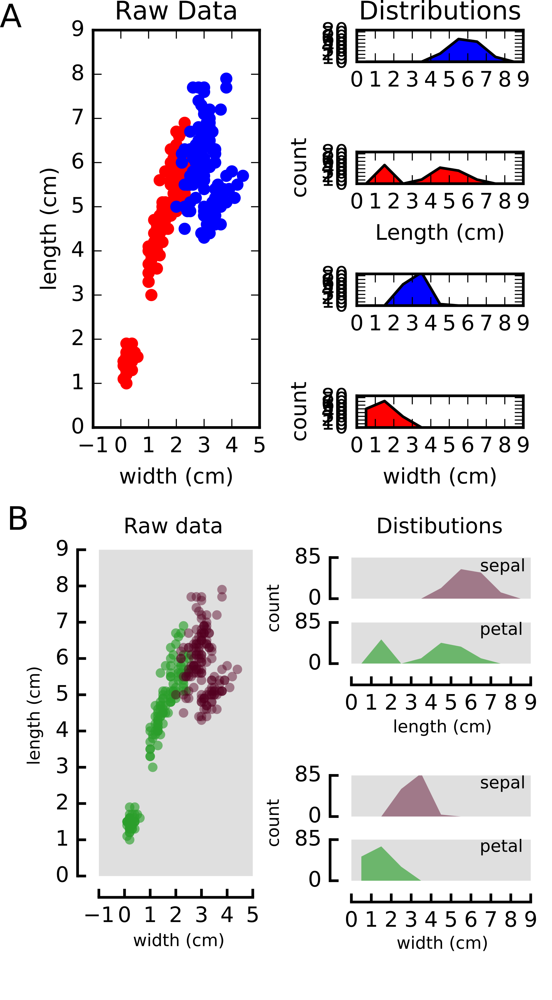
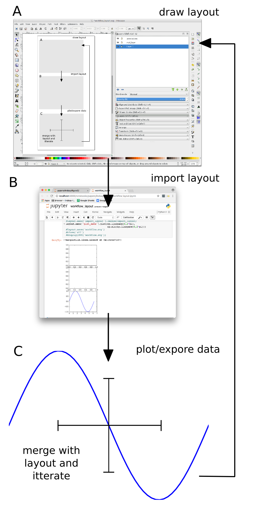
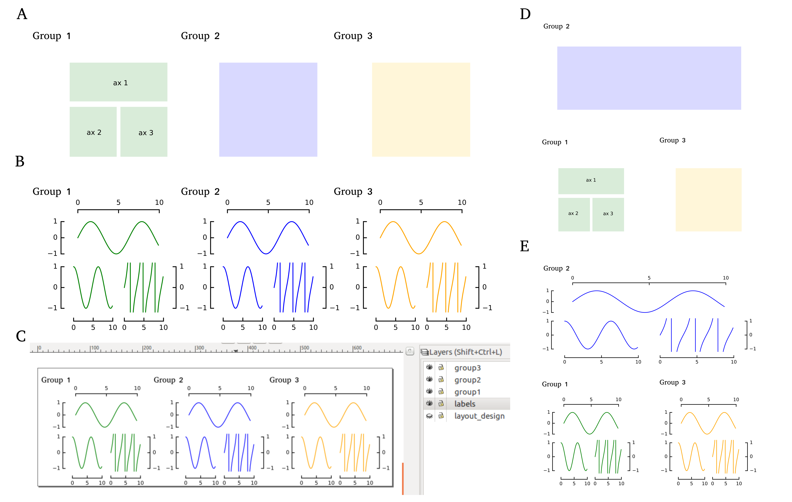
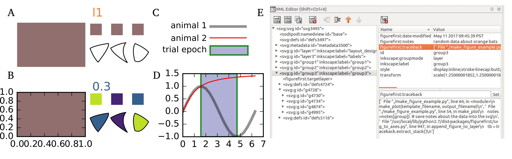

:author: Theodore Lindsay
:email: thlindsay1@gmail.com
:institution: Caltech Division of Biology and Biological Engineering
:author: Peter T. Weir
:email: peter.weir@gmail.com
:institution: Yelp

:author: Floris van Breugel
:email: florisvb@gmail.com
:institution: University of Washington
:corresponding:

:github: http://flyranch.github.io/FigureFirst/

-----------------------------------------------------------
FigureFirst: A Layout-first Approach for Scientific Figures
-----------------------------------------------------------

.. class:: abstract

One major reason that Python has been widely adopted as a scientific computing platform is the availability of powerful visualization libraries. Although these tools facilitate discovery and data exploration, they are difficult to use when constructing the sometimes-intricate figures required to advance the narrative of a scientific manuscript. For this reason, figure creation often follows an inefficient serial process, where simple representations of raw data are constructed in analysis software and then imported into desktop publishing software to construct the final figure. Though the graphical user interface of publishing software is uniquely tailored to the production of publication quality layouts, once the data are imported, all edits must be re-applied if the analysis code or underlying dataset changes. 
Here we introduce a new Python package, FigureFirst, that allows users to design figures and analyze data in a parallel fashion, making it easy to generate and continuously update aesthetically pleasing and informative figures directly from raw data. To accomplish this, FigureFirst acts as a bridge between the Scalable Vector Graphics (SVG) format and Matplotlib [Hunter08]_ plotting in Python. 
With FigureFirst, the user specifies the layout of a figure by drawing a set of rectangles on the page using a standard SVG editor such as Inkscape [Altert13]_. In Python, FigureFirst uses this layout file to generate Matplotlib figures and axes in which the user can plot the data. Additionally, FigureFirst saves the populated figures back into the original SVG layout file. This functionality allows the user to adjust the layout in Inkscape, then run the script again, updating the data layers to match the new layout.
Building on this architecture, we have implemented a number of features that make complex tasks remarkably easy including axis templates; changing attributes of standard SVG items such as their size, shape, color, and text; and an API for adding JessyInk [Jagannathan12]_ extensions to Matplotlib objects for automatically generating animated slide presentations. We have used FigureFirst to generate figures for several publications currently in preparation and in press [Lindsay17]_.  We provide code and the layouts for the figures presented in this manuscript at our GitHub page: http://flyranch.github.io/figurefirst/.

.. class:: keywords

   plotting, figures, SVG, Matplotlib

Introduction
------------

Visualization has long been a critical element in the iterative process of science. Skill with the pen allowed the early pioneers of the scientific revolution to share, explain, and convince: Galileo was trained in the Florentine Accademie delle Arti del Disegno; and the intricate drawings of Da Vinci and Vesalius served to overturn Galen’s entrenched theories—with Vesalius's historic textbook paving the way for William Harvey's discovery of a unified circulatory system [Aird11]_.

Although new web-enabled media formats are emerging to provide alternative mechanisms for scientific communication, the static printed publication remains the centerpiece of scientific discourse. A well-designed sequence of data-rich figures makes it easy for other researchers across disciplines to follow the narrative, assess the quality of the data, criticize the work, and remember the conclusions. In fact, the importance of the narrative in organizing and structuring the logic of research has led some to propose that writing the manuscript should be a more integral part of the original design and execution of experiments [Whitesides04]_. According to this view, the researcher should create a text outline, as well as a visual story-board, long before all the data have been collected and analyzed. As new results come to light, the story-board is updated with new data and new experiments.  

   Figurefirst allows the plotting axes in a multi-panel figure to be quickly placed in a flexible and meaningfull way. (A) A plot of the iris dataset created using the Matplotlib and gridspec API. (B) The same data plotted using FigureFirst. Note that the less rigid placement of axes helps highlight the inherent structure of the data. The full 27-line script used to create this panel can be found in the `Summary and Future Directions`_ section.

From a practical standpoint, taking this iterative approach with data-rich figures is challenging because desktop publishing and illustration software is not integrated with scientific analysis software, and using the Matplotlib API to directly specify plotting details is time consuming (Fig. 1). A few of the commercial software packages such as MATLAB(TM) and SigmaPlot(TM) provide some graphical tools to assist in figure layout, but these are severely limited compared to those available in vector graphics software such as Inkscape or Adobe Illustrator(TM), especially when creating multi-panel figures. For this reason, figure generation usually follows a unidirectional workflow in which authors first write code to analyze and plot the raw data, and only later do they import the figures into desktop publishing software for final editing and styling for press. 

We created the open-source FigureFirst library to enable interoperability between open-source plotting and analysis tools available in Python (e.g. Matplotlib) and the graphical user interface provided by Scalable Vector Graphics (SVG) editors such as the open-source application Inkscape. By drawing a series of boxes in a blank SVG document, a researcher may rapidly generate a prototype of a multi-panel figure, and then populate this figure using powerful analysis and plotting functions in Python. The FigureFirst library allows the user to insert these plots back into the prototype SVG document, completing the loop between visualization and analysis. As data are collected, individual sub-panels in the figure may be populated, moved, resized or removed as the events of the ongoing study warrant. In this manner, the library facilitates a more iterative approach to this key aspect of the scientific method. Finally, by embedding information about the scripts used to generate the final figures within the SVG document itself, FigureFirst makes it possible to store an automatically updated and complete log of the transformation from raw data to a publication quality figure, encapsulating the analysis routine within the final figure. Thus, every step of the process may be kept under version control and published along with the manuscript, greatly increasing the transparency and reproducibility of the final publication.

Below we provide a short overview of the interface to the library in the `Basic Usage`_ section. We discuss more details on how to generate a layout file using Inkscape and xml tags in the `Groups and Templates`_ section. The `Architecture`_ section contains a more detailed description of the library for those interested in contributing to the project.

Basic Usage
-----------

With FigureFirst creating a new figure generally involves four steps:

1) **Design the layout file.** (Fig. 2A) Fundamentally this step entails decorating a specific subset of the objects in the SVG file with xml tags that identify what objects FigureFirst should expose to Python. For instance, the user specifies a Matplotlib axis by tagging an SVG :code:`<rect/>` with the :code:`<figurefirst:axis>` tag. If using Inkscape, we facilitate this step with a number of optional Inkscape extensions (Fig. 3).

2) **Import the layout into Python.** (Fig. 2B) Construct a :code:`FigureLayout` object with the path to the layout file and then call the :code:`make_mplfigures()` method of this object to generate :code:`Matplotlib` figures and axes as specified in the layout.

3) **Plot data.** (Fig. 2C) All the newly created figure axes are available within the :code:`axes` dictionary of the :code:`FigureLayout` object.

4) **Save to SVG.** SVG graphics are merged with Matplotlib figures, allowing complex vector art to be quickly incorporated as overlays or underlays to your data presentation.

As an example, to generate Figure 2 we used Inkscape to construct a .SVG document called 'workflow_layout.SVG' containing a layer with three gray rectangles. We then used the tag axis Inkscape extension (Figure 3) to identify each :code:`<rect/>` with a  :code:`<figurefirst:axes>` tag that has a unique name as an attribute. For instance, we tagged the gray rectangle that became panel C with :code:`<figurefirst:axis figurefirst:name="plot_data" />.` In this example we have drawn in the axes spines and included this with the arrows and other annotations on a separate layer in the .SVG file to illustrate one way to use vector art overlays in a layout document. 

   Overview of the iterative layout-based approach to figure creation using FigureFirst. (A) The user designs a figure layout in SVG, specifying the location and aspect-ratio of plotting axes. Additional vector art such as arrows or stylized axes spines can be included in the layout document. (B) FigureFirst interprets the layout document and generates Matplotlib axes and figures that the user can use to plot in Python. (C) When saving, the generated plots are merged with the original layout to incorporate the non-Matplotlib graphics. Note that this approach allows changes to the figure layout or analysis code to be applied at any point in the workflow.

In Python we may then use the FigureFirst module to plot some data to this axis using the following code:

.. code-block:: python
   :linenos:

   import figurefirst as fifi
   layout = fifi.FigureLayout('workflow_layout.SVG')
   layout.make_mplfigures()
   fifi.mpl_functions.kill_all_spines(layout)
   x = np.linspace(0,2*pi); y = np.sin(x)
   layout.axes['plot_data'].plot(x,y)
   layout.save('workflow.SVG')

Lines 2 and 3 are responsible for parsing the layout document and generating the Matplotlib figures. In line 4 we pass the layout to a helper function in the mpl_functions submodule that removes the axes spines from all the axes contained within the layout. Lines 5-6 plot the data and line 7 saves the layout to a new SVG document called 'workflow.SVG' with all the Matplotlib axes associated with this figure inserted into a new layer. Because usually one will want to use Matplotlib to generate the axis spines we have included an auxiliary submodule called :code:`mpl_functions` that contains a number of utility functions that operate on figures generated from layouts to apply consistent spine-styles and formats accross the axes of a figure. The rest of the figure panels were also generated in Python by simply calling :code:`layout['panel_name'].imshow(screenshot_image)`. Note that there is nothing keeping us from using this new document as a layout document itself, enabling the placement of vector graphics objects in relation to plotted features.

Groups and Templates
--------------------

Because the :code:`figurefirst:name` attribute of the tagged :code:`<rect>` will be used as the key in the layout.axes dictionary in Python, each panel in this example must be given a unique name. Generating these names can be a cumbersome requirement because scientific data often have a nested or hierarchical structure. Moreover, we found that when generating the code to plot a figure, it is useful if the organization of the layout document reflects the underlying data. Thus, we have provided two mechanisms to allow a hierarchical structure in the labels associated with a layout: groups and templates. Though the interfaces for working with these objects differ, they both generate a nested structure in the :code:`layout.axes` dictionary. 

.. figure:: figure3/simple_dialogue_xml_editor.png
   :scale: 80%
   :align: center

   Screenshots of Inkscape illustrating the two mechanisms for applying the correct xml tags, which are used by FigureFirst to generate Matplotlib axes. (A) A dialog box allows the user to tag a rectangle as a FigureFirst axis. (B) The user can edit the document's XML directly using Inkscape's XML editor.

   Creating and rearranging multi-panel figures using FigureFirst's template feature. (A) Layout for a figure. (B) Output. (C) Inkscape screenshot illustrating the layered structure. (D) Rearranged layout. (E) Output for the new layout (code remains identical). The code used to generate these figures is available as a Jupyter Notebook on our github page: https://github.com/FlyRanch/FigureFirst/blob/master/examples/figure_groups_and_templates/figure_templates_example.ipynb

When using groups, the hierarchy is specified in SVG by enclosing a set of tagged axes within the :code:`<g>` container that itself is tagged with :code:`<figurefirst:group>` using a :code:`figurefirst:name` attribute. The axes are then exposed to the user in Python within the :code:`layout.axes` dictionary keyed by tuples that contain the path in the hierarchy e.g. :code:`myaxes = layout.axes[(groupname, axisname)]`. 

Though groups allow for arbitrary nesting structure within the layout, it is common in scientific figures for a single display motif to be replicated multiple times in a multi-panel figure. For instance, one might want to plot data from a series of similar experiments performed under different conditions. In this case, the template feature allows for rapid design and modification of the layout without the need to tag each individual axis.

To illustrate the template feature, consider the task of making a more complex figure that describes three behavioral metrics for three different animals. With FigureFirst, the user can draw the layout for one of the animals, and then use this layout as a template for the other two (Fig. 4A-B). Later one can add, remove, or change the relative sizes of the axes in all three figures simply by editing the single template. In this example, each of the three groups was created using a new Matplotlib figure, which was then saved to a separate layer in the SVG file (Fig. 4C). Below is an excerpt of the code used to load the layout from Figure 3A, iterating through three groups and plotting the relevant data into a separate layer for each group (Fig. 4B-C). The complete code is available on our github page as a Jupyter notebook: https://github.com/FlyRanch/FigureFirst/blob/master/examples/figure_groups_and_templates/figure_templates_example.ipynb. 

.. code-block:: python
   :linenos:

    import figurefirst as fifi 
    layout = fifi.FigureLayout(template_filename)
    layout.make_mplfigures()

    for group in ['group1', 'group2', 'group3']:
      for ax in ['ax1', 'ax2', 'ax3']:
         mpl_axis = layout.axes[(group, ax)]
         mpl_axis.plot(x_data, y_data,
                       color=colors[group])

      layout.append_figure_to_layer(
         layout.figures[group], group)

    layout.write_svg(output_filename)

Additional SVG/Python interoperability
--------------------------------------

The decorator language we use for the FigureFirst xml tags is general, and we extended it to provide a simple mechanism for passing additional information back and forth between Python and SVG. This enables a few additional features we refer to as axis methods, path specs, xml passing, Python tracebacks and SVG items.

The axis methods feature allows the user to include Python code in the layout document to be applied to all the corresponding Matplotlib axes *en mass* when the :code:`layout.apply_mpl_methods()` function is called in Python. Axis methods are enabled by adding an appropriate attribute to the :code:`<figurefirst:axis>` tag. The value of this attribute will be parsed and passed as arguments to the method. For instance to specify the y limits of an axis to (0, 250) add the :code:`figurefirst:set_ylim="0,250"` attribute to the corresponding :code:`<figurefirst:axis>` tag.

In keeping with the notion that vector editing software is better suited for designing the visual landscape of a figure than code, we created the :code:`<figurefirst:pathspec>` or :code:`<figurefirst:patchspec>` tag to create a way for users to generate a palette of line and patch styles within the layout document and pass these to plotting functions in Python. Using this feature, a user can explore different stroke widths, colors and transparencies in Inkscape and then quickly pass these styles as keyword arguments to Matplotlib plotting functions. 

   Additional features that use FigureFirst as an interface layer between SVG and Python. (A-B) SVGitems allows the attributes of SVG objects in the layout document to be to be edited and modified in Python. In the layout (A) the text item I1, the three small :code:`<rects/>` as well as the three :code:`<path/>` objects are tagged with :code:`<figurefirst:SVGitem figurefirst:name=somename>` allowing the text and color of the objects to be changed in the final output shown in B. (C-D) Using :code:`<figurefirst:pathspec>` and :code:`<figurefirst:patchspec>` a palette of line or patch styles respectively, can be defined in SVG (C) and then passed as keyword arguments to Matplotlib plotting functions to generate the plot in D. (E) FigureFirst simplifies keeping track of when, how, and why your figures are created by embedding the time modified, user notes, and full traceback directly into each FigureFirst generated layer. 

The two tools described above allow the user to pass information from SVG to Python; we have also implemented features that allow data to be passed from Python back into SVG. For instance the :code:`pass_xml()` method of the layout class can be used to identify axes as slides in a JessyInk (https://launchpad.net/jessyink) presentation, or attach mousover events or even custom javascript routines to a plotted path.

FigureFirst can also expose many types of SVG objects including text, patches, and circles to Python by tagging the object with the :code:`<figurefirst:SVGitem>` tag (Fig. 5C-D). This makes it possible to use the Inkscape user interface to place labels, arrows, etc. while using Python to edit their attributes based on the data.

When quickly prototyping analysis and figures, it is easy to lose track of when you have updated a figure, and what code you used to generate it. FigureFirst allows the user to embed traceback information, time modified, and custom notes into the SVG file directly using the following option. See Figure 4E for a screenshot of the Inkscape output.

.. code-block:: python

   layout.append_figure_to_layer(layout.figures[group], 
                                 group, 
                                 save_traceback=True,
                                 notes=notes[group])

In the future, we plan to expand the traceback capability by optionally linking the traceback to a github page so that when a FigureFirst generated SVG file is shared, other viewers can quickly find the code and data used to generate the figure. This option would directly and automatically link the scientific publication with the data and software, thereby facilitating open science with minimal user overhead. Alternatively, for simple and standalone Python scripts, it would be possible to embed the scripts directly into the xml.

Architecture
------------

FigureFirst uses a minimal Document Object Model interface (xml.dom.minidom) to parse and write to an SVG file. We define a set of xml tags that the user may use to decorate a subset of SVG objects. Our library then exposes these objects to Python, where they are used, for example, to generate Matplotlib axes. We use the :code:`<figurefirst:>` namespace in our xml to ensure that these tags will not collide with any other tags in the document.

When constructing a :code:`figurefirst.FigureLayout`, FigureFirst parses the SVG document and transforms tagged SVG elements into a Python object that holds the key graphical data specified by SVG. For instance, as mentioned above, a box tagged with :code:`<figurefirst:axis>` will be used to create a :code:`FigureFirst.Axis` object that contains the x,y position of the origin, as well as the height and width of the tagged box. In the case that the tagged SVG objects are subject to geometric transforms from enclosing containers, FigureFirst will compose the transforms and apply them to the origin, height, and width coordinates of the Matplotlib axes so that the resulting Matplotlib figure matches what is seen by the user when the layout is rendered in Inkscape.

Within a :code:`figurefirst.FigureLayout` object, axes objects are organized within a grouping hierarchy specified by the SVG groups or Inkscape layers that enclose the tagged box. Like the axes, these groups and layers are exposed to FigureFirst using xml tags: :code:`<figurefirst:group>` and :code:`<figurefirst:figure>` respectively. 

We use Inkscape layers as the top level of the grouping hierarchy. Each layer generatea a new Matplotlib figure instance that holds the enclosed :code:`<figurefirst:axis>` objects, and the dimensions of these figures are determined by the dimensions of the SVG document. Additional levels of grouping are specified by tagging groups with the :code:`<figurefirst:group>` tag. In the case that a :code:`<figurefirst:figure>` tag is not indicated, all the axes of the document are collected into the default figure with the name :code:`'none'`. 

The :code:`<figurefirst:figure>` tag can also be used at the level of groups and individual boxes to support figure templates. Templates allow a sub-layout prototype to be replicated multiple times within the context of a larger document. To use templates a group of :code:`<figurefirst:axis>` boxes is tagged with a :code:`<figurefirst:figure>` tag. This template is then targeted to single boxes that are tagged with the :code:`<figurefirst:figure>` that contains a :code:`<figurefirst:template>` attribute indicating the name of the template to use. The template is subsequently scaled and translated to fit within the bounds of the target.

Summary and Future Directions
-----------------------------

Matplotlib provides a rich and powerful low-level API that allows exquisite control over every aspect of a plot. Although high level interfaces such as subplot and gridspec that attempt to simplify the layout of a figure exist, these do not always meet the demands of a visualization problem. For example, consider Fig. 1 where we plot the raw data and marginal distributions from Fisher's iris dataset [Fisher36]_. In Fig. 1A we use the gridspec API to construct a 2X4 grid, and then define the axes within the constraints of this grid. Compare this to Fig. 1B where we use figurefirst to plot into a layout. Not only does careful placing of the plotting axes make better use of the figure space, but the spacing emphasizes certain comparisons over others. Of course, it is entirely possible to construct a nearly identical figure using the Matploltib API, however this would require writing functions that manually specify each axis location or contain a considerable amount of layout logic. In addition to being rather lengthy, it would be difficult to write these functions in a way that generalizes across figures. In contrast, as shown below, only 27 lines of code were required to load the data and plot Fig. 1B using FigureFirst. Note that nearly all the styling information is encapsulated within the layout document. In fact, in the case of the marginal distributions, we use the names from the layout to index into our Python data structure (line 21), thus the layout even specifies what data to plot and where. 

.. code-block:: python
   :linenos:

    from sklearn import datasets
    import numpy as np
    import figurefirst as fifi
    d = datasets.load_iris()
    data = dict()
    for n,v in zip(d.feature_names,d.data.T):
        data[tuple(n.split()[:2][::-1])] = v
    layout = fifi.FigureLayout('example_layout.svg')
    layout.make_mplfigures()
    kwa = layout.pathspecs['petal'].mplkwargs()
    layout.axes['raw'].scatter(data['width','petal'],
                               data['length','petal'],
                               **kwa)
    kwa = layout.pathspecs['sepal'].mplkwargs()
    layout.axes['raw'].scatter(data['width','sepal'],
                               data['length','sepal'],
                               **kwa)
    for key in layout.axes.keys() :
        if key in data.keys():
            kwa = layout.pathspecs[key[1]].mplkwargs()
            counts,b = np.histogram(data[key],
                                    np.arange(0,11))
            layout.axes[key].fill_between(
                            b[:-1]+0.5,0,counts,**kwa)
    layout.apply_mpl_methods()
    fifi.mpl_functions.set_spines(layout)
    layout.save('example.svg')

The use of layout documents to structure graphical elements is common in many domains of computer science, including the design of graphical user interfaces and the organization of web pages. FigureFirst takes this concept and applies it to the construction of scientific figures. This approach makes it possible to update figures with new data independently (saving computational time). Often when working on a scientific figure early in the process, the overall layout and figure size is unknown. Or perhaps the figure needs to be reformatted for a different journal's size, or for a poster or slide format. With FigureFirst these changes are as easy as rearranging the rectangles in Inkscape, and rerunning the same code (Fig. 4D-E). This workflow exemplifies the key contribution of FigureFirst: separating figure layout from data analysis, so that the software is not cluttered with code to generate the layout, and allowing for quick reorganization. 

Thus far, we have focused our development efforts on using FigureFirst in conjunction with Inkscape. Inkscape is convenient in that it is (a) open source, (b) has a strong feature set, (c) uses the open SVG standard, (d) is available for all major operating systems, and (e) has a built-in xml editor. In principle, however, any SVG-compatible graphical layout software can be used (e.g. Adobe Illustrator). In the future we plan to test other user interfaces to help increase our user base. Adobe Illustrator unfortunately does not use the same open SVG standard as Inkscape, so adding full support for Illustrator will require signficant effort, though it is possible and we will continue to explore that direction. Furthermore, developing a Javascript-based SVG editor that could easily decorate a SVG file with FigureFirst tags could then be employed as a Jupyter notebook extension to facilitate quick FigureFirst layout creation within a Jupyter session. In the meantime, layouts can be created externally and the following code can be used to display the output.SVG in the notebook:

.. code-block:: python

   from IPython.display import display,SVG
   display(SVG(output.svg))

Presently, the most serious performance issue with FigureFirst is that large Matplotlib collections are difficult for Inkscape to render efficiently. This can be circumvented by utilizing the Matplotlib axis method :code:`<set_rasterization_zorder(N)>` to rasterize large collections of patches. Other SVG rendering engines, such as the ones used by Google Chrome and Adobe Illustrator, have fewer problems, suggesting that this is a solvable issue. 

As described previously in the `Additional SVG/Python Interoperability`_ section, we have implemented a simple method of embedding Python traceback information into the output SVG generated by FigureFirst. Linking this traceback with online repositories and data will make it possible for readers to easily access the data and code in an organized way, rearrange the presentation for their own needs, or apply the same analysis to a new dataset. In this way, FigureFirst simultaneously decouples the tasks of layout, analysis, and data sharing, while keeping them intimately connected, making open science easy and hassle free.

Acknowledgements
-----------------------------
We conceived and began work on FigureFirst in lab of Michael Dickinson at Caltech, supported by a grant from the National Science Foundation (IOS 1452510).

.. [Aird11] W. C. Aird. *Discovery of the cardiovascular system: from Galen to William Harvey.*, 
            Journal of Thrombosis and Haemostasis, 9 (Suppl. 1): 118-129, July 2011. https://doi.org/10.1111/j.1538-7836.2011.04312.x
.. [Altert13] M Albert, J. Andler, T. Bah, P. Barbry-Blot, J. Barraud, B. Baxter  *Inkscape.*, 
            http://www.inkscape.org , 2013.
.. [Fisher36] R. A. Fisher *The use of multiple measurements in taxonomic problems.*, 
            Ann. Hum. Genet. 7 (2): 179-188, 1936. https://doi.org/10.1111/j.1469-1809.1936.tb02137.x
.. [Hunter08] John D. Hunter.  *Matplotlib: A 2D graphics environment.*,
            Computing In Science & Engineering 9.3: 90-95, 2007. https://doi.org/10.1109/MCSE.2007.55
.. [Jagannathan12] Arvind Krishnaa Jagannathan, Srikrishnan Suresh, and Vishal Gautham Venkataraaman. *A Canvas-Based Presentation Tool Using Scalable Vector Graphics.*, 
            2012 IEEE Fourth International Conference on Technology for Education. 2012. https://doi.org/10.1109/T4E.2012.35
.. [Lindsay17] T. H. Lindsay, A. Sustar and M. Dickinson, *The Function and Organization of the Motor System Controlling Flight Maneuvers in Flies.*, 
            Curr Biol. 27(3):345-358, 2017. https://doi.org/10.1016/j.cub.2016.12.018
.. [Whitesides04] George M. Whitesides,  *'Whitesides' group: writing a paper.*,
            Advanced Materials 16.15: 1375-1377. 2004. https://doi.org/10.1002/adma.200400767
