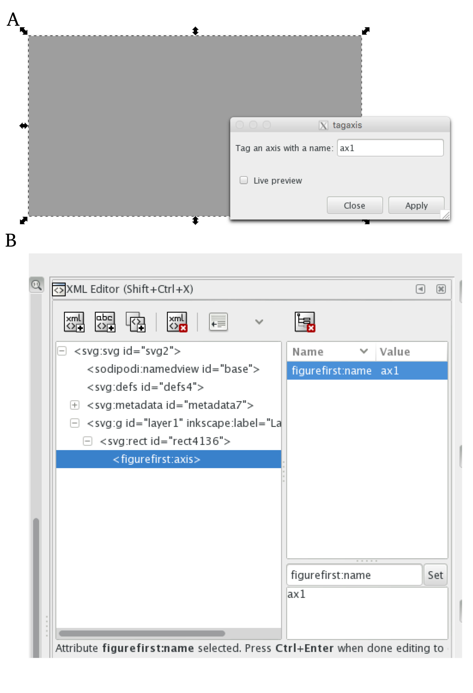
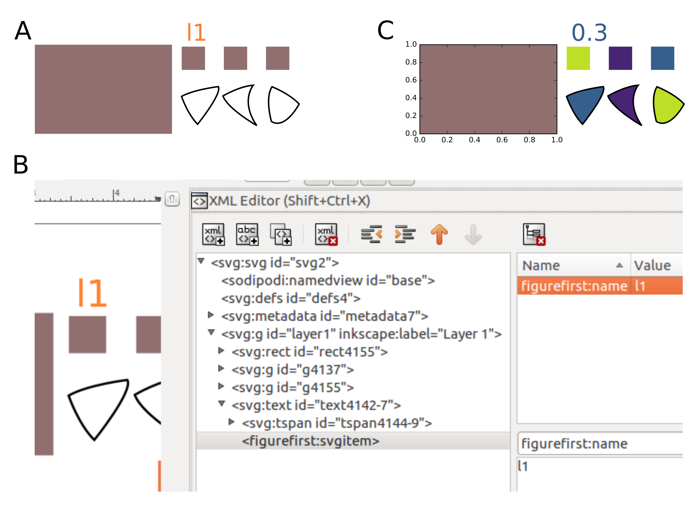
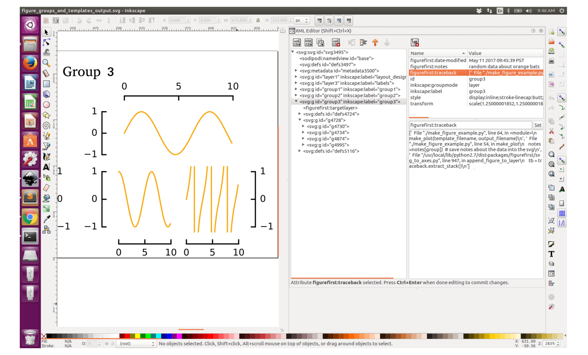

:author: Theodore Lindsay
:email: thlindsay1@gmail.com
:institution: Caltech

:author: Peter Weir
:email: peter.weir@gmail.com
:institution: Yelp

:author: Floris van Breugel
:email: florisvb@gmail.com
:institution: University of Washington
:corresponding:

:github: http://flyranch.github.io/figurefirst/

-----------------------------------------------------------
FigureFirst: A Layout First Approach for Scientific Figures
-----------------------------------------------------------

.. class:: abstract

One major reason that Python has been widely adopted as a scientific computing platform is the availability of powerful visualization libraries. Although these tools facilitate discovery and data exploration, they are difficult to use when constructing complex figures required to advance the narrative of a scientific manuscript. For this reason, figure creation often follows an inefficient serial process, where simple representations of raw data are constructed in analysis software and then imported into desktop publishing software to construct the final figure. Though the graphical user interface of publishing software is uniquely tailored to the production publication quality layouts, once the data are imported, all edits must be re-applied if the analysis code or raw data changes. 
Here we introduce a new Python package, FigureFirst, that allows users to lay out figures and  analyze data in a parallel fashion, making it easy to generate and continuously update aesthetically pleasing and informative figures directly from raw data. To accomplish this, FigureFirst acts as a bridge between the Scalable Vector Graphics (svg) format and MatPlotLib plotting in Python. 
To use FigureFirst, the user uses a standard svg editor such as Inkscape to specify the layout of their figure by drawing a set of rectangles on a page. In Python, FigureFirst will use this layout file to generate matplotlib figures and axes that the user can use to plot their data. Additionally, FigureFirst will save the populated figures back into the original svg layout file. This means that after making adjustments to the layout in Inkscape, the script can be run again, updating the data layers to match the new layout.
Building on this architecture we have implemented a number of features that make complex tasks remarkably easy including axis templates; changing attributes of standard svg items such as their size, shape, color, and text; and an api for adding JessyInk extensions to matplotlib objects for automatically generating animated slide presentations. In fact, our presentation will be entirely created by using FigureFirst to bring together Inkscape, JessyInk, and Matplotlib, and the templates and Python software will be made available on our github page: http://flyranch.github.io/figurefirst/.

.. class:: keywords

   plotting, figures, svg, matplotlib

Introduction
------------

Visualization has long been a critical element in the iterative process of science. Skill with the pen and pallet allowed the early pioneers of the scientific revolution to share, explain and convince: Galileo was trained in the Florentine Acatamie delle Arti del Disegno; and the intricate drawings of Di Vinci and Vesalius served to overturn Galen’s entrenched theories. 

Although new web-enabled media formats are emerging to provide alternative mechanisms for scientific communication, the static publication remains the centerpiece of scientific study. A well designed sequence of data-rich figures makes it easy for other researchers across disciplines to follow the narrative, assess the quality of the data, criticise the work, and remember the conclusions [1]. In fact, the importance of the narrative in organizing and structuring the logic of research has led some to propose that writing the manuscript should be a more integral part of the original design and execution of experiments [2]. According to this view, the researcher should create a text outline, as well as a visual story-board, long before all of the data have been collected and analyzed. As new results come to light, the story-board is updated with new data and new experiments.  
 
From a practical standpoint, taking this iterative approach with data-rich figures is challenging because desktop publishing and illustration software is not integrated with scientific analysis software. A few of commercial software packages such as matlab and sigma plot provide some graphical tools to assist in figure layout, but these tools are severely limited compared to those available in vector graphics software such as Inkscape or Adobe Illustrator, especially for creating multi-panel figures. For this reason, figure generation usually follows a unidirectional workflow in which authors first write code to analyze and plot the raw data, and then they import the figures into desktop publishing software for final editing and styling for press.
 
We created the open-source FigureFirst library to enable interoperability between open-source plotting and analysis tools available in Python (e.g. Matplotlib) and the graphical user interface provided by svg editors such as the open-source application Inkscape. By drawing a series of boxes in a blank svg document, a researcher may rapidly generate a prototype of a multi-panel figure, and then populate this figure using powerful analysis and plotting functions in Python. The FigureFirst library allows the user to insert these plots back into the prototype svg document, completing the loop between visualization and analysis. As data are collected, individual sub-panels in the figure may be populated, moved, resized or removed as the events of the ongoing study warrant. In this manner, the library should facilitate a more iterative approach to this key aspect of the scientific method. Finally, by embedding information about the scripts used to generate the final figures within the svg document itself, FigureFirst makes it possible to store an automatically updated and complete traceback from raw data to a publication quality figure. Thus, every step of the process may be kept under version control and published along with the manuscript, greatly increasing the transparency and reproducibility of the final publication.

.. figure:: workflow.pdf
   :scale: 100%
   :align: center
   :figclass: w

   Overview of the approach to figure creation using figurefirst. (A-C) A common workflow for generating scientific figures without figurefirst. (A) Data are plotted in anaylysis software and panels are organised using text-oriented styling tools such as subplot or gridspec. (B) Semi-finished figures are exported into a vector-graphics format and any final styling and annotation is applied in vector editing software. (C) In many cases these final edits will need to be re-applied if the data or analysis changes (D-F) The itterative layout-based workflow enabled by figurefirst. (D) The user designs a figure layout in svg, specifying the location and aspect-ratio of putative plotting axes. Additional vector art such as arrows or stylized axes spines can be included in the layout document. (E) Figurefirst will interpret the layout document and generate matplotlib axis and figures that the user can use to plot in python. (F) When saving, the generated plots are merged with the original layout to incoporate the non-matplotlib graphics. Note that this approach allows changes to the figure layout or analyis code to be applied at any point in the workflow.

Basic Usage
-----------

With figurefirst creating a new figure generally involves four steps:

1) **Design the layout file.** (Fig 1D) Fundamentally this means decorating a specific subset of the objects in the svg files with xml tags that identify what objects  figurefirst should expose to Python . For instance the user specifies a matplotlib axes by tagging an SVG :code:`<rect/>` with the :code:`<figurefirst:axes>` tag. If using inkscape, we facilitate this step with a number of optional inkscape extensions (Fig. 2).

2) **Import the layout into python.** (Fig 1E) This is accomplished by constructing a :code:`FigureLayout` object with the path to the layout and then calling the :code:`make_mplfigures` method of this object to generate :code:`matplotlib` figures and axes as specified in the layout.

3) **Plot data.** (Fig 1F) All the newly created figure axes are available within the :code:`axes` dictionary of the :code:`FigureLayout` object.

4) **Save to svg.** This will merge svg graphics with matplotlib figures allowing complex vector art to be quickly incorporated as overlays or underays to your data presentation.

   Screenshots of Inkscape illustrating the two mechanisms for applying the correct xml tags, which are used by FigureFirst to generate MatPlotLib axes.

As an example, to generate figure 1 we used inkscape to construct a .svg document  called 'workflow_layout.svg' containing a layer with a 2 by 3 grid of grey rectangles. We then used the tag axis inkscape extension (figure 2) to tag each :code:`<rect/>` with a  :code:`<figurefirst:axes>` tag that has a unique name as an attribute. For instance we taged the grey rectangle that became panel C with :code:`<figurefirst:axis figurefirst:name="plot_data" />.` In this example we have drawn in the axes spines and included this with the arrows and other annotations on a separate layer in the .svg file to illustrate one way to use vector art overlays in a layout document. Most often you will sill want to use matplotlib to generate 

In python we then can plot some data to this axis using the following code:

.. code-block:: python
   :linenos:

   import figurefirst as fifi
   layout = fifi.FigureLayout('workflow_layout.svg')
   layout.make_mplfigures()
   fifi.mpl_functions.kill_all_spines(layout)
   x = np.linspace(0,2*pi); y = np.sin(x)
   layout.axes['plot_data'].plot(x,y)
   layout.save('workflow.svg')

lines 2 and 3 are responsible for parsing the layout document and generating the matplotlib figures. In line 4 we pass the layout to a helper function in the mpl_functions submodule that removes the axes spines from all the axes contained within the layout. Lines 5-6 plot the data and in line 7 we save the layout to a new svg document called 'workflow.svg' with all the matplotlib axes associated with this figure inserted in a new layer. Note that there is nothing keeping us from using this new document as a layout document itself.

Groups And Templates
--------------------

Since the figurefirst:name attribute of the tagged <rect> will be used as the key in the layout.axes dictionary, we needed each panel in this example to have a unique name. Unfortunately, this can be a cumbersom requirement since often times scientific data will have a nested or higherarchical structure -- a series of similar experiments performed under slightly different conditons. We found that when generating the code to plot a figure, it is useful if the organization of the layout document refects the organization of the data itself. Thus, we have provided two mechanisms to allow a higherhical structure in the layout design: groups and templates. Though the interface for working with these objects differs they both generate a nested structure in the layout.axes dictionary. 

When using groups, the higherarchy is specified in svg by enclosing a set of tagged axes within the <g> container taged with <figurefirst:group> with a figurefirst:name attribute. The axes are then exposed to the user in python  within the layout.axes dictionary keyed by tuples that contain the path throught the higherarchy e.g. (groupname, axesname). 

To illustrate the template feature, consider the task of making a more complex figure that describes three behavioral metrics for three different animals. With FigureFirst, one can draw the layout for one of the animals, and then use this layout as a template for the other two (Fig. 3A-B). Thus, if you decide to change the relative sizes of the axes, or add / remove an axis, this only needs to be done once (to the template). In this example, each of the three groups was created using a new matplotlib figure, which is then saved to a seperate layer in the SVG file (Fig. 3C). This organization makes it possible to update the three groups with new data independently (saving computational time). Often when working on a scientific figure early in the process, the overall layout and figure size is unknown. Or perhaps the figure needs to be reformatted for a different journal's size, or for a poster or powerpoint format. With FigureFirst these changes are as easy as rearranging the rectangles in Inkscape, and rerunning the same exact code (Fig. 3D-E). This exemplifies the key contribution of FigureFirst: seperating figure layout from the data analysis, so that the software is not cluttered with code to generate the layout, and allowing for quick reorganization of the layout. 

.. figure:: example_templates.png
   :scale: 100%
   :align: center
   :figclass: w

   Creating and rearranging multi-panel figures using FigureFirst's template feature. (A) Layout for a figure. (B) Output. (C) Inkscape screenshot illustrating the layered structure. (D) Rearranged layout. (E) Output for the new layout (code remains identical). The code used to generate these figures is available as a Jupyter Notebook on out github page: https://github.com/FlyRanch/figurefirst/blob/master/examples/figure_groups_and_templates/figure_templates_example.ipynb

   FigureFirst makes svg items accessible to python. (A) Example layout. (B) Screenshot of Inkscape illustrating how the svgitem tag is implemented. (C) Output after applying color and text attributes to the svgitems. The code used to generate this output is available as a Jupyter Notebook on our github page here: https://github.com/FlyRanch/figurefirst/tree/master/examples/svgitems

Additional SVG/Python interoperaility
-------------------------------------

We realized that the decorator language we use for the figurefirst xml tags could be extended to provide a simple mechanism for passing additional information back and forth between python and svg. This allowed us to enable a number of additonal features we refer to as: axis methods, path specs, python tracebacks and svg items.

Axis methods allows the user to include python code in the layout document to be appled to all the corresponding matplotlib axes *en mass* when the layout.apply_mpl_methods() function is called in python. Axes methods are enabled by adding an appropriate attribute to the <figurefirst:axis> tag. The value of this attribute will be parsed and passed as arguments to method. For instance to specify the ylim of an axs to 0 to 250 add the figurefirst:set_ylim="0,250" attribute to the corresponding <figurefirst:axes/> tag.

In keeping with the notion that the graphical tools in vector editing software are better suited for designing the visual landscape of a figure we created the <pathspec> tag to create a mechansism for style dictionaries to be designated in the layout document and then used in plotting functions. Using this tool a user can explore different stroke widths, colors and transparencies using the tools avalable in inkscape and then have access to this pallet of style chocies when they write the functions to plot their data. 

When quickly prototyping analysis and figures, it can be easy to lose track of when you may have updated a figure, and what code you used to generate it. FigureFirst makes it easy to embed this information into the SVG file (Fig. 4). In the future, we plan to expand this capability by optionally linking the traceback to a github page so that when a FigureFirst generated SVG file is shared, other viewers can quickly find the code and data used to generate the figure. This option would directly and automatically link the scientific publication with the data and software, thereby facilitating open science with minimal user overhead.     

   FigureFirst makes it easy to keep track of when, how, and why your figures are created by embedding the time modified, user notes, and full traceback directly into each FigureFirst generated layer. 

FigureFirst can also expose many types of SVG objects including text, patches, circles, etc to python by tagging that object with the <figurefirst:svgitem> tag (Fig. 5). This makes it possible to use the Inkscape user interface to place labels, arrows, etc. while using python to edit their attributes based on the data.

Architecture
------------

FigureFirst uses a minimal Document Object Model interface (xml.dom.minidom) to parse and write to an svg file. We use define a set of xml tags that the user may use to decorate a subset of svg objects. Our library then exposes a a programing interface that exposes plotting functionality to these items from the layout document in Python.  We use the FigureFirst namespace in our xml to ensure that these tags will not collide with any other tags in the document.

When constructing a FigureFirst.FigureLayout, figurefirst parses the SVG document and transforms tagged SVG elements into a python object that holds the key graphical data specified by SVG. For instance, as mentioned above, a box tagged with `<figurefirst:axes>` will be used to create a figurefirst.Axes object that contains the x,y position of the origin, as well as the height and width of the tagged box. In the case that the tagged svg objects are subject to geometric transforms from enclosing containers, figurefirst will compose the transforms and apply them to the x,y hight and width coordinates of the matplotlib axes so that the resulting matplotlib figure matches what is seen by the user when the layout is rendered in inkscape.

FigureFirst axes objects are organized within a grouping hierarchy specified by the svg groups or inkscape layers that enclose the tagged box. Like the axes, these groups and layers are exposed to FigureFirst using xml tags:  `<figurefirst:group>` and `<figurefirst:figure>` respectively. 

We use inkscape layers as the top level of the grouping hierarchy, each layer will generate a new matplotlib figure instance that will hold the enclosed `<figurefirst:axes>` objects - the dimensions of these figures are determined by the dimensions of the svg document. Additional levels of grouping are specified by tagging groups with the `<figurefirst:group>` tag. In the case that a `<figurefirst:figure>` tag is not indicated, all the axes of the document are collected into the default figure with the name 'none'. 

The `<figurefirst:figure>` tag can also be used at the level of groups and individual boxes to support figure templates. Templates (Fig xxx) allow a sub-layout prototype to be replicated multiple times within the context of a larger document. To use templates a group of `<figurefirst:axes>` boxes is tagged with a `<figurefirst:figure>` tag. This template is then targeted to single boxes that are then tagged with the `<figurefirst:figure>` that contains a `figurefirst:name` attribute indicating the name of the template to use. The template is then scaled and translated to fit within the bounds of the target.

Future Directions
-----------------

Thus far, we have focused our development efforts on using FigureFirst in conjunction with Inkscape. Inkscape is convenient in that it is (a) open source, (b) has a strong feature set, (c) uses the open svg standard, (d) is available for all major operating systems, (d) is available for all major operating systems, and (ede) it has a built- -in xml editor. In principle, however, any svg-compatible capable-compatible graphical layout software can be used. In the future we plan to test other user interfaces to help increase our user base. 

Adding Javascript based SVG editor to Jupyter Notebook to facilitate quick FigureFirst layout creation.

Expand traceback features to make open data and science easy and hassle free.

Help make Inkscape more efficient for large patch collections.