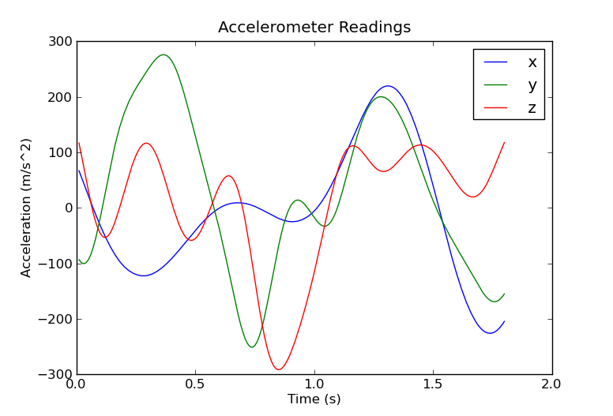
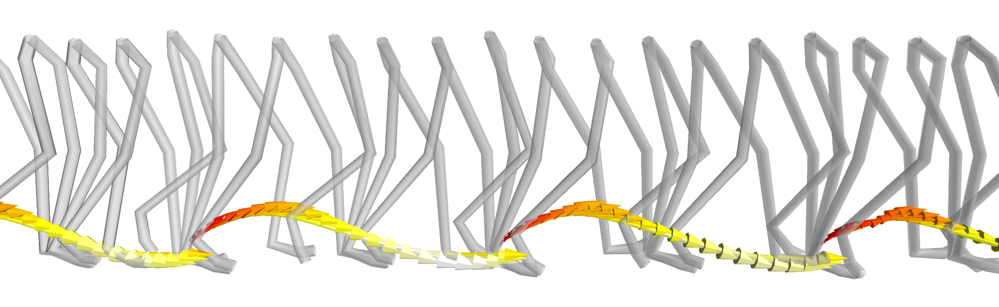
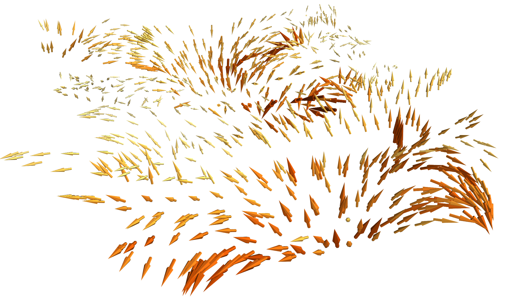
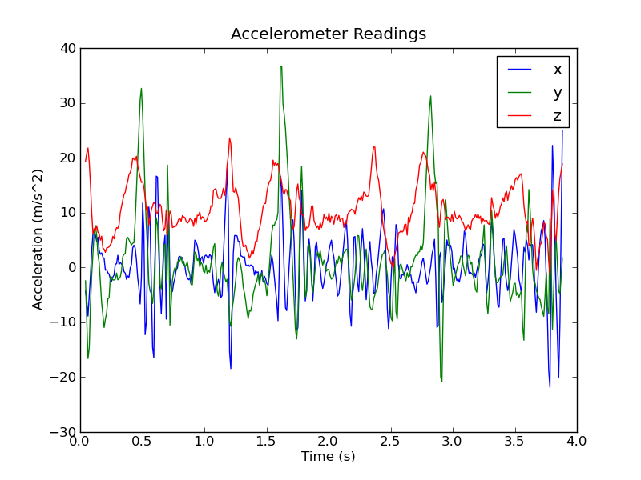

:author: Martin J. Ling
:email: m.j.ling@ed.ac.uk
:institution: University of Edinburgh

:author: Alex D. Young
:email: ayoung9@inf.ed.ac.uk
:institution: University of Edinburgh

------------------------------------------------------------------
IMUSim - Simulating inertial and magnetic sensor systems in Python
------------------------------------------------------------------

.. class:: abstract

   IMUSim is a new simulation package developed in Python to model Inertial
   Measurement Units, i.e. devices which include accelerometers, gyroscopes
   and magnetometers. It was developed in the course of our research into
   algorithms for IMU-based motion capture, and has now been released under
   the GPL for the benefit of other researchers and users. The software 
   generates realistic sensor readings based on trajectory, environment,
   sensor and system models. It includes implementaions of various relevant
   processing algorithms and mathematical utilities, some of which may be 
   useful elsewhere. The simulator makes extensive use of NumPy, SciPy, SimPy,
   Cython, Matplotlib and Mayavi. The rapid development enabled by these tools
   allowed the project to be completed as a side project by two researchers.
   Careful design of an object-oriented API for the various models involved
   in the simulation allows the software to remain flexible and extensible
   while requiring users to write a minimum amount of code to use it.

.. class:: keywords

   simulation, IMU, accelerometer, gyroscope, magnetometer

Introduction
============

Inertial sensors—accelerometers and gyroscopes—are becoming increasingly ubiquitous in a wide range of devices and applications. In particular, they are often used to automatically find and track the orientation of a device. For this role they may be combined with a magnetometer, which can sense the direction of the Earth's magnetic field. Such a combination can determine the device's full 3D orientation, including compass heading. Devices designed specifically around these sensors are called Inertial Measurement Units (IMUs), though readers may be more familiar with them in modern smartphones, tablets and gaming controllers, which use the orientation and movements of the device as a user input mechanism.

Outside of consumer devices inertial and magnetic sensors find a wide range of uses. They are used for attitude tracking in aircraft, spacecraft, in many types of robotic systems, and in stabilised platforms for cameras and weapons. In engineering and industry they are used to detect and monitor vibrations, impacts, collisions and other events. They have also been widely used in healthcare, to monitor and classify the activities of a patient and to detect events such as falls. In biology and agriculture, they have been used to provide the same capabilities on animals. The list of applications of these sensors continues to grow, with more uses being found as their cost, size and power requirements decrease. However, as newer and more ambitious applications push towards the limits of sensor capabilities, development becomes harder.

Our own research over the past few years has focused on motion capture of the human body using networks of wearable IMUs. Most motion capture methods are based on cameras, and consequently have limited tracking areas and problems with occlusion. By instead tracking movements using IMUs on the body, motion capture can be freed from these limitations. However, achieving accurate tracking with this approach is a difficult problem and remains an active topic of research.

During our work in this area we invested a large amount of effort in designing, building and debugging both hardware and software to test our ideas. Some other research groups did similar work, on their own platforms, whilst further researchers developed algorithms which were tested only in their own simulations. We were not readily able to compare our methods in controlled experiments, and new researchers could not easily enter the field without investing significant time and money in the necessary infrastructure.

In our view, a significant obstacle for the development of advanced inertial/magnetic sensing applications has been a lack of useful simulation tools to allow a sensor system to be designed, modelled and tested before expensive and time-consuming hardware work is required. Ad-hoc simulations are sometimes developed for individual applications or hardware but due to their very specific nature these are rarely shared, and even if they are, hard to reuse. As a result, most simulations are created from scratch and tend towards being simplistic.

We therefore decided that a useful contribution we could make to this field would be an openly available simulation framework, that could continuously evolve to support state-of-the-art work with the best available methods and models. We hence wanted to keep the design as flexible, extensible and general purpose as possible.

Although most other researchers in this area were using MATLAB, we decided that Python would be the best platform for developing our simulator. Ease and speed of development were essential since we would be undertaking the project with just two people, and alongside our main research. We also felt that a popular general purpose language with a supporting open source ecosystem, rather than a proprietary tool, was the appropriate choice given the project's goals.

After several months we released our first version under the GPL in April 2011, and presented a paper [Young2011]_ that discussed the work from a primarily scientific perspective. In contrast, this paper focuses on the Python implementation and our experiences during its development.

Overview
========

The goal of IMUSim is to allow inertial/magnetic sensor systems to be tested in simulations that are quick to develop yet as realistic as possible, reducing development time, cost, and risk in both academic research and commercial development.

The key function of the software is hence to generate realistic readings for sensors in simulated scenarios. The readings obtained from an inertial or magnetic sensor at a given instant depend on several factors:

- The trajectory followed by the sensor through space: its position and rotation at a given moment, and derivatives of these—in particular angular velocity and linear acceleration.

- The surrounding environment: in particular the gravitational and magnetic fields present.

- The nature of the sensor itself: its sensitivity, measurement range, bias, etc.

- The analogue-to-digital converter (ADC) used to sample the sensor output: its range, resolution, linearity, etc.

- Random noise associated with either the sensor or ADC.

We simulate all of these factors, taking an object-oriented approach. For each factor involved—e.g. trajectory, sensor, magnetic field—we provide an abstract class defining a model interface, and classes implementing specific models. All the models involved in the simulation can thus be easily interchanged, and extended or replaced as required.

In addition to just the model classes required to obtain simulated sensor readings, the IMUSim package also includes:

- A basic framework of model classes for simulating multi-device wireless systems with distributed processing.

- Implementations of existing processing algorithms for inertial and magnetic sensor data, including methods for sensor calibration, orientation estimation, body posture reconstruction and position estimation.

- General purpose mathematical utilities useful for implementing models and processing algorithms.

- 2D and animated 3D visualisation tools.

Rather than developing a specific UI for the simulator which would inevitably be restrictive, we designed the package to be easily used interactively via the [IPython]_ shell, or by scripting. A tutorial [Ling2011]_ has been written which aims to quickly introduce the use of the simulator through interactive examples with IPython, assuming some knowledge of the field but no previous Python experience. This tutorial accompanies the full API reference, which is generated using Epydoc from comprehensive docstrings included in the code.

The implementation makes extensive use of [NumPy]_, [SciPy]_, [SimPy]_, [Matplotlib]_, [MayaVi]_ and [Cython]_, and in general aims to use existing libraries wherever possible. In a few cases we have implemented limited amounts of functionality that could have been reused from elsewhere. Reasons for doing this have included performance (e.g. our fast Cython quaternion math implementation), maintaining ease of use and consistency of the API, or limiting the installation prerequisites to the common and well-supported libraries included in the main scientific Python distributions.

A quick example
===============

In this section we look briefly at the IMUSim software starting from the user's perspective, and then at some aspects of the implementation. We begin by looking at a simple example script, which simulates an idealised IMU following a randomly generated trajectory, sampling its sensors at 100Hz:

.. code-block:: python

    # Import all public symbols from IMUSim
    from imusim.all import *

    # Create a new simulation
    sim = Simulation()

    # Create a randomly defined trajectory
    trajectory = RandomTrajectory()

    # Create an instance of an ideal IMU
    imu = IdealIMU(simulation=sim, trajectory=trajectory)

    # Define a sampling period
    dt = 0.01

    # Set up a behaviour that runs on the simulated IMU
    behaviour = BasicIMUBehaviour(platform=imu,
        samplingPeriod=dt)

    # Set the time inside the simulation
    sim.time = trajectory.startTime

    # Run the simulation till the desired end time 
    sim.run(trajectory.endTime)

The package has been designed to make simple tasks like this quick to write, and to only require lengthy setup code for a simulation when unusual and complex things are required. The ``imusim.all`` package automatically imports all public symbols from the various subpackages of ``imusim``. The ``Simulation`` object wraps up the three things required for an individual simulation run: simulation engine, environment model, and random number generator (RNG). Unless told otherwise, it includes a randomly seeded RNG and a default environment model with nominal values for Earth's gravity and magnetic field. The ``IdealIMU`` class models a complete IMU device with accelerometer, magnetometer, gyroscope and supporting hardware components, all using ideal models. ``BasicIMUBehaviour`` implements the most common software functionality required on an IMU—sampling all its sensors at regular intervals, storing the resulting values and, if specified in options to its constructor, passing them on to processing algorithms.

The behavioural code accesses the simulated hardware it has been given through a defined API, allowing it to be written in straightforward Python code as if running on real hardware. The simulated hardware components then post events to the SimPy simulation engine as necessary to model their functionality. In this case, the main events will be the samples requested from the sensors via the ADC. At the moments these samples are taken, the sensor models will request information from the trajectory and environment models to which they are attached, as needed to compute their outputs. The ADC model will in turn process each value, and generate a final reading. After each event is simulated the simulation time advances directly to the next requested event. Depending on the user's computer and the complexity of the simulation, time may pass from a little faster to very much slower, compared to real time.

We display some progress output to keep the user informed. In the simple case above the simulation is quick::

    Simulating...
    Simulated 0.1s of 1.8s (  5%).
    Estimated time remaining 0.4s
    ...
    Simulation complete.
    Simulated 1.8 seconds in 0.4 seconds.

The user can now interactively explore the results via the same objects that were used in the simulation. For example, plotting the accelerometer samples from the IMU:

.. code-block:: python

    >>> plot(imu.accelerometer.rawMeasurements)

plus appropriate labels, gives the graph shown in Figure :ref:`accideal`. Plotting uses the normal facilities of Matplotlib, but IMUSim provides its own ``plot`` function. This adds special support for its own data types whilst retaining backward compatibility.

   Accelerometer readings for an ideal accelerometer following a randomly curving trajectory. :label:`accideal`

Data types
==========

The parameter passed to ``plot`` above was a ``TimeSeries`` object, one of the basic data types we developed for IMUSim. It represents timestamped scalar, vector or quaternion values with optional uncertainty information. We developed the ``TimeSeries`` class initially as a simple container, because we found that when plotting or otherwise passing around such data, it was often difficult or awkward to keep track of the correct combinations. We later included support for adding data sequentially, which is useful for storing data as it is generated by the simulation. New data points are appended to a list internally, with contiguous NumPy array versions generated only when required.

A ``TimeSeries`` thus provides two essential attributes, ``timestamps`` and ``values``. The ``timestamps`` attribute is an array of time values in ascending order:

.. code-block:: python

    >>> imu.accelerometer.rawMeasurements.timestamps
    array([ 0.01,  0.02, ...,  1.79,  1.8 ])

These are times at which the samples were taken. In this case they are uniformly distributed but any sequence of times may be represented. The sample values themselves are found in the ``values`` attribute:

.. code-block:: python

    >>> imu.accelerometer.rawMeasurements.values
    array([[  66.705814  , ..., -204.6486176 ],
           [ -93.40026896, ..., -155.16993659],
           [ 116.56420017, ...,  117.56964057]])

Note the shape of this array, which is 3xN where N is the number of timestamps. IMUSim uses column vectors, in order to work correctly with matrix multiplication and other operations. Arrays of vector data are therefore indexed first by component and then by sample number. A single vector would be represented as a 3x1 array. IMUSim provides a ``vector`` function to concisely construct these:

.. code-block:: python

    >>> vector(1,2,3)
    array([[ 1.],
           [ 2.],
           [ 3.]])

The other important data type is the quaternion, which is a mathematical construct with four components that can be used to represent a rotation in 3D space; see [Kuipers2002]_ for an in-depth treatment. Quaternions offer a more compact and usually more computationally efficient representation than rotation matrices, while avoiding the discontinuities and singularities associated with Euler angle sequences. IMUSim provides its own ``Quaternion`` class. Although a number of quaternion math implementations in Python already exist, we developed our own in Cython for performance reasons, due to the large number of quaternion operations used in the simulator. We hope this component will prove to be usefully reusable.

Quaternions can be constructed directly, converted to and from from other rotation representations such as Euler angle sequences and rotation matrices, used in mathematical expressions, and applied to perform specific operations on vectors:

.. code-block:: python

    >>> q1 = Quaternion(0, 1, 0, 0)
    >>> q1.toMatrix()
    matrix([[ 1.,  0.,  0.],
            [ 0., -1.,  0.],
            [ 0.,  0., -1.]])
    >>> q2 = Quaternion.fromEuler((45, 10, 30), order='zyx')
    >>> q1 * q2
    Quaternion(-0.2059911, 0.8976356, -0.3473967, 0.176446)
    >>> q2.rotateVector(vector(1,2,3))
    array([[ 0.97407942],
           [ 1.30224882],
           [ 3.36976517]])

As mentioned, the ``TimeSeries`` class can also be used with quaternion values. The rotations of the random trajectory used in the previous example simulation were generated from a time series of quaternion key frames:

.. code-block:: python

    >>> trajectory.rotationKeyFrames.values
    QuaternionArray(
        array([[-0.04667, -0.82763,  0.29852, -0.47300],
               [-0.10730, -0.81727,  0.33822, -0.45402],
               ..., 
               [ 0.40666, -0.04250,  0.80062,  0.43796],
               [ 0.42667, -0.01498,  0.82309,  0.37449]]))

Arrays of quaternions are represented using the special ``QuaternionArray`` class, also implemented in Cython, which wraps an Nx4 NumPy array of the component values. Quaternion arrays provide support for applying quaternion math operations efficiently over the whole array.

Trajectory models
=================

The data types we have just introduced form the basis for our trajectory model interface. A trajectory defines the path of an object through space, and also its changing rotation, over time. To allow simulating inertial and magnetic sensors, a trajectory needs to provide position and rotation, and their first and second derivatives, at any given time. A trajectory must also give the start and end of the period for which it is defined. In this case we will look at a trajectory's parameters at its starting time, which is a scalar in seconds:

.. code-block:: python

    >>> t = trajectory.startTime
    >>> t
    3.8146809461460811

The position, velocity and acceleration methods of a trajectory provide vector values, in SI units, at given times:

.. code-block:: python

    >>> trajectory.position(t) # m
    array([[-10.36337587],
           [  4.63926506],
           [ -0.17801693]])
    >>> trajectory.velocity(t) # m/s
    array([[ 30.79525389],
           [-20.9180481 ],
           [  2.68236355]])
    >>> trajectory.acceleration(t) # m/s^2
    array([[ 178.30674569],
           [ -15.11472827],
           [  15.54901256]])

The rotation at time t is a quaternion, but its derivatives—angular velocity and acceleration—are vectors:

.. code-block:: python

    >>> trajectory.rotation(t)
    Quaternion(-0.046679, -0.82763, 0.29852, -0.47300)
    >>> trajectory.rotationalVelocity(t) # rad/s
    array([[-2.97192064],
           [ 2.97060751],
           [-7.32688967]])
    >>> trajectory.rotationalAcceleration(t) # rad/s^2
    array([[ -8.46813312],
           [ 19.43475152],
           [-31.28760834]])

Note that angular accelerations may be required, even when only angular velocity sensors (gyroscopes) and linear accelerometers are simulated. This is because sensors may be placed at offsets from a trajectory, e.g. on the surface of a rigid body is whose centre is following the trajectory. In the equation for linear acceleration at an offset from a centre of rotation, an angular acceleration term is present.

Any object which implements the methods above at can be used as a trajectory model by IMUSim. The trajectory can be defined in advance, or may be defined as a simulation progresses, e.g. by simulating the effect of some control system. The simulator will only call the trajectory methods for a time when all events prior to that time have been simulated.

Since defining realistic trajectory models is one of the most difficult aspects of IMU simulation, much of the code in IMUSim is devoted to assisting with this. In particular, we provide tools for defining trajectories from existing motion capture data in various formats. Using such data requires the creation of continuous time trajectories, with realistic derivatives, from discrete time position and/or rotation information.

From sampled position data, interpolated values and derivatives can be obtained by fitting three independent cubic spline functions to the :math:`x`, :math:`y`, and :math:`z` components of the data, using the ``splrep`` and ``splev`` functions from ``scipy.interpolate``. Obtaining usable rotational derivatives from sampled rotations is more complicated. The most common forms of quaternion interpolation, the SLERP [Shoemake1985]_ and SQUAD [Shoemake1991]_ algorithms, are continuous only in rotation and angular velocity respectively, and hence cannot provide a continuous angular acceleration. We developed a Cython implementation of the quaternion B-spline algorithm of [Kim1995]_, which provides the necessary continuity.

For both position and rotation data, it is usually necessary to use smoothing splines to avoid overfitting to noisy capture data, if realistic derivative values are to be obtained. Appropriate smoothing can be achieved by providing expected standard deviations of the input data. Our code then provides the appropriate parameters to ``splrep``.

In many applications sensors are used to measure the movements of jointed but otherwise rigid structures, such as the human skeleton or a jointed robotic arm. We therefore provide specific trajectory classes for modelling articulated rigid-body systems, that obey their kinematic constraints. In particular, these classes are useful to work with human motion capture data, which is often pre-processed to fit this type of model and stored accordingly, in formats such as BVH and ASF/AMC. We provide loaders for these file formats, and splining wrapper classes that make it a simple to obtain physically consistent trajectories from such data. Figure :ref:`bvhtraj` illustrates model trajectories and a derivative obtained in this manner, rendered using IMUSim's 3D visualisation tools, which are based on MayaVi.

   Interpolated trajectories from motion capture data, for the lower body of a walking human. The source data was in BVH format at 120 Hz. The model posture is displayed at 5 Hz, and the velocity vector obtained for the right foot is displayed at 50 Hz. :label:`bvhtraj`

Environment models
==================

The second factor affecting sensor readings is the environment. Accelerometers sense gravity, and magnetometers sense magnetic field, both of which can vary with position and time. We may also want to simulate radio transmissions from a wireless IMU, the propagation of which will depend on its surroundings. All of these considerations are described by an ``Environment`` object, to which we assign models for each aspect of the environment relevant to the simulation.

If not otherwise specified, each ``Simulation`` is created with a default environment, including simple models of the gravitational and magnetic fields at the Earth's surface. Both are subclass instances of the abstract ``VectorField`` class, which defines an interface for time-varying vector fields. Field values can be obtained by calling the models with a position vector and time:

.. code-block:: python

    >>> p = trajectory.position(t)
    >>> sim.environment.gravitationalField(p, t) # m/s^2
    array([[ 0.  ],
           [ 0.  ],
           [ 9.81]])
    >>> sim.environment.magneticField(p, t) # in Tesla
    array([[  1.71010072e-05],
           [  0.00000000e+00],
           [  4.69846310e-05]])

On Earth, and within a small area, it is generally sufficient to model gravity as a constant field. For Earth's magnetic field, approximate values for a given location can be obtained from the International Geomagnetic Reference Field model [IGRF]_ and passed to the ``EarthMagneticField`` constructor. However, local distortions can be very significant, so we provide means for modelling varying fields. The ``SolenoidMagneticField`` class simulates the magnetic field around a single ideal solenoid, using the equations of [Derby2010]_. More complex fields can be modelled by superposition of multiple solenoids. Alternatively, known field values at certain positions can be used to create an interpolating field model. This requires an :math:`\mathbb{R}^3 \rightarrow \mathbb{R}^3` interpolation on an unstructured grid, for which we use the Natural Neighbour algorithm described in [Hemsley2009]_. Our code provides a wrapper for the C implementation of this algorithm [interpolate3d]_. Figure :ref:`magfield` illustrates a real set of field measurements around the floor of a steel-framed building. The code allows detailed measurements such as these to be employed in simulations.

    Unstructured measurements of magnetic field distortion used to initialise an interpolated field model. :label:`magfield`

Sensor and device models
========================

Real sensors suffer from noise, bias, misalignment, cross-axis sensitivity and many other undesirable effects. To acheive a realistic simulation we need to model these. IMUSim includes generic parametric models for imperfect sensors, and also specific models of some real sensor components, with parameters derived from measurements and datasheet information. All sensor models implement the interface of the abstract ``Sensor`` class. This defines three methods to be implemented, each of which is a function of time:

   - ``trueValues`` returns a vector of values, one for each axis, that would be measured by an ideal sensor of this type. The units of these values are those of the sensed quantity (e.g. acceleration or angular rate).

   - ``sensedVoltages`` returns the vector of analogue output voltages of the sensor at a given time. This method will internally call ``trueValues``, and transform the result via some model of the sensor's transfer function. The result should include deterministic effects, but exclude random noise; i.e. it should be an ensemble mean of the voltages the sensor might actually output at that moment.

   - ``noiseVoltages`` returns randomly generated noise that is additionally measured by the sensor, following an appropriate distribution. Noise values are taken from an individual RNG for the sensor, that is by default seeded from the main simulation RNG, but can be instead seeded explicitly. Running a new simulation with the same initial seed value for the sensor RNG will generate the same noise for that sensor, allowing repeatability with fine-grained control.

One reason for keeping these functions separate is to simplify the composition of different classes to create a sensor model. Usually ``trueValues`` is inherited from an abstract superclass such as ``Magnetometer``, while ``sensedVoltages`` may be inherited from another class implementing the transfer function, and ``noiseVoltages`` may come from yet another class. Additionally, having true and noiseless values independently accessible is helpful for comparison and testing.

The final simulated voltage output is the sum of ``sensedVoltages`` and ``noiseVoltages``. In reality, the output voltage is then converted to a digital value by an ADC, which has limited range and resolution and thus clips and quantises the values, as well as adding its own noise. Although somtimes sensor devices have an ADC combined on the same chip, others are interchangeable, and we therefore model ADCs with their own classes separately from sensors.

Another issue in real hardware is that samples are never taken at the exact times requested, because of the inevitable inaccuracy of the IMU's hardware timers. For this reason we also support modelling of imperfect hardware timers. 

All of these components can be brought together to create a model of a specific device. The ``IdealIMU`` we used earlier is an example, with ideal models for all the components of a standard IMU. IMUSim also includes a model, produced from measured parameters, of the real *Orient-3* IMU we developed during our research at Edinburgh [Orient]_. This allows users to test algorithms with a realistic model of a complete IMU device 'out of the box'.

The component-based API, including various parametric models and abstract classes implementing common functionality, is designed to make it easy to model a new type of device with a minimum of code. This is the same philosophy we have taken with all parts of the simulator design. For the simulator to be relevant to a wide range of users, and thereby gain an active user base who will contribute to its development, its design must be adaptable enough to support any usage and users must be able to develop new models with minimal difficulty.

A more realistic simulation
===========================

Our first example script showed a very unrealistic simulation, with an idealised device following a simple random trajectory. We will now show a brief example of how using IMUSim, much more realistic simulations can be produced with still very little code. This script simulates an *Orient-3* IMU attached to the right foot of a walking human:

.. code-block:: python

    # Import symbols from IMUSim
    from imusim.all import *

    # Define a sampling period
    dt = 0.01

    # Create an instance of a realistic IMU model
    imu = Orient3IMU()

    # Create a new environment
    env = Environment()

    # Define a procedure for calibrating an IMU in our
    # selected environment
    calibrator = ScaleAndOffsetCalibrator(
        environment=env, samples=1000,
        samplingPeriod=dt, rotationalVelocity=20)

    # Calibrate the IMU
    cal = calibrator.calibrate(imu)

    # Import motion capture data of a human
    sampledBody = loadBVHFile('walk.bvh',
        CM_TO_M_CONVERSION)

    # Convert to continuous time trajectories
    splinedBody = SplinedBodyModel(sampledBody)

    # Create a new simulation
    sim = Simulation(environment=env)

    # Assign the IMU to the simulation
    imu.simulation = sim

    # Attach the IMU to the subject's right foot
    imu.trajectory = splinedBody.getJoint('rfoot')

    # Set the starting time of the simulation
    sim.time = splinedModel.startTime

    # Set up the behaviour to run on the IMU
    BasicIMUBehaviour(platform=imu, samplingPeriod=dt,
        calibration=cal, initialTime=sim.time)

    # Run the simulation
    sim.run(splinedModel.endTime)

At 16 lines of code, this is only twice the length of the previous example, but is based on:

    - a real human motion, imported from motion capture data and transformed to usable trajectories.
    - an empirically obtained model of a real IMU design, including noise and other imperfections.
    - a simulation of a real calibration procedure.

Further information on the new steps appearing in this example—including IMU calibration, and more on the use of motion capture data, of which much is freely available—can be found in the IMUSim tutorial [Ling2011]_.

Plotting the measurements of the accelerometer in this simulation, using the calibration obtained for the IMU, results in Figure :ref:`accwalk`. Compare the appearance of this data to that from the previous, more simplistic simulation in Figure :ref:`accideal`.

    Simulated accelerometer readings for an *Orient-3* IMU attached to the right foot of a walking human. :label:`accwalk`

Data processing algorithms
==========================

Obtaining realistic sensor data in simulations is one of IMUSim's key goals, but the package is also intended to support the comparison, development and selection of algorithms for processing this data. Implementations are included for a number of existing published algorithms. These may be useful as-is in some applications. They may also be used to compare new methods. We encourage users publishing new methods to contribute implementations of their algorithms themselves, and publish the scripts used for their experiments. This allows their results to be reproduced, and reduces the risk that their work will be misrepresented by an incorrect reimplementation by another researcher.

In addition to the library of existing published methods, we have tried to provide some generally useful tools for working with sensor data. In particular, we include generic implementations of the standard linear Kalman filter, the Unscented Transform, and the Unscented Kalman Filter. These are widely useful state estimation and nonlinear system tools, and could be usefully transferred to SciPy or another library.

Validation and testing
======================

In order to test the accuracy of our simulations, we have conducted some experiments to directly compare our simulated sensor values with those measured by real IMUs. To achieve this, we used an optical motion capture system to capture the movements of a subject who was also wearing wireless IMUs. In addition to the normal markers on the subject, the positions and rotations of the IMUs themselves were tracked using three markers attached to each IMU. From the optical capture data we produced a rigid body model of the subject, which was used via the methods we have described to obtain simulated sensor data. We also sampled the magnetic field in the capture area, using the magnetometer of an IMU swept around the capture volume whilst being tracked by the optical system. These measurements, seen in Figure :ref:`magfield`, were used to generate an interpolated field model of the capture area which was also used in the simulation.

In our experiments we obtained correlations of :math:`r^2 > 0.95` between simulated and measured values for all three types of sensors—accelerometers, gyroscopes and magnetometers. More detail on these experiments and results can be found in [Young2011]_.

The software is accompanied by test scripts designed to be used with the ``nosetests`` tool. In total the current version runs over 30,000 test cases, which aim to verify the correct behaviour of the code. The tests include checking simulated sensor values against real ones obtained in the experiments described above, to ensure that after any code change the simulator still meets its published claims of accuracy.

We also generate code coverage reports from the tests and use these to identify untested code paths. Unfortunately at present it is not straightforward to obtain test coverage for the Cython parts of the code; some unofficial code to do this is in circulation, but official future support for this in the ``coverage`` module would be helpful.

Conclusion
==========

We have presented IMUSim, a simulation framework for inertial and magnetic sensor systems, and looked at some of the details of its Python implementation. The package has been designed to meet the simultaneous goals of:

   - enabling accurate simulations,
   - remaining as flexible and extensible as possible,
   - minimising the amount of code that users must write.

This is achieved by careful design of an object-oriented API for the various models required in the simulation.

The project was completed in a matter of months by two researchers alongside other work. We believe this demonstrates well the rapid development enabled by Python and its increasing range of scientific libraries. In the process of development we created some contributions which may be of wider use, and could be moved to more general purpose libraries. These include:

    - fast Cython classes for quaternion mathematics, including efficient quaternion arrays and B-spline fitting of quaternion values.

    - generic implementations of the Kalman Filter, Unscented Transform, and Unscented Kalman Filter.
  
    - a ``TimeSeries`` class for representing extendable time series of scalars, vectors or quaternions with covariance information, and an enhanced ``plot`` command that accepts these.

    - 3D vector field interpolation from unstructured field samples, based on a wrapping of an existing C library for natural neighbour interpolation.

The IMUSim source code is available from the project website at http://www.imusim.org/, under the GPLv3 license. The software is supported by a tutorial, API reference, users mailing list, and test suite.

Acknowldgements
===============

Development of the simulator was in part supported by the UK Engineering and Physical Sciences Research Council under the Basic Technology Research Programme, Grant C523881.

References
==========

.. [Young2011] A D Young, M J Ling and D K Arvind, *IMUSim: A Simulation Environment for Inertial Sensing Algorithm Design and Evaluation*, in *Proceedings of the 10th ACM/IEEE International Conference on Information Processing in Sensor Networks*, pp. 199-210, ACM, April 2011.

.. [IPython] F Perez and B E Granger, *IPython: A System for Interactive Scientific Computing*, in *Computing in Science and Engineering*, vol. 9, no. 3, pp. 21-29, May/June 2007.

.. [NumPy] T Oliphant, *Guide to Numpy*, 2006. Available at http://www.tramy.us/.

.. [SciPy] E Jones, T Oliphant, P Peterson and others, *SciPy: Open Source Scientific Tools for Python*. Available at http://www.scipy.org.

.. [SimPy] K Müller and T Vignaux, *SimPy: Simulating Systems in Python*, 2003. Available at http://onlamp.com/pub/a/python/2003/02/27/simpy.html.

.. [Matplotlib] J D Hunter, *Matplotlib: A 2D Graphics Environment*, in *Computing in Science & Engineering*, vol. 9, no. 3. pp. 90-95, 2007.

.. [MayaVi] P Ramachandran and G Varoquaux, *Mayavi: 3D Visualization of Scientific Data*, in *IEEE Computing in Science & Engineering*, vol. 13, no. 2, pp. 40-51, 2011.

.. [Cython] R Bradshaw, S Behnel, D S Seljebotn, G Ewing and others, *The Cython compiler*. Available at http://cython.org.

.. [Ling2011] M J Ling, *IMUSim Tutorial*, Version 0.2, May 2011. Available at http://www.imusim.org/docs/tutorial.html.

.. [Kuipers2002] J B Kuipers, *Quaternions and Rotation Sequences*, 5th Edition, Princeton University Press, 2002.

.. [Shoemake1985] K Shoemake, *Animating Rotation with Quaternion Curves*, in *Proceedings of the 12th Annual Conference on Computer Graphics and Interactive Techniques (SIGGRAPH'85)*, pp. 245-254, ACM, 1985.

.. [Shoemake1991] K Shoemake, *Quaternion Calculus for Animation*, in *Math for SIGGRAPH (ACM SIGGRAPH'91 Course Notes #2)*, 1991.

.. [Kim1995] M-J Kim, M-S Kim and S Y Shin, *A General Construction Scheme for Unit Quaternion Curves with Simple High Order Derivatives*, in *Proceedings of the 22nd Annual Conference on Computer Graphics and Interactive Techniques (SIGGRAPH'95)*, pp. 369-376, ACM, 1995.

.. [IGRF] National Oceanic and Atmospheric Administration, *Geomagnetic Online Calculator*. Available at http://www.ngdc.noaa.gov/geomagmodels/IGRFWMM.jsp.

.. [Derby2010] N Derby and S Olbert, *Cylindrical Magnets and Ideal Solenoids*, in *American Journal of Physics*, vol. 78, no. 3, pp. 229-235, March 2010.

.. [Hemsley2009] R Hemsley, *Interpolation on a Magnetic Field*, Technical Report, Bristol University, September 2009. Available at http://interpolate3d.googlecode.com/files/Report.pdf.

.. [interpolate3d] R Hemsley, *A Natural Neighbour Interpolation program for 3D data*. Available at http://code.google.com/p/interpolate3d/.

.. [Orient] A D Young, *Orient Motion Capture*, Available at http://homepages.inf.ed.ac.uk/ayoung9/orient.html
