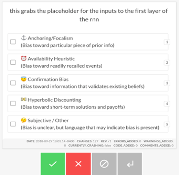
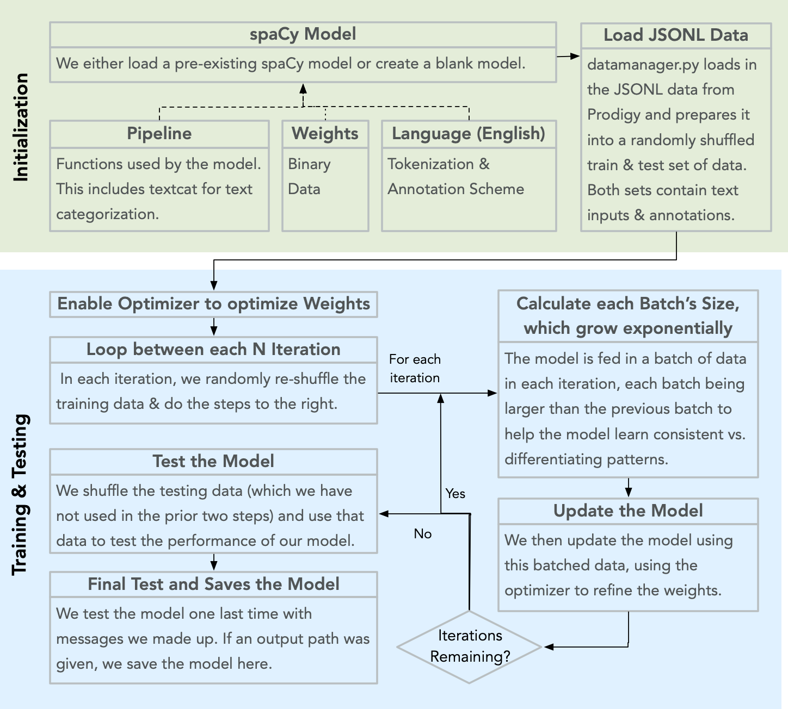
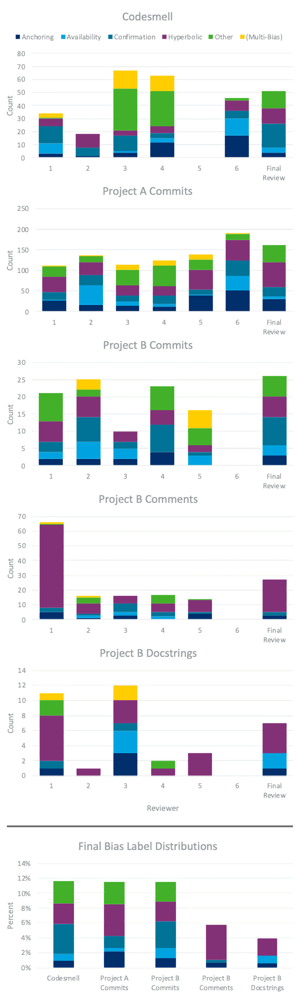
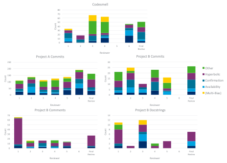
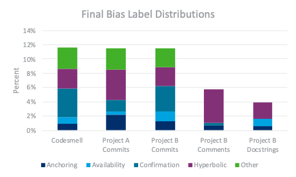

:author: Amanda E. Kraft
:email: amanda.e.kraft@lmco.com
:institution: Lockheed Martin Advanced Technology Laboratories
:equal-contributor:

:author: Matthew Widjaja
:email: matthew.widjaja@lmco.com
:institution: Lockheed Martin Advanced Technology Laboratories
:corresponding:
:equal-contributor:

:author: Trevor M. Sands
:email: trevor.m.sands@lmco.com
:institution: Lockheed Martin Advanced Technology Laboratories

:author: Brad J. Galego
:email: brad.j.galego@lmco.com
:institution: Lockheed Martin Advanced Technology Laboratories

-----------------------------------------------------------------------------
Programmatically Identifying Cognitive Biases Present in Software Development
-----------------------------------------------------------------------------

.. class:: abstract

   Mitigating bias in AI-enabled systems is a topic of great concern within the
   research community. While efforts are underway to increase model
   interpretability and de-bias datasets, little attention has been given to
   identifying biases that are introduced by developers as part of the software
   engineering process. To address this, we began developing an approach to 
   identify a subset of cognitive biases that may be present in development 
   artifacts: anchoring bias, availability bias, confirmation bias, and 
   hyperbolic discounting. We developed multiple natural language processing 
   (NLP) models to identify and classify the presence of bias in text 
   originating from software development artifacts.

.. class:: keywords

   cognitive bias, software engineering, natural language processing

Introduction
============

Artificial intelligence (AI) and machine learning (ML) -based systems are
increasingly supporting decision-making, reasoning, and evaluation of dynamic
environments in objective manners. As AI-enabled systems are finding
increasing use across domains and industries, there is concern that the
objectivity of such systems may be negatively impacted by biases introduced by
the developers either in the design of the system or in the training data
itself. While efforts are underway to make AI/ML systems more interpretable and
debias datasets, little research is directed at human-centric cognitive biases
that developers unintentionally introduce as a part of the software engineering
(SE) process. As a result, ensuring unbiased and transparent algorithmic
decision-making is a complex challenge and has wide-ranging implications for 
the future use of AI in society.

Cognitive biases are systematic deviations from rationality in judgment,
reasoning, evaluation, or other cognitive processes. For the myriad of 
cognitive biases described in literature [1]_, approximately 40 have been 
investigated in the SE domain [2]_. We selected four of the most commonly 
reported cognitive biases in software engineering: 

* **Anchoring Bias**: Tendency to rely too heavily on pre-existing or first
  information found when making a quantitative judgment [2]_.
* **Availability Bias**: Tendency to overestimate the likelihood of events 
  based on the ease of which examples come to mind [3]_.
* **Confirmation Bias**: Tendency to search for and focus on information that
  confirms one’s preconception(s) while ignoring or rejecting sources that
  challenge it [4]_.
* **Hyperbolic Discounting**: Tendency to prefer immediate payoffs over larger
  rewards at a later point [2]_.

These biases may be influenced by self-generated factors (e.g., past
development experience), or externally generated factors (e.g., system
documentation) [5]_. A tool to detect biases in software must be capable of
assessing multiple sources of information about the system, including commit
messages, comments, in-source docstrings, external technical documentation, and
diagrams. This study takes the first steps toward this objective by identifying
cognitive biases in software commit messages and comments from previously
completed projects.

The remainder of this paper is organized into three sections: research 
methods, results and discussion, and conclusions and implications for future 
work in this space.

Research Methods
================

In this section we discuss how data was initially gathered and curated prior 
to annotation, how manual annotation was performed using Prodigy, the process 
for reviewing and finalizing the consensus for data labels, and finally, the 
approach for developing machine learning classifier models applied to the 
annotated data to determine whether bias is present in a given sample.

Data Curation
-------------

To address the lack of research identifying cognitive biases in software 
artifacts developed as part of a naturally occurring development process, we
collated data from two internally developed codebases. The first project
(“Project A”) was selected to represent the whole software engineering
process for AI/ML-enabled systems (i.e., data management to feature extraction 
to model training and evaluation). The second project (“Project B”) is similar 
in structure to the first, but the software artifacts gathered include only
the latter half of the development cycle (i.e., feature extraction to model 
training and evaluation). The content from both codebases were collated into 
datasets based on the source of the development artifacts: commit messages, 
in-source code comments, and documentation strings (docstrings). Given the time
limitations for this effort, we prioritized annotation of commit messages for
all datasets, while comments and docstrings were annotated for the second of 
the two internal projects. 

Further, we identified an open-source dataset, Code Smell [6]_, to validate 
models trained on the content from the internal projects. This dataset contains 
commit messages extracted from refactoring activities across the software 
lifecycle for various open-source projects.

For all datasets, python scripts were developed to programmatically extract 
and format the text content from the artifacts. Specifically, the following 
operations were performed: commit message content had whitespace trimmed and 
artifact identifiers removed; comments spanning multiple lines were combined 
into a single entry; executable segments of code were removed; entries with 
non-ASCII characters were removed; references to individual names, 
collaboration teams, applications, and projects were redacted and replaced with 
an identifier string (e.g., “NAME1”).

Bias Annotation: Prodigy Setup
------------------------------

The processed text data was then annotated in Prodigy to produce a structured
JSON document. Prodigy is a commercially licensed software tool for 
collaborative data annotation. A custom annotation recipe was developed to 
define the four biases described above as the possible labels; an additional 
label option, “Subjective/Other” was included to provide reviewers a chance to 
flag entries containing a form of bias other than the available options. Figure
1 provides an example of what individual reviewers see when annotating a given 
dataset using this custom recipe. For each entry, the reviewer must decide 
whether an entry is valid, and if so, if the language indicates that the author
may have introduced bias into the system. When reviewers determined an entry 
contains bias, they selected one or more labels and pressed “accept”; 
otherwise, the reviewer pressed “reject” to indicate no language indicating 
bias was present. 

   
   Example view of a comment in reviewer mode. The reviewer has three 
   options: (1) accept via the green checkmark if bias is detected, 
   (2) reject via the red X if no bias detected, and (3) ignore via 
   the grey stop icon if the entry contains no intelligible content.

Bias Annotation: Manual Annotation
----------------------------------

A total of six reviewers were engaged in this project for the bias annotation 
process. All reviewers have at least two years of programming experience and 
are between the ages of 18-40. Two reviewers are female and four are male. Two 
reviewers are Asian, while the other four are White. Three of the six reviewers 
had some degree of involvement in developing the software for two of the 
internal projects discussed in this paper. Further, one of these  reviewers was
the software lead on Project B. To minimize personal biases when reviewing the 
development artifacts, all entries are anonymized and annotated in 
non-chronological order.

An annotation guide for classifying open-ended text entries was developed for 
reviewers to remain consistent. The guide provides examples of several biased 
commit messages such as:

* Anchoring Bias

  * "Extended module to allow a more traditional approach to interface
    engineering"
  * "Applying back-changes from my original fix patch"
  * "Correct the temperature unit - assumes anything under 45 is C"

* Availability Heuristic

  * "Renamed method to more sensible wording”
  * "Tighter coupling of variable names with other modules"

* Confirmation Bias

  * "The use of [X] rather than [Y] allows each module to reuse the same
    functionality without having to extend a base class"
  * "We're now a bit smarter about the size of tables that we create by default,
    which was the root of the prior problems"

* Hyperbolic Discounting

  * "Throwing out the Key and Value classes for now to reduce the overall
    complexity"
  * "Modified function to account for type errors. Will likely have to recreate
    the db every time, unless other solutions come up"
  * "Module incorporated but fails"
  * "Quick and dirty method to add features"

* Subjective/Other

  * "I was too over-zealous with removing a module"
  * "Duplicate code is my nemesis..."

The guide reminds reviewers that they are to label if the language indicates the
author may have introduced bias into the system, not if the language indicates
the author may be addressing bias previously introduced. The guide further
advises the reviewer to flag entries as invalid if they should be excluded from
the training or testing datasets; the exclusion criteria include blank messages,
machine-generated messages (e.g., automated branch merging messages), messages
only containing an artifact or issue identifier, and “TODO” or “FIXME” comments
with no accompanying description. Reviewers were also encouraged to accept
samples that may be borderline cases, as a group consensus would decide final
classification labels. 

Bias Annotation: Finalizing Bias Labels
---------------------------------------

After all reviewers submitted their final annotations for a dataset, one
reviewer was selected to finalize the labels to be used for training and testing
models. For consistency, the same reviewer was selected to finalize labels on
all datasets. The review process itself was facilitated by Prodigy, which offers
a built-in review recipe, allowing a user to specify the annotation databases to
use. With this recipe, Prodigy extracts all instances where an entry was
marked as “accepted” or “ignored” by at least one reviewer. These are compiled
and displayed similar to the initial review, noting which review session(s)
indicated which label(s).

In the final review, a “best fit” label was selected, rather than accepting
multiple labels for a single entry as allowed in the initial review stage. This
decision was implemented in order to provide non-overlapping classification
boundaries for model training and testing. The final reviewer followed a set of
guidelines for determining best fit labels, such as cross-referencing the
annotation guide or identifying the word or phrase that may have triggered the
response when multiple reviewers selected different biases for a single message.

If the final reviewer thought the best fit label was ambiguous or if the label
selected was only reported by themselves during the initial review process, the
message was logged for additional review. These flagged messages were compiled
in an Excel workbook along with the selected answer (first-degree label), the
next best answer (second-degree label), and the labels marked by the initial
review sessions. The workbook was sent to at least two individuals to respond to
these entries, indicating their judgement of whether the first or second degree
label was the best fit or if another label option may have been overlooked.
Scoring of their responses was automated using the following rules: (1) if both
agreed with the first degree label, it was kept; (2) if both agreed with the
second degree label, the final label was switched; (3) if the first degree label
was not “reject” and one accepted while the other rejected, the first degree
label was kept. On the rare occasion when none of these conditions were met, the
final reviewer decided the label selection based on the feedback.

The results of the final review (i.e., entries labeled as biased) were merged
with the source dataset (i.e., non-biased entries) to comprise the training and
testing datasets for modeling. 

Models
------

   
   Overview of the spaCy NLP modeling workflow, broken up into 
   initialization (green) and execution (blue) task phases.

To determine whether a tool can classify software artifacts as containing
indicators of bias, we developed text classification models using spaCy. Binary
and multi-class models were considered, where binary models were concerned with
identifying the presence or absence of biased language and multi-class models
concerned with identifying the type of bias present (if one is present at all).
Anticipating that the class distributions would be highly imbalanced towards not
containing bias, we implemented down sampling by taking the mean of the quantity
of data present across each label type to improve model training. This method
was randomized, with ten models trained on different data distributions.

Focusing on the ability of the trained models to perform on different codebases,
we prioritized evaluating the models independently trained on the two internal
commit datasets and applied each to the Code Smell dataset (i.e., as a test 
dataset). As a secondary task, we then combined the internal commits in a 
single training set and applied them to Code Smell. Additionally, to determine 
if commit messages can predict bias in comments, we trained a model on the 
internal commits and tested against comments for the same project. Finally, 
we evaluate the combined internal dataset against Code Smell.

We ran each model three times, each time using a different split of the dataset.
This modeling process is illustrated in Figure 2. For each model, we report the
mean F1 score and standard deviation across runs. We swept across three model 
hyperparameters during training:

1. **The maximum number of samples used to train**: This mitigates the impact of
   label imbalance, by limiting the total number of entries from each category
   before training the model. The considered caps included:

   1. The quantity of entries from all biases.
   2. The mean of the quantity of data from each category, including data which
      was not biased.
   3. The quantity of entries from the largest bias category.
   4. No capacity, use all data.

2. **Dropout**: This is the percentage of connections which are dropped from the
   neural network component of the ensemble learning and is used to prevent
   over-fitting. Typical sweep values are 20%, 40%, and 60%.
3. **The size of the training batches and their compounding rate at each epoch:**
   This determines how much data is passed to the trainer at each iteration from
   a minimum (batch start size) to a maximum (batch stop size) with a given rate
   of growth (compounding rate). For all models, the compounding rate was left
   at the spaCy recommended value of 1.001.

Results and Discussion
======================

In this section we discuss the results of data annotation and the classifier 
models. Statistics about the annotated data including the final label
distributions and interrater reliability are presented. Model hyperparameters 
are presented and discussed with respect to their mean F1 scores and standard 
deviations.

Annotated Datasets 
------------------
An overview of the four datasets in terms of total number of items, number of
duplicate entries, final number of items after accounting for duplicates, and
number of reviewers to annotate is provided in Table 1.    

.. raw:: latex

   \begin{table}[]
   \centering
   \footnotesize
   \begin{tabular}{|l|c|c|c|c|}
   \hline
   \textbf{Dataset}                                               & \multicolumn{1}{c|}{\textbf{\begin{tabular}[c]{@{}c@{}}Total\\ Items\end{tabular}}} & \multicolumn{1}{c|}{\textbf{\begin{tabular}[c]{@{}c@{}}Duplicate\\ Items\end{tabular}}} & \multicolumn{1}{c|}{\textbf{\begin{tabular}[c]{@{}c@{}}Final Item\\ Count\end{tabular}}} & \multicolumn{1}{c|}{\textbf{Reviewers}} \\ \hline
   \begin{tabular}[c]{@{}l@{}}Code Smell\\ Commits\end{tabular}   & 471                                                                                & 30                                                                                     & 441                                                                                     & 5                                      \\ \hline
   \begin{tabular}[c]{@{}l@{}}Project A\\ Commits\end{tabular}    & 1536                                                                               & 131                                                                                    & 1405                                                                                    & 6                                      \\ \hline
   \begin{tabular}[c]{@{}l@{}}Project B\\ Commits\end{tabular}    & 238                                                                                & 11                                                                                     & 227                                                                                     & 5                                      \\ \hline
   \begin{tabular}[c]{@{}l@{}}Project B\\ Comments\end{tabular}   & 469                                                                                & 0                                                                                      & 469                                                                                     & 5                                      \\ \hline
   \begin{tabular}[c]{@{}l@{}}Project B\\ Docstrings\end{tabular} & 181                                                                                & 0                                                                                      & 181                                                                                     & 5                                      \\ \hline                                      
   
   \end{tabular}
   \caption{Overview of the five datasets, including: (1) counts of original
            entries, (2) duplicate entries, excluding first occurrence, (3) 
            final entry count with duplicates removed, and (4) number of 
            reviewers that annotated each dataset.}
   \label{tab:table1}
   \end{table}

.. raw:: latex

   \begin{table}[]
   \centering
   \footnotesize
   \begin{tabular}{|l|c|c|c|c|}
   \hline
   \textbf{Dataset}                                               & \textbf{\begin{tabular}[c]{@{}c@{}}Answer\\ \end{tabular}} & \textbf{\begin{tabular}[c]{@{}c@{}}Annotation\\ \end{tabular}} & \textbf{\begin{tabular}[c]{@{}c@{}}Sub\\ Annotation\\ \end{tabular}} & \textbf{\begin{tabular}[c]{@{}c@{}}Bias\\ \end{tabular}} \\ \hline
   \begin{tabular}[c]{@{}l@{}}Code Smell\\ Commits\end{tabular}   & 0.85 ± 0.23                                                           & 0.83 ± 0.28                                                               & 0.44 ± 0.19                                                                     & 0.22 ± 0.35                                                         \\ \hline
   \begin{tabular}[c]{@{}l@{}}Project A\\ Commits\end{tabular}    & 0.86 ± 0.21                                                           & 0.87 ± 0.24                                                               & 0.50 ± 0.20                                                                     & 0.39 ± 0.40                                                         \\ \hline
   \begin{tabular}[c]{@{}l@{}}Project B\\ Commits\end{tabular}    & 0.78 ± 0.24                                                           & 0.89 ± 0.24                                                               & 0.43 ± 0.21                                                                     & 0.35 ± 0.38                                                         \\ \hline
   \begin{tabular}[c]{@{}l@{}}Project B\\ Comments\end{tabular}   & 0.91 ± 0.19                                                           & 0.92 ± 0.20                                                               & 0.51 ± 0.17                                                                     & 0.43 ± 0.48                                                         \\ \hline
   \begin{tabular}[c]{@{}l@{}}Project B\\ Docstrings\end{tabular} & 0.95 ± 0.15                                                           & 0.94 ± 0.16                                                               & 0.51 ± 0.15                                                                     & 0.42 ± 0.49                                                         \\ \hline
   \end{tabular}
   \caption{Interrater reliability across the annotated datasets as
            percentages, with a +/- standard deviation. "Answer" refers to
            the annotation response type (i.e., accept, reject, ignore). 
            "Annotation" considers the specific bias label, where reject/ignore 
            are empty strings. "Sub-Annotation" considers the subset 
            of entries in which at least one reviewer selected a bias label. 
            "Bias" compares only the bias labels selected by reviewers (i.e., 
            reject/ignore responses are not considered). Reviewers typically 
            agree on whether an entry is biased, but not on the bias type.}
   \label{tab:table2}
   \end{table}

.. raw:: latex

   \begin{table}[]
   \centering
   \footnotesize
   \begin{tabular}{|l|c|c|c|c|}
   \hline
   \textbf{Dataset}                                               & \textbf{\begin{tabular}[c]{@{}c@{}}Total\\ Items\end{tabular}} & \textbf{\begin{tabular}[c]{@{}c@{}}Rejected\\ (Not Biased)\end{tabular}} & \textbf{\begin{tabular}[c]{@{}c@{}}Accepted\\ (Biased)\end{tabular}} & \textbf{\begin{tabular}[c]{@{}c@{}}Ignored\\ (Excluded)\end{tabular}} \\ \hline
   \begin{tabular}[c]{@{}l@{}}Code Smell\\ Commits\end{tabular}   & 441                                                            & 389                                                                      & 51                                                                   & 1                                                                     \\ \hline
   \begin{tabular}[c]{@{}l@{}}Project A\\ Commits\end{tabular}    & 1,405                                                          & 1,154                                                                    & 162                                                                  & 89                                                                    \\ \hline
   \begin{tabular}[c]{@{}l@{}}Project B\\ Commits\end{tabular}    & 227                                                            & 140                                                                      & 26                                                                   & 61                                                                    \\ \hline
   \begin{tabular}[c]{@{}l@{}}Project B\\ Comments\end{tabular}   & 469                                                            & 430                                                                      & 27                                                                   & 12                                                                    \\ \hline
   \begin{tabular}[c]{@{}l@{}}Project B\\ Docstrings\end{tabular} & 181                                                            & 174                                                                      & 7                                                                    & 0                                                                     \\ \hline
   \end{tabular}
   \caption{Overview of the finalized annotations for each dataset. Entries
            labeled as "ignore" are excluded from the datasets for subsequent 
            modeling.}
   \label{tab:table3}
   \end{table}

To quantify variance in interpretation of bias presentation in software commit
messages and comments, interrater reliability was computed based on percent
agreement across reviewers. Percent agreement is computed as the number of
matching pairs over the number of total possible pairs.

For answer reliability, the number of matching answer pairs (i.e., “accept”, 
“reject”, or “ignore”) is divided by the total number of possible pairs. For
label reliability, we start with the high-level measure of all label options,
including the empty label string that results from selection of “reject” or
“ignore”. We refer to this measure as annotation reliability, as it accounts for
a combination of answer and label selection, though at the cost of instances of
“reject” and “ignore” being indistinguishable. Given the expected imbalance of
bias versus non-biased entries, we also provide an average of the reliability
scores for the subset in which at least one bias label is selected. We refer to
this measure as sub-annotation reliability. Lastly, we compute a bias
reliability measure in which we compare only the label options available when a
reviewer “accepts” an entry as biased.

There were six reviewers for the Project A Commits dataset and five reviewers
for all other datasets. Interrater reliability was computed across reviewer
annotations and are summarized in Table 2. The distributions of
bias labels for each dataset are represented in Figure 3. Overall, reliability
measures ranged from 0.78 to 0.91 for answers, 0.83 to 0.92 for annotations,
0.43 to 0.51 for sub-annotations, and 0.22 to 0.43 for bias labels across the
four datasets. An overview of the final annotation labels is provided in Table
3.

Given the nature of the data being annotated, we expected a significant amount
of variance in how reviewers interpret commit messages and in-source comments,
especially without additional context about the relevant code. This was
confirmed with the interrater reliability for top-level answers averaging to 
85% agreement, while reliability on bias type averaged to 35%. However, we 
didn't expect the level of disagreement to be so high, especially when 
reviewing the label distributions by reviewer. For example, some reviewers used
"Other" or selected multiple labels at a much greater rate than others. This 
may have resulted from the reviewers being unclear on what specific bias was 
present.

Further, the overall distribution of biased versus not biased entries by 
dataset supports that artifact types (e.g., comment, commit) are used 
differently. For example, both comments and docstrings tend to be more 
technical in nature, with comments typically reflecting procedural knowledge
and docstrings describing the purpose, inputs, and outputs of a class or 
function. This is reflected by all three commit message datasets having 
approximately 12% of messages flagged as biased, while comments and docstrings
only had 6% and 4% biased entries, respectively.

   
   Distribution of bias labels per dataset. The first five plots show the
   distribution of label counts by each reviewer and the finalized review 
   process. The last plot shows the finalized distribution of labels as 
   percentages to standardize visualization across all datasets. The final 
   plot reflects the data used for modeling.

Modeling
--------
Table 4 summarizes the results for each model, along with the best-performing
hyperparameters as determined by a parameter sweep. The mean and standard
deviation of F1 Scores are computed across three randomized train/test splits 
within the same dataset.

No models were trained using the dataset comprised of docstrings due to the 
extreme imbalance in labels (i.e., <5% labeled as bias). The docstring
dataset had a total of 7 (of 181) entries labeled as biased. This may be 
attributed to the inherit technical nature of docstrings, combined with the low
quantity of docstrings collected during data curation.

The multi-label model (F1 = 72.1%) did not meet expectations because it
consistently predicted that no bias was typically present. This model was
over-fit given that the biased entries were now split among four separate bias
labels, increasing the level of imbalance. Though this finding may be due to
insufficient training data availability, it's interesting to note that 
interrater reliability follows a similar pattern when defining a specific bias 
label. The confusion matrices from each of the three instances of this model is
Figure 4.

All binary classification models performed in parity with one another, with mean
F1 scores ranging from 78.6% to 82.3%. These models performed better than the
multi-label models given less data imbalance between the binary categories 
(i.e., bias vs. no bias). The model trained on Project B
Commits data was the only exception, which performed at 65.9%, most likely
due to the significantly smaller size of the training dataset.

The best performing model (F1 = 82.3%) was trained using the largest dataset
(i.e., the combined commit messages and comments for both Projects A and B) as a
binary classification model. The confusion matrices of the three instances
of this model is in Figure 5.

.. raw:: latex

   \begin{table}[]
   \centering
   \begin{tabular}{|l|c|c|c|c|c|c|}
   \hline
   \textbf{Dataset} & \textbf{\begin{tabular}[c]{@{}c@{}}Model\\ Type\end{tabular}} & \textbf{\begin{tabular}[c]{@{}c@{}}Max\\ Samples\end{tabular}} & \textbf{\begin{tabular}[c]{@{}c@{}}Drop\\ Rate\end{tabular}} & \textbf{\begin{tabular}[c]{@{}c@{}}Batch\\ Range\end{tabular}} & \textbf{\begin{tabular}[c]{@{}c@{}}Mean\\ F1\end{tabular}} & \textbf{\begin{tabular}[c]{@{}c@{}}Std.\\ Dev.\end{tabular}} \\ \hline
   \begin{tabular}[c]{@{}l@{}}Project A\\ Commits\end{tabular} & Binary & 220 & 40\% & 4-64 & 81.2\% & 2.6\% \\ \hline
   \begin{tabular}[c]{@{}l@{}}Project B\\ Commits\end{tabular} & Binary & 28 & 20\% & 8-64 & 65.9\% & 14.0\% \\ \hline
   \begin{tabular}[c]{@{}l@{}}Project A + \\ B Commits\end{tabular} & Binary & 247 & 20\% & 4-64 & 79.0\% & 5.1\% \\ \hline
   \begin{tabular}[c]{@{}l@{}}Project A + \\ B Commits\end{tabular} & \begin{tabular}[c]{@{}c@{}}Multi\\ Label\end{tabular} & 188 & 20\% & 8-32 & 72.1\% & 5.8\% \\ \hline
   \begin{tabular}[c]{@{}l@{}}Project B\\ Commits +\\ Comments\end{tabular} & Binary & 104 & 40\% & 8-32 & 78.6\% & 6.8\% \\ \hline
   \begin{tabular}[c]{@{}l@{}}All Internal\\ Data\end{tabular} & Binary & 324 & 40\% & 8-64 & 82.3\% & 3.9\% \\ \hline
   \end{tabular}
   \caption{Hyperparameters selected and corresponding results for each model.
            Model Type refers to whether the model predicted Bias vs.
            No Bias (Binary) or the particular bias types (Multi-Label). "Max 
            Samples" refers to the maximum number of samples allowed for each 
            bias category, to prevent over-fitting given data imbalance. "Drop 
            Rate" and "Batch Range" are hyperparameters for the NLP model. 
            "Mean F1" and "Std. Dev" refer to the model results across three
            randomized train/test splits within the same dataset.}
   \label{tab:table4}
   \end{table}

   
   Confusion matrices for the multi-label model on "Project A + B Commits".
   Each matrix is an instance of a model run on a randomized split of the data.
   All three exemplify over-fitting to the "no bias", attributable to data 
   imbalance. This pattern also mirrors the low interrater reliability scores 
   for specific bias labels.

   
   Confusion matrices for the binary model on "All Internal Data". Each matrix 
   is an instance of a model run on a randomized split of the data. This model 
   performed the best overall, attributable to the larger dataset size and 
   reduced data imbalance compared to the other models.

Conclusions and Implications
============================

Through this project, two well-curated datasets were generated: one derived from
the commit messages of Projects A and B and the other created by labeling an
existing collection of code refactoring-related commit messages from various
free and open-source software projects [6]_. This data is valuable not only 
because it is the first of its kind, but also because it is representative of 
technical artifacts generated during the software development process.

The level of variability in bias annotations across reviewers emphasizes the
difficulty in discerning whether a statement is biased without insight of the
surrounding context.  This is further exacerbated when it comes to identifying
the type of bias. Furthermore, limiting reviewers to a single
annotation per entry may alleviate the risk of reviewers selecting multiple
labels when uncertain. Our interrater reliability inherently resulted in 
lower scores for multi-label annotations. For example, ['ANCHORING,HYPERBOLIC']
and ['HYPERBOLIC'] results in bias reliability of zero even though both reviewers
thought hyperbolic discounting was present. The level of variation may also
arise from individual differences in writing commit messages and comments;
messages that are longer or enumerate each change made are more likely to elicit
language suggestive of bias compared to highly concise messages. Properly
identifying bias in software artifacts may require consideration for informing
software teams on message structuring for consistency and utility.

Possible follow-on efforts to this study will investigate further ways to
improve multi-label modeling of bias. The multi-label model was over-trained due
to the significant quantity of non-biased data versus the other four categories
of bias. This differs from the binary models, which had the advantage of being
able to combine those four bias categories together, resulting in a more
balanced dataset. Obtaining more data, specifically of entries which are biased,
will likely improve model robustness for both the binary and multi-label models.

While data quantity remains an issue, we also note some disagreement in data
labels, reflected in the interrater reliability (Table 2). It was not surprising
to see the multi-label model struggle to select the correct bias label, as the
annotators tended to disagree on which biases were present in specific data
points. We had a process to select a single bias label for each entry from the
pool of bias labels that the annotators independently selected. It is possible
that our model actually agreed with one of the bias labels that an annotator
voted on, but was rejected or changed during the final review label review. A
follow-on effort to this study will better measure the multi-label model’s
performance against the pool of bias labels candidates, rather than the single
entry selected during annotation review.

Future research efforts that can build on these results include the generation
of datasets and models that consider the impact of individual words or short
phrases on bias classification, application of a bias detection tool in tracing 
the source of a significant failure to the engineering process (as opposed to a 
particular line of code), and investigation of the impact of cognitive bias on 
code quality metrics. Additionally, larger datasets, especially ones containing 
in-code comments and document strings, are necessary to quantify the impact of 
cognitive biases on the quality of finished software systems. In the future, 
larger projects may require the development of post-mortem reports to identify 
which aspects of the research, design, and development cycles are most impactful
to overall project success or failure. With such data available researchers can
begin to answer the central question regarding the impact of individual biases
from a holistic perspective.

Acknowledgements
================

We thank Michael Krein, Lisa Baraniecki, and Owen Gift for their contributions
to annotating the datasets used in this effort.

.. [1] M. Delgado-Rodriguez and J. Llorca, *Bias*,
           Journal of Epidemiology & Community Health, 58(8):635-641, 2004.
.. [2] R. Mohanani, I. Salman, B. Turhan, P. Rodríguez and P. Ralph,
           *Cognitive biases in software engineering: a systematic mapping study*,
           IEEE Transactions on Software Engineering, 2018. 
.. [3] W. Stacy and J. MacMillan, *Cognitive bias in software engineering*,
           Communications of the ACM, 38(6):57-63, 1995. 
.. [4] G. Calikli and A. Bener,
           *Empirical analysis of factors affecting confirmation bias levels of software engineers*,
           Software Quality Journal, 23(4):695-722, 2015. 
.. [5] K. Mohan and R. Jain,
           *Using traceability to mitigate cognitive biases in software development*,
           Communications of the ACM, 51(9):110-114, 2008. 
.. [6] E. AlOmar, M. W. Mkaouer and A. Ouni,
           *Can refactoring be self-affirmed? an exploratory study on how developers document their refactoring activities in commit messages*,
           IEEE, no. 2019 IEEE/ACM 3rd International Workshop on Refactoring (IWoR),
           2019. 