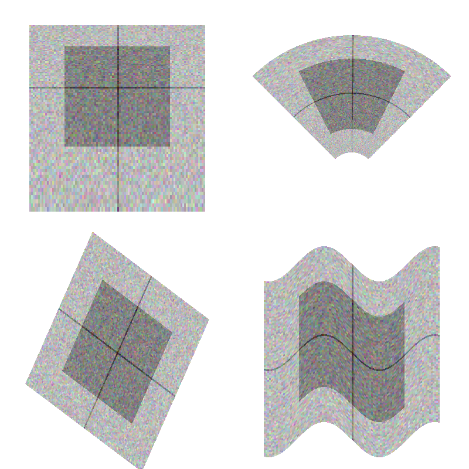

:author: Luke Campagnola
:email: luke.campagnola@gmail.com
:institution: University of North Carolina at Chapel Hill

:author: Almar Klein
:email: almar.klein@gmail.com 
:institution: Continuum Analytics

:author: Eric Larson
:email: eric.larson.d@gmail.com
:institution: University of Washington

:author: Cyrille Rossant
:email: cyrille.rossant@gmail.com
:institution: University College London

:author: Nicolas Rougier
:email: Nicolas.Rougier@inria.fr
:institution: French National Institute for Research in Computer Science and Control

------------------------------------------------------------
VisPy: Harnessing The GPU For Fast, High-Level Visualization
------------------------------------------------------------

.. class:: abstract

   The growing availability of large, multidimensional data sets has created
   demand for high-performance, interactive visualization tools. VisPy 
   leverages the GPU to provide fast, interactive, and beautiful visualizations
   in a high-level API. Here we introduce the main features,
   architecture, and techniques used in VisPy.

.. class:: keywords

   graphics, visualization, plotting, performance, interactive, opengl 

Motivation
----------

Despite the rapid growth of the scientific Python stack, one conspicuously absent element is a standard package for high-performance visualization. The de-facto standard for plotting is Matplotlib; however, this package is designed for publication graphics and is not optimized for visualizations that require realtime, interactive performance, or that incorporate large data volumes. Several packages have apeared in the Python ecosystem to fill this gap (vtk, chaco, pyqtgraph, visvis, galry, glumpy, etc.), but none has yet emerged as a serious candidate standard package. Consequently, these projects have spent much of their effort re-solving the same problems, and the ecosystem as a whole suffers from the lack of a focused, collaborative effort.

In recognition of this problem and the potential benefit to the Python community, VisPy was created as a collaborative effort to succeed several of these projects (visvis, galry, glumpy, and the visualization components of pyqtgraph). VisPy has quickly grown an active community of developers and is approaching beta status.

What is VisPy
-------------

VisPy is a scientific visualization library based on OpenGL. Its primary purpose is to deliver high-performance rendering under heavy load, but at the same time we aim to provide publication-quality graphics, a high-level 2D and 3D plotting API, and portability across many platforms. VisPy's main design criteria are:
    
* *High-performance for large data sets.* By making use of the modern, shader-based OpenGL pipeline, most of the graphical rendering cost is offloaded to the graphics processor (GPU). This allows realtime interactivity even for data on the order of millions of samples, and at the same time minimizes CPU overhead.
  
* *High-level visualization tools.* Most Python developers are not graphics experts. Getting from raw data to interactive visualization should require as little code as possible, and should require no knowledge of OpenGL or the underlying graphics hardware.
  
* *Publication quality output.* Commodity graphics hardware and the modern OpenGL shader pipeline have made it possible to render moderately large data sets without sacrificing quality. 

* *Flexibility.* VisPy strives to make common tasks easy, but it also makes complex and niche tasks possible through a flexible and extensibile architecture. VisPy's library of graphical components can be reconfigured and recombined to build complex scenes.

* *Portability.* VisPy's reliance on commodity graphics hardware for optimization reduces its reliance on CPU-optimized code or numerous external dependencies; VisPy is pure-Python and depends only on NumPy and a suitable GUI library. This makes VisPy easy to distribute and install across many platforms, including WebGL-enabled browsers.

VisPy's Architecture
--------------------

VisPy's functionality is divided into a layered architecture, with each new layer providing higher-level primitives. The top layers provide a powerful system for quickly and easily visualizing data, whereas the lower layers provide greater flexibility and control over OpenGL's features.

Layer 1: Object-Oriented GL
'''''''''''''''''''''''''''

The OpenGL API, although very powerful, is also somewhat verbose and unwieldy. VisPy's lowest-level layer, ``vispy.gloo``, provides an object-oriented OpenGL wrapper with a clean, compact, and Pythonic alternative to traditional OpenGL programming (however, developers unfamiliar with OpenGL are encouraged to work from the scenegraph and plotting layers instead). Objects that typically require several GL calls to instantiate, such as textures, vertex buffers, frame buffers, and shader programs, are instead encapsulated in simple Python classes (e.g. Table 1).

.. table:: The ``vispy.gloo`` API is compact, clean, and Pythonic compared to native OpenGL.
   :class: w

   +-----------------------------------------------+------------------------------------------------------------------+
   |            ``vispy.gloo``                     |            ``pyopengl``                                          |
   +===============================================+==================================================================+
   |                                               |                                                                  |
   |.. code-block:: python                         |.. code-block:: python                                            |
   |                                               |                                                                  |
   |   # create a shader program and assign        |   prg = glCreateProgram()                                        |
   |   # a value to the 'color' variable           |   vsh = glCreateShader(GL_VERTEX_SHADER)                         |
   |   program = Program(vert_code, frag_code)     |   glShaderSource(vsh, vert_code)                                 |
   |   program['color'] = (1, 0.5, 0, 1)           |   fsh = glCreateShader(GL_FRAGMENT_SHADER)                       |
   |                                               |   glShaderSource(fsh, vert_code)                                 |
   |                                               |   for shader in (vsh, fsh):                                      |
   |                                               |       glCompileShader(shader)                                    |
   |                                               |       assert glGetShaderParameter(shader, GL_COMPILE_STATUS) = 1 |
   |                                               |       glAttachShader(prg, shader)                                |
   |                                               |                                                                  |
   |                                               |   glLinkProgram(prg)                                             |
   |                                               |   assert glGetProgramParameter(prg, GL_LINK_STATUS) == 1         |
   |                                               |   nunif = glGetProgramParameter(prg, GL_ACTIVE_UNIFORMS)         |
   |                                               |   uniforms = {}                                                  |
   |                                               |   for i in range(nunif):                                         |
   |                                               |       name, id, typ = glGetActiveAttrib(prg, i)                  |
   |                                               |       uniforms[name] = id                                        |
   |                                               |   glUseProgram(prg)                                              |
   |                                               |   glUniform4fv(uniforms['color'], 1, (1.0, 0.5, 0.0, 1.0))       |
   +-----------------------------------------------+------------------------------------------------------------------+

   

OpenGL commands cannot be invoked until a context (usually provided by the GUI toolkit) has been created and activated. This requirement imposes program design limitations that can make OpenGL programs more awkward. To circumvent this restriction, ``vispy.gloo`` uses a context management system that queues all OpenGL commands until the appropriate context has become active. The direct benefit is that the end user is free to interact with ``vispy.gloo`` however makes sense for their program. Most notably, ``vispy.gloo`` objects can be instantiated as the program starts up, before any context is available.

The command queues used by ``vispy.gloo`` are also designed to be serializable such that commands generated in one process or thread can be executed in another. In this way, a stream of GL commands could be sent to a web browser (such as the IPython notebook), recorded to disk to be replayed later, or shared between processes to take advantage of multi-core systems.

Another purpose of ``vispy.gloo`` is to hide many of the differences between various versions and implementations of OpenGL. We currently target OpenGL versions 2.1 (desktop) and ES2.0 (embedded and WebGL), which is available on virtually all commodity hardware today. A closely related system, ``vispy.app``, abstracts the differences between the various supported GUI backends, which include PyQt4/5, PySide, IPython, SDL, GLFW, and several others. This support, combined with VisPy's pure-python and low-dependency approach, helps to ensure that VisPy will run on most platforms with minimal effort from users and developers alike.

Layer 2: Visuals
''''''''''''''''

The core of VisPy is its library of ``Visual`` classes that provide the primitive graphical objects used to build more complex visualizations. These objects range from very simple primitives (lines, points, triangles) to more powerful primitives (text, volumes, images), to high-level visualization tools (histograms, surface plots, spectrograms, isosurfaces). 

Internally, visuals upload their data to graphics memory and implement a shader program (see https://www.opengl.org/documentation/glsl/) that is executed on the GPU. This allows the most computationally intensive operations to run in compiled, parallelized code without adding any build dependencies (because all OpenGL implementations since 2.0 include a GLSL compiler). Visuals can be reconfigured and updated in real time by simply uploading new data or shaders to the GPU.

Visuals may also be modified by applying arbitrary filters (such as opacity, clipping, and lighting) and coordinate transformations. To support this flexibility, it is necessary to be able to recombine smaller chunks of shader code. VisPy implements a shader management system that allows independent GLSL functions to be attached together in a single shader program, which enables the insertion of arbitrary coordinate transformations and color modification into each visual's shader program.

VisPy implements a collection of coordinate transformation classes that are used to map between a visual's raw data and its output coordinate system (screen, image, svg, etc.). By offloading coordinate transformations to the GPU along with drawing operations, VisPy makes it possible to stream data directly from its source to the GPU without any modification in Python. Most transforms affect the location, orientation, and scaling of visuals and can be chained together to produce more complex adjustments. Transforms may also be nonlinear, as in logarithmic, polar, and mercator projections, and custom transforms can be implemented easily by defining the forward and inverse mapping functions in both Python and GLSL.

   One image viewed using four different coordinate transformations. VisPy supports linear transformations such as scaling, translation, and affine matrix multiplication (bottom left) as well as nonlinear transformations such as logarithmic (top left) and polar (top right). Custom transform classes are also easy to construct (bottom right).

The following example summarizes the code that produces the logarithmically-scaled image in Figure XX. It combines a scale/translation, followed by log base 2 along the y axis, followed by a second scale/translation to set the final position on screen. The resulting chained transformation maps from image coordinates (origin in upper left, 1 unit = 1 image pixel) to window coordinates (origin in upper left, 1 unit = 1 window pixel):

.. code-block:: python

   from vispy import visuals
   from vispy.visuals.transforms import (STTransform, 
                                         LogTransform)
   
   # Create an image from a (h, w, 4) array
   image = visuals.ImageVisual(image_data)
   
   # Assign a chain of transforms to stretch the image 
   # logarithmically and set its placement in the window 
   tr1 = STTransform(scale=(1, -0.01), 
                     translate=(-50, 1.3))
   tr2 = LogTransform((0, 2, 0))
   tr3 = STTransform(scale=(3, -150), 
                     translate=(200, 100))
   image.transform = tr3 * tr2 * tr1

Layer 3: Scenegraph
'''''''''''''''''''

Layer 3 implements common features required for interactive visualization, and is the first layer that requires no knowledge of OpenGL. This is the main entry point for most users who build visualization applications. Although the majority of VisPy's graphical features can be accessed by working directly with its Visual classes (layer 2), it can be confusing and tedious to manage the visuals, coordinate transforms, and filters for a complex scene. To automate this process, VisPy implements a scenegraph |---| a standard data structure used in computer graphics that organizes visuals into a hierarchy. Each node in the hierarchy inherits coordinate transformations and filters from its parent. VisPy's scenegraph allows visuals to be easily arranged in a scene and, in automating control of the system of transformations, it is able to handle some common interactive visualization requirements:

* *Picking.* User input from the mouse and touch devices are delivered to the objects in the scene that are clicked on. This works by rendering the scene to an invisible framebuffer, using unique colors for each visual; thus the otherwise expensive ray casting computation is carried out on the GPU.
* *Interactive viewports.* These allow the user to interactively pan, scale, and rotate data within the view, and the visuals inside the view are clipped to its borders.
* *Cameras.* VisPy contains a variety of camera classes, each implementing a different mode of visual perspective or user interaction. For example, ``PanZoomCamera`` allows panning and scaling for 2D plot data, whereas ``ArcballCamera`` allows data to be rotated in 3D like a trackball.
* *Lighting.* The user may add lights to the scene and shaded objects will react automatically.
* *Export.* Any portion of the scene may be rendered to an image at any resolution. We also plan to add support for exporting a scenegraph to SVG.
* *Layouts.* These automatically partition window space into grids allowing multiple visualizations to be combined in a single window.
* *High-resolution displays.* The scenegraph automatically corrects for high-resolution displays to ensure visuals are scaled correctly on all devices.

The example below is a simple demonstration of creating a scenegraph window and adding visuals to its scene:

.. code-block:: python

   import vispy.scene as vs
   
   # Create a window with a grid layout inside
   window = vs.SceneCanvas()
   grid = window.central_widget.add_grid()
   
   # Create a view with a 2D line plot inside
   view1 = grid.add_view(row=0, col=0, camera='panzoom')
   plot = vs.PlotLine(data1, parent=view1.scene)
   
   # Create a second view with a 3D surface plot
   view2 = grid.add_view(row=0, col=1, camera='turntable')
   axes = vs.SurfacePlot(data2, parent=view2.scene)
   
   # Move the axes a bit
   axes.transform = vs.AffineTransform()
   axes.transform.translate(2, 1, 0)
   axes.transform.rotate(30, 0, 1, 0)
   
   # start UI event loop
   window.app.run()

Layer 4: Plotting
'''''''''''''''''

VisPy's plotting layer allows quick and easy access to advanced data visualization, such as plotting, image display, volume rendering, histograms, and spectrograms. This layer is intended for use in simple analysis scripts or in an interactive session, and is similar in principle to Matplotlib's ``pyplot`` API. The following example creates a window displaying a plot line and a spectrogram of the same data:    

.. code-block:: python

   import numpy as np
   import vispy.plot as vp

   # Generate large array to plot
   data = np.random.normal(size=100000)
   # Add some spectral structure
   data[20000:80000] += data[::6./5.]

   # Create a figure with grid layout
   fig = vp.Fig()

   # Plot data in the first grid cell
   fig[0, 0].plot(data, symbol=None)

   # Add a spectrogram of the same data in the next row
   fig[1, 0].spectrogram(data)

Despite the large volume of data, the resulting views can be immediately panned and zoomed in realtime. As a rough performance comparison, the same plot data can be redrawn at about 0.2 Hz by Matplotlib, 2 Hz by PyQtGraph, and over 100 Hz by VisPy (on the author's machine). 

Each function in ``vispy.ploy`` generates scenegraph (layer 3) objects to allow lower level control over the visual output. This makes it possible to begin development with the simplest ``vispy.plot`` calls and iteratively refine the output as needed. VisPy also includes an experimental wrapper around ``mplexporter`` (from https://github.com/mpld3/mplexporter) that allows it to act as a drop-in replacement for Matplotlib in existing projects (however this approach is not always expected to have the same performance benefits as using the native ``vispy.plot`` API).

The ``vispy.plot`` interface is currently the highest-level and easiest layer VisPy offers. Consequently, it is also the least mature. We expect this layer to grow quickly in the coming months as we add more plot types and allow the API to settle.

Roadmap
-------

Our immediate goal for vispy is to stabilize the visual, scenegraph, and plotting APIs, and implement the most pressing basic features. We are continuallly testing for performance under different use cases and ensuring that behavior is consistent across all platforms. In the long term, we will implement more advanced features:

* *SVG export.* This is a must-have feature for any visualization library that targets publication graphics, and a high priority for VisPy.
* *Add more plot types.* The scope of ``vispy.plot`` includes a very broad range of high-level visualizations such as vector fields, flow charts. Building this library of visualizations will be an ongoing process.
* *Collections.* This system will allow many visuals to be joined together and drawn with a single call to OpenGL. This is expected to greatly improve performance when many visuals are displayed in the scene.
* *Order-independent blending*. This technique will allow translucent visuals to be correctly blended without the need to sort the visuals by depth first. This will greatly improve the rendering quality of many 3D scenes. 

