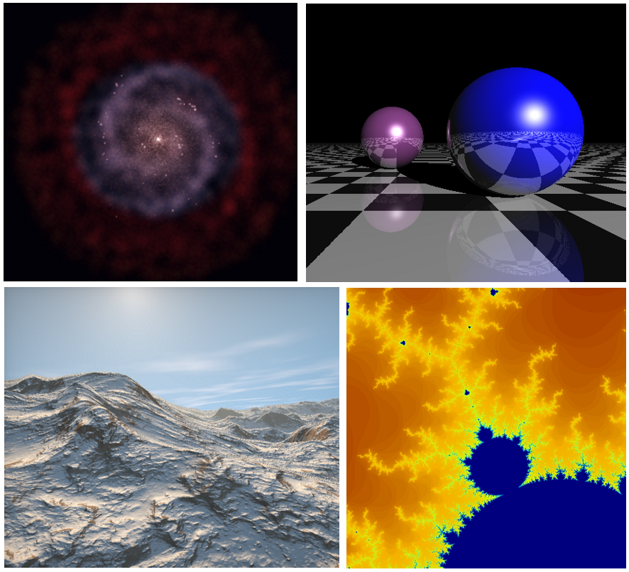
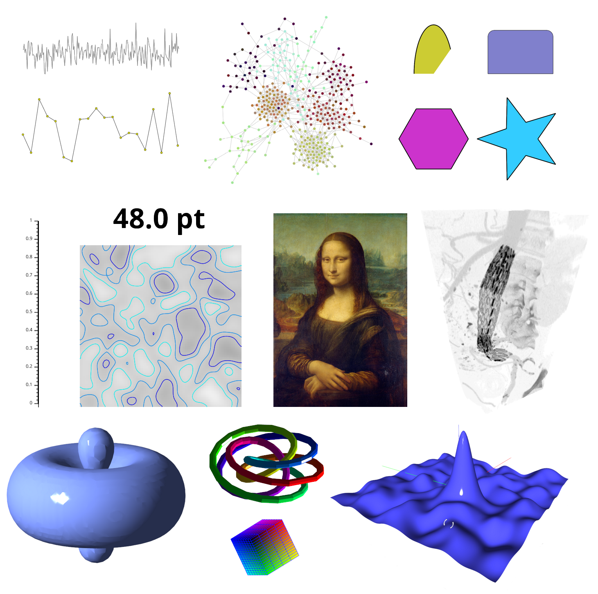
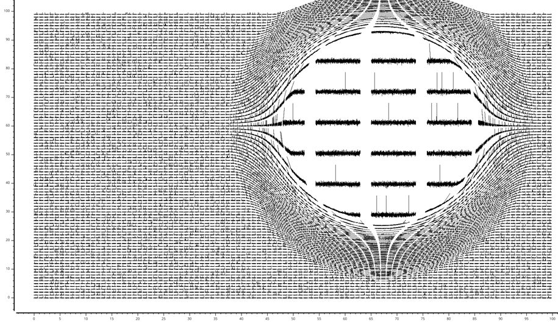
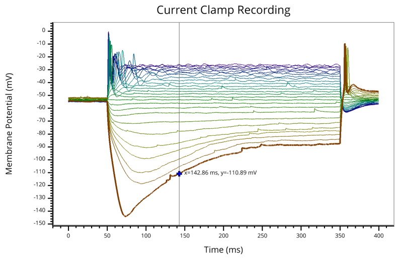
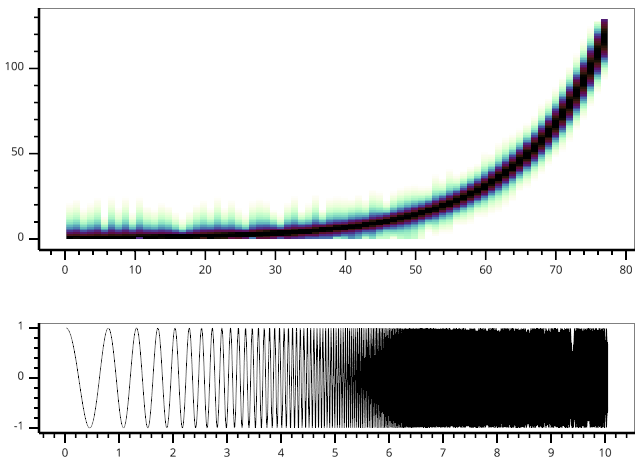

:author: Luke Campagnola
:email: luke.campagnola@gmail.com
:institution: University of North Carolina at Chapel Hill

:author: Almar Klein
:email: almar.klein@gmail.com 
:institution: Continuum Analytics

:author: Eric Larson
:email: eric.larson.d@gmail.com
:institution: University of Washington

:author: Cyrille Rossant
:email: cyrille.rossant@gmail.com
:institution: University College London

:author: Nicolas Rougier
:email: Nicolas.Rougier@inria.fr
:institution: French National Institute for Research in Computer Science and Control

------------------------------------------------------------
VisPy: Harnessing The GPU For Fast, High-Level Visualization
------------------------------------------------------------

.. class:: abstract

   The growing availability of large, multidimensional data sets has created
   demand for high-performance, interactive visualization tools. VisPy 
   leverages the GPU to provide fast, interactive, and beautiful visualizations
   in a high-level API. Here we introduce the main features,
   architecture, and techniques used in VisPy.

.. class:: keywords

   graphics, visualization, plotting, performance, interactive, opengl 

Motivation
----------

Despite the rapid growth of the scientific Python stack, one conspicuously absent element is a standard package for high-performance visualization. The de facto standard for plotting is Matplotlib [matplotlib]_; however, this package is designed for publication graphics and is not optimized for visualizations that require real-time, interactive performance, or that incorporate large data volumes. Several packages in the Python ecosystem are capable of high-performance visualization: VTK [vtk]_ provides an extensive set of 3D visualization tools with Python bindings, Chaco [chaco]_ offers efficient 2D plotting, PyQtGraph [pyqtgraph]_ is a scientific GUI library with fast plotting, Glumpy [glumpy]_ implements high-quality plotting primitives in OpenGL, and VisVis [visvis]_ and Galry [galry]_ both provide high-performance 2D/3D OpenGL visualization. Each of these packages has its particular strengths and weaknesses and, although the Python community benefits from such a rich ecosystem, at the same time it suffers from the lack of a focused, collaborative effort.

In recognition of this problem and the potential benefit to the Python community, VisPy [vispy]_ was created as a collaborative effort to succeed several of these projects |---| visvis, galry, glumpy, and the visualization components of pyqtgraph. VisPy has quickly grown an active community of developers and is approaching beta status.

What is VisPy
-------------

VisPy is a scientific visualization library based on OpenGL and NumPy [numpy]_. Its primary purpose is to deliver high-performance rendering under heavy load, but at the same time we aim to provide publication-quality graphics, a high-level 2D and 3D plotting API, and portability across many platforms. VisPy's main design criteria are:
    
* *High-performance for large data sets.* By making use of the modern, shader-based OpenGL pipeline, most of the graphical rendering cost is offloaded to the graphics processor (GPU). This allows real-time interactivity even for data on the order of tens of millions of samples, and at the same time minimizes CPU overhead.
  
* *High-level visualization tools.* Most Python developers are not graphics experts. Getting from raw data to interactive visualization should require as little code as possible, and should require no knowledge of OpenGL or the underlying graphics hardware.
  
* *Publication quality output.* Commodity graphics hardware and the modern OpenGL shader pipeline have made it possible to render moderately large data sets without sacrificing quality in primitive shapes or antialiasing [rougier2013a]_ [rougier2013b]_. VisPy is also designed to enable vector graphics output, although this feature is not yet implemented.

* *Flexibility.* VisPy strives to make common tasks easy |---| most basic plot types can be generated with just a few lines of code. At the same time, VisPy makes complex and niche tasks possible through a flexible and extensible architecture. VisPy's library of graphical components can be reconfigured and recombined to build complex, interactive scenes.

* *Portability.* VisPy's reliance on commodity graphics hardware for optimization reduces its reliance on CPU-optimized code or numerous external dependencies; VisPy is pure-Python and depends only on NumPy and a suitable GUI library. This makes VisPy easy to distribute and install across many platforms, including WebGL-enabled browsers.

VisPy's Architecture
--------------------

VisPy's functionality is divided into a layered architecture, with each new layer providing higher-level primitives. The top layers provide a powerful system for quickly and easily visualizing data, whereas the lower layers provide greater flexibility and control over OpenGL's features.

Layer 1: Object-Oriented GL
'''''''''''''''''''''''''''

The OpenGL API, although very powerful, is also somewhat verbose and unwieldy. VisPy's lowest-level layer, ``vispy.gloo``, provides an object-oriented OpenGL wrapper with a clean, compact, and Pythonic alternative to traditional OpenGL programming (Figure  :ref:`gloofig`). Developers unfamiliar with OpenGL are encouraged to work from the scenegraph and plotting layers instead. Objects that typically require several GL calls to instantiate, such as textures, vertex buffers, frame buffers, and shader programs, are instead encapsulated in simple Python classes. The following example demonstrates creating a shader program and assigning a value to one of its uniform variables:

.. code-block:: python                     
   
   program = Program(vert_code, frag_code)
   program['color'] = (1, 0.5, 0, 1)

The equivalent code using the OpenGL API is somewhat more verbose:

.. code-block:: python

    prg = glCreateProgram()
    vsh = glCreateShader(GL_VERTEX_SHADER)
    glShaderSource(vsh, vert_code)
    fsh = glCreateShader(GL_FRAGMENT_SHADER)
    glShaderSource(fsh, vert_code)
    for shader in (vsh, fsh):
        glCompileShader(shader)
        assert glGetShaderParameter(shader,
                                  GL_COMPILE_STATUS) == 1
        glAttachShader(prg, shader)
    glLinkProgram(prg)
    assert glGetProgramParameter(prg,GL_LINK_STATUS) == 1
    nunif = glGetProgramParameter(prg,GL_ACTIVE_UNIFORMS)
    uniforms = {}
    for i in range(nunif):
        name, id, typ = glGetActiveAttrib(prg, i)
        uniforms[name] = id
    glUseProgram(prg)
    glUniform4fv(uniforms['color'], 1, (1, 0.5, 0, 1))

..

Most OpenGL commands cannot be invoked until a context, provided by the GUI toolkit, has been created and activated. This requirement imposes design limitations that can make OpenGL programs more awkward. To circumvent this restriction, ``vispy.gloo`` uses a context management system that queues all OpenGL commands until the appropriate context has become active. The direct benefit is that the end user is free to interact with ``vispy.gloo`` however makes sense for their program. Most notably, ``vispy.gloo`` objects can be instantiated when the program starts up, before any context is available.

   A selection of demos written with ``vispy.gloo``. This layer provides low-level access to OpenGL with a simple and Pythonic API. It is primarily used to implement visual classes; however, developers who are familiar with OpenGL may find this a suitable starting point for some visualization tasks. :label:`gloofig`

The command queues used by ``vispy.gloo`` are also designed to be serializable such that commands generated in one process or thread can be executed in another. In this way, a stream of GL commands could be sent to a web browser such as the IPython notebook, recorded to disk to be replayed later, or shared between processes to take advantage of multi-core systems.

Another purpose of ``vispy.gloo`` is to hide many of the differences between various versions and implementations of OpenGL. We currently target OpenGL versions 2.1 for desktop systems and ES2.0 for embedded and WebGL systems, which are available on virtually all commodity hardware today. Systems that lack a modern GPU may still run VisPy code using a software OpenGL implementation such as Mesa [mesa3d]_. Notably, this is used by Travis CI [travisci]_ to run our unit tests. However, OpenGL versions older than 2.1 are not supported. VisPy also supports some features from OpenGL 3+ but these currently depend on pyopengl [pyopengl]_.

A closely related system, ``vispy.app``, abstracts the differences between the various supported GUI backends, which include PyQt4/5, PySide, IPython, SDL, GLFW, and several others. This system provides uniform access to user input, timers, and window features across all backends, and allows VisPy to be incorporated into most existing applications. VisPy can be used as a Qt widget, embedded in IPython notebook, or run on a headless server with almost no code differences. This support, combined with VisPy's pure-python and low-dependency approach, helps to ensure that VisPy will run on most platforms with minimal effort from users and developers alike. 

Layer 2: Visuals
''''''''''''''''

The core of VisPy is its library of ``Visual`` classes that provide the primitive graphical objects used to build more complex visualizations. These objects range from very simple primitives (lines, points, triangles) to more powerful primitives (text, volumes, images), to high-level visualization tools (histograms, surface plots, spectrograms, isosurfaces). Figure :ref:`visualfig` shows several examples of visuals implemented in VisPy. 

   A selection of VisPy's visuals. These span the range from simple 2D and 3D primitives to more advanced visualization tools like contour plots, surface plots, and volume renderings. More complex visualizations can be built from combinations of these visuals. :label:`visualfig`

Internally, visuals upload their data to graphics memory and implement a shader program [glsl]_ that is executed on the GPU. Because all OpenGL implementations since 2.0 include an OpenGL shader language (GLSL) compiler, this allows the most computationally intensive operations to run in compiled, parallelized code without adding any build dependencies. Visuals can be reconfigured and updated in real time by simply uploading new data or shaders to the GPU. Before drawing, each visual also configures the necessary OpenGL global state such as blending and depth testing. These state parameters may be reconfigured for each visual to select different compositing modes.

Visuals may also be modified by applying arbitrary coordinate transformations and filters such as opacity, clipping, and lighting. To support this flexibility, it is necessary to be able to recombine smaller chunks of shader code. VisPy implements a shader management system that allows independent GLSL functions to be attached together in a single shader program. This enables the insertion of arbitrary coordinate transformations and color modification into each visual's shader program.

VisPy implements a collection of coordinate transformation classes that are used to map between a visual's raw data and its output coordinate system (screen, image, svg, etc.). By offloading coordinate transformations to the GPU along with drawing operations, VisPy makes it possible to stream data directly from its source to the GPU without any modification in Python. Most transforms affect the location, orientation, and scaling of visuals and can be chained together to produce more complex adjustments. Transforms may also be nonlinear, as in logarithmic, polar, and Mercator projections, and custom transforms can be implemented easily by defining the forward and inverse mapping functions in both Python and GLSL.

.. figure:: image_transforms.png

   One image viewed using four different coordinate transformations. VisPy supports linear transformations such as scaling, translation, and matrix multiplication (bottom left) as well as nonlinear transformations such as logarithmic (top left) and polar (top right). Custom transform classes are also easy to construct (bottom right).  :label:`imagetrfig`

The following example summarizes the code that produces the logarithmically-scaled image in Figure :ref:`imagetrfig`. It combines a scale/translation, followed by log base 2 along the y axis, followed by a second scale/translation to set the final position on screen. The resulting chained transformation maps from the image's pixel coordinates to the window's pixel coordinates:

.. code-block:: python

   from vispy import visuals
   from vispy.visuals.transforms import (STTransform, 
                                         LogTransform)
   
   # Create an image from a (h, w, 4) array
   image = visuals.ImageVisual(image_data)
   
   # Assign a chain of transforms to stretch the image 
   # logarithmically and set its placement in the window 
   tr1 = STTransform(scale=(1, -0.01), 
                     translate=(-50, 1.3))
   tr2 = LogTransform((0, 2, 0))
   tr3 = STTransform(scale=(3, -150), 
                     translate=(200, 100))
   image.transform = tr3 * tr2 * tr1

Quality and Optimization in Visuals
'''''''''''''''''''''''''''''''''''

One of VisPy's main challenges is to implement visuals that simultaneously satisfy three major design constraints: high performance, high quality, flexibility, and portability. In reality, no single visualization algorithm can cover all of the possible use cases for a single visual. For example, algorithms that provide the highest quality may impact performance, techniques that improve performance may not be available on all platforms, and some combinations of techniques naturally require an inflexible implementation.

In VisPy's approach, each visual implements multiple rendering algorithms that share the same API. The user may then select for different performance and quality targets and the visual will gracefully fall back to safer techniques if the platform requires it. For example, drawing a surface plot with lighting requires a normal vector to be calculated for each location on the surface. If the surface vertex positions are specified in a floating point texture, then the normal calculation can be performed on the GPU. However, older OpenGL versions (and current WebGL implementations) lack the necessary texture support. For these cases, extra effort is required to either encode the vertex positions in a different type of texture, or to perform the normal calculation on the CPU. Alternatively, the surface can be rendered with a lower quality method that does not require normal vector calculation.

More generally, optimizing for performance often requires consideration for two different targets: data *volume* and data *throughput*. In the former case, a large but static data set is uploaded to the GPU once but subsequently viewed or modified interactively. This case is typically limited by the efficiency of the shader programs, and thus it may help to pre-process the data once on the CPU to lighten the recurring load on the GPU. In the latter case, data is being rapidly streamed to the GPU and is typically displayed only once before being discarded. This case tends to be limited by the per-update CPU overhead, and thus may be optimized by offloading more effort to the GPU. Intertwined with these optimization targets are quality considerations |---| often performance can be improved by sacrificing rendering quality, but the true performance gain of each sacrifice can be unpredictable.

By wrapping multiple rendering techniques within a single API, the user is freed from the burden of restructuring their application for each technique. Some cases, however, are too unique to fit comfortably in a generic API. For example, Figure :ref:`scrollfig` uses a specialized visual to draw a 100x100 grid of scrolling plots, each containing 2,000 data points. This example could be implemented using the basic line visual techniques, but independently updating each of the 10,000 lines as they scroll would be prohibitively slow. The example is able to run over 30 fps by organizing the data in memory as a 2D circular buffer, which allows all plots to be updated in a single operation. The essential lines of this example are summarized below:

   A large collection of scrolling plots rendered with a specialized visual (``examples/demo/scene/scrolling_plots.py``). There are 10,000 plots, each containing 2,000 data points for a total of 20 million points drawn per frame. The plots are scrolled continuously as new data is streamed to the GPU, and still render at 35 fps on the author's laptop. A region of the plot is enlarged using a nonlinear transform.  :label:`scrollfig`

.. code-block:: python

    lines = ScrollingLines(n_lines=10e3, line_size=2e3,
                           columns=100, dt=4e-4,
                           cell_size=(1, 8))

    def update(ev):
        # add 10 samples to each plot
        data = np.random.normal(size=(N, 10), scale=0.3)
        data[data > 1] += 4  # random spikes
        lines.roll_data(data)

    timer = app.Timer(connect=update, interval=0)
    timer.start()

Layer 3: Scenegraph
'''''''''''''''''''

Layer 3 implements common features required for interactive visualization, and is the first layer that requires no knowledge of OpenGL. This is the main entry point for most users who build visualization applications. Although the majority of VisPy's graphical features can be accessed by working directly with its Visual classes (layer 2), it can be confusing and tedious to manage the visuals, coordinate transforms, and filters for a complex scene. To automate this process, VisPy implements a scenegraph |---| a standard data structure used in computer graphics that organizes visuals into a hierarchy. Each node in the hierarchy inherits coordinate transformations and filters from its parent. VisPy's scenegraph allows visuals to be easily arranged in a scene and, in automating control of the system of transformations, it is able to handle some common interactive visualization requirements:

* *Picking.* User input from the mouse and touch devices are delivered to the objects in the scene that are clicked on. This works by rendering the scene to an invisible framebuffer, using unique colors for each visual; thus the otherwise expensive ray casting computation is carried out on the GPU.
* *Interactive viewports.* These allow the user to interactively pan, scale, and rotate data within the view, and the visuals inside the view are clipped to its borders.
* *Cameras.* VisPy contains a variety of camera classes, each implementing a different mode of visual perspective or user interaction. For example, ``PanZoomCamera`` allows panning and scaling for 2D plot data, whereas ``ArcballCamera`` allows data to be rotated in 3D like a trackball.
* *Lighting.* The user may add lights to the scene and shaded objects will react automatically.
* *Export.* Any portion of the scene may be rendered to an image at any resolution. We also plan to add support for exporting a scenegraph to SVG.
* *Layouts.* These automatically partition window space into grids allowing multiple visualizations to be combined in a single window.
* *High-resolution displays.* The scenegraph automatically corrects for high-resolution displays to ensure visuals are scaled correctly on all devices.

The example below is a simple demonstration of creating a scenegraph window and adding visuals to its scene:

.. code-block:: python

   import vispy.scene as vs
   
   # Create a window with a grid layout inside
   window = vs.SceneCanvas()
   grid = window.central_widget.add_grid()
   
   # Create a view with a 2D line plot inside
   view1 = grid.add_view(row=0, col=0, camera='panzoom')
   plot = vs.PlotLine(data1, parent=view1.scene)
   
   # Create a second view with a 3D surface plot
   view2 = grid.add_view(row=0, col=1,
                         camera='turntable')
   surf = vs.SurfacePlot(data2, parent=view2.scene)
   
   # Adjust the position and orientation of 
   # the surface plot
   surf.transform = vs.AffineTransform()
   surf.transform.translate(2, 1, 0)
   surf.transform.rotate(30, 0, 1, 0)
   
   # start UI event loop
   window.app.run()

Adding mouse interaction requires the ability to determine which visuals are under the mouse cursor and to map between the coordinate systems of the canvas and the visual. In the example below, the coordinate system mapping corrects for the scale and translation of a 2D interactive view box:

.. code-block:: python

    @window.connect
    def on_mouse_press(event):
        # get the visual under the click
        vis = window.visual_at(event.pos)
        
        # map the click position to the coordinate
        # system of the visual
        tr = window.scene.node_transform(vis)
        pos = tr.map(event.pos)
        
        print("Clicked on %s at %s" % (vis, pos)) 

A more complete mouse interaction example is described in Figure :ref:`pickingfig`.

   Mouse interaction example (``examples/demos/scene/picking.py``). In this example, mouse press events are captured and a list of visuals near the mouse is generated using ``canvas.visuals_at(pos, radius=10)``. The list of visuals is returned in order of proximity to the mouse, allowing the nearest line to be selected. Mouse movement events are captured in a separate callback and used to update the plot cursor. The location along the plot line and the cursor placement are all determined by mapping the mouse position into the local coordinate system of the selected visual. :label:`pickingfig`

Layer 4: Plotting
'''''''''''''''''

VisPy's plotting layer allows quick and easy access to advanced data visualization, such as plotting, image display, volume rendering, histograms, and spectrograms. This layer is intended for use in simple analysis scripts or in an interactive session, and is similar in principle to Matplotlib's ``pyplot`` API. The following example creates a window displaying a plot line and a spectrogram of the same data:    

.. code-block:: python

    
    import numpy as np
    from vispy import plot as vp

    # Create a logarithmic chirp
    fs = 1000.
    N = 1000000
    t = np.arange(N) / float(fs)
    f0, f1 = 1., 500.
    phase = ((t[-1] / np.log(f1 / f0)) * f0 * 
             (pow(f1 / f0, t / t[-1]) - 1.0))
    data = np.cos(2 * np.pi * phase)
    
    # Create a figure in a new window and add a 
    # spectrogram and line in separate sub-plots. 
    fig = vp.Fig(size=(800, 400))
    fig[0:2, 0].spectrogram(data, fs=fs, clim=(-100, -20))
    fig[2, 0].plot(np.array((t, data)).T, marker_size=0)

The output of this code is shown in Figure :ref:`plotfig`.

   Example ``vispy.plot`` output (from ``examples/basics/plotting/spectrogram.py``). This figure requires only three lines to generate, excluding the data generation: one to create the figure window, and one each for the spectrogram and line plots. The plot areas can be zoomed and panned with the mouse. Despite containing 1e6 samples, the plots update smoothly. :label:`plotfig`

Despite the large volume of data, the resulting views can be immediately panned and zoomed in real-time. As a rough performance comparison, the same plot data can be redrawn at about 0.2 Hz by Matplotlib, 2 Hz by PyQtGraph, and over 30 Hz by VisPy on the author's machine. 

Each function in ``vispy.plot`` generates scenegraph (layer 3) objects to allow lower level control over the visual output. This makes it possible to begin development with the simplest ``vispy.plot`` calls and iteratively refine the output as needed. VisPy also includes an experimental wrapper around mplexporter [mplexporter]_ that allows it to act as a drop-in replacement for Matplotlib in existing projects. This approach, however, is not always expected to have the same performance benefits as using the native ``vispy.plot`` API.

The ``vispy.plot`` interface is currently the highest-level and easiest layer VisPy offers. Consequently, it is also the least mature. We expect this layer to grow quickly in the coming months as we add more plot types and allow the API to settle.

Future Work
-----------

Our immediate goal for vispy is to stabilize the visual, scenegraph, and plotting APIs, and implement the most pressing basic features. We are continuously testing for performance under different use cases and ensuring that behavior is consistent across all platforms. In the long term, we plan to implement more advanced features:

* *Add more plot types.* The scope of ``vispy.plot`` encompasses a very broad range of high-level visualizations, only a few of which are currently implemented. Expanding this library of visualizations will be an ongoing process. In the future we expect to support vector fields, flow charts, parametric surfaces, bar charts, and many more.
* *Add more interactive tools.* With VisPy it should be simple to select, manipulate, and slice many different kinds of data. The scenegraph makes this easier by providing support for picking, but we would like to add a set of higher level tools such as region of interest boxes, rotation gimbals, contrast and colormap controls, etc. We also plan to allow picking individual vertices within a single visual.
* *SVG export.* This is a must-have feature for any visualization library that targets publication graphics, and a high priority for VisPy. Most 2D visuals will be simple to implement as they have direct analogs in the SVG standard. Other visuals, however, may simply be rendered as an image in the export process.
* *Backend and OpenGL support.* VisPy currently supports most desktop platforms and has preliminary support for IPython notebook. We are working to add support for mobile devices and embedded systems like the Raspberry Pi, as well as a wider range of web backends. We would also like to expand support for newer GPU features such as geometry and tesselation shaders and general purpose GPU computing libraries like Cuda [cuda]_ and OpenCL [opencl]_.
* *Collections.* This system will allow many visuals to be joined together and drawn with a single call to OpenGL. This is expected to greatly improve performance when many static visuals are displayed in the scene. This will allow efficiently drawing complex shapes such as maps, 
* *Order-independent blending*. This technique will allow translucent visuals to be correctly blended without the need to sort the visuals by depth first. This will greatly improve the rendering quality of many 3D scenes. 

With the base plotting API almost settled, VisPy is rapidly approaching beta status when it will become more useful to a broader audience. In the long term we hope VisPy will continue to flourish and expand its community of developers.

References
----------

.. [vispy] *VisPy: OpenGL-based interactive visualization in Python*
        http://vispy.org

.. [matplotlib] J. D. Hunter. *Matplotlib: A 2D graphics environment*,
        Computing In Science & Engineering, 9(3):90-95, IEEE COMPUTER SOC, 2007.

.. [vtk] Kitware. *VTK - The Visualization Toolkit*,
        http://www.vtk.org/

.. [chaco] Enthought, Inc. *Chaco*,
        http://code.enthought.com/projects/chaco/

.. [pyqtgraph] L. Campagnola. *PyQtGraph. Scientific Graphics and GUI Library for Python*,
        http://www.pyqtgraph.org/

.. [glumpy] N. Rougier. *Glumpy: fast, scalable and beautiful scientific visualization*,
        https://glumpy.github.io/

.. [visvis] A. Klein. *visvis - The object oriented approach to visualization.*
        https://code.google.com/p/visvis/

.. [galry] C. Rossant. *Galry: high performance interactive visualization package in Python*,
        https://github.com/rossant/galry
            
.. [numpy] S. van der Walt, S.C. Colbert and G. Varoquaux, *The NumPy Array: A
        Structure for Efficient Numerical Computation*, Computing in Science
        & Engineering, 13, 22-30, 2011.

.. [mesa3d] *The Mesa 3D Graphics Library*
        http://www.mesa3d.org/

.. [travisci] *Travis CI*
        https://travis-ci.org/

.. [pyopengl] *PyOpenGL*
        http://pyopengl.sourceforge.net/

.. [glsl] *OpenGL Shading Language*
        https://www.opengl.org/documentation/glsl/
        
.. [rougier2013a] Nicolas P. Rougier, *Higher Quality 2D Text Rendering*, 
        Journal of Computer Graphics Techniques (JCGT), vol. 2, no. 1, 50-64, 2013.
        Available online http://jcgt.org/published/0002/01/04/
        
.. [rougier2013b]  Nicolas P. Rougier, *Shader-Based Antialiased, Dashed, Stroked Polylines*, 
        Journal of Computer Graphics Techniques (JCGT), vol. 2, no. 2, 105--121, 2013 
        Available online http://jcgt.org/published/0002/02/08/

.. [mplexporter]  mpld3, *mplexporter - A general scraper/exporter for matplotlib plots*
        https://github.com/mpld3/mplexporter

.. [opencl]  Khronos Group, *OpenCL - The open standard for parallel programming of heterogeneous systems*,
        https://www.khronos.org/opencl/
        
.. [cuda]  nVidia, *CUDA - Paallel Programming and Computing Platform*,
        http://www.nvidia.com/object/cuda_home_new.html
        