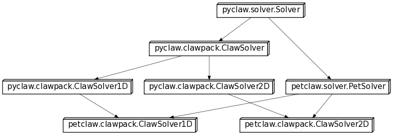

:author: Kyle Mandli 
:email: mandli@amath.washington.edu
:institution: University of Washington

:author: Amal Alghamdi
:email: amal.ghamdi@kaust.edu.sa
:institution: King Abdullah University of Science and Technology

:author: Aron Ahmadia 
:email: aron.ahmadia@kaust.edu.sa
:institution: King Abdullah University of Science and Technology

:author: David Ketcheson
:email: david.ketcheson@kaust.edu.sa
:institution: King Abdullah University of Science and Technology

:author: William Scullin 
:email: wscullin@alcf.anl.gov
:institution: Argonne National Labs

-------------------------------------------------------------------
Using Python to Construct a Scalable Parallel Nonlinear Wave Solver
-------------------------------------------------------------------

.. class:: abstract

Computational scientists seek to provide efficient, easy-to-use tools and
frameworks that enable application scientists within a specific discipline to
build and/or apply numerical models with up-to-date computing technologies
that can be executed on all available computing systems. Although many tools
could be useful for groups beyond a specific application, it is often
difficult and time consuming to combine existing software, or to adapt it for
a more general purpose. Python enables a high-level approach where a general
framework can be supplemented with tools written for different fields and in
different languages. This is particularly important when a large number of
tools are necessary, as is the case for high performance scientific codes.
This motivated our development of PetClaw, a scalable distributed-memory
solver for time-dependent nonlinear wave propagation, as a case-study for how
Python can be used as a high-level framework leveraging a multitude of codes,
efficient both in the reuse of code and programmer productivity. We present
scaling results for computations on up to four racks of Shaheen, an IBM
BlueGene/P supercomputer at King Abdullah University of Science and
Technology. One particularly important issue that PetClaw has faced is the
overhead associated with dynamic loading leading to catastrophic scaling. We
use the walla library to solve the issue which does so by supplanting
high-cost filesystem calls with MPI operations at a low enough level that
developers may avoid any changes to their codes.

.. class:: keywords

   parallel, scaling, finite volume, nonlinear waves, PyClaw, PetClaw, Walla

Introduction
------------

Nowadays, highly efficient, robust, and reliable open source implementations
of many numerical algorithms are available to computational scientists.
However, different tools needed for a single project may not be available in a
single package and may even be implemented in different programming languages.
In this case, a common solution is to re-implement the various tools required
in yet another software package. This approach is quite expensive in terms of
effort, since a completely new code must be written, tested, and debugged. An
alternative approach is to bring together the existing software tools by
wrapping them in a small code based on abstractions compatible with all of
them and able to interface with each programming language involved. The latter
approach has the advantage that only a small amount of relatively high-level
code needs to be written and debugged; the bulk of the work will still be done
by the reliable, tested packages. In this paper, PyClaw and PetClaw are
presented as examples of the philosophy that bridging well-established codes
with high-level maintainable code is an alternative approach that leads to
advantages in usability, extensibility, and maintainability when compared to
completely custom built scientific software.

PyClaw and PetClaw are implemented in the Python programming language, and
this choice of language has been essential to their success, for multiple
reasons. Python is an interpreted scripting language that has become
recognized in the scientific computing community as a viable alternative to
Matlab, Octave, and other languages that are specialized for scientific work
[cai2005]_. For instance, Python (with the numpy package) possesses a natural
and inuitive syntax for mathematical operations, has a built-in user-friendly
interactive debugger, and allows simulation and visualization to be integrated
into a single environment. At the same time, Python is a powerful, elegant,
and flexible language. Furthermore, there exist many Python packages that make
it simple to incorporate code written in C, C++, and Fortran into Python
programs. Python has been suggested as particularly useful in enabling
reproducible computational research [leveque2009]_.

PyClaw and PetClaw Design and Implementation
--------------------------------------------

PyClaw and PetClaw are designed to facilitate the implementation of new
algorithms and methods in the existing framework established in the well-known
software package Clawpack [clawpack]_. Clawpack is used to solve linear and
nonlinear hyperbolic systems of partial differential equations using a Godunov
type method with limiters and is written primarily in Fortran. It has been
freely available since 1994 and has more than 7,000 registered users in a
large variety of applications. The goal in the design of PyClaw and PetClaw is
to provide interfaces to Clawpack that will facilitate the use of advanced
parallel strategies, algorithm improvements, and other possible enhancements
that may be field specific to the original algorithms available in Clawpack.

PyClaw
~~~~~~

PyClaw is based on the principles of abstraction and careful definition of 
interfaces.  These principles have allowed a broad range of extensions to be 
developed for PyClaw in a short period of time with wide success.  The basic 
building blocks of PyClaw involve the separation of the data structures
representing the gridded data and the domain and the solution operators that 
advance the gridded data to the end-time requested.  Both of these
abstraction and layers also implement accessors that can be overridden to
provide advance functionality as well as is the case in PetClaw.

The *Solution* class represents a snap-shot of the gridded data at a single
instance in time.  The class acts as a container object with possibly multiple
*Grid* objects in the case of adaptive mesh refinement or nested grids, both
of which the Clawpack algorithms are capable of.  Furthermore, the *Grid*
objects also contain a set of `Dimension` objects that define the domain that
each *Grid* is defined on.  Using this hierarchical class structure allows the
gridded data in PyClaw to not only represent relatively arbitrarily complex 
gridded data but also allows individual components of the data structures to 
be sub-classed without the knowledge of the rest of the data structure.  This
is why the implementation of a package like PetClaw is as transparent as it is
to the end-user.  An example of a *Solution* object can be seen in figure 
:ref:`FigSolutionStructure`.
    
.. figure:: pyclaw_solution_structure.pdf

   PyClaw Solution structure. :label:`FigSolutionStructure`

The *Solver* class is the numerical realization of a solution operator mapping
the initial condition, represented by a *Solution* object, to a later time.
The base *Solver* class defines a basic set of interfaces that must be
implemented in order for the infrastructure included in PyClaw to evolve the
*Solution* object forward in time.  For instance, the routine::

    evolve_to_time(solution,t)
    
will operate on the *Solution* object *solution* and do the necessary 
operations to evolve it forward in time.  This is accomplished through 
appropriate time stepping in the base *Solver* object and the definition of a
*step()* routine that the particular sub-class of *Solver* has implemented.
This basic algorithm can be seen in figure :ref:`FigSolverStructure`.

We expect the PyClaw code to be more easily maintainable and extensible than
Clawpack, for reasons based on the difference between the Fortran 77 and
Python languages [logg2010]_. Fortran 77 codes generally require very long
lists of arguments to subroutines, because of the lack of dynamic memory
allocation and structured data types. This often leads to bugs when a
subroutine interface is changed, because it is challenging to ensure that the
function call is modified correctly throughout the program. In contrast,
Python allows the use of extremely simple argument lists, since it has dynamic
memory allocation, is object-oriented, and allows for default argument values
to be pre-specified. This difference has already allowed the simple
integration of different algorithms into a single framework (PyClaw). The
Fortran versions of these programs share only a small fraction of code and
require significantly different setup by the user, but in PyClaw switching
between them is trivial.

The solvers currently available are the 2nd-order algorithms of 
Clawpack  and the high order algorithms found in SharpClaw [sharpclaw]_.
Clawpack is based on a Lax-Wendroff approach plus TVD limiters, while
SharpClaw is based on a method of lines approach using weighted
essentially non-oscillatory (WENO) reconstruction and high order Runge-Kutta 
methods.  The abstract Solver class has been carefully designed to allow these
solvers to be swapped trivially, i.e. by using either::

    solver = pyclaw.ClawSolver2D()

for Clawpack, or::

    solver = pyclaw.SharpClawSolver2D()

for SharpClaw.  This allows the user to easily compare the performance of
different methods.

.. figure:: pyclaw_architecture_flow.pdf

   PyClaw architecture flow with solver structures.
   :label:`FigSolverStructure`

Another very useful abstraction managed by PyClaw is that of the
implementation language. The 1D PyClaw solvers contain a complete
implementation of both the Clawpack and SharpClaw algorithms, written entirely
in Python. This is useful for rapidly prototyping, debugging, and testing
modifications or new options, since new algorithms for hyperbolic PDEs are
typically developed in a 1D setting. Since this code is written using *numpy*
and vectorization, it is tolerably fast, but still significantly slower than
compiled C or Fortran (vectorized *numpy* code is similar in speed to
vectorized MATLAB code). For production runs, the user can easily switch to
the more efficient wrapped Fortran codes. This is handled simply by setting
the `kernel_language` attribute of the `Solver` object to "Python" or
"Fortran" (the latter being the default). Even more efficient CUDA
implementations of these kernels are in preparation. The benefit of this
design is that the user does not need to know multiple programming languages
in order to take advantage of different implementations.

PetClaw
~~~~~~~
Nilsen et. al. have suggested Python as a good high-level language for use in
parallelization of scientific codes because it allows for extensive
reuse of serial code and little effort (related to parallelism) from
the end user [nilsen2010]_.  

PetClaw is designed to use PETSc to add parallel functionality to PyClaw with
both of these objectives in mind. This means that the (serial) PyClaw code
should not need modification to accommodate PetClaw extensions and that within
PetClaw all parallel operations should be handled by PETSc data structures in
a way that is transparent to the user. Python makes both of these goals
achievable within an elegant framework.

By implementing all necessary parallel code in Python, Nilsen demonstrated
approximately 90\% parallel efficiency for various applications on up to 50
processors. Because we need to go three orders of magnitude further in
parallel scaling, PetClaw design goes beyond the approach suggested in
[nilsen2010]_ and related works, by handing off all parallel operations to a
widely used, robust library (PETSc) written in a compiled language. Because
PETSc is very actively developed and maintained for use in many scientific
codes and on many hardware platforms, this also means that PetClaw developers
don't have to worry about portability or maintenance of the parallel routines
and can instead focus on the numerical algorithms that are particular to
PetClaw.

An even more significant advantage gained by interfacing with PETSc
that may be leveraged in the future is access to a variety of efficient
parallel solvers.

.. figure:: software_architecture.pdf

   Modular structure of the PetClaw code, with a focus on the orthogonality of
   the Fortran kernels from the parallel decomposition through PETSc.

Python language features and multiple inheritance have been used to make
running parallel simulations with PetClaw very simple.  The only difference
between a serial PyClaw script and a PetClaw script that runs on tens of 
thousands of cores is exchanging::

    import pyclaw

for::

    import petclaw as pyclaw

Arrays for the solution and for coefficients that vary in space are
represented by numpy arrays in PyClaw but by a custom distributed `Vec` class
in PETSc. Using the *property* Python language feature, this difference is
completely transparent to the user. Parallel solver classes are implemented
via multiple inheritance; in most cases, a parallel solver is created merely
by subclassing the corresponding serial solver as well as a base parallel
solver class *PetSolver*; no further attributes or methods need to be
implemented. As a result, the entire PetClaw extension consists of less than
300 lines of code.

Figre :ref:`petclawInheritance` shows how serial and parallel functionality,
as well as algorithmic and dimensional differences, are implemented in an
orthogonal way using class inheritance.

    Class inheritance diagram for PetClaw solvers. :label:`petclawInheritance`

Software Engineering
~~~~~~~~~~~~~~~~~~~~
One of the potential indirect benefits of developing a code in Python is
exposure to the generally high level of software engineering practices
maintained by the Python community. Primarily as a result of this exposure,
PyClaw includes a suite of regression tests that currently cover 57\% of the
code and are being expanded. The Python package *nose* is used to easily run
the tests or any desired subset of them. Code development is coordinated using
the distributed version control software Git and the code hosting website
Github. The project has an active issue tracker where bugs are reported and
new features are suggested, as well as an online forum
(petclaw-dev@googlegroups.com) where more detailed discussions take place.
Finally, online documentation including both reference material and tutorials
is maintained using the Python package *Sphinx*, which allows, among other
things, for mathematical expressions to be included in inline code
documentation and automatically rendered using *LaTeX* when viewed online.
While many of these practices and features would be taken for granted in
industrial codes, they are not standard in academic scientific codes
[wilson2006]_.

2D Performance Results
----------------------
For PetClaw performance assessment with 2D problems, we have conducted on-core
serial experiments to compare the performance of PetClaw code with the
corresponding pure Fortran code, Clawpack. We have also performed weak scaling
experiments to study the scalability of PetClaw on up to four racks of the
Shaheen system. Corresponding results for PetClaw simulations in 1D may be
found in [petclaw11]_.

We consider two systems of equations in our performance tests. The first is
the system of 2D linear acoustics and the second is the 2D Euler equations of
compressible fluid dynamics. The acoustics test involves a very simple Riemann
solver and is intended to highlight any performance difficulties arising from
the Python code overhead. The Euler test involves a more typical, costly
Riemann solver and should be considered as more representative of realistic
nonlinear application problems.

.. simulating a shock wave hitting a spherical bubble of low-density gas with initially constant pressure and zero velocity near the bubble, as a result of the shock wave, the bubble turns into a smoke ring [clawpack]_.

On-Core Performance
~~~~~~~~~~~~~~~~~~~

Table :ref:`SerialComparison` shows on-core serial comparison between two
Clawpack simulations with the corresponding PetClaw simulations. Note that
both codes rely on the same low-level kernels; only the high-level code is
different. Because most of the computational cost is in executing these
kernels, the difference in performance is relatively minor: 30\% for the
acoustics test, and 17\% for the Euler test. For these runs, we have used
gfortran 4.2 and optimization flag *-O3*.

.. table:: Timing results in seconds for on-core serial experiment of an 
           acoustics and Euler problems implemented in both Clawpack and    
           PetClaw. :label:`SerialComparison`

   +-----------+-----------+---------+----------+
   |           | Clawpack  | PetClaw | Ratio    |
   +-----------+-----------+---------+----------+
   | Acoustics | 43.2s     | 56.1s   | 1.30     |
   +-----------+-----------+---------+----------+
   | Euler     | 337.2s    | 395.6s  | 1.17     |
   +-----------+-----------+---------+----------+

Parallel Performance
~~~~~~~~~~~~~~~~~~~~

Table :ref:`ScalingTable` shows the execution time for both experiments as the
number of cores increases from one core up to 16 thousand cores, (four racks
of BlueGene/P), with the ratio of work per core fixed. The acoustics problem
used involves 178 time steps on a square grid with 160,000 (400x400) grid
cells per core. The Euler problem used involves 67 time steps on a grid also
with 160,000 grid cells per core. The first column for each test indicates the
simulation time excluding the load time required to import Python modules. The
second column indicates the total simulation time, including Python module
imports.

Excellent scaling is observed for both tests, apart from the dynamic loading.
Profiling of the acoustics example shows that the small loss of efficiency is
primarily due to the communication of the CFL number, which requires a max
global reduce operation that is done each time step, and also partly due to
the communication of ghost cell values between adjacent domains at each time
step.

In contrast, the total job time reveals the very poor scaling of the dynamic
loading time. For the largest jobs considered, this load time is roughly one
hour, which is significant though generally not excessive relative to typical
simulation times, since the CFL condition means that large simulations of
hyperbolic problems necessarily require long run times in order for waves to
propagate across the full domain. Nevertheless, this inefficiency remains as a
disadvantage for high performance Python codes. Although much longer
simulations can to some extent justify the start up time required for dynamic
loading of Python, this loading time severely impacts parallel scaling,
motivating the development of Walla to address this challenge.

.. table:: Timing results in seconds from scaling comparisons of the acoustics 
           and Euler test problems for the time required for evolving the   
           solution and the communication between processes. The total time 
           includes the overhead due to the dynamic loading in Python and 
           reveals the catastrophic dynamic loading problem.    
           :label:`ScalingTable`

   +-----------+-------------------------+-------------------------+
   |           | Acoustics               | Euler                   |
   +-----------+-----------------+-------+-----------------+-------+
   | Cores No. | Evolve Solution | Total | Evolve Solution | Total |
   +-----------+-----------------+-------+-----------------+-------+
   | 1         | 76.7            | 154   | 98.9            | 124   |
   +-----------+-----------------+-------+-----------------+-------+
   | 4         | 69              | 152   | 101.1           | 123   |
   +-----------+-----------------+-------+-----------------+-------+
   | 16        | 71.7            | 164   | 103.2           | 142   |
   +-----------+-----------------+-------+-----------------+-------+
   | 64        | 73.7            | 217   | 103.0           | 184   |
   +-----------+-----------------+-------+-----------------+-------+
   | 256       | 74              | 407   | 103.4           | 465   |
   +-----------+-----------------+-------+-----------------+-------+
   | 1024      | 75              | 480   | 103.9           | 473   |
   +-----------+-----------------+-------+-----------------+-------+
   | 4096      | 76.6            | 898   | 104.9           | 953   |
   +-----------+-----------------+-------+-----------------+-------+
   | 16384     | 79.6            | 3707  | 112.9           | 3616  |
   +-----------+-----------------+-------+-----------------+-------+

..
   .. figure:: code_scaling_results.pdf

    Weak scaling results of a 2D acoustics problem and a 2D Euler problem.  
    These times only include the times to completion of the solvers. 
    :label:`CodeScalingResults`

.. figure:: parallel_efficiency_results.pdf 

    Parallel efficiency results of a 2D acoustics problem and a 2D Euler
    problem for evolving the solution to the final time. These times does not
    include the dynamic load time of Python.
    :label:`ParallelEfficiencyResults`

.. figure:: total_scaling_results.pdf

    Weak scaling results of the previous acoustics run from figure
    :ref:`ParallelEfficiencyResults` but including the entire time to
    completion. :label:`TotalScalingResults`

Addressing the Catastrophic Loading Problem with Walla
------------------------------------------------------

Catastrophic scaling has been observed in applications written in all
languages when they perform dynamic linking and loading on large distribulted
systems. Python applications are particularly prone to poor scaling due to
systems issues as they tend to strongly exercise dynamic linking and loading.
At the same time, Python applications provide excellent models for examining
possible solutions to catastrophic dynamic link and load times [pynamic2007]_.

Python applications are particularly prone to poor scaling due to system
overheads. They generally exercise the sort of dynamic linking and loading
that creates contention for file data and metadata. In general, the farther
you scale, the worse the impact on application load times becomes. This
problem is well understood and benchmarks, such as in Lawrence Livermore
National Laboratory’s Pynamic, which help to describe and understand the
extent to which an application may be impacted on a particular system
[pynamic2007]_. Conversely, Python applications can highlight these deficits and make it an apt platform to explore solutions.

The CPython interpreter’s process for importing modules is very I/O and
metadata intensive. If dynamically linked, the overhead of loading a module is
further increased as Python must work through the operating system software
stack before the interpreter may continue. This process is generally ignored
by Python developers as single system file I/O performance is reasonable
compared to the costs of computation. In large distributed systems used for
scientific computation, the problem is turned on its head with file I/O,
unless parallel file I/O is available, presenting a fairly substantial
bottleneck. Even where parallel I/O is available, the emphasis has been on the
reading and writing of application data in a way that optimizes for file
system bandwidth, generally favoring large reads and writes.

Walla's Approach
~~~~~~~~~~~~~~~~

The Walla project attempts to take advantage of the high speed interconnects
normally used for interprocess communication to speed dynamic loading without
alteration of user codes. The project originated on IBM’s Blue Gene/P platform
where load times at 8,192 nodes exceeded 45 minutes for a large Python code
called GPAW. Initial efforts were focused on using the low-level interface to
the Blue Gene/P’s high performance networks with the goal of being able to use
Walla to speed all aspects of loading by coming in before the loading of MPI
libraries. Due to community interest and feedback, the original codebase was
abandoned in favor of using MPI for all communications ensuring portability
between systems and eliminating any licensing restrictions created by use of
vendor code.

In the Walla design, the CPython importer and the glibc libdl are replaced
with versions that have been modified such that only a single rank performs
metadata intensive tasks and file system I/O. Modifications are generally kept
to a minimum with *fopen* and *stat* being replaced with versions that rely on
MPI rank 0 to perform the actual *fopen* and *stat* calls, then broadcast the
result to all other nodes. While wasteful of memory, the glibc *fmemopen*
function is used to produce a file handle returned by the *fopen* replacement.
At no time do nodes other than MPI rank 0 access Python modules or libraries
via the filesystem, eliminating much of the overhead and contention that is
caused by large number of ranks attempting to perform loads simultaneously.

There are a handful of caveats to using Walla. First, users must be in a
situation where I/O is more expensive than broad- cast operations. While
initial numbers show no significant performance hit from using Walla at small
node counts, this is not guaranteed. Second, MPI_Init must already be called
at the time Walla is first invoked. As Walla relies on MPI, it cannot be used
to load MPI itself. The file handle generated by *fmemopen* does not contain
and cannot be used to generate a file descriptor as the file handle is created
in user space and file descriptors require the allocation of resources by the
kernel. While the the handle is sufficient for use with most codes, this does
create compatibility issues when an application contains calls expecting a
file descriptor. Finally, some thought has to be given to the bandwidth
available through I/O networks versus the MPI broadcast otherwise it becomes
easy to replace one slow loading interface with another.

Despite the need for substantial reengineering of the CPython importer
internals, almost all changes should eventually be transparent to end users
and require no changes to user Python codes. The runtime environment requires
changes to the *site.py* to ensure the loading of MPI and replace the native
importer with the Walla importer. For compatibility reasons, *libdl* is not
completely replaced; users should link *libwalla* before the glibc *libdl* to
ensure that the symbols for *dlopen*, *dlsym*, and *dlclose* resolve back to
*libwalla* rather than *libdl*.

Blue Gene/P Implementation
~~~~~~~~~~~~~~~~~~~~~~~~~~

The Blue Gene/P platform presents additional difficulties due to I/O shipping
since Blue Gene/P nodes have no local storage. At boot, operating system
images get broadcasted directly into a node’s memory with I/O nodes receiving
a lightweight version of Linux that mounts remote file systems over a 10
Gigabit Ethernet link to a site’s storage infrastructure. All Blue Gene/P
nodes have three bidirectional 850MBps connections to a collective network
designed for one-to-all high-bandwidth communications. When a compute node
performs an I/O function, the operation is shipped to the I/O node via a
collective network link, then processed on the I/O node, and the result
returned to the compute node.

While metadata operations are easily reduced and eliminated with Walla on
the Blue Gene, developers need to watch for calls that would remain local
under Linux, but will be shipped on the Blue Gene such as read, seek, and
close operations despite being pointed at a local memory buffer. This leads to
the need to eliminate or replace read and write calls in code loading
libraries and importing modules with code that directly maps or executes the
contents of the broadcasted buffers. Eliminating any trace of function
shipping has been a major focus of reworking the CPython importer on the Blue
Gene/P platform.

..
    .. table:: Results from basic import tests.

    +-----------------+---------------+------------------+
    | Number of Procs | `import` Time | `mpiimport` time |
    +-----------------+---------------+------------------+
    | 1               | 4.185741e+00  | 3.569709e+00     |
    +-----------------+---------------+------------------+
    | 2               | 4.293594e+00  | 5.708786e+00     |
    +-----------------+---------------+------------------+
    | 4               | 5.307578e+00  | 5.384538e+00     |
    +-----------------+---------------+------------------+
    | 8               | 5.567596e+00  | 5.468542e+00     |
    +-----------------+---------------+------------------+
    | 16              | 8.708066e+00  | 8.095164e+00     |
    +-----------------+---------------+------------------+
    | 32              | 1.275780e+01  | 1.578909e+01     |
    +-----------------+---------------+------------------+
    | 64              | 2.742231e+01  | 2.825254e+01     |
    +-----------------+---------------+------------------+
    | 128             | 2.342731e+01  | 2.436656e+01     |
    +-----------------+---------------+------------------+
    | 256             | 2.915356e+01  | 3.030362e+01     |
    +-----------------+---------------+------------------+
    | 512             | 2.927832e+01  | 3.022328e+01     |
    +-----------------+---------------+------------------+
    | 1024            | 4.395370e+01  | 4.208520e+01     |
    +-----------------+---------------+------------------+

..
    .. figure:: walla_comparison.pdf    

    Comparison of `import` to the Walla provided `mpiimport` function.
    :label:`WallaComparison`

Conclusions and Future Directions
---------------------------------

We have described and demonstrated an example of using Python as the means to
bind and extend the well-established hyperbolic PDE code Clawpack. The serial
and parallel performance of the resulting codes are remarkable given the
relatively small amount of coding (300 lines) required to turn a serial
Fortran code into a scalable parallel one. This is much preferable to the
alternative, more traditional approach of ex- tending legacy codes directly
for high-performance computing applications using hand-coded APIs, which would
be more time-consuming and more difficult to maintain.

One of the drawbacks to the approach proposed is the contention that can be
caused by dynamic loading stresses on many high-performance systems. The
approach introduced by Walla is a promising answer to this problem and
preliminary results suggest that it may be a solution for Python codes
suffering from poor scalability on distributed systems.

References
----------
.. [petclaw11] Amal Alghamdi, Aron Ahmadia, David I. Ketcheson, Matthew G. 
               Knepley, Kyle T. Mandli, and Lisandro Dalcin.  *PetClaw: A 
               scalable parallel nonlinear wave propagation solver for Python*
               Proceedings of the High Performance Computing Symposium 2011 
               (2011).

.. [clawpack] Randall J. LeVeque, Marsha J. Berger, et. al., Clawpack Software
              4.6.1, www.clawpack.org, 15 June, 2011.

.. [sharpclaw] David I. Ketcheson, Matteo Parsani, and Randall J. LeVeque.
               *High-order wave propagation algorithms for general hyperbolic 
               systems* (submitted).

.. [nilsen2010] J. K. Nilsen, X. Cai, B. Hoyland, and H. P. Langtangen (2010). 
                *Simplifying the parallelization of scientific codes by a 
                function-centric approach in Python*.  Computational Science & 
                Discovery, 3, 015003.

.. [cai2005] Xing Cai, H. P. Langtangen, and H. Moe.
             *On the performance of the Python programming language for serial
             and parallel scientific computations* Scientific Programming, 
             13(1):31-56 (2005).

.. [leveque2009] R. J. LeVeque, *Python Tools for Reproducible Research on 
                 Hyperbolic Problems* Computing in Science & Engineering, 
                 11(1): 19-27 (2009).

.. [wilson2006] G. Wilson,
                *Software Carpentry: Getting Scientists to Write Better Code 
                by Making Them More Productive* Computing in Science & 
                Engineering, 2006;8(6):66-69. 

.. [logg2010] A. Logg, H. P. Langtangen, and X. Cai, 
              *Past and Future Perspectives on Scientific Software.* 
              In: Tveito A, Bruaset AM, Lysne O, eds. Simula Research 
              Laboratory. Springer Berlin Heidelberg; 2010:321-362. 

.. [pythonisfun] http://xkcd.com/353/

.. [pynamic2007] Gregory L. Lee, Dong H. Ahn, Bronis R. de Supinski, John 
                 Gyllenhaal, Patrick Miller, *Pynamic: the Python Dynamic 
                 Benchmark* IEEE Workload Characterization Symposium, pp. 
                 101-106, 2007 IEEE 10th International Symposium on Workload 
                 Characterization, 2007.
