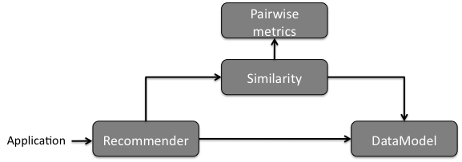
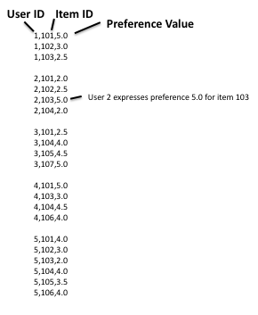

:author: Marcel Caraciolo
:email: marcel@caraciolo.com.br
:institution: Corri por Aí.

------------------------------------------------------------------------------
Meet Runpandas: How Applied Data Science with Python helped me to run better!
------------------------------------------------------------------------------

.. class:: abstract

   GPS-enabled tracking devices such as smartwatches and mobile phones is becoming increasingly popular
   among professional and amateur athtletes in many competition and fitness activities. Those devices
   produces detailed tracking data available for anyone interested at its analysis.
   Runpandas package is an alternative for anyone  interested in data anaylsis from such devices
   in Python and Pandas ecosystem. The package provides methods to import tracking data into data structures,
   that can handle the units of measurement and present relevant summaries and
   visualisations. It also implements, using pandas infrastructure, the organisation of multiple
   activities in sessions. This enables more advanced statistical analyses with the data gathered from the
   historical training sessions. In this paper we present the Runpandas package and a case study illustrating
   how the latter can be used by runners in performing running analytics.

.. class:: keywords

   sports analytics, data science, pandas, running analysis

Introduction
------------

Recent technological advances to GPS-enabled tracking devices is transforming the aspects of training and competition in fitness activities such as running, cycling and swimming.
Those devices produces detailed tracking data among several sports data available for anyone interested at its analysis.
This enables a descriptive analysis associated with the related data, such as performance, impact of volume of training or just reviewing the historical activities.
There are several devices or applications for sports tracking offered by manufacturers of the tracking devices, such as Garmin, Polar, and through a wide range of applications for
devices such as smartphones and smartwatches, e.g., Strava, Endomondo, and Runtastic Running GPS Tracker. Limiting to range of data science open-source packages available,
there is only a handful of packages specific to sport data and their analysis. Within Python ecosystem, one of the most popular programming languages for data science,
there is a gap to fill between the collection of tracking data and the analysis of such data.
*Pandas* is a popular package for data analysis, and several specific domain libraries as built on top of it [pandas]_. As a possible alternative,
*Runpandas* package comes as a set of utilities to import sports data from GPS-enabled devices or even track activities applications, and,
after careful processing, organises them in data frames which can provide information about the units of measurement (e.g. distance and speed units)
as well of any data operations that have been carried out (e.g., personal best records, heart efforts, elevation gain).
Runpandas extends the datatypes used by pandas, so it can benefit its core operations for the handling of measurement units and for summarising
and visualising tracking data. Finally, for performance and race results analysis, the package enables the combined analysis
of multiple activities or summarized results from the athletes in the competitions by using multi-dimensional data structures.

The focus of this paper is to present the *Runpandas* built upon *Pandas*, and provide researchers and sports data analysts with methods for
exploring their historical workouts performance to elaborate strategies for their training and race sessions or reveal insights from world
running races. The next section will describe *Runpandas*'s architecture along with installation instructions. In *Importing utilities*  section,
we describe the importing methods and the construction of "Activity" and "Session" objects. The section *Sessions summaries and visualisation*  is
devoted to the calculation of relevant summaries (running metrics) and the corresponding functions for visualisation. Next, we turn to some compiled running
race results and show how to perform some insightful analysis from the runner's result profiles. Finally, we explain how *Runpandas* can be used in performance analysis through
a case study of 30 training sessions and conclude by discussing the next steps of *Runpandas* library.


Background and Package Structure
--------------------------------

Installation
++++++++++++

*Runpandas* is released under the *MIT License* and it requires *Python 3.6* or above. It can be download and installed by *Pypi* or *Anaconda* package repositories:

.. code-block:: shell

   #install by pypi commandline
   python3 -m pip install runpandas
   #install by anaconda commandline
   conda install -c marcelcaraciolo runpandas


Package Structure
+++++++++++++++++



   An overview of *Runpandas*'s file structure. :label:`runfig1`



   Package architecture - Functionality to analyse tracking data. :label:`runfig2`


Figures :ref:`runfig1`  and :ref:`runfig2` show a schematic overview of the package structure and architecture. *Runpandas* provides read functions to read from one to multiple tracking workouts. It also encapsulates
the direct communication with several fitness services (Strava, NikeRun and others) to fetch the workout data by using APIs (Application Programming Interfaces).  Combined with the datasets module, there is a repository of real example data on
Github, https://github.com/corriporai/runpandas-data, who anyone can use them for testing purposes or look for a specific world race results (Marathons, Half Marathons, etc.). Data in various formats are imported and stored in one ofe the central data objects of  ``Activity``, ``Session```
or ``RaceResult`` classes. The ``Activity`` classs represents the single workout amd inherit from *pandas* ``DataFrame``. The activities can be organised in a list of
multivariate activities with one element per workout, stored in ``Session`` objects inherit by **pandas** ``MultiIndex`` class. The ``RaceResult`` stores the data from the race participants (results), each one per element.
From each one there are methods for visualisation, data handling and summary statistics, as shown at some examples below:


.. code-block:: python

   #total time elapsed for the activity
   >>> activity.ellapsed_time
   0 days 00:33:11
   #The number of total_participants in th race
   >>> race.total_participants
   445
   #mean heartrate from all the activities in the session
   >>> session.mean_heart_rate()
   156

All the core objects have special acessors available, by extending pandas custom decorator ``register_dataframe_accessor``, that allows the user to do things like

.. code-block:: python

   activity.compute.pace()

or

.. code-block:: python

   activity.compute.mean_max('column_name')


Certain columns in **runpandas** core classes are "special" in that they return specific ``pandas.Series`` subclasses. These subclasses make unit-switchingeasy, and provide other useful methods.
For instance, if you want to get the base unit and the sum for the altitude ``alt`` data,  the ``speed`` base unit and convert it from m/s to km/h from an ``Activty`` object:

.. code-block:: python

   >>> activity.alt.base_unit
   m
   >>> activity.alt.sum()
   65883.68151855901
   >>> data.speed.base_unit
   'm/s'
   >>> activity.speed.kph.mean()  # use a different unit
   24.4833

The **runpandas** package also uses in background plotting packages such as **matploblib** and **ggplot** . For example, Figure :ref:`runfig3`  shows
the evolution of heart rate and pace for the included activities in the ``Session`` object.

.. code-block:: python

   >>> session.plot(['hr','pace'])

.. figure:: figure3.png
   :align: center
   :figclass: w

   Heart rate and pace over the course of workouts 1–3. :label:`runfig3`

Test


References
----------
.. [pandas] P. Atreides. *How to catch a sandworm*,
           Transactions on Terraforming, 21(3):261-300, August 2003.


