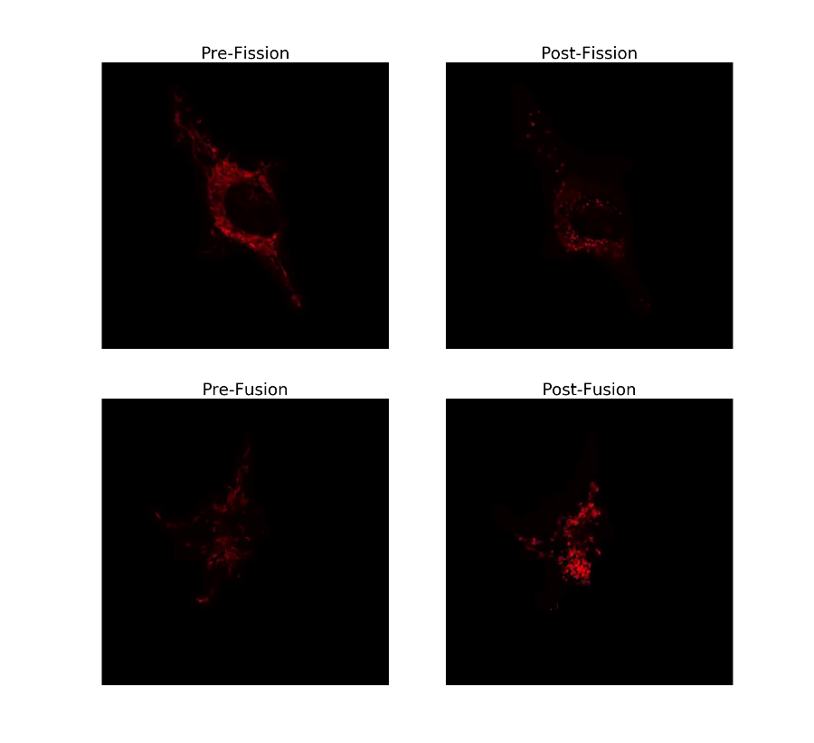
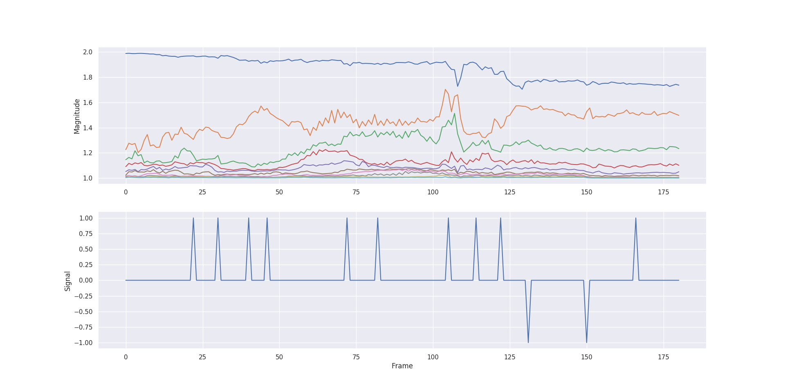
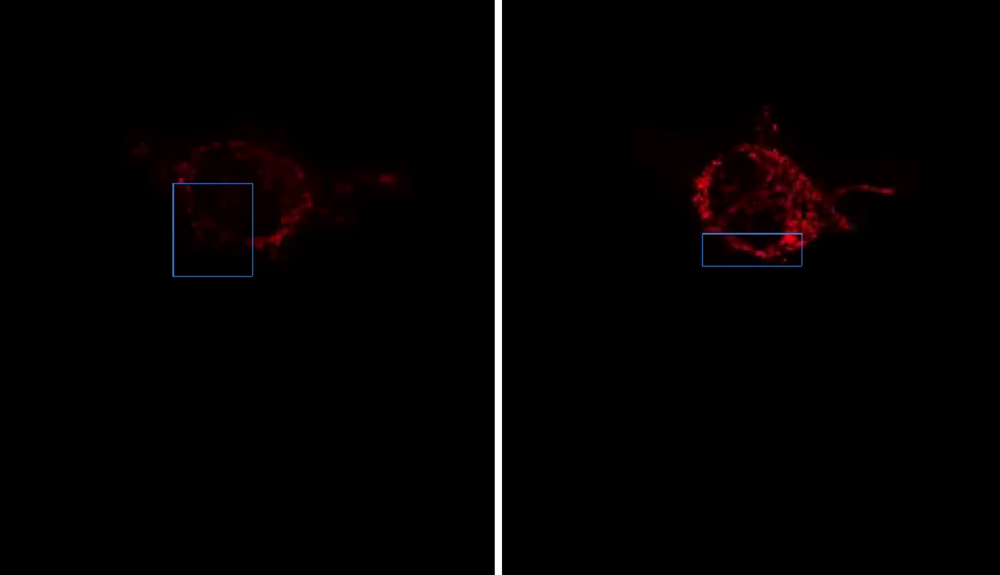
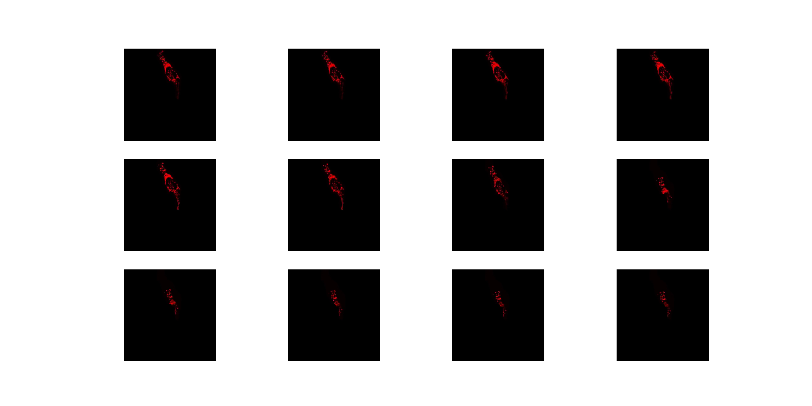

:author: Marcus Hill
:email: marcdh@uga.edu
:institution: Department of Computer Science, University of Georgia, Athens, GA 30602 USA

:author: Mojtaba Fazli
:email: Mojtaba@uga.edu
:institution: Department of Computer Science, University of Georgia, Athens, GA 30602 USA

:author: Rachel Mattson
:email: rachel.mattson@uga.edu
:institution: Department of Cognitive Science, University of Georgia, Athens, GA 30602 USA

:author: Meekail Zain
:email: meekail.zain@uga.edu
:institution: Department of Computer Science, University of Georgia, Athens, GA 30602 USA
:institution: Department of Mathematics, University of Georgia, Athens, GA 30602 USA

:author: Andrew Durden
:email: andrewdurden@uga.edu
:institution: Department of Computer Science, University of Georgia, Athens, GA 30602 USA

:author: Allyson T Loy
:email: allyson.loy@uga.edu
:institution: Department of Microbiology, University of Georgia, Athens, GA 30602 USA

:author: Barbara Reaves
:email: bjreaves@uga.edu
:institution: Department of Infectious Diseases, University of Georgia, Athens, GA 30602 USA

:author: Abigail Courtney
:email: abigail.courtney@uga.edu
:institution: Department of Microbiology, University of Georgia, Athens, GA 30602 USA

:author: Frederick D Quinn
:email: fquinn@uga.edu
:institution: Department of Infectious Diseases, University of Georgia, Athens, GA 30602 USA

:author: S Chakra Chennubhotla
:email: chakracs@pitt.edu
:institution: Department of Computational and Systems Biology, University of Pittsburgh, Pittsburgh, PA 15232 USA

:author: Shannon P Quinn
:email: spq@uga.edu
:institution: Department of Computer Science, University of Georgia, Athens, GA 30602 USA
:institution: Department of Cellular Biology, University of Georgia, Athens, GA 30602 USA

:corresponding:

:bibliography: paper

--------------------------------------------------------------------------------------------------------------
Spectral Analysis of Mitochondrial Dynamics: A Graph-Theoretic Approach to Understanding Subcellular Pathology
--------------------------------------------------------------------------------------------------------------

.. class:: abstract 

Perturbations of organellar structures within a cell are useful indicators of the cell’s response to viral or bacterial invaders. Of the various organelles, mitochondria are meaningful to model because they show distinct migration patterns in the presence of potentially fatal infections, such as tuberculosis. Properly modeling and assessing mitochondria could provide new information about infections that can be leveraged to develop tests, treatments, and vaccines. Traditionally, mitochondrial structures have been assessed via manual inspection of fluorescent microscopy imagery.  However, manual microscopy studies are labor-intensive and fail to provide a high-throughput for screenings. Thus, demonstrating the need for techniques that are more automated and utilize quantitative metrics for analysis. Yet, modeling mitochondria is no trivial task; mitochondria are amorphous, spatially diffuse structures that render traditional shape-based, parametric modeling techniques ineffective. We address the modeling task by using OrNet (Organellar Networks), a Python framework that utilizes probabilistic, graph-theoretic techniques to cast mitochondrial dynamics in the mold of dynamic social networks. We propose quantitative temporal and spatial anomaly detection techniques that leverage the graph connectivity information of the social networks to reveal time points of anomalous behavior and spatial regions where organellar structures undergo significant morphological changes related to a relevant change in environment or stimulus. We demonstrate the advantages of these techniques with the results of exhaustive graph-theoretic analyses over time in three different mitochondrial conditions. This methodology provides the quantification, visualization, and analysis techniques necessary for rigorous spatiotemporal modeling of diffuse organelles.

Introduction
------------

Morphological perturbations of organellar structures inside cells are useful for characterizing infection patterns and, ultimately, developing therapies. In particular, tuberculosis, an infectious disease caused by *Mycobacterium tuberculosis* (Mtb), induces distinct structural changes of the mitochondria in invaded cells :cite:`fc2015`. This is significant because tuberculosis is responsible for approximately 1.5 million human fatalities annually, with growing resistance to current antibacterial treatment regimens :cite:`fc2015`. Studying the permanent changes in subcellular structures pre- versus post-infection will set the stage for genetic screens, whereby these changes can be studied under different mutations of the Mtb pathogen; with enough such studies and a subsequent understanding of how the Mtb pathogen affects its host, we can leverage that knowledge to develop tests, treatments, and vaccines.

Prior works have shown that the Mtb pathogen alters the shape of mitochondrial structures to disrupt vital functions provided by the organelle so that it can successfully invade a host :cite:`dubey16, Cumming18`. Modeling these perturbed subcellular structures for analysis is difficult because mitochondria are amorphous, spatially diffuse structures whose morphology exists within a dynamic continuum, ranging from fragmented individual mitochondrion to complex interconnected networks :cite:`ferree12`. The morphology of mitochondria transitions between many states along its spectrum, as a result of fission and fusion events :cite:`song08, suen08` and the observation of these morphological changes is referred to as mitochondrial dynamics :cite:`ferree12`. Thus, understanding mitochondrial dynamics is useful for gaining insight regarding a host’s response to infections and cellular invasions. Figure :ref:`dynamics` depicts the morphological changes of mitochondria in two different cells that underwent either fission or fusion to illustrate mitochondrial dynamics. 

   Frames from two different live microscopy videos depicting the mitochdonria before and after morphological events. :label:`dynamics`

Early approaches to assessing mitochondrial dynamics involved manually observing fission and fusion events in live microscopy imagery. A notable early study tagged two distinct groups of mitochondria with red and green fluorescent proteins before introducing the two groups together in the presence of polyethylene glycol (PEG) to induce fusion, then manually observed the resultant heterogeneous fluorescent structures to understand mitochondrial dynamics :cite:`legros02`. However, manual microscopy studies are labor-intensive and fail to provide a high-throughput for screenings :cite:`ferree12`. These shortcomings have motivated many to research methodologies that are more automated by quantitatively modelling and assessing live microscopy imagery of mitochondria :cite:`durden18, song08, mitra10`.

Assessment of mitochondrial dynamics via live microscopy has been studied from various scientific perspectives. Most studies utilized confocal fluorescent microscopy to capture the morphological changes of the mitochondria :cite:`sison17`. One imagery-based approach proposed a quantitative methodology that measured the lengths of all mitochondria present in a cell, both prior to and post the occurrence of either a fission or fusion event, to determine whether the mitochondria fused or fragmented :cite:`song08`. Limitations of that approach was that it required manually denoting regions of interest to assess only a subset of the mitochondria present, and it intentionally excluded any mitochondria located in dense clusters because of the difficulty in determining the precise shapes and dimensions of individual mitochondrion. Another quantitative approach also leveraged confocal microscopy imagery to utilize a technique known as FRAP, or fluorescence recovery after photobleaching, to assess mitochondrial dynamics :cite:`mitra10`. This specific FRAP approach involved bleaching the cell in a designated region and monitoring the recovery of fluorescence as fluorescently tagged mitochondria migrate from unbleached areas to the bleached zones :cite:`mitra10`. However, such an approach can be jeopardized by the motility of mitochondria and its environment; unexpected movement from mitochondria, or even the entire cell, can disrupt a FRAP analysis requiring the sample being assessed to be discarded. Both of these early approaches risk overlooking crucial morphological information because only a subset of the mitochondria present in the cell can be used for analysis.

In more recent literature, a novel methodology was proposed that modeled the morphology of mitochondria by casting all local diffuse clusters of mitochondria present in a cell as nodes within an evolving graph, known as a dynamic social network :cite:`durden18`. Dynamic social networks are well-suited for modeling mitochondria because the granularity of the clusters being modeled can be adjusted by increasing or decreasing the number of nodes used. These networks overcome the limitations of prior approaches because they do not require any manual intervention nor are they negatively affected by organellar motility. Additionally, this approach does not seek to assess only specific well-behaved mitochondria, but any that are visible in clusters around the cell regardless of their morphological state (i.e. fragmented, fused, etc.). Our work seeks to elucidate mitochondrial dynamics by providing quantitative methodologies to measure spatial and temporal regions of anomalous morphological behavior via spectral analysis of dynamic social networks.

Data Acquisition
----------------

In our efforts to demonstrate the morphological spectrum that mitochondria undergo, we have amassed a collection of confocal imaging videos of live HeLa cells fluorescently tagged with the protein DsRed2-Mito-7. We maintained three distinct groups of cells: a group that was not exposed to any external stimulant, referred to as our control group; a group that was exposed to listeriolysin O (llo), a pore-forming toxin, to induce mitochondrial fragmentation; and a group that was exposed to mitochondrial-division inhibitor 1 (mdivi) to induce mitochondrial fusion. Live imaging videos of each cell was recorded with a Nikon A1R confocal microscope. The imaging occurred in an environment that maintained 37 degrees celsius and 5% CO2. Every imaging video consists of at least 20,000 frames, of dimensions 512x512, captured at 100 frames per second. In all of our imagery, each red “dot” depicts a single mitochondrion within a cell. For scale, the length of mitochondria is typically between 500 nm to 1 mm or greater, and the average diameter is approximately 500 nm :cite:`mitra10, detmer07`.

Spectral Analysis of Social Networks
------------------------------------

Mitochondrial structures can respond in drastic, unpredictable ways to an environmental change or an external stimulus, and our work seeks to characterize these responses from both the spatial and temporal contexts. We were able to explore those perspectives by analyzing microscopy imagery, primarily videos, of fluorescently tagged live HeLa cells post-exposure to drug treatments that induced either fusion or fragmentation of the mitochondria in the cells :cite:`durden18`. We modeled and analyzed the mitochondria using OrNet (Organellar Networks), an open-source Python framework built on libraries within the scientific Python ecosystem that models subcellular organelles as dynamic social networks :cite:`fazli20`.

OrNet utilizes a probabilistic approach, involving Gaussian mixture models (GMMs), to construct mitochondrial cluster graphs :cite:`durden18, fazli20`. GMMs were utilized to determine spatial regions of the microscopy imagery that corresponded to the mitochondrial clusters by iteratively updating the parameters of underlying mixture distributions until they converged. This approach assumes that the spatial locations of mitochondria are normally distributed with respect to their associated clusters :cite:`durden18`. The post-convergence parameters of the mixture distributions, specifically the means and covariances, were then used for constructing the social network graph. The means corresponded to the center spatial coordinates of mitochondrial clusters, and for this reason they were selected to be the nodes in the graphs. The edges, which represent the relationships between clusters, were defined by the Hellinger distance between the respective mixture distributions. This modeling process occurred for every frame in a microscopy video; therefore, each frame updates the state of the network’s graph at a discrete point in time. Traced over time, the dynamics of the social networks, appearing as perturbations in connected nodes via changes in the edge weights, OrNet tracks the changes of the spatial relationships between mitochondrial clusters.

By modeling the spatiotemporal relationships of mitochondria as a dynamic social network, the graph states could be represented as Laplacian matrices. A Laplacian matrix is a useful representation of a graph that enables the analysis of its properties via spectral graph theory techniques. Eigendecomposition, or the factorization of a matrix into its eigenvalues and eigenvectors, is a graph theoretic technique that is the cornerstone of our proposed methodologies. Eigendecomposition of a graph Laplacian yields vital information about the connectedness of that graph :cite:`chung97`. In the context of mitochondrial dynamics, the connectedness of a graph provides a quantitative description about the morphology at a given time. By leveraging such quantitative descriptions, our techniques are able to indicate spatial and temporal regions demonstrating anomalous behavior.

Temporal Anomaly Detection
--------------------------

   The top plot illustrates the eigenvalue time-series data of an llo cell that experienced a mitochondrial fission event, and the bottom plot shows the corresponding outlier signal plot. Peaks in the signal plot represent time points declared anomalous by the temporal anomaly detection technique. :label:`sigplot`

Detecting when morphology-altering events occur is an important aspect to understanding mitochondrial dynamics. Temporal indicators of organellar activity improve qualitative assessments of microscopy imagery by eliminating the need to manually inspect every frame, only those that immediately precede or succeed an anomalous event. Additionally, the effects of local events on the global mitochondrial structure are more distinct. This process of indicating time points when distinct organellar activity is occurring is a temporal anomaly detection task. We addressed this task by utilizing the graph connectivity information provided by the eigenvalue vectors to detect anomalous behaviors. 

Eigendecomposition of each mitochondrial cluster graph that comprises the dynamic social network results in a number of eigenvalue vectors and eigenvector matrices that correspond to the number of graph states in the network. Because these vectors and matrices have a natural ordering, the information is essentially a time series dataset. We highlight anomalous time points in the data by first computing the average of each eigenvalue vector, then indicating time points whose averages are statistical outliers. Outliers are determined by computing the z-score, or standard score, for every time point based on the distance between the average of its associated eigenvalue vector and the mean of a few preceding averages; if the distance exceeds some threshold value, typically two standard deviations, then it is considered an outlier. The number of preceding averages used is predetermined by a fixed window size. This sliding window approach enables adaptive thresholding values to be computed for declaring anomalous behavior that are derived from local morphological events, rather than a fixed global constant. 

In essence, this approach utilizes the eigenvalues to characterize the magnitude of spatial transformations experienced by the morphology. Therefore, morphology-altering events, like fission and fusion, are likely to be discovered by highlighting time points where eigenvalue vectors are demonstrating anomalous behavior.

The Python code we utilized to perform temporal anomaly detection is below: this function computes anomalous time points and displays the subsequent eigenvalue time-series and outlier signal plots. The parameters to the function are the time-series of eigenvalue vectors that correspond to the dynamic social network, a window size, and a threshold value. An example of the plots generated by this code is shown in Figure :ref:`sigplot`. 

.. code-block:: python

   import numpy as np
   import seaborn as sns
   import matplotlib.pyplot as plt

   def temporal_anomaly_detection(eigen_vals, window, 
                                  threshold):
    '''
    Generates a figure comprised of a time-series plot
    of the eigenvalue vectors, and an outlier detection 
    signals plot.

    Parameters
    ----------
    eigen_vals: NumPy array (NXM)
        Matrix comprised of eigenvalue vectors. 
        N represents the number of frames in the
        corresponding video, and M is the number of
        mixture components.
    window: int
        The size of the window to be used for anomaly 
        detection.
    threshold: float
        Value used to determine whether a signal value
        is anomalous.  

    Returns
    -------
    NoneType object
    '''
    eigen_vals_avgs = [np.mean(x) for x in eigen_vals]
    moving_avgs = np.empty(shape=(eigen_vals.shape[0],), 
                           dtype=np.float)
    moving_stds = np.empty(shape=(eigen_vals.shape[0],), 
                           dtype=np.float)
    z_scores = np.empty(shape=(eigen_vals.shape[0],), 
                        dtype=np.float)
    signals = np.empty(shape=(eigen_vals.shape[0],), 
                       dtype=np.float)

    moving_avgs[:window] = 0
    moving_stds[:window] = 0
    z_scores[:window] = 0
    for i in range(window, moving_avgs.shape[0]):
        moving_avgs[i] = \ 
            np.mean(eigen_vals_avgs[i - window:i])
        moving_stds[i] = \
            np.std(eigen_vals_avgs[i - window:i])
        z_scores[i] = \
            eigen_vals_avgs[i] - moving_avgs[i]
        
        z_scores[i] /= moving_stds[i]

    for i, score in enumerate(z_scores):
        if score > threshold:
            signals[i] = 1
        elif score < threshold * -1:
            signals[i] = -1
        else:
            signals[i] = 0

    sns.set()
    fig = plt.figure()
    ax = fig.add_subplot(211)
    ax.plot(eigen_vals)
    ax.set_ylabel('Magnitude')
    ax = fig.add_subplot(212)
    ax.plot(z_scores)
    ax.set_xlabel('Frame')
    ax.set_ylabel('Signal')
    plt.show()
    plt.close()

Spatial Anomaly Detection
-------------------------

After indicating discrete times points where the morphology experienced significant perturbations, quantitatively determining the spatial locations of significant structural changes is crucial for assessing mitochondrial dynamics. Mitochondria are spatially diffuse structures that occupy a vast amount of the cell and, as a result, many areas of the cell require detailed inspection to identify all significant spatial changes. However, many structural perturbations go unnoticed when evaluated with purely qualitative metrics because of the large search space and the inherent difficulty in tracking microscopic objects. Thus, we sought to provide a quantitative technique to indicate spatial regions demonstrating anomalous morphological behavior.  

Anomalous morphological behavior can be defined as spatial regions shifting suddenly, or major structural changes taking place in the underlying social network: edges being dropped or formed, nodes appearing or disappearing. The process of tracking such regions is, in essence, an object detection task because specific mitochondrial clusters are being monitored as the global structure evolves over time. By treating this task as such, we utilized bounding boxes to highlight the regions of significance. The coordinates of the bounding boxes were computed based on the pixel coordinates denoted by the GMMs that corresponded to the spatial locations of the mitochondrial clusters. Therefore, a bounding box can be displayed for each mitochondrial cluster determined by the GMM. However, rendering every bounding box can obfuscate the regions demonstrating anomalous behavior because some of the mitochondrial cluster boundaries may overlap. As a result, we utilized only the most significant, non-overlapping regions for analysis. 

Regions demonstrating the most significant amount of structural variance are determined via analysis of the eigenvector matrices. The number of eigenvector matrices corresponds with the number of graph states recorded in the social network. Each row in an eigenvalue matrix is related to a mixture distribution, and by extension a spatial region of the imagery. To determine the regions demonstrating the most amount of variance, the total euclidean distance of each row vector between graph states is computed. Ultimately, the spatial regions that corresponded to the eigenvector rows demonstrating the highest amounts of variance were selected as regions of interest to be highlighted by the bounding boxes.

   Image on the left shows the initial spatial location and size of a bounding box for a mitochondrial cluster from the first frame of a mdivi cell's microscopy video, which depicts a mitochondrial fusion event,  and the image on the right shows the spatial location and size of a bounding box corresponding to the same cluster on the final frame of the video. This figure highlights the ability of our spatial anomaly detection technique to accurately track the mitochondria as it undergoes morphological transformations. :label:`eventplot`

Below is the code utilized to perform spatial anomaly detection: this function draws bounding boxes for the mitochondrial cluster regions in a microscopy video. The parameters for the function are the file path to the input video; means and covariance matrices from the GMM; the eigenvector matrices; an integer that indicates the maximum number of boxes to display; the path to the directory where the output video will be saved; and the number of standard deviations away from center spatial coordinates, in both dimensions, to construct the box boundaries. Figure :ref:`eventplot` displays frames of a video generated by this code.

.. code-block:: python

   import imageio
   import numpy as np

   def spatial_anomaly_detection(vid_path, means, 
                                 covars, eigen_vecs, k, 
                                 outdir_path, 
                                 std_threshold=3):
    '''
    Draws bounding boxes around the mixture component
    regions demonstrating the most variance.

    Parameters
    ----------
    vid_path: string
        Path to the input video.
    means: NumPy array (NxMx2)
        Pixel coordinates corresponding to the mixture
        component means. N is the number of video 
        frames, M the number of mixture components, 
        and 2 denotes the 2D pixel coordinate.
    covars: NumPy array (NxMx2x2)
        Covariance matrices of the guassian mixture 
        components. N is the number of video frames,
        M is the number of mixture components, and 2x2
        denotes the covariance matrix.
    eigen_vecs: NumPy array (NxMxM)
        Eigenvector matrix. N represents the number of
        frames in the corresponding video, M is the
        number of mixture components.
    k: int
        Number of the most significant non-overlapping 
        regions to display bounding boxes for. The
        actual number may be less than k, if the video
        does not contain that many non-overlapping 
        regions.
    outdir_path: string
        Directory path to save the bounding box video.
    std_threshold: float 
        The number of standard deviations to use 
        to compute the spatial region of the bounding 
        box. Default is three.
    '''

    input_vid_title = os.path.split(vid_path)[1]
    out_vid_title = \
        input_vid_title.split('.')[0] + '.mp4'
    out_vid_path = os.path.join(outdir_path, 
                                out_vid_title)
    with imageio.get_reader(vid_path) as reader, \
         imageio.get_writer(
            out_vid_path, mode='I', fps=1) as writer
        fps = reader.get_meta_data()['fps']
        size = reader.get_meta_data()['size']
        distances = \
            absolute_distance_traveled(eigen_vecs)   
        descending_distances_indices = \
           np.flip(np.argsort(distances))
        region_indices = find_initial_boxes(
            means, 
            covars, 
            size, 
            descending_distances_indices, 
            k
        )
        num_of_boxes = len(region_indices)
        box_colors = \
            np.random.randint(
                256, 
                size=(num_of_boxes), 
                3,
            )

        for i, frame in enumerate(reader):
            current_frame = frame
            for index, j in enumerate(region_indices):

                row_bounds, col_bounds = \
                    compute_region_boundaries(
                        means, covars, size, i, j
                    )
                row_diff = row_bounds[1] - row_bounds[0]
                col_diff = col_bounds[1] - col_bounds[0]

                color = box_colors[index]
                current_frame[
                    row_bounds[0]:row_bounds[1],
                    col_bounds[0],
                    :,
                ] = color
                current_frame[
                    row_bounds[0]:row_bounds[1],
                    col_bounds[1],
                    :,
                ] = color
                current_frame[
                    row_bounds[0],
                    col_bounds[0]:col_bounds[1],
                    :,
                ] = color
                current_frame[
                    row_bounds[1],
                    col_bounds[0]:col_bounds[1],
                    :,
                ] = color            

            writer.append_data(current_frame)

Experiments
-----------

We first evaluated the temporal anomaly detection methodology by plotting the eigenvalue time-series and outlier signal for each cell. For our experiments, we utilized a window size of 20 and a threshold value of 2. An example of the plots generated is shown in Figure :ref:`sigplot`. Next, we evaluated the video frames that corresponded with each anomalous time point in every video. In each frame, significant changes in the morphology are visible, especially in the llo and mdivi videos. This is meaningful because the morphology of mitochondria changes subtly between frames, making it a tedious task to manually determine when any important event occurred. However, the anomalous time points indicate specific video frames where morphological changes are visible: the anomalous llo video frames illustrate the fragmentation process by depicting the clusters at distinct times where they are visibly smaller, and conversely, the anomalous mdivi frames highlight times where the clusters are noticeably larger. To illustrate the process of temporally tracking morphological activity, Figure :ref:`framesplot` displays all of the frames in a llo cell’s microscopy video that correspond to time points declared anomalous by our temporal anomaly detection technique.

Unexpectedly, we noticed anomalous behavior was indicated in a subset of our control videos. This was not anticipated because the control cells were not exposed to any stimuli, and their mitochondrial structures did not display any significant changes during the duration of the videos. This phenomenon highlighted the sensitivity of our approach; any significant movement of the mitochondria, such as a sudden migration, is likely to be detected as an anomalous event. Therefore, the temporal indicators will denote frames where morphological events are occurring, but they should not be relied on solely for any behavioral inference regarding the  mitochondria’s morphology.

   Frames from an llo video that were declared anomalous by the temporal anomaly detecton technique. These frames correspond to the same cell whose eigenvalue time-series and outlier signal plots were displayed in Figure :ref:`sigplot`. :label:`framesplot`

Our spatial anomaly detection methodology was evaluated by inspecting the regions highlighted by the bounding boxes in each cell type. The effectiveness of this approach was demonstrated through assessment of the llo and mdivi videos because mitochondrial clusters of both types were displaced as their videos progressed. Mitochondria in the llo videos fragment and become much smaller, and in some instances this occurs until the clusters are no longer visible; in mdivi videos many of the smaller clusters merge with larger ones, effectively, making some regions of the cell no longer occupied by any mitochondrial structures. Yet, the bounding boxes were able to adapt accordingly to these spatial changes because the spatiotemporal relationships of clusters were captured within the dynamic social networks. The coordinates of the bounding boxes were computed using the parameters, specifically the mean and covariance, of the corresponding mixture distributions. As a result, the boxes were able to track the mitochondrial clusters as they moved around the cell or shrunk in size. In many cases, the clusters moved completely outside the area highlighted by initial bounding boxes, so the ability to adjust the shape and spatial locations of the boxes allows for the regions demonstrating anomalous behavior to always remain the areas being highlighted. Figure :ref:`eventplot` depicts the spatial location and size of a bounding box corresponding to a mitochondrial region within a mdivi cell both before and after a fusion event occurs.

Discussion
----------

Both the temporal and spatial anomaly detection methodologies have proven effective in quantitatively characterizing mitochondrial dynamics, however, the extent of their effectiveness is largely dependent on the selection of adequate parameters. For the temporal methodology the free parameters are the threshold value, window size. A threshold value too high will result in none of the time points being declared anomalous, while too low will result in a high number of frames being considered anomalous, even though the morphology may have only changed slightly between the time points. The window size is important for determining how distinct the current time point’s eigenvalues are compared to those of the previous frames, and it behaves similarly to the threshold parameters: if the value is too high or low, the number of time points declared anomalous can change drastically. The spatial anomaly detection methodology has only one free parameter, the threshold value used to determine size of the bounding boxes. Due to the assumption that the spatial locations of mitochondria within each cluster are normally distributed :cite:`durden18`, we found that three standard deviations away from the mean, with respect to each dimension, is sufficient for a bounding box to encompass all the mitochondria that are members of the cluster being highlighted. Ultimately, these approaches are sensitive to the parameters selected, and the usage of adequate values can enhance the anomaly detection process.

Conclusion
----------

The morphology of mitochondria is perturbed in distinct ways by the presence of bacterial or viral infections in the cell, and modeling these structural changes can aid in understanding both the infection strategies of the pathogen, and cellular response. Modeling mitochondria poses many challenges because it is an amorphous, diffuse subcellular structure. Yet, dynamic social networks are well-suited for the task because they are capable of representing the global structure of mitochondria by flexibly modeling the many local clusters present in the cell. This extensible modeling approach enables the spatiotemporal relationships of the mitochondrial clusters to be explored using theoretic graph techniques. We proposed quantitative spatial and temporal anomaly detection methodologies that could be utilized in conjunction with traditional qualitative metrics to elucidate mitochondrial dynamics. We ultimately hope to use these spectral analytics and the OrNet software package to conduct large-scale genomic screens of *Mycobacterium tuberculosis* mutants, in an effort to build a deeper understanding of how the pathogen invades cells and induces cell death at the genetic level. This work is one of the first steps toward that ultimate goal.

