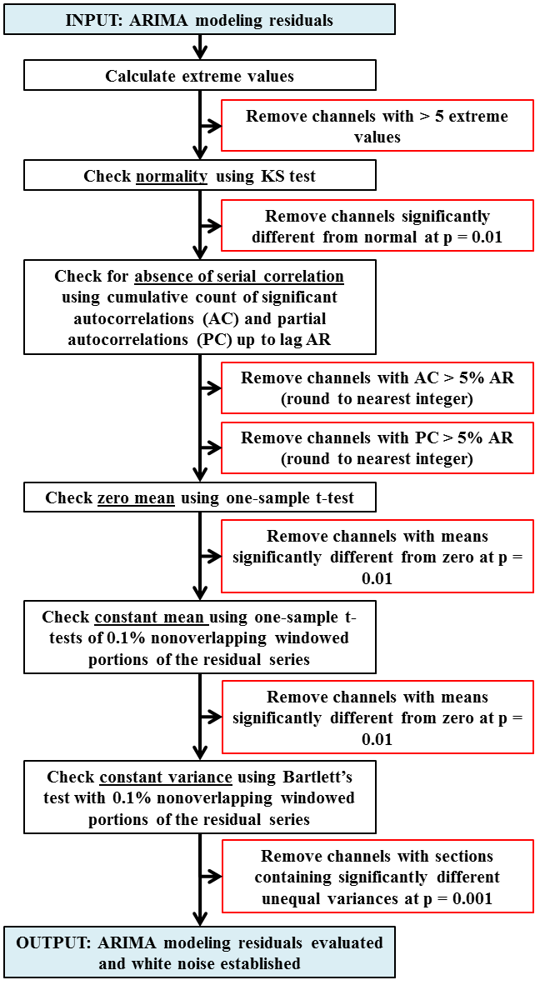
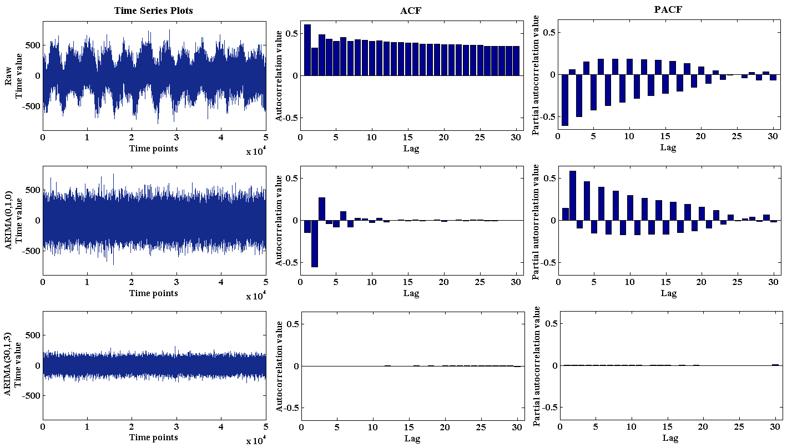
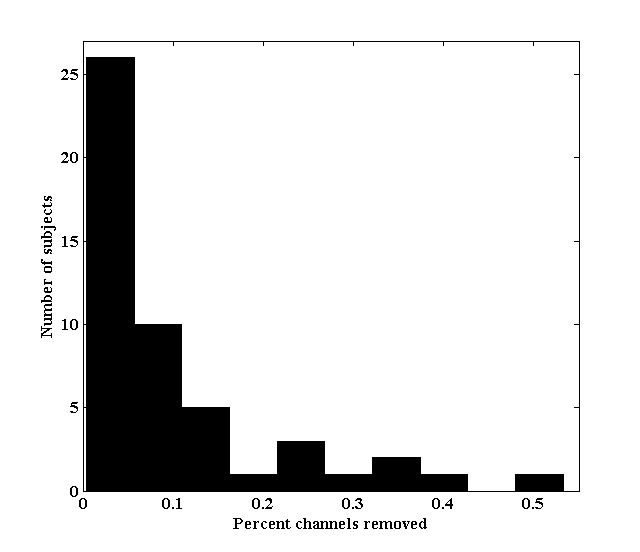

:author: Margaret Y Mahan
:email: mahan027@umn.edu
:institution: Brain Sciences Center, Minneapolis VA Health Care System & University of Minnesota

:author: Chelley R Chorn
:institution: Brain Sciences Center, Minneapolis VA Health Care System & University of Minnesota

:author: Apostolos P Georgopoulos
:institution: Brain Sciences Center, Minneapolis VA Health Care System & University of Minnesota

-------------------------------------------------------------------------------------------------------------
White Noise Test: detecting serial correlation and nonstationarities in long time series after ARIMA modeling
-------------------------------------------------------------------------------------------------------------

.. class:: abstract

Time series analysis has been a dominant technique for assessing relations within temporally derived datasets and is becoming increasingly prevalent in the scientific community; for example, assessing brain networks by calculating pairwise correlations of time series generated from different areas of the brain. The assessment of these relations relies, in turn, on the proper calculation of interactions between time series, which is achieved by rendering each individual series stationary and removing any serial correlation (i.e., white noise, or to “prewhiten” the series). This ensures that the relations computed subsequently are due to the interactions between the series and do not reflect internal dependencies of the series themselves. An established method for prewhitening time series is to apply an Autoregressive (AR, *p*) Integrative (I, *d*) Moving Average (MA, *q*) model (ARIMA) and retain the residuals. To diagnostically check whether the model orders (*p*, *d*, *q*) are sufficient, both visualization and statistical tests (e.g., Ljung-Box test) of the residuals are performed. However, these tests are not robust for high-order models in long time series. Additionally, as dataset size increases (i.e., number of time series to model) it is not feasible to visually inspect each series independently. As a result, there is a need for robust alternatives to diagnostic evaluations of ARIMA modeling. Here, we demonstrate how to perform ARIMA modeling of long time series using *Statsmodels*, a library for statistical analysis in Python. Then, we present a comprehensive procedure (White Noise Test) to detect serial correlation and nonstationarities in prewhitened time series, thereby establishing that the series does not differ significantly from white noise. This test was validated using time series collected from magnetoencephalography recordings. Overall, our White Noise Test provides a robust alternative to diagnostic checks of ARIMA modeling for long time series.

.. class:: keywords

   Time series, Statsmodels, ARIMA

Introduction
------------

Time series are discrete, stochastic realizations of underlying data generating processes [Yaffee]. They are ubiquitous in any field where monitoring of data is involved. For example, time series can be environmental, economic, or medical. In addition, time series can provide information about trends (e.g., broad fluctuations in values) and cycles (e.g., systematic, periodic fluctuations in values). Time series analysis can also be used to predict the next value in the series, given some model of its history. This is of special importance in environmental and econometric studies where forecasting the next set of values (e.g., the weather or a stock price) may have serious practical consequences. In other fields, time series provide crucial information about an evolving process (e.g., rate of spread of a disease or changing pollution levels) with implications about the effect of interventions. Finally, time series can provide fundamental information about the process that generates them, leading to a scientific understanding of that process (e.g., brain network analysis).

In time series analysis, there are two main investigative methods: frequency-domain and time-domain. In this paper, only time series analysis in the time-domain is considered. Within the time-domain, typically crosscorrelation analysis is utilized as a measure of the relation between two time series. Now, it is commonly the case that a time series contains some level of serial correlation, meaning that values in the time series are influenced by previous values. It is also common for a time series to exhibit nonstationarities, such as drifts or trends over time. In either case, the crosscorrelation function calculated between two series containing either serial correlation or nonstationarities will give misleading results. To circumvent this, time series are modeled to remove such characteristics, as in the case of prewhiteining.

Prewhitening
------------

A white noise process is a continuous time series of random shocks, with a zero mean and constant variance, normally and independently distributed, and lacking serial correlation. If after modeling a time series the residuals are white noise, then we say the series has been prewhitened. An established method for prewhitening time series is to apply an Autoregressive (AR) Integrative (I) Moving Average (MA) model (ARIMA) and retain the residuals [Box]. The full specification of an ARIMA model comprises the orders of each component, (*p*, *d*, *q*), where *p* is the number of preceding values in the autoregressive component, *d* is the number of differencing, and *q* is the number of preceding values in the moving average component. Most importantly, the ARIMA method requires the input time series to be: (1) equally spaced over time, (2) of sufficient length, (3) continuous (i.e., no missing values), and (4) stationary in the second or weak sense, meaning the mean and variance remain constant over time and the autocovariance is only lag-dependent.

Prewhitening using ARIMA modeling takes three main steps. First, identify and select the model, by detecting and removing factors that influence the time series, such as nonstationarities or seasonalities, and identifying the AR and MA components (i.e., model orders). Second, estimate parameter values, by using an estimation function to optimize the parameter values for the desired model. Third, evaluate the model, by checking the model’s adequacy through establishing that the series has been rendered stationary and all serial correlation has been removed. This time series modeling is iterative, successively refining the model until white noise residuals are obtained. Overall, a good model serves three purposes: providing the background information for further research on the process that generated the time series; enabling accurate forecasting of future values in the series; and yielding the white noise residuals necessary to evaluate accurately associations between time series, since they are devoid of any dependencies stemming from within their own series.

Model Identification and Selection
^^^^^^^^^^^^^^^^^^^^^^^^^^^^^^^^^^
There are several factors that can influence a value in a time series, which arise from previous values in the series, variability in these values, or nonstationarities (trend, drift, changing variance, or random walk). It is important to properly remove these factors by modeling the time series. To identify the model orders for an ARIMA(*p*, *d*, *q*), the autocorrelation (ACF) and partial autocorrelation (PACF) functions are used extensively.

First, nonstationarities need to be removed before ARMA modeling. A nonstationary process is identified by an ACF that does not tail away to zero quickly or cut-off after a finite number of steps. If the time series is nonstationary, then a first differencing of the series is computed. This process is repeated until the time series is stationary, which determines the value of *d*. Two of the most frequently used tests for detecting nonstationarities are the augmented Dickey-Fuller (ADF) test [Said] and the Kwiatkowski–Phillips–Schmidt–Shin (KPSS) test [Kwiatkowski]. The ADF is a unit root test for the null hypothesis that a time series is I(1) while the KPSS is a stationarity test for the null hypothesis that a time series is I(0). Since these tests are complimentary, we advocate using them together to determine whether a series is stationary. In our case, only if a series accepts the ADF null and rejects the KPSS null, is the series taken to be nonstationary. We implement the ADF test using *Statsmodels* and the KPSS test using the *Arch* Python package.

Once nonstationarities have been removed, ARMA modeling can begin. To choose the *p* and *q* orders, the ACF and PACF of the differenced series will show patterns based on which tentative ARMA model can be postulated. There are three main patterns. A pure MA(*q*) process will have an ACF that cuts off after *q* lags and a PACF that tails off with exponential or oscillating decay. A pure AR(*p*) process will have an ACF that tails off with exponential or oscillating decay and a PACF that cuts off after *p* lags. For a mixed-model ARMA(*p*, *q*) process, both the ACF and PACF will tail off with exponential or oscillating decay. Using these patterns, the model selection should begin by using the minimum orders to achieve white noise residuals.

Parameter Value Estimation
^^^^^^^^^^^^^^^^^^^^^^^^^^

ARIMA modeling has been implemented in Python with the *Statsmodels* package [McKinney], [Seabold]. It includes parameter value estimation and model evaluation procedures. After the model orders have been selected, the model parameter values can be estimated with the ``statsmodels.tsa.arima_model.ARIMA.fit()`` function to maximize the likelihood that these parameter values (i.e., coefficients) describe the data. First, initial estimates of the parameter values are used to get close to the desired parameter values. Second, optimization functions are applied to adjust the parameter values to maximize the likelihood by minimizing the negative log-likelihood function. If adequate initial parameter value estimates were selected, a local optimization algorithm will find the local log-likelihood minimum near the parameter value estimates, which will be the global minimum. For example,

.. code-block:: python

	if not np.all(np.abs(np.roots(np.r_
	       [1, -start_params[k:k + p]])) < 1) or 
	   not np.all(np.abs(np.roots(np.r_
	       [1, start_params[k + p:]])) < 1):
	   start_params = np.array(start_params[0:k] 
			  + [1./(p+1)] * p + [1./(q+1)] * q)

In *Statsmodels*, default starting parameter value estimations are calculated using the Hannan-Rissanen method [Hannan] and these parameter values are checked for stationarity and invertibility (these concepts are discussed in further detail in the next section). If ``method`` is set to ``css-mle``, starting parameter values are estimated further with conditional sum of squares methods. However, parameter values estimated in this way are not guaranteed to be stationary; therefore, we advise specifying starting parameter values as an input variable (``start_params``) to ``ARIMA.fit()``. A custom starting parameter value selection method may be built upon a copy of ``statsmodels.tsa.ARMA._fit_start_params_hr``, which forces stationarity and invertibility on the estimated ``start_params`` when necessary. 

In addition, the Hannan-Rissanen method uses an initial AR model with an order selected by minimizing Bayesian Information Criterion (BIC); then it estimates ARMA using the residuals from that model. This initial AR model is required to be larger than max(*p*, *q*) of the desired ARIMA model, which is not guaranteed with an AR selected by BIC criterion. We have implemented a method similar to Hannan-Rissanen, the long AR method, which is equivalent to Hannan-Rissanen except the initial AR model is set to be large (AR = 300). This results in an initial AR model order which is guaranteed to be larger than max(*p*, *q*), and starting parameter value selection is more time efficient since fitting multiple AR model orders to optimize BIC is not required.

To fit ARIMA models, *Statsmodels* has options for methods and solvers. The chosen method will determine the type of likelihood for estimation, where ``mle`` is the exact likelihood maximization, ``css`` is the conditional sum of squares minimization, and ``css-mle`` involves first estimating the starting parameter values with css followed by an mle fit. The solver variable in ``ARIMA.fit()`` designates the optimizer from ``scipy.optimize`` for minimizing the negative loglikelihood function. Optimization solvers ``nm`` (Nelder-Mead) and ``powell`` are the most time efficient because they do not require a score, gradient, or Hessian. The next fastest solvers, ``lbfgs`` (limited memory Broyden-Fletcher-Goldfarb-Shanno), ``bfgs`` (Broyden-Fletcher-Goldfarb-Shanno), ``cg`` (conjugate gradient), and ``ncg`` (Newton conjugate-gradient), require a score or gradient, but no Hessian. The ``newton`` (Newton-Raphson) solver requires a score, gradient, and Hessian. Lastly, a global solver ``basinhopping``, displaces parameter values randomly before minimizing with another local optimizer. For more information about these solvers, see ``statsmodels.base.model.GenericLikelihoodModel``.

Model Evaluation
^^^^^^^^^^^^^^^^

There are two components in evaluating an ARIMA model, namely, model stability and model adequacy. For the model to be stable, the roots of the characteristic equations 

.. math::

   1 - \phi_{1B} - \ldots - \phi_{pB^p} = 0

where :math:`\phi_{i}` are the estimated AR parameter values, and

.. math::

   1 + \theta_{1B} + \cdots + \theta_{qB^q} = 0 

where :math:`\theta_{i}` are the estimated MA parameter values, should lie outside the unit circle, i.e., within bounds of stationarity (for the *p* parameter values) and invertibility (for the *q* parameter values) [Pankratz]. For the model to be adequate, the residual time series should not be significantly different from white noise; in other words, the series should have zero mean and constant variance, and each value in the series should be uncorrelated with all other realizations. If either model stability or adequacy have not been established, then model identification and selection should be revised, and the diagnostic cycle continued, iteratively, until established.

Inspecting the *p* and *q* parameter values for being within the bounds of stationarity and invertibility checks model stability. Typically, this will be accomplished during parameter value estimation. The model adequacy is checked by examining the time-varying mean of the residuals (should be close to zero), their variance (should not differ appreciably along time), and their serial correlation (should not be different from chance). Finally, the ACF and PACF of the residuals should not contain statistically significant terms more than the number expected by chance. This number depends on the number of lags; for example, if k = 40 lags, one would expect 2 values (5% of 40) to exceed their standard error. Under the assumption that the process is white noise and when the length (N) of the series is long, the standard error of the sample autocorrelation (and partial autocorrelation) [Bartlett] approximates to:

.. math::
   
   Standard Error =  1 / \sqrt{N}

Several statistical tests are available to detect serial correlation. Most notably is the Ljung-Box test [Ljung], which is applied to residuals to detect whether the data are independently distributed or exhibit serial correlation. The test statistic is calculated for each of *h* lags begin tested. Another common test to detect serial correlation is the Durbin-Watson test [Durbin]; however, unlike the Ljung-Box test which is calculated for *h* lags, the Durbin-Watson test is calculated only for lag 1. Therefore, any serial correlation beyond lag 1 will not be detected by this test. Similar to the Ljung-Box test is the Breusch-Godfrey Lagrange multiplier test [Breusch], [Godfrey]. This test also aims to detect serial correlation up to *h* lags tested. We compare our model evaluation, namely the White Noise Test, to both the Ljung-Box and Breusch-Godfrey tests.

Magnetoencephalography (MEG) Dataset
------------------------------------

To evaluate the functional brain, MEG is the optimal technique because it measures magnetic fluctuations generated by synchronized neural activity in the brain noninvasively and at high temporal resolution. For the applications below, MEG recordings were collected using a 248-channel axial gradiometer system (Magnes 3600WH, 4-D Neuroimaging, San Diego, CA) sampled at ~1 kHz from 50 cognitively healthy women (40 - 93 years, 70.58 ± 14.77, mean ± std dev) in a task-free state (i.e., resting state). The data were time series consisting of 50,000 values per subject and channel. Overall, the full MEG data matrix contains 50 samples x 248 channels x 50,000 time points.

Performing ARIMA Modeling
-------------------------

Here, we first determine which method-solver combination from *Statsmodels* provides the most reliable and valid residuals, while also maintaining a respectable processing time for the MEG dataset. Then, using this method-solver, investigations into identifying and selecting model orders are performed, followed by parameter value estimations on a range of model orders. Residuals from these models are processed to detect serial correlation and nonstationarities using our White Noise Test. Finally, these models are compared and evaluated.

Implementing Method-Solvers
^^^^^^^^^^^^^^^^^^^^^^^^^^^

The length and quantity of time series have a direct impact on the ease of modeling. Therefore, we aim to implement an iterative approach to ARIMA modeling while keeping focus on model reliability and validity of residuals, along with incorporating an efficiency cost (i.e., constraints on allowed processing time). The goal for this stage is to determine which method-solver in *Statsmodels* is most appropriate for the application dataset, not necessarily to achieve white noise residuals.

To accomplish this, we randomly select 5% (round to nearest integer) of the channels from each sample for the MEG test dataset (N = 600). Next, we select a range of model orders: AR = {10, 20, 30, 40, 50, 60}, I = {1}, MA = {1, 3, 5}. Taking combinations of these model orders, we have 18 total model order combinations. Using each method-solver group (16 total) and model order combination, we now have 288 testing units. For each of the testing units, ARIMA modeling is performed on each channel in the test dataset.

If 2% of the test dataset channels have a processing time > 5 minutes per channel, then the testing unit is withdrawn from further analysis and deemed inefficient. Otherwise, for each channel, four measures are retained. The first measure is the :math:`AIC_{c}` (Akaike Information Criterion with correction), which describes the quality of the statistical models performance. The second and third measures calculate the ACF and PACF, respectively, up to AR lags and count the number of lags exceeding statistical significance. To determine this, the 

.. math::
   
   t_{statistic} = \frac{|ACF_{k}|}{Standard Error}
 
is calculated at each lag, *k*, and evaluated using a two-tailed test with N-1 degrees of freedom. A cumulative count of those exceeding

.. math::

   \alpha = \frac{0.01}{AR}

are retained (note: :math:`\alpha` is rounded to the nearest integer). If the count is greater than 5% of the AR order for either the ACF or PACF, there is significant serial correlation within the residuals. The final measure is the processing time, which is measured on each channel and is the time, in seconds, it takes to start the ARIMA modeling process until residuals are produced. For all four measures, lower values indicate better performance. After calculating the measures, for each channel and model order, ranks for the first three measures are calculated across the method-solver groups, with tied ranks getting the same rank number.

For the 18 method-solver combinations tested, 7 were inefficient (css-basinhopping, mle-bfgs, mle-newton, mle-cg, mle-ncg, mle-powell, mle-basinhopping). The cumulative distribution functions (CDFs) of each method-solver group ranks are calculated and plotted in Figure :ref:`figure1`. In this plot, larger area under the curve indicates better performance. Thus, the css-lbfgs has the best performance.

.. figure:: Figure1.png
   :align: right

   MEG CDF Ranks :label:`figure1`

In Table :ref:`table1`, the mean time per channel for each method except withdrawn methods are given, along with the highest order able to be modeled by the given method-solver group. Mean ranks were calculated for each method-solver, shown in Table :ref:`table1`, and used for the final rank calculation. In the MEG test dataset, the css-lbfgs method-solver outperformed all others while maintaining a reasonable time per channel (91.47 seconds). The results also show that the css methods generally outperform the mle methods, for long time series. The css-lbfgs method-solver was retained for all further MEG analysis.

.. table:: Ranking Method-Solvers for ARIMA modeling of MEG data. :label:`table1`

   +------------+----------+-----------+--------+-------+
   |Method-     | Mean     | Highest   | Mean   | Final |
   |Solver      | Time (s) | Model     | Ranks  | Rank  |            
   +============+==========+===========+========+=======+
   |css-lbfgs   | 91.47    |60-1-3     |1.32    |1      |
   +------------+----------+-----------+--------+-------+
   |css-bfgs    |115.22    |60-1-3     |2.23    |2      |
   +------------+----------+-----------+--------+-------+
   |css-powell  | 54.47    |60-1-5     |3.25    |3      |
   +------------+----------+-----------+--------+-------+
   |css-cg      |132.78    |50-1-1     |3.77    |4      |
   +------------+----------+-----------+--------+-------+
   |css-nm      | 39.55    |60-1-3     |4.29    |5      |
   +------------+----------+-----------+--------+-------+
   |css-ncg     |138.97    |20-1-3     |6.90    |6      |
   +------------+----------+-----------+--------+-------+
   |mle-nm      | 85.71    |30-1-5     |7.31    |7      |
   +------------+----------+-----------+--------+-------+
   |mle-lbfgs   | 57.7     |10-1-5     |8.29    |8      |
   +------------+----------+-----------+--------+-------+
   |css-newton  |235.11    |20-1-1     |8.36    |9      |
   +------------+----------+-----------+--------+-------+

Identifying and Selecting Model Orders
^^^^^^^^^^^^^^^^^^^^^^^^^^^^^^^^^^^^^^

Before selecting the differencing model order, *d*, each series is inspected for extreme values. For each raw series, the interquartile range (IQR) is calculated.

.. math::

   IQR = 75^{th} percentile - 25^{th} percentile

Using the IQR, Tukey’s fences are calculated [Tukey].

.. math::

   Fence_{upper} = 75^{th} percentile + 3 \times IQR

.. math::

   Fence_{lower} = 25^{th} percentile - 3 \times IQR

Then, the values below the lower fence and above the upper fence are counted as extreme values. If this count is greater than 5, the series is removed from further consideration when selecting model orders. 

As discussed previously, if a series is deemed nonstationary, then a first differencing of the series is computed. An example of a nonstationary time series is plotted in the top panel of Figure :ref:`figure5`, where neither the ACF nor the PACF tail away to zero quickly or cut-off after a finite number of steps, a clear indication of  nonstationarity. Therefore, the MEG time series are first differenced (*d* = 1).

Next we check the series for stationarity; recall, an appropriately differenced process should be stationary. Both the KPSS stationarity test and ADF unit root test are calculated for 60 lags. Their values plotted against each other are shown in Figure :ref:`figure2`. The KPSS statistic ranges from 0 to 0.28; since all KPSS test statistics calculated are less than the critical value (CV) of 0.743 at the p = 0.01, the null hypothesis of stationarity cannot be rejected. The ADF statistic ranges from -16.19 to -58.32; since all ADF test statistics calculated are more negative than the critical value of -3.43 at the p = 0.01, the null hypothesis of a unit root is rejected. Taken together, we have established stationarity for our test dataset.

.. figure:: Figure2.png
   :align: center

   Stationarity (KPSS) and Unit Root (ADF) Tests :label:`figure2`

Taking the differenced series, the ACF and PACF are calculated for ±60 lags. The median correlation value for each lag is plotted in Figure :ref:`figure3`. From this figure, a mixed-model ARMA(*p*,*q*) process is seen since both the ACF and PACF tail off with exponential or oscillating decay. To decide on the *p* and *q* orders, we look at Figure :ref:`figure3` and see the highly AR nature of the PACF plot up to about 30 lags; we also see the MA component expressed in the ACF up to about 10 lags. Using this, we decide to implement a range of model orders. For the AR component, we choose to begin with AR = 20 and end with AR = 60 in increments of 5. For the MA component, we chose to begin with MA = 1 and end with MA = 9 in increments of 2. We implement all possible combinations of these ARMA orders (total 45).

.. figure:: Figure3.png
   :align: center

   ACF and PACF of MEG data after first differencing :label:`figure3`

Evaluating Models: White Noise Test
-----------------------------------

For each model order combination, multiple attributes are calculated on the residuals. Inclusively, the attributes characterize an individual residual series by its “whiteness”.

*Excluded data*: Channels unable to be modeled using the css-lbfgs with the given model order were excluded from further analysis. In the case of the MEG test dataset, there were 4 channels unable to be modeled in each of the model order combinations. Additionally, channels with extreme values beyond threshold, calculated on the residuals for each model order, were also excluded from further analysis. Channels with greater than 5 extreme values, and thus excluded, were relatively consistent across model order combinations with a range of 26-29 channels (mean = 27.24) per combination.

*Normality*: Each residual series was tested for normality using the Kolmogorov–Smirnov test. In the MEG test dataset, the remaining residual series were not significantly different from normal (p = 0.01).

*Zero and constant mean*: A one-sample t-test was calculated for each residual series to test whether the mean is significantly different from zero (p = 0.01); if the residual series was different, a count was retained (maximum value = 1). In addition, each residual series was split into 10% nonoverlapping windows (i.e. 10 windows). For each window, a one-sample t-test was again calculated (p = 0.01). A count of the number of windows with means significantly different from zero was retained for each residual series (maximum value = 10).

*Constant variance*: For each residual series, the 10% nonoverlapping windows were also tested for equal variances using Bartlett’s test (p = 0.01). Successive comparisons of the windows were made along the residual series. A count of the number of windows with unequal variances was retained for each residual series (maximum value = 9).

*Uncorrelated with all other realizations*: The ACF and PACF were calculated for each residual series up to AR lags, and as was calculated in the Implementing Method-Solvers section, cumulative counts of significant correlation values were retained. Again, counts exceeding :math:’\alpha’ for a residual series were retained. Two serial correlation tests were also calculated (p = 0.01); the Ljung-Box and Breusch-Godfrey statistics for up to AR lags for each residual series.  

Final Model Order Selection
^^^^^^^^^^^^^^^^^^^^^^^^^^^

For the model order combinations, the above attributes are shown in Table :ref:`table2` for up to AR = 50 (AR = 55 and 65 showed similar patterns). In the table, the number of channels exceeding the ACF and PACF threshold are counted; similarly for the zero mean (zMean). Residual series with greater than 2 windows with means significantly different from zero (cMean) or unequal variance (cVar) are counted. Unique channels is the count the unique set of channels across all attributes (ACF, PAF, zMean, cMean, and cVar). From Table :ref:`table2`, it can be seen that multiple model order combinations provide low counts on several attributes, and thus, would be usable for further evaluation. However, there are two important patterns that emerge. First, as the AR increases (holding the MA constant), the ACF and PACF counts generally decrease. Second, as the MA increases (holding the AR constant), the ACF and PACF counts generally decrease. Taken together, there exists an ideal candidate model, namely ARIMA(30,1,3). This model order exhibits two qualities to use in evaluating model orders: it is within the lowest on all attribute counts as compared to other model orders and among those with the lowest attribute values, it has the lowest model orders.

.. table:: Attributes for the White Noise Test shown for incrementing model order combinations :label:`table2`

   +-------+----+-----+------+------+-----+--------+
   |Model  |ACF |PACF |zMean |cMean |cVar |Unique  |
   |Orders |    |     |      |      |     |Channels|
   +=======+====+=====+======+======+=====+========+
   |20-1-1 |570 |570  |0     |0     |11   |570     |
   +-------+----+-----+------+------+-----+--------+
   |20-1-3 |137 |138  |0     |4     |11   |153     |
   +-------+----+-----+------+------+-----+--------+
   |20-1-5 |76  |76   |1     |5     |12   |93      |
   +-------+----+-----+------+------+-----+--------+
   |20-1-7 |75  |74   |5     |18    |91   |158     |
   +-------+----+-----+------+------+-----+--------+
   |20-1-9 |40  |39   |2     |6     |12   |57      |
   +-------+----+-----+------+------+-----+--------+
   |25-1-1 |569 |569  |0     |1     |11   |569     |
   +-------+----+-----+------+------+-----+--------+
   |25-1-3 |29  |29   |1     |4     |12   |46      |
   +-------+----+-----+------+------+-----+--------+
   |25-1-5 |149 |150  |1     |5     |12   |166     |
   +-------+----+-----+------+------+-----+--------+
   |25-1-7 |20  |20   |0     |6     |11   |37      |
   +-------+----+-----+------+------+-----+--------+
   |25-1-9 |12  |12   |1     |5     |12   |30      |
   +-------+----+-----+------+------+-----+--------+
   |30-1-1 |569 |569  |0     |3     |10   |569     |
   +-------+----+-----+------+------+-----+--------+
   |30-1-3 |8   |8    |1     |5     |11   |25      |
   +-------+----+-----+------+------+-----+--------+
   |30-1-5 |9	|9    |0     |5     |12   |26      |
   +-------+----+-----+------+------+-----+--------+
   |30-1-7 |5	|5    |2     |6     |11   |22      |
   +-------+----+-----+------+------+-----+--------+
   |30-1-9 |6	|6    |2     |7     |12   |23      |
   +-------+----+-----+------+------+-----+--------+
   |35-1-1 |568 |568  |0     |0     |10   |569     |
   +-------+----+-----+------+------+-----+--------+
   |35-1-3 |15  |16   |2     |5     |13   |36      |
   +-------+----+-----+------+------+-----+--------+
   |35-1-5 |6   |6    |1     |5     |13   |25      |
   +-------+----+-----+------+------+-----+--------+
   |35-1-7 |7	|7    |0     |15    |83   |88      |
   +-------+----+-----+------+------+-----+--------+
   |35-1-9 |0	|0    |0     |5     |12   |17      |
   +-------+----+-----+------+------+-----+--------+
   |40-1-1 |557 |561  |1     |4     |10   |562     |
   +-------+----+-----+------+------+-----+--------+
   |40-1-3 |55	|51   |7     |9     |10   |75      |
   +-------+----+-----+------+------+-----+--------+
   |40-1-5 |4	|4    |1     |5     |11   |21      |
   +-------+----+-----+------+------+-----+--------+
   |40-1-7 |12	|11   |0     |6     |10   |27      |
   +-------+----+-----+------+------+-----+--------+
   |40-1-9 |7	|6    |0     |5     |11   |23      |
   +-------+----+-----+------+------+-----+--------+
   |45-1-1 |278 |298  |3     |4     |11   |307     |
   +-------+----+-----+------+------+-----+--------+
   |45-1-3 |15	|17   |3     |7     |10   |36      |
   +-------+----+-----+------+------+-----+--------+
   |45-1-5 |2	|2    |0     |6     |12   |20      |
   +-------+----+-----+------+------+-----+--------+
   |45-1-7 |7	|7    |0     |5     |12   |24      |
   +-------+----+-----+------+------+-----+--------+
   |45-1-9 |7	|7    |0     |4     |12   |23      |
   +-------+----+-----+------+------+-----+--------+
   |50-1-1 |36	|38   |1     |5     |10   |53      |
   +-------+----+-----+------+------+-----+--------+
   |50-1-3 |1	|1    |1     |5     |10   |17      |
   +-------+----+-----+------+------+-----+--------+
   |50-1-5 |0	|0    |1     |6     |10   |16      |
   +-------+----+-----+------+------+-----+--------+
   |50-1-7 |1	|1    |0     |5     |9	  |15      |
   +-------+----+-----+------+------+-----+--------+
   |50-1-9 |6	|6    |0     |6     |11   |22      |
   +-------+----+-----+------+------+-----+--------+

We compare our ACF thresholding to two serial correlation tests, the Ljung-Box and Breusch-Godfrey. Figure :ref:`figure4` shows a bar graph of the Ljung-Box and ACF counts. The Ljung-Box statistic is calculated at three levels, with degrees of freedom (df) equalling AR, min(20, N-1) as suggested by [Box], and :math:`\ln(N)` as suggested by [Tsay]. Each bar is for one model order combination with the first row in Table :ref:`table3` corresponding to model order combination number 1, and continuing from there. The bar height is the sum of the elements in the model order combination for the given statistic. Each bar shows different colors for each statistic and the relative contribution each statistic makes to the total sum for that model order combination. The Breusch-Godfrey, in place of the Ljung-Box, showed similar results. It can be seen that the Ljung-Box shows similar results to the our ACF thresholding for lower AR orders but fails to identify serial correlation in higher AR orders. The df also has an impact on the statistic with df = AR providing similar results to the ACF thresholding, but the other two suggested df showing worse results (i.e., not able to identify residuals with serial correlation). Finally, the Breusch-Godfrey and Ljung-Box statistics are compared in terms of the number of residual series failing each statistic (Table :ref:`table3`).

.. figure:: Figure4.png
   :align: center

   ACF and Ljung-Box Attributes Compared :label:`figure4`

.. table:: Breusch-Godfrey versus Ljung-Box :label:`table3`

   +---------------+----------+-----------+------------+
   |Degrees of     | Percent  | Percent 1 | Percent >1 |
   |freedom        | equal    | different | different  |
   +===============+==========+===========+============+
   |AR             | 0.556    | 0.200     | 0.244      |
   +---------------+----------+-----------+------------+
   |20             | 0.778    | 0.067     | 0.156      |
   +---------------+----------+-----------+------------+
   |:math:`\ln(N)` | 0.844    | 0.111     | 0.044      |
   +---------------+----------+-----------+------------+

White Noise Test Procedure
^^^^^^^^^^^^^^^^^^^^^^^^^^

   White Noise Test Procedure. :label:`figure5`

We apply the White Noise Test procedure (:ref:`figure5`) to 600 randomly generated white noise series, to get an idea of whether the thresholding levels are within what is expected by random. Attributes calculated on these series are shown in Table :ref:`table4`.

.. table:: White Noise Attributes :label:`table4`

   +-----+---------+----+-----+------+------+-----+
   |Count|ExValues |ACF |PACF |zMean |cMean |cVar |
   +=====+=========+====+=====+======+======+=====+
   |0    |531      |593 |594  |593   |545   |549  |
   +-----+---------+----+-----+------+------+-----+
   |1    |67       |0   |0    |7     |50    |44   |
   +-----+---------+----+-----+------+------+-----+
   |2    |2        |1   |0    |0     |5     |7    |
   +-----+---------+----+-----+------+------+-----+
   |> 2  |0        |6   |6    |0     |0     |0    |
   +-----+---------+----+-----+------+------+-----+

Finally, using ARIMA(30,1,3), we apply the White Noise Test procedure to the whole MEG dataset. One channel at each stage of modeling is shown in Figure :ref:`figure6`. Descriptive statistics on each of the attributes for the whole MEG data are shown in Table :ref:`table5` and the overall percent of channel removed per subject is shown in Figure :ref:`figure7`.

   Raw, differenced, and ARIMA(30,1,3) series with corresponding ACF and PACF. :label:`figure6`

.. table:: Results of White Noise Test on full dataset :label:`table5`

   +----------+----+----+-------+-----+--------+
   |Step      |Min |Max |Median |Mean |Std Dev |
   +==========+====+====+=======+=====+========+
   |ExValues  |0   |83  |1      |11.14|19.45   |
   +----------+----+----+-------+-----+--------+
   |Normality |0   |0   |0      |0.00 |0.00    |
   +----------+----+----+-------+-----+--------+
   |ACF       |0   |51  |0      |2.48 |8.04    |
   +----------+----+----+-------+-----+--------+
   |PACF      |0   |0   |0      |0.00 |0.00    |
   +----------+----+----+-------+-----+--------+
   |zMean     |0   |6   |0      |0.24 |0.89    |
   +----------+----+----+-------+-----+--------+
   |cMean     |0   |8   |0      |0.20 |1.14    |
   +----------+----+----+-------+-----+--------+
   |cVar      |0   |69  |2      |7.58 |14.06   |
   +----------+----+----+-------+-----+--------+
   |Channels  |1   |132 |8      |22.54|29.81   |
   |Removed   |    |    |       |     |        |
   +----------+----+----+-------+-----+--------+

   Percent of channels removed per subject. :label:`figure7`

Conclusion
----------

References
----------
.. [Bartlett] Bartlett, M.S. 1946. "On the theoretical specification and sampling properties of autocorrelated time-series." *Journal of the Royal Statistical Society*, 8.1, 27-41.
.. [Box] Box, G. and Jenkins, G. 1976. "Time series analysis: forecasting and control." Holden Day, San Francisco, 2nd edition.
.. [Breusch] Breusch, T.S. 1978. “Testing for autocorrelation in dynamic linear models”, *Australian Economic Papers*, 17, 334–355.
.. [Durbin] Durbin, J. and Watson, G.S. 1971. "Testing for serial correlation in least squares regression III”, *Biometrika*, 58.1, 1–19.
.. [Godfrey] Godfrey, L.G. 1978. “Testing against general autoregressive and moving average error models when the regressors include lagged dependent variables”, *Econometrica*, 49, 1293–1302.
.. [Hannan] Hannan, E.J. and Rissanen, J. 1985. "Recursive estimation of mixed autoregressive-moving average order". *Biometrika*, 69.1, 81-94.
.. [Kwiatkowski] Kwiatkowski, D., Phillips, P.C.B., Schmidt, P., Shin, Y. 1992. "Testing the null hypothesis of stationarity against the alternative of a unit root", *Journal of Econometrics*, 54, 159ñ178
.. [Ljung] Ljung, G.M. and Box, G.P. 1978. "On a Measure of a Lack of Fit in Time Series Models”, *Biometrika*, 65.2, 297–303.
.. [McKinney] McKinney, W., Perktold, J., Seabold, S. 2011. "Time series analysis in python with statsmodels", *Proceedings of the 10th Python in Science Conference*, 96-102.
.. [Pankratz] Pankratz, A. 1991. "Forecasting with dynamic regression models", John Wiley and Sons, New York.
.. [Said] Said, S.E. and Dickey, D. 1984. "Testing for unit roots in autoregressive moving-average models with unknown order", *Biometrika*, 71, 599-607.
.. [Seabold] Seabold, S. and Perktold J. 2010. "Statsmodels: econometric and statistical modeling with python", *Proceedings of the 9th Python in Science Conference*, 57-61.
.. [Tsay] Tsay, R.S. 2005. “Analysis of Financial Time Series”, John Wiley & Sons, Inc., Hoboken, NJ.
.. [Tukey] Tukey, J.W. 1977. "Exploratory data analysis", Addison-Wesley, Reading, MA.
.. [Yaffee] Yaffee, R.A. and McGee, M. 2000. "Introduction to time series analysis and forecasting: with applications of SAS and SPSS", Academic Press.