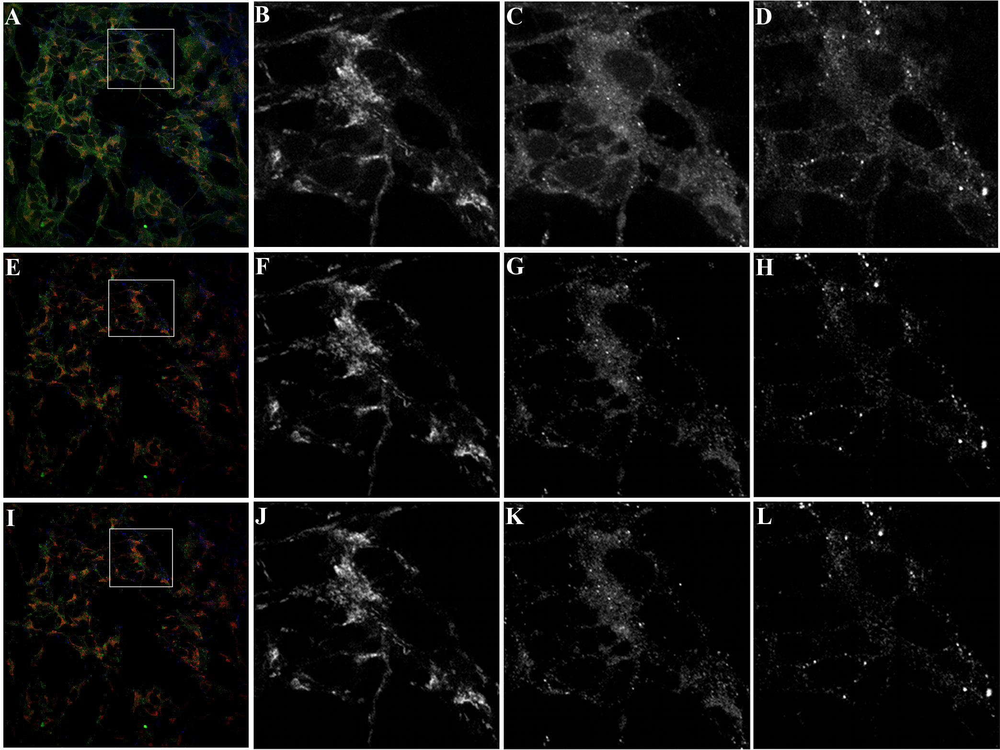
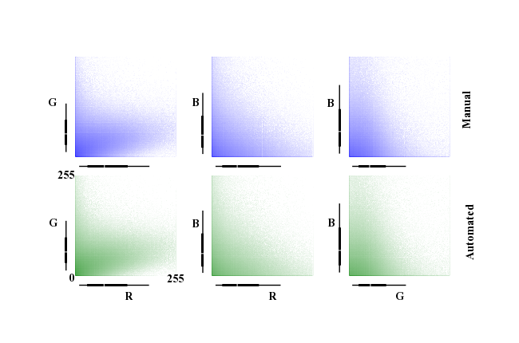
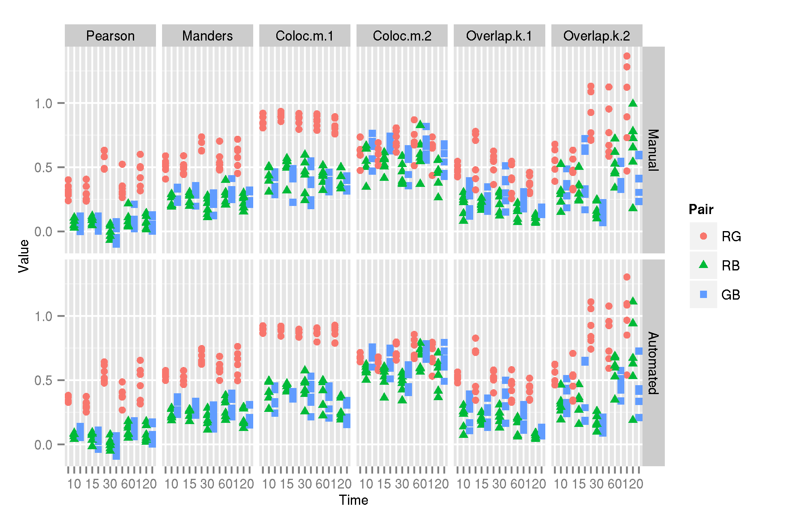

:author: Mark E. Fenner
:email: mfenner@gmail.com
:institution: Coveros, Inc., Fairfax, VA

:author: Barbara M. Fenner
:email: barb.fenner@gmail.com
:institution: King's College, Wilkes-Barre, PA

----------------------------------------------------------
Automating Quantitative Confocal Microscopy Analysis (v07)
----------------------------------------------------------

.. class:: abstract

    Quantitative confocal microscopy is a powerful analytical tool
    used to visualize the associations between cellular processes and
    anatomical structures.  In our biological experiments, we use
    quantitative confocal microscopy to study the association of three
    cellular components: binding proteins, receptors, and organelles.
    We propose an automated method that will (1) reduce the time
    consuming effort of manual background correction and (2) compute
    numerical coefficients to associate cellular process with
    structure.  The project is implemented, end-to-end, in *Python*.
    Pure *Python* is used for managing file access, input parameters,
    and initial processing of the repository of 933 images.  *NumPy*
    is used to apply manual background correction, to compute the
    automated background corrections, and to calculate the domain
    specific coefficients.  We visualize the raw intensity values and
    computed coefficient values with Tufte-style panel plots created
    in *matplotlib*.  A longer term goal of this work is to explore
    plausible extensions of our automated methods to triple-label
    coefficients.

.. class:: keywords

   confocal microscopy, immunofluorescence, thresholding,
   colocalization coefficients

Introduction
------------

Light microscopes capture energy emitted from fluorescently
labeled-proteins within a biological sample. Fluorescent labels are
bound to molecules of interest in the sample.  The corresponding pixel
intensity in the captured image is proportional to the amount of
molecule in the sample.  Multiple molecules can be labelled
simultaneously, by using fluorescent labels with different
excitation/emission spectra.  We designed and executed a biological
experiment to determine the presence of a binding protein and a
receptor protein at sub-cellular structures over time.  The experiment
was analyzed by quantitative confocal microscopy and resulted in a set
of 933 RGB (red, green, and blue) images.  Colocalization of binding
protein, receptor, and subcellular structure is represented by RGB
intensities in a pixel.  The co-occurrence of signal in multiple
channels signifies interesting biological phenomena.  Therefore, we
employed statistical methods of colocalization to quantify
co-occurrence of RGB.  The following sections describe our methods of
quantifying the data contained in these experiments.

Confocal Microscopy
-------------------

Conventional light microscopes produce a two-dimensional image from a
three-dimensional sample by flattening its Z-axis into one visual
plane [Cro05].  Thus, the notion of depth is removed by merging deep
and shallow material into a single cross-section in the XY-plane.
Confocal microscopes maintain Z-axis fidelity by performing repeated
scans of very thin (:math:`{\sim}5{\mu}m`) XY-sections at fixed
depths.  A stack of confocal images represents the original
three-dimensional sample.  In an RGB confocal image, the brightness of
a two-dimensional pixel represents the intensity of fluorescence in
each of the three RGB color channels.

Background noise is the portion of the intensity signal that does not
represent true biological phenomena.  Confocal microscopy inherently
reduces background noise from autofluorescence of cellular material,
light refractive scatter, and detection artifacts [Cro05].  It is
further reduced by choosing appropriate (1) microscope hardware, (2)
fluorescent labels, and (3) computer software settings [Bol06][Cro05].
Even the best confocal microscopy technique and practice produces
images that contain background noise.  For a detailed description of
basic confocal optics and digital imaging, see [Bol06]. Pre-processing
tools decrease background noise, but images often need additional
manual background correction [Bol06][Zin07][Gou05]. Image processing
filters, deconvolution, background subtraction and threshold
techniques reduce background noise using different algorithms [Rob12].
Each technique has application specific advantages and weaknesses.

Biological Context and Experimental Model
-----------------------------------------

We used confocal microscopy to investigate the post-endocytosis
transport of two proteins in neurons.  Specifically, we assessed the
localization of binding proteins and their receptors to sub-cellular
structures.  Post-endocytosis transport of proteins is a highly
regulated, complex process [Yap12].  Briefly, the intracellular
transport pathway is initiated when an extracellular protein binds to
its receptor on the cell membrane.  Once internalized, the proteins
may be localized to three sub-cellular structures: endosomes,
lysosomes, and recycling vesicles.  Proteins are internalized in
endosomes, degraded in lysosomes, and transported back to the cell
membrane in recycling vesicles.  In our model, neuroblastoma cells
were treated with a binding protein over different treatment times
(10, 15, 30, 60, or 120 minutes).  Following binding protein
treatment, we stained cells for binding protein (red), receptor
(green), and sub-cellular structure (blue).  In different treatments,
blue represents different sub-cellular structures.  We performed six
replicates of each condition, resulting in 6 *Series* for each
condition.  At each experimental *Time*, a set of 6 image stacks were
captured with 5-12 optical XY-sections comprising one stack.

In these experiments, the binding protein is brain-derived
neurotrophic factor (BDNF), the receptor is the truncated trkB
receptor (trkB.t1), and the sub-cellular structures are endosomes,
lysosomes, and recycling vesicles.  For the biological importance of
this system, see [Fen12].  The co-occurrence of red, green, and blue
represents the presence of BDNF and trkB.t1 at one of the sub-cellular
structures.

Manual Thresholding
-------------------

We applied a manual thresholding procedure to reduce background noise.
For each channel (R, G, and B) within an image, we (1) visually
assessed the single-channel histogram and determined a threshold
intensity, (2) mapped all intensity values at or below the threshold
to zero, and (3) linearly scaled the remaining values to the intensity
range :math:`[1,255]`.  Additionally, we recorded the range,
:math:`[low, high]`, around the manual threshold value that resulted
in equivalent expert visual perception of the thresholded image.  The
thresholding procedure was repeated for each channel.  Consequently,
all intensity values for red, green, and blue below their respective
thresholds are attributed to background noise and discarded.  The
major drawback to manual thresholding is the large time involvement of
an imaging expert. Within- and between-experimenter reliability,
differences in color output between visual displays, and access to
expensive software packages are additional drawbacks to manual
thresholding.

Automating the Thresholding Procedure
-------------------------------------

Initially, we manually determined threshold values for one randomly
selected stack per experimental condition called our *training set*.
Later, we manually thresholded the entire image set.  Using the
training set, we developed a linear regression model of the manual
thresholds.  Applying this linear model, we predicted thresholds for
the full image set.

To generate automated background thresholds, we first extracted the
deciles of the intensity histograms after removing non-responder
pixels (see *Visualization of Colocalization*).  Then, we considered
linear regression models from (1) the intensity deciles and the channel to
(2) the midpoint of the expert threshold range. For model development,
we used only the training set of images.  Our initial model included
all deciles and the channel.  Only the 8th and 9th deciles (80- and
90-percentiles) and the channel had statistically significant
coefficients.  We retained only these features in our model with a
resulting :math:`R^2` of 0.6907 with :math:`p < 2.2e-16`.  We
evaluated the predictive ability of the model on the full dataset.
The mean absolute error against the midpoint was 6.1313; the mean
distance from the :math:`[low, high]` threshold range was 2.2662.
While these metrics are encouraging, we are more interested in the
overall effect of automated thresholding on the computed
colocalization coefficients, discussed below.

Finally, we compared the images generated by applying manual and
automated thresholds. Both methods produced visually similar images
(Figure :ref:`oepfig`).  In both cases, the greatest amount of
background correction occurred in the green channel.  This is expected
due to natural autofluorescence of cellular material in the green
channel.  However, the green channel also demonstrated the
greatest difference between methods, the automated method
under-corrected.

   Effects of thresholding on visual image representation.  Images are
   of *Time=10, Organelle=Endosome, Series=3*.  Confocal images have
   low signal-noise ratios, but still require background correction
   prior to quantifying biological phenomena (A,E,I).  When a threshold
   is applied manually, the background noise is minimal (E-H).
   Automated thresholding methods reduce background noise to similar
   levels compared to manual thresholding (I-L).  The green channel has
   more background noise after automated thresholding (K), compared to
   manual (G).  Panels A, E, and I are RGB; Panels B, F, and J are the
   red channel; Panels C, G, and K are the green channel; Panels D, H,
   and L are the blue channel. The black and white panels are detailed views
   of the outlined squares in the left-most column. :label:`oepfig`

Visualization of Colocalization
-------------------------------

In total, the images contain approximately 1 billion pixels.  Only a
small percent of the pixels represent protein, receptor, or
sub-cellular structure.  Therefore, the majority of the image pixels
have zero intensity in all channels.  These pixels are non-responders
and are removed from further analysis.  Channels values of 255 are
considered to be over-saturated and are removed because they likely
represent experimental or imaging artifacts.  We computed the
bivariate probability distributions of intensity values for each pair
of channels across *Time* and *Organelle*.  Due to the very large
probability mass for low intensity values, we graphed the
log-probabilities to visualize the behavior of the distribution tails.
We generated a Tufte-style [Tuf01] panel plot of the bivariate
histograms for all conditions. The panel plot for *Time=10,
Organelle=Endosome* is shown in Figure :ref:`tlpfig`.

   Log-probabilities of the bivariate intensity distributions.  After
   removing zeros, the log-probabilities of the bivariate intensity
   distributions were plotted.  Each channel pair is represented for
   both manual and automated threshold images.  The distributions for
   manual and automated thresholds are similar.  Axis bars show 10-,
   25-, 50-, 75-, and 90-percentiles for the univariate intensity
   distributions.  Data are from *Time=10, Organelle=Endosome*
   aggregated over all *Series*.  :label:`tlpfig`

From the panel plot, we see that the bivariate distributions under
manual and automated thresholding are qualitatively similar.  For
example, the RG histograms shows low green intensities distributed
over a wide range of red, with green showing a skew towards higher red
intensities.  The RB histograms show more even distributions over both
channels.  The GB histograms show lower green intensities over a wider
range of blue.  The patterns are the same for both thresholding
methods.  Next, we discuss quantitative assessments of colocalization.

Quantification of Colocalization
--------------------------------

In dual- and triple-label confocal microscopy, several measures of
association are used to quantify the degree of colocalization among
labeled molecules [Bol06][Zin07].  The two most commonly used
measures are *Pearson* and *Manders* coefficients
[Man92][Man93][Com06][Zin07]. Other measures of colocalization are
described below. We call all of these measures the *colocalization
coefficients*.

Here, we consider the two-dimensional grid of RGB pixels as three
one-dimensional vectors of intensity values for each color channel.
In analogy with the moments of a random variable (as opposed to sample
statistics), we define the colocalization coefficients for vectors *x*
and *y* of the same length *n*.

Let :math:`mean(x)=sum(x)/n`,
:math:`dot(x,y)=\sum\limits_{i} x_{i}y_{i}`,
:math:`cov(x,y)=dot(x-mean(x),y-mean(y))/n`, and
:math:`var(x)=cov(x,x)`:

.. math::

   Pearson(x,y)=cov(x,y)/sqrt(var(x)var(y))

The split *k*-overlap coefficients are:

.. math::
   :type: eqnarray

   k_{1}(x,y) &=& dot(x,y)/dot(x,x) \\
   k_{2}(x,y) &=& dot(x,y)/dot(y,y) 

Let :math:`\theta_{xy}` be the angle between *x* and *y* and recall
:math:`sqrt(dot(x,x))` is the length of *x*:

.. math::
   :type: eqnarray

   Manders(x,y)     &=& cos(\theta_{xy}) \\
	            &=& dot(x,y)/sqrt(dot(x,x)dot(y,y)) \\
   {Manders}^2(x,y) &=& k_{1}k_{2}

.. math::

   Pearson(x,y)=Manders(x-mean(x),y-mean(y))

Let :math:`I_{T_x}(x)=x>T_x`, (i.e., 1 if :math:`x>T_x`, 0 otherwise),
then the *m*-colocalization coefficients are:

.. math::
   :type: eqnarray

   m_{1}(x,y) &=& dot(x,I_{T_y}(y))/sum(x) \\
   m_{2}(x,y) &=& dot(y,I_{T_x}(x))/sum(y)

Generally, the colocalization coefficients have the following
interpretations when applied to vectors.  *Pearson* is the degree of
linear relationship between the two vectors.  :math:`Pearson^2` is the
fraction of the variance in *y* explained by the linear relationship
with *x*.  *Manders*, more broadly known as the cosine similarity, is
the cosine of the angle between the two intensity vectors.

:math:`m_1` is the proportion of *x*, summed when *y* is above
threshold, to the sum total of all x values; :math:`m_2` is likewise
for *y*.  :math:`k_1` (equivalent to
:math:`cos(\theta_{xy})length(x)/length(y)`) is the ratio of the
length of *x* and *y* times the cosine similarity between them.

In colocalization analysis, the colocalization coefficients have the
following semantics.  *Pearson* describes the linear relationship
between two channels.  *Manders* describes the *directional*
similarity between the two channels. Thus, *Manders* is not sensitive
to variation in total intensity, which may happen with different
fluorophores. :math:`m_1` describes the amount of channel one
intensity when channel two is *on* to the total amount of channel one
intensity.  :math:`k_1` is similar to *Manders*, but weights the
degree of directional similarity by the ratio of the lengths of *x*
and *y*.  The *m* and *k* coefficients are not symmetric in their
arguments.  Generally, the coefficients range in *[0,1]* (*[-1, 1]* in
the case of *Pearson* and *Manders*) with larger absolute values
indicating a stronger association between values. *Pearson*,
*Manders*, and other *ad hoc* statistics are commonly used association
measures in confocal colocalization, but their method of application,
analysis, and interpretation of conclusions varies greatly in the
literature [Bro00][Phe01][Val05][Li04][Rei12].

We computed the set of all colocalization coefficients efficiently by
noting the common mathematical components of the coefficients and
computing the common values only once.  In the *m*-coefficients, the
threshold :math:`T_x` is taken to be zero, since the coefficients are computed
after manual or automated thresholding.

.. code-block:: python
   :linenos:

   import math
   import numpy as np
   from numpy.core.umath_tests import inner1d
   # inner1d computes inner product on last dimension
   # and broadcasts the rest

   R,G,B = 0,1,2
   channelPairs = [(R,G), (R,B), (G,B)]

   # safely perform dot product on uint8 arrays
   # note the trailing "." to call sum
   def safedot(a, b):
       return (np.multiply(a,b,dtype=np.uint16).
               sum(dtype=np.float64))

   # Compute colocalization coefficients on 
   # the image array
   def ccc(ia):
       # means, sumSqMeanErrors are 1x3; others Nx3
       # indicator is dtype bool; others float64
       sumSqs = \
           inner1d(ia.T, ia.T).astype(np.float64)

       sums = \
           ia.sum(axis=0, dtype=np.float64)

       means      = sums / ia.shape[0]       
       meanErrors = ia - means               

       sqMeanErrors    = meanErrors**2            
       sumSqMeanErrors = sqMeanErrors.sum(axis=0) 
       del sqMeanErrors

       indicator = ia>0

       # dict of channelPairs -> respective dot product
       crossDot = {(c1,c2) : safedot(ia[:,c1], ia[:,c2]) 
                             for c1,c2 in channelPairs}

       # dict of channelPairs -> sum of c1, when c2 > 0
       # factored out of loop for readability
       sumIf = {(c1,c2) : 
                    ia[:,c1][indicator[:,c2]].sum()
                for c1,c2 in channelPairs}

       results = {}
       for c1, c2 in channelPairs:
           k1 = crossDot[(c1,c2)] / sumSqs[c1]
           k2 = crossDot[(c1,c2)] / sumSqs[c2]
	   
           results[(c1,c2)] = {
               "Pearson" : 
	           (np.dot(meanErrors[:,c1],
	                   meanErrors[:,c2]) /
                    np.sqrt(sumSqMeanErrors[c1] * 
                            sumSqMeanErrors[c2])),

	       "Manders" : math.sqrt(k1*k2),

               "Coloc(m)1" : sumIf[(c1,c2)] / sums[c1],
               "Coloc(m)2" : sumIf[(c2,c1)] / sums[c2],

               "Overlap(k)1" : k1,
               "Overlap(k)2" : k2}

        return results

Colocalization Coefficient Results
----------------------------------

We computed the colocalization coefficients, for the manual and
automated threshold images, over each time point for the *Endosome*
organelle after grouping image stacks (Figure :ref:`coeffig`). The
coefficients were used to compare the effects of manual versus
automated thresholding on the scientific interpretation of the
confocal images. For this analysis, correlation coefficients were
calculated for each channel pair (Table :ref:`coefftable`). In the
*RG* channel pair, there is a similar pattern seen between automated
and manually thresholded images, for all correlation coefficient
calculated (Figure :ref:`coefffig`).

.. table:: Pearson and Manders Coefficients for Endosomes. *Src* =
	   *Auto* is Automated threshold; *Man* is Manual threshold.
	   :label:`coefftable`
   :class: w

   +------+---------+------+---------------+---------------+---------------+---------------+---------------+
   | Pair | Coeff   | Src  |      10       |      15       |      30       |      60       |     120       |
   +------+---------+------+---------------+---------------+---------------+---------------+---------------+
   | RG   | Pearson | Man  | 0.32 +/- 0.02 | 0.31 +/- 0.03 | 0.55 +/- 0.03 | 0.35 +/- 0.04 | 0.45 +/- 0.04 |
   +------+---------+------+---------------+---------------+---------------+---------------+---------------+
   | RG   | Pearson | Auto | 0.35 +/- 0.01 | 0.31 +/- 0.02 | 0.55 +/- 0.03 | 0.39 +/- 0.03 | 0.48 +/- 0.05 |
   +------+---------+------+---------------+---------------+---------------+---------------+---------------+
   | RG   | Manders | Man  | 0.51 +/- 0.03 | 0.50 +/- 0.02 | 0.68 +/- 0.02 | 0.55 +/- 0.03 | 0.59 +/- 0.04 |
   +------+---------+------+---------------+---------------+---------------+---------------+---------------+
   | RG   | Manders | Auto | 0.54 +/- 0.01 | 0.51 +/- 0.02 | 0.68 +/- 0.02 | 0.59 +/- 0.03 | 0.63 +/- 0.04 |
   +------+---------+------+---------------+---------------+---------------+---------------+---------------+
   | RB   | Pearson | Man  | 0.06 +/- 0.01 | 0.09 +/- 0.01 | 0.01 +/- 0.02 | 0.09 +/- 0.03 | 0.07 +/- 0.02 |
   +------+---------+------+---------------+---------------+---------------+---------------+---------------+
   | RB   | Pearson | Auto | 0.07 +/- 0.01 | 0.06 +/- 0.02 | 0.00 +/- 0.02 | 0.11 +/- 0.02 | 0.08 +/- 0.03 |
   +------+---------+------+---------------+---------------+---------------+---------------+---------------+
   | RB   | Manders | Man  | 0.24 +/- 0.02 | 0.26 +/- 0.02 | 0.19 +/- 0.03 | 0.27 +/- 0.03 | 0.23 +/- 0.02 |
   +------+---------+------+---------------+---------------+---------------+---------------+---------------+
   | RB   | Manders | Auto | 0.24 +/- 0.02 | 0.24 +/- 0.01 | 0.20 +/- 0.02 | 0.28 +/- 0.03 | 0.20 +/- 0.03 |
   +------+---------+------+---------------+---------------+---------------+---------------+---------------+
   | GB   | Pearson | Man  | 0.07 +/- 0.02 | 0.06 +/- 0.02 |-0.01 +/- 0.03 | 0.09 +/- 0.03 | 0.06 +/- 0.02 |
   +------+---------+------+---------------+---------------+---------------+---------------+---------------+
   | GB   | Pearson | Auto | 0.09 +/- 0.01 | 0.04 +/- 0.02 |-0.01 +/- 0.03 | 0.12 +/- 0.02 | 0.08 +/- 0.03 |
   +------+---------+------+---------------+---------------+---------------+---------------+---------------+
   | GB   | Manders | Man  | 0.29 +/- 0.02 | 0.31 +/- 0.02 | 0.22 +/- 0.03 | 0.30 +/- 0.03 | 0.25 +/- 0.02 |
   +------+---------+------+---------------+---------------+---------------+---------------+---------------+
   | GB   | Manders | Auto | 0.30 +/- 0.02 | 0.28 +/- 0.02 | 0.22 +/- 0.03 | 0.31 +/- 0.03 | 0.22 +/- 0.03 |
   +------+---------+------+---------------+---------------+---------------+---------------+---------------+

For instance, *Pearson* at *Endosomes, 10, Manual* is
:math:`0.32{\pm}0.02` while for *Endosome, 10, Automated* is
:math:`0.35{\pm}0.01`. The *Pearson* coefficient for *Endosomes, 30,
Manual* is :math:`0.55{\pm}0.03` and *Endosomes, 30, Automated* is
:math:`0.55{\pm}0.03`. By *Endosomes, 60*, the Pearson’s coefficient
for *Manual* is :math:`0.35{\pm}0.04` and *Automated* is
:math:`0.39{\pm}0.03`. The scientific interpretation of the
coefficient data, regardless of *Manual* versus *Automated*, suggests
that binding protein (red) and receptor (green) are associated with
each other at all times, but that their greatest association occurs 30
minutes post-treatment time. The same conclusions are obtained from
interpreting *Manders* (Table :ref:`coefftable`). We can use the
combined data from all channel pairs to develop a model of
intracellular localization of binding protein and receptor.

   Correlation coefficients for manual and automated threshold images.
   *Pearson*, *Manders*, *m*-, and *k*-overlap coefficients
   were calculated for manual and automated threshold images.  The
   coefficients were calculated for each channel pair.  Similar
   patterns for correlations coefficients are seen between manual and
   automated threshold images.  The data in this figure was taken from
   the experimental condition *Endosomes* (i.e., B represents
   endosome) over all *Times* and *Series* .  Values in one vertical
   line, a strip, come from the six repeated Series in that
   condition. Left to right, triples of strips are from increasing
   *Time*. :label:`coefffig`

Applications
------------

The automated background correction method we used can be applied to
images generated from any type of microscopy studies including
wide-field, live-cell, and electron microscopy. A second biological
application for background correction is microarray
analysis. Microarrays are tools used to study experimental differences
in DNA, protein, or RNA, which often produce very large datasets
[Hell02]. Multi-channel microarray experiments have similar background
noise challenges as confocal microscopy. Most microarray experimental
data is captured in the form on two-color channel images with
background noise generated from non-specific label binding or
processing artifacts. A third biological application for our automated
thresholding method is magnetic resonance imaging (MRI) [Bal10]. In
MRI images, background correction is often needed for phase distortion
and general background noise. While other methods need to be applied
to correct for phase distortion, our methods could be applied to
reduce general background noise. Other biological applications include
2-D protein gel electrophoresis, protein dot blots, and western blot
analysis [Dow03][Gas09]. For any of these techniques, the background
noise in the resulting images must be corrected prior to
quantification of biological phenomena. Non-biological applications
for our background correction method include, but are not limited to,
photo restoration and enhancement [Dep02]. The correlation coefficient
processing can be applied in many of these applications or any generic
RGB image workflow.

Conclusions
-----------

Confocal microscopy is a powerful tool to investigate physiological
processes in morphological context.  Quantitative analysis of confocal
images is possible using optimized image capture settings, background
correction, and colocalization statistics.  We used confocal
microscopy to quantify the intracellular colocalization of a binding
protein and a receptor to a specific organelle, over time.  There were
two major hurdles: (1) the time and consistency required for manually
thresholding a large number of images and (2) batch processing of
large image sets for statistical analysis.  In 2005, Goucher et
al. developed an open source image analysis program, in *Perl*, to
batch process colocalization for RGB images using an *ad hoc*
association metric [Gou05].  The purpose of our methods was to further
this type of automated process to combine automated thresholding with
batch processing of colocalization coefficients using *Python*.  The
benefits of our model are: (1) reducing the time consuming effort of
manual background correction and (2) batch processing of multiple
correlation measures for tri-color images.  While our experiments
focus on applying automated quantification methods to better
understand intracellular protein transport, our computational methods
can be used to study a wide range of biological and non-biological
phenomena.  A longer term goal of this work is to explore plausible
extensions of our automated methods to triple-label coefficients.

Source code, under a BSD license, for computing colocalization
coefficients, panel plots, and various other utilities is available at
https://github.com/mfenner1/py_coloc_utils .

References
----------
.. [Bal10] M. Balafar et al. *Review of Brain MRI Image Segmentation
	   Methods*, Artificial Intelligence Review, 33: 261-274,
	   January 2010.

.. [Bol06] S. Bolte and F. Cordelieres. *A guided tour into sub
           cellular colocalization analysis in light microscopy*,
           Journal of Micropscopy, 224 (3):213-232, December 2006.

.. [Bro00] P. Brown et al. *Definition of Distinct Compartments in
           Polarized Madin-Darby Canine Kidney (MDCK) Cells for
           Membrane-Volume Sorting, Polarized Sorting and Apical
           Recycling*, Traffic, 1(2): 124-140, February 2000.

.. [Com06] J. Comeau, S. Constantino, and P. Wiseman. *A Guide to
           Accurate Fluorescence Microscopy Colocalization
           Measurements*, Biophysical Journal, 91(12): 4611-4622,
           December 2006.

.. [Cro05] C. Croix, S. Shand, and S. Watkins. *Confocal microscopy:
           comparisons, applications and problems*, Biotechniques,
           39(6 Suppl): S2-5, December 2005.

.. [Dep02] A. de Polo. *Digital Picture Restoration and Enhancement
	   for Quality Archiving*, Digital Signal Processing, 1:
	   99-102, July 2002.
 
.. [Dow03] A. Dowsy, M. Dunn, and G. Yang. *The Role of Bioinformatics
	   in Two-Dimensional Gel Electrophoresis*, Proteomics,
	   3(8):1567-1596, May 2003.

.. [Fen12] B. Fenner. *Truncated TrkB: Beyond a Dominant Negative
	   Receptor*, Cytokine and Growth Factor Review, 23(1):15-24,
	   February 2012.

.. [Gas09] M. Gassmann et al. *Quantifying Western Blots: Pitfalls of
           Densitometry*, Electrophoresis, 30(11): 1845-1855,
           June 2009.

.. [Gou05] D. Goucher. *A quantitative determination of multi-protein
           interactions by the analysis of confocal images using a
           pixel-by-pixel assessment algorithm*, Bioinformatics,
           21(15): 3248-3254, June 2005.

.. [Hell02] M. Heller. *DNA Microarray Technology: Devices, Systems,
	    and Applications*, Annual Review of Biomedical
	    Engineering, 2: 129-153, 2002.

.. [Li04] Q. Li, *A Syntaxin 1, G o, and N-Type Calcium Channel
          Complex at a Presynaptic Nerve Terminal: Analysis by
          Quantitative Immunocolocalization*, Journal of Neuroscience,
          24(16): 4070-4081, April 2004.

.. [Man92] M. Manders et al. *Dynamics of three-dimensional
           replication patterns during the S-phase, analysed by double
           labelling of DNA and confocal microscopy*, Journal of Cell
           Science, 103(3): 857-862, November 1992.

.. [Man93] E. Manders, F. Verbeek, and J. Aten. *Measurement of
           colocalization of objects in dual color confocal images*,
           Journal of Microscopy, 169: 375-382, March 1993.

.. [Phe01] H. Phee, W. Rodgers, and K. Coggeshall. *Visualization of
           negative signaling in B cells by quantitative confocal
           microscopy*, Molecular and Cellular Biology, 21(24):
           8615-8625, December 2001.

.. [Rei12] N. Reitan et al. *Quantitative 3-D colocalization analysis
           as a tool to study the intracellular trafficking and
           dissociation of pDNA-chitosan polyplexes*, Journal of
           Biomedical Optics, 17(2): 026015, February 2012.

.. [Rob12] C. Robertson and S. George. *Theory and practical
           recommendations for autocorrelation-based image correlation
           spectroscopy*, Journal of Biomedical Optics, 17(8):
           080801-1, August 2012.

.. [Tuf01] E. Tufte (2001).  *The Visual Display of Quantitative
           Reasoning (2nd ed.).* Cheshire, CT: Graphics Press.

.. [Val05] G. Valdez. *Pincher-Mediated Macroendocytosis Underlies
           Retrograde Signaling by Neurotrophin Receptors*, Journal of
           Neuroscience, 25(21): 5236-5247.

.. [Yap12] C. Yap and B. Winckler. *Harnessing the power of the
           endosome to regulate neural development*, Neuron, 74(3):
           440-451, May 2012.

.. [Zin07] V. Zinchuk, O. Zinchuk, and T. Okada.  *Quantitative
           colocalization analysis of multicolor confocal
           immunofluorescence microscopy images: pushing pixels to
           explore biological phenomena*, Acta Histochemica et
           Cytochemica, 40(4): 101-111, August 2007.

