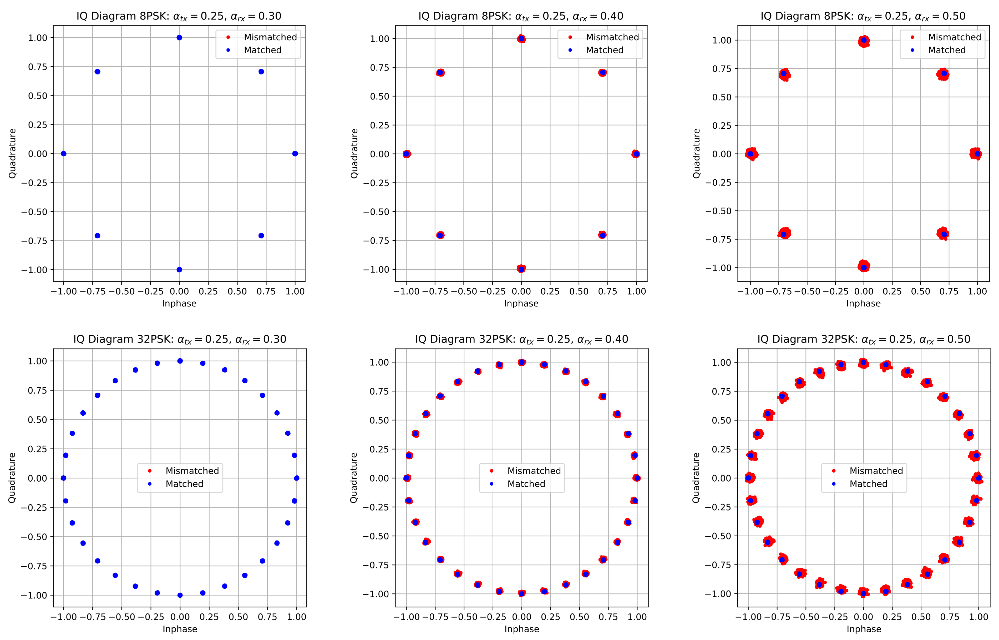
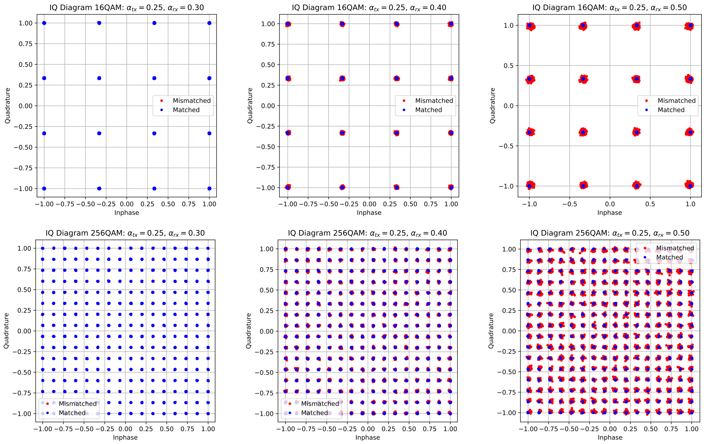

:author: Mark Wickert
:email: mwickert@uccs.edu
:institution: University of Colorado Colorado Springs
:orcid: 0000-0002-8302-3835
:corresponding:

:author: David Peckham
:email: dpeckham@uccs.edu
:institution: University of Colorado Colorado Springs

--------------------------------------------------------------------------------
Matched Filter Mismatch Losses in MPSK and MQAM Using Semi-Analytic BEP Modeling
--------------------------------------------------------------------------------

.. class:: abstract

   The focus of this paper is the bit error probability (BEP) performance
   degradation when the transmit and receive pulse shaping filters are
   mismatched. The modulation schemes considered are MPSK and MQAM.
   In the additive white Gaussian noise (AWGN) channel both spectral
   efficiency and noise mitigation is commonly achieved by using
   square-root raised cosine (SRC) pulse shaping at both the transmitter
   and receiver. The novelty of this paper primarily lies in the use
   semi-analytic BEP simulation for conditional error probability calculations,
   with transmit and receive filter mismatch, the optional inclusion of a small FIR equalizer.
   For lower order MPSK and MQAM, i.e., 8PSK and 16QAM :math:`E_b/N_0` power degradation at
   :math:`\text{BEP} = 10^{-6}` is 0.1 dB when the excess bandwidth mismatch tx/rx = 0.25/0.35 or 0.35/0.25,
   but quickly grows as the modulation order increases and/or the mismatch increases.

.. class:: keywords

   digital modulation, pulse shaping, phase-shift keying,
   quadrature amplitude modulation

Introduction
------------

In the early days of satellite and space communications, digital
modulation schemes focused on constant envelope waveforms, in particular
phase-shift keying (PSK), with rectangular pulse shaping [Lindsey]_.
The need for spectral efficiency is ever present in modern communication
systems [Ziemer]_, [Proakis]_, and [Goldsmith]_. The use of pulse
shaping makes spectral efficiency possible, at the expense of non-constant
envelope waveforms [Ziemer]_. Today m-ary PSK (MPSK) and
high density m-ary quadrature amplitude modulation (MQAM), both with
pulse shaping, are found in satellite communications as well as
terrestrial communications, e.g., WiFi, cable modems, and 4th generation
cellular via long term evolution (LTE). The term m-ary refers to the
fact that bandwidth efficient signaling is accomplished using an :math:`M`
symbol alphabet of complex signal amplitudes, :math:`c_k = a_k + jb_k`,
to encode the transmission of a serial bit stream. In an m-ary digital
modulation scheme we send :math:`\log_2 M` bits per symbol. The objective
being to transmit more bits/s/Hz of occupied spectral bandwidth.

In certain applications the precise pulse shape used by the transmitter
is not known by the receiver. The use of an equalizer is always an
option in this case, but it adds complexity and for burst mode systems,
e.g., TDMA, the convergence time of an adaptive equalizer is another
issue to deal with.

The focus of this paper is the bit error probability (BEP) performance
degradation when the transmit and receive pulse shaping filters are
mismatched. The modulation schemes considered are MPSK and MQAM. In the
additive white Gaussian noise (AWGN) channel both spectral efficiency
and noise mitigation is commonly achieved by using square-root raised
cosine (SRC) pulse shaping at both the transmitter and receiver. The
system block diagram is shown in Figure :ref:`Topblock`. The parameters
:math:`\alpha_{tx}` and :math:`\alpha_{rx}` control the excess bandwidth
factors of the transmit and received filters respectively.
Notice that this block diagram also shows a symbol-spaced equalizer to
allow for the exploration of potential performance improvement, subject
to how much complexity can be afforded, and the need for rapid
adaptation in the case of burst mode transmission. We take advantage of
semi-analytic simulation techniques described in
[Tranter]_ to allow fast and efficient performance
evaluation. All of the simulation software is written in open-source
Python using classes to encapsulate the computations, waveform parameters,
and calculation results. The mathematical foundation is statistical decision
theory, which in the machine learning would be multiclass classification with
apriori decision boundaries.

.. figure:: Block_top.pdf
   :scale: 75%
   :align: center
   :figclass: htb

   System top level block diagram showing transmit and receive pulse
   shaping filters with mismatch, i.e., :math:`\alpha_{tx} \neq \alpha_{rx}`,
   and optionally the inclusion of an adaptive equalizer. :label:`Topblock`

Other authors such as, [Harris]_ and [Xing]_, have made mention of matched filter
mismatch, but not in the same context as we consider in this paper.
Harris is primarily driven by sidelobe reduction from the transmitter
perspective, while Xing wishes to avoid the added complexity of an
equalizer by using a specially designed receiving filter. Here we are
concerned with the situation where the receiver does not always know the
exact design of the transmit pulse shape filter, in particular the
excess bandwidth factor.

The remainder of this paper is organized as follows. We first provide a brief
tutorial on digital communications at the waveform level. Next we
consider residual errors at the matched filter output when using a simple
truncated square-root raised cosine (SRC) finite impulse response (FIR).
In particular we consider filter lengths of :math:`\pm L` symbols in
duration. We
then briefly explain how a symbol-spaced adaptive equalizer can be
inserted at the output of the matched filter to compensate for pulse
shape mismatch. We then move on to briefly review the concept of
semi-analytic (SA)simulation and the develop conditional error
probability expressions for MPSK and MQAM. Finally, we move into
performance results.

Characterizing Digital Communications at the Waveform Level
-----------------------------------------------------------

To provide more context for the theoretical development of the semi-analytic simulation
technique used in this paper and prepare for the system performance characterization
of the results section, we now consider three common digital communication
characterization techniques: *IQ Diagrams*, *eye diagrams*, and *bit error probability*
(BEP) versus received signal energy-to-noise power spectral density (:math:`E_b/N_0`) curves.

IQ Diagrams
===========

An IQ diagram is a representation of a signal modulated by a digital modulation scheme such
as MQAM or MPSK. It displays the signal as a two-dimensional :math:`xy`-plane scatter diagram in
the complex plane at symbol sampling instants. The angle of a point, measured counterclockwise from the
horizontal axis, represents the phase shift of the carrier wave from a reference phase. The distance of
a point from the origin represents a measure of the amplitude or power of the signal.
The number of IQ points in a diagram gives the size of the *alphabet* of symbols that can be transmitted
by each sample, and so determines the number of bits transmitted per sample. For the purposed of this paper
it will be a power of 2. A diagram with four points, for example, represents a modulation scheme that can
separately encode all 4 combinations of two bits: 00, 01, 10, and 11 and so can transmit two bits per sample.
Figure :ref:`IQdiagram` shows an 8-PSK IQ Diagram.

.. figure:: IQ_plot_defined.pdf
   :scale: 65%
   :align: center
   :figclass: htb

   8-PSK IQ Diagram shows information is transmitted as one of 8 symbols, each representing 3 bits of data.
   :label:`IQdiagram`

Eye Diagrams
============

An eye diagram is a tool for the evaluation of the combined effects of channel noise and inter-symbol interference
(ISI) on the performance of a channel. Several system performance measures can be derived by analyzing this display.
If the signals are poorly synchronized with the system clock, or filtered improperly, or too noisy, this can be
observed from the eye diagram. An open eye pattern corresponds to minimal signal distortion (clear diamond shape
in the left plot). Distortion of the signal waveform due
to ISI and noise appears as closure of the eye pattern (note partial closure on the right plot). The tight
waveform bundles at the maximum opening correspond to tight scatter points of the IQ diagram, i.e., similar
to the opposing pair of points on the real axis of Figure :ref:`IQdiagram`.
Since the waveform is complex there is an eye diagram for both the real part and the imaginary part of the signal.
For the purposes of this paper we will be looking at the closure of the eye pattern as the mismatch of
the filters increases, similar to moving from the left to right side of Figure :ref:`EYEdiagram`.

.. figure:: EYE_diagram_defined.pdf
   :scale: 60%
   :align: center
   :figclass: htb

   4PSK eye diagram: perfect channel (left), channel distortions present (right), both assuming 10 samples per symbol.
   :label:`EYEdiagram`

Bit Error Probability (BEP) Curves
==================================

In digital transmission, the number of bit errors is the number of received bits over a communication channel that
have been altered due to noise, interference, distortion (improper filtering), carrier phase tracking errors, and bit
synchronization errors. The bit error probability (BEP), :math:`P_e`, in a practical setting
is the number of bit errors divided by the total number
of transferred bits during a studied time interval. The BEP curves are plotted as
:math:`\log_{10} P_e` versus the received energy per bit-to-noise power spectral density ratio in dB, i.e.,
:math:`10\log_{10}(E_b/N_0)`. The shape of the curve is *waterfall like*
with a theoretical BEP curve to the left of curves for real-world systems. A system with impairments in the end-to-end
transmission path, including the demodulator (think symbol classifier), increase
the BEP for a given operating scenario. In a Wireless LAN or cable modem, for example, a low BEP is required to insure
reliable information exchange. A large :math:`M` is used here to indicate a large number of bits per second, per Hz of bandwidth.
To see a typical BEP curve jump forward to Figure :ref:`BEPsetMPSK`.

Pulse Shaping Filter Considerations
-----------------------------------

The pulse shape used for this matched filter mismatch study is the
discrete-time version of the square-root raised-cosine pulse shape:

.. math::
   :label: SRCpulse

   p_\text{SRC}(t) = \begin{cases}
           1 - \alpha +4\alpha/\pi, & t = 0 \\
           \frac{\alpha}{\sqrt{2}}\Big[\big(1+\frac{2}{\pi}\big)\sin\big(\frac{\pi}{4\alpha}\big) \\
           \quad\quad\big(1-\frac{2}{\pi}\big)\cos\big(\frac{\pi}{4\alpha}\big)\Big], & t =
           \pm \frac{T}{4\alpha} \\
           \Big\{\sin\big[\pi t(1-\alpha)/T\big] + \\
           4\alpha t\cos\big[\pi t(1+\alpha)/T\big]/T\Big\}/ \\
           \Big\{\pi t\big[1 - (4\alpha t/T)^2\big]/T\Big\}^{-1}, & \text{otherwise}
       \end{cases}

where :math:`T` is the symbol period. The name used here is square-root
raised cosine (SRC). The transmitted signal bandwidth when using SRC shaping is approximately
:math:`(1+\alpha)R_s`, where :math:`R_s = R_b/\log_2 M` is the symbol rate and :math:`R_b` is
the serial bit rate. Note m-ary signaling and SRC pulse shaping together together serve to increase
spectral efficiency in all the applications mentioned in the introductory paragraph.

The upper plot of Figure :ref:`SRCpulseMFpulseOutput` shows the right half of an SRC pulse shape for
:math:`\alpha = 0.5` and 0.25. The lower plot shows the result of passing the transmit pulse through
a matched and mismatched receiver filter. The point of the SRC-SRC cascade is to provide
spectral efficiency and insure that the pulse zero crossing occur at the adjacent symbol
periods, i.e. zero ISI. For the mismatched case you can see ISI has crept in.

.. figure:: SRC_pulse_shape_plus_MF_output.pdf
   :scale: 55%
   :align: center
   :figclass: htb

   Plots of the SRC pulse shape (top) for :math:`\alpha = 0.25` and 0.5 and SRC-SRC cascading under a
   matched and mismatched receiver filter. :label:`SRCpulseMFpulseOutput`

For realizability considerations the discrete-time
transmit pulse shaping filter and receiver matched filter are obtained
by time shifting and truncating and then sampling by letting
:math:`t\rightarrow n T`. Residual errors at the matched filter output are present
as a result of truncation as noted in both [Harris]_ and [Xing]_.
For small :math:`M` values :math:`\pm 6T` is acceptable, but for the higher schemes considered in
this paper we found increasing the filter
length to :math:`\pm 8T` was required to avoid residual errors under matched pulse shape conditions. The residual
errors at the zero crossings shown in the bottom half of Figure :ref:`SRCpulseMFpulseOutput`, but now for an
ensemble transmit symbols, is shown in Figure :ref:`SRCresidual`. Here we see that the errors
increase as :math:`\alpha` decreases.

.. figure:: Residual_compare_4QAM.pdf
   :scale: 50%
   :align: center
   :figclass: htb

   Matched SRC filters at transmit and receiver showing residual error
   due to FIR filter truncation of the doubly infinite pulse response
   [Rappaport]_, for a nominal maximum eye opening
   of :math:`\pm 1`. :label:`SRCresidual`

Semi-Analytic Bit Error Probability
-----------------------------------

Semi-analytic BEP (SA-BEP) calculation allows for fast and efficient
analysis when a linear channel exists from the AWGN noise injection point
to the receiver detector [Tranter]_. A block
diagram, which applies to the matched filter mismatch scenario of this
paper, is shown in Figure :ref:`BlockSAsim`. The variable
:math:`z_k` is the complex baseband detector decision statistic, as the
receiver matched filter is sampled at the symbol rate, :math:`R_s=1/T`,
nominally at the maximum eye opening. ISI is present in :math:`z_k` due
to pulse shape mismatch and other impairments such as timing error,
static phase error, and even phase jitter. This corresponds to an
ensemble of conditional Gaussian probabilities. The variance
:math:`\sigma_w^2`, for each the real/imaginary parts
(inphase/quadrature), is calculated using

.. math::
   :label: noisePwr

   \sigma_w^2 = N_0\cdot \sum_{n=0}^{N_\text{taps}-1} |p_r[n]|^2,

where the variance of the additive white Gaussian noise is denoted
:math:`N_0` and :math:`p_r[n]` is the matched filter impulse response
consisting of :math:`N_\text{taps}`. The value of :math:`\sigma_w` found
in the conditional error probability of the following subsections is a
function of :math:`N_0`, which is set to give the desired average
received energy per symbol :math:`E_s` (note the energy per bit
:math:`E_b` is :math:`E_s/\log_2(M)`) to noise power spectral
density ratio, i.e., :math:`E_s/N_0` or :math:`E_b/N_0`. This allows
full BEP curves to be generated using just a single ensemble of ISI
patterns. The calculation of :math:`N_0`, taking into account the fact
that the total noise power is split between real/imaginary (or in
digital communications theory notation inphase/quadrature) parts is given by

.. math::
   :label: N0calc

   N_0 = \frac{E_s}{2\cdot 10^{(E_s/N_0)_\text{dB}/10}}

To be clear, :math:`(E_s/N_0)_\text{dB}` is the desired receiver
operating point. In the software simulation model we set
:math:`(E_b/N_0)_\text{dB}`, convert to :math:`(E_s/N_0)_\text{dB}`,
arrive at :math:`N_0` for a fixed :math:`E_s`, then finally determine
:math:`\sigma_w`. Note the 2 in the denominator of
(:ref:`N0calc`) serves to split the total noise power between
the in-phase and quadrature components.

.. figure:: Block_SA.pdf
   :scale: 75%
   :align: center
   :figclass: htb

   Block diagram describing how for a linear channel from the noise
   injection point to the detector, enables the use of semi-analytic BEP
   calculation over a more time consuming Monte-Carlo simulation. :label:`BlockSAsim`

The SA-BEP method first calculates the symbol error probability by
averaging over the ensemble of conditional Gaussian probabilities

.. math::
   :label: SABEP

   P_{E,\text{symb}} = \frac{1}{N} \sum_{k=1}^N \text{Pr}\{\text{Error}|z_k,
   \sigma_w,\text{other impairments}\}

where :math:`N` is the number of symbols simulated to create the
ensemble. For the m-ary schemes MPSK and MQAM we further assume that Gray coding
(adjacent symbols differ by only one bit) is employed
[Ziemer]_, and the BEP values of interest are small, allowing the bit error probability to
be directly obtained from the symbol error probability via

.. math::
   :label: SEP2BEP

   \text{BEP} = \frac{P_{E,\text{symb}}}{\text{log}_2(M)}

The *other impairments* noted in (:ref:`SABEP`) refers to the
fact that SA-BEP can also be used to model carrier phase error or symbol
timing error.

For the SA-BEP analysis model what remains is to find expressions for
the conditional error probabilities in (:ref:`SABEP`). A feature in the analysis of
both MPSK and MQAM, is that both schemes reside in a two dimensional
signal space and we can freely translate and scale signal points to a
*normalized location* to make the error probability equations easier to
work with.

M-ary PSK
---------

For MPSK with :math:`M > 2` the optimum decision region for symbol
detection is a wedge shaped region having interior angle :math:`\pi/M`,
as shown in the right side of Figure :ref:`saMPSK`.

.. In [Ziemer]_ an
   exact SEP expression (and hence Gray coded BEP), attributed to [Craig]_,
   is given by:

..
   .. math::
   :label: MPSKexact

.. P_{E,\text{symb}} = \frac{1}{\pi}\int_0^{\pi-\pi/M} \exp\left(\frac{(E_s/N_0)
   \sin^2(\pi/M)}{\sin^2(\phi)}\right)\, d\phi

.. Avoiding numerical integration is desirable so that
   (:ref:`SABEP`) can be computed quickly.

A simple upper bound, accurate for our purposes, is
described in [Ziemer]_ and
[Craig]_, considers the perpendicular distance
between the nominal signal space point following the matched filter and
the wedge shaped decision boundary as shown in
Figure :ref:`saMPSK`.

.. figure:: MPSK_SA_analysis.pdf
   :scale: 65%
   :align: center
   :figclass: htb

   Formulation of the conditional symbol error probability of MPSK
   (:math:`M=8` illustrated) given decision variable :math:`z_k`. :label:`saMPSK`

For unimpaired MPSK (no noise), we consider a normalized MPSK signal
point, :math:`z_k`, at angle zero to be the complex value :math:`(1,0)`.
Since :math:`z_k`
is actually a complex baseband signal sample, it can be viewed as the
point :math:`z_k = 1 + j0` in the complex plane. The signal point length
being one corresponds to setting :math:`z_k = \sqrt{E_s} = 1`, where
:math:`E_s` is the symbol energy. The symbol error probability
:math:`P_{E,\text{symb}}` is over bounded by the probability of lying
above line :math:`L_a` or below line :math:`L_b`, when circularly
symmetric Gaussian noise is now added to :math:`z_k`. For the special
case of :math:`z_k = 1` the probabilities of being above and below the
lines are equal, hence this upper bound approximation results in

.. math::
   :label: MPSKbound

   P_{E,\text{symb}} \simeq 2Q\left(\frac{z_k\cdot\sin(\pi/M)}{\sigma_w}\right)=
   2Q\left(\frac{\sin(\pi/M)}{\sigma_w}\right),

where :math:`Q(x)` is the Gaussian :math:`Q` function given by

.. math::
   :label: Qfctn

   Q(x) = \frac{1}{\sqrt{2\pi}} \int_x^\infty e^{-t^2/2}\, dt.

Since we have assumed that :math:`z_k = 1` we use :math:`\sigma_w` via
:math:`N_0` to control the operating point, :math:`E_s/N_0`, and hence
also :math:`E_b/N_0`. The over bound region, shown in light red in
Figure :ref:`saMPSK`, is due to double counting the error
probability in this region.

..

.. To demonstrate that this bound expression is adequate for the SA-BEP
   modeling needs of this paper, we consider :math:`M=4` and 8 with
   :math:`E_b/N_0` between 0 and 10 dB, focusing on BEP values above
   :math:`10^{-3}`. Overlay plots of the exact BEP obtained from
   (:ref:`MPSKexact`) and the bound of
   (:ref:`MPSKbound`) are shown in
   Figure :ref:`BEPMPSKcompare`.

..  .. figure:: 4PSK_8PSK_BEP_Exact_vs_Bound.pdf
      :scale: 65%
      :align: center
      :figclass: htb

..    MPSK exact and bound BEP versus :math:`E_b/N_0` in dB for :math:`M=4`
      and 8. :label:`BEPMPSKcompare`

With the bound only small differences are noted for the :math:`M=4` case, and then only
at very low :math:`E_b/N_0` values. The bound becomes tighter as
:math:`M` increases and as :math:`E_b/N_0` increases. We conclude that
the bounding expression for :math:`P_{E,\text{symb}}` is adequate for
use in semi-analytic BEP calculations at :math:`P_E` values below
:math:`10^{-3}`.

When matched filter mismatch is present the complex decision variable
:math:`z_k`, obtained by sampling the matched filter output, no longer
sits at a normalized value of :math:`(1,0) = 1\angle 0`. The scenario of
a perturbed :math:`z_k` is the real intent of
Figure :ref:`saMPSK`, where it shows two perpendicular
distances, :math:`d_a` and :math:`d_b`, for an arbitrary :math:`z_k`. We
now use these distances to form the conditional probability of symbol
error, and hence the Gray coded BEP. Using simple geometry to write
:math:`d_a` and :math:`d_b` in terms of the angle :math:`\pi/M` and
:math:`z_k = |z_k|e^{j\theta_k}` we can finally write the conditional
symbol error probability as

.. math::
   :label: MPSKsepfnl
   :type: eqnarray

       P_{E,\text{symb}}(z_k,\sigma_w) &=& Q\left(\frac{|z_k|\sin(\pi/M -
       |\theta_k|)}{\sigma_w}\right) + \nonumber \\
       && Q\left(\frac{|z_k|\sin(\pi/M + |\theta_k|)}{\sigma_w}\right).

M-ary Quadrature Amplitude Modulation
-------------------------------------

For MQAM the noise-free received symbols are scaled and translated to
lie nominally at :math:`(0,0)` in the complex plane. Here we pattern the
development of the SEP expression after
[Ziemer]_. The decision region for correct symbol
detection detection is one of three types: (1) interior square, (2)
left/right or top/bottom channel to infinity, (3) corners upper
right/left and bottom right/left with two infinite sides, as depicted in
Figure :ref:`SAMQAM`.

.. figure:: MQAM_SA_analysis.pdf
   :scale: 65%
   :align: center
   :figclass: htb

   Formulation of the conditional symbol error probability of MQAM given
   decision variable :math:`z_k`. :label:`SAMQAM`

Using simplifications similar to the MPSK case, we have the following
equations for calculating the conditional SEP for symbol Types 1, 2, and
3. In the semi-analytic simulation software the symbol is known a
priori, so in forming the average of (:ref:`SABEP`) we choose
the appropriate expression. For type 1 we have:

.. math::
   :label: PEQAM1

   \begin{split}
       P_{E|\text{type 1}}(z_k,\sigma_w| \text{type 1}) \text{ = \hspace{1.45in}} \\
       Q\left(\frac{a - \text{Re}\{z_k\}}{\sigma_w}\right)
       + Q\left(\frac{a + \text{Re}\{z_k\}}{\sigma_w}\right) \\
       + Q\left(\frac{a - \text{Im}\{z_k\}}{\sigma_w}\right)
       + Q\left(\frac{a + \text{Im}\{z_k\}}{\sigma_w}\right)
   \end{split}

For type 2 we have:

.. math::
   :label: PEQAM2

   \begin{split}
       P_{E|\text{type 2}}(z_k,\sigma_w| \text{type 2}) \text{ = \hspace{1.45in}} \\
       Q\left(\frac{a - \text{Re}\{z_k\}}{\sigma_w}\right)
       + Q\left(\frac{a + \text{Re}\{z_k\}}{\sigma_w}\right) \\
       + Q\left(\frac{a \pm \text{Im}\{z_k\}}{\sigma_w}\right)
   \end{split}

Finally for type 3 we have:

.. math::
   :label: PEQAM3

   \begin{split}
       P_{E|\text{type 3}}(z_k,\sigma_w| \text{type 3}) \text{ = \hspace{1.5in}} \\
       Q\left(\frac{a \pm \text{Re}\{z_k\}}{\sigma_w}\right)
       + Q\left(\frac{a \pm \text{Im}\{z_k\}}{\sigma_w}\right)
   \end{split}

In all three conditional probability of bit error expressions, (:ref:`PEQAM1`),
(:ref:`PEQAM2`), and (:ref:`PEQAM3`), the variable :math:`a` is defined is defined in
terms of the energy per symbol, :math:`E_s` and modulation order :math:`M` using

.. math::
   :label: QAMfinda

   a = \sqrt{\frac{3E_s}{2(M-1)}}.

Software Tools and Reproducible Science
---------------------------------------

All of the analysis and simulation software developed for this study is
written in Python. It makes use of the *scipy-stack* and the authors
GitHub project *scikit-dsp-comm* [Wickert1]_. Two classes
:code:`MPSK_sa_BEP` and :code:`MQAM_sa_BEP` do all
of the heavy lifting.
The code base specifics for this paper can be found on GitHub at
[Wickert2]_. The contents include Jupyter notebooks
and code modules. All of this is open-source and freely available.

Results
-------

In this section we consider the impact of filter mismatch in MPSK and MQAM.
Equalization is not included in these first two studies. Next we consider how
a short length equalizer can be employed to  mitigate the mismatch
performance losses, at increased system complexity.

Effects of Mismatch Filtering on MPSK
=====================================

To limit the amount of data presented to the reader the figures shown for MPSK have a constant :math:`\alpha_\text{tx} = .25` while varying
:math:`\alpha_\text{rx} = .3`, .4, and  .5. Later we provide heatmaps of :math:`E_b/N_0` degradation results over a range of :math:`\alpha_\text{tx}` and
:math:`\alpha_\text{rx}` scenarios. Figure :ref:`IQsetMPSK` shows IQ diagrams across orders of :math:`M` while varying :math:`\alpha_\text{rx}`.
The IQ diagrams plot the received symbols of the ideal matched filter system overlaid with the received symbols of a
mismatched filter system.
The left column shows that a small mismatch results in minimal error with every symbol being clearly defined, even at 32PSK.
However, on the far right we see a more extreme case of mismatch filtering resulting in more ISI. With less separation
between symbols it is expected that higher orders of :math:`M` are more affected by mismatch filtering.

   Two rows of IQ Diagrams showing the effects of mismatch filtering; The order of :math:`M` increases with row number,
   :math:`M=8, 32`; :math:`\alpha_\text{tx} = .25` is fixed across all columns, while :math:`\alpha_\text{rx}` increases with
   column number as .3, .4, .5. :label:`IQsetMPSK`

Figure :ref:`BEPsetMPSK` shows a row of BEP curves for :math:`M=16` while varying :math:`\alpha_\text{rx}`. The BEP Curves
show how mismatch filtering affects :math:`P_E` across :math:`E_b/N_0` while comparing it to a theory curve. Each curve
plots the theory curve for the modulation type, a SA-BEP curve with a perfect matched filter, and a SA-BEP Curve that varies
:math:`\alpha_\text{rx}` with a constant :math:`\alpha_\text{tx}`. These results correspond to the first row of IQ
diagrams presented in Figure :ref:`IQsetMPSK`. On the left we see a small mismatch results in minimal error with all three
curves tightly together. On the right we a large degradation, denoted as the increase in :math:`E_b/N_0` to achieve the same
:math:`P_E` with perfect matched filter.

.. figure:: BEP_curve_set_MPSK.pdf
   :scale: 110%
   :align: center
   :figclass: w

   One row of BEP Curves showing the effects of mismatch filtering; Here :math:`M` is fixed at 16; :math:`\alpha_\text{tx} = .25`
   across the columns, while :math:`\alpha_\text{rx}` increases with column number as excess bandwidth factors of
   .3, .4, .5. :label:`BEPsetMPSK`

Figure :ref:`EYEsetMPSK` shows one row of eye diagrams across for :math:`M=8` while varying :math:`\alpha_\text{rx}`. The eye diagrams show
the effects of the added ISI introduced by mismatched filtering at the maximum eye opening sampling instant of the symbols.
The same pattern of Figures :ref:`IQsetMPSK` and :ref:`BEPsetMPSK` are seen here in terms of eye diagrams: a wide eye on
the left side at the sampling instance meaning less ISI and noise. While on the right side the ISI begins to close the eye.
Not shown here, higher orders of :math:`M` are more perturbed by the introduction of mismatch filtering.

.. figure:: EYE_diagram_set_MPSK.pdf
   :scale: 110%
   :align: center
   :figclass: w

   One row of of eye diagrams showing the effects of mismatch filtering; here :math:`M` is fixed at 8;
   :math:`\alpha_\text{tx} = .25` across the columns, while :math:`\alpha_\text{rx}` increases with column number
   as  excess bandwidth factors of .3, .4, .5. :label:`EYEsetMPSK`

Figure :ref:`mismatchloss1` shows the degradation over various BEP threshold values of
:math:`\{10^{-5},10^{-6},10^{-7},10^{-8},10^{-9}\}`, :math:`M = 4`, 8, 16, and 32, and
many combinations of :math:`\alpha_\text{tx}/\alpha_\text{rx}\in [1/2, 2]`. The degradation is the measured
shift in :math:`E_b/N_0` in dB between ideal theory and a system with filter mismatch at a particular BEP threshold.
As :math:`M` increases and :math:`\alpha_\text{tx}/\alpha_\text{rx}` moves above or below 1 the
degradation gets worse. With the worse degradation happening at :math:`M = 32` and
:math:`\alpha_\text{tx}/\alpha_\text{rx}` reaching the extremes of 1.2 and 2. Note degradation values
of less than 0.01 dB are considered insignificant and are entered in the heatmap as zero values.

.. figure:: Table1_HeatMapNC.pdf
   :scale: 90%
   :align: center
   :figclass: w

   MPSK degradation resulting from filter mismatch. :label:`mismatchloss1`

.. +----+-----------------------------------+---------+---------+---------+---------+---------+---------+---------+---------+---------+---------+
   |    | :math:`\mathbf{\alpha}_\text{tx}` | 0.25    | 0.25    | 0.25    | 0.25    | 0.25    | 0.3     | 0.35    | 0.4     | 0.45    | 0.5     |
   +----+-----------------------------------+---------+---------+---------+---------+---------+---------+---------+---------+---------+---------+
   |    | :math:`\mathbf{\alpha}_\text{rx}` | 0.3     | 0.35    | 0.4     | 0.45    | 0.5     | 0.25    | 0.25    | 0.25    | 0.25    | 0.25    |
   +----+-----------------------------------+---------+---------+---------+---------+---------+---------+---------+---------+---------+---------+
   | M  | BEP                               | :math:`\hspace{1.9in} E_b/N_0` Degradation (dB)                                                   |
   +====+===================================+=========+=========+=========+=========+=========+=========+=========+=========+=========+=========+
   | 4  | :math:`10^{-5}`                   | 0\*     | 0\*     | 1.00e-2 | 2.41e-2 | 4.37e-2 | 0\*     | 0\*     | 0\*     | 2.40e-2 | 4.43e-2 |
   +----+-----------------------------------+---------+---------+---------+---------+---------+---------+---------+---------+---------+---------+
   | 4  | :math:`10^{-6}`                   | 0\*     | 0\*     | 1.26e-2 | 3.01e-2 | 5.46e-2 | 0\*     | 0\*     | 1.26e-2 | 3.01e-2 | 5.52e-2 |
   +----+-----------------------------------+---------+---------+---------+---------+---------+---------+---------+---------+---------+---------+
   | 4  | :math:`10^{-7}`                   | 0\*     | 0\*     | 1.53e-2 | 3.62e-2 | 6.56e-2 | 0\*     | 0\*     | 1.53e-2 | 3.61e-2 | 6.62e-2 |
   +----+-----------------------------------+---------+---------+---------+---------+---------+---------+---------+---------+---------+---------+
   | 4  | :math:`10^{-8}`                   | 0\*     | 0\*     | 1.80e-2 | 4.23e-2 | 7.66e-2 | 0\*     | 0\*     | 1.80e-2 | 4.22e-2 | 7.72e-2 |
   +----+-----------------------------------+---------+---------+---------+---------+---------+---------+---------+---------+---------+---------+
   | 4  | :math:`10^{-9}`                   | 0\*     | 0\*     | 2.06e-2 | 4.84e-2 | 8.77e-2 | 0\*     | 0\*     | 2.06e-2 | 4.84e-2 | 8.83e-2 |
   +----+-----------------------------------+---------+---------+---------+---------+---------+---------+---------+---------+---------+---------+
   | 8  | :math:`10^{-5}`                   | 0\*     | 0\*     | 3.47e-2 | 8.15e-2 | 1.49e-1 | 0\*     | 0\*     | 3.48e-2 | 8.16e-2 | 1.49e-1 |
   +----+-----------------------------------+---------+---------+---------+---------+---------+---------+---------+---------+---------+---------+
   | 8  | :math:`10^{-6}`                   | 0\*     | 1.22e-2 | 4.39e-2 | 1.02e-1 | 1.87e-1 | 0\*     | 1.21e-2 | 4.39e-2 | 1.03e-1 | 1.87e-1 |
   +----+-----------------------------------+---------+---------+---------+---------+---------+---------+---------+---------+---------+---------+
   | 8  | :math:`10^{-7}`                   | 0\*     | 1.49e-2 | 5.31e-2 | 1.24e-1 | 2.25e-1 | 0\*     | 1.49e-2 | 5.31e-2 | 1.24e-1 | 2.25e-1 |
   +----+-----------------------------------+---------+---------+---------+---------+---------+---------+---------+---------+---------+---------+
   | 8  | :math:`10^{-8}`                   | 0\*     | 1.77e-2 | 6.23e-2 | 1.45e-1 | 2.62e-1 | 0\*     | 1.77e-2 | 6.24e-2 | 1.45e-1 | 2.62e-1 |
   +----+-----------------------------------+---------+---------+---------+---------+---------+---------+---------+---------+---------+---------+
   | 8  | :math:`10^{-9}`                   | 0\*     | 2.06e-2 | 7.16e-2 | 1.65e-1 | 3.00e-1 | 0\*     | 2.05e-2 | 7.16e-2 | 1.66e-1 | 2.99e-1 |
   +----+-----------------------------------+---------+---------+---------+---------+---------+---------+---------+---------+---------+---------+
   | 16 | :math:`10^{-5}`                   | 0\*     | 3.87e-2 | 1.32e-1 | 3.06e-1 | 5.61e-1 | 0\*     | 3.88e-2 | 1.32e-1 | 3.06e-1 | 5.61e-1 |
   +----+-----------------------------------+---------+---------+---------+---------+---------+---------+---------+---------+---------+---------+
   | 16 | :math:`10^{-6}`                   | 0\*     | 4.92e-2 | 1.67e-1 | 3.86e-1 | 7.05e-1 | 0\*     | 4.92e-2 | 1.67e-1 | 3.86e-1 | 7.05e-1 |
   +----+-----------------------------------+---------+---------+---------+---------+---------+---------+---------+---------+---------+---------+
   | 16 | :math:`10^{-7}`                   | 1.13e-2 | 5.97e-2 | 2.02e-1 | 4.64e-1 | 8.46e-1 | 1.14e-2 | 5.98e-2 | 2.02e-1 | 4.64e-1 | 8.46e-1 |
   +----+-----------------------------------+---------+---------+---------+---------+---------+---------+---------+---------+---------+---------+
   | 16 | :math:`10^{-8}`                   | 1.36e-2 | 7.03e-2 | 2.36e-1 | 5.42e-1 | 9.83e-1 | 1.36e-2 | 7.04e-2 | 2.36e-1 | 5.42e-1 | 9.83e-1 |
   +----+-----------------------------------+---------+---------+---------+---------+---------+---------+---------+---------+---------+---------+
   | 16 | :math:`10^{-9}`                   | 1.58e-2 | 8.09e-2 | 2.71e-1 | 6.18e-1 | 1.11e+0 | 1.58e-2 | 8.10e-2 | 2.71e-1 | 6.18e-1 | 1.11e+0 |
   +----+-----------------------------------+---------+---------+---------+---------+---------+---------+---------+---------+---------+---------+
   | 32 | :math:`10^{-5}`                   | 2.89e-2 | 1.46e-1 | 5.06e-1 | 1.22e+0 | 2.38e+0 | 2.90e-2 | 1.46e-1 | 5.06e-1 | 1.22e+0 | 2.38E+0 |
   +----+-----------------------------------+---------+---------+---------+---------+---------+---------+---------+---------+---------+---------+
   | 32 | :math:`10^{-6}`                   | 3.72e-2 | 1.86e-1 | 6.43e-1 | 1.55e+0 | 3.04e+0 | 3.73e-2 | 1.86e-1 | 6.43e-1 | 1.55e+0 | 3.04E+0 |
   +----+-----------------------------------+---------+---------+---------+---------+---------+---------+---------+---------+---------+---------+
   | 32 | :math:`10^{-7}`                   | 4.56e-2 | 2.26e-1 | 7.80e-1 | 1.87e+0 | 3.65e+0 | 4.56e-2 | 2.26e-1 | 7.80e-1 | 1.87e+0 | 3.64E+0 |
   +----+-----------------------------------+---------+---------+---------+---------+---------+---------+---------+---------+---------+---------+
   | 32 | :math:`10^{-8}`                   | 5.40e-2 | 2.67e-1 | 9.14e-1 | 2.18e+0 | 4.17e+0 | 5.40e-2 | 2.67e-1 | 9.14e-1 | 2.18e+0 | 4.17E+0 |
   +----+-----------------------------------+---------+---------+---------+---------+---------+---------+---------+---------+---------+---------+
   | 32 | :math:`10^{-9}`                   | 6.24e-2 | 3.07e-1 | 1.04e+0 | 2.46e+0 | 4.61e+0 | 6.25e-2 | 3.07e-1 | 1.04e+0 | 2.46e+0 | 4.61E+0 |
   +----+-----------------------------------+---------+---------+---------+---------+---------+---------+---------+---------+---------+---------+
   | \* degradation less than 0.01 dB; Tx/Rx Pulse Shape Span = :math:`\pm 8` symbols                                                           |
   +----+-----------------------------------+---------+---------+---------+---------+---------+---------+---------+---------+---------+---------+

Effects of Mismatch Filtering on MQAM
=====================================

Here we show only IQ diagrams for
:math:`\alpha_\text{tx} = .25` while varying :math:`\alpha_\text{rx} = .3`, .4, and  .5. As in the MPSK case later we provide
:math:`E_b/N_0` degradation results over a range of :math:`\alpha_\text{tx}` and :math:`\alpha_\text{rx}` values.
Figure :ref:`IQsetMPSK` shows two rows of IQ diagrams for :math:`M=16, 256` while varying :math:`\alpha_\text{rx}`.
The IQ diagrams plot the received symbols of the ideal matched filter system overlaid with the received symbols of a
mismatched filter system.
The left column shows that a small mismatch results in minimal error with every symbol being clearly defined, even at 256QAM.
However, on the far right we see a more extreme case of mismatch filtering resulting in serious ISI, particularly for 256QAM. With less separation
between symbols we expected large :math:`E_b/N_0` degradation will occur in the BEP plots.

   Two rows of IQ Diagrams showing the effects of mismatch filtering; The order of :math:`M` increases with row number,
   :math:`M=16, 256`; :math:`\alpha_\text{tx} = .25` fixed across all columns, while :math:`\alpha_\text{rx}` increases with
   column number as .3, .4, .5. :label:`IQsetMQAM`

Figure :ref:`mismatchloss2` repeats Figure :ref:`mismatchloss1` for MQAM. Results are similar for low modulation :math:`M`,
but the degradation for 256QAM is more serious than 32MPSK. This is not surprising when one considers the IQ diagrams,
i.e., signal points are closer in MQAM than MPSK.

.. figure:: Table2_HeatMapNC.pdf
   :scale: 90%
   :align: center
   :figclass: w

   MQAM degradation resulting from filter mismatch. :label:`mismatchloss2`

.. +-----+-----------------------------------+----------+----------+---------+---------+---------+----------+----------+---------+---------+---------+
   |     | :math:`\mathbf{\alpha}_\text{tx}` | 0.25     | 0.25     | 0.25    | 0.25    | 0.25    | 0.3      | 0.35     | 0.4     | 0.45    | 0.5     |
   +-----+-----------------------------------+----------+----------+---------+---------+---------+----------+----------+---------+---------+---------+
   |     | :math:`\mathbf{\alpha}_\text{rx}` | 0.3      | 0.35     | 0.4     | 0.45    | 0.5     | 0.25     | 0.25     | 0.25    | 0.25    | 0.25    |
   +-----+-----------------------------------+----------+----------+---------+---------+---------+----------+----------+---------+---------+---------+
   | M   | BEP                               | :math:`\hspace{2.0in} E_b/N_0` Degradation (dB)                                                       |
   +=====+===================================+==========+==========+=========+=========+=========+==========+==========+=========+=========+=========+
   | 4   | :math:`10^{-5}`                   | 0\*      | 0\*      | 0\*     | 2.40e-2 | 4.42e-2 | 0\*      | 0\*      | 0\*     | 2.40e-2 | 4.42e-2 |
   +-----+-----------------------------------+----------+----------+---------+---------+---------+----------+----------+---------+---------+---------+
   | 4   | :math:`10^{-6}`                   | 0\*      | 0\*      | 1.26e-2 | 3.00e-2 | 5.50e-2 | 0\*      | 0\*      | 1.26e-2 | 3.00e-2 | 5.50e-2 |
   +-----+-----------------------------------+----------+----------+---------+---------+---------+----------+----------+---------+---------+---------+
   | 4   | :math:`10^{-7}`                   | 0\*      | 0\*      | 1.53e-2 | 3.61e-2 | 6.59e-2 | 0\*      | 0\*      | 1.53e-2 | 3.60e-2 | 6.59e-2 |
   +-----+-----------------------------------+----------+----------+---------+---------+---------+----------+----------+---------+---------+---------+
   | 4   | :math:`10^{-8}`                   | 0\*      | 0\*      | 1.79e-2 | 4.21e-2 | 7.67e-2 | 0\*      | 0\*      | 1.79e-2 | 4.21e-2 | 7.67e-2 |
   +-----+-----------------------------------+----------+----------+---------+---------+---------+----------+----------+---------+---------+---------+
   | 4   | :math:`10^{-9}`                   | 0\*      | 0\*      | 2.06e-2 | 4.81e-2 | 8.75e-2 | 0\*      | 0\*      | 2.06e-2 | 4.81e-2 | 8.75e-2 |
   +-----+-----------------------------------+----------+----------+---------+---------+---------+----------+----------+---------+---------+---------+
   | 16  | :math:`10^{-5}`                   | 0\*.     | 1.17e-2  | 4.79e-2 | 1.15e-1 | 2.11e-1 | 0\*      | 1.17e-2  | 4.79e-2 | 1.15e-1 | 2.11e-1 |
   +-----+-----------------------------------+----------+----------+---------+---------+---------+----------+----------+---------+---------+---------+
   | 16  | :math:`10^{-6}`                   | 0\*.     | 1.56e-2  | 6.08e-2 | 1.44e-1 | 2.65e-1 | 0\*      | 1.56e-2  | 6.08e-2 | 1.44e-1 | 2.65e-1 |
   +-----+-----------------------------------+----------+----------+---------+---------+---------+----------+----------+---------+---------+---------+
   | 16  | :math:`10^{-7}`                   | 0\*.     | 1.95e-2  | 7.37e-2 | 1.74e-1 | 3.18e-1 | 0\*      | 1.95e-2  | 7.37e-2 | 1.74e-1 | 3.18e-1 |
   +-----+-----------------------------------+----------+----------+---------+---------+---------+----------+----------+---------+---------+---------+
   | 16  | :math:`10^{-8}`                   | 0\*.     | 2.35e-2  | 8.67e-2 | 2.03e-1 | 3.71e-1 | 0\*      | 2.35e-2  | 8.67e-2 | 2.03e-1 | 3.71e-1 |
   +-----+-----------------------------------+----------+----------+---------+---------+---------+----------+----------+---------+---------+---------+
   | 16  | :math:`10^{-9}`                   | 0\*.     | 2.74e-2  | 9.97e-2 | 2.33e-1 | 4.23e-1 | 0\*.     | 2.74e-2  | 9.97e-2 | 2.33e-1 | 4.23e-1 |
   +-----+-----------------------------------+----------+----------+---------+---------+---------+----------+----------+---------+---------+---------+
   | 64  | :math:`10^{-5}`                   | 3.80e-2  | 8.87e-2  | 2.40e-1 | 5.29e-1 | 9.67e-1 | 3.80e-2  | 8.87e-2  | 2.40e-1 | 5.29e-1 | 9.67e-1 |
   +-----+-----------------------------------+----------+----------+---------+---------+---------+----------+----------+---------+---------+---------+
   | 64  | :math:`10^{-6}`                   | 4.17e-2  | 1.05e-1  | 2.96e-1 | 6.60e-1 | 1.21e+0 | 4.16e-2  | 1.05e-1  | 2.96e-1 | 6.60e-1 | 1.21e+0 |
   +-----+-----------------------------------+----------+----------+---------+---------+---------+----------+----------+---------+---------+---------+
   | 64  | :math:`10^{-7}`                   | 4.53e-2  | 1.22e-1  | 3.51e-1 | 7.89e-1 | 1.46e+0 | 4.53e-2  | 1.22e-1  | 3.51e-1 | 7.89e-1 | 1.46e+0 |
   +-----+-----------------------------------+----------+----------+---------+---------+---------+----------+----------+---------+---------+---------+
   | 64  | :math:`10^{-8}`                   | 4.89e-2  | 1.39e-1  | 4.07e-1 | 9.16e-1 | 1.69e+0 | 4.89e-2  | 1.39e-1  | 4.07e-1 | 9.16e-1 | 1.69e+0 |
   +-----+-----------------------------------+----------+----------+---------+---------+---------+----------+----------+---------+---------+---------+
   | 64  | :math:`10^{-9}`                   | 5.25e-2  | 1.56e-1  | 4.61e-1 | 1.04e+0 | 1.92e+0 | 5.25e-2  | 1.56e-1  | 4.61e-1 | 1.04e+0 | 1.92e+0 |
   +-----+-----------------------------------+----------+----------+---------+---------+---------+----------+----------+---------+---------+---------+
   | 256 | :math:`10^{-5}`                   | 3.83e-2  | 2.44e-1  | 8.86e-1 | 2.27e+0 | 5.06e+0 | 3.85E-2  | 2.44e-1  | 8.86e-1 | 2.27e+0 | 5.06e+0 |
   +-----+-----------------------------------+----------+----------+---------+---------+---------+----------+----------+---------+---------+---------+
   | 256 | :math:`10^{-6}`                   | 5.23e-2  | 3.13e-1  | 1.13e+0 | 2.98e+0 | 7.24e+0 | 5.25E-2  | 3.13e-1  | 1.14e+0 | 2.98e+0 | 7.24e+0 |
   +-----+-----------------------------------+----------+----------+---------+---------+---------+----------+----------+---------+---------+---------+
   | 256 | :math:`10^{-7}`                   | 6.64e-2  | 3.83e-1  | 1.39e+0 | 3.72e+0 | 9.92e+0 | 6.66E-2  | 3.83e-1  | 1.39e+0 | 3.72e+0 | 9.96e+0 |
   +-----+-----------------------------------+----------+----------+---------+---------+---------+----------+----------+---------+---------+---------+
   | 256 | :math:`10^{-8}`                   | 8.06e-2  | 4.52e-1  | 1.64e+0 | 4.48e+0 | 1.17e+1 | 8.08E-2  | 4.53e-1  | 1.64e+0 | 4.48e+0 | 1.17e+1 |
   +-----+-----------------------------------+----------+----------+---------+---------+---------+----------+----------+---------+---------+---------+
   | 256 | :math:`10^{-9}`                   | 9.47e-2  | 5.22e-1  | 1.89e+0 | 5.18e+0 | 1.28e+1 | 9.50E-2  | 5.22e-1  | 1.89e+0 | 5.18e+0 | 1.28e+1 |
   +-----+-----------------------------------+----------+----------+---------+---------+---------+----------+----------+---------+---------+---------+
   | \* degradation less than 0.01 dB; Tx/Rx Pulse Shape Span = :math:`\pm 8` symbols                                                                |
   +-----+-----------------------------------+----------+----------+---------+---------+---------+----------+----------+---------+---------+---------+

With Constrained Use of Equalization
====================================

The above results for MPSK and MQAM show that the ISI introduced from mismatch filtering is the greatest at highest modulation
orders of, i.e., :math:`M`, i.e., 32PSK and 256QAM, and when :math:`\alpha_\text{tx} = .25` and :math:`\alpha_\text{rx} = .5`.
In this subsection we briefly show how even a very simple adaptive equalizer can mitigate filter mismatch. An 11-tap equalizer is chosen to jointly minimize mismatch ISI yet balance noise enhancement. The short tap
design can adapt quickly and minimize system complexity.
To fit the SA-BEP analysis framework the equalizer is designed for fixed operation at :math:`E_b/N_0 = 20` dB, while the SA-BEP simulation
is run for 20 dB :math:`\leq (E_b/N_0)_\text{dB} \leq` 25dB. In general an equalizer for digital communications
is made adaptive using the least mean-square (LMS) adaptation algorithm [Ziemer]_ to minimize the mean-square error (MMSE)
between the filter output and hard decision symbol estimates.

.. For this paper the optimal operating point was over the
   range of Eb/N0 that cross the :math:`10^{-6}` BEP point on the theoretical BEP curve.

Figure :ref:`IQBEP11TapEQ256QAM` shows the effects of mismatch filtering when paired with a short length equalizer on
256QAM and :math:`\alpha_\text{tx}/\alpha_\text{rx} = . 25⁄. 5`. The :math:`E_b/N_0` degradation is brought to
about 1 dB at :math:`P_E = 10^{-6}`. As you can see from Figure :ref:`IQBEP11TapEQ256QAM` the equalizer drastically
reduces the ISI introduced by the filter mismatch. Even though the equalizer is designed for an operating point
of 20dB it performs well across the entire range of :math:`E_b/N_0`.

.. figure:: IQ_BEP_11tap_EQ_256QAM.pdf
   :scale: 75%
   :align: center
   :figclass: w

   BEP Curve and IQ diagram showing the effects of mismatch filtering when using an 11-tap equalizer on 256QAM with
   :math:`\alpha_\text{tx} = .25` and :math:`\alpha_\text{rx} = .5`; 11 taps offers a lot of improvement. :label:`IQBEP11TapEQ256QAM`

Concluding Discussion and Future Work
-------------------------------------

The effects of mismatch filtering on lower orders of :math:`M` in both MPSK and MQAM, in particular
:math:`M = 4`, are almost negligible. With greater than .1dB :math:`E_b/N_0` degradation when the
:math:`\alpha_\text{tx}/\alpha_\text{rx}` ratio reaching the extremes of 1/2 and 2. The effects of mismatch
filtering grow drastically as :math:`M` increases and the BEP threshold point increases.

The IQ Diagrams show that the symbol clusters with mismatch are not
circularly symmetric about the ideal symbol points. In general these *cluster clouds*, which we know result
from ISI, appear biased toward the center of the IQ diagram. Characterizing the cluster cloud probability
density function could serve as an alternative to SA-BEP technique presented in this paper.

Also observe is that the degradation values in the heatmaps are essentially symmetric for both MPSK and
MQAM, with regard to the :math:`\alpha_\text{tx}/\alpha_\text{rx}` ratio and its inverse. What this means is that the
:math:`\alpha_\text{tx}/\alpha_\text{rx}` ratio and its inverse give essentially the same :math:`E_b/N_0`
dB degradation values. Does this make sense? The signal path is identical since the same two filters are
connected in series (see Figure :ref:`BlockSAsim`) in either case. Linear processing means the filter order can be
reversed without changing the mismatch. What is different is that the white noise enters at
the second filter, which is the receiver input. If the :math:`\alpha_\text{tx}/\alpha_\text{rx}` ratio is less than one
more WGN arrives at the receiver decision stage, but more signal energy also enters the receiver, in spite of being mismatched.
If the :math:`\alpha_\text{tx}/\alpha_\text{rx}` ratio is greater than one less AWGN arrives at the receiver decision
stage, but less signal energy also enters the receiver, again in spite of being mismatched. Although a
conjecture at the start of this research, the SA-BEP simulation results in Figures :ref:`mismatchloss1`
and :ref:`mismatchloss2` support the above argument.

The use of SA-BEP modeling allowed this data to be quickly compiled and be easily repeatable.
The code could quickly be modified to run any combination of MPSK,
:math:`\alpha_\text{tx}/\alpha_\text{rx}` and present the data in any of the above formats. A purpose of this paper
was reproducible science, for not only the author to be able to run the code but for any user to use the created
code for their purposes and produce the same results. The use of SA-BEP modeling paired with the power
and flexibility of object-oriented Python running in Jupyter notebooks accomplishes this goal.

.. Planned extensions include degradations due to phase jitter, static
   phase error, and timing errors.

.. Acknowledgment
   --------------

.. The first author wishes to thank Jim Rasmussen for generating interest in this
   topic and related discussions that have taken place over the last few
   years working at Cosmic AES.

References
----------

.. [Lindsey] W. Lindsey and M. Simon, Telecommunications Systems Engineering, original edition Prentice Hall, 1973. Reprint Dover Publications, 2011.

.. [Ziemer] R. Ziemer and W. Tranter, Principles of Communications, seventh edition, John Wiley, 2015.

.. [Proakis] G.J. Proakis, Digital Communications, 4th ed., McGraw Hill, 2001.

.. [Goldsmith] A. Goldsmith, Wireless Communications, Cambridge University Press, 2005.

.. [Tranter] W. Tranter, K. Shanmugan, T. Rappaport, and K. Kosbar, Principles of Communication Systems Simulation with Wireless Applications, Prentice Hall, 2004.

.. [Harris] F. Harris, C. Dick, S. Seshagiri, and K. Moerder, “An improved square-root nyquist shaping filter,” Proceeding of the SDR 05 Technical Conference and Product Exposition, 2005.

.. [Xing] T. Xing, Y. Zhan, and J. Lu, “A Performance Optimized Design of Receiving Filter for Non-Ideally Shaped Modulated Signals,” in *IEEE International Conference on Communications*, p. 914-919, 2008.

.. [Rappaport] T. Rappaport, Wireless Communications: Principles and Practice, Prentice Hall, 1999.

.. [Craig] J. Craig, “A New, Simple and Exact Result for Calculating the Probability of Error for Two-Dimensional Signal Constellations,” in *IEEE Milcom ’91*, p. 571-575, 1991.

.. [Wickert1] M. Wickert, “Scikit-dsp-comm: a collection of functions and classes to support signal processing and communications theory teaching and research,” https://github.com/mwickert/scikit-dsp-comm.

.. [Wickert2] M. Wickert, “Matched filter mismatch losses: a Python sofware repository”, https://github.com/mwickert/Matched_Filter_Mismatch_Losses.

.. _`https://github.com/mwickert/scikit-dsp-comm`: https://github.com/mwickert/scikit-dsp-comm

.. _`https://github.com/mwickert/Matched_Filter_Mismatch_Losses`: https://github.com/mwickert/Matched_Filter_Mismatch_Losses

.. _`10.25080/Majora-4af1f417-00e`: http://conference.scipy.org/proceedings/scipy2018/mark_wickert_250.html