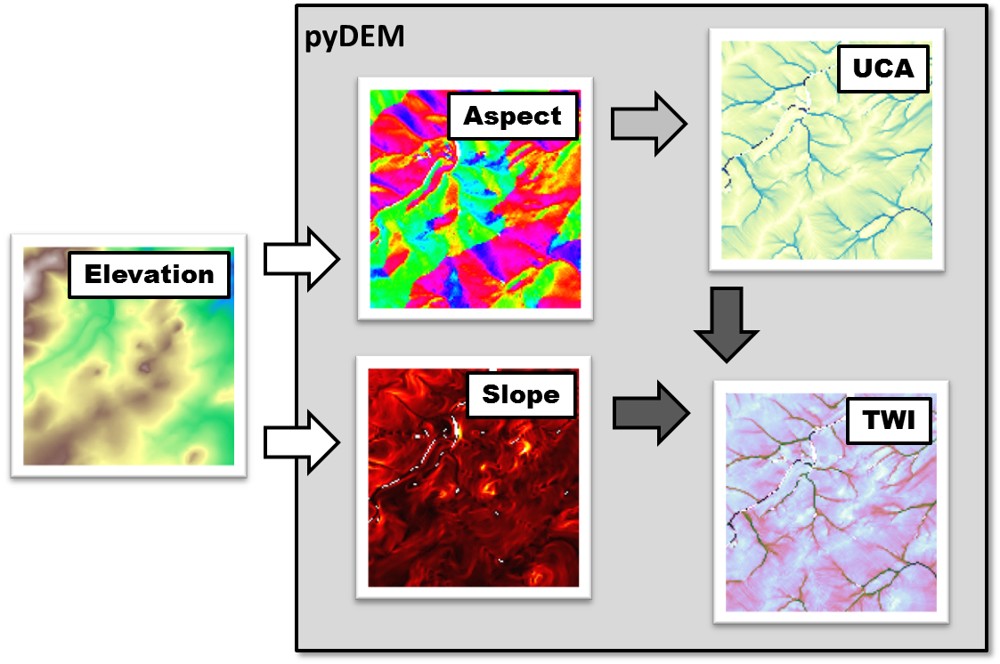
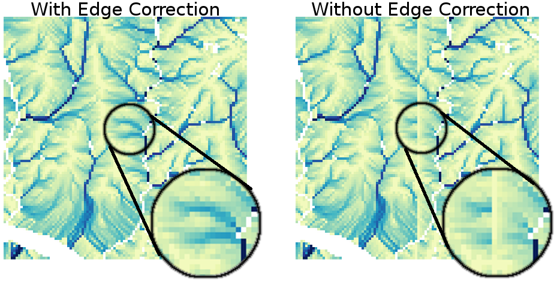
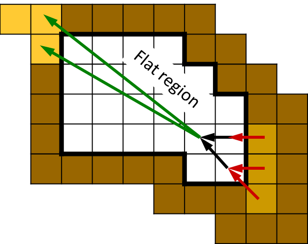
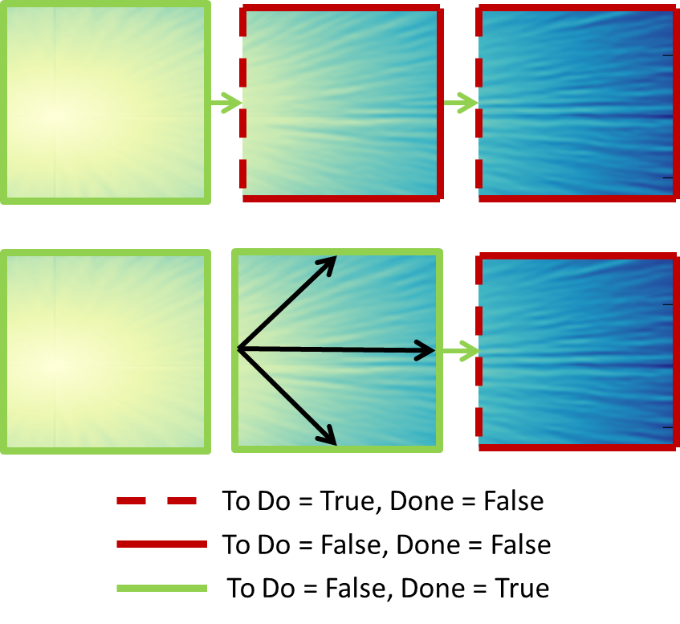
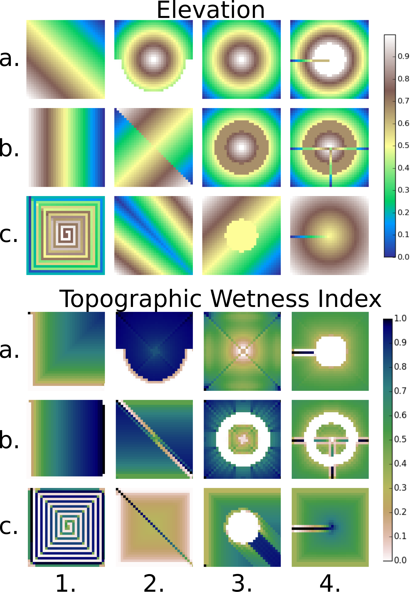
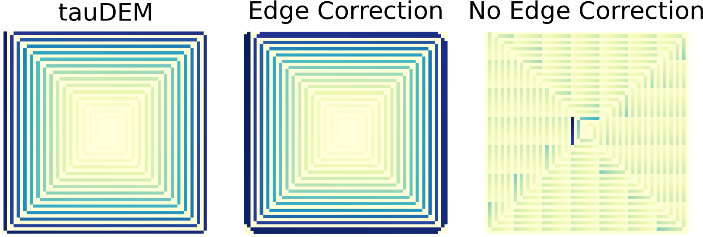
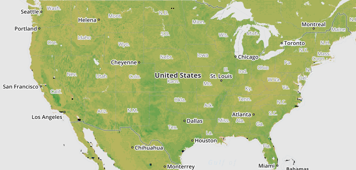

:author: Mattheus P. Ueckermann
:email: mpu@creare.com
:institution: Creare

:author: Robert Chambers
:email: rxc@creare.com
:institution: Creare

:author: Jerry Bieszczad
:email: jyb@creare.com
:institution: Creare

:author: Chip Audette 
:email: wea@creare.com
:institution: Creare

------------------------------------------------
pyDEM: Global Digital Elevation Model Analysis
------------------------------------------------

.. class:: abstract

   Hydrological terrain analysis is important for applications such as environmental
   resource, agriculture, and flood risk management. 
   A major challenge in hydrological terrain analysis is accurately calculating
   the upstream contributing area, which has cross-tile dependencies. The
   global dataset is too large to hold in memory, and we are not aware of existing 
   tools that can accurately and efficiently perform this analysis in parallel. 
   We solved this problem by implementing a new algorithm in python, which uses a 
   simple but robust file-based locking mechanism to coordinate the work flow
   between an arbitrary number of independent processes. We used this system to
   analyze the conterminous US's terrain at 30m resolution in under 3 days on a 
   single compute node. 
   
   Our solution is implemented in pyDEM, an open source Python/Cython library for 
   world-wide geospatial terrain analysis. We will describe our algorithm for 
   calculating upstream contributing area, our file-based locking mechanism
   to coordinate the work between processors, and optimization using cython. We
   will demonstrate pyDEM on a few example test cases, as well as real data.

.. class:: keywords

   digital elevation model, upstream contributing area, topographic wetness index,
   hydrology, terrain analysis
   
-------------

Introduction
-------------

The aspect (or flow direction), magnitude of the slope, upstream contributing area (UCA), and topographic wetness index (TWI), shown in Figure :ref:`info`, are quantities needed in hydrology. These quantities are used to determine, for example, the flow path of water, sediment, and pollutants which has applications in environmental resource, agricultural, and flood risk management. These quantities are calculated from gridded digital elevation models (DEM), which describe the topography of a region. DEMs are often stored as raster arrays, where the value of an element in the array gives the elevation of that point (usually in meters). Each element in the array is also associated with a (latitude, longitude) coordinate. The aspect is calculated from DEM data and gives the angle (in radians) at each element. The slope (meters / meters) can also be calculated, and gives the change in elevation over the change in horizontal distance, quantifying the steepness of the topography. UCA is defined as the total horizontal area that is up-slope of a point or contour [moore91]_, and unlike aspect and slope, the UCA at each element depends on more than just the surrounding elements in the array. TWI (:math:`\kappa`) is derived from UCA (:math:`a`) and slope (:math:`\tan \beta`), where :math:`\kappa=\ln \frac{a}{tan \beta}`, and was developed by Beven and Kirkby [beven79]_ within the runoff model TOPMODEL (see [beven95]_ ). 

   pyDEM calculates the aspect, slope, upstream contributing area (UCA), and topographic wetness index (TWI) from digital elevation model data. The aspect and slope are calculated directly from the elevation data, the UCA is calculated from the aspect, and the TWI is calculated from the UCA and the slope. :label:`info`

With the increased availability of large, high quality DEM data, the hydrology of increasingly large regions can be analyzed. For example, in the US, the National Elevation Dataset provides nominally 30m :math:`\times` 30m resolution DEM data for the conterminous US. This data is available as over 3500 files spanning :math:`1^o\times1^o` latitude :math:`\times` longitude with over 3600 :math:`\times` 3600 pixels per file for 45 gigapixels of data. Analyzing such a large data-sets presents unique challenges including:

* Robustly dealing with no-data and flat regions
* Efficiently calculating the required quantities
* Dealing with edge effects (see Figure :ref:`edges`).

DEM data often contain no-data values where the elevation could not be determined because of noise in the raw data or other effects. DEM data can also contain regions where the elevation appears to be flat, that is, there is no change in elevation from one pixel to the next. In that case, the aspect is not defined, and the slope is zero, which leads to an undefined TWI. These situations need to be dealt with robustly in order to successfully and automatically process large data-sets. The size of these data-sets can also make analysis intractable because of limited computational resources and slow algorithms. Finally, the discrete nature of the tiles can result in edge effects. Figure :ref:`edges` (right) shows an example of UCA calculated without edge correction, which would be normal without special effort. 

pyDEM was developed to address these challenges. pyDEM is an open source Python/Cython library that has been used to calculate TWI for the conterminuous US at 30m resolution, and the globe at 90m resolution. In the following sections we will describe our new algorithm for calculating UCA, our file-based locking mechanism to coordinate work between processors, and optimization using cython. Then we will demonstrate pyDEM on a few test cases, and some real data. 

   pyDEM can correctly follows the UCA calculation across tile boundaries. :label:`edges`

-----------------
   
Algorithm Design
-----------------

To calculate the aspect and slope, pyDEM uses the :math:`\mathrm{D}\infty` method [tarboton97]_. This method calculates the aspect and slope based on an 8-point stencil around a pixel. The UCA is calculated from the aspect, and it requires more than just an 8-point stencil around a pixel. In Tarboton 1997, a recursive algorithm to calculate the UCA is also presented, but we developed a new algorithm that handles no-data and flat areas differently, while also allowing area updates based on new information at edges of the tile. The recursive algorithm [tarboton97]_ starts at down-slope pixels and recursively calculates its up-slope area. Our algorithm follows the opposite strategy, and starts at up-slope pixels, then progressively calculates the area of down-slope pixels. Next, we will describe the main data-structure used for our approach, then present pseudo-code for the basic algorithm, describe modifications needed to update edges, and explain modifications to deal with flats. 

.. figure:: pydem_ucaalgo.png
   :align: center
   :scale: 50%
   
   The UCA calculation takes a raster of elevation data (top) and constructs an adjacency (or connectivity) matrix. :label:`uca`   

**Data Structures:** The main data-structure used by the UCA algorithm is an adjacency (or connectivity) matrix, :math:`\mathbf A`. For the example in Figure :ref:`uca` (top), we have a :math:`3\times3` elevation array with a total of 9 pixels. Each row in matrix :math:`\mathbf A` (Figure :ref:`uca`, bottom) represents a pixel in the raster array that receives an area contribution from another pixel. The columns represents the pixels that drain into a pixel represented as a row. The value in row :math:`i` column :math:`j` represent the fraction of pixel :math:`j`'s area that drains into pixel :math:`i`. For example, pixel 6 drains completely into pixel 7, so :math:`\mathbf A_{7, 6} = 1.0`. On the other hand, only 30% of the area in pixel 0 drains into pixel 3, so :math:`\mathbf A_{3, 0} = 0.3`.

The algorithm also requires a data structure: `ac_pix` to keep track of the "active pixels" which can be computed, `ac_pix\_old` to record which pixels were computed last round, `done` to mark which pixels have finished their computations, and `uca` the UCA for each pixel. The `ac_pix` vector is initialized by summing over the columns of :math:`\mathbf A` to select pixels that do not receive an area contribution from another pixel. This would happen for pixels at the top of mountains or hills, where the surrounding elevation is lower, and on pixels on the edges of tiles that do not receive contributions from the interior. The indices `ac_pix` of these pixels are stored in a boolean array. 

**Algorithm:** The pseudo-code for our algorithm is given below using Python syntax. Lines 1-5 initialize the working data-structures, and assumes that the adjacency matrix was constructed and `elevation_data` is an array with the shape of the raster DEM data. The UCA should be initialized with the geographic area of a tile, but for simplicity consider :math:`1m\times1m` pixels. The calculation is iterative and the exit condition on line 7 ensures that the loop will terminate, even if there are circular dependencies. Circular dependencies should not occur for usual DEM data, but for robustness (in the face of randomly distributed no-data values) this exit condition was chosen. 

If a pixel is marked as active, its area will be distributed down-slope, executing lines 15-25. The column of the active pixel is looped over, and the fraction of the area in each row is distributed to the pixel in that row of the adjacency matrix. For example, in Figure :ref:`uca`, pixel 0 will be marked as active in the first loop (sum of elements in the row is zero). Line 17 will then update `uca[3]` and `uca[4]` with `f=0.3` and `0.7` times the area in pixel 0, respectively.  

Next, lines 21-25 will check to see if the pixel just drained into is ready to become active. A pixel is allowed to become active once it has received all of its upstream area contributions. This condition for becoming active is crucial for prevent double-accounting. Continuing the example, once `uca[3]` was updated with the contribution from pixel 0, we will loop through the entries of :math:`\mathbf A` in row 3. If the entry is non-zero and not marked as done, we know that pixel 3 will receive a contribution from an upstream pixel in a later round. In our example, pixel 0 is the only upstream pixel for pixel 3, and it is done. So, in the next round we can drain from pixel 3.

.. code-block:: python
   :linenos:
   
   # Initialize
   ac_pix = A.sum(1) == 0
   ac_pix_old = zeros_like(ac_pix)
   done = zeros_like(ac_pix)
   uca = ones(elevation_data.shape)  # Approximately

   while all(ac_pix != ac_pix_old):
        done[ac_pix] = True
        ac_pix_old = ac_pix
        ac_pix[:] = False

        for i in range(ac_pix.size):
            if ac_pix[i] is False:
                continue  # to next i. Otherwise...
            for j, f in enumerate(A[:, i]):
                # update area
                uca[j] += uca[i] * f

                # Determine if pixel is done
                for k, f2 in enumerate(A[j, :]):
                    if not done[k] and f2:
                        break
                else:
                    # Drain this pixel next round
                    ac_pix[j] = 1  

**Modification for Edges Update:** A fortunate aspect of the UCA calculation is its linearity, which lends itself well to the principle of superposition. That is, the UCA within a tile can be calculated and later adjusted with new contributions from the edges. In our Figure :ref:`uca` example, we have a single DEM tile, but this tile might be one of many tiles. Considering only this one tile,  we can calculate pixel 0's area contribution to the other pixels within a tile, but we do not know if pixel 0 is on a ridge, or if there is another pixel that would drain into it from another tile in the data-set. Similarly, pixel 8 might need to drain its area downstream to pixels in a downstream tile in the data-set. Ultimately, there will be a tile that has the most up-slope pixel, which has no edge dependencies. Similarly, not every pixel within a tile's UCA depends on the edge. Consider Figure :ref:`edges`: which shows that the difference in UCA between the tiles does not extend far past the edge, which indicates that the UCA calculation is relatively local. This means that the edge update can be efficient: we only have to update pixels near the edges, and rivers. Since rivers have a proportionally much smaller area, the edge update requires much fewer computations compared to the initial UCA calculation for a tile. 

Our strategy of starting at the up-slope pixels and contributing area to down-slope pixels is a key algorithmic choice to allow for the edge correction. Edge pixels that receive area contributions from neighboring tiles always need to distribute that area down-slope. It may be possible for every interior pixel to calculate and store its edge dependencies using the recursive strategy that starts at down-slope pixels, but in the worst case, each of these pixels will need to store its dependency on every edge pixel. This results in a large storage structure, or a complex one that compresses the information. Alternatively, every pixel will need to be re-calculated for every edge correction. With our strategy of starting with up-slope pixels, only the interior pixels that are affected by information from the edge needs to be recalculated. 

To handle edges, the major modifications to the basic algorithm are: initializing the active pixels (`ac_pix`) based on edge information/dependencies, initializing the `done` pixels, and adding data-structures to keep track of edge dependencies. The main challenge is careful bookkeeping to ensure that edge information is communicated to neighboring tiles. pyDEM does this bookkeeping both within a tile, which can be broken up into multiple chunks, and across tiles, which is described in greater detail under the *Parallel Processing* section.

**Modification for Flats:** pyDEM considers no-data regions to also be flats. To handle flats, a small adjustment is made to the adjacency matrix. Without modification, the adjacency matrix will allow pixels next to flats to drain their area contributions into the flat, but these contributions never leave. The adjacency matrix is adjusted by adding the black and green arrows depicted in Figure :ref:`flats`. The total area contributes that drain into a flat are collected, for convenience, at a random point within the flat (black arrows). This total area contribution to the flat is then proportionally distributed to pixels at the edge of a flat. The proportions depend on the difference in elevation of the pixels around the flat. The pixel with the lowest elevation around the flat always receives a distribution. If a pixel's elevation satisfies :math:`e_{local} < \min(\vec e_{local}) + \sqrt(2) \Delta x`, where :math:`e_{local}` the pixel's elevation, :math:`\vec e_{local}` is the elevations of the pixels around the flat and :math:`\Delta x` is the approximate grid spacing, then it is also included in the area distribution. The proportion of the distribution is calculated as :math:`p = \frac{e_{flat} - \vec e_{local}} {\sum e_{flat} - \vec e_{local}}`, where :math:`e_{flat}` is the elevation of the flat, .

   To correctly calculate drainage over flat or no-data regions, the total area that drains into the flat (bottom red arrows) are collected at a single point within the flat (black arrows) and then redistributed to lower-lying regions (top green arrows). :label:`flats`   

--------------------

Parallel Processing
--------------------
The majority of the processing on a tile can be done independent of every other tile. This means it is simple to spawn multiple processes on a machine to churn through a large number of elevation tiles. There are various packages that automate this process. However, in our case, the edge correction step cannot be done efficiently on a tile-by-tile basis, so existing packages did not meet our needs. 

The calculation proceeds in three stages. In the first stage, the tile-local quantities, aspect and slope, are calculated in parallel. Then the first pass UCA calculation is performed in parallel, where the initial edge data is written to files. Finally, the UCA is corrected in parallel to eliminate edge effects. This final stage does have an order-dependency, and the parallelism is not as efficient. In each of these stages, separate pyDEM processes can be launched. If a process terminates unexpectedly, it does not affect the remaining processes. 

In order to prevent multiple processes from working on the same file, a simple file locking mechanism is used. When a process claims a DEM tile, it creates an empty .lck file with the same name as the elevation file. Subsequent processes will then skip over this file and sequentially process the next available DEM tile. Once a process is finished with a DEM tile, the .lck file is removed. Subsequent processes also check to see if the outputs are already present, in which case it will also skip that DEM tile, moving on to the next available file. This works well for the first two stages of the processing. 

In the second and third stages, to communicate edge information, the following three files is saved for every edge of a tile after calculating the UCA:

1. the current UCA value at each pixel on the edge,
2. whether the UCA calculation on the edge pixel is *done*, and does not still depend on information from neighboring tiles,
3. whether the edge needs to receive information from neighboring tiles and has not yet received it. 

   To correct edges across DEM tiles, the edge information is communicated to neighboring tiles, which can then update UCA internally to its edges and communicate that information to the next tile. :label:`pedges`

The first two quantities are populated by neighboring tiles, while the last quantity is self-calculated by a tile. That is, after calculating the UCA, a tile will set the pixel value and whether an edge is *done* on its neighbors, and update whether an edge needs information on it's own edge data file. To explain why this is needed, the second and third quantities are illustrated in Figure :ref:`pedges`. The first row represents three DEM tiles with edges in the state after the second calculation stage. The left tile is at the top of a hill, and all of its edges contribute area downstream. This tile does not expect any information to enter from adjacent tiles, so it sets the "to do" value (third quantity) on its edges as False. The left tile also communicates to the middle tile that this edge is "done" and can be calculated next round. Still on the top row, the middle tile determines that area will enter from the left edge, and sets the "to do" value on its left edge as True. Following this dependency along, it calculates that none of its other edges are done, and communicates this to the tile on the right. The second row in Figure :ref:`pedges` shows what happens during the first round of stage 3. In the first round, the middle tile is selected and the UCA is updated. Since it received finished edge data from the left tile, it now marks the left edge's "to do" status as False, and propagates the updated area through the tile. It communicates this information to the right tile, which will be updated in subsequent rounds in the stage 3 calculation. Note that the calculation on the right tile could not proceed until the left tile was calculated, which means that this computation had to be performed serially and could not be paralellized. 

In the example illustrated in Figure :ref:`pedges`, the middle tile only needed one correction. However, in general a tile may required multiple corrections. This can happen when a river meanders between two tiles, crossing the tile edge multiple times. In this case, the two adjacent tiles will be updated sequentially and multiple times to fully correct the UCA. This situation is specifically tested in the bottom left (c-1) test-case in Figure :ref:`tests`. There the water flow path spirals across multiple tiles multiple times. At each crossing, the UCA needs to be corrected. 

During each round of the second stage, we heuristically select the *best* tile to correct first. This *best* tile is selected by looking at what percentage of edge pixels on that tile will be done after the correction. In the case of ties, the tile with the higher maximum elevation is used. In case another process is already using that tile, the next best tile is selected. As such, the calculation proceeds in a semi-parallel fashion for large data-sets. 

-------------

Optimization
-------------
The first implementation of the UCA algorithm was much more vectorized than the code presented above. This pure-python vectorized version aimed to take advantage of the underlying libraries used by numpy and scipy. However, this earlier version of the algorithm was not efficient enough to analyze a large data-set using a single compute node. The analysis would have taken over a year using 32 processors.

Initial attempts to re-write the algorithm in cython were not fruitful, only yielding minor speed improvements. The primary issue causing the poor performance was the adjacency matrix :math:`\mathbf A`. This matrix was stored as a sparse array, because it had very few entries. The initial python and cython implementations used scipy's underlying sparse matrix implementation, along with linear algebra operations to perform the calculations. These implementations failed to use the underlying sparse matrix storage structure to their advantage. 

Instead, the adjacency matrix was stored in both the Compressed Sparse Column (CSC) and Compressed Sparse Row (CSR) formats. The CSC format stores three arrays: `data`, `row_ind`, and `col_ptr`. The `data` stores the actual floating point values of the elements in the array, while the `row_ind` stores the row number of the data in each column (same size as data), and `col_ptr` stores the locations in the data vector that start a new column (size is 1 + the number of columns, where the last entry in col_ptr is the total number of data elements). For example, the :math:`\mathbf A` in Figure :ref:`uca` is stored in CSC as:
 
.. math::
   :type: align
   
   data &= [0.3,  0.7,  1.0 ,  1.0 ,  1.0 ,  0.4,  0.6,  1.0 ,  1.0 ,  1.0]  \\
   row\_ind &= [3,\;\;\;\, 4,\;\;\;\, 4,\;\;\;\, 5,\;\;\;\, 4,\;\;\;\, 5,\;\;\;\, 8,\;\;\;\, 8,\;\;\;\, 7,\;\;\;\, 8] \\
   col\_ptr &= [0,\, 2,\, 3,\, 4,\, 5,\, 7,\, 8,\, 9,\, 10,\, 10]

The CSR format, which stores col_ind, row_ptr, and a re-arranged data vector instead, is more computationally efficient for some aspects of the algorithm, which is why both formats are used. 

In particular, looping over the rows for a specific column in :math:`\mathbf A` to update the UCA (lines 15-17 of algorithm) can be efficiently done using the CSC format. Determining if a pixel is done, which loops over the columns for a specific row in :math:`\mathbf A` (lines 19-25) can be efficiently done using the CSR format. 

Nested `for` loops in python are generally known to be inefficient and was not implemented. The cython implementation yielded excellent results, giving approximately a :math:`3 \times` speed-up for smaller problems, and a :math:`1000 \times` speedup for larger problems. These numbers are approximate because the actual values are highly dependent on the DEM data. 

-------------

Applications
-------------

   
   To verify that pyDEM's core algorithms work as expected, a collected of test elevations (top) were created to cover anticipated issues in calculating TWI (bottom). This shows that TWI is correctly calculated. In particular, TWI is larger where the elevation is lower (as expected), it is evenly distributed around flats (2nd and 3rd rows, 3rd column), and it is concentrated in rivers or outlets (4th column). :label:`tests`

   
   UCA for the spiral test case calculated over a single tile (left), multiple tiles with edge correction (middle) and multiple tiles without edge correction (right) :label:`spiral`
  

To verify that pyDEM's core algorithms work as expected, a collection of test cases were created, and a subset is shown in Figure :ref:`tests`. pyDEM was also used to calculate TWI for the conterminous US. Next we will describe the purpose and results of the each of the test cases, and then we will present the results over the conterminous US. 

To ensure that the [tarboton97]_ :math:`D\infty` method was correctly implemented, we created a number of linearly sloping elevations to test each quadrant of the 8-element stencil used for the slope and magnitude calculation (Figure :ref:`tests` a-1, b-1, b-2). All of the possible angles are tested in the a-3 case. Notice that the TWI is higher along the diagonals of this case, and this is an artifact of the :math:`D\infty` method which is expected to be small for real DEM data. The c-2 case is a trough that tests to make sure that water will drain along the diagonal, which would not happen if a central difference method was used instead of the :math:`D\infty` method.  The a-2 case tests if pyDEM correctly handles no-data values along the edge of a tile. Cases b-3, c-3, and those in column 4 all test pyDEM's handling of flat regions. In case b-3, notice that pyDEM correctly distributes the area that drains into the top of the flat to the pixels at the edge of the flat instead of draining all of the area to a single pixel, or a few pixels. However, when a pixel that has a much lower elevation is present at the edge of a flat (a-4 and b-4), pyDEM drains preferably along those pixels. 
  

The c-1 case was used to test the third stage of processing, the edge correction stage. This is a challenging case because the drainage pattern is a spiral that crosses a single tile boundary multiple times. Without the edge correction, the UCA builds up in channels along a tile, but never reach the full value required (see Figure :ref:`spiral` right). Figure :ref:`spiral` also shows that pyDEM's edge correction algorithms are working correctly. The left UCA calculation is performed on a single tile using tauDEM, and it does not need edge corrections from adjoining tiles. The middle UCA calculation is performed using pyDEM over chunks of elevation sections forming a 7 by 7 grid. For this middle calculation, 316 rounds of the stage 3 edge correction was performed in serial, which means that every tile required multiple corrections as new information became available on the edges. Except for the edge pixels, the tauDEM and pyDEM results agree to withing 0.02%, which is reasonable considering how different the algorithms are. 

pyDEM was also verified against tauDEM using the all of the above test cases (not shown). In all cases without flats the results agreed as well as the spiral case. For the cases with flats, tauDEM and pyDEM do not agree because they treat flat regions differently. 

Finally, to verify that pyDEM is efficient, robust, and accurate for real data-sets, we calculated TWI over the conterminous US (Figure :ref:`conus`). In the figure, the spurious black areas are due to the interpolation of no data-values of our geoTiff viewer. The full calculation took approximately 3 days on a 32 CPU AWS compute node. Figure :ref:`edges` (left) shows the UCA for a small region in Austin TX from this calculation.
  

   
   To verify pyDEM's performance over a large dataset, TWI was calculated for the 30m resolution US National Elevation Database. :label:`conus`

--------   
   
Summary
--------
To solve our problem of analyzing the hydrology of large DEM data-sets, we designed, implemented, optimized, parallelized, and tested a new python package, pyDEM. pyDEM implements the :math:`D\infty` method [tarboton97]_ to calculate the aspect and slope, and it uses a novel algorithm to calculate the upstream contributing area. 

pyDEM is capable of efficiently and robustly analyzing large data-sets, while correcting for edge effects. pyDEM has been tested and agrees well with tauDEM. 

-------------

Availability
-------------
The pyDEM package is available from the `python package index <https://pypi.python.org/>`_ or through `pip install pydem`. Note this package is still in alpha and has not been tested on a wide range of operating systems. The source code is also hosted on `GitHub <https://github.com/creare-com/pydem>`_, and is free to modify, change, and improve under the Apache 2.0 license. 

-----------

References
-----------
.. [beven79] Beven, K.J.; Kirkby, M. J.; Seibert, J. (1979). "A physically based, variable contributing area model of basin hydrology". Hydrolological Science Bulletin 24: 43–69

.. [beven95] Beven, K., Lamb, R., Quinn, P., Romanowicz, R., Freer, J., & Singh, V. P. (1995). Topmodel. Computer models of watershed hydrology., 627-668.                

.. [moore91] Moore, I. D., Grayson, R. B., & Ladson, A. R. (1991). Digital terrain modelling: a review of hydrological, geomorphological, and biological applications. Hydrological processes, 5(1), 3-30.

.. [tarboton97] Tarboton, D. G. (1997). A new method for the determination of flow 
                directions and upslope areas in grid digital elevation models. 
                Water Resources Research, 33(2), 309-319.

