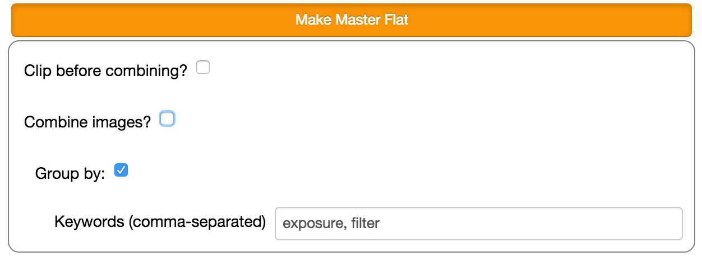
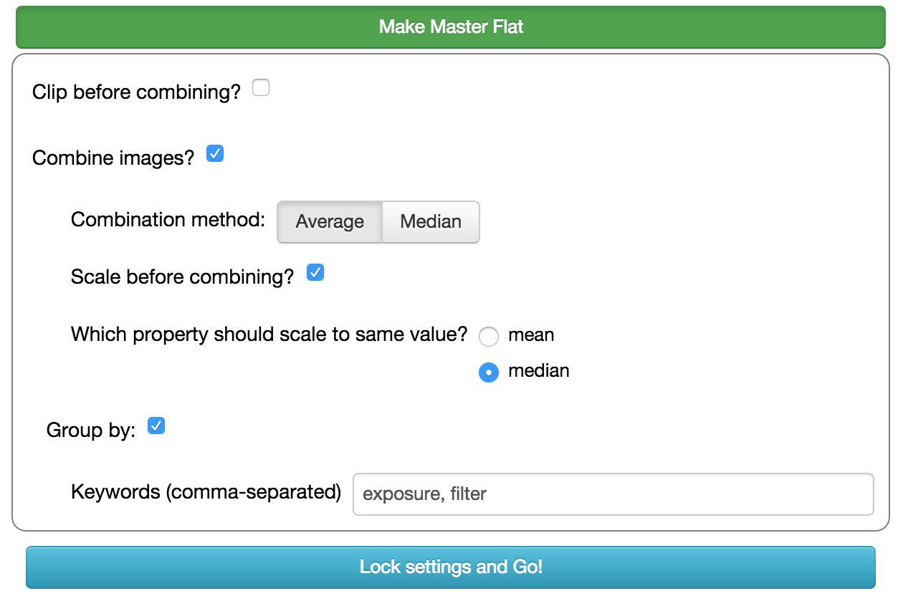
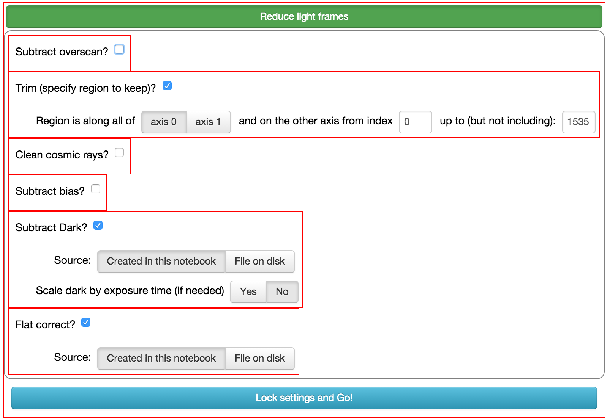
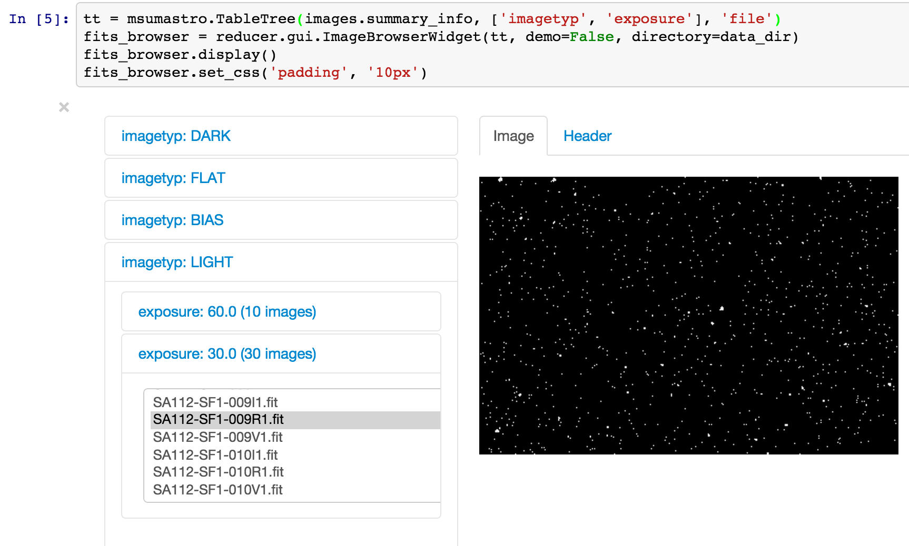
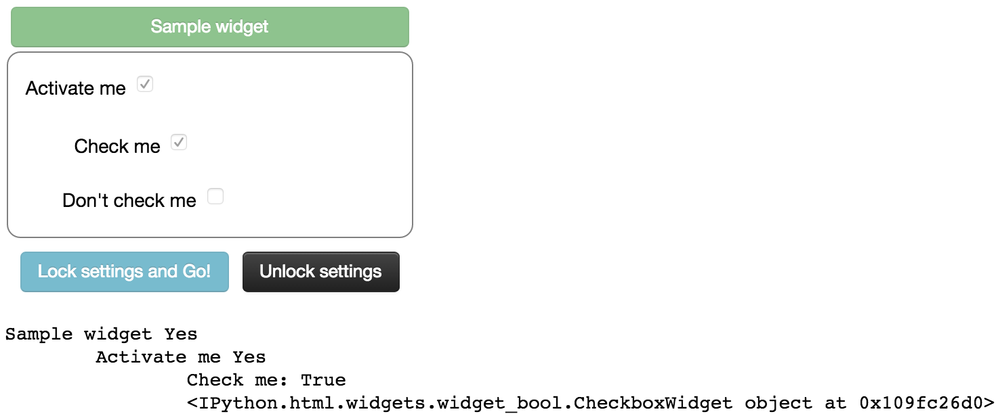

:author: Matthew Craig
:email: mcraig@mnstate.edu
:institution: Department of Physics and Astronomy, Minnesota State University Moorhead

--------------------------------------------------------------------------
Widgets and Astropy: Accomplishing Productive Research with Undergraduates
--------------------------------------------------------------------------

.. class:: abstract

    This paper describes a tool for astronomical research implemented as an
    IPython notebook with a widget interface. The notebook uses Astropy, a
    community-developed package of fundamental tools for astronomy, and
    Astropy affiliated packages, as the back end. The widget interface makes
    Astropy a much more useful tool to undergraduates or other non-experts
    doing research in astronomy, filling a niche for software that connects
    beginners to research-grade code.

.. class:: keywords

   astronomy

Introduction
------------

Incoming students interested in majoring in Physics at Minnesota State
University Moorhead are often interested in doing astronomical research. The
department encourages students to become involved in research as early as
possible to foster their interest in science and because research
experiences are correlated with successful completion of a degree
[Lopatto2004]_.

The students typically have no programming experience, but even the smallest
project requires calibrating and taking measurements from a couple of hundred
images. To the extent possible, analysis needs to be automated. Roughly half
of the students use Windows, the rest Mac OSX.

The problem, described in more detail below, is that the GUI-based software
most accessible to these students is expensive, often available only on
Windows, not clearly documented and does not leave a record of the choices
made in calibrating the images so that future researchers can use the images
with confidence. The free options largely require programming.

The proposed solution is a widget-based IPython notebook [Pérez2007]_ for
calibrating astronomical images, called ``reducer``. A widget-based interface
was chosen because students at this level are more comfortable with a GUI than
with programming. An IPython notebook was chosen because of its rich display
format, the ability to save both code and text, and the persistence of output
in the notebook, which provides a record of the work done.

The back end of ``reducer`` is built on the Astropy project [Astropy2013]_, a
community-driven effort to develop high-quality, open source tools for Python
in astronomy, and on Astropy affiliated projects. [#]_ Astropy was chosen because it has a large developer community of professional astronomers.

Section *Background: Image analysis in optical stellar astronomy* provides
background on the science of image calibration. In the following section the
problem is discussed more completely, including a review of some of the
available options for astronomical image processing. The section *``reducer
package and notebook* discusses the use of ``reducer``, while *``reducer``
widget structure* presents its implementation. The widget classes in
``reducer`` are potentially useful in other applications.

.. [#] http://www.astropy.org/affiliated/

Background: Image analysis in optical stellar astronomy
-------------------------------------------------------

While a detailed description of astronomical data analysis is beyond the scope
of this paper, some appreciation of the steps involved is useful for
understanding its motivation.

An image from a CCD camera on a telescope is simply an array of pixel values.
Several sources contribute to the brightness of an individual pixel in a raw
image:

+ Light from stars and other astronomical objects.
+ Light from the nighttime sky; even a “dark” sky is not perfectly black.
+ Noise that is related to the temperature of the camera and to the
  electronics that transfer the image from the detector chip in the camera
  to a computer.
+ A DC offset to prevent negative pixel values.

The first stage of calibration is to remove the noise and offset from each
image. The second stage is to correct for imperfections in the optical system
that affect how much light gets to each pixel in the camera. An example of
this sort of imperfection is dust on the camera itself.

A series of images is taken and then combined to perform each type of
calibration. *Bias* images correct for the DC offset, *dark* images correct
for thermal noise and *flats* correct for non-uniform illumination. One
combines several frames of each type to reduce the electronic read noise
present in the calibration images.

After calibration, the brightness of a pixel in the image is directly
proportional to the amount of light that arrived at that pixel through the
telescope. Note that light includes both starlight and light from the
atmosphere.

Extraction of the brightness of individual stars is called photometry. There
are several techniques for performing photometry, all of which estimate and
eliminate the sky background.

The problem
-----------

Several software packages can calibrate astronomical images and perform
photometry, so why write another one?

Ideally, such software would:

1. Be easily usable by an undergraduate with limited or no programming
   experience.
2. Work on Windows and Mac.
3. Have its operation well tested in published articles and/or be open
   source so that the details of its implementation can be examined.
4. Leave behind a record of the settings used by the software in
   calibrating the images and measuring star brightness.
5. Be maintained by a large, thriving community of developers.

Commercial software, like *MaxIm DL* [#]_, typically meets the first criteria.
Past MSUM students were able to learn the software quickly. However, it leaves
behind almost no record of how calibration was done: a fully calibrated image
has one keyword added to its metadata: ``CALSTAT='BDF'``. While this does
indicate which corrections have been made [#]_, it omits important information
like whether cosmic rays were removed from the calibration images and how the
individual calibration images were combined.

The most extensively-tested and widely-used professional-grade package for
calibration and photometry is IRAF [IRAF1993]_. IRAF is both a scripting
language and a set of pre-defined scripts for carrying out common operations.
It is certainly widely used, with approximately 450 citations of the paper,
and, because IRAF scripts store settings in text files, there is a record of
what was done.

However, there are several challenges to using IRAF. It is easiest to install
in Linux, though distributions exist for Mac and it is possible to use on
Windows with Cygwin [#]_. The IRAF command language (CL) is difficult to
learn; undergraduates who have worked with it in summer REU programs report
spending 3-4 weeks learning IRAF. That makes it infeasible to use as part of a
one-semester research project. It is also no longer maintained [#]_.

One option that comes close to meeting all of the criteria is AstroImageJ
[#]_, a set of astronomy plug-ins for the Java-based ImageJ [ImageJ2012]_. It
has a nice graphical interface that students in both an introductory astronomy
course for non-majors and an upper-level course for majors found easy to use,
is open source,  free, and available on all platforms.  It has a rich set of
features, including both image calibrating and aperture photometry, and very
flexible configuration. Its two weaknesses are that it leaves an incomplete
record of the settings used in calibrating data and measuring brightness and
it does not have an extensive support community.

.. [#] http://www.cyanogen.com/
.. [#] The bias offset and dark current were subtracted and the result
       divided by a flat frame to correct for non-uniform illumination.
.. [#] http://www.cygwin.com/
.. [#] The last update was in 2012 according to the IRAF web site,
       http://iraf.noao.edu
.. [#] http://www.astro.louisville.edu/software/astroimagej/

The solution, broadly
---------------------

Two relatively recent developments suggest the broad outlines of a solution that is sustainable in the long run:

+ Initiation of the Astropy project in 2011, which unified what had previously
  been several independent effort to develop python software for astronomy. In
  addition to developing the core Astropy package, the Astropy organization
  gives affiliate status to packages that request it and meet its documentation,
  testing and coding standards [#]_
+ Addition of widgets to IPython notebooks in IPython, version 2. From the
  developer perspective, widgets are helpful because the Python API for widgets
  is rich enough to allow construction of complicated interfaces. There is no need
  to learn JavaScript to use the widgets effectively.

It is the combination of high-quality python packages for both the back-end
and front-end that made development of ``reducer`` relatively straightforward.

A notebook-based solution offers a couple of other advantages over even the
strongest of the GUI tools discussed in the previous section. The first is
that exposure to programming broadly is useful to both the few students who
become professional astronomers and the ones who do not. Though no programming
is required to use ``reducer``, there is code in several of the notebook
cells. It represents something intermediate between a fully GUI application
and script-only interface. Another is that exposure to Python programming is
useful to both students who work immediately after graduation and those who go
on to become scientists.

.. [#] See http://www.astropy.org/affiliated for a list of affiliated packages
       and criteria.

The ``reducer`` package and notebook
------------------------------------

``reducer`` is a pure Python package available on PyPI and as a conda  package
[#]_. The user-facing part of the package is a single script, also called
``reducer``. When invoked, it creates an IPython notebook,
called ``reduction.ipynb``, in the directory in which it is invoked.

The notebook will not overwrite images. The intent is that the raw,
uncalibrated images are stored in a  directory separate than the one
containing the notebook. The calibrated images are saved, by default, in the
same directory as the notebook, leaving a *human-readable* record with the
images describing the choices made in calibration.

The notebook also does not provide an easy way to re- run the calibration
short of deleting any calibrated files in the directory with the notebook and
starting fresh. In discussions with students while developing ``reducer`` it
became clear that it would be difficult or  impossible to ensure that the
state of the notebook reflected the state of the calibrated files, since it is
possible for some notebook cells to be re-executed without all cells being re-
executed.

That design decision simplified the package, allowed the notebook to refuse to
overwrite files in the directory in which it is stored, and led to a focus on
making sure a human could read the record of what was done. The package itself
makes it easy to re-run the calibration with different settings should a later
researcher choose to do so.

.. [#] Use channel ``mwcraig`` to get the conda package.

Image calibration
+++++++++++++++++

All of the calibration steps in reducer are performed by ``ccdproc``, an
Astropy affiliated package for astronomical image reduction [ccdproc]_. Some
of the  ``reducer`` widgets contain some logic for automatically grouping and
selecting images based on metadata in the image headers, described in more
detail below.

This section begins with examples of the individual widgets that appear and
the notebook, followed by an outline of the structure of the notebook as a
whole.

Most of the widgets in ``reduction.ipynb`` are geared towards image
calibration. There are two broad types, one for applying calibrations to a set
of images, the other for combining calibration images.

Each widget has four states:

+ Unselected; the widget is a simple button.
+ Activated, but with incorrect or incomplete settings, shown in Fig.
  :ref:`reducer-combiner-before-correct-setting` for a ``CombinerWidget``.
+ Activated and ready for action, with settings that enable the action to be
  completed, shown in Fig. :ref:`reducer-combiner-after-correct-setting`.
+ Locked, after execution of calibration step in the widget, shown in
  Fig. :ref:`reducer-combiner-after-running`. *Note that the IPython notebook
  does not store the widget state in the notebook.* [#]_ When a ``reducer``
  notebook is re-opened the only record guaranteed to be preserved is the
  printed text below the widget.

    Example widget for combining images before settings have been set in a
    self-consistent way. Compare to
    Fig. :ref:`reducer-combiner-after-correct-setting`
    :label:`reducer-combiner-before-correct-setting`

    Same widget as Fig. :ref:`reducer-combiner-before-correct-setting` after
    consistent settings have been chosen. Note that the style of the top
    button changes and a "Go" button appears when settings are sensible; in
    this case the user needs to at least select a combination method. The
    additional options under "Combine images" are presented when the checkbox
    is selected. :label:`reducer-combiner-after-correct-setting`

.. figure:: reducer-combiner-after-running.png
    :figclass: htb

    Same widget as Fig. :ref:`reducer-combiner-after-correct-setting`, after
    executing the calibration step. Note that a record of the settings is
    printed into the notebook cell below the widget to ensure a record remains
    in the notebook after reopening it.
    :label:`reducer-combiner-after-running`

A few features of the ``CombinerWidget`` illustrate the logic used in
``reducer`` to semi-automatically select the images on which it should act. An
``apply_to`` argument to the initializer controls which calibrated images the
widget will act on; in this case its value is ``{'imagetyp': 'flat'}``, which
selects the calibration images used to correct non-uniform illumination. A
``group_by`` argument to the widget initializer controls controls how the
images selected by ``apply_to`` are combined. In the example shown, all images
with the same filter and exposure time will be combined by averaging, after
each image has been scaled to the same median value.

Each image, including the images used in the calibration itself, is processed
by a ``ReductionWidget``, like that shown in Fig. :ref:`light-settings`. That
examples is for a "light" image, an image that contains the objects of
interest. Each of the calibration images has some of these steps applied also,
though some of the calibration steps are not displayed for some of the
calibration images.

As with the ``CombinerWidget``, an ``apply_to`` argument to the widget
constructor determines which images are processed by the widget.

The calibration part of the notebook is composed of four pairs of widgets, one
pair for calibrating and combining bias images, and additional pairs for
darks, flats, and science images.  One of the strengths of widget-based
notebooks is that they are user- editable applications. If there is a
particular calibration step that is not needed, the cells that create those
widgets can simply be deleted.

    Widget that applies calibrations to a set of images. Display of some of the
    individual steps (e.g. subtracting bias) can be suppressed with optional
    arguments when the widget object is created. Red borders are drawn around each
    instance of the base widget class described in the section "``reducer`` widget
    structure".
    :label:`light-settings`

.. [#] In IPython 2.x it is impossible to easily save the widget state, and the
       widget is not part of the DOM, so it is not stored when the notebook is
       saved. In 3.x the widget is preserved, but saving the state takes
       additional developer work.

Image browser
-------------

Reducer also contains a basic image browser, which organizes the images based
on a table of metadata, and displays, when an image is selected, the image and
all of the metadata in that image in separate tabs in the widget. An example
is shown in Fig. :ref:`image-display-example`.

    The image display widget arranges images nested by image metadata values. In
    this case the two keywords used for grouping the images were ``imagetyp`` and
    ``exposure``. When an file name is selected, either the image or its metadata
    can be displayed.
    :label:`image-display-example`

``reducer`` widget structure
----------------------------

At the base of the reducer widget structure is an extension of a container
widget from IPython. This class, ``ToggleContainerWidget``, adds a toggle to
control display the contents of the container, and a list of child widgets
displayed in the container. [#]_  Since a ``ToggleContainerWidget`` can have
another ``ToggleContainerWidget`` as a child, this immediately provides an
interface for presenting a user with a nested list of options. Fig. `light-
settings` has a thin red border drawn around each element that is a subclass
of``ToggleContainerWidget``

In IPython 2 it is not possible to preserve the state of widgets between
sessions, and in IPython 3 it remains difficult, so the
``ToggleContainerWidget`` class defines a ``__str__`` method to facilitate
printing the contents of the widget. The purpose of this is not to provide a
way to progammatically rebuild the widget; it is to provide a human reader of
the notebook a history of what was done in the notebook.

The code below implements a basic ``ToggleContainerWidget`` called ``MyControl``. The widget it produces is shown in Fig. :ref:`toy-widget`.

.. code-block:: python

    from reducer.gui import ToggleContainerWidget
    from reducer.astro_gui import override_str_factory
    from IPython.html.widgets import CheckboxWidget

    class MyControl(ToggleContainerWidget):
        """
        Straightforward reducer-widget subclass.
        """
        def __init__(self, *arg, **kwd):
            super(MyControl, self).__init__(*arg, **kwd)

            # b_box is a plain IPython checkbox with a more
            # meaningful string representation.
            b_box = override_str_factory(\
                CheckboxWidget(description='Check me'))

            # Another plain check box, but with the default
            # string representation.
            c_box = CheckboxWidget(description="Don't check me")

            # These children are contained in the
            # MyControl widget
            self.add_child(b_box)
            self.add_child(c_box)

An ``is_sane`` property that can be overridden by subclasses to indicate that
the settings in the widget are sensible. This can provide some minimal
validation of user input. The code below implements ``is_sane`` for
``MyControl``.

.. code-block:: python

        @property
        def is_sane(self):
            """
            Settings are correct when the "Check me" box is
            checked and the "Don't check me" box is unchecked.
            """
            return (self.container.children[0].value and
                    not self.container.children[1].value)

The widget also has an ``action`` method. This method must be overridden by
subclasses to do anything useful. It is used in some cases to set up an
environment for acting on data files and to invoke the action of each child
widget on each data file, in the order the children are listed in the widget.
In other cases, the action simply invokes a function that acts on the data
file.

The action method for this example is below.

.. code-block:: python

        def action(self):
            """
            A simple action, one for each child.
            """
            import time

            for child in self.container.children:
                time.sleep(0.5)

One subclass of ``ToggleContainerWidget``, a ``ToggleGoWidget``, styles the
toggle as a button instead of a checkbox, and adds a "Start" button that is
displayed only when the settings of the widget and all of its children is
"sane" as defined by the ``is_sane`` method. What the "Start" button is pushed
it invokes the ``action`` method of the ``ToggleGoWidget`` and displays a
progress bar while working. In Fig. :ref:`light-settings`, the outermost
container is a ``ToggleGoWidget``.

The code below creates a ``ToggleGoWidget``, adds an instance of ``MyControl`` to it, and displays it, creating the widget in Fig. :ref:`toy-widget`.

.. code-block:: python

    from reducer.gui import ToggleGoWidget
    go_widget = ToggleGoWidget(description='Sample widget',
                               toggle_type='button')
    control = MyControl(description='Activate me')
    go_widget.add_child(control)
    go_widget.display()

    The widget produced by the sample code in the section *``reducer`` widget
    structure*. Note the string output of the checkbox "Don't check me", whose
    ``__str__`` method has not been overridden.
    :label:`toy-widget`

.. [#] Classes in the current version of ``reducer`` use IPython 2-style class
       names ending in "Widget". Part of upgrading the package to IPython 3
       widgets will be removing that ending.

Use with students
-----------------

This package has been used with 8 undergraduate physics majors ranging from
first-semester freshman to seniors; it was also used in an astronomical
imaging course that included two non-physics majors. It typically took one
1-hour session to train the students to use the notebook. The other graphical
tool used in the course took considerably longer for the students to set up
and left no record the steps and settings the students followed in calibrating
the data.

Conclusion
----------

IPython widgets provide a convenient glue for connecting novice users with expert-developed software. The notebook interface preserves a bare-bones record of the actions taken by the user, sufficient for another user to reproduce the calibration steps taken.

Appendix: Bootstrapping a computing environment for students
------------------------------------------------------------

While the goal of this work is to minimize the amount of programming new users
need to do, there are a few things that cannot be avoided: installing Python
and the SciPy [scipy2001]_ stack, and learning a little about how to use a
terminal.

Students find the Anaconda Python distribution [#]_ easy to install and it is
available for all platforms. From a developer point of view, it also provides
a platform for distributing binary packages, particularly useful to the
students on Windows.

Students also need minimal familiarity with the terminal to install the
reducer package, generate a notebook for analyzing their data and launching
the notebook. The *Command Line Crash Course* from *Learn Code the Hard Way*
[#]_ is an excellent introduction, has tracks for each major platform, and is
very modular.

.. [#] https://store.continuum.io/cshop/anaconda/
.. [#] http://cli.learncodethehardway.org/book/

References
----------
.. [Astropy2013] Astropy Collaboration, Robitaille, T.~P., Tollerud, E.~J., et al.,
             *Astropy: A community Python package for astronomy*,
             Astronomy \& Astrophysics, 558: A33, October 2013.

.. [scipy2001] Jones, E., Oliphant, T., Peterson, P. *et al*,
               *SciPy: Open source scientific tools for Python*,
               http://scipy.org/ 2001

.. [Pérez2007] Pérez, F. and  Granger, B.E.
               *IPython: A System for Interactive Scientific Computing*,
               Computing in Science and Engineering, 9(3):21-29, May/June 2007

.. [ccdproc] Crawford, S and Craig, M., https://github.com/ccdproc

.. [Lopatto2004] Lopatto, D.
                *Survey of undergraduate research experiences (SURE): First
                findings.* Cell biology education 3.4 (2004).

.. [IRAF1993] Tody, D., *IRAF in the Nineties*, Astronomical Data Analysis
              Software and Systems II, A.S.P. Conference Series, Vol. 52, 1993

.. [ImageJ2012] Schneider, C.A., Rasband, W.S., Eliceiri, K.W.
                *NIH Image to ImageJ: 25 years of image analysis*,
                Nature Methods 9, 671-675, 2012.
