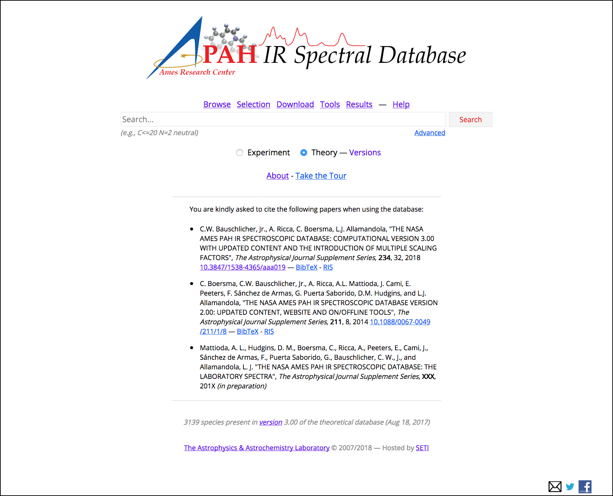

:author: Matthew J. Shannon
:email: Matthew.J.Shannon@nasa.gov
:institution: Universities Space Research Association, Columbia, MD
:institution: NASA Ames Research Center, MS245-6, Moffett Field, CA 94035-1000

:author: Christiaan Boersma
:email: Christiaan.Boersma@nasa.gov
:institution: San José State University Research Foundation, 210 N 4th St Fl 4, San Jose, CA 95112
:institution: NASA Ames Research Center, MS245-6, Moffett Field, CA 94035-1000

:bibliography: bib

-----------------------------------------------------------------------------------------------------------------------
Organic Molecules in Space: Insights from the NASA Ames Molecular Database in the era of the James Webb Space Telescope
-----------------------------------------------------------------------------------------------------------------------

.. class:: abstract

   We present the software tool pyPAHdb to the scientific astronomical
   community, which is used to characterize emission from one of the
   prevalent types of organic molecules in space, namely polycyclic
   aromatic hydrocarbons (PAHs). It leverages the detailed studies of
   organic molecules done at NASA Ames Research Center. pyPAHdb is a
   streamlined Python version of the NASA Ames PAH IR Spectroscopic
   Database (PAHdb; `www.astrochemistry.org
   <http://www.astrochemistry.org/pahdb>`_) IDL suite of tools. PAHdb has
   been extensively used to analyze and interpret the PAH signature
   from a plethora of emission sources, ranging from solar-system
   objects to entire galaxies. pyPAHdb has the capability to interface
   with the spectroscopic libraries of PAHdb, model the detailed
   photo-physics of the PAH excitation/emission-process, and, through
   a database-fitting technique, decompose the PAH emission into
   contributing PAH subclasses in terms of charge, size, structure and
   composition.

.. class:: keywords

   astronomy, databases, fitting, data analysis

Introduction
============

Polycyclic aromatic hydrocarbons
--------------------------------

The astrophysical relevance of polycyclic aromatic hydrocarbons (PAHs)
cannot be overstated. As interstellar molecules go, they are
extraordinarily large and contain some 50-100 carbon atoms. In
contrast, the largest non-PAH carbon-rich interstellar molecule known,
HC11N, contains 11 carbon atoms. PAHs are also exceptionally stable,
allowing them to survive in harsh conditions amongst a remarkably wide
variety of astronomical objects, making them ubiquitous throughout the
Cosmos and ideal probes of astronomical objects.

Scientific analysis with molecular databases
--------------------------------------------

We present here software for the astronomical community developed at
the Astrophysics & Astrochemistry Laboratory (`www.astrochemistry.org
<http://www.astrochemistry.org/pahdb>`_) at NASA Ames Research Center
(`www.nasa.gov/ames <http://www.nasa.gov/ames>`_). The Laboratory
provides key insights into organic molecules in astronomical
environments through a combination of quantum chemical calculations,
direct laboratory measurements and different analysis techniques of
astronomical data. The Laboratory provides the world’s foremost
collection of data on PAHs, namely the NASA Ames PAH IR Spectroscopic
Database (PAHdb). It is highly cited and is used to characterize and
understand organic molecules in our own galaxy and external
galaxies. Thus far, PAHdb’s full set of analytical tools has only been
available as a suite to be used with the IDL[#]_ programming language.

.. [#] IDL is a registered trademark of `Harris Geospatial
       <http://www.harrisgeospatial.com/ProductsandSolutions/GeospatialProducts/IDL.aspx>`_.

Premise of this work: pyPAHdb
-----------------------------

Our new software is pyPAHdb, a streamlined version of the PAHdb
analysis suite. The software accepts spectroscopic observations
(including spectral maps) and characterizes the PAH emission using a
database-fitting technique, providing the user with all pertinent PAH
parameters derived from the fits: their ionization state, the molecule
sizes, and the structure and/or presence of heteroatoms (e.g.,
nitrogen). Its design is directly linked to the upcoming launch of the
James Webb Space Telescope (*JWST*), but it is extended to be utilized
with any major observatory, e.g., the *Spitzer* Space Telescope,
*ISO*, etc. The general program methodology is to: (1) read in various
astronomical file formats, including FITS-files, astronomical
ASCII-tables, VOTables, and spectral maps; (2) perform a non-negative
least-squares-like fit to the data, using highly oversampled
pre-computed PAHdb spectra, which contains much of the relevant
molecular physics; and (3) produce user output in a consistent way.

We will present specific results based on the use of the pyPAHdb suite
for characterizing PAHs in infrared spectroscopic observations from
*Spitzer*, *ISO* and synthetic *JWST* data. As pyPAHdb is designed to
be streamlined compared to the full IDL suite, we will also
demonstrate its performance via benchmarks. pyPAHdb is open source and
being developed on GitHub (`github.com/pahdb/pypahdb
<https://github.com/pahdb/pypahdb>`_), therefore encouraging community
involvement. It is part of an accepted Early Release Science program
for *JWST* and will be incorporated into the standard astronomer’s
*JWST* Toolkit for ease of use by the general astronomy community, in
addition to PAH experts.

The importance of astronomical PAHs
===================================

The astrophysical relevance of PAHs cannot be overstated. As
interstellar molecules go, they are extraordinarily large,
intermediate in size between molecules and particles, with properties
of both. The PAHs that dominate the interstellar emission contain some
50-100 carbon atoms. In contrast, the largest non-PAH carbon-rich
interstellar molecule known, HC\ :sub:`11`\ N, contains 11 carbon
atoms. PAHs are also exceptionally stable, allowing them to survive
conditions in a remarkably wide variety of astronomical objects,
making them ubiquitous throughout the Cosmos. Their unique properties,
coupled with their spectroscopic response to changing conditions and
their ability to convert UV to IR radiation, makes them powerful
probes of astronomical objects at all stages of the stellar life
cycle. Due to their low ionization potentials (6-8 eV), they allow
astronomers to probe properties of astronomical plasmas in regions not
normally accessible. On top of this, PAHs are not only witnesses to
their local environment; they are often key players in local
processes. The origin and evolution of astronomical PAHs starts in
circum-stellar ejecta from late type stars. They are subsequently
processed in the diffuse interstellar medium (ISM) by the prevalent UV
field, energetic particles, and strong shocks. Once in dense clouds
they participate in chemistry and are incorporated into newly formed
stars and their budding planetary systems. All during this evolution,
PAHs exert a direct influence on their environment. They play
important roles in circumstellar processes and the diffuse ISM by
modulating radiation fields and influencing charge balance. Once
incorporated into dense molecular clouds, they can dominate cloud
cooling and promote H\ :sub:`2`\ -formation. PAHs also control the
large-scale ionization balance and thereby the coupling of magnetic
fields to the gas. Through their influence on the forces supporting
clouds against gravity, PAHs also affect the process of star formation
itself. They are a major contributor to the heating of diffuse atomic
gas in the interstellar medium and thereby the physical conditions in
such environments and the phase structure of the ISM. Through their
effect on the energy and ionization balance of the gas, these large
species play an important role in the diffuse ISM of galaxies, photo
dissociation regions (PDRs) created by massive stars interacting with
their environment, and in protoplanetary disk surface layers.

Thanks to their ubiquity, PAH IR emission signatures are routinely
used by astronomers as probes of object type and different
processes. Some examples. The PAH IR signature is used as an indicator
of star formation in high redshift galaxies
:cite:`2014ApJ...786...31R` and to differentiate between black hole
and starburst engines in galactic nuclei
:cite:`1998ApJ...498..579G`. Those astronomers who study star- and
planet formation use the IR PAH signature as an indicator of the shape
of the circumstellar disks from which new stars and planets form. For
example, since PAH IR emission is pumped by UV light from the forming
star, the extent of PAH emission from the disk can discriminate
between flaring and non-flaring protoplanetary disk geometries
:cite:`2001A&A...365..476M`; :cite:`2009A&A...502..175B`. However, the
treasure trove of information of local conditions and an object's
evolutionary history is only accessible through detailed spectroscopic
analysis. A full spectroscopic analysis of these observations and an
understanding of the factors that drive the spectroscopic changes is
only now possible with the NASA Ames PAH IR Spectroscopic Database
(PAHdb) :cite:`2018ApJS..234...32B`;
:cite:`2014ApJSS..211....8B`. PAHdb is a NASA database containing
thousands of spectra coupled to a set of innovative astronomical
models and tools that enables astronomers to probe and quantitatively
analyze the state of the PAH population, i.e., ionization balance,
size, structure, and composition and tie these to the prevailing local
astrophysical conditions, e.g., electron density, parameters of the
radiation field, etc. :cite:`2016ApJ...832...51B`.

The James Webb Space Telescope (*JWST*)
---------------------------------------

The James Webb Space Telescope (JWST; `www.jwst.nasa.gov
<https://www.jwst.nasa.gov>`_) is NASA's next flagship observatory and
is the successor to the succesful Hubble Space Telescope
(`www.nasa.gov/hubble <https://www.nasa.gov/hubble>`_) and Spitzer
Space Telescope (`www.nasa.gov/spitzer
<https://www.nasa.gov/spitzer>`_). *JWST* is being developed through a
collaboration between NASA, the European Space Agency (ESA) and the
Canadian Space Agency (CSA). The telescope features a primary mirror
with a diameter of 6.5 m made up from 18 individual hexagonal segments
and carriers four science instruments. These instruments will observe
the Universe with unprecedented resolution and sensitivity from 0.6 to
27 µm. The observatory is expected to launch in 2020. A 3D rendering
of the spacecraft is shown in Fig. :ref:`fig:JWST`.

.. figure:: JWST.png
   :align: center

   3D-rendering of the James Webb Space Telescope (*JWST*) using the
   Maya® 3D animation, modeling, simulation, and rendering software
   (`www.autodesk.com/products/maya/overview
   <https://www.autodesk.com/products/maya/overview>`_). *JWST*'s
   signature 6.5 m diameter primary mirror made up from 18 hexagonal
   segments (gold) dominates the picture together with the stacked
   sunshield. The 3D-model is available from `nasa3d.arc.nasa.gov
   <https://nasa3d.arc.nasa.gov/search/jwst/>`_. :label:`fig:JWST`

NASA Ames PAH IR Spectroscopic Database (PAHdb)
===============================================

   Screenshot of the landing page of the NASA Ames PAH IR
   Spectroscopic Database located at `www.astrochemistry.org/pahdb/
   <http://www.astrochemistry.org/pahdb/>`_. :label:`fig:PAHdb`

The NASA Ames PAH IR Spectroscopic Database (PAHdb) is the culmination
of more that 30 years of laboratory and computational research carried
out at the NASA Ames Research Center to test and refine the
astronomical PAH model. The laboratory measured and computed libraries
currently contain the spectra of 75 and 3139 PAH species,
respectively, and are continuously expanded. At
`www.astrochemistry.org/pahdb/
<http://www.astrochemistry.org/pahdb/>`_ these libraries can be
perused and/or downloaded. Fig. :ref:`fig:PAHdb` presents a screenshot
of the website's landing page. Dowloads are offered formatted as ASCII
or XML. In addition, several software tools are provided that allow
users to interact with a downloaded database XML-file and perform the
necessary steps to analyze astronomical data. Historically, the
astronomical community has embraced the IDL[#]_ programming
language. As such, the software tools have been developed
in IDL. However, Python is seeing increasingly widespread usage among
astronomers, in part due to its non-proprietary nature. Python has
significantly matured over the last two decades and many astronomical
utilities once only available through IDL and/or IRAF have been ported
to Python (e.g., PyFITS; `www.astropy.org
<http://www.astropy.org>`_). Notably, many of the astronomical
utilities offered by the Space Telescope Science Institute, including
the Data Analysis Toolbox for use with *JWST*, are being developed in
Python. On the advent of the *JWST*-era, it is our goal to make PAHdb
one of the go-to tool for the astronomical community to analyze and
interpret PAH emission spectra. Hence, the development of pyPAHdb.

.. [#] IDL is a registered trademark of `Harris Geospatial
       <http://www.harrisgeospatial.com/ProductsandSolutions/GeospatialProducts/IDL.aspx>`_.

The software: pyPAHdb
=====================

pyPAHdb is being developed as part of the awarded James Webb Space
Telescope (JWST) Early Release Science (ERS) program "Radiative
Feedback from Massive Stars as Traced by Multiband Imaging and
Spectroscopic Mosaics" (`program website <http://jwst-ism.org/>`_; ID:
1288). The entire program is coordinated by an international "Core
team" of 19 scientists and supported by 119 "science
collaborators". The purpose of pyPAHdb is to derive astronomical
parameters directly from the *JWST* observations.

pyPAHdb should be considered a Lite version of the full suite of
Python analyzes tools that is the analog of the *AmesPAHdbIDLSuite*.

pyPAHdb uses a precomputed matrix of theoretically calculated PAH
emission spectra from version 3.00 of the library of computed
spectra. This matrix has been constructed from a collection of
"astronomical" PAHs, which meet the following critera and include the
fullerenes C60 and C70:

* 'magnesium=0 oxygen=0 iron=0 silicium=0 chx=0 ch2=0 c>20 hydrogen>0'

PAH Emission Model
------------------

In order to analyze astronomical PAH *emission* spectra with the
spectroscopic data contained in PAHdb's libraries, a PAH emission
model is needed. Whilst several more sophisticated emission models are
available in the full Python suite, here a PAH's emission spectrum is
calculated from the vibrational temperature it reaches after absorbing
a single 7 eV photon and making use of the thermal approximation
(e.g., :cite:`1993ApJ...415..397S` and :cite:`2001A&A...372..981V`).

The spectral radiance :math:`I_{j}(\nu)`, in erg s\ :math:`^{-1}` cm\
:math:`^{-1}` mol\ :math:`^{-1}`, from the :math:`j^{\rm th}` PAH is
thus calculated as:

.. math::
   :label: eq:model

   I_{j}(\nu) = 4\pi\sum\limits_{i=1}^{n}\frac{2hc\nu_{i}^{3}\sigma_{i}}{e^{\frac{hc\nu_{i}}{kT}} - 1}\phi(\nu)\ ,

with :math:`\nu` the frequency in cm\ :math:`^{-1}`, :math:`h`
Planck's constant in erg s, :math:`c` the speed-of-light in cm s\
:math:`^{-1}`, :math:`\nu_{i}` the frequency of mode :math:`i` in cm\
:math:`^{-1}`, :math:`\sigma_{i}` the integrated absorption
cross-section for mode\ :math:`i` in cm mol\ :math:`^{-1}`, :math:`k`
Boltzmann's constant in erg K\ :math:`^{-1}`, :math:`T` the
vibrational temperature in K, and :math:`\phi(\nu)` is the frequency
dependent emission profile in cm. The sum is taken over all :math:`n`
modes and the emission profile is assumed Gaussian with a FWHM of 15
cm\ :math:`^{-1}`. Note that before applying the emission profile, a
redshift of 15 cm\ :math:`^{-1}` is applied to each of the band
positions (:math:`\nu_{i}`) to mimic some anharmonic effects.

The vibrational temperature attained after absorbing a single 7 eV
photon is calculated through the heat capacity. The heat capacity,
:math:`C_{\rm V}` in erg K, of a molecular system is given, in terms
of isolated harmonic oscillators by:

.. math::
   :label: eq:heatcapacity

   C_{\rm V} = k\int\limits_{0}^{\infty}e^{-\frac{h\nu}{kT}}\left[\frac{\frac{h\nu}{kT}}{1-e^{-\frac{h\nu}{kT}}}\right]^{2}g(\nu)\mathrm{d}\nu\ ,

where :math:`g(\nu)` is known as the density of states and describes
the distribution of vibrational modes. However due to the discrete
nature of the modes, the density of states is just a sum of
:math:`\delta`\ -functions:

.. math::
   :label: eq:delta

   g(\nu) = \sum\limits_{i=1}^{n}\delta(\nu-\nu_{i})\ .

The vibrational temperature is ultimately calculated by solving:

.. math::
   :label: eq:solve

   \int\limits_{0}^{T_{\rm vibration}}C_{\rm V}\mathrm{d}T = E_{\rm in}\ ,

where :math:`E_{\rm in}` is the energy of the absorbed photon, here 7
eV.

In Python, in the full suite, Equation :ref:`eq:solve` is solved
using root-finding with ``scipy.optimize.brentq``. The integral is
calculated with ``scipy.optimize.quad``.

Philosophy
----------

Its utility vs. the full suite, why it exists -- simplicity for
non-experts. etc.

Inputs, outputs, general workflow
---------------------------------

What the user needs to know to effectively apply it to their
dataset. Maybe code examples in here showing how it can be used?

Parallelization, benchmarks
---------------------------

IDL vs. Python, whole field is moving that way. Parallelization,
Python versions vs OS etc too?

Best practices?
---------------

Not sure about this subsection, could maybe be folded into "general
workflow."

Future development/application?
-------------------------------

Brainstorming for this paper:
=============================

Need to have a showcase example of its application. Anything from Les
Houches that might be useful as a prototypical use case? - YES,
analyzing the spectral map of NGC7023 :-)
