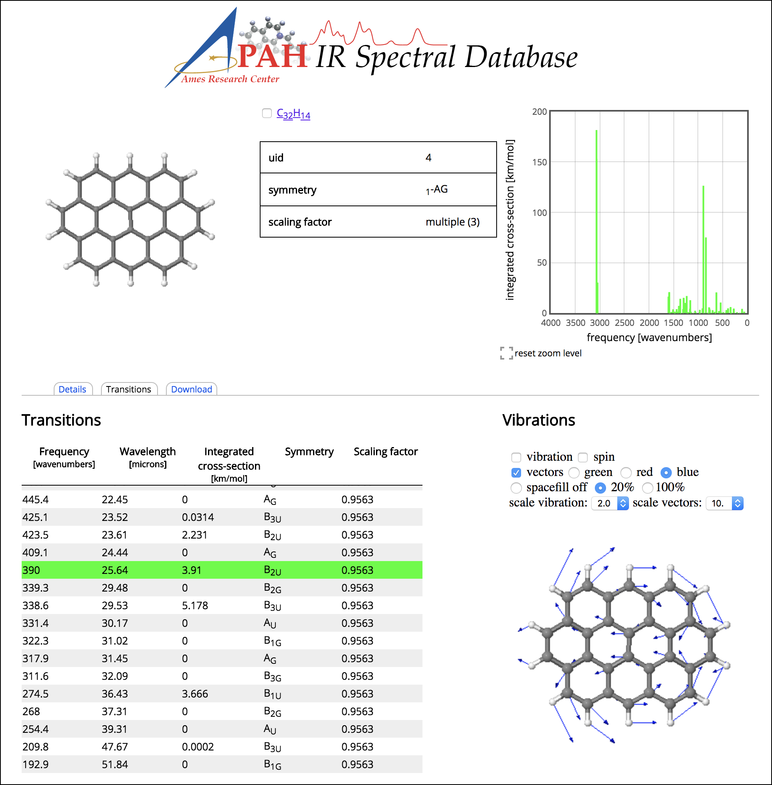
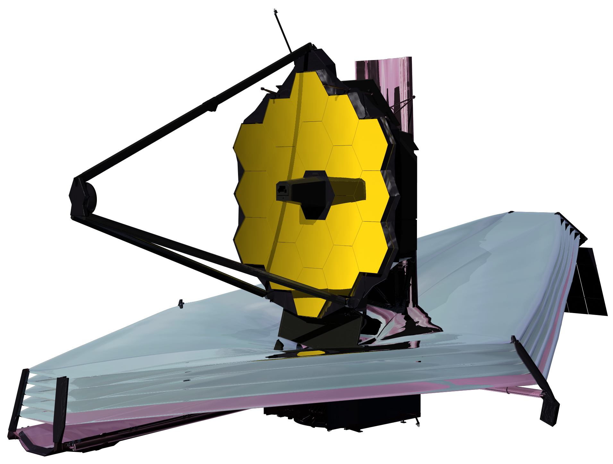
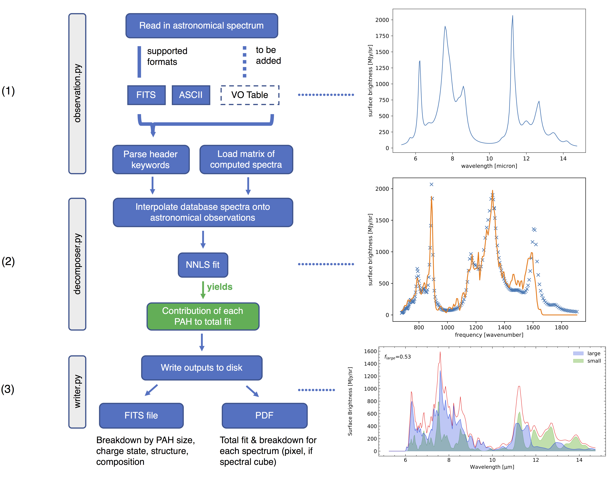
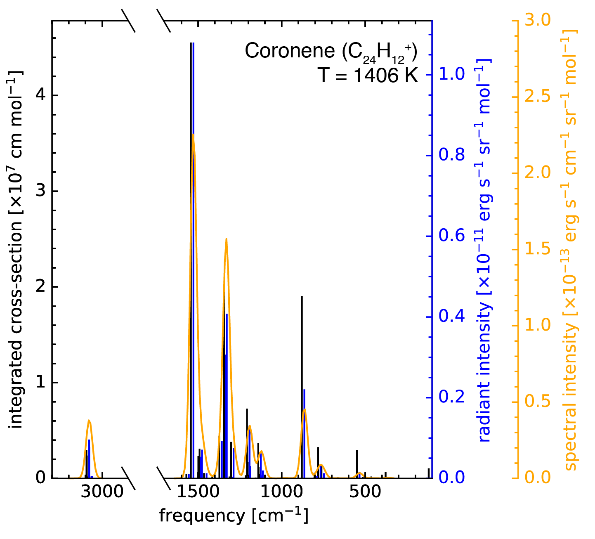
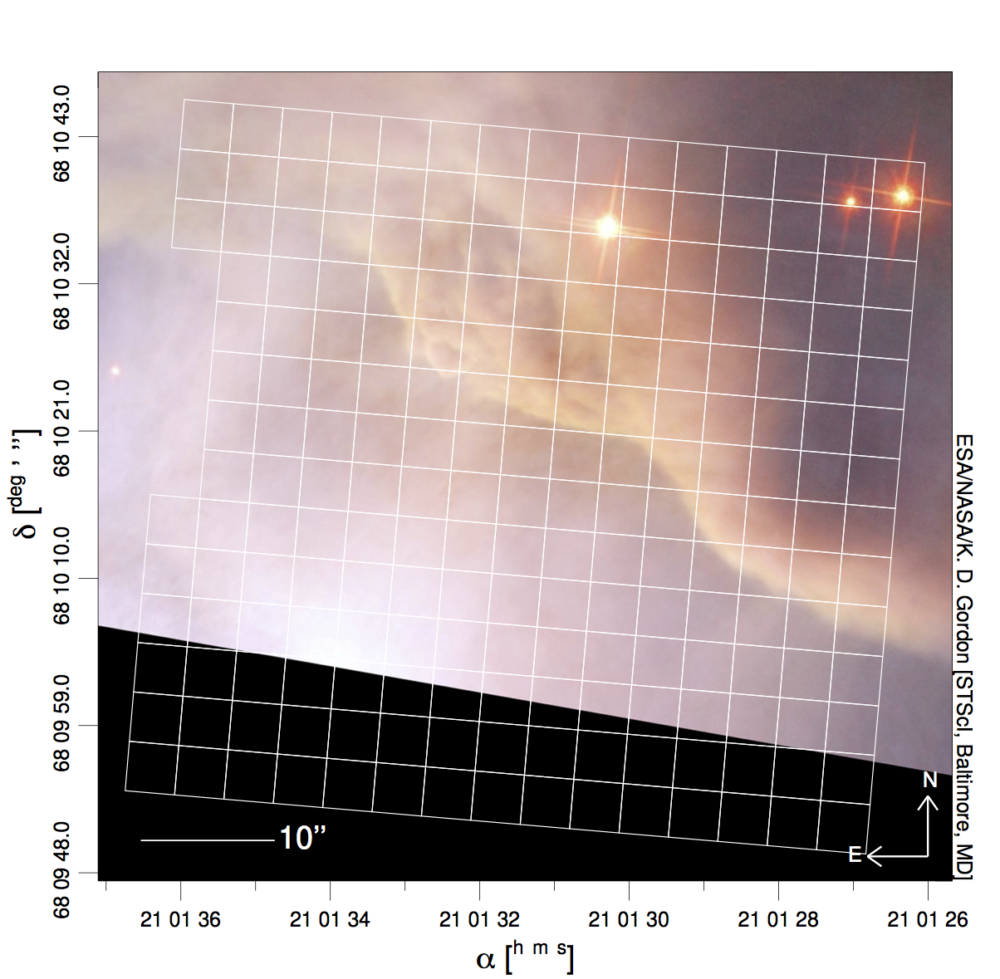
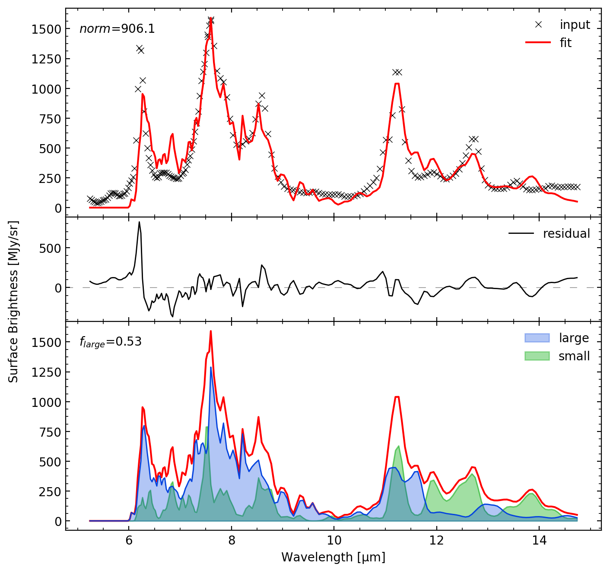

:author: Matthew J. Shannon
:email: Matthew.J.Shannon@nasa.gov
:institution: Universities Space Research Association, Columbia, MD
:institution: NASA Ames Research Center, MS245-6, Moffett Field, CA 94035-1000

:author: Christiaan Boersma
:email: Christiaan.Boersma@nasa.gov
:institution: San José State University Research Foundation, 210 N 4th St Fl 4, San Jose, CA 95112
:institution: NASA Ames Research Center, MS245-6, Moffett Field, CA 94035-1000

:bibliography: bib

-----------------------------------------------------------------------------------------------------------------------
Organic Molecules in Space: Insights from the NASA Ames Molecular Database in the era of the James Webb Space Telescope
-----------------------------------------------------------------------------------------------------------------------

.. class:: abstract

   We present the software tool pypahdb to the scientific astronomical
   community, which is used to characterize emission from one of the
   most prevalent types of organic molecules in space, namely
   polycyclic aromatic hydrocarbons (PAHs). It leverages the detailed
   studies of organic molecules done at the NASA Ames Research
   Center. pypahdb is a streamlined Python version of the NASA Ames
   PAH IR Spectroscopic Database (PAHdb; `www.astrochemistry.org
   <http://www.astrochemistry.org/pahdb>`_) suite of IDL tools. PAHdb
   has been extensively used to analyze and interpret the PAH
   signature from a plethora of emission sources, ranging from
   solar-system objects to entire galaxies. pypahdb decomposes
   astronomical PAH emission spectra into contributing PAH sub-classes
   in terms of charge and size using a database-fitting technique. The
   inputs for the fit are spectra constructed using the spectroscopic
   libraries of PAHdb and take into account the detailed photo-physics
   of the PAH excitation/emission process.

.. class:: keywords

   astronomy, databases, fitting, data analysis

Science background
==================

Polycyclic aromatic hydrocarbons
--------------------------------

Polycyclic aromatic hydrocarbons (PAHs) are important interstellar
molecules that are found throughout the Universe. They dominate the
mid-infrared (IR) emission of many astronomical objects, as they
absorb ultraviolet (UV) photons and re-emit that energy through a
series of IR emission features between 3-20 µm. They are seen in
reflection nebulae, protoplanetary disks, the diffuse interstellar
medium (ISM), planetary nebulae, and entire galaxies (e.g., Figure
:ref:`fig:M82`), among other environments. Interstellar PAHs are
extraordinarily large, typically containing 50-100 carbon atoms. In
contrast, the largest non-PAH carbon-rich interstellar molecule known,
HC\ :sub:`11`\ N, contains 11 carbon atoms. PAHs are composed of an
interlocking hexagonal carbon lattice with hydrogen atoms attached to
its periphery (see Figure :ref:`fig:PAHdb`). PAHs are exceptionally
stable, allowing them to survive the harsh conditions amongst a
remarkably wide variety of astronomical objects.

.. figure:: fig_M82.png
   :align: center
   :scale: 55%

   A combined visible light-IR image from the *Spitzer Space
   Telescope* of the galaxy Messier-82 (M82), also known as the Cigar
   galaxy because of its cigar-like shape in visible light. The red
   region streaming away from the galaxy into intergalactic space
   traces the IR emission from PAHs. Credits:
   NASA/JPL-Caltech/C. Engelbracht (Steward Observatory) and the SINGS
   team.

   :label:`fig:M82`

The importance of astronomical PAHs
-----------------------------------

The unique properties of PAHs, coupled with their spectroscopic
response to changing astrophysical conditions and their ability to convert
UV photons to IR radiation, makes them powerful probes of astronomical
objects at all stages of the stellar life cycle. Due to their low
ionization potentials (6-8 eV), they allow astronomers to probe
properties of diffuse media in regions not normally accessible. On top
of this, PAHs are not only witnesses to their local environment but
are key players in affecting ongoing astrophysical processes.

PAHs are believed to form in the circumstellar ejecta of late-type
stars, after which they become part of the ISM as the material travels
away from the star. They are subsequently processed in the diffuse ISM
by the prevalent UV field, energetic particles, and strong
shocks. Over time, PAHs are incorporated into dense clouds, wherein
they participate in ongoing chemistry and are eventually brought into
newly-forming star and budding planetary systems. All during this
evolution, PAHs exert a direct influence on their environment. They
play important roles in circumstellar processes and the diffuse ISM by
modulating radiation fields and influencing charge balance. Once
incorporated into dense molecular clouds, they can dominate cloud
cooling and promote H\ :sub:`2`\ -formation. PAHs also control the
large-scale ionization balance and thereby the coupling of magnetic
fields to the gas. Through their influence on the forces supporting
clouds against gravity, PAHs also affect the process of star formation
itself. They are a major contributor to the heating of diffuse atomic
gas in the ISM and thereby the physical conditions in such
environments and its structure. Through their effect on the energy and
ionization balance of the gas, these large molecules play an important
role in the diffuse ISM of galaxies, photo dissociation regions (PDRs)
created by massive stars interacting with their environment, and in
protoplanetary disk surface layers.

Thanks to their ubiquity, PAH IR emission signatures are routinely
used by astronomers as probes of object type and astrophysical
processes. For example, the PAH IR signature is used as an indicator
of star formation in high redshift galaxies
:cite:`2014ApJ...786...31R` and to differentiate between black hole
and starburst engines in galactic nuclei
:cite:`1998ApJ...498..579G`. Those astronomers who study star- and
planet formation use the IR PAH signature as an indicator of the
geometry of circumstellar disks :cite:`2001A&A...365..476M`
:cite:`2009A&A...502..175B`. However, the treasure trove of
information about an astronomical object's local conditions and its
evolutionary history is only accessible through detailed spectroscopic
analysis. This type of analysis, along with an understanding of the
factors that drive the these spectroscopic changes, is now possible
with the software developed at the NASA Ames Research Center.

NASA Ames PAH IR Spectroscopic Database (PAHdb)
===============================================

We present software for the astronomical community developed at
the Astrophysics & Astrochemistry Laboratory (`www.astrochemistry.org
<http://www.astrochemistry.org/pahdb>`_) at NASA Ames Research Center
(`www.nasa.gov/ames <http://www.nasa.gov/ames>`_). The Laboratory
provides key insights into organic molecules in astronomical
environments through a combination of quantum chemical calculations,
direct laboratory measurements and different analysis techniques of
astronomical data.

The NASA Ames PAH IR Spectroscopic Database (PAHdb;
:cite:`2018ApJS..234...32B` :cite:`2014ApJSS..211....8B`) is the
culmination of more that 30 years of laboratory and computational
research carried out at the NASA Ames Research Center to test and refine
the astronomical PAH model. The laboratory-measured and
theoretically-computed libraries currently contain the spectra of 75
and 3139 PAH species, respectively, and are continuously expanded. It is
the world's foremost collection of PAH spectra.

PAHdb is highly cited and is used to characterize and understand
organic molecules in our own Galaxy and external galaxies. The
database includes a set of innovative astronomical models and tools
that enables astronomers to probe and quantitatively analyze the state
of the PAH population, i.e., ionization balance, size, structure, and
composition and tie these to the prevailing local astrophysical
conditions, e.g., electron density, parameters of the radiation field,
etc. :cite:`2016ApJ...832...51B` :cite:`2018ApJ...858...67B`.

   Screenshot of the NASA Ames PAH IR Spectroscopic Database website
   located at `www.astrochemistry.org/pahdb/
   <http://www.astrochemistry.org/pahdb/>`_. Shown here are the
   details and vibrational spectrum for the PAH molecule ovalene (C\
   :sub:`32`\ H\ :sub:`14`\ ). Additionally, each vibrational
   transition is animated and can be inspected for ease of
   interpretation (shown in the lower-right).
   :label:`fig:PAHdb`

At `www.astrochemistry.org/pahdb/
<http://www.astrochemistry.org/pahdb/>`_ these libraries can be
perused and/or downloaded. Figure :ref:`fig:PAHdb` presents a
screenshot of the website's landing page. Downloads are offered
formatted as ASCII or XML. In addition, several software tools are
provided that allow users to interact with a downloaded database
XML-file and perform the necessary steps to analyze astronomical
data. Historically, the astronomical community has embraced the IDL\
[#]_ programming language. As such, the software tools have been
developed in IDL. However, Python is seeing increasingly widespread
usage among astronomers, in part due to its non-proprietary
nature. Python has significantly matured over the last two decades and
many astronomical utilities once only available through IDL and/or
IRAF have been ported to Python (e.g., PyFITS; `www.astropy.org
<http://www.astropy.org>`_). Notably, many of the astronomical
utilities offered by the Space Telescope Science Institute, including
the Data Analysis Toolbox for use with NASA's upcoming *James Webb
Space Telescope* (*JWST*; `www.jwst.nasa.gov
<https://www.jwst.nasa.gov>`_), are being developed in Python.

.. [#] IDL is a registered trademark of `Harris Geospatial
       <http://www.harrisgeospatial.com/ProductsandSolutions/GeospatialProducts/IDL.aspx>`_.

The next leap forward: James Webb Space Telescope (*JWST*)
==========================================================

*JWST* is NASA's next flagship observatory and the successor to the
exceptionally successful *Hubble Space Telescope*
(`www.nasa.gov/hubble <https://www.nasa.gov/hubble>`_) and *Spitzer
Space Telescope* (`www.nasa.gov/spitzer
<https://www.nasa.gov/spitzer>`_). *JWST* is being developed through a
collaboration between NASA, the European Space Agency (ESA) and the
Canadian Space Agency (CSA). The telescope features a primary mirror
with a diameter of 6.5 m made up from 18 individual hexagonal segments
and carries four science instruments. These instruments will observe
the Universe with unprecedented resolution and sensitivity from 0.6 to
28 µm. The observatory is expected to launch in 2020. A 3D rendering
of the spacecraft is shown in Figure :ref:`fig:JWST`.

   3D-rendering of *JWST* using the Maya® 3D animation, modeling,
   simulation, and rendering software
   (`www.autodesk.com/products/maya/overview
   <https://www.autodesk.com/products/maya/overview>`_). *JWST*'s
   signature 6.5 m-diameter primary mirror, made up of 18 hexagonal
   segments (gold), dominates the picture together with the stacked
   sunshield. The 3D-model is available from `nasa3d.arc.nasa.gov
   <https://nasa3d.arc.nasa.gov/search/jwst/>`_. :label:`fig:JWST`

pypahdb: a tool designed for JWST
---------------------------------

On the eve of the *JWST* era, it is our goal to make PAHdb a go-to
tools for the astronomical community for analyzing and interpreting PAH
emission spectra. The Python analysis tool pypahdb is one of the means
with which we hope to reach that goal. pypahdb is being developed as
part of an awarded (*JWST*) Early Release Science (ERS) program titled
"Radiative Feedback from Massive Stars as Traced by Multiband Imaging
and Spectroscopic Mosaics" (`jwst-ism.org <http://jwst-ism.org/>`_;
ID: 1288). The purpose of the ERS program is to educate and inform the
astronomical community of *JWST*'s capabilities, and provide rapid
access to data and software tools that will enable full scientific
exploitation in Cycle 2 and beyond. More information about the ERS
program can be found at the `JDox
<https://jwst-docs.stsci.edu/display/JSP/JWST+DD+ERS+Program+Goals%2C+Project+Updates%2C+and+Status+Reviews>`_. The
awarded program is coordinated by an international "core team" of 19
scientists and supported by 119 "science collaborators". The purpose
of pypahdb is to derive astronomical parameters directly from *JWST*
observations, but the tool will not be limited to *JWST* observations
alone. pypahdb is the Lite version of the full suite of Python
software tools, dubbed the *AmesPAHdbPythonSuite*
(`github.com/PAHdb/AmesPAHdbPythonSuite
<https://github.com/PAHdb/AmesPAHdbPythonSuite>`_), that is currently
being developed and is the analog of the *AmesPAHdbIDLSuite*
(`github.com/PAHdb/AmesPAHdbIDLSuite
<https://github.com/PAHdb/AmesPAHdbIDLSuite>`_). pypahdb will enable
PAH experts and non-experts alike to analyze and interpret
astronomical PAH emission spectra.

pypahdb analyzes spectroscopic observations (including spectral maps)
and characterizes the PAH emission using a database-fitting technique,
providing the PAH ionization and size fractions. The general program
methodology is encapsulated in the flowchart presented in Figure
:ref:`fig:flowchart` and is as follows: (1) read-in a file containing
astronomical observations (using ``observation.py``); (2) perform a
non-negative least-squares fit to the data (using ``decomposer.py``);
and (3) produce user output in a consistent way so that the user may
assess the quality of the fit and retrieve the PAH characteristics
in their astronomical observations (``writer.py``).

   pypahdb flowchart. Astronomical spectroscopic data is loaded,
   whether represented in FITS or ASCII files. An over-sampled
   precomputed matrix of PAH spectra is loaded and interpolated onto
   the wavelength grid of the astronomical
   observations. Database-fitting is performed using non-negative
   least-squares (NNLS), which yields the contribution of an
   individual PAH molecule to the total fit. As a result, we obtain a
   breakdown of the model fit in terms of PAH charge and size. The
   results are written to disk as a single FITS file and a PDF 
   summarizing the model fit (one
   page per pixel, if a spectral cube is given as
   input). :label:`fig:flowchart`

The performance of pyPAHdb relative to the full IDL suite was tested
by fitting a spectral cube. Using pyPAHdb, the spectral cube required
<4 seconds, while >60 seconds were needed to fit with the full IDL suite.
It should be noted that their were differences in the actual implementation of
the two tests, which were inherent to the differences in the languages
used.

The underlying PAH physics
--------------------------

In order to analyze astronomical PAH *emission* spectra with the
spectroscopic data contained in PAHdb's libraries, a PAH emission
model is needed. pypahdb hides the underlying photo-physics in a
precomputed matrix. The precomputed matrix is constructed using the
full Python suite and takes modeled, highly-over-sampled PAH
emission spectra from version 3.00 of the library of computed
spectra. This matrix uses the data on a collection of "astronomical"
PAHs, which include those PAHs that have more than 20 carbon atoms,
have no hetero-atom substitutions except for possibly nitrogen, have
no aliphatic side groups, and are not fully dehydrogenated. In
addition, the fullerenes C\ :sub:`60` and C\ :sub:`70` are added.

Whilst several more sophisticated emission models are available in the
full Python suite, here a PAH's emission spectrum is calculated from
the vibrational temperature it reaches after absorbing a single 7 eV
photon and making use of the thermal approximation (e.g.,
:cite:`1993ApJ...415..397S` and :cite:`2001A&A...372..981V`).

The spectral intensity :math:`I_{j}(\nu)`, in erg s\ :sup:`-1` cm\
:sup:`-1` mol\ :sup:`-1`, from a mol of the :math:`j^{\rm th}` PAH is
thus calculated as:

.. math::
   :label: eq:model

   I_{j}(\nu) = \sum\limits_{i=1}^{n}\frac{2hc\nu_{i}^{3}\sigma_{i}}{e^{\frac{hc\nu_{i}}{kT}} - 1}\phi(\nu)\ ,

with :math:`\nu` the frequency in cm\ :sup:`-1`, :math:`h` Planck's
constant in erg s, :math:`c` the speed-of-light in cm s\ :sup:`-1`,
:math:`\nu_{i}` the frequency of mode :math:`i` in cm\ :sup:`-1`,
:math:`\sigma_{i}` the integrated absorption cross-section for mode \
:math:`i` in cm mol\ :sup:`-1`, :math:`k` Boltzmann's constant in erg
K\ :sup:`-1`, :math:`T` the vibrational temperature in K, and
:math:`\phi(\nu)` is the frequency dependent emission profile
in cm. The sum is taken over all :math:`n` modes and the emission
profile is assumed Gaussian with a full-width at half-maximum (FWHM)
of 15 cm\ :sup:`-1`. Note that before applying the emission profile, a
redshift of 15 cm\ :sup:`-1` is applied to each of the band positions
(:math:`\nu_{i}`) to mimic some anharmonic effects.

The vibrational temperature attained after absorbing a single 7 eV
photon is calculated by the molecule's heat capacity. The heat
capacity, :math:`C_{\rm V}` in erg K, of a molecular system can be
described in terms of isolated harmonic oscillators by:

.. math::
   :label: eq:heatcapacity

   C_{\rm V} = k\int\limits_{0}^{\infty}e^{-\frac{h\nu}{kT}}\left[\frac{\frac{h\nu}{kT}}{1-e^{-\frac{h\nu}{kT}}}\right]^{2}g(\nu)\mathrm{d}\nu\ ,

where :math:`g(\nu)` is known as the density of states and describes
the distribution of vibrational modes. However due to the discrete
nature of the modes, the density of states is just a sum of \
:math:`\delta`\ -functions:

.. math::
   :label: eq:delta

   g(\nu) = \sum\limits_{i=1}^{n}\delta(\nu-\nu_{i})\ .

The vibrational temperature is ultimately calculated by solving:

.. math::
   :label: eq:solve

   \int\limits_{0}^{T_{\rm vibration}}C_{\rm V} \mathrm{d}T = E_{\rm in}\ ,

where :math:`E_{\rm in}` is the energy of the absorbed photon—here
this is 7 eV.

In Python, in the full suite, Equation :ref:`eq:solve` is solved using
root-finding with ``scipy.optimize.brentq``. The integral is
calculated with ``scipy.optimize.quad``.

Figure :ref:`fig:model` illustrates the process on the spectrum of the
coronene cation (C\ :sub:`24`\ H\ :sub:`12`\ :sup:`+`\ ), which
reaches a vibrational temperature of 1406 K after absorbing a single 7
eV photon.

   Demonstration of applying the simple PAH emission model as outlined
   in Equations :ref:`eq:model`\ -:ref:`eq:solve` to the 0 K spectrum
   of coronene (in black; C\ :sub:`24`\ H\ :sub:`12`\ :sup:`+`) from
   version 3.00 of the library of computed spectra of PAHdb. After
   applying the PAH emission model, but before the convolution with
   the emission profile, the blue spectrum is obtained. The final
   spectrum is shown in orange. For display purposes the profiles have
   been given a FWHM of 45 cm\ :sup:`-1`. :label:`fig:model`

Demonstration
-------------

The use of pyPAHdb is demonstrated by analyzing a spectral cube
constructed from *Spitzer Space Telescope* observations of the
reflection nebula NGC 7023. The cube is overlaid on an image from the
*Hubble Space Telescope* in Figure :ref:`fig:7023`
:cite:`2018ApJ...858...67B`.

   An image of the reflection nebula NGC 7023 as obtained by the
   *Hubble Space Telescope*. Overlaid is a pixel grid representing a
   spectral cube of observations taken with the *Spitzer Space
   Telescope*; each pixel contains an infrared spectrum. In this
   figure, the exciting star is just beyond the lower left corner. We
   are observing a photodissociation region boundary: the
   material in the lower half of the figure is diffuse and exposed to
   the star; the material in the upper (right) half is molecular and
   shielded from the star. The diagonal boundary separating the two
   zones is clearly visible. PAHs are common in these
   environments. Figure adapted from :cite:`2018ApJ...858...67B`.
   :label:`fig:7023`.

The observed region traces the transition from diffuse, ionized/atomic
species (e.g., HI) near the exciting star to dense, molecular material
(e.g., H\ :sub:`2`) more distant from the star. The transition zone
between the two is the PDR, where PAHs have a strong presence. The
properties of the PAH molecules are known to vary across these
boundaries, since they are exposed to harsh radiation in the exposed
cavity of the diffuse zone, and shielded in the molecular region.

pypahdb is used to determine how the PAH properties vary across this
boundary by analyzing the full spectrum at every pixel. The code-block
below, which is taken from ``example.py`` included in the pyPAHdb
distribution, demonstrates how this is done and Figure :ref:`fig:fit`
presents part of the resulting PDF-output.

.. code-block:: python

    import pypahdb
    # load an observation from file
    observation = pypahdb.observation('NGC7023.fits')
    # decompose the spectrum with PAHdb
    result = pypahdb.decomposer(observation.spectrum)
    # write results to file
    pypahdb.writer(result, header=observation.header)

   pypahdb-fit to the spectrum of a position in the spectral cube of
   NGC 7023. The upper panel displays the total model fit to the data;
   the middle panel the residual; and the lower panel the breakdown of
   large-to-small PAHs (PAHs are considered large when they contain 30
   carbon atoms or more). The charge breakdown (cation, neutral,
   anion) has been suppressed for clarity.

   :label:`fig:fit`

With the results from the entire spectral cube, maps of relevant
astrophysical quantities can be constructed. For example, Figure
:ref:`fig:map` presents a map of the varying PAH ionization fraction
across NGC 7023. As one would expect, the fraction is systematically
higher across the diffuse region, where PAHs are more exposed to the
star, than the dense region, where PAHs are partially shielded from
the star.

.. figure:: fig_map_viridis.png
   :align: center

   PAH ionization across the reflection nebula NGC 7023 is shown,
   as derived from a *Spitzer* spectral cube using pyPAHdb
   (cf. Figure :ref:`fig:7023`; an ionization fraction of ``1`` means
   all PAHs are ionized, while ``0`` means all are neutral).  The
   exciting star is outside the field-of-view, towards the lower-left
   corner. Note that in the diffuse, exposed cavity (lower half) the
   PAHs are on average more ionized than in the denser molecular zone
   (upper half). :label:`fig:map`.

The type of analysis demonstrated here allows users to quickly
interpret the distribution of PAHs in their astronomical observations
and variations in PAH charge and size.

The future
==========

pypahdb is in active development, but a finalized Python software
analysis tool is anticipated to be complete well before *JWST*'s launch, which is
currently scheduled for 2020. The astronomical community can already
benefit from pypahdb by using it to quickly analyze and interpret
archival data from other observatories, e.g., *ISO*, *Spitzer*,
*SOFIA*, etc. Our current efforts are focused on streamlining pypahdb,
having it transparently accept spectroscopic observations in a variety
of digital formats, and consolidating output parameters. Further testing
will be performed to ensure all parts of pypahdb function as
expected. Lastly, API documentation and a guide with analysis
"recipes" will be provided to help users get started and/or extend
pypahdb.

The development of a PAHdb tool in Python has turned out to be largely
straightforward as Python is backed by a large active
community. Python offers great flexibility and in combination with
pypahdb's development on GitHub, allows constructive feedback from a
considerable audience.
