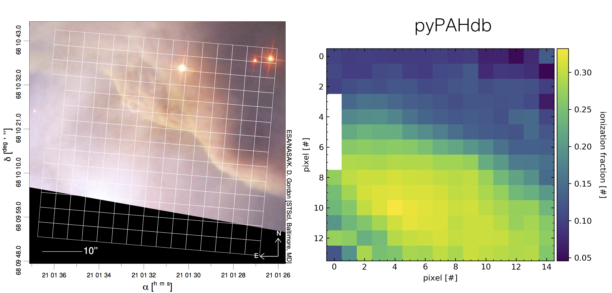

:author: Matthew J. Shannon
:email: Matthew.J.Shannon@nasa.gov
:institution: Universities Space Research Association, Columbia, MD
:institution: NASA Ames Research Center, MS245-6, Moffett Field, CA 94035-1000

:author: Christiaan Boersma
:email: Christiaan.Boersma@nasa.gov
:institution: San José State University Research Foundation, 210 N 4th St Fl 4, San Jose, CA 95112
:institution: NASA Ames Research Center, MS245-6, Moffett Field, CA 94035-1000

:bibliography: bib

-----------------------------------------------------------------------------------------------------------------------
Organic Molecules in Space: Insights from the NASA Ames Molecular Database in the era of the James Webb Space Telescope
-----------------------------------------------------------------------------------------------------------------------

.. class:: abstract

   We present the software tool pyPAHdb to the scientific astronomical
   community, which is used to characterize emission from one of the
   most prevalent types of organic molecules in space, namely
   polycyclic aromatic hydrocarbons (PAHs). It leverages the detailed
   studies of organic molecules done at the NASA Ames Research
   Center. pyPAHdb is a streamlined Python version of the NASA Ames
   PAH IR Spectroscopic Database (PAHdb; `www.astrochemistry.org/pahdb
   <http://www.astrochemistry.org/pahdb>`_) suite of IDL tools. PAHdb
   has been extensively used to analyze and interpret the PAH
   signature from a plethora of emission sources, ranging from
   solar-system objects to entire galaxies. pyPAHdb decomposes
   astronomical PAH emission spectra into contributing PAH sub-classes
   in terms of charge and size using a database-fitting technique. The
   inputs for the fit are spectra constructed using the spectroscopic
   libraries of PAHdb and take into account the detailed photo-physics
   of the PAH excitation/emission process.

.. class:: keywords

   astronomy, databases, fitting, data analysis

Science rationale
==================

Polycyclic aromatic hydrocarbons
--------------------------------

Polycyclic aromatic hydrocarbons (PAHs) are a class of
molecules found throughout the Universe that drive
many critical astrophysical processes. They dominate the
mid-infrared (IR) emission of many astronomical objects, as they
absorb ultraviolet (UV) photons and re-emit that energy through a
series of IR emission features between 3-20 µm. They are seen in
reflection nebulae, protoplanetary disks, the diffuse interstellar
medium (ISM), planetary nebulae, and entire galaxies (e.g., Figure
:ref:`fig:M82`), among other environments. Structurally, they are composed of a
hexagonal carbon lattice (see Figure :ref:`fig:PAHdb`); taken as an
entire family, they are by far the largest known molecules in space.
PAHs are exceptionally
stable, allowing them to survive the harsh conditions amongst a
remarkably wide variety of astronomical objects.

.. figure:: fig_M82.png
   :align: center
   :scale: 55%

   A combined visible light-IR image from the *Spitzer Space
   Telescope* of the galaxy Messier-82 (M82), also known as the Cigar
   galaxy because of its cigar-like shape in visible light. The red
   region streaming away from the galaxy into intergalactic space
   traces the IR emission from PAHs. Credits:
   NASA/JPL-Caltech/C. Engelbracht (Steward Observatory) and the SINGS
   team.

   :label:`fig:M82`

The role of astronomical PAHs
-----------------------------------

Thanks to their ubiquity, PAH IR emission signatures are routinely
used by astronomers as probes of object type and astrophysical
processes. For example, the PAH IR signature is used as an indicator
of star formation in high redshift galaxies
:cite:`2014ApJ...786...31R` and to differentiate between black hole
and starburst engines in galactic nuclei
:cite:`1998ApJ...498..579G`. Those astronomers who study star and
planet formation use the IR PAH signature as an indicator of the
geometry of circumstellar disks :cite:`2001A&A...365..476M`
:cite:`2009A&A...502..175B`.

PAHs are believed to form in the circumstellar ejecta of late-type
stars, after which they become part of the ISM as the material travels
away from the star. Over time, PAHs are incorporated into dense clouds, wherein
they participate in ongoing chemistry and are eventually brought into
newly-forming star and budding planetary systems.

They play important roles in circumstellar processes and the diffuse ISM by
modulating radiation fields and influencing charge balance. Once
incorporated into dense molecular clouds, they can dominate cloud
cooling and promote H\ :sub:`2` formation. PAHs also control the
large-scale ionization balance and thereby the coupling of magnetic
fields to the gas. Through their influence on the forces supporting
clouds against gravity, PAHs also affect the process of star formation
itself. They are a major contributor to the heating of diffuse atomic
gas in the ISM and thereby the physical conditions in such
environments and its structure.

The unique properties of PAHs, coupled with their spectroscopic
response to changing astrophysical conditions and their ability to convert
UV photons to IR radiation, makes them powerful probes of astronomical
objects at all stages of the stellar life cycle. Notably,
they allow astronomers to probe
properties of diffuse media in regions not normally accessible.

NASA Ames PAH IR Spectroscopic Database (PAHdb)
------------------------------------------------

The Astrophysics & Astrochemistry Laboratory at NASA Ames
Research Center :cite:`astrochem` provides data and tools
for analyzing and interpreting astronomical PAH spectra.
The NASA Ames PAH IR Spectroscopic Database (PAHdb;
:cite:`2018ApJS..234...32B` :cite:`2014ApJSS..211....8B`) is the
culmination of more than 30 years of laboratory and computational
research carried out at the NASA Ames Research Center to test and refine
the astronomical PAH model. PAHdb consists of three components
(all under the moniker of "PAHdb"): the spectroscopic libraries,
the website (see Figure :ref:`fig:PAHdb`), and the suite of off-line IDL\ [#]_ tools.
PAHdb has the world's foremost collection of PAH spectra.

.. [#] IDL is a registered trademark of `Harris Geospatial
       <http://www.harrisgeospatial.com/ProductsandSolutions/GeospatialProducts/IDL.aspx>`_.

PAHdb is highly cited and is used to characterize and understand
organic molecules in our own Galaxy and external galaxies. The
database includes a set of innovative astronomical models and tools
that enables astronomers to probe and quantitatively analyze the state
of the PAH population. For instance, one can derive PAH ionization balance, size, structure, and
composition and tie these to the prevailing local astrophysical
conditions (e.g., electron density, parameters of the radiation field,
etc.) :cite:`2016ApJ...832...51B` :cite:`2018ApJ...858...67B`.

.. figure:: fig_screenshot.png
   :align: center

   Screenshot of the NASA Ames PAH IR Spectroscopic Database website
   located at `www.astrochemistry.org/pahdb/
   <http://www.astrochemistry.org/pahdb/>`_. Shown here are the
   details and vibrational spectrum for the PAH molecule ovalene (C\
   :sub:`32`\ H\ :sub:`14`\ ). Additionally, each vibrational
   transition is animated and can be inspected for ease of
   interpretation (shown in the lower-right).
   :label:`fig:PAHdb`

NASA's next great observatory for PAH research: JWST
--------------------------------------------------------------------

The next great leap forward for IR astronomy is the
the James Webb Space Telescope (*JWST*). *JWST* is NASA's
next flagship observatory and the successor to the
exceptionally successful *Hubble Space Telescope*
(`www.nasa.gov/hubble <https://www.nasa.gov/hubble>`_) and *Spitzer
Space Telescope* (`www.nasa.gov/spitzer
<https://www.nasa.gov/spitzer>`_). *JWST* is being developed through a
collaboration between NASA, the European Space Agency (ESA) and the
Canadian Space Agency (CSA). The telescope features a primary mirror
with a diameter of 6.5 m
and carries four science instruments. These instruments will observe
the Universe with unprecedented resolution and sensitivity in the
near- and mid-IR. The observatory is expected to launch early 2021.

As part of an awarded *JWST* Early Release Science (ERS) program\ [#]_,
we are developing a Python-based toolkit for
quickly analyzing PAH emission in IR spectroscopic data

.. [#] The ERS program is titled
       "Radiative Feedback from Massive Stars as Traced by Multiband Imaging
       and Spectroscopic Mosaics" (`jwst-ism.org <http://jwst-ism.org/>`_;
       ID: 1288).

pyPAHdb: a tool designed for JWST
=================================

The purpose of pyPAHdb is to derive astronomical parameters directly
from *JWST* observations, but the tool is not limited to *JWST*
observations alone. pyPAHdb is the light version of a full suite of
Python software tools\ [#]_ that is currently being developed, which
is an analog of the off-line IDL tools\ [#]_. A feature comparison is
made in Table :ref:`capabilities` (see also Section "The underlying
PAH photo-physics"). pyPAHdb will enable PAH experts and non-experts
alike to analyze and interpret astronomical PAH emission spectra.

.. [#] *AmesPAHdbPythonSuite*: `github.com/PAHdb/AmesPAHdbPythonSuite <https://github.com/PAHdb/AmesPAHdbPythonSuite>`_

.. [#] *AmesPAHdbIDLSuite*: `github.com/PAHdb/AmesPAHdbIDLSuite <https://github.com/PAHdb/AmesPAHdbIDLSuite>`_

.. raw:: latex

   \setlength{\tablewidth}{0.7\textwidth}

.. table:: Feature comparison between pyPAHdb and the full suites of
           off-line IDL/Python tools. Note: NNLS is non-negative
           least squares; FWHM is full-width at half-maximum of an
           emission profile; "uncertainties" in this context
           refers to handling observational spectroscopic uncertainties.
           :label:`capabilities`

   +---------------------+----------+------------------+
   |                     | pyPAHdb  | IDL/Python tools |
   +=====================+==========+==================+
   | Included molecules. | Fixed    | User defined     |
   +---------------------+----------+------------------+
   | Excitation energy   | Fixed    | User defined     |
   +---------------------+----------+------------------+
   | Emission profile    | Fixed    | Selectable       |
   +---------------------+----------+------------------+
   | FWHM                | Fixed    | User defined     |
   +---------------------+----------+------------------+
   | Band redshift       | Fixed    | User defined     |
   +---------------------+----------+------------------+
   | Emission model      | Fixed    | Selectable       |
   +---------------------+----------+------------------+
   | NNLS                | ✓        | ✓                |
   +---------------------+----------+------------------+
   | Class breakdown     | ✓        | ✓                |
   +---------------------+----------+------------------+
   | Parallelization     | ✓        | ✓                |
   +---------------------+----------+------------------+
   | Handle uncertainties|          | ✓                |
   +---------------------+----------+------------------+

pyPAHdb analyzes spectroscopic observations (including spectral maps)
and characterizes the PAH emission using a database-fitting approach,
providing the PAH ionization and size fractions.

The package is imported using the following statement:

.. code-block:: python

    import pypahdb

.. figure:: fig_flowchart.png
   :align: center
   :scale: 50
   :figclass: w

   pyPAHdb flowchart. (1) Astronomical spectroscopic data is loaded,
   whether represented in FITS or ASCII files. (2) An over-sampled
   pre-computed matrix of PAH spectra is loaded and interpolated onto
   the wavelength grid of the astronomical
   observations. Database-fitting is performed using non-negative
   least-squares (NNLS), which yields the contribution of an
   individual PAH molecule to the total fit. As a result, we obtain a
   breakdown of the model fit in terms of PAH charge and size. (3) The
   results are written to disk as a single FITS file and a PDF
   summarizing the model fit (one page per pixel, if a spectral cube
   is provided as input). :label:`fig:flowchart`

The general program methodology is encapsulated in the flowchart
presented in Figure :ref:`fig:flowchart` and is as follows:

(1) Read-in a file containing spectroscopic PAH observations of an
    astronomical object. This functionality is provided by the class
    ``observation``, which is implemented in ``observation.py``. It is the
    responsibility of the user to ensure all non-PAH emission
    components have been removed from the spectrum. The class uses a
    fall-through try-except chain to attempt to read the given
    filename using the facilities provided by ``astropy.io``. The
    spectroscopic data is stored as a class attribute as a
    ``spectrum`` object, which holds the data in terms of abscissa and
    ordinate values using ``numpy`` arrays. The units associated with
    the abscissa and ordinate values are, in the case of a FITS file,
    determined from the accompanying header, which itself is also
    stored as a class attribute. The spectral coordinate system is
    interpreted from FITS header keywords following the specification
    by :cite:`2006A&A...446..747G`. The ``spectrum`` class is
    implemented in ``spectrum.py`` and provides functionality to convert
    between different coordinate representations. Below is example
    Python code demonstrating the use of the class. The file
    ``NGC7023-NW-BRIGHT.txt_pahs.txt`` in this demonstration can be
    found in the ``examples`` directory that is part of the
    pyPAHdb package. The output of the following code-block is shown in Figure
    :ref:`fig:flowchart`.

.. code-block:: python

    import pypahdb as pah
    import matplotlib.pyplot as plt
    file = 'NGC7023-NW-BRIGHT.txt_pahs.txt'
    obs = pah.observation(file)
    s = obs.spectrum
    plt.plot(s.abscissa, s.ordinate[:,0,0])
    plt.ylabel(s.units['ordinate']['str']);
    plt.xlabel(s.units['abscissa']['str']);
    plt.show()

(2) Decompose the observed PAH emission into contributions from
    different PAH subclasses, here charge and size. This functionality
    is provided by the class ``decomposer``, which is implemented in
    ``decomposer.py``. The class takes as input a ``spectrum`` object, of
    which it creates a deep copy and calls its
    ``spectrum.convertunitsto`` method to convert the abscissa units
    to wavenumber. Subsequently, a pre-computed ``numpy`` matrix of
    highly oversampled PAH emission spectra stored as a ``pickle``
    is loaded from file. Utilizing ``numpy.interp``, each of
    the PAH emission spectra, represented by a single column in the
    pre-computed matrix, is interpolated onto the frequency grid (in
    wavenumber) of the input spectrum. This process is parallelized
    using the ``multiprocessing`` package. ``optimize.nnls`` is used
    to perform a non-negative least-squares (NNLS) fit of the
    pre-computed spectra to the input spectra. NNLS is chosen because
    it is appropriate to the problem, fast, and always converges. The
    solution vector (weights) is stored as an attribute and considered
    private. Combining lazy instantiation and Python's @property, the
    results of the fit and the breakdown can be retrieved. In case the
    input spectrum represents a spectral cube and where possible, the
    calculations are parallelized across each pixel using, again, the
    ``multiprocessing`` package. Below is example code demonstrating
    the use of the class and extends the previous code-block. The
    output of the code-block is shown in Figure :ref:`fig:flowchart`.

.. code-block:: python

    result = pah.decomposer(obs.spectrum)
    s = result.spectrum
    plt.plot(s.abscissa, s.ordinate[:,0,0], 'x')
    plt.ylabel(s.units['ordinate']['str']);
    plt.xlabel(s.units['abscissa']['str']);
    plt.plot(s.abscissa, result.fit[:,0,0])
    plt.show()

(3) Produce output to file given a ``decomposer`` object. This
    functionality is provided by the class ``writer``, which is
    implemented in ``writer.py``, and serves to summarize the results from
    the ``decomposer`` class so that a user may assess the quality of
    the fit and store the PAH characteristics of their astronomical
    observations. The class uses ``astropy.fits`` to write the PAH
    characteristics to a FITS file and the ``matplotlib`` package to
    generate a PDF summarizing the results. The class will attempt to
    incorporate relevant information from any (FITS) header
    provided. Below is example code demonstrating the use of the
    class, which extends the previous code-block. The size breakdown
    part of the generated PDF output is shown in Figure
    :ref:`fig:flowchart`.

.. code-block:: python

   pah.writer(result, header=obs.header)

It is anticipated that pyPAHdb will constitute an effective and useful
tool of an astronomer's toolbox,
handling thousands of spectra. Therefore, performance is of
importance. To measure performance, a spectral cube containing the PAH
emission spectra at some 210 pixel locations is analyzed with pyPAHdb
(see also Section "Demonstration"). To put the measurement in context,
it is compared to analyzing the same spectral cube using the off-line
IDL tools. In this comparison the analysis with pyPAHdb is 15 times
faster at four seconds as compared to using the IDL tools,
when tested on a 2.8 GHz Intel Core i7 MacBook Pro with 16 GB
of memory.

The underlying PAH photo-physics
--------------------------------

To analyze astronomical PAH *emission* spectra with the *absorption*
data contained in PAHdb's libraries, the PAHdb data need to be turned
into emission spectra. As discussed in the previous section, pyPAHdb
hides the underlying photo-physics in a pre-computed matrix that is
read-in by the ``decomposer`` class. The pre-computed matrix is
constructed using the full Python suite and takes modeled,
highly-over-sampled PAH emission spectra from version 3.00 of the
library of computed spectra.

This matrix uses the data on a collection
of "astronomical" PAHs, which include those PAHs that have more than
20 carbon atoms, have no hetero-atom substitutions except for possibly
nitrogen, have no aliphatic side groups, and are not fully
dehydrogenated. In addition, the fullerenes C\ :sub:`60` and C\
:sub:`70` are added.

While several more sophisticated emission models are available in the
full Python suite, here a PAH's emission spectrum is calculated from
the vibrational temperature it reaches after absorbing a single 7 eV
photon and making use of the thermal approximation (e.g.,
:cite:`1993ApJ...415..397S` and :cite:`2001A&A...372..981V`). Table
:ref:`capabilities` highlights some of the differences between pyPAHdb
and the full suite of IDL/Python tools.

The spectral intensity :math:`I_{j}(\nu)`, in erg s\ :sup:`-1` cm\
:sup:`-1` mol\ :sup:`-1`, from a mol of the :math:`j^{\rm th}` PAH is
thus calculated as:

.. math::
   :label: eq:model

   I_{j}(\nu) = \sum\limits_{i=1}^{n}\frac{2hc\nu_{i}^{3}\sigma_{i}}{e^{\frac{hc\nu_{i}}{kT}} - 1}\phi(\nu)\ ,

with :math:`\nu` the frequency in cm\ :sup:`-1`, :math:`h` Planck's
constant in erg s, :math:`c` the speed-of-light in cm s\ :sup:`-1`,
:math:`\nu_{i}` the frequency of mode :math:`i` in cm\ :sup:`-1`,
:math:`\sigma_{i}` the integrated absorption cross-section for mode \
:math:`i` in cm mol\ :sup:`-1`, :math:`k` Boltzmann's constant in erg
K\ :sup:`-1`, :math:`T` the vibrational temperature in K, and
:math:`\phi(\nu)` is the frequency dependent emission profile
in cm. The sum is taken over all :math:`n` modes and the emission
profile is assumed Gaussian with a full-width at half-maximum (FWHM)
of 15 cm\ :sup:`-1`. Note that before applying the emission profile, a
redshift of 15 cm\ :sup:`-1` is applied to each of the band positions
(:math:`\nu_{i}`) to mimic some anharmonic effects. This redshift
value is currently the best estimate from laboratory experiments (see
e.g., the discussion in :cite:`2013ApJ...769..117B`).

The vibrational temperature attained after absorbing a single 7 eV
photon is calculated by the molecule's heat capacity. The heat
capacity, :math:`C_{\rm V}` in erg K, of a molecular system can be
described in terms of isolated harmonic oscillators by:

.. math::
   :label: eq:heatcapacity

   C_{\rm V} = k\int\limits_{0}^{\infty}e^{-\frac{h\nu}{kT}}\left[\frac{\frac{h\nu}{kT}}{1-e^{-\frac{h\nu}{kT}}}\right]^{2}g(\nu)\mathrm{d}\nu\ ,

where :math:`g(\nu)` is known as the density of states and describes
the distribution of vibrational modes. However due to the discrete
nature of the modes, the density of states is just a sum of \
:math:`\delta`\ -functions:

.. math::
   :label: eq:delta

   g(\nu) = \sum\limits_{i=1}^{n}\delta(\nu-\nu_{i})\ .

The vibrational temperature is ultimately calculated by solving:

.. math::
   :label: eq:solve

   \int\limits_{0}^{T_{\rm vibration}}C_{\rm V} \mathrm{d}T = E_{\rm in}\ ,

where :math:`E_{\rm in}` is the energy of the absorbed photon—here
this is 7 eV.

In Python, in the full suite, Equation :ref:`eq:solve` is solved using
root-finding with ``scipy.optimize.brentq``. The integral is
calculated with ``scipy.optimize.quad``.

Figure :ref:`fig:model` illustrates the process on the spectrum of the
coronene cation (C\ :sub:`24`\ H\ :sub:`12`\ :sup:`+`\ ), which
reaches a vibrational temperature of 1406 K after absorbing a single 7
eV photon.

.. figure:: fig_model.png
   :align: center

   Demonstration of applying the simple PAH emission model as outlined
   in Equations :ref:`eq:model`\ -:ref:`eq:solve` to the 0 K spectrum
   of coronene (in black; C\ :sub:`24`\ H\ :sub:`12`\ :sup:`+`) from
   version 3.00 of the library of computed spectra of PAHdb. After
   applying the PAH emission model, but before the convolution with
   the emission profile, the blue spectrum is obtained. The final
   spectrum is shown in orange. For display purposes the profiles have
   been given a FWHM of 45 cm\ :sup:`-1`. :label:`fig:model`

Demonstration
-------------

   **Left:** An image of the reflection nebula NGC 7023 as obtained by the
   *Hubble Space Telescope*. Overlaid is a pixel grid representing a
   spectral cube of observations taken with the *Spitzer Space
   Telescope*; each pixel contains an infrared spectrum. In this
   figure, the exciting star is just beyond the lower left corner. We
   are observing a photodissociation region boundary: the
   material in the lower half of the figure is diffuse and exposed to
   the star; the material in the upper (right) half is molecular and
   shielded from the star. The diagonal boundary separating the two
   zones is clearly visible. PAHs are common in these
   environments. Figure adapted from :cite:`2018ApJ...858...67B`.
   **Right:**  We display PAH ionization across the NGC 7023 (white grid
   in left panel), using pyPAHdb. Here, an ionization fraction of ``1`` means
   all PAHs are ionized, while ``0`` means all are neutral.
   Note that in the diffuse, exposed cavity (lower half) the
   PAHs are on average more ionized than in the denser molecular zone
   (upper half).
   :label:`fig:7023`

As a more sophisticated demonstration of pyPAHdb's utility,
we analyze a spectral cube dataset of the reflection nebula
NGC 7023, as constructed from *Spitzer Space Telescope* observations.
This data cube is overlaid on a visible-light image of NGC 7023 from the
*Hubble Space Telescope* in Figure :ref:`fig:7023`, left panel
:cite:`2018ApJ...858...67B`.

The spectral cube is aligned such that, in these observations, we observe
the transition from diffuse, ionized/atomic
species (e.g., HI) near the exciting star to dense, molecular material
(e.g., H\ :sub:`2`) more distant from the star. The transition zone
between the two is the photodissociation region, where PAHs have a strong presence. The
properties of the PAH molecules are known to vary across these
boundaries, since they are exposed to harsh radiation in the exposed
cavity of the diffuse zone, and shielded in the molecular region.

We use pyPAHdb to derive the variability of PAH properties across this
boundary layer by analyzing the full spectrum at every pixel. The code-block
below, which is taken from ``example.py`` included in the pyPAHdb
distribution, demonstrates how this is done. Note that this is the same
general syntax as is used for analyzing a single spectrum, but here
``NGC7023.fits`` is a spectral cube.

.. code-block:: python

    # ----------------------------------------- #
    # ------------ Running pyPAHdb ------------ #
    # ----------------------------------------- #

    import pyPAHdb
    observation = pyPAHdb.observation('NGC7023.fits')
    result = pyPAHdb.decomposer(observation.spectrum)

    # This will output the results file,
    # 'NGC7023_pypahdb.fits':
    pyPAHdb.writer(result, header=observation.header)

With the results from the entire spectral cube, maps of relevant
astrophysical quantities can be constructed. For example, Figure
:ref:`fig:7023` (right panel) presents a map of the varying PAH ionization fraction
across NGC 7023. As expected, the fraction is systematically
higher across the diffuse region, where PAHs are more exposed to the
star, than the dense region, where PAHs are partially shielded from
the star. This figure was constructed in the following manner:

.. code-block:: python

    # ----------------------------------------- #
    # ----- Plotting a map of ionization ------ #
    # ----------------------------------------- #

    # Import needed/useful modules.
    import matplotlib.pyplot as plt
    import numpy as np
    from astropy.io import fits
    from mpl_toolkits.axes_grid1 import \
        make_axes_locatable

    # Read in the results from pyPAHdb.
    # The data is 3-dimensional, with the first axis
    # denoting the PAH properties, and the latter two
    # being spatial.
    hdulist = fits.open('NGC7023_pypahdb.fits')
    ionization_fraction, large_fraction, norm = \
        hdulist[0].data

    # Create a figure instance.
    fig = plt.figure()
    ax = fig.add_subplot(111)

    # Plot our ionization map; we've flipped it left-right
    # to match the Hubble image's orientation.
    im = ax.imshow(np.fliplr(ionization_fraction),
                   origin='upper', cmap='viridis',
                   interpolation='nearest')

    # Add a nice colorbar.
    divider = make_axes_locatable(ax)
    cax = divider.append_axes("right", size="5%",
                              pad=0.05)
    cbar = plt.colorbar(im, cax=cax)
    cbar.set_label('ionization fraction [#]',
                   rotation=270, labelpad=18)

    # Set axes labels.
    ax.set_xlabel('pixel [#]')
    ax.set_ylabel('pixel [#]')

    # Save the figure.
    plt.savefig('ionization_fraction_map.pdf',
                format='pdf', bbox_inches='tight')
    plt.close()

The type of analysis demonstrated here allows users to quickly
interpret the distribution of PAHs in their astronomical observations
and variations in PAH charge and size. Note that in addition to the
ionization fraction, the pyPAHdb results file ``NGC7023_pypahdb.fits``
contains a data array for the ``large PAH fraction`` and ``norm``
(accessed and plotted in the same manner), which we have defined in the code above.

Summary
===================

The data and tools provided through PAHdb have proven to be valuable assets for the
astronomical community for analyzing and interpreting PAH emission spectra.
The launch of *JWST* in 2021 will usher a new era of astronomical PAH research.
In the context of an awarded *JWST* Early Release Science program, we are developing
pyPAHdb as a key data analysis tool to facilitate quick and effective analysis of
PAH emission spectra. While this tool is being developed with *JWST* in mind, it is
not limited to *JWST* data: it currently supports spectra from *Spitzer Space Telescope*,
*Infrared Space Observatory*, and any user-defined spectrum. pyPAHdb is in
active development and will be finalized well before *JWST*'s launch.
