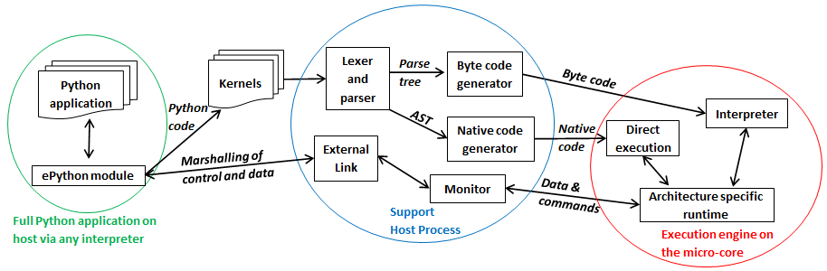
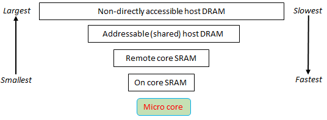

:author: Maurice Jamieson
:email: maurice.jamieson@ed.ac.uk
:institution: EPCC at the University of Edinburgh

:author: Nick Brown
:email: n.brown@epcc.ed.ac.uk
:orcid: 0000-0003-2925-7275
:institution: EPCC at the University of Edinburgh

:author: Sihang Liu
:institution: EPCC at the University of Edinburgh

-----------------------------------------------------------------------------------------------------------------------------------------
Having your cake and eating it: Exploiting Python for programmer productivity and performance on micro-core architectures using ePython
-----------------------------------------------------------------------------------------------------------------------------------------

.. class:: abstract

   Micro-core architectures combine many simple, low memory, low power computing cores together in a single package. These can be used as a co-processor or standalone but due to limited on-chip memory and esoteric nature of the hardware, writing efficient parallel codes for these chips is challenging. In this paper we discuss our very low memory implementation of Python, ePython, supporting the rapid development of parallel Python codes for these co-processors. An offload abstraction is introduced, where programmers decorate specific functions in their Python code, running under any Python interpreter on the host CPU, with the underlying technology then taking care of the low level data movement, scheduling and ePython execution on the micro-core co-processor. A benchmark solving Laplace's equation for diffusion via Jacobi iteration is used to explore the performance of ePython on three different micro-core architectures, and introduces work around native compilation for micro-cores and the performance advantages that this can provide.

.. class:: keywords

   ePython, micro-cores, RISC-V, MicroBlaze, PicoRV32, Epiphany

Introduction
============

Micro-core architectures combine many simple, low power, cores on a single processor package. These micro-core architectures, providing significant parallelism and performance for low power but a major limitation is programmer productivity, where typically developers must write code in C, linked to low level libraries. Furthermore they must possess a deep understanding of the technology and address esoteric aspects including ensuring consistency with a (sometimes very) weak memory model, aligning data to word boundaries correctly, and the lack of basic features such as IO. As such, even the few experts who are able to program these chips struggle when it comes to obtaining good performance. 

It was our hypothesis that Python can significantly help here and this is the reason why we developed ePython, an implementation of Python designed specially for micro-core architectures. Providing execution via both an interpreter (at around 24KB in size) and native compilation of code, ePython enables Python programmers to easily offload specific kernels in their code onto the micro-cores. This involves the seamless transfer of code and data to the device, as well as the copying back of results from the device. With very small memory spaces, of around between 32KB to 64KB per core, in order to support usable datasets then the underlying technology must also be capable of taking advantage of slower by larger external memories, and abstract the low-level details involved in moving data between these areas from the programmer.

In this paper we describe the use of ePython to program micro-cores from the perspective of supporting the offload of specific functions from an existing Python application, and then execute these kernels on the micro-cores. This technology currently supports a variety of micro-core architectures which include the Adapteva Epiphany, Xilinx MicroBlaze, and RISC-V PicoRV32, these three being the targets explored in this paper. The paper is organised as follows; in the next section we explore the background to micro-cores in more detail, some of the Python frameworks used to program accelerators and embedded technologies, and describe ePython. The section which follows introduces our abstractions for offloading kernels in application code which can be running via any Python interpreter on the host, onto the micro-cores and how these might be used most effectively. This is then followed by a description of the lower level details of ePython, discussing some of the architectural decisions that have been made in order to support easy porting between architectures and to fit into the limited memory spaces available. We then explore the performance of ePython on our three architectures of interest, initially focussing on the interpretation approach, which is currently most mature, before comparing and contrasting this against native code generation. Lastly we draw some conclusions and discuss further work.

Background and related work
===========================

There are numerous micro-core architectures including the PEZY-SC2 [pezy-sc]_ which powered the top Green 500 machine until it was decommissioned in March 2019, the Kalray Boston [kalray]_ and, the Celerity [ajayi2017celerity]. The work and experiments described in this paper focuses on three distinct types of micro-core; the Epiphany [epiphany]_, MicroBlaze [microblaze]_, and PicoRV32 [picorv32]_. Developed by Adapteva and packaged as a single physical chip, the Epiphany is still arguably one of the most ubiquitous consumer-grade micro-cores, even thought it was developed a few years ago. On the Epiphany version 3 (Epiphany-III) each of these cores consists of a RISC-based CPU, 32KB of high bandwidth on-core local memory (SRAM), two DMA engines and a network interface. The Epiphany is a physical chip, and whilst this is common place with consumer grade CPUs, it is expensive (approx. $1 million) to tape out a physical design. As such, soft-cores are also commonplace, where reconfigurable logic chips (such as FPGAs) are *configured to behave like* a specific CPU design. These is the case with the other two micro-cores that we target in this paper, the MicroBlaze and PicoRV32, and from the end programmer's perspective this chip looks exactly like a physical CPU. Crucially this approach is much cheaper than fabricating physical cores, although typically the reconfigurable nature of the fabric imposes a reduced clock frequency compared to a physical core. Irrespective of whether the chip is physical or soft, they contain many cores, each with very limited amounts of memory, and the reason for picking these specific three technologies here is both their ubiquity, and also representation of a wider class of micro-cores. The micro-core architecture is applicable to a wide range of problem domains, and performance levels close to 2 GFLOPs per core have been demonstrated [epiphany-specifications]_ in the field of signal processing on the Epiphany. A major advantage to this technology is around power efficiency, for instance even though it was designed in 2013, the 16 core Epiphany-III, draws a maximum of 2 Watts and delivers 16 GFLOPs/Watt which is very impressive even by today's standards.

In addition to the micro-core CPU, one also requires a board to mount this chip and connect it to the outside world. Adapteva, who developed the Epiphany, also manufactured the Parallella [parallella]_ which is a single board computer (SBC). The Parallella combines a host dual core ARM A9 CPU, with 1 GB of DRAM and the 16 core Epiphany-III. The theoretical off-chip bandwidth of the Epiphany is 600 MB/s, however in practice the maximum obtainable is around 150 MB/s. For our two soft-cores we use the same base-board, a Pynq-II SBC, and a Xilinx Zynx-7020 reconfigurable FPGA. The Zynq-7020 chip is especially interesting, as in a single physical package not only is there the reconfigurable fabric which we can use to represent our micro-cores of interest, but furthermore a dual core ARM A9 CPU which runs Linux. Therefore in a single chip we have the combination of a dual-core host CPU on the one-hand, and logic configured as multiple micro-core CPUs on the other. The board also contains 512 MB RAM with an off-chip bandwidth of 131.25 MB/s. This specific FPGA contains 53,200 programmable Look-Up Tables (LUTs), and around 627 KBs of block RAM (BRAM). In fact it is this BRAM, effectively the amount of local memory per core, which is the limiting factor here and we can fit a maximum of eight 64 KB MicroBlaze or PicoRV32 CPUs and supporting infrastructure onto the Zynq, which is the configuration used throughout this paper. 

Whilst we have picked these micro-core technologies due to their availability and popularity, in our opinion the MicroBlaze and PicoRV32 are the more interesting targets. The MicroBlaze is developed by Xilinx, a large multi-national corporation who also develop the underlying FPGAs and there is significant commitment by Xilinx to the technology. On the other-hand, the PicoRV32 is an implementation of the RISC-V Instruction Set Architecture (ISA). RISC-V is an open standard ISA and, first introduced in 2010, one of the major reasons for its popularity has been the fact that it is provided under open source licenses that do not require fees. This means that anyone is free to download the specification and develop their own implementation of the ISA, which indeed the PicoRV32 project have done. Furthermore, because all these CPUs share the same ISA, then the software eco-system can often be trivially ported between CPUs. This includes complex tooling such as compilers, debuggers, and profilers, which in themselves require significant development effort. Enabling developers of a new RISC-V based CPU to take the existing RISC-V software eco-system, and run this with little or no modifications on their chip, significantly reduces the effort required in developing such new CPUs. With a large community, who are mixture of commercial and academic contributors, RISC-V is currently a very topical and active area of research and commercial exploitation.

Whilst we have aimed to provide the reader some glimpse into the richness and diversity that makes up this area of CPU architectures, there is one specific characteristic that they all share. Namely, irrespective of whether one's micro-core is a physical Epiphany or soft-core such as the MicroBlaze, the programming of these technologies is technically challenging. Based on the severe limitations of the hardware, it will be of no surprise to the reader that they run *bare metal* (i.e. without an OS), and whilst some approaches beyond using C with the low level hardware specific library, such as OpenCL [opencl]_ and OpenMP [openmp]_ have been developed, these are at different levels of maturity and still require the programmer to explicitly program the chip using C at a very low level. Indeed, Xilinx's Pynq-II board has been designed around ease of use, loading up a default configuration of three MicroBlaze cores, and presenting a Python interface via the Jupyter notebook. However, Python only runs on the host ARM CPU of the Pynq-II and the programmer must still write C code, albeit embedded within the Jupyter notebook, to execute directly on each MicroBlaze and interface with them appropriately using host side code.

This programmability challenge is made more severe when one considers the tiny amount of memory per core, for instance 32KB on the Epiphany and 64KB on the MicroBlaze and PicoRV32. Whilst a portion of the board's main DRAM memory is often directly addressable by the micro-cores, there is a significant performance penalty when going *off chip* and using this in comparison with the on-core RAM. Therefore to achieve reasonable performance programmers have to either keep their code and data within the limits of the on-core memory, or design their codes to explicitly cache and pre-fetch. Regardless, this adds considerable additional complexity to any non-trivial codes and, it is our firm belief that this should be abstracted by the programming technology. Potentially this is where the programmer productivity gains of Python can be of significant benefit to micro-cores, and it has already been seen that without an easy to use environment, then the adoption of this technology will be necessarily narrowed.

There are some other Python-based technologies in a somewhat similar space and arguably the most ubiquitous of these is MicroPython [micropython]_. MicroPython is an implementation of Python for micro-controllers and is designed to be both lightweight and also to enable programmers to execute Python codes easily, as well as exploring the lower level details of the machines. Similarly to ePython, it can run bare metal on a variety of controllers or run on more mainstream machines such as Unix or Windows OSes. Whilst MicroPython is very interesting, it is fundamentally different from ePython in a number of respects. Firstly memory size, where MicroPython requires 256KB of code space and 16KB of RAM [micropython-website], and whilst this is small in comparison to more mainstream Python interpreters such as CPython, it is still significantly above the limitations of micro-core architectures such as the Epiphany. In addition to the RAM, embedded controllers often contain dedicated Read Only Memory (ROM) too which can be flashed with the MicroPython code. This is the case with the pyboard, which is the official MicroPython microcontroller board, as it contains both 1MB of ROM and 192KB of RAM, and as such provides plenty of space for MicroPython. In contrast, micro-cores are CPUs and tend not to have such ROM associated with them, and therefore ePython has a much more limited memory space within which it can work. The ePython interpreter and runtime code size is 24KB on the Epiphany (compared against MicroPython's 256KB), and because it must fit into the very limited CPU's RAM, was architected from day one to achieve this by adopting specific design decisions. The other big difference between MicroPython and ePython is that of parallelism because, whilst there is multi-threading support in MicroPython, parallelism is not the first class concern of this technology and there is more limited support for writing parallel codes to run over a multiple cores concurrently. We had to provide this in ePython because the vast majority of micro-core architectures contain multiple cores that must interoperate.

Numba [numba]_ is an annotation driven approach to accelerating and offloading Python kernels, where the programmer decorates specific functions in their code and these will be compiled into native machine code for execution. For instance the *@jit* decorator indicates that a specific function should be just-in-time (JIT) compiled and the native code executed rather than the Python code. Their approach has been extended to GPUs, where functions can be decorated with *@cuda.jit* which will execute them on the GPU and perform all data movement necessary. The management of data on the device is also possible via in-built functions such as *cuda.to_device* to copy specific data to the GPU. The machine code for kernels that this technology generates is larger than the memory spaces available in micro-core architectures, so it is not applicable directly for our target architecture, however Numba's use of annotations is a very convenient way of marking which functions should be offloaded. Their approach is currently tightly coupled to GPUs, for instance when one launches a kernel they must explicitly specify some GPU specific concerns such as the number of GPU threads per block and number of blocks per grid, but the general idea of annotating functions in this manner could be applied more generally to micro-cores.

ePython
-------
ePython, which was first introduced in [epython]_, is an implementation of a subset of Python for micro-core architectures and is designed to be portable across numerous technologies. The primary purpose of ePython was initially educational, and also as a research vehicle for understanding how best to program these architectures and prototyping applications upon them. ePython was initially created with the aim of allows a novice to go from *zero to hero*, i.e. with no prior experience write a simple parallel hello world example that runs on the micro-cores, in less than a minute. Due to the memory limitations of these architectures, the ePython virtual machine (which is the part that actually runs on the micro-core architectures) is around 24KB on the Epiphany, with the remaining 8KB of on-core memory used for user byte code, the stack, heap and communications. It is possible for byte code, the stack and heap to overflow into shared memory transparently, but there is a performance impact when doing so. ePython also supports a rich set of  message passing primitives such as point to point messages, reductions and broadcasts between the cores, and it is also possible to run *virtual cores* where the host CPU behaves like micro-cores and can pass messages between themselves as normal. The code listing below illustrates a simple example which is executed directly on the micro-cores and launched from the host command line such as issuing *epython example.py*. In this example, each micro-core will generate a random integer between 0 and 100 and then perform a collective message passing reduction to determine the maximum random number (due to the *"max"* operator) which is then displayed by each core.

.. code-block:: python
  :linenos:

  from parallel import reduce
  from random import randint

  a = reduce(randint(0,100), "max")
  print "The highest random number is " + str(a)

This approach was initially developed with the objective of running rather simple examples on the micro-cores directly and exposing programmers to the fundamental ideas behind parallelism in a convenient programming language. As such, ePython implements a subset of Python 2.7, and was initially focussed around the imperative aspects of the code with features such as garbage collection, and has been extended to include other aspects of the Python language as time has progressed, although does not provide a complete implementation due to memory space limits. However, going beyond the work of [epython]_, we realised that there was potential for ePython to support real-world applications on micro-cores, but to do so a more powerful approach to programmer interaction was required. This is because not all parts of an application are necessarily suited for offloading to micro-cores, so an approach where specific functions can be selected for offload conveniently was required to extend the technology, which is the focus of the next section. 

Offloading application kernels
==============================

We have extended ePython to couple it with existing Python codes running in any Python interpreter on the host CPU. As illustrated in Figure 1, ePython is comprised of three main components: 

- A module which programmers import into their application Python code, running under any Python interpreter on the host, which provides abstractions and underlying support for handling the offloading of select code fragments to the micro-cores
- An ePython support host process which performs code preparation (such as lexing and parsing) as well as some general management functionality such as the marshalling and control of the micro-cores
- An execution engine on each of the micro-cores. This contains an architecture specific runtime, paired with either the ePython interpreter or execution of native code which has been generated from the programmer's offloaded Python kernels.

The first component is connected to the second via POSIX shared memory, and the method by which the second component connects to the third is architecturally specific depending upon the micro-cores in question. The targets considered in this paper all connect with the host via memory mapped regions, where specific portions of the memory space are visible to both host and micro-cores, although these tend to be mapped at different absolute addresses between the host and micro-core. The underlying mechanism for achieving this communication is abstracted as a set of services in the host's monitor, and the micro-core's architecture specific runtime. Therefore we have been able to support ePython on other architectures which connect using different mechanisms, such as RS232 via a daughter board, by providing alternative implementations of the services.

In this section we explore the first of these components, and more specifically the abstractions provided which enable Python programmers to direct what aspects of their code should run on the micro-cores.

   ePython architecture, connecting the programmer's Python code in any Python interpreter on the host, to execution on the micro-cores. 

Similar to the approach taken by Numba, the programmer annotates kernel functions to be offloaded to the micro-cores with a specific decorator, *@offload*. When the CPU Python code executes a call to functions marked with this decorator it will, behind the scenes, run that function using ePython on the micro-cores, passing any input values and sending back return values. The code listing below provides an illustration of this, where the *mykernel* function has been marked with *@offload*, so the call to *mykernel* at line 7 will launch this kernel on each micro-core, passing the argument *22* to each function execution and obtain, as a list, the return value from the kernel (in this case the integer value *10* from each core). In this example the only modification required to standard Python code for offloading is importing the *epython* module and decorating the function. Function arguments are pass by reference, so it is only a reference to the data which is passed to the micro-cores upon kernel invocation, with ePython transparently transferring data as it is requiring during the execution of the kernel.

.. code-block:: python
  :linenos:

  from epython import offload
  @offload
  def mykernel(a):
    print "Hello with " + str(a)
    return 10
    
  print mykernel(22)

Behind the scenes to implement this offload functionality, upon initialisation the *epython* module will parse the full Python code and search for functions that might need to be executed on the micro-cores, such as the kernels and functions that they call into. These are extracted out into a separate Python file which is passed to ePython, which itself is then executed as a subprocess. Launched on each micro-core, low level message passing communications pass between the micro-cores and Python interpreter on the host via the ePython support host process. Upon the initialisation of a user's Python code on the CPU, the imported *epython* module interrogates ePython about the byte code location of all remotely executable functions, which is then stored. Subsequently, to execute a specific function on the micro-cores the host sends the stored byte code location of the function to the target core(s) in combination with an execution token. All output from the ePython subprocess is forwarded to standard output, so the programmer can still perform IO and view error messages raised by their offloaded kernels. If a programmer wishes to import specific modules in their kernels, then they can utilise either the *import* or *use* statements at the top of the function body. 

Kernel execution options
------------------------

The semantics of the offload is that, by default, the kernel will be executed on all available micro-cores and the caller will block until these have been executed. It is possible to override these defaults to further control the behaviour of kernel launch and execution. This is achieved by either providing explicit arguments to the decorator such as *@offload(async=True)* which will apply the option to all executions of the kernel, or alternatively the programmer can provide options as a named argument to the function call. An example of the later is *mykernel(22, async=True)*, which will override the arguments of the decorator for this specific kernel invocation. There are a number of possible options which can be used to control kernel behaviour:

Asynchronous execution
  By providing the argument *async=True* the execution of the kernel will proceed in a non-blocking manner where the function call will return a handler of type *KernelExecutionHandler* immediately. This object represents the state of the kernel execution over one or more micro-cores, and provides methods for testing kernel completion, waiting on kernel completion on all cores (and obtaining the results) and waiting for kernel completion on any core (and obtaining results.)

Auto
  The argument *auto=n*, where *n* is an integer representing the number of cores to execute the kernel over. This signifies that the programmer does not care which cores are used, but instead to run the kernel on *n* free micro-cores whenever these are available.

All
  The argument *all=True* will collectively execute the kernel on all available micro-cores. 

Target
  The argument *target=n*, where *n* is either an integer core id or list of core ids, will guarantee to execute the kernel on those specific cores only. This can be useful if there is some distinct state or data held by core(s) which the programmer wants to utilise in their kernel. 

Device
  The argument *device=d*, where *d* is the specifier of a type of micro-core architecture or a list of these and will execute the kernel on those types of specific micro-cores only. This is for programming heterogeneous micro-core systems which contain a number of micro-cores CPUs of different types, with device types defined for each available micro-core. 

These options, specifically the placement options of *target*, *auto* and *all* can conflict if used together. Hence an order of precedence is defined and this is based upon the order in which they were introduced above. For instance if the programmer provides both *auto* and *target* then because *auto* has higher precedence it will be honoured and the *target* specifier ignored.

Scheduler
---------

Using some of the options described previously can result in a situation where kernels are scheduled for execution, but the target cores are busy executing previous kernels. The *epython* module, imported by the entire Python application, implements a scheduler running inside a thread to handle this situation. The module keeps track of what cores are currently idle and which are active, as well as maintaining a list of outstanding kernel launches which are awaiting a free micro-core. Any kernel execution that can not be honoured is packaged up with additional information such as where to run the code and any arguments before being stored in a list. The scheduler will then scan through these waiting kernels and check whether the corresponding core can be used to execute this kernel yet, and if so then the kernel is launched automatically. To ensure correctness a strict ordering, based upon the scheduling order, is maintained for kernel launches. Therefore, if kernel *A* is scheduled to run on core 0 and then kernel *B* is scheduled to run on the same core, ePython guarantees that *A* will execute on this core before *B*. Much of this is abstracted inside the *KernelExecutionHandler* class, object instances of which are returned as handlers from asynchronous kernel launches, and the class also contains methods for obtaining the general scheduling state such as how many kernel executions are currently running, and how many are scheduled and waiting to be run. 

Working with arbitrarily large data-sets
----------------------------------------

It might seem apparent to the reader that one of the limitations of the approach thus described is the size of data that can be manipulated on the micro-cores. More specifically, very small data-sets can be copied into the micro-core local RAM which will provide optimal performance, but the majority of data sizes will instead need to be located in shared on-board but off-chip DRAM memory which is significantly slower. Using the abstractions described so far, the programmer would have to make a choice between the placement of their data and to manually copy in segments that they may wish to place in on-core memory for performance. The hierarchy of memories available to the micro-cores, and thus the Python programmer's kernels, is illustrated in Figure 2 for the Epiphany. From this diagram it can be seen that the problem is even more severe, as only a fraction of the host's 1GB DRAM is directly addressable by the micro-cores on the Epiphany (by default the shared segment is only 32MB in size). As such this significantly limits the data sizes that can be processed, as any data larger than this limit will not be able to reside in a location which is, by default, visible to the micro-cores.

   Illustration of memory hierarchy for the Epiphany.

This is in fact why the semantics of kernel arguments are pass by reference, rather than pass by value. Following a similar approach to CUDA's Unified Virtual Addressing (UVA) although, due to the simplicity of the micro-cores, achieving this entirely at the software level rather than hardware level, means that upon kernel invocation a simple reference is passed for each argument and it is this that the kernel works with. When the data is read from, or written to, by the micro-core then the ePython runtime will, based upon this reference, perform the associated data movement operation with respect to the data's source location. Whilst it might appear that having to perform this data movement each time, potentially to or from a source location held far away in the memory hierarchy, is expensive, there are some further abstractions which can assist. Namely pre-fetching is supported which will utilise the micro-core's memory like a cache and copy in chunks ahead of time, then evicting them later on if necessary. On the Epiphany this is especially beneficial due to the two DMA engines per core, which can perform data transfers in a non-blocking manner and-so the cores can continue to work with data previously fetched whilst subsequent memory operations are in progress.

In combination with pass by reference and possible pre-fetching, it is also desirable for the programmer to be able to direct where in the memory hierarchy their data resides. This is supported via memory kinds. The code listing below illustrates a sketch of this, where the programmer uses the *memkind* class of the ePython module to allocate data. This enables them to direct where abouts in the memory hierarchy the data belongs and also the amount to allocate. Numerous memory kinds are provided and in this manner the programmer can easily direct what data belongs where, and then subsequently modify this if required without having to worry about any of the low-level nitty gritty details. It is still perfectly acceptable to declare variables normal Python style, without using memory kinds, and in such cases the variable belongs to the level of memory hierarchy that is currently in scope.

.. code-block:: python
  :linenos:

  from epython import offload, memkind
  import random
 
  nums1 = memkind.Host(types.int, 1000)
  nums2 = memkind.Host(types.int, 1000)
 
  ....
 
  @offload
  def mykernel(a, b):
    ....
  
  print mykernel(nums1, nums2)

It is this same mechanism that enables device resident data, via the *Device* memory kind, to allocate the variables within the on-core memory of the micro-cores. ePython delegates to the memory kind the determination of the mapping between the requested index and the actual physical data region. Therefore, the memory kind can enable operations on memory spaces that are not directly visible to the micro-cores and, for instance, this is how we make visible the top level of the memory hierarchy of Figure 2 to the Epiphany and overcome the 32MB memory limit. In fact there is no inherent reason why the memory kinds must represent memory spaces at all, and in future could represent other facets including files or network connected resources.

Memory model
------------
Python does not specify a standard memory model, with individual implementations being free to adopt whichever memory model they wish. In contrast to many other Python implementations, ePython adopts a rather weak memory model, which the programmer should be aware of.

Whenever a micro-core attempts to access a scalar variable or the index of an array, held elsewhere in the memory hierarchy, preference is given to any local copy held on that micro-core (cached). If there is no local copy, then a data transfer will be performed from where the data is physically located, effectively copying it to the micro-core and then caching it. The cache policy is write-through, where the locally held copy will then be used for all the reads, and writes are performed on both the local copy of data and also written back to the variable's location elsewhere in the hierarchy. Locally held cache copies of data are evicted automatically by the ePython runtime as required, such that the memory space can then be reused for subsequent data. Access to any data, whether it be a scalar or array element, held in memory locations outside the core will always first check whether there is a copy held locally, and if not perform the explicit data movement required. At the time of writing, by default the runtime waits until the data is required and then moves it, with the disadvantage of this approach is that it stalls execution until the memory operation completes. As such the programmer can, via decorating their code, instruct the data movement to be done ahead of time via non-blocking pre-fetching, thus not stalling the micro-cores on data access, and in the future this will likely become the default approach.

From the perspective of a single micro-core, updates to data are in-order and atomic. However between cores the model is weaker for performance reasons and to enable the reuse of data held locally rather than having to explicitly fetch it each time (for instance in situations where the same data element is used many times over by a kernel). This provides a simple and consistent model, and a big benefit within the context of simple micro-cores is that it requires limited support from the hardware and runtime software. However, the programmer should be aware of this because, if two or more kernels are working concurrently with the same data and both reading and writing to this, then ePython only imposes the atomicity of these updates. There is no guarantee around the order in which accesses from different cores will complete, or when kernels will see the data written by kernels on other cores. This is a somewhat different than that adopted by many multi-core CPUs, which are typically write-back and hence tend to only write data on cache flush, but do support a stronger memory model, often via directory based cache coherence.

ePython - a portable engine for parallel Python code execution
==============================================================

As illustrated in Figure 1, in addition to the *epython* module, there is also host side support code which runs as a separate process and an execution engine running on the target micro-cores. The later executes the programmer's code either via an interpreter or by natively compiling it. Both the ePython execution engine and and host-based support code are written in C and designed to be portable between architectures. Due to the very limited amount of memory available on these architectures, for the code running on the micro-cores it is not possible to link against the standard C library, or any other libraries for that matter. Instead, all the support functionality required, which in many cases is also architecture specific, is located in the ePython runtime. The idea is that the interpreter is entirely standard C99 code, and will call out to support functions in the runtime, thus meaning that to go from one architecture to another only a new runtime need be written. As such a version of the runtime must be provided for each architecture, and the API calls which must be implemented range from memory management and garbage collection, to communication between micro-cores and the host. The target architecture must provide at a minimum a C compiler, which itself is very common. We adopted this design as it provides both maximum portability and also considerable flexibility which is important for architecture specific optimisations.

When compiled the exact size of ePython depends upon the architecture being targeted. For instance with the Epiphany, where the ISA has been designed to result in small binaries, our compiled runtime is around 14KB and the interpreter 10KB. However on the PicoRV32 the binary size is around 40KB which is because the RISC-V ISA tends to result in more verbose machine code than the Epiphany's ISA. Furthermore, the Epiphany and MicroBlaze provide a Floating Point Unit (FPU) which supports (single precision) floating point arithmetic in hardware, whereas the PicoRV32 does not, and as such explicit floating point software support must also be included at the runtime level which increases the size of ePython. As the micro-cores are running bare-metal, ePython determines its own memory map, and whilst there is a standard ePython memory map that we defined in [epython]_, the exact location of where the separation between different memory areas lies, and the sizes of these areas, is flexible and abstracted by the architecture specific runtime. This is all abstracted by the runtime, and has no impact on the other parts of the code and therefore does not hinder portability.

The monitor of Figure 1 is directed by the micro-cores to perform certain activities, and runs via a thread on the host, polling for commands and data. It is through this mechanism that the micro-cores can *see* the programmer's host Python execution as an additional core, interacting with this via the sending or receiving of messages, which ultimately end up in the ePython module, and are used to marshall control and communicate data. These messages, instead of being sent to another micro-core, are sent to the monitor on the host which forwards them via POSIX shared memory to the host Python interpreter process. To achieve this, the same mechanism for passing messages between micro-cores can be used directly, without significant increases to size of ePython. The majority of support for marshalling control on the micro-cores is at the Python code level, where pre-written Python module code runs on the micro-cores to interpret the messages arriving from the host and then decoding these to determine which kernels to run or other actions to perform. This is important because, based upon the foundational concepts of message passing and task based parallelism, it meant that very limited modifications were required to the ePython execution engine on the micro-cores to support our offload approach, which is critical because memory is at so much of a premium.

Performance of the ePython interpreter
======================================

In this section we explore the performance of ePython on the three micro-core architectures that have been described in this paper, the Epiphany-III, the MicroBlaze, and PicoRV32. Due to the larger compiled size on the MicroBlaze and PicoRV32, in comparison to the Epiphany, these two architectures required 64KB of memory to run the full ePython stack. As discussed previously, the main limitation of the Zynq-7020 for hosting these soft-cores is the amount of memory available on the FPGA, and as such the maximum number of 64KB cores that can fit is eight. In order to provide a fair comparison, we also limit ourselves to eight Epiphany micro-cores in our experiments. 

We chose a benchmark code for solving Laplace's equation for diffusion via Jacobi iteration. Jacobi iteration is a classic computational method for solving PDEs, and in this case we decompose our domain in one dimension across the micro-cores. Effectively in each iteration, every grid point is averaging across neighbouring values, and after each iteration a halo-swap is performed between pairs of micro-cores, to communicates the data on the exterior that is required for the next iteration. Furthermore, after each iteration the code calculates the relative residual, which is used to determine how far from the desired level of accuracy the current solution currently is. This involves each micro-core calculating its own local residual and then performing a reduction across the micro-cores to determine the overall global sum. All grid point numbers are single precision floating point, and we consider this benchmark interesting because it combines both floating point computation and communications. The runs described in this section are using the ePython interpreter, and Table 1 illustrates the runtime in seconds of each micro-core technology when our benchmark was executed upon it.

.. table:: Runtime of Jacobi benchmark on the three micro-core architectures using the ePython interpreter.

  +-------------+-------------+----------------------------+
  | Description | Runtime (s) | Compared to Epiphany       |
  +=============+=============+============================+
  | Epiphany    | 18.20       | N/a                        |
  +-------------+-------------+----------------------------+
  | MicroBlaze  | 129.08      | 7.1 times slower           |
  +-------------+-------------+----------------------------+
  | PicoRV32    | 1014.96     | 55.76 times slower         |
  +-------------+-------------+----------------------------+

It can be seen in Table 1 that the Epiphany is by the far the most performant micro-core of the three that we are benchmarking in this section. This is potentially not surprising given the fact that it is a physical chip, and as such can run at a much higher clock frequency (600Mhz) compared to the two soft-cores (100Mhz). However, clearly from the results a six times difference in clock frequency is not the only reason for the performance gap, and other architectural differences play a role too. If we normalise for clock frequency, floating point operations on the PicoRV32 are still approximately 9 times slower than on the Epiphany, and this is because the Epiphany contains a hardware FPU which is superscalar, providing the capability of processing up to two floating point operations concurrently. By contrast, the PicoRV32 does not contain an FPU and as such all floating point arithmetic must be performed in software. Again normalising for clock frequency, array accesses are around 9.5 times slower on the PicoRV32 than on the Epiphany, and this is because on the Epiphany and MicroBlaze the cost of a memory load in cycle per instruction (CPI) is 1 cycle, whereas on the PicoRV32 it is 5 cycles. The Epiphany provides a variable length pipeline of up to eight stages and the MicroBlaze a five stage pipeline, by contrast the PicoRV32 is not pipelined and this results in an average CPI of 4 instructions, with the next instruction not being able to begin until the proceeding one has completed.

Cooking on gas - performance of native compilation
==================================================

The performance limitations of the ePython interpreter become apparent when we compare against a version of the benchmark written in C and compiled on the host CPU. For instance, running on the Parallella's ARM Cortex-A9, a C version of the benchmark executes in 0.23 seconds which is around 80 times faster than the ePython version on eight cores of the Epiphany! This performance issue was one of the major facts that motivated us to explore native compilation of the programmers's Python code, such that it can execute directly on the micro-cores without the need for an interpreter. As per the architectural diagram of Figure 1, the natively compiled code can still take advantage of all the ePython runtime support, but crucially as both the runtime and the programmer's code are executed directly on bare metal, we believed that this would provide significant performance benefits. The ePython native code generator uses ahead-of-time (AOT) compilation, where the Python source code is compiled on the host machine to a native binary for execution on the micro-cores. Similarly to Micropython's Viper code emitter, the ePython native code generator uses machine word sizes (e.g. 32 bit on the Epiphany) and this is all transparent to the Python programmer, with their code matching the behaviour that would have been provided by the ePython interpreter. Like Micropython, but unlike Numba AOT compilation, the ePython code generation does not require the programmer to add type signatures to their offloaded kernels.

Unlike the Micropython just-in-time (JIT) and Numba compilers, the native code is not generated from existing Python bytecode, but instead from C source code generated from the abstract syntax tree (AST) created just after parsing and lexing the programmer's Python code. The resultant C source code is not a simple transliteration of Python to C, but instead the generation of optimal source code that supports the dynamic features of Python, whilst optimising memory access and arithmetic operations. We felt that this would be good approach because, unlike the bytecode-based approach, the ePython model is able to leverage the C compiler's extensive code optimisation routines at a higher level over a greater amount of source code, resulting in significantly faster code. To enable portability between architectures, the generated C code is standard C99, and similarly to the interpreter calls into the runtime for anything which is architecturally specific.

Table 2 illustrates the runtime in seconds across different technologies when natively compiled. It can be seen that this is significantly faster, over 500 times, than using the ePython interpreter on the Epiphany. For comparison we have developed a C version of the benchmark specifically for the Epiphany and this represents the alternative of writing a bespoke implementation for the architecture. Developing such code in C is a significant undertaking, as the programmer must deal with numerous architecture specific complexities and low level concerns. Whilst it is this programming complexity that we believe Python has significant potential to overcome for micro-cores, we nevertheless felt it was interesting to include a C version as a comparison in a performance study such as this. We also ran a version of this benchmark on an AMD64 CPU (as both the ePython interpreter and native code generation support x86), which are ubiquitous in HPC and consumer grade computing.

.. table:: Runtime of natively compiled Python code via ePython, against bespoke C code, on both the Epiphany and AMD64 x86 CPU.

   +--------------------------------+-------------+
   | Description                    | Runtime (s) |
   +================================+=============+
   | ePython native on Epiphany     | 0.031       |
   +--------------------------------+-------------+
   | C code on Epiphany             | 0.029       |
   +--------------------------------+-------------+
   | ePython native on AMD64 CPU    | 0.019       |
   +--------------------------------+-------------+
   | C code on AMD64 CPU            | 0.015       |
   +--------------------------------+-------------+

This is currently the least mature part of ePython, and from Table 2 the reader can see that there is a small performance difference of around 10% on the Epiphany between ePython natively compiled code, and that written in C directly. The reason for this is the additional complexity that we have added into the natively compiled code to address the small memory spaces. We realised that a potential problem would be in natively compiling large Python kernels because it is very possible that these would result in an executable which is larger than the on-core memory or even the shared DRAM memory space. As such, the programmer's Python must be compiled in such a way that codes of an arbitrarily large size can be supported. Therefore, our approach adopts a dynamic loading approach, where a very small (approximately 1.5KB) bootloader is placed onto the micro-cores and this then *pulls in* the first function to execute. This bootloader intercepts all function calls, and upon a call it will check to see whether that function is currently held in on-core memory or not. If so then it will jump to that, or otherwise it will fetch the associated native code that comprises the function from the host, perform any required connections, and then execute it. Currently functions are flushed from the on-core memory upon completion of their execution, which is likely what accounts for the performance difference between the ePython native code and compiled C code, and in future this will be modified to be smarter, potentially with a garbage collection approach adopted instead.

Conclusions and further work
============================

Micro-cores is a classification that covers a wide variety of processor technologies, and this is a thriving area which contains a number of vibrant communities. Whilst these are very interesting for a number of different reasons, a major challenge is around programmer productivity. We firmly believe that Python has a significant role to play here, but the peculiarities of the architectures, and more specifically the simplicity of the cores themselves and tiny amounts of associated memory, result in numerous challenges when looking to support a Python programming environment. As such, we initially realised that there is an important role for an implementation of Python which is very compact and can easily fit within the memory with space to spare for user code and data. 

In this paper we have described ePython, an implementation of Python which is aimed to both support execution on micro-core CPUs, but also be highly portable between technologies. We have explored both the low-level aspects of how ePython is constructed, and also the abstractions provided to Python programmers such that they can easily offload specific parts of their application code onto the micro-cores. Being able to drive this offload by decorating functions within in existing applications is a very simple yet powerful way of interaction with the micro-cores, and the technology has also driven other aspects of the design, such as pass by reference.

The reader can clearly see that the performance obtained by ePython is very architecture specific, which is not surprising given the diversity of the different types of micro-cores and associated level of complexity. Whilst we expected a performance overhead associated with the ePython interpreter, the magnitude of this when compared to native code compilation surprised us. By contrast, one can see that the performance overhead of ePython can in large be ameliorated by using native code compilation to run the Python code directly on the micro-cores, without the need for an interpreter to be present. Therefore our present focus is in maturing the native code generation as we think this has demonstrated some worthwhile early results. In addition to exploring opportunities for further performance improvements, currently the architecture specific runtime library is not included in this dynamic loading, so the minimum code size is around 15KB (runtime and bootloader together). If we were to extend the dynamic loading approach to the runtime too, then the minimum size will be around 1.5KB plus the size of the largest function. This will open up the possibility of running over a number of additional micro-core architectures which contain tiny amounts of memory per core (only around 2KB or 3KB). Furthermore, our dynamic loading approach to native code compilation can be extended to fetch parts of third-party libraries, such as Numpy or Sklearn. This will require some thought, as we will need to split apart the ELF into its constituent components, but it would be of significant benefit to the micro-core software ecosystem if such a rich set of existing numerical frameworks could be supported by ePython. 

ePython is currently focussed around version 2.7 of the language, and this reached end-of-life in January 2020. Therefore an important activity will be to upgrade ePython to support version 3 of the language, and we believe that the work done around the native code compilation is a key enabler. The reason for this is that implementing version 3 of the Python standard will require a number of extensions to the ePython interpreter which will push it beyond the current 24KB size. However this size issue is not present with the ePython native code compilation, not least because of our dynamic loading approach, and therefore it is our plan for the next ePython version to deprecate the interpreter and support Python version three based around native code compilation only.

References
----------
.. [picorv32] C. Wolf. *PicoRV32 - A Size-Optimized RISC-V CPU*,
          On Github, https://github.com/cliffordwolf/picorv32/, Last accessed June 2020

.. [pezy-sc] T. Ishii. *Introduction to PEZY-SC*
          http://accc.riken.jp/wp-content/uploads/2015/09/ishii.pdf, Last accessed June 2020

.. [kalray] B.D de Dinechin. *Kalray MPPA: Massively parallel processor array: Revisiting DSP acceleration with the Kalray MPPA Manycore processor*
          Hot Chips 27 Symposium (HCS), 2015 IEEE, pages 1--27

.. [ajayi2017celerity] S. Davidson et al. *Celerity: An Open-Source RISC-V Tiered Accelerator Fabric*
          IEEE Micro, Volume: 38, Issue: 2, March/April 2018, Pages 30 - 41

.. [epiphany] A. Olofsson. *Kickstarting high-performance energy-efficient manycore architectures with epiphany*
          48th Asilomar Conference on Signals, Systems and Computers, 2014

.. [parallella] Adapteva. *Parallella-1.x Reference Manual*
          http://www.parallella.org/docs/parallella_manual.pdf, Rev 09, 2014

.. [microblaze] Xilinx. *MicroBlaze Processor Reference Guide*
          https://www.xilinx.com/support/documentation/sw_manuals/xilinx2018_2/ug984-vivado-microblaze-ref.pdf, 2018

.. [epiphany-specifications] Adapteva. *Epiphany Architecture Reference*
          http://www.adapteva.com/docs/epiphany_arch_ref.pdf, Rev 14, 2013

.. [opencl] J.E. Stone. D. Gohara. G. Shi. *OpenCL: A parallel programming standard for heterogeneous computing systems*
          Computing in science and engineering, Volume: 12, Issue: 3, May-June 2010, Pages 66 - 73

.. [openmp] OpenMP Architecture Review Board. *OpenMP Application Program Interface Version 4.0*
          http://www.openmp.org/mp-documents/OpenMP4.0.0.pdf, 2013

.. [micropython] D. P. George. *The MicroPython language*
          http://docs.micropython.org/en/latest/pyboard/reference/index.html, Last accessed June 2020

.. [micropython-website] MicroPython community. *MicroPython*
          https://micropython.org/, Last accessed June 2020

.. [numba] S.K. Lam. A. Pitrou. S. Seibert. *Numba: A LLVM-based Python JIT Compiler*
          Proceedings of the Second Workshop on the LLVM Compiler Infrastructure in HPC, 2015

.. [epython] N. Brown. *ePython: An Implementation of Python for the Many-core Epiphany Coprocessor*
          Proceedings of the 6th Workshop on Python for High-Performance and Scientific Computing, 2017