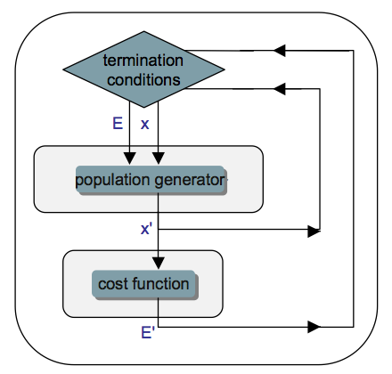
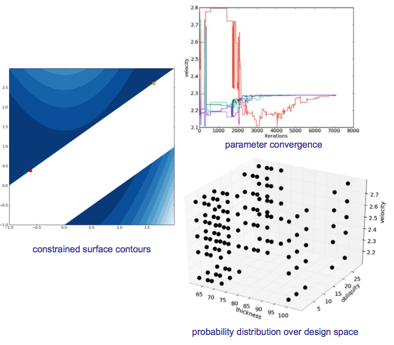
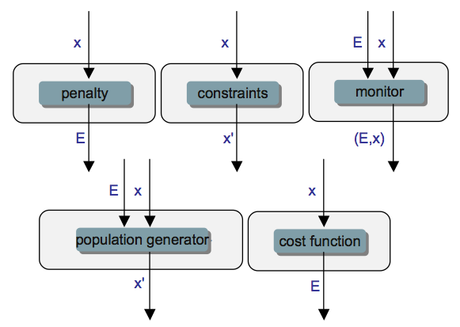
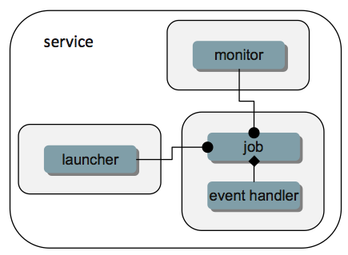
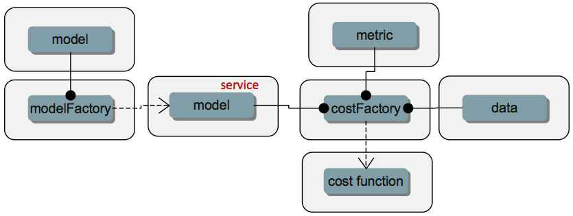
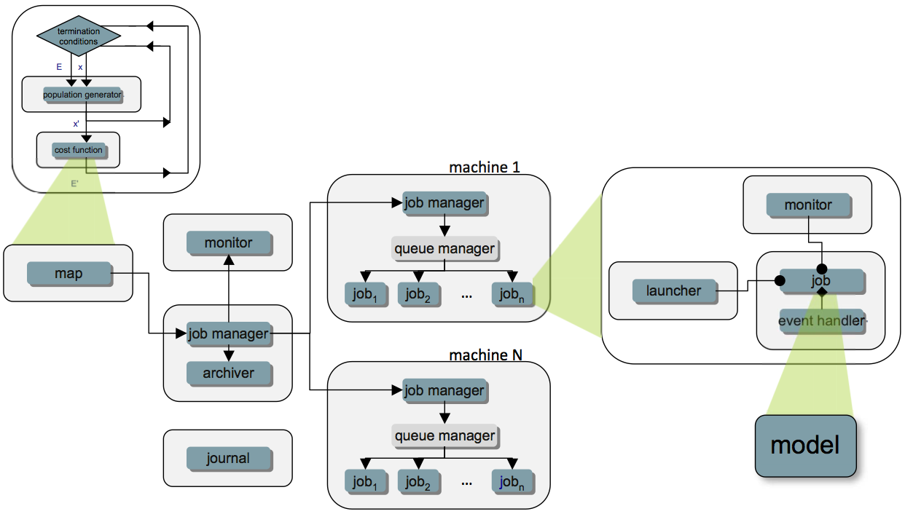
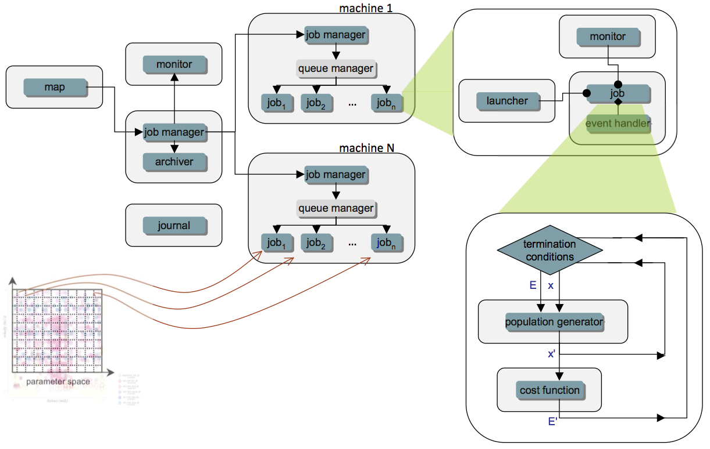

:author: Michael M. McKerns
:email: mmckerns@caltech.edu
:institution: California Institute of Technology

:author: Leif Strand
:email: leif@cacr.caltech.edu
:institution: California Institute of Technology

:author: Tim Sullivan
:email: tjs@caltech.edu
:institution: California Institute of Technology

:author: Alta Fang
:email: altafang@caltech.edu
:institution: California Institute of Technology

:author: Michael A.G. Aivazis
:email: aivazis@caltech.edu
:institution: California Institute of Technology

.. A Framework for Massively-Parallel Optimization
.. and Rigorous Sensitivity Analysis

------------------------------------------------
Building a Framework for Predictive Science
------------------------------------------------

.. class:: abstract

Key questions that scientists and engineers typically want to address can be
formulated in terms of predictive science. Questions such as: "How well does my
computational model represent reality?", "What are the most important
parameters in the problem?", and "What is the best next experiment to perform?"
are fundamental in solving scientific problems. ``mystic`` is a framework for
massively-parallel optimization and rigorous sensitivity analysis that enables
these motivating questions to be addressed quantitatively as global
optimization problems. Often realistic physics, engineering, and materials
models may have hundreds of input parameters, hundreds of constraints, and may
require execution times of seconds or longer. In more extreme cases, realistic
models may be multi-scale, and require the use of high-performance computing
clusters for their evaluation. Predictive calculations, formulated as a global
optimization over a potential surface in design parameter space, may require an
already prohibitively large simulation to be performed hundreds, if not
thousands, of times. The need to prepare, schedule, and monitor thousands of
model evaluations, and dynamically explore and analyze results, is a
challenging problem that requires a software infrastructure capable of
distributing and managing computations on large-scale heterogeneous resources.
In this paper, we present the design behind an optimization framework, and also
a framework for heterogeneous computing, that when utilized together, can make
computationally intractable sensitivity and optimization problems much more
tractable. The optimization framework provides global search algorithms that
have been extended to parallel, where evaluations of the model can be
distributed to appropriate large-scale resources, while the optimizer centrally
manages their interactions and navigates the objective function.  New methods
have been developed for imposing and solving constraints that aid in reducing
the size and complexity of the optimization problem. Additionally, new
algorithms have been developed that launch multiple optimizers in parallel,
thus allowing highly efficient local search algorithms to provide fast global
optimization. In this way, parallelism in optimization also can allow us to not
only find global minima, but to simultaneously find all local minima and
transition points -- thus providing a much more efficient means of mapping out
a potential energy surface.

.. class:: keywords

   predictive science, optimization, uncertainty quantification,
   verification, validation, sensitivity analysis,
   parallel computing, distributed computing, heterogeneous computing

Introduction
------------

.. Briefly introduce UQ/OUQ.
.. Need statement on uncertainty methods, usefulness, and current limitations.

.. Systems where the response function exhibits aleatoric uncertainty (assumed to stem from randomness of the system inputs) are ideal to be described with McDiarmid's inequality as a basis for rigorous sensitivity analysis. Mystic is used to calculate the oscillation of the response function within each partitioned region of input parameter space. By bisecting along the hyperplane normal to the coordinate direction with the largest diameter, regions of critical behavior are iteratively discovered. Using an iterative partitioning scheme, it is demonstrated that arbitrarily sharp upper bounds on the probability of failure can be obtained for systems with aleatoric uncertainty. 

Recently, a unified mathematical framework for the rigorous construction and
solution of uncertainty quantification (UQ) problems was formulated [OSS11]_.
This framework, called Optimal Uncertainty Quantification (OUQ), is based on
the observation that, given a set of assumptions and information about the
problem, there exist optimal bounds on the uncertainties.  These bounds are
obtained as extreme values of well-defined optimization problems that
correspond to extremizing probabilities of failure subject to the constraints
imposed by scenarios compatible with the information set.

.. software intro

An accompanying software framework that implements these rigorous UQ/OUQ methods is now posed.

A rigorous quantification of uncertainty can easily require several thousands
of model evaluations :math:`f(x)`. For all but the smallest of models, this
requires significant clock time -- a model requiring 1 minute of clock time
evaluated 10,000 times in a global optimization will take 10,000 minutes
(:math:`\sim 7` days) with a standard optimizer. Furthermore, realistic models
are often high-dimensional, highly-constrained, and may require several hours
to days even when run on a parallel computer cluster.  For studies of this size
or larger to be feasible, a fundamental shift in how we build optimization
algorithms is required.  The need to provide support for parallel and
distributed computing at the lowest level -- within the optimization algorithm
-- is clear. Standard optimization algorithms must be extended to parallel. The
need for new massively-parallel optimization algorithms is also clear.  If
these parallel optimizers are not also seamlessly extensible to distributed and
heterogeneous computing, then the scope of problems that can be addressed will
be severely limited.

While several robust optimization packages exist [JOP01]_, [KROOO]_, there are
very few that provide massively-parallel optimization [BMM10]_, [EKL02]_, [MAT09]_
-- the most notable effort being DAKOTA [DAKOT]_, which also includes methods
for uncertainty quantification [DAKUQ]_.  A rethinking of optimization
algorithms, from the ground up, is required to dramatically lower the barrier
to massively-parallel optimization and rigorous uncertainty quantification. The
construction and tight integration of a framework for heterogeneous parallel
computing is required to support such optimizations on realistic models. The
goal should be to enable widespread availablility of these tools to scientists
and engineers in all fields.

Several of the component pieces of such a framework for predictive science
already exist, while a few key pieces must be constructed -- furthermore, these
packages must then be assembled and integrated. Python [GVRPY]_ is a natural
integration environment, and is one that readily supports the dynamic nature of
working across heterogeneous resources. By requiring this framework be
pure-Python, many of the barriers to running on a new platform are removed.
``multiprocessing`` [MPROC]_, ``mpi4py`` [MPI4P]_, and ``pp`` [VVPPP]_ are
selected for communication mechanisms, both due to their high level of feature
coverage and their relative ease of installation. NumPy [NUMPY]_ is used for
algorithmic efficiency, and SymPy [SYM11]_ is used to provide an alternate
interface for building constraints.  Many of the optimization algorithms
leverage SciPy [JOP01]_; however like the use of Matplotlib [MATPL]_ for
plotting, SciPy is an optional dependency.

This paper will discuss the modifications to the ``mystic`` [MHA09]_
optimization framework required to provide a simple interface to massively
parallel optimization, and also to the ``pathos`` [MBA10]_ framework for
staging and launching optimizations on heterogeneous resources.  These efforts
leverage ``pyre`` [MAGA1]_ -- an component integration framework for parallel
computing, which has recently been extended to distributed communication and
management with ``hydra`` (part of this development effort). This paper will
also overview a new mathematical framework [OSS11]_, [ALL11]_, [KLL11]_, [LOO08]_ for
the quantification of uncertainties, which provides a formulation of UQ
problems as global optimization problems.

Rigorous Uncertainty Quantification
-----------------------------------

.. Need notational consistency in this section, and the entire paper
.. Need a little bit of intro/setup like UQP1  **DELETE/reduce...**

Following [LOO08]_, we specifically take a *certification* point of view of
uncertainty quantification. For definiteness, we consider systems whose
operation can be described in terms of :math:`N` scalar performance measures
:math:`(Y_1,\ldots,Y_N) = Y \in \mathbb{R}^N`. The response of the system is
taken as *stochastic* due to the intristic randomness of the system, or
randomness in the input parameters defining the operation of the system, or
both. Suppose that the outcome :math:`Y \in A` constitutes a satisfactory
outcome for the system of interest, for some prescribed measureable
*admissible* set :math:`A \subseteq \mathbb{R}^N`.  Hence, we are interested in
determining the *probability of failure* (PoF) :math:`\mathbb{P}[Y \in A^{c}]`.

Evidently, for an upper bound to be useful, it must also be *tight* (i.e. it
must be close to the actual PoF of the system) and accessible by some
combination of laboratory and computational means. In [ALL11]_, [KLL11]_, a
methodology for a rigorous determination of tight upper bounds on the
probability of failure for complex systems is presented, and is summarized
below.

.. Need to clean/reduce repeats below; ensure definitions are good/referenced

We consider a response function :math:`Y = F(X)` that maps controllable system
inputs :math:`X` to performance measures :math:`Y`, and relies on a probability
of failure (PoF) upper bounds of the concentration of measure (CoM) type
[BBL04]_, [LED01]_, [MCD89]_. If McDiarmid's inequality [MCD89]_ (i.e. the bounded
differences inequality) is used to bound PoF, the system may then be certified
on the sole knowledge of ranges of its input parameters -- without *a priori*
knowledge of their probability distributions, its mean performance
:math:`\mathbb{E}[Y] = M` and a certain measure :math:`D_{G} = U` of the spread
of the response, known as *system diameter*, which provides a rigorous
quantitative measure of the uncertainty in the response of the system.

A model is regarded as :math:`Y = F(X)` that approximates the response :math:`Y
= G(X)` of the system. An upper bound on the system diameter -- and thus on the
uncertainty in the response of the system -- then follows from the triangle
inequality :math:`D_{G} \leq D_{F} + D_{G-F}`, and :math:`U = D_{F} + D_{G-F}`
can be taken as a new -- and conservative -- measure of system uncertainty. In
this approach, the total uncertainty of the system is the sum of the *predicted
uncertainty* (i.e. the variability in performance predicted by the model as
quantified by the *model diameter* :math:`D_{F}`), and the *modeling-error
uncertainty* (i.e. the discrepancy between model prediction and experiment as
quantified by the *modeling-error diameter* :math:`D_{G-F}`.

.. **DELETE above in this section ? or merge into the below ?**

In [LOO08]_, PoF upper bounds of the CoM type were formulated by recourse to
McDiarmid's inequality. In its simplest version, this inequality pertains to a
system characterized by :math:`N` real random inputs :math:`X =
(X_1,\ldots,X_N) \in E \subseteq \mathbb{R}^N` and a single real performance
measure :math:`Y \in \mathbb{R}`. Suppose that the function :math:`G :
\mathbb{R}^N \to \mathbb{R}` describes the response function of the system.
Suppose that the system fails when :math:`Y \leq a`, where :math:`a` is a
threshold for the safe operation of the system. Then, a direct application of
McDiarmid's inequality gives the following upper bound on the PoF of the
system:

.. math::
   :label: eqn-intromcd

   \mathbb{P}[G \leq a]    \leq    \exp\left(-2\frac{M^2}{U^2}\right)

where

.. math::
   :label: eqn-introm

   M = (\mathbb{E}[G]-a)_+

is the *design margin* and

.. math::
   :label: eqn-introu

   U = D_{G}

.. D_{G}:=\left\{\sum_{i=1}^N    \sup_{x_1,\ldots,x_n,x_i'}    |G(x_1,\ldots,x_i,\ldots,x_N)-G(x_1,\ldots,x_i',\ldots,x_N)|^2      \right\}^{1/2}

is the *system uncertainty*. In (:ref:`eqn-introu`), :math:`D_{G}` is the
diameter of the response function. From (:ref:`eqn-intromcd`) it follows that
the system is certified if

.. math::

   \exp\left(-2\frac{M^2}{U^2}\right) \leq \epsilon

where :math:`\epsilon` is the PoF tolerance, or, equivalently, if

.. math::
   :label: eqn-introcf

   \text{CF} = \frac{M}{U} \geq \sqrt{\log\sqrt{\frac{1}{\epsilon}}}

where :math:`\text{CF}` is the *confidence factor*. In writing
(:ref:`eqn-introm`) and subsequently, we use the function
:math:`x_+:=\max(0,x)`. We see from the preceding expressions that McDiarmid's
inequality supplies rigorous quantitative definitions of design margin and
system uncertainty. In particular, the latter is measured by *system diameter*
:math:`D_G`, which measures the largest deviation in performance resulting from
arbitrarily large perturbations of one input parameter at a time. Within this
simple framework, rigorous certification is achieved by the determination of
two--and only two--quantities: the *mean performance* :math:`\mathbb{E}[G]` and
the *system diameter* :math:`D_G`.

.. Note that McDiarmid is rigorous, but not optimal.  OUQ is both.
.. Add short discussion on how obtaining D_{i} is an optimization problem.

McDiarmid's inequality is a result in probability theory that provides an upper
bound on the probability that the value of a function depending on multiple
independent random variables deviates from its expected value. A central device
in McDiarmid's inequality is the *diameter* of a function. We begin by
recalling that the *oscillation* :math:`\operatorname{osc}(f,E)` of a real
function :math:`f : E \to \mathbb{R}` over a set :math:`E \in R` is

.. math::
   :label: eqn-introosc

   \operatorname{osc}(f,E) = \sup \{|f(y) - f(x)| \,:\, x,y \in E \}

Thus, :math:`\operatorname{osc}(f,E)` measures the spread of values of
:math:`f` that may be obtained by allowing the independent variables to range
over its entire domain of definition. For functions :math:`f : E \subset
\mathbb{R}^N \to \mathbb{R}` of several real values, component-wise
*suboscillations* can be defined as

.. math::
   :label: eqn-subosc

   \operatorname{osc}_i(f,E) = \sup \{|f(y) - f(x)| \,:\, x,y \in E,\,\, x_{j} = y_{j} \,\,\,\text{for}\,\,\, j \neq i \}

Thus :math:`\operatorname{osc}_i(f,E)` measures the maximum oscillation among
all one-dimensional fibers in the direction of the :math:`i\text{th}`
coordinate. The *diameter* :math:`D(f,E)` of the function :math:`f : E \to
\mathbb{R}` is obtained as the root-mean square of its component-wise
suboscillations:

.. math::
   :label: eqn-diamosc

   D(f,E) = \left( \sum_{i=1}^{n} \operatorname{osc}_{i}^{2}(f,E) \right)^{1/2}

and it provides a measure of the spread of the range of the function. 
Thus (:ref:`eqn-subosc`) also us to regard :math:`\operatorname{osc}_i(f,E)` as
a *subdiameter* of the system corresponding to variable :math:`X_{i}`, where
the subdiameter can be regarded as a measure of uncertainty contributed by the
variable :math:`X_{i}` to the total uncertainty of the system.

.. NOTE: connect ideas here... can refine above with iterative partitioning
   of input parameter space, or can use an optimal theory (OUQ) 
.. OUQ from UQP1

The attractiveness of the McDiarmid CoM approach to UQ relies on the
requirement of tractable information on response functions (sub-diameters) and
measures (independence and mean response). Above, it is described how to "plug"
this information into McDiarmid's concentration inequality to obtain an upper
bound on probabilies of deviation. One may wonder if it is possible to obtain
an "optimal" concentration inequality, especially when the available
information may not necessarily be sub-diameters and mean values. A general
mathematical framework for optimally quantifying uncertainties based only on
available information has been proposed [OSS11]_, and will be summarized here.
Assume, for instance, that one wants to certify that

.. math::
   :label: eqn-ouqpof

   \mathbb{P}[G \geq a]    \leq    \epsilon

based on the information that :math:`\operatorname{osc}_i(G,E) \leq D_{i}`,
:math:`X = (X_{1},\ldots,X_{N})`, :math:`\mathbb{E}[G] \leq 0` and that the
inputs :math:`X_{i}` are independent under :math:`\mathbb{P}`. In this
situation, the optimal upper bound :math:`\mathcal{U}(\mathcal{A}_{MD})` on the
PoF :math:`\mathbb{P}[G \geq a]` is the solution of the following optimization
problem

.. Note should also show the code for ouqupper and ouqamcd (later in paper)

.. math::
   :label: eqn-ouqupper

   \mathcal{U}(\mathcal{A}_{MD}) = \sup_{(f,\mu)\in\mathcal{A}_{MD}} \mu[f(X) \geq a]

subject to constraints provied by the information set

.. math::
   :label: eqn-ouqamcd

   \mathcal{A}_{MD} = \left\{ (f, \mu) \,\middle|\,
       \begin{matrix}
           f \,:\, E_{1} \times \dots \times E_{N} \to \mathbb{R}, \\
           \mu \in \mathcal{M}(E_{1}) \otimes \dots \otimes \mathcal{M}(E_{N}), \\
           \mathbb{E}_{\mu}[f] \leq 0, \\
           \operatorname{osc}_{i}(f,E) \leq D_{i}
       \end{matrix} \right\}
 
where :math:`\mathcal{M}(E_{k})` denotes the set of measures of probability on :math:`E_{k}`. Hence, McDiarmid's inequality is the statement that 

.. math::
   :label: eqn-ouqmcdsoln

   \mathcal{U}(\mathcal{A}_{MD})    \leq    \exp\left(-2\frac{a^2}{\sum_{i=1}^{N} D_{i}^2}\right)

Similarly, for any other set of information :math:`\mathcal{A}`, we have an
optimal (i.e.) least upper bound on the probability of deviation

.. math::
   :label: eqn-ouqgeneral

   \mathcal{U}(\mathcal{A}) = \sup_{(f,\mu)\in\mathcal{A}} \mu[f(X) \geq a]

The idea is that in practical applications, the available information does not
determine :math:`(G,\mathbb{P})` uniquely, but does determine a set
:math:`\mathcal{A}` such that :math:`(G,\mathbb{P}) \in \mathcal{A}` and such
that any :math:`(f,\mathbb{\mu}) \in \mathcal{A}` could *a priori* be
:math:`(G,\mathbb{P})`. This mathematical framework, called optimal uncertainty
quantification (OUQ), is based on the observation that, given a set of
assumptions and information about the problem, there exist optimal bounds on
uncertainties; these are obtained as extreme values of well-defined
optimization problems corresponding to extremizing probabilities of failure, or
of deviations, over the feasible set :math:`\mathcal{A}`. Observe that this
framework does not implicitly impose inappropriate assumptions, nor does it
repudiate relevant information. Indeed, as demonstrated in (:ref:`eqn-ouqamcd`
and :ref:`eqn-ouqmcdsoln`) for the CoM approach, OUQ can pose a problem that
incorporates the assumptions utilized in other common UQ methods (such as
Bayesian inference [LJH99]_) and provide a rigorous optimal bound on the
uncertainties.
 
.. Predominantly, solutions to these uncertainty quantification problems must be performed numerically...
.. [FIXME: mention reduction of OUQ problems to finite-dimensional optimization over product measures composed of weighted Dirac masses. Provide 1-2 key equations that tie directly in to the OUQ code at the end of the paper.]

Although some OUQ problems can be solved analytically, most must be solved
numerically.  To that end, the reduction theorems of [OSS11]_ reduce the
infinite-dimensional feasible set :math:`\mathcal{A}` to a finite-dimensional
subset :math:`\mathcal{A}_{\Delta}` that has the key property that the
objective function (PoF) has the same lower and upper extreme values over
:math:`\mathcal{A}_{\Delta}` as over :math:`\mathcal{A}`.  

For example, the reduction for :math:`\mathcal{A}_{MD}` in (:ref:`eqn-ouqamcd`)
is to pass to measures :math:`\mu = \mu_{1} \otimes \dots \otimes \mu_{N}` such
that each marginal measure :math:`\mu_{i}` is supported on at most two points
of the parameter space :math:`E_{i}`, i.e. :math:`\mu_{i}` is a convex
combination of two Dirac measures (point masses).  Having reduced the set of
feasible measures :math:`\mu`, the set of feasible response functions :math:`f`
is also reduced, since we only care about the values of :math:`f` on the finite
support of :math:`\mu` and nowhere else.

We refer the reader to [OSS11]_ for the more general reduction theorems.  The
essential point is that if the information/constraints take the form of
:math:`n_{i}` inequalities of the form :math:`\mathbb{E}_{\mu_{i}}[\phi_{j}]
\leq 0` (for some test functions :math:`\phi_{j}`) and :math:`n'` inequalities
of the form :math:`\mathbb{E}_{\mu}[\phi_{j}] \leq 0`, then it is enough to
consider :math:`\mu_{i}` with support on :math:`1 + n_{i} + n'` points of
:math:`E_{i}`.

The reduction theorems leave us with a finite-dimensional optimization problem
in which the optimization variables are suitable parametrizations of the
*reduced* feasible scenarios :math:`(f, \mu)`.

A Highly-Configurable Optimization Framework
--------------------------------------------

We have built a robust optimization framework (``mystic``) [MHA09]_ that
incorporates the mathematical framework described in [OSS11]_, and have
provided an interface to prediction, certification, and validation as a
framework service. The ``mystic`` framework provides a collection of
optimization algorithms and tools that lowers the barrier to solving complex
optimization problems. ``mystic`` provides a selection of optimizers, both
global and local, including several gradient solvers.  A unique and powerful
feature of the framework is the ability to apply and configure
solver-independent termination conditions --- a capability that greatly
increases the flexibility for numerically solving problems with non-standard
convergence profiles. All of ``mystic``'s solvers conform to a solver API, thus
also have common method calls to configure and launch an optimization job. This
allows any of ``mystic``'s solvers to be easily swapped without the user having
to write any new code.

The minimal solver interface:

.. code-block:: python

   # the function to be minimized and the initial values
   from mystic.models import rosen as my_model
   x0 = [0.8, 1.2, 0.7]

   # configure the solver and obtain the solution
   from mystic.solvers import fmin
   solution = fmin(my_model, x0)

   Conceptual diagram for an optimizer. The cost function provides a difference metric that accepts input parameters :math:`x` and produces a cost :math:`E`. :label:`fig-optimization`

The criteria for when and how an optimization terminates are of paramount
importance in traversing a function's potential well. Standard optimization
packages provide a single convergence condition for each optimizer. ``mystic``
provides a set of fully customizable termination conditions, allowing the user
to discover how to better navigate the optimizer through difficult terrain.
Optimizers can be further configured through several methods for choosing the
``InitialPoints``.

The expanded solver interface:

.. code-block:: python

   # the function to be minimized and initial values
   from mystic.models import rosen as my_model
   x0 = [0.8, 1.2, 0.7]

   # get monitor and termination condition objects
   from mystic.monitors import Monitor, VerboseMonitor
   stepmon = VerboseMonitor(5)
   evalmon = Monitor()
   from mystic.termination import ChangeOverGeneration
   COG = ChangeOverGeneration()

   # instantiate and configure the solver
   from mystic.solvers import NelderMeadSimplexSolver
   solver = NelderMeadSimplexSolver(len(x0))
   solver.SetInitialPoints(x0)
   solver.SetGenerationMonitor(stepmon)
   solver.SetEvaluationMonitor(evalmon)
   solver.Solve(my_model, COG)

   # obtain the solution
   solution = solver.bestSolution

   # obtain diagnostic information
   function_evals = solver.evaluations
   iterations = solver.generations
   cost = solver.bestEnergy

   # modify the solver configuration, and continue
   COG = ChangeOverGeneration(tolerance=1e-8)
   solver.Solve(my_model, COG)

   # obtain the new solution
   solution = solver.bestSolution

.. 'optimization' and 'custom' figures need centering
.. also mention "model" in 'custom' figure?

``mystic`` provides progress monitors that can be attached to an optimizer to
track progress of the fitted parameters and the value of the cost function.
Additionally, monitors can be customized to track the function gradient or
other progress metrics. Monitors can also be configured to record either
function evaluations or optimization iterations (i.e. *generations*).  For
example, using ``VerboseMonitor(5)`` in the ``SetGenerationMonitor`` method
will print the ``bestEnergy`` to ``stdout`` every five generations.

   Optimization analysis viewers available in ``mystic``. :label:`fig-viewers`

   Basic components provided in the optimizer toolkit. Several wrapper classes are also provided for binding components, while factory classes are provided for generating components. :label:`fig-custom`

.. also mention factory and wrapper tools(?)
   monitorWrapper, functionWrapper... ?

Constraints Toolkit
-------------------

.. Need notational consistency. Need connection to OUQ notation.

``mystic`` provides a method to constrain optimization to be within an
:math:`N`-dimensional box on input space, and also a method to impose
user-defined parameter constraint functions on any cost function.  Thus, both
*bounds constraints* and *parameter constraints* can be generically applied to
any of ``mystic``'s unconstrained optimization algorithms. Traditionally,
constrained optimization problems tend to be solved iteratively, where a
penalty is applied to candidate solutions that violate the constraints.
Decoupling the solving of constraints from the optimization problem can greatly
increase the efficiency in solving highly-constrained nonlinear problems --
effectively, the optimization algorithm only selects points that satisfy the
constraints. Constraints can be solved numerically or algebraically, where the
solving of constraints can itself be cast as an optimization problem.
Constraints can also be dynamically applied, thus altering an optimization in
progress.

Penalty-based methods indirectly modify the candidate solution by applying a
change in energy :math:`\Delta E = k \cdot p(\vec{x})` to the unconstrained
cost function :math:`f(\vec{x})` when the constraints are violated. The
modified cost function :math:`\phi` is thus written as:

.. math::
   :label: eqn-penaltycon

   \phi(\vec{x}) = f(\vec{x}) + k \cdot p(\vec{x})

Set-based methods directly modify the candidate solution by applying a
constraints solver :math:`c` that ensures the optimizer will always select from
a set of candidates that satisfy the constraints. The constraints solver has an
interface :math:`{\vec{x}\,}' = c(\vec{x})`, and the cost function becomes:

.. math::
   :label: eqn-directcon

   \phi(\vec{x}) = f(c(\vec{x}))

Adding parameter constraints to a solver is as simple as building a constraints
function, and using the ``SetConstraints`` method. Additionally, simple bounds
constraints can also be applied through the ``SetStrictRanges`` method:

.. code-block:: python

   # a user-provided constraints function
   def constrain(x):
     x[1] = x[0]
     return x

   # the function to be minimized and the bounds
   from mystic.models import rosen as my_model
   lb = [0.0, 0.0, 0.0]
   ub = [2.0, 2.0, 2.0]

   # get termination condition object
   from mystic.termination import ChangeOverGeneration
   COG = ChangeOverGeneration()

   # instantiate and configure the solver
   from mystic.solvers import NelderMeadSimplexSolver
   solver = NelderMeadSimplexSolver(len(x0))
   solver.SetRandomInitialPoints(lb, ub)
   solver.SetStrictRanges(lb, ub)
   solver.SetConstraints(constrain)
   solver.Solve(my_model, COG)

   # obtain the solution
   solution = solver.bestSolution

.. solver.SetPenalty(penalty)

``mystic`` provides a simple interface to a lot of underlying complexity --
thus allowing a non-specialist user to easily access optimizer configurability
and high-performance computing without a steep learning curve. This feature
must also be applied to the application of constraints on a function or
measure. The natural syntax for a constraint is one of symbolic math, hence
``mystic`` leverages SymPy [SYM11]_ to construct a symbolic math parser for the
translation of the user's input into functioning constraint code objects:

.. code-block:: python

   # a user-provided constraints function
   constraints = """
   x2 = x1
   """
   from mystic.constraints import parse
   constrain = parse(constraints)

The constraints parser is a constraints factory method that can parse multiple
and nonlinear constraints, hard or soft (i.e. ":math:`\sim`") constraints, and
equality or inequality (i.e. ":math:`>`") constraints.

.. mention penalty factories and methods

Similar tools exist for creating penalty functions, including a ``SetPenalty``
method for solvers. Available penalty methods include the exterior penalty
function method [VEN09]_, the augmented Lagrange multiplier method [KSK94]_,
and the logarithmic barrier method [JJB03]_. At the low-level, penalty
functions are bound to the cost function using ``mystic``'s ``functionWrapper``
method.

.. Note: A penalty function may be able to be built "external" to the solver,
   as has been done with 'constraints_func'... SetPenalty(penalty_func).
   Howerver, it may not be easily separable from the solver
   (i.e. depends heavily on solver internals, where a dummy solver instance
   as used in termination conditions is not sufficient).
   If not separable, then we have... SetPenalty(constraints_func, method).

It is worth noting that the use of a constraints solver :math:`c` does not
require the constraints be bound to the cost function. The evaluation of the
constraints are decoupled from the evaluation of the cost function -- hence,
with ``mystic``, highly-constrained optimization decomposes to the solving of
:math:`K` independent constraints, followed by an unconstrained optimization
over only the set of valid points. This method has been shown effective for
solving optimization problems where :math:`K \approx 200` [OSS11]_.

Seamless Migration to Parallel Computing
----------------------------------------

``mystic`` is built from the ground up to utilize parallel and distributed
computing. The decomposition of optimization algorithms into their component
parts allow this decomposition to not only be in an abstraction layer, but
across process-space. ``mystic`` provides a ``modelFactory`` method that
convers a user's model to a *service*. We define a service to be an entity that
is callable by globally unique identifier. Services can also be called by
proxy. In ``mystic``, services also include infrastructure for monitoring and
handling events. An optimization is then composed as a network of interacting
services, with the most common being the user's model or cost function being
mapped over parallel resources.

``mystic`` provides several stock models and model factories that are useful for testing:

.. code-block:: python

   # generate a model from a stock 'model factory'
   from mystic.models.lorentzian import Lorentzian
   lorentz = Lorentzian(coeffs)

   # evaluate the model
   y = lorentz(x) 

   Conceptual diagram for a service-based model. Here, the job is the fundamental commodity of work, and is the object on which the service is based -- in ``mystic``, this is typically the user's model or a cost function. Services have a global unique identifier, and thus can easily be called by proxy. Note that services may not be located on the machine that requested the service be spawned. Services also can be imbued with infrastructure for monitoring and handling events. Monitors write to a stream that can be piped into another object, such as a logger or one of ``mystic``'s viewers. :label:`fig-service`

Model factory methods insert ``pathos`` infrastructure, thus casting a model as
a callable *service* that has been imbued with ``pathos`` infrastructure as
shown in Figure (:ref:`fig-service`). The default ``launcher`` and ``map``
included in ``mystic`` are functionally equivalent to execution and ``map``
within the standard Python distribution.  Any user-provided function can be
cast as a service through the use of a ``modelFactory``:

.. code-block:: python

   # a user-provided model function
   def identify(x)
     return x

   # add pathos infrastructure (included in mystic)
   from mystic.tools import modelFactory, Monitor
   evalmon = Monitor()
   my_model = modelFactory(identify, monitor=evalmon)

   # evaluate the model
   y = my_model(x)

   # evaluate the model with a map function
   from mystic.tools import PythonMap
   my_map = PythonMap()
   z = my_map(my_model, range(10))

.. NOTE: defaults: launcher='python', monitor=Null()
.. NOTE: PythonMap is just python's map

   Use of a ``modelFactory`` to cast a user's model :math:`F(x)` as a service. The model and experimental data :math:`G` are then bound with a ``costFactory`` to produce a cost function. A ``costFactory`` can accept a raw user's model, a model proxy, or a model service (as shown here). A typical metric is :math:`|F(x) - G|^{2}`.  :label:`fig-modelfactory`

A Framework for Heterogeneous Computing
---------------------------------------

We have developed a computational job management framework (``pathos``)
[MBA10]_ that offers a simple, efficient, and consistent user experience in a
variety of heterogeneous environments from multi-core workstations to networks
of large-scale computer clusters. ``pathos`` provides a single environment for
developing and testing algorithms locally -- and enables the user to execute
the algorithms on remote clusters, while providing the user with full access to
their job history. ``pathos`` primarily provides the communication mechanisms
for configuring and launching parallel computations across heterogenous
resources. ``pathos`` provides stagers and launchers for parallel and
distributed computing, where each launcher contains the syntactic logic to
configure and launch jobs in an execution environment. Some examples of
included launchers are: a queue-less MPI-based launcher, a SSH-based launcher,
and a ``multiprocessing`` launcher. ``pathos`` also provides a map-reduce
algorithm for each of the available launchers, thus greatly lowering the
barrier for users to extend their code to parallel and distributed resources.
``pathos`` provides the ability to interact with batch schedulers and queuing
systems, thus allowing large computations to be easily launched on
high-performance computing resources. One of the most powerful features of
``pathos`` is ``sshTunnel``, which enables a user to automatically wrap any
distributed service calls within an SSH tunnel.

``pathos`` is divided into four subpackages: ``dill`` (a utility for
serialization of Python objects), ``pox`` (utilities for filesystem exploration
and automated builds), ``pyina`` (a MPI-based parallel mapper and launcher),
and ``pathos`` (distributed parallel map-reduce and SSH communication).

``pathos`` utilizes ``pyre``, which provides tools for connecting components
and managing their interactions. The core component used by ``pathos`` is a
service -- a callable object with a configurable connection mechanism. A
service can utilize ``Launcher`` and ``Monitor`` objects (which provide
abstraction to execution and logging, respectively), as well as ``Strategy``
objects (which provide abstraction patterns for coupling services). A standard
interface for services enables massively parallel applications that utilize
distributed resources to be constructed from a few simple building blocks.  A
``Launcher`` contains the logic required to initiate execution on the current
execution environment. The selection of launcher will determine if the code is
submitted to a batch queue, run across SSH tunneled RPC connections, or run
with MPI on a multiprocessor.  A ``Strategy`` provides an algorithm to
distribute the workload among available resources. Strategies can be static or
dynamic. Examples of static strategies include the ``equalportion`` strategy
and the ``carddealer`` strategy. Dynamic strategies are based on the concept of
a worker ``pool``, where there are several workload balancing options to choose
from.  Strategies and launchers can be coupled together to provide higher-level
batch and parallel-map algorithms. A ``Map`` interface allows batch processing
to be decoupled from code execution details on the selected platforms, thus
enabling the same application to be utilized for sequential, parallel, and
distributed parallel calculations.

Globally Unique Message Passing
---------------------------------------

We must design for the case where an optimizer's calculation spans multiple
clusters, with a longevity that may exceed the uptime of any single cluster or
node.  ``hydra`` enables any Python object to obtain a network address. After
obtaining an address, an object can asynchronously exchange messages with other
objects on the network.  Through the use of proxy objects, sending messages to
remote objects is easy as calling an instance method on a local object.  A call
to a proxy transparently pickles the function name along with the arguments,
packages the message as a datagram, and sends it over the network to the remote
object represented by the proxy.  On the recieving end, there is a mechanism
for responding to the sender of the current message. Since message sending is
asynchronous, an object responds to a message by sending another message.

The ``modelFactory`` method essentially provides ``mystic`` with a high-level
interface for a ``pathos`` server, with an option to bind a monitor directly to
the service.  The lower-level construction of a distributed service, using
SSH-based communication, is as follows:

.. code-block:: python

   # a user-provided model function
   def identify(x)
     return x

   # cast the model as a distributed service
   from pathos.servers import sshServer
   id = 'foo.caltech.edu:50000:spike42'
   my_proxy = sshServer(identify, server=id)

   # evaluate the model via proxy
   y = my_proxy(x)

Parallel map functions are built around available launchers, providing a
high-level interface to launching several copies of a model in parallel. The
creation of a parallel map that will draw from a pool of two local workers and
all available IPC servers at ``'foo.caltech.edu'`` is shown below:

.. code-block:: python

   # a user-provided model function
   def identify(x)
     return x

   # select and configure a parallel map
   from pathos.maps import ipcPool
   my_map = ipcPool(2, servers=['foo.caltech.edu'])

   # evaluate the model in parallel
   z = my_map(identify, range(10))

.. number of 'local' workers = 2
.. serviceFactory (?) and PythonMap (from pathos) are included in mystic

.. figure:: jobmanagement2.png

   Conceptual diagram for heterogeneous job management. A distributed parallel map function is used to copy a service :math:`n` times on :math:`N` machines. If the object being mapped is not a service, then the services manager is omitted from the diagram -- the jobs still undergo a distributed launch, but are managed at the machine level. :label:`fig-jobmanagement`

Serialization
---------------------------------------

``dill`` extends Python's ``pickle`` module for serializing and de-serializing
Python objects to the majority of the built-in Python and NumPy types.
Serialization is the process of converting an object to a byte stream, the
inverse of which is converting a byte stream back to a Python object hierarchy.

``dill`` provides the user the same interface as the ``pickle`` module, and
also includes some additional features. In addition to pickling Python objects,
``dill`` provides the ability to save the state of an interpreter session in a
single command. Hence, it would be feasible to save a interpreter session,
close the interpreter, ship the pickled file to another computer, open a new
interpreter, unpickle the session and thus continue from the "saved" state of
the original interpreter session.

.. ``dill`` can be used to store Python objects to a file, but the primary usage is to send Python objects across the network as a byte stream. ``dill`` is quite flexible, and allows arbitrary user defined classes and funcitons to be serialized. Thus, ``dill`` is not intended to be secure against erroneously or maliciously constructed data. It is left to the user to decide whether the data they unpickle is from a trustworthy source.

Filesystem Interaction
---------------------------------------

``pox`` provides a collection of utilities for navigating and manipulating
filesystems. This module is designed to facilitate some of the low level
operating system interactions that are useful when exploring a filesystem on a
remote host, where queries such as "what is the root of the filesystem?", "what
is the user's name?", and "what login shell is preferred?" become essential in
allowing a remote user to function as if they were logged in locally. While
``pox`` is in the same vein of both the ``os`` and ``shutil`` built-in modules,
the majority of its functionality is unique and compliments these two modules.

``pox`` provides Python equivalents of several unix shell commands such as
"which" and "find". These commands allow automated discovery of what has been
installed on an operating system, and where the essential tools are located.
This capability is useful not only for exploring remote hosts, but also locally
as a helper utility for automated build and installation.

Several high-level operations on files and filesystems are also provided.
Examples of which are: finding the location of an installed Python package,
determining if and where the source code resides on the filesystem, and
determining what version the installed package is.

``pox`` also provides utilities to enable the abstraction of commands sent to a
remote filesystem. In conjunction with a registry of environment variables and
installed utilites, ``pox`` enables the user to interact with a remote
filesystem as if they were logged in locally.

Distributed Staging and Launching
----------------------------------

``pathos`` provides methods for configuring, launching, monitoring, and
controlling a service on a remote host. One of the most basic features of
``pathos`` is the ability to configure and launch a IPC-based service on a
remote host. ``pathos`` seeds the remote host with a small ``portpicker``
script, which allows the remote host to inform the localhost of a port that is
available for communication.

Beyond the ability to establish a IPC service, and then post requests, is the
ability to launch code in parallel. Unlike parallel computing performed at the
node level (typically with MPI), ``pathos`` enables the user to launch jobs in
parallel across heterogeneous distributed resources. ``pathos`` provides a
distributed map-reduce algorithm, where a mix of local processors and
distributed IPC services can be selected. ``pathos`` also provides a very basic
automated load balancing service, as well as the ability for the user to
directly select the resources.

A high-level interface is provided which yields a map-reduce implementation
that hides the IPC internals from the user. For example, with ``ipcPool``, the
user can launch their code as a distributed parallel service, using standard
Python and without writing a line of server or parallel batch code. ``pathos``
also provides tools to build a custom ``Map``. In following code, the map is
configured to ``'autodetect'`` the number of processors, and only run on the
localhost:

.. code-block:: python

   # configure and build map
   from pathos.launchers import ipc
   from pathos.strategies import pool
   from pathos.tools import mapFactory
   my_map = mapFactory(launcher=ipc, strategy=pool)

.. defaults: nproc='autodetect'='*'; servers=()

IPC servers and communication in general is known to be insecure. However,
instead of attempting to make the IPC communication itself secure, ``pathos``
provides the ability to automatically wrap any distributes service or
communication in an SSH tunnel. SSH is a universally trusted method. Using
``sshTunnel``, ``pathos`` has launched several distributed calculations on
clusters at National Laboratories, and to date has performed test calculations
that utilize node-to-node communication between two national lab clusters and a
user's laptop. ``pathos`` allows the user to configure and launch at a very
atomistic level, through raw access to ``ssh`` and ``scp``.  Any distributed
service can be tunneled, therefore less-secure methods of communication can be
provided with secure authentication:

.. code-block:: python

   # establish a tunnel
   from pathos.tunnel import sshTunnel
   uid = 'foo.caltech.edu:12345:tunnel69'
   tunnel_proxy = sshTunnel(uid)

   # inspect the ports
   localport = tunnel_proxy.lport
   remoteport = tunnel_proxy.rport
  
   # a user-provided model function
   def identify(x)
     return x

   # cast the model as a distributed service
   from pathos.servers import ipcServer
   id = 'localhost:%s:bug01' % localport
   my_proxy = ipcServer(identify, server=id)

   # evaluate the model via tunneled proxy
   y = my_proxy(x)

   # disconnect the tunnel
   tunnel_proxy.disconnect()

.. NOTE: shorter is
.. # do something...
   sys.stdin.readline()
.. NOTE: tunnel_proxy.connect()

Parallel Staging and Launching
-------------------------------

The ``pyina`` package provides several basic tools to make MPI-based
high-performance computing more accessable to the end user. The goal of
``pyina`` is to allow the user to extend their own code to MPI-based
high-performance computing with minimal refactoring.

The central element of ``pyina`` is the parallel map-reduce algorithm.
``pyina`` currently provides two strategies for executing the parallel-map,
where a strategy is the algorithm for distributing the work list of jobs across
the availble nodes. These strategies can be used "in-the-raw" (i.e. directly)
to provide map-reduce to a user's own MPI-aware code. Further, ``pyina``
provides several map-reduce implementations that hide the MPI internals from
the user. With these ``Map`` objects, the user can launch their code in
parallel batch mode -- using standard Python and without ever having to write a
line of Parallel Python or MPI code.

There are several ways that a user would typically launch their code in
parallel -- directly with ``mpirun`` or ``mpiexec``, or through the use of a
scheduler such as torque or slurm. ``pyina`` encapsulates several of these
launching mechanisms as ``Launchers``, and provides a common interface to the
different methods of launching a MPI job.  In the following code, a custom
``Map`` is built to execute MPI locally (i.e. not to a scheduler) using the
``carddealer`` strategy:

.. code-block:: python

   # configure and build map
   from pyina.launchers import mpirun
   from pyina.strategies import carddealer as card
   from pyina.tools import mapFactory
   my_map = mapFactory(4, launcher=mpirun, strategy=card)

.. from pyina.helpers import pickler  # was ez_map2 [None = raw mpi4py]
.. from pyina.schedulers import torque

New Massively-Parallel Optimization Algorithms
----------------------------------------------

In ``mystic``, optimizers have been extended to parallel whenever possible. To
have an optimizer execute in parallel, the user only needs to provide the
solver with a parallel map.  For example, extending the Differential Evolution
[SKP95]_ solver to parallel is involves passing a ``Map`` to the
``SetEvaluationMap`` method. In the example below, each generation has
:math:`20` candidates, and will execute in parallel using MPI with :math:`4`
workers:

.. code-block:: python

   # the function to be minimized and the bounds
   from mystic.models import rosen as my_model
   lb = [0.0, 0.0, 0.0]
   ub = [2.0, 2.0, 2.0]

   # get termination condition object
   from mystic.termination import ChangeOverGeneration
   COG = ChangeOverGeneration()

   # select the parallel launch configuration
   from pyina.maps import MpirunCarddealer
   my_map = MpirunCarddealer(4)

   # instantiate and configure the solver
   from mystic.solvers import DifferentialEvolutionSolver
   solver = DifferentialEvolutionSolver(len(lb), 20)
   solver.SetRandomInitialPoints(lb, ub)
   solver.SetStrictRanges(lb, ub)
   solver.SetEvaluationMap(my_map)
   solver.Solve(my_model, COG)

   # obtain the solution
   solution = solver.bestSolution

   Conceptual diagram for a ``carddealer-DE`` optimizer. The optimizer contains a map function that stages :math:`n` copies of the user's model :math:`F(x)` in parallel across distributed resources. :label:`fig-desolver`

Another type of new parallel solver utilizes the ``SetNestedSolver`` method to
stage a parallel launch of :math:`N` optimizers, each with different initial
conditions. The following code shows the ``BuckshotSolver`` scheduling a launch
of :math:`N=20` optimizers in parallel to the default queue, where :math:`5`
nodes each with :math:`4` processors have been requested:

.. code-block:: python

   # the function to be minimized and the bounds
   from mystic.models import rosen as my_model
   lb = [0.0, 0.0, 0.0]
   ub = [2.0, 2.0, 2.0]

   # get monitor and termination condition objects
   from mystic.monitors import LoggingMonitor
   stepmon = LoggingMonitor(1, 'log.txt')
   from mystic.termination import ChangeOverGeneration
   COG = ChangeOverGeneration()

   # select the parallel launch configuration
   from pyina.maps import TorqueMpirunCarddealer
   my_map = TorqueMpirunCarddealer('5:ppn=4')

   # instantiate and configure the nested solver
   from mystic.solvers import PowellDirectionalSolver
   my_solver = PowellDirectionalSolver(len(lb))
   my_solver.SetStrictRanges(lb, ub)
   my_solver.SetEvaluationLimits(50)

   # instantiate and configure the outer solver
   from mystic.solvers import BuckshotSolver
   solver = BuckshotSolver(len(lb), 20)
   solver.SetRandomInitialPoints(lb, ub)
   solver.SetGenerationMonitor(stepmon)
   solver.SetNestedSolver(my_solver)
   solver.SetSolverMap(my_map)
   solver.Solve(my_model, COG)

   # obtain the solution
   solution = solver.bestSolution

.. Note: default: queue=None='automatic'
.. Note: the outer solver pulls configuration from the nested solver methods, and then stages and launches 'N' new instances of the solver in parallel.
.. Note: the inner solver may already have been run, since mystic's solvers can be restarted from information contained within the solver instance.

   Conceptual diagram for a ``lattice-Powell`` optimizer. :math:`N` Powell's local-search optimizers are launched in parallel, with each optimizer starting from the center of a different lattice cuboid in parameter space. A ``buckshot-Powell`` optimizer is similar; however, instead utilizes a uniform random distribution of initial values.  :label:`fig-batchgrid`

.. #figure:: potentialsurface.png

.. Conceptual diagram for fast exploration of a potential surface. :label:`fig-potentialsurface`

Probability and Uncertainty Tooklit
-----------------------------------

The software framework presented in this paper was designed to solve UQ
problems. Calculation of the upper and lower bounds for probability of failure
is provided as a framework service. The McDiarmid subdiameter is a model-based
measure of sensitivity, and is cast within ``mystic`` as a global optimization.
Diameter calculations can be coupled with partitioning algorithms, and used to
discover regions of critical behavior. Optimization over probability measures
is also available as a framework service, and is utilized in (OUQ) calculations
of optimal bounds.

The minimization or maximization of a cost function is the basis for performing
most calculations in ``mystic``. The optimizer generates new trial parameters,
which are evaluated in a user-provided model function against a user-provided
metric. Two simple difference metrics provided are:
:math:`metric = | F(x) - G |^2`, where :math:`F` is the model function
evaluated at some trial set of fit
parameters :math:`\cal P`, and :math:`G` is the corresponding experimental data
-- and :math:`metric = | F(x) - F(y) |^2`, where :math:`x` and :math:`y` are
two slightly different sets of input parameters (:ref:`eqn-subosc`).

``mystic`` provides factory methods to automate the generation of a cost
function from a user's model. Conceptually, a ``costFactory`` is as follows:

.. code-block:: python

   # prepare a (F(X) - G)**2 a metric
   def costFactory(my_model, my_data):
     def cost(param):

       # compute the cost
       return ( my_model(param) - my_data )**2

     return cost

.. NOTE: UQ like a "NestedSolver", cycle over "xi'"

.. figure:: partitioning.png

   Coupling an iterative partitioning algorithm with a sensitivity calculation enables the discovery of critical regions in parameter space. :label:`fig-partitioning`

Suboscillations (:ref:`eqn-subosc`), used in calculations of rigorous
sensitivity (such as :math:`D_{i} / D`), can also be cast as a cost metric:

.. code-block:: python

   # prepare a (F(X) - F(X'))**2 cost metric
   def suboscillationFactory(my_model, i):

     def cost(param):

       # get X and X' (Xi' is appended to X at param[-1])
       x       = param[:-1]
       x_prime = param[:i] + param[-1:] + param[i+1:-1]

       # compute the suboscillation
       return -( my_model(x) - my_model(x_prime) )**2

     return cost

The diameter :math:`D` (:ref:`eqn-diamosc`) is the root-mean square of its
component-wise suboscillations.  The calculation of the diameter is performed
as a nested optimization, as shown above for the ``BuckshotSolver``. Each inner
optimization is a calculation of a component suboscillation, using the a global
optimizer (such as ``DifferentialEvolutionSolver``) and the cost metric shown
above.

The optimization algorithm takes a set of model parameters :math:`\cal P` and
the current measure of oscillation :math:`O({\cal P})` as inputs, and produces
an updated :math:`\cal P`. The optimization loop iterates until the termination
conditions are satisfied.

When the global optimization terminates the condition :math:`O({\cal P}) <
-(osc^2_i + \epsilon)` is satisfied, and the final set :math:`{\cal P}` is
composed of :math:`X` and :math:`{X}'`.

.. Mystic provides methods for detecting regions of critical behavior in multidimensional parameter space [XXXXX]. Systems where the response function exhibits aleatoric uncertainty (assumed to stem from randomness of the system inputs) are ideal for the application of McDiarmid's inequality as a basis for rigorous sensitivity analysis. Mystic is used to calculate the oscillation of the response function within each partitioned region of input parameter space. By bisecting along the hyperplane normal to the coordinate direction with the largest diameter, regions of critical behavior are iteratively discovered. Using an iterative partitioning scheme, it is demonstrated that arbitrarily sharp upper bounds on the probability of failure can be obtained for systems with aleatoric uncertainty [XXXXX].

.. NOTE: OUQ like a "Solver" w/ constraints, but over probability measures

OUQ problems can be thought of optimization problems where the goal is to find
the global maximum of a probability function :math:`\mu[H \leq 0]`, where
:math:`H \leq 0` is a failure criterion for the model response function
:math:`H`.  Additional conditions in an OUQ problem are provided as constraints
on the information set. Typically, a condition such as a mean constraint on
:math:`H`, :math:`m_{1} \leq \mathbb{E}_{\mu}[H] \leq m_{2}`, will be imposed
on the maximization.  After casting the OUQ problem in terms of optimization
and constraints, we can plug these terms into the infrastructure provided by
``mystic``.

.. The natural metric for :math:`\cal{P}[H = 0]` is the optimization criteria, hence we select the evaluation of :math:`\mu[H = 0]` as the cost function.

Optimal uncertainty quantification (OUQ) is maximization over a probability
distribution, and not over a standard difference metric. Therefore the
fundamental data structure is not the user-provided model function, but is a
user-configured probability measure. For example, a discrete measure is
represented by a collection of support points, each with an accompanying
weight. Measures come with built-in methods for calculating the mass, range,
and mean of the measure, and also for imposing a mass, range, and mean on the
measure. Measures also have some very basic operations, including point
addition and subtraction, and the formation of product measures.

.. NOTE: could use ouq2.png, which is the "4-cube" picture

.. figure:: ouq.png

   Optimal uncertainty quantification is an optimization of probability measures over design parameter space. Collapse of probability masses corresponds to the determination of the critical design parameters. :label:`fig-ouq`

Global optimizations used in solving OUQ problems are composed in the same
manner as shown above for the ``DifferentialEvolutionSolver``. The cost
function, however, is not formulated as in the examples above -- OUQ is an
optimization over product measures, and thus uses ``mystic``'s
``product_measure`` class as the target of the optimization.  Also as shown
above, the bounds constraints are imposed with the ``SetStrictRanges`` method,
while parameter constraints (composed as below) are imposed with the
``SetConstraints`` method. The union set of these constraints defines the set
:math:`\mathcal{A}`.

.. add :math: for \mathcal{M}(E_{k}) in terms weights and positions
.. \operatorname{osc}_{i}(f,E) \leq D_{i}

So for example, let us define the feasable set

.. math:: 
   :label: eqn-mathcala

   \mathcal{A} = \left\{ (f, \mu) \,\middle|\,
       \begin{matrix}
           f = \tt{my\_model} \,:\, \prod_{i=1}^{3} [\tt{lb}_{i}, \tt{ub}_{i}] \to \mathbb{R}, \\
           \mu = \bigotimes_{i=1}^{3} \mu_{i} \in \bigotimes_{i=1}^{3} \mathcal{M}([\tt{lb}_{i}, \tt{ub}_{i}]), \\
           \tt{m}_{\tt{lb}} \leq \mathbb{E}_{\mu}[f] \leq \tt{m}_{\tt{ub}}
       \end{matrix} \right\}

which reduces to the finite-dimensional subset

.. math:: 
   :label: eqn-mathcaladelta

   \mathcal{A}_{\Delta} = \left\{ (f, \mu) \in \mathcal{A} \,\middle|\,
       \begin{matrix}
           \text{for } \vec{x} \text{ and } \vec{y} \in \prod_{i=1}^{3} [\tt{lb}_{i}, \tt{ub}_{i}], \\
           \text{and } \vec{w} \in [0, 1], \\
           \mu_{i} = w_{i} \delta_{x_{i}} + (1 - w_{i}) \delta_{y_{i}}
       \end{matrix} \right\}

where :math:`\vec{x} = \text{some }(x_{1}, x_{2}, x_{3})`,
:math:`\vec{y} = \text{some }(y_{1}, y_{2}, y_{3})`,
and :math:`\vec{w} = \text{some }(w_{1}, w_{2}, w_{3})`.

To solve this OUQ problem, we first write the code
for the bounds, cost function, and constraints -- then
we plug this code into a global optimization script,
as noted above.

OUQ requires the user provide a list of bounds that follow the
formatting convention that ``mystic``'s ``product_measure.load``
uses to build a product measure from a list of input parameters.
This roughly follows the definition of a product measure as
shown in equation (:ref:`eqn-mathcaladelta`),
and also is detailed in the comment block below:

.. code-block:: python

   # OUQ requires bounds in a very specific form...
   # param = [wxi]*nx + [xi]*nx \
   #       + [wyi]*ny + [yi]*ny \
   #       + [wzi]*nz + [zi]*nz
   npts = (nx,ny,nz)
   lb = (nx * w_lower) + (nx * x_lower) \
      + (ny * w_lower) + (ny * y_lower) \
      + (nz * w_lower) + (nz * z_lower)
   ub = (nx * w_upper) + (nx * x_upper) \
      + (ny * w_upper) + (ny * y_upper) \
      + (nz * w_upper) + (nz * z_upper)

The constraints function and the cost function
typically require the use of measure mathematics.
In the example below, the constraints check if
``measure.mass`` :math:`\approx 1.0`; if not,
the the measure's mass is normalized to :math:`1.0`.
The second block of constraints below check if
:math:`m_{1} \leq \mathbb{E}_{\mu}[H] \leq m_{2}`,
where :math:`m_{1} =` ``target_mean`` :math:`-` ``error``
and :math:`m_{2} =` ``target_mean`` :math:`+` ``error``;
if not, an optimization is performed to satisfy
this mean constraint.
The ``product_measure`` is built (with ``load``)
from the optimization parameters ``param``, and
after all the constraints are applied, ``flatten``
is used to extract the updated ``param``:

.. code-block:: python

   from mystic.math.measures import split_param
   from mystic.math.dirac_measure import product_measure
   from mystic.math import almostEqual

   # split bounds into weight-only & sample-only
   w_lb, m_lb = split_param(lb, npts)
   w_ub, m_ub = split_param(ub, npts)

   # generate constraints function
   def constraints(param):
     prodmeasure = product_measure()
     prodmeasure.load(param, npts)

     # impose norm on measures
     for measure in prodmeasure:
       if not almostEqual(float(measure.mass), 1.0):
         measure.normalize()

     # impose expectation on product measure
     E = float(prodmeasure.get_expect(my_model))
     if not (E <= float(target_mean + error)) \
     or not (float(target_mean - error) <= E):
       prodmeasure.set_expect((target_mean, error), \
                              my_model, (m_lb, m_ub))

     # extract weights and positions
     return prodmeasure.flatten()

The PoF is calculated in the cost function with the ``pof`` method:

.. code-block:: python

   # generate maximizing function
   def cost(param):
     prodmeasure = product_measure()
     prodmeasure.load(param, npts)
     return MINMAX * prodmeasure.pof(my_model)

We find the *supremum* (as in :ref:`eqn-ouqgeneral`) when ``MINMAX=-1`` and,
upon solution, the function maximum is ``-solver.bestEnergy``. We find the
*infimum* when ``MINMAX=1`` and, upon solution, the function minimum is
``solver.bestEnergy``.

Future Developments
-------------------

Many of the features presented above are not currently in released versions of
the code. Of primary importance is to migrate these features from development
branches to a new release.

The next natural question beyond "what is the sensitivity of a model to an
input parameter?" is "how does the correlation between input parameters affect
the outcome of the model?". Methods for calculating parameter correlation will
be very useful in analysis of results. Another natural question is how to
handle uncertainty in the data.

New partitioning algorithms for the discovery of regions of critical behavior
will be added to ``mystic``. Currently the only partitioning rule drives the
optimizer toward partitioning space such that the upper bounds of a
"piecewise-McDiarmid" type are iteratively tightened [STM11]_. We will extend
the partitioning algorithm not to refine the diameter, but to discover regions
where the diameters meet a set of criteria (such as: regions where there are
two roughly equal subdiameters that account for 90% or more of the total
diameter (i.e. automated discovery of regions where two parameters compete to
govern the system behavior). ``mystic`` will also further expand its base of
available statistical and measure methods, equation solvers, and also make
available several more traditional uncertainty quantification methods.
``mystic`` will continue to expand its base of optimizers, with particular
emphasis on new optimization algorithms that efficiently utilize parallel
computing. ``mystic`` currently has a few simple parallel optimization
algorithms, such as the ``LatticeSolver`` and ``BuckshotSolver`` solvers;
however, algorithms that utilize a variant of game theory to do speculation
about future iterations (i.e. break the paradigm of an iteration being a
blocker to parallelism), or use parallelism and dynamic constraints to allow
optimizers launched in parallel to avoid finding the same minimum twice, are
planned. Parallelism in optimization also allows us to not only find the global
minima, but to simultaneously find all local minima and transition points --
thus providing a much more efficient means of mapping out a potential energy
surface. Solving uncertainty quantification problems requires a lot of
computational resources and often must require a minimum of both model
evaluations and accompanying experiments, so we also have to keep an eye on
developing parallel algorithms for global optimization with overall
computational efficiency.

``pathos`` includes utilities for filesystem exploration and automated builds,
and a utility for the serialization of Python objects, however these framework
services will need to be made more robust as more platforms and more extensive
objects and codes are tackled. Effort will continue on expanding the management
and platform capabilities for ``pathos``, unifying and hardening the map
interface and providing load balancing for all types of connections. The
high-level interface to analysis circuits will be extended to encompass new
types of logic for combining and nesting components (as nested optimizers are
utilized in many materials theory codes). Monitoring and logging to files and
databases across parallel and distributed resources will be migrated from
``mystic`` and added as ``pathos`` framework services. 

Summary
-------

A brief overview of the mathematical and software components used in building a
software framework for predictive science is presented.

Acknowledgements
----------------

This material is based upon work supported by the Department of Energy National
Nuclear Security Administration under Award Number DE-FC52-08NA28613, and by
the National Science Foundation under Award Number DMR-0520547.

References
----------
.. [MHA09] M. McKerns, P. Hung, M. Aivazis, *mystic: a simple model-independent inversion framework*, 2009, http://dev.danse.us/trac/mystic.

.. [MBA10] M. McKerns, M. Aivazis, *pathos: a framework for heterogeneous computing*, 2010, http://dev.danse.us/trac/pathos.

.. [LOO08] L. Lucas, H. Owhadi, M. Ortiz, *Rigorous verification, validation, uncertainty quantification and certification through concentration-of-measure ineqalities*, Computer Methods in Applied Mechanics and Engineering 197, 4591, 2008.

.. [MCD89] C. McDiarmid, *On the method of bounded differences*, In: Surveys in combinatorics, 1989, vol. 141 of London Math. Soc. Lecture Note Ser., Cambridge Univ. Press, Cambridge, 148.

.. [BBL04] S. Boucheron, O. Bousquet, G. Lugosi, *Concentration inequalities*, In: Advanced Lectures in Machine Learning, 2004, Springer, 208.

.. [LED01] M. Ledoux, *The concentration of measure phenomenon*, In: Mathematical Surveys and Monographs, 2001, vol 89, American Mathematical Society.

.. [ALL11] M. Adams, A. Lashgari, B. Li, M. McKerns, J. Mihaly, M. Ortiz, H. Owhadi, A. Rosakis, M. Stalzer, T. Sullivan, *Rigorous model-based uncertainty quantification with application to terminal ballistics, part II: systems with uncontrollable inputs and large scatter*, Journal of the Mechanics of Physics and Solids, (submitted).

.. [KLL11] A. Kidane, A. Lashgari, B. Li, M. McKerns, M. Ortiz, H. Owhadi, G. Ravichandran, M. Stalzer, T. Sullivan, *Rigorous model-based uncertainty quantification with application to terminal ballistics, part I: systems with controllable inputs and small scatter*, Journal of the Mechanics of Physics and Solids, (submitted).

.. [OSS11] H. Owhadi, C. Scovel, T. Sullivan, M. McKerns, M. Ortiz, *Optimal uncertainty quantification*, SIAM Review, (submitted).

.. [VEN09] P. Venkataraman. *Applied Optimization with MATLAB Programming*. Hoboken, NJ: John Wiley & Sons, 2009. 

.. [KSK94] B. Kanna, S. Kramer, *An Augmented Lagrange Multiplier Based Method for Mixed Integer Discrete Continuous Optimization and Its Applications to Mechanical Design*. J. Mech. Des. June 1994. Volume 116,  Issue 2, 405. DOI:10.1115/1.2919393. 

.. [JJB03] P. Jensen, J. Bard, *Algorithms for Constrained Optimization*. Supplement to: Operations Research Models and Methods, 2003, http://www.me.utexas.edu/~jensen/ORMM/supplements/units/nlp_methods/const_opt.pdf. 

.. [SYM11] O. Certik, et al, *SymPy: Python Library for Symbolic Mathematics*, http://code.google.com/p/sympy. 

.. [SKP95] R. Storn and K. Price. *Differential Evolution: A Simple and Efficient Adaptive Scheme for Global Optimization Over Continuous Spaces*. TR-95-012. 1995. 

.. [KROOO] D. Kroshko, et al, *OpenOpt*, http://openopt.org/

.. [JOP01] E. Jones, T. Oliphant, P. Peterson, et al, *SciPy: Open Source Scientific Tools for Python*, 2001, http://www.scipy.org/

.. [DAKOT] B. Adams, W. Bohnhoff, K. Dalbey, J. Eddy, M. Eldred, D. Gay, K. Haskell, P. Hough, L. Swiler, *DAKOTA, A Multilevel Parallel Object-Oriented Framework for Design Optimization, Parameter Estimation, Uncertainty Quantification, and Sensitivity Analysis: Version 5.0 User's Manual*, Sandia Technical Report SAND2010-2183, December 2009.

.. [DAKUQ] M. Eldred, A. Giunta, B. van Bloemen Waanders, S. Wojtkiewicz, W. Hart, M. Alleva, *DAKOTA, A Multilevel Parallel Object-Oriented Framework for Design Optimization, Parameter Estimation, Uncertainty Quantification, and Sensitivity Analysis. Version 3.0 Developers Manual*, Sandia Technical Report SAND2001-3514, April 2002.

.. [MAGA1] M. Aivazis, et al, *pyre: an integration framework for high performance computing*, http://danse.us/trac/pyre.

.. [GVRPY] G. van Rossum, et al, *Python Programming Language*, http://www.python.org/

.. [MPROC] R. Oudkerk, *multiprocessing*, http://pyprocessing.berlios.de/

.. [MPI4P] L. Dalcin, *mpi4py: MPI for Python*, http://mpi4py.googlecode.com/

.. [VVPPP] V. Vanovschi, *pp: Parallel Python Software*, http://www.parallelpython.com/

.. [NUMPY] T. Oliphant, et al, *NumPy*, http://www.numpy.org/

.. [MATPL] J. Hunter, *Matplotlib: A 2D Graphics Environment*, Journal of Computing in Science and Engineering, vol 9(3), 2007

.. [EKL02] I. Egorov, G. Kretinin, I. Leshchenko, S. Kuptzov, *IOSO Optimization Toolkit - Novel Software to Create Better Design*, 9th AIAA/ISSMO Symposium on Multidisciplinary Analysis and Optimization, 04 - 06 Sep. 2002, Atlanta, Georgia. http://www.iosotech.com/publicat.htm

.. [BMM10] S. Benson, L. Curfman McInnes, J. More, T. Munson, J. Sarich, *TAO User Manual (Revision 1.10.1)*, 2010, Mathematics and Computer Science Division Argonne National Laboratory ANL/MCS-TM-242, http://www.mcs.anl.gov/tao

.. [STM11] T. Sullivan, U. Topcu, M. McKerns, H. Owhadi, *Uncertainty quantification via codimension-one partitioning*, International Journal for Numerical Methods in Engineering, 85, 1499 (2011).

.. [LJH99] T. Leonard, J. Hsu. *Bayesian methods*, In: volume 5 of Cambridge Series in Statistical and Probabilistic Mathematics. Cambridge University Press, Cambridge, 1999. An analysis for statisticians and interdisciplinary researchers. 

.. [MAT09] The MathWorks Inc., Technical Report 91710v00, March 2009.

.. #[CVXOP] CVXOPT: Python Software for Convex Optimization. <http://abel.ee.ucla.edu/cvxopt/>. 

