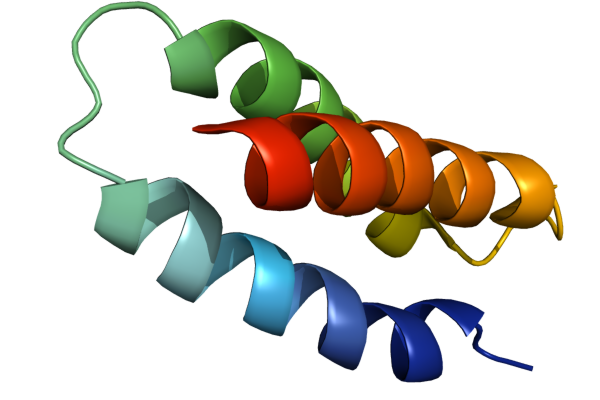

:author: Jan H. Meinke
:email: j.meinke@fz-juelich.de
:institution: Institute for Advanced Simulation, 
    Juelich Supercomputing Centre, 
    Forschungszentrum Juelich, 52425 Juelich, Germany

.. |---| unicode:: U+02014 .. em dash
   :trim:

=============================================
Protein Folding with Python on Supercomputers
=============================================

.. class:: abstract

    Today's supercomputers have hundreds of thousands of compute cores
    and this number is likely to grow. Many of today's algorithms will 
    have to be rethought to take advantage of such large systems. 
    New algorithms must provide fine grained parallelism and excellent 
    scalability. Python offers good support for numerical libraries and
    offers bindings to MPI that can be used to develop parallel algorithms
    for distributed memory machines.
    
    PySMMP provides bindings to the protein simulation package SMMP. 
    Combined with mpi4py, PySMMP can be used to perform parallel tempering 
    simulations of small proteins on the supercomputers JUGENE and JuRoPA. 
    In this paper, the performance of the Fortran implementation of parallel
    tempering in SMMP is compared with the Python implementation in PySMMP.
    Both codes use the same Fortran code for the calculation of the energy.
    
    The performance of the implementations is comparable on both machines,
    but some challenges remain before the Python implementation can be 
    used for large-scale production runs.

Introduction
------------

Many of the problems well known to high-performance computing 
(HPC) are becoming main stream. Processors add more and more 
cores, but the performance of a single core does not improve as 
drastically as it used to. Suddenly everybody has to deal with 
tens or hundreds of processes or threads. To take advantage of 
graphics hardware another factor of 100 in the number of threads 
is needed. Issues such as task 
management, load balancing, and race conditions are starting to 
become known to everybody who wants to write efficient programs 
for PCs. But things work the other way around, too. High-level 
programming languages such as Python that were not developed to 
get peak performance but to make good use of the developers time 
are becoming increasingly popular in HPC. 

The Simulation Laboratory Biology at the Juelich Supercomputing 
Centre (JSC) uses Python to script workflows, implement new 
algorithms, perform data analysis and visualization, and to run 
simulations on the supercomputers JUGENE and JuRoPA. Often, we 
combine existing packages such as Biopython [BioPy]_, Modeller 
[MOD]_, matplotlib [PyLab]_, or PyQt [PyQt]_ with our own packages 
to tackle the scientific problems we are interested in. 
In this paper I will focus on using Python for protein folding 
studies on JuRoPA and JUGENE. 

Proteins
--------

Proteins bind oxygen and carbon dioxide, transport nutrients and 
waste products. They catalyze reactions, transfer information, 
and perform many other important functions. Proteins don't act in 
isolation. They are part of an interaction network that allows 
a cell to perform all the necessary operations of life. A very 
important feature of a protein is its shape. Only when it obtains 
its correct three dimensional structure does it provide the right 
interface for its reaction partners. In fact, changing the 
interface is a way to turn proteins on and off and regulate their 
activity. 

Proteins are long chains of amino acids. The sequence of amino 
acids is encoded in the genome and expressed through the ribosome 
- itself a complex of RNA and proteins - amino acid by amino acid. 
Proteins need anywhere from a few micro seconds to several 
seconds to obtain their native structure. This process called 
protein folding occurs reliably in our body many times each 
second yet the process is still poorly understood. For some globular 
proteins, it has been shown that they can unfold and refold in a 
test tube. At least for these proteins folding is driven purely 
by classical physical interactions. This is the basis for folding 
simulations using classical force fields.

The program package SMMP first released in 2001 [SMMP]_ implements several 
Monte Carlo algorithms that can be used to study protein folding. 
It uses a simplified model of a protein that keeps the bond 
angles and lengths fixed and only allows changes of the dihedral 
angles. To calculate the energy of a given conformation of a 
protein, SMMP also implements several energy functions, the so called 
force fields. A force field is defined by a functional form of 
the energy function and its parametrization.

In 2007, we released version 3 of SMMP [SMMP3]_. With this version we 
provided Python bindings PySMMP that made the properties of the 
proteins, the algorithms, and the calculation of energy available 
from Python. In addition to the wrapper library created with 
f2py, we included three modules: universe, protein, and algorithms
that make
setting up a simulation and accessing the properties of a protein 
much more convenient. The wrapper modules were inspired by the 
Molecular Modeling Toolkit [MMTK]_, but implement a flat
hierarchy. We did not, however, include the parallelized energy functions, 
which requires MPI to work.

For the work described in this paper, I decided to use 
mpi4py as MPI bindings for the Python code for its completeness and 
its integration with Scientific Python and Cython. An important 
feature of mpi4py is that it provides easy access to 
communicators in a way that can be passed to the Fortran 
subroutine called.

Compiling the Modules
-------------------------

JUGENE is a 72-rack IBM Blue Gene/P (BG/P) system installed at JSC. 
Each rack consists of 1024 
compute nodes. Each compute node has a 4-core PowerPC 450 
processors running at 850 MHz and 2 GB of memory for a total of 
294912 cores and 147 TB of memory. The nodes are connected via a 
three dimensional torus network. Each node is linked to its six 
neighbors. In addition to the torus network, BG/P features a tree 
network that is used for global communication. The nodes are 
diskless. They forward IO requests to special IO nodes, which in 
turn talk to the GPFS file system. JUGENE's peak performance is 
about one petaflops and it reaches about 825 teraflops in the 
Linpack benchmark. This makes it Europe's fastest computer and the 
number 5 in the world [Top500]_. While the slow clock rate makes 
the system very energy efficient (364 MFlops/W), it also makes 
code that scales well a must, since each individual core provides 
only about one third of the peak performance of an Intel Nehalem 
core and the performance gap is even larger in many applications. 
Production runs on JUGENE should use at least one rack.

Programs that run on JUGENE are usually cross-compiled for the 
compute nodes. The compute nodes run a proprietary 32-bit compute 
node kernel with reduced functionality whereas the login nodes use 
Power6 processors with a full 64-bit version of SUSE Linux 
Enterprise Server 10. Cross compiling can be tricky. It is 
important to set all the environment variables and paths correctly. 
First, we need to make sure to use the correct compiler

::

    export BGPGNU=/bgsys/drivers/ppcfloor/gnu-linux
    export F90=$BGPGNU/powerpc-bgp-linux/bin/gfortran
    
Then we need to use f2py with the correct Python interpreter, for example ::

    export LD_LIBRARY_PATH=$LD_LIBRARY_PATH:$BGPGNU/lib
    $BGPGNU/bin/python /bgsys/local/numpy/1.2.1/bin/f2py
    
Now, f2py produces libraries that can be loaded on the compute nodes.

Launching Python on thousands of cores
--------------------------------------

A first step for any Python program is to load the interpreter 
and the default modules. While this is usually not a problem if 
we start a few instances, it can become troublesome on a large 
system such as JUGENE.

Taking a look at `Table 1`_ we see that 
already for a single rack, it takes more than 5 minutes to run a 
simple helloworld program. A C++ program for comparison takes 
only 5 s. Plotting the run time of the helloworld program, we 
quickly see that the time increases linearly with the number of 
MPI tasks at a rate of 0.1 s per task (`Figure 1`_). Extrapolating this to 
all 294912 cores of JUGENE, it would take more than 8 hours to 
start the Python interpreter. 

+-------------+-----------+--------------------------------------------+
| # of Cores  | Time [s]  |                 Comments                   |
+-------------+-----------+--------------------------------------------+
|          1  |        5  |                                            |
+-------------+-----------+--------------------------------------------+
|        128  |       50  |            A single node card              |
+-------------+-----------+--------------------------------------------+
|        512  |       55  |           Midplane in SMP mode             |
+-------------+-----------+--------------------------------------------+
|       1024  |      100  |            Only rank 0 writes              |
+-------------+-----------+--------------------------------------------+
|       2048  |      376  |       195 s if only rank 0 writes          |
+-------------+-----------+--------------------------------------------+
|       4096  |      321  |1 rack (smallest size for production runs)  |
+-------------+-----------+--------------------------------------------+
|       8192  |      803  |                 2 racks                    |
+-------------+-----------+--------------------------------------------+
|      16384  |     1817  | 4 racks. For comparison, a C++ program     |
|             |           | takes 25 s.                                |
+-------------+-----------+--------------------------------------------+

    _`Table 1`: Time measured for a simple MPI hello world program written using mpi4py on the Blue Gene/P JUGENE.

The linear behavior hints at serialization when the Python 
interpreter is loaded. As mentioned above, JUGENE's, compute nodes don't 
have their own disks. All IO is done via special IO nodes from a 
parallel file system and all nodes access the same Python image on the disk.

.. figure:: startupJugene.pdf

    _`Figure 1`: Scaling of the startup time of the Python interpreter on JUGENE 
    up to 20480 tasks.

A similar behavior was discussed for the GPAW code in the mpi4py 
forum [PyOn10k]_. GPAW [GPAW]_ uses its own Python MPI interface. Their work around 
was to use the ram disks of the IO nodes on Blue Gene/P.

On JuRoPA the effect is less pronounced. JuRoPA is an Intel 
Nehalem cluster. Each of its 3288 node has two quad-core 
processors with 24 GB of memory for a total 26304 cores and 79 TB 
of main memory. It has a peak performance of 308 teraflops and 
is currently number 14 in the Top 500 list with 90% efficiency in 
the Linpack benchmark [Top500]_. It uses Infiniband in a fat tree topology 
for communication and a Lustre file system for storage. In contrast to 
JUGENE, each node has its own local disk, where Python is 
installed. While the time to start Python and load mpi4py.MPI still 
increases linearly with the number of nodes, the prefactor is only 
0.005 s per process. 

Parallel energy calculation
---------------------------

As mentioned above, the energy calculation for the ECEPP/3 force 
field and the associated implicit solvent term are parallelized. 
Before they can be used, however, the appropriate communicator 
needs to be defined. For most simulations, except parallel 
tempering (see Section `Parallel tempering`_), the communicator is 
a copy of the default communicator that includes all processes. 
To start, such a simulation, we need to assign this communicator 
to smmp.paral.my_mpi_comm. This must be the appropriate Fortran 
reference, which we can get using mpi4py.MPI.COMM_WORLD.py2f(). 
With this setup, we can now compare the speed and the scaling of 
the energy function when called from Python and Fortran.

Scaling in parallel programs refers to the speedup when the program runs on 
*p* processors compared to running it on one processor. If the run time with *p* 
processors is given by :math:`$t(p)$` then the speedup *s* is defined as 
:math:`$s(p) = t(0) / t(p)$` and the efficiency of the scaling is given by
:math:`$e(p) = s(p) / p$`. An efficiency of 50% is often considered acceptable. 

As a benchmark system, I used the three-helix bundle GS-:math:`$\alpha_3$W`
(PDB code: `1LQ7 <http://www.rcsb.org/pdb/explore/explore.do?structureId=1lq7>`_) 
with 67 amino acids and 1110 atoms (see `Figure 2`_) 

    _`Figure 2`: Cartoon rendering of the three-helix bundle GS-:math:`$\alpha_{3}$W`. The 
    rendering was done with PyMOL [PyMOL]_.

On JuRoPA, I used f2py's default optimization options for the Intel compiler
to create the bindings. The Fortran program was compiled with the -fast 
option, which activates most optimizations and includes 
interprocedural optimizations. For a single core, the Fortran 
program is about 10% faster. The scaling on a single node is comparable, 
but it breaks down for PySMMP if more than one node is used (see `Figure 3`_).

On JUGENE, the behavior is quite different. PySMMP was compiled with gfortran, 
SMMP with IBM's xlf compiler, which produces code that is almost three times faster
on a single core. The shape of the scaling is comparable and saturates at about 
128 cores.

.. figure:: scaling_combined.pdf

    _`Figure 3`: Parallel scaling of the duration of the energy calculation 
    for the three-helix bundle GS-:math:`$\alpha_{3}$W` on JuRoPA (red) and JUGENE 
    (blue). The speedup is relative to the time needed by the Fortran program for the
    calculation of the energy on a single core. The square symbols represent SMMP, 
    the disks PySMMP.

Parallel tempering
------------------

Parallel tempering [PT]_, also known as replica exchange, is a method 
to sample a rough energy landscape more efficiently. Several copies of
a system are simulated at different temperatures. In addition 
to regular Monte Carlo [MC]_ moves that change a configuration, we 
introduce a move that exchanges conformations of two different 
temperatures. The probability for such a move is 
:math:`$P_{\mathrm{{PT}}}=\exp(\Delta\beta\Delta E)$`, 
where :math:`$\beta=1/k_{B}T$`, :math:`$T$` is the temperature and 
:math:`$k_{B}$`
is the Boltzmann constant. With this exchange probability the 
statistics at each temperature remains correct, yet conformations 
can move to higher temperatures where it is easier to overcome 
large barriers. This allows for a more efficient sampling of the 
conformational space of a protein.

Parallel tempering is by its very nature a parallel algorithm. 
At each temperature, we perform a regular canonical MC 
simulation. After a number of updates :math:`$n_{up}$`, we attempt an 
exchange between temperatures. If we create our own MPI 
communicators, we can use two levels of parallelism. For each 
temperature :math:`$T_{i}$`, we use a number of processors :math:`$p_{i}$` to 
calculate the energy in parallel. Usually, :math:`$p_{i}$` is the same for 
all temperatures, but this is not a requirement. Assuming that :math:`$p_{i}=p$`
, and using :math:`$n_{T}$` temperatures, we use a total of :math:`$p_{\mathrm{tot}}=n_{T}*p$`
processors. For an average protein domain consisting of about 
150 amino acids and 3000 atoms, :math:`$p=128$`, and :math:`$n_{T}=64$` is a 
reasonable choice on a Blue Gene/P, for a total of :math:`$p_{\mathrm{tot}}=8192$`
|---| a good size for a production run.

Parallel tempering is implemented in Fortran as part of SMMP. The 
speed of the Fortran implementation is the reference, for the 
following investigation of my implementation of parallel 
tempering in Python. Parallel tempering and canonical Monte Carlo 
are implemented as classes in the algorithms module. The 
canonical Monte Carlo class optionally uses the Fortran 
implementation of the Metropolis step. For the following comparison,
only the calculation of the energy of a conformation is done in Fortran.

For parallel tempering, the number of processes increases proportionally with
the number of replicas. This kind of scaling is called weak scaling. Ideally,
the time stays constant. `Figure 4`_ shows the scaling of parallel tempering
on JuRoPA and JUGENE with respect to the pure Fortran program. On JuRoPA,
one processor was used per replica. On JUGENE 128 processors were used per
replica. The overhead of implementing the algorithm in Python is about 5% on 
JuRoPA and the scaling is comparable to the Fortran code. On JUGENE, the 
overhead of the Python implementation is about 20% for 2 replica. But the 
scaling of PySMMP is better and for 16 replicas, the Python version takes
about 10% longer.

.. figure:: scalingPT.pdf

    _`Figure 4`: Efficiency of the scaling of parallel tempering. Parallel 
    tempering is an example for weak scaling. The problem size,
    i.e., the number of temperatures, increases proportional to the number of 
    processors. Ideally, the time stays constant and the efficiency is one.
    For JuRoPA (red), both lines are nearly constant. The Python implementation
    (disks) of
    parallel tempering takes only about 5% longer than the Fortran version
    (squares). On JUGENE (blue) each replica uses
    128 cores for the energy calculation. The Python implementation takes about 20%
    longer for 2 replica  than the Fortran implementation but for 16 replica the
    difference is down to about 10%.
    
    
Clustering
----------

In addition to scalar properties such as energy, volume, 
secondary structure content, and distance to the native 
structure, we can save the conformation, i.e., the coordinates of 
the structures, we have seen. We can create histograms that show 
us for each temperature, how often, we found structures that had 
a distance to the native conformation that fell into a certain 
range. A commonly used measure is the root-mean-square deviation 
(rmsd) of the current conformation to the native one. Rmsd
measures the average change in position of all atoms compared to
a reference structure.
Unfortunately, rmsd is not a very good measure. For small rmsd 
values, two structures that have a similar rmsd to the native 
structure, will also be similar to each other, but for larger 
rmsd values this is not the case. To determine, the recurrence 
and therefore the statistical weight of structures that are very 
different from a given reference structure, we can use clustering 
algorithms. A cluster can be defined in many different ways. 
Three intuitive definitions are

* Elements belong to the same cluster if their distance to each 
  other is less than a given distance :math:`$d_{\mathrm{cluster}}$`.

* Elements belong to the same cluster if they have more 
  connections to each other than to other elements.

* Two clusters are distinct if the density of elements within the 
  cluster is much higher than between clusters.

The first definition works well with rmsd as distance measure if 
we choose :math:`$d_{\mathrm{cluster}}$` small enough and is an intuitive 
definition for clusters of structures, but it is computationally 
expensive. We usually have several tens of thousands of structures 
requiring billions of rmsd calculations to complete the distance 
matrix. We therefore started to look at alternatives. One 
alternative is to look for dense regions in high-dimensional 
spaces (the third definition). MAFIA [MAFIA]_ is a adaptive grid algorithm 
to determine such clusters. 
It looks for dense regions in increasingly higher
dimension. A one-dimensional region is considered dense if the number
of elements is larger than a threshold :math:`$n_t = \alpha \bar{n} w$`,
where :math:`$\alpha$` is a parameter, :math:`$\bar{n}$` is the average
density of elements in that dimension, and *w* is the width of the region.
An n-dimensional region is considered dense if the number of elements it
contains is larger than the threshold of each of its one-dimensional sub
spaces
For each dimension, MAFIA divides space into :math:`$n_\mathrm{bins}$` 
uniform bins (see `Figure 5`_). For each bin, it counts the number of elements in that bin 
creating a histogram. The next step is to reduce the number of bins by 
enveloping the histogram using :math:`$n_\mathrm{windows}$` windows. The
value of each window is the maximum of the bins it contains. 
To build an adaptive grid, neighboring windows are combined into larger cells
if their values differ by less than a factor :math:`$\beta$`. For each 
adaptive-grid cell, the threshold :math:`$n_t$` is calculated. 
The one-dimensional dense cells are used to find two dimensional candidate
dense units. The algorithm combines the dense units found to find 
increasingly higher-dimensional dense units. It takes
advantage of the fact that all :math:`$n-1$`-dimensional projections
of an *n*-dimensional dense unit are also dense to quickly reduce the number 
of higher-dimensional cells that need to be tested.

.. figure:: example.pdf

    _`Figure 5`: An illustration of MAFIA using a simple two-dimensional 
    example with :math:`$\alpha=1.5$`. The light green columns and the 
    light blue row are one-dimensional dense units. The areas where they
    cross are two-dimensional candidates for dense units, but only the 
    darker cyan area is dense. It contains more particles than required 
    by the thresholds of its one-dimensional components.

Since, we couldn't find an implementation of 
MAFIA, I implemented a Python version using NumPy and mpi4py. MAFIA 
combines task and data parallelism making it a good candidate for 
parallel compute clusters.  The implementation consists of less than 380
lines of code, scales well, and can deal easily with tens of thousands of 
data points. 

We are currently testing the usefulness of various ways to describe 
protein conformations as multi-dimensional vectors for clustering using
PyMAFIA.

Conclusions
-----------

Today's supercomputers consist of tens to hundreds of thousands 
of cores and the number of cores is likely to grow. Using these 
large systems efficiently requires algorithms that provide a lot 
of parallelism. Python with mpi4py provides an avenue to 
implement and test these algorithms quickly and cleanly, but it 
is not yet ready for large-scale production runs. On Blue Gene/P
this is mostly due to the overhead of loading the Python interpreter 
which, extrapolating the data to the almost 300000 cores on JUGENE, 
would take more than 8 hours resulting in 25 lost rack days (70 CPU 
years with 4 cores per CPU) and almost 10 metric tons of 
:math:`$\mathrm{CO}_{2}$`. 
Using ram disks is an effective means to reduce the startup time 
by an order of magnitude, but this is not enough and 
ram disks are not always available to the user.

If the startup time of the Python interpreter on JUGENE can be brought
down to that of a regular binary program, PySMMP becomes an attractive
alternative for development *and* production runs.

On JuRoPA, the scaling of the energy calculation for the protein
GS-:math:`$\alpha_{3}$W` breaks down as soon as more than one node is used
when called from Python. For larger systems, this is not the case,
but the scaling of the energy calculation when called from Fortran
is still better. The overhead of using Python instead of Fortran 
for the parallel tempering algorithm, on the other hand, is only about 3%.

The parallel scaling of the energy function when called
from Python needs to be improved to be able to replace the Fortran 
program for production.

Even with the remaining challenges, there is no reason not to use
PySMMP for the development and testing of new algorithms and even 
small production runs. Furthermore, the implementation of MAFIA shows 
that prototyping of a parallel program can be done efficiently in pure 
Python as well.

References
----------

.. [BioPy] Cock PJ, Antao T, Chang JT, Chapman BA, Cox CJ, Dalke A, Friedberg I, Hamelryck T, Kauff  F, Wilczynski B, and de Hoon MJ. *Biopython: freely available Python tools for computational molecular biology and bioinformatics.* Bioinformatics  **25** (11), 1422-3 (2009)

.. [MOD] Sali A. and Blundell T. L. *Comparative protein modelling by satisfaction of spatial restraints.* J. Mol. Biol. **234**, 779-815 (1993)

.. [PyLab] Hunter J.D. *Matplotlib: A 2D Graphics Environment* Computing in Science and Engineering, **9** (3), 90-95 (2007)

.. [PyQt] *Qt - A cross platform application and UI framework*, http://qt.nokia.com/

.. [SMMP] Eisenmenger, F., Hansmann, U.H.E., Hayryan, S. & Hu, C. *[SMMP] A modern package for simulation of proteins.* Comp. Phys. Comm. **138**, 192-212 (2001).

.. [SMMP3] Meinke, J.H., Mohanty, S., Eisenmenger, F. & Hansmann, U.H.E. *SMMP v. 3.0 - Simulating proteins and protein interactions in Python and Fortran.* Comp. Phys. Comm **178**, 459--470 (2007).

.. [MMTK] Hinsen, K *The Molecular Modeling Toolkit: A New Approach to Molecular Simulations* J. Comp. Chem. **21**, 79--85 (2000)

.. [Top500] *Top 500 List June 2010*, http://www.top500.org/list/2010/06/100

.. [PyOn10k] *Python on 10K of cores on BG/P*, http://groups.google.com/group/mpi4py/browse_thread/thread/3dc9b1d9eb153eb3

.. [GPAW] Mortensen, J.J., Hansen, L.B. & Jacobsen, K.W. *Real-space grid implementation of the projector augmented wave method.* Phys. Rev. B **71**, 035109 (2005). 

.. [PyMOL] *The PyMOL Molecular Graphics System*, Version 1.2r3pre, Schroedinger, LLC., http://www.pymol.org/

.. [MC] Metropolis, N., Rosenbluth, A.W., Rosenbluth, M.N., Teller, A.H. & Teller, E. *Equation of state calculations by fast computing machines.* J. Chem. Phys. **21**, 1087 (1953).

.. [PT] Hukushima, K. & Nemoto, K. *Exchange Monte Carlo Method and Application to Spin Glass Simulations.* J. Phys. Soc. Jpn. **65**, 1604-1608 (1996).

.. [MAFIA] Nagesh, H., Goil, S. & Choudhary, A. *Parallel algorithms for clustering high-dimensional large-scale datasets.* Data mining for scientific and engineering applications  (2001).

