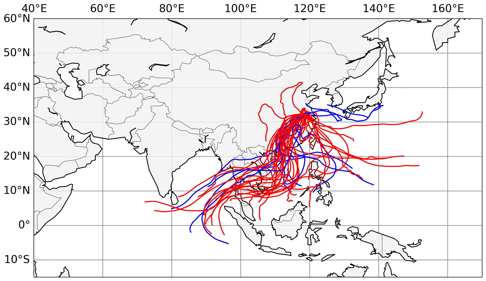

:author: Mellissa Cross
:email: cros0324@umn.edu, mellissa.cross@gmail.com
:institution: Department of Earth Sciences, University of Minnesota

-----------------------------------------------------------------------------------------------------
PySPLIT: a Package for the Generation, Analysis, and Visualization of HYSPLIT Air Parcel Trajectories
-----------------------------------------------------------------------------------------------------

.. class:: abstract

   The HYSPLIT model outputs air parcel paths projected forwards or backwards in time (trajectories) and is used in a variety of scientific contexts.  Here we present the first package in the mainstream scientific Python ecosystem designed to facilitate HYSPLIT trajectory analysis workflow by providing an intuitive API for generating, inspecting, and plotting trajectory paths and data.

.. class:: keywords

   HYSPLIT, trajectory analysis, matplotlib Basemap

Introduction
------------
The NOAA Air Resources Laboratory's HYSPLIT (HYbrid Single Particle Lagrangian Transport) model [Hes98]_ uses a hybrid Langrangian and Eulerian calculation method to compute air parcel trajectories and particle dispersion and deposition simulations.  It is publicly available via the web READY interface- and has been since the late 1990s- or downloadable versions compatible with PC or Mac.  NOAA uses the HYSPLIT system, particularly the particle dispersion simulations, for research and emergency response.  In the scientific community, the trajectory simulations are applied to a variety of tasks, including visualizing regional atmospheric circulation patterns, investigating meteorological controls on the isotopic composition of precipitation, and calculating moisture uptake and transport.  A key component of these research problems is the along-trajectory data that HYSPLIT outputs.  Although the PC and Mac versions allow for greater batch processing than is available via the online READY interface, neither interface provides users with a means to inspect, sort or analyze trajectories on the basis of along-trajectory data.  Users are left with limited options: write their own scripts for performing the desired data analysis, or manage trajectory data by hand via spreadsheet and GIS programs.  Both options are time consuming, the latter limits the number of trajectories that can be inspected and is prone to error, and the former is typically not distributed for use to other labs.  Additionally, HYSPLIT ships with limited inbuilt options for trajectory visualization, though it does provide a shapefile/KML output tool.  PySPLIT's key aims are to provide a free, open source, replicable system inside the scientific Python ecosystem for a Python-based workflow: bulk trajectory generation and for trajectory path and data analysis and visualization.
PySPLIT depends on python's core scientific packages, such as numpy and matplotlib, and comprises five classes and a trajectory generation toolkit.  The scope of this package is currently bulk trajectory generation, trajectory data analysis and management, and path and data visualizations.  Due to the research interests of the author, PySPLIT has a particular focus on rainfall, moisture flux, and moisture uptake using trajectories run backwards in time.

The API
-------
An early version of PySPLIT was procedurally based.  The morass of helper functions and the constant re-reading of trajectory data files, however, was cumbersome.  The current API comprises five classes, four of which deal with trajectory data.  The fundamental class of PySPLIT is the Trajectory type; each Trajectory instance represents one HYSPLIT air parcel trajectory.  Three of the other classes, TrajectoryGroup, Cluster, and ClusterGroup, are essentially variations on a Trajectory container.  The fifth data type is the MapDesign type, which is not a Trajectory-related class, but holds map construction information and creates a basemap from the stored parameters on command.  This class was included to enable the user to quickly create attractive basemaps without detracting much attention and effort from the trajectory analysis workflow.

Trajectory Generation
~~~~~~~~~~~~~~~~~~~~~
Typically the first step in a HYSPLIT workflow is trajectory generation.  This can be accomplished via the online READY interface or the HYSPLIT GUI or commandline, but bulk generation is annoying and time-consuming.  Additionally, users of the online READY system are limited to 500 trajectories per day.  PySPLIT includes a script for generating large numbers of trajectories of a particular number of hours (``run``) at various times of day and at several different altitudes in a single call, allowing the user to set up a comprehesive batch to run overnight without constant user monitoring or action:

.. code-block:: python

   generate_trajectories(basename, hysplit_working,
                         output_dir, meteo_path, years,
                         months, hours, altitudes,
                         coordinates, run,
                         meteo_type='gdas1',
                         get_forward=True,
                         get_clippedtraj=True)

All HYSPLIT trajectory files created with this method have the same basename, follow by the altitude, season, and year, month, day, and hour in the format: YYMMDDHH.  The files are extensionless and live in ``output_dir``.

``pysplit.generate_trajectories()`` currently just supports ``gdas1`` data, which refers to the 1 x 1 degree Global Data Assimilation System 3-hour meteorology product from the National Weather Service's National Centers for Environmental Prediction (NCEP) archived in a packed format appropriate for HYSPLIT (referred to as ARL-packed).  Archived ``gdas1`` data is available from 2005 onwards; registered HYSPLIT users may also access forecast data (see HYSPLIT use agreement for more information concerning publishing and redistributing HYSPLIT model results using forecast data).  Future versions of PySPLIT will support other datasets, for example ARL-packed ERA-interim data, for which decades of data are available; and other user-defined ARL-packed data sources.

Despite this temporary limitation, PySPLIT comes with two additional features not available in the READY interface or directly through HYSPLIT.  The first is triggered by the ``get_foward`` keyword argument.  One source of error in trajectory calculation is the integration error.  This error is estimated by comparing the distance between where an original trajectory begins and where a trajectory run in the opposite direction from the endpoint of the original trajectory ends.  We expect that both trajectories will follow the same path, so low integration error is indicated by a distance  between start and points that is short relative to the total distance covered by the trajectory pair.  If back trajectories are run and ``get_forward`` is ``True``, then PySPLIT will automatically open the new back trajectory file, read in the altitude, longitude, and latitude of the last time point, and initialize a forward-moving parcel at that location or at the given coordinates below the 10000 m model ceiling, if necessary.  In the Trajectory class, discussed below, a method is included for estimating integration error.

The second utility is triggered by ``get_clippedtraj``.  HYSPLIT trajectory data files have a limited line length, and typically, along-trajectory data is recorded one line per timepoint.  Timepoints will span multiple lines, however, if more than seven of nine possible available output variables are selected.  PySPLIT can account for this when it occurs, and this is generally not a problem for PySPLIT or HYSPLIT except during clustering.  HYSPLIT's clustering method fails given multi-line output.  ``pysplit.clip_traj()`` opens a trajectory file, copies the trajectory header and path (latitude, longtitude, altitude) data, and outputs the header and path to a new file that HYSPLIT will readily use to perform clustering.  The clipped and forward trajectories live in subdirectories inside ``output_dir``.

Trajectory
~~~~~~~~~~
The Trajectory class is the fundamental unit in PySPLIT, designed to manage and promote the analysis of air parcel trajectory data in an intuitive manner.  Each object represents one air parcel trajectory calculated by HYSPLIT and contains its latitude, longitude, and altitude (m above ground level or m above sea level), along-path data, file location, path start information, and summary data.  Trajectory instances are intialized as follows:

..code-block:: python

   traj = Trajectory(data, header, fullpath)

where ``data`` is the 2D array of along-trajectory data read from the HYSPLIT output file, ``header`` is a list of strings indicating the information present in each column, and ``fullpath`` is of course the location of the output file.  However, the user will typically not initialize individual Trajectories, but will instead initialize a TrajectoryGroup containing them.

The 2D ``data`` array of a Trajectory is parsed into separate attributes as 1-D NumPy arrays of floats, readily exposing the data. The ``data`` and ``header`` are also kept as attributes, and can be reloaded into the corresponding 1D attributes at any time, wiping out changes.

Most Trajectory analysis methods live in or are accessed directly by the Trajectory class.  These include calculations of along-trajectory and overall great-circle distance, mean trajectory vector, humidity data conversions, and along-trajectory moisture flux. The results of most of these calculations are stored as new attributes in 1D ndarrays of floats of identical size.  Additionally, the Trajectory class contains the methods for loading forward trajectories and estimating trajectory integration error in both horizontal and vertical dimensions

The Trajectory class also includes a flexible implementation of the moisture uptake calculation from back trajectories from Sodeman et al. [Sod08]_:

.. code-block:: python

   moistureuptake(self, rainout_threshold,
                  evap_threshold, uptake_window=6,
                  window_overlap=0,
                  vertical_criterion='pbl',
                  pressure_threshold=900.0,
                  mixdepth_factor=1,
                  q_type='specific_humidity')

Using this method, humidity is compared at the beginning and end of a period of time with length ``uptake_window``, repeated over the whole back trajectory, from the earliest timepoint to the most recent time point.  A good uptake window is 6 hours, since it is a short enough period of time that evaporation or precipitation will dominate, and long enough that performing this calculation over 120-hour trajectories is not particularly onerous.

As the purpose of this algorithm is to find the locations and contributions surficial moisture sources that contribute to the moisture at the back trajectory launch point, a vertical criterion separating surficial from atmospheric moisture sources is required.  In Soderberg's original paper, which did not use HYSPLIT, this was the planetary boundary layer.  In other works that have used this algorithm but employed HYSPLIT, a particular pressure level, often 900.0 hPa, is chosen.  This implementation allows the user to define surficial moisture uptakes as within the mixing depth, which is an option for along-trajectory meteorological output in HYSPLIT, below a given pressure level, or both.

For each window, PySPLIT records the coordinates of the midpoint, the mean pressure, mixing depth (if available), and altitude; the change in humidity; and the fraction of current humidity levels taken up below or above the vertical criteria or due to unknown sources.  Change in humidity and humidity fractions in previous windows are also adjusted to reflect rainout and the fact that early sources of moisture become less important as moisture is acquired further along in the trajectory.  The result is a 2D array of size ``traj.sim_length``/(uptake_window-window_overlap), 19, where each row represents a time window and each column a different variable, named in a header list of length 19.  The array and header are stored as Trajectory attributes.

TrajectoryGroup
~~~~~~~~~~~~~~~
The TrajectoryGroup is the basic container for PySPLIT Trajectory objects, and is initialized simply by providing a list of Trajectory objects.  Typically the first TrajectoryGroup in a PySPLIT workflow is initialized upon loading Trajectory objects from file as discussed above:

.. code-block:: python

    trajgroup, _ = make_trajectorygroup(signature)

In this method, HYSPLIT output files sharing a Bash-style signature are read, initialized as Trajectories and appended to a list, which is then used to initialize a TrajectoryGroup.  These containers are fully iterable, yielding a Trajectory when indexed and a new TrajectoryGroup when sliced.

Once the initial TrajectoryGroup is created, a typical PySPLIT workflow involves cycling through the TrajectoryGroup (``umn`` in the example workflow below), initializing and inspecting attributes of the member Trajectory instances.  Trajectories that meet certain criteria are then sorted into new TrajectoryGroups.

Then if necessary sort out the trajectories with desirable characteristics into a new TrajectoryGroup:

.. code-block:: python

   # Trajectories with integration error better than 10%
   good_traj = []

   for traj in umn:
     traj.load_forwardtraj(r'C:/traj/forwardtraj')
     traj.integration_error()

     if self.integ_error_xy < 10:
        good_traj.append(traj)

   # Sort out rain-bearing traj starting at 1700 UTC
   # (local noon) and 1500 m
   umn_trajls=[]

   for traj in good_traj:
     traj.set_rainstatus()
     if (traj.rainstatus and traj.hour[0] == 17 and
         traj.altitude[0] == 1500):
       umn_trajls.append(traj)

   # Create new TrajectoryGroup:
   umn_noon = pysplit.TrajectoryGroup(umn_trajls)

And perform more calculations:

.. code-block:: python

   for traj in umn_rainy1500noon:
     traj.set_vector()
     traj.set_specifichumidity()
     traj.calculate_moistureflux()

Repeating sorting and analysis as necessary.

Using the visualization defaults as described in the Data Plotting and MapDesign section below, we can quickly look at the Trajectory paths:

   Simple visualization of trajectory paths.  :label:`pathfig`

The TrajectoryGroup class also has additional capabilities for organizing Trajectory instances and trajectory data.  TrajectoryGroup instances are additive: two instances are checked for duplicte trajectories (determined by examining the filename and pathcan be combined into a new group of unique trajectories.  The TrajectoryGroup also comes with methods for assembling particular member Trajectory attributes and moisture uptake arrays into a single array to facilitate scatter plotting and for interpolating along-path and moisture uptake data to a grid.  These are discussed below in the Data Plotting and MapDesign section.

Cluster and ClusterGroup
~~~~~~~~~~~~~~~~~~~~~~~~
To investigate the dominant flow patterns in a set of trajectories, HYSPLIT includes a clustering procedure.  PySPLIT includes several methods to expedite this process.

The first step is to generate a list of trajectories to be clustered.  Once the user has created a TrajectoryGroup with trajectories that meet their specifications, then they can use the TrajectoryGroup method ``make_infile()`` to write member Trajectory full paths to an extensionless file called 'INFILE' that HYSPLIT needs to perform clustering.  PySPLIT will attempt to write the full paths of the 'clipped' versions of the trajectories to INFILE, if available, otherwise the full paths of the regular trajectories will be used.  Clipped trajectories are usually generated during trajectory generation.  However, as clipping does not require actually calculating a new trajectory, just the copying of path data, this can be performed after trajectory generation:

.. code-block:: python

   for traj in trajgroup:
     clip_traj(traj.folder, traj.filename)

However, the TrajectoryGroup (``trajgroup``) and its member Trajectories must be reloaded for the clipped trajectory files to become available for clustering.

Once the INFILE is created, the user must open HYSPLIT to run the cluster analysis and assign trajectories to clusters.  Advice concerning the determination of the nubmer of clusters (along with all other HYSPLIT aspects) is available in the HYSPLIT manual [Hes99]_.  Assigning trajectories to clusters will create a file called 'CLUSLIST_3' or some other number corresponding to the number of clusters specified by the user.  This file indicates the distribution of Trajectories in the TrajectoryGroup among clusters, and is used to create Cluster instances contained in a ClusterGroup:

.. code-block:: python

   clusgroup = spawn_clusters(trajgroup, traj_distrib,
                              clusterpath_dir)

The Cluster class is a specialized subclass of TrajectoryGroup.  Besides a list of member Trajectories (indicated by the distribution file), initialization requires the cluster mean path data and what number cluster it is.  Like TrajectoryGroups, Clusters are additive, but adding Clusters together creates a regular TrajectoryGroup, not a new Cluster.  As a Cluster has an associated path, some Trajectory-like methods (distance, vector calculations) are available.

A ClusterGroup is a container of Clusters produced in a single clustering procedure.  ClusterGroup can be iterated over the member Clusters.

Data Plotting and MapDesign
---------------------------
As visualization and figure creation is a key part of the scientific process, a major focus of PySPLIT is exposing data and enabling the user to create attractive maps and plots.

One part of this equation is the MapDesign class.  A MapDesign instance holds the information necessary to create an attractive matplotlib Basemap.  The user provides the coordinates of the lower left and upper right corners of the map, as well as a few standard parallels and meridians, and the defaults are sufficient to produce a professional-looking map, and comes with three neutral color-schemes:

Figure showing color schemes, no other defaults changed.

MapDesigns also encompass more complex formatting, like labelling.  During the initialization of MapDesign, or later using ``MapDesign.edit_labels()``, the user can generate a text file with example labels in defined label categories at a given file location.  The user can then edit the example labels for their needs, and select which groups are placed on the basemap, once ``MapDesign.make_basemap()`` is called and a Basemap is generated.

Although MapDesign was created to expedite the process of creating an attractive Basemap and let users focus on the trajectory analysis rather than figure-tweaking, PySPLIT plotting functions accept any Basemap instance, allowing users to incorporate PySPLIT into their existing workflow.  Additionally, as all Trajectory, Cluster, TrajectoryGroup, and ClusterGroup attributes are intuitively exposed, users are free to create their own visualization routines beyond what is provided in PySPLIT.

Among the Trajectory attributes are linewidth and path color.  A user can incorporate these into their workflow, setting linewidth and path color to correspond to Trajectory instances with particular characteristics.  Plotting the paths of a TrajectoryGroup's member Trajectories is performed one-by-one on the given Basemap instance.  To facilitate scatter plotting, the TrajectoryGroup assembles Trajectory latitude, longtitude, the variable plotted as a color change, and, if selected, the variable plotted as a size change each into single arrays.  Trajectory data, as well as moisture uptake data, can also be interpolated onto a grid and plotted as follows:

As a Cluster is a specialized TrajectoryGroup, member Trajectories can be plotted in the same ways.  Additionally, Cluster mean paths can also be plotted, either individually or all together in the ClusterGroup.  Cluster linewdiths can either be determined by an absolute Trajectory count or the fraction of total Trajectories in the ClusterGroup belonging to the Cluster.

Prior to being passed to ``Basemap.plot()`` and ``Basemap.scatter()``, scatter plot data passes through ``traj_scatter()``.  This exposes Normalize instances and other methods of normalization (square root, natural log), allowing users to normalize both color and size data.  Square root and natural log normalizations require the user to edit tick labels on colorbars.  After plotting, wrappers around matplotlib's colorbar creation methods with attractive default options are available to initialize colorbars.

The Future of PySPLIT
---------------------
PySPLIT provides an intuitive API for processing and analyzing HYSPLIT trajectory data and creating visualizations using matplotlib and the matplotlib Basemap toolkit.  The goal of PySPLIT is to provide users with a powerful, flexible python-oriented HYSPLIT trajectory analysis workflow, and in the long-term to become the toolkit of choice for research using HYSPLIT.  Of course, PySPLIT will not achieve this aim without the support and contributions of the scientific Python communitiy, and so this package will be made publicly available on github- pull requests welcome!  Features in the pipeline include HYSPLIT clustering process entirely accessible via the PySPLIT interface, and a greater variety of statistical, moisture uptake, and other methods available for trajectory analysis.  Additionally, there are several areas for improvement within the trajectory generation portion of PySPLIT, notably support for meteorologies besides ``gdas1``, more granular trajectory generation, and generation on pressure and condensation levels.

References
----------
.. [Sod08] H. Sodeman, C. Schwierz, and H. Wernli.  *Interannual Variability of Greenland winter precipitation sources: Lagrangian moisture diagnostic and North Atlantic Oscillation influence*,
           Journal of Geophysical Research, 113:D03107, February 2008.

.. [Hes98] R.R. Draxler and G.D. Hess. *An overview of the HYSPLIT_4 modeling system of trajectories, dispersion, and deposition*,
           Aust. Meteor. Mag., 47:295-308, 1998.

.. [Hes99] R.R. Draxler and G.D Hess. *HYSPLIT4 user's guide*,
           NOAA Tech. Memo. ERL ARL-230, NOAA Air Resources Laboratory, Silver Spring, MD, 1999.

Acknowledgments
---------------
I gratefully thank the reviewers for their patience, comments and suggestions; and the NOAA ARL for the provision of the HYSPLIT transport and dispersion model.
