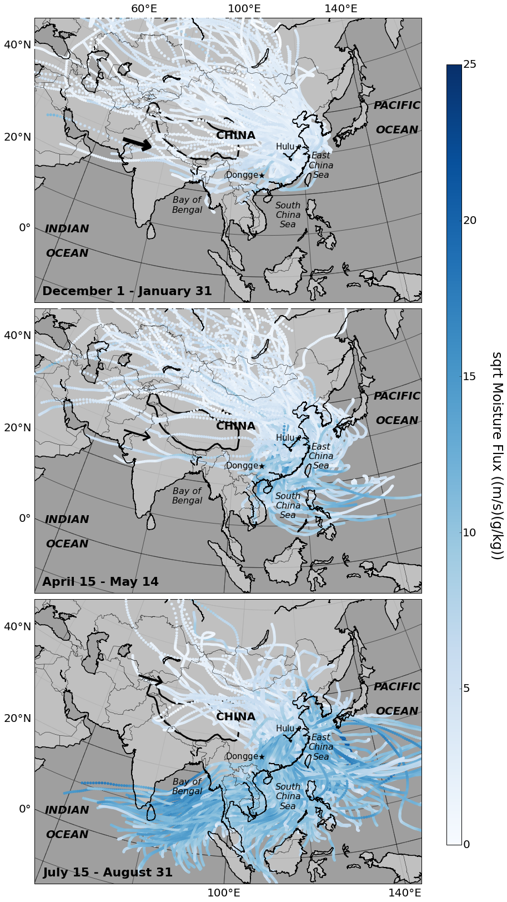
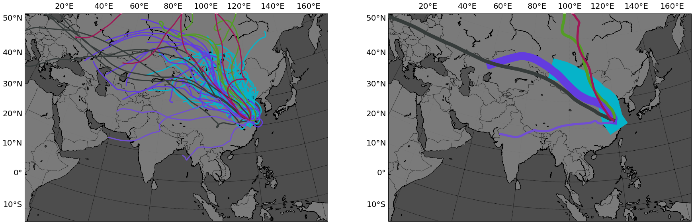

:author: Mellissa Cross
:email: cros0324@umn.edu, mellissa.cross@gmail.com
:institution: Department of Earth Sciences, University of Minnesota

-----------------------------------------------------------------------------------------------------
PySPLIT: a Package for the Generation, Analysis, and Visualization of HYSPLIT Air Parcel Trajectory
-----------------------------------------------------------------------------------------------------

.. class:: abstract

   The National Oceanic and Atmospheric Administration (NOAA) Air Resources Laboratory's HYSPLIT (HYbrid Single Particle Lagrangian Transport) model [Drax98]_, [Drax97]_ uses a hybrid Langrangian and Eulerian calculation method to compute air parcel trajectories and particle dispersion and deposition simulations.  Air parcels are hypothetical small volumes of air with uniform characteristics.  The HYSPLIT model outputs air parcel paths projected forwards or backwards in time (trajectories) and is used in a variety of scientific contexts.  Here we present the first package in the mainstream scientific Python ecosystem designed to facilitate HYSPLIT trajectory analysis workflow by providing an intuitive API for generating, inspecting, and plotting trajectory paths and data.

.. class:: keywords

   HYSPLIT, trajectory analysis, matplotlib Basemap

Introduction
------------
Government agencies and researchers use the HYSPLIT system, particularly the particle dispersion simulations, for academic and emergency response purposes such as monitoring nuclear fallout, the dispersion of volcanic aerosols, and dust storms.  Trajectory simulations are also applied to a variety of tasks, including visualizing regional atmospheric circulation patterns, investigating meteorological controls on the isotopic composition of precipitation, and calculating moisture uptake and transport.  A short list of publications using HYSPLIT is available  HYSPLIT can also be applied to non-academic uses, such as ballooning.  The HYSPLIT model is available online via the Real-time Environmental Applications and Display sYstem (READY_) interface [Rolph03]_ - and has been since the late 1990s - or as a downloadable_ version compatible with PC or Mac [Drax03]_.

.. _Ready: http://ready.arl.noaa.gov/HYSPLIT_traj.php
.. _downloadable: http://ready.arl.noaa.gov/HYSPLIT.php

A key component of air parcel trajectory research problems is the along-trajectory data that HYSPLIT outputs.  Although the PC and Mac versions allow for greater batch processing than is available via the online READY interface, neither interface provides users with a means to inspect, sort, or analyze trajectories on the basis of along-trajectory data.  Users are left with limited options: write their own scripts for performing the desired data analysis, or manage trajectory data by hand via spreadsheet and GIS programs.  Both options are inefficient and error-prone.  Additionally, HYSPLIT ships with limited inbuilt options for trajectory visualization, though it does provide a shapefile/KML output tool.  Using a non-Python based workflow, a figure similar to the third panel in Figure :ref:`scatterex` took approximately three weeks to generate.  This process involved manually generating a couple hundred trajectories, sorting out the rainy trajectories and importing their data into Excel, calculating moisture flux, and arranging the data for a third party program to convert to a KML file to view on Google Earth.  In contrast, after two nights of letting PySPLIT generate trajectories (totalling 60,000 trajectories), the complete Figure :ref:`scatterex` was made in a single afternoon.

PySPLIT is a Python-based tool for HYSPLIT trajectory analysis available on Github_ under a modified BSD license.  This package's key aim is to provide an open source, reusable, reproducible, flexible system for a Python-based trajectory analysis workflow. Though a Python-based HYSPLIT frontend (physplit) is available on Google Code, this code is poorly documented and organized, and is incomplete, unmaintained, an not reusable, as it contains hard-coded variables specific to particular workstations.

.. _Github: https://github.com/mscross/pysplit

PySPLIT depends on NumPy [NumPy]_, matplotlib [matplotlib]_, and the matplotlib Basemap toolkit; and comprises five classes and a trajectory generation toolkit.  The scope of this package is currently bulk trajectory generation, trajectory data analysis and management, and path and data visualizations.

The API
-------
The current PySPLIT API comprises five classes, four of which deal with trajectory data.  The fundamental class of PySPLIT is the ``Trajectory``; each ``Trajectory`` instance represents one HYSPLIT air parcel trajectory.  Three of the other classes, ``TrajectoryGroup``, ``Cluster``, and ``ClusterGroup``, are essentially variations on a ``Trajectory`` container.  The fifth data type is ``MapDesign``, which is not a ``Trajectory``-related class, but holds map construction information and draw a map, using the matplotlib Basemap toolkit command.  This class was included to enable the user to quickly create attractive maps without detracting focus from the trajectory analysis workflow.

Trajectory Generation
~~~~~~~~~~~~~~~~~~~~~
Typically the first step in a HYSPLIT workflow is trajectory generation.  This can be accomplished via the online READY interface, or the HYSPLIT GUI, or command line, but bulk generation is inefficient.  Additionally, READY users are limited to 500 trajectories per day.  PySPLIT includes a method for generating large numbers of trajectories of a particular length in hours at various times of day and at several different altitudes in a single call, allowing the user to set up a comprehesive batch to run overnight without constant user monitoring or action:

.. code-block:: python

   generate_trajectories(
      'example', r'C:/hysplit4/working',
      r'C:/traj_dir', r'E:/meteorology',
      [2007, 2008, 2009], [6, 7], [5, 11, 17, 23],
      [500, 1500], (32.29, 119.05), -120,
      meteo_type='gdas1')

In this example, 120-hour trajectories are launched at 500 and 1500 meters above ground level at 32.39 N and 119.05 E four times daily (``[5, 11, 17, 23]]``) throughout June and July of 2007-2009.  All HYSPLIT trajectory files created with this method have the same basename of ``'example'``, followed by the altitude, season, and year, month, day, and hour in the format YYMMDDHH, for example: ``example1500winter09063105``.  The trajectory files are extensionless and live in the specified output directory (``'C:/traj_dir'``).

``pysplit.generate_trajectories()`` currently only supports ``gdas1`` data, which refers to the 1 x 1 degree Global Data Assimilation System 3-hour meteorology product from the National Weather Service's National Centers for Environmental Prediction (NCEP) archived in a packed format appropriate for HYSPLIT (referred to as ARL-packed).  Archived ``gdas1`` data is available from 2005 onwards; registered HYSPLIT users may also access forecast data (see HYSPLIT use agreement for more information concerning publishing and the redistribution of HYSPLIT model results using forecast data).  Future versions of PySPLIT will support other datasets, for example ARL-packed ERA-interim data, for which decades of data are available; and other user-defined ARL-packed data sources.

PySPLIT comes with two additional features not available in the READY interface or directly through HYSPLIT.  One feature enables an estimation of integration error.  This error is estimated by comparing the distance between where an original trajectory begins and where a trajectory run in the opposite direction starting at the endpoint of the original trajectory ends.  We expect the paths of the trajectories to be identical, but HYSPLIT uses finite-precision arithmetic, so there is some deviation.  Low integration error is indicated by a short distance between the original trajectory start and the reverse trajectory end points relative to the total distance covered by the trajectory pair.  During trajectory generation (unless disabled), PySPLIT automatically opens a new trajectory file, reads in the altitude, longitude, and latitude of the last time point, and initializes the reverse trajectory.  Then in the ``Trajectory`` class, discussed below, a method is available to estimate integration error.

The second feature facilitates HYSPLIT clustering.  HYSPLIT trajectory data files are plaintext with a limited number of characters per line.  Typically, each timepoint is recorded on a single line.  However, there are nine possible along-trajectory meteorological output variables, and if more than seven are selected, each timepoint overflows onto a second line.  Timepoints will span multiple lines, however, if more than seven of nine possible available output variables are selected.  HYSPLIT's clustering method fails given files with multi-line timepoints, but PySPLIT can account for this when it occurs.  ``pysplit.clip_traj()`` opens a trajectory file, copies the trajectory header and path (latitude, longtitude, altitude) data, and outputs the header and path to a new file that HYSPLIT will readily use to perform clustering, as HYSPLIT clusters solely on the basis of path.  The clipped and reverse trajectories live in subdirectories inside the output directory.

Trajectory
~~~~~~~~~~
The ``Trajectory`` class is the fundamental unit in PySPLIT, designed to manage and promote the analysis of air parcel trajectory data in an intuitive manner.  Each object represents one air parcel trajectory calculated by HYSPLIT, containing latitude, longitude, altitude (meters above ground level or meters above sea level), along-path data, file location, path start information, and summary data.  ``Trajectory`` instances are intialized as follows:

.. code-block:: python

   traj = Trajectory(data, header, fullpath)

where ``data`` is the 2D array of along-trajectory data read by PySPLIT from the HYSPLIT output file (using ``pysplit.load_hysplitfile()``), ``header`` is a list of strings indicating the information present in each column, and ``fullpath`` is the location of the output file.  However, the user will typically not initialize individual ``Trajectories``, but will instead initialize a ``TrajectoryGroup`` that contains them.

The 2D ``data`` array of a ``Trajectory`` is parsed into separate attributes as 1D NumPy arrays of floats, readily exposing the data. The ``data`` and ``header`` are also kept as attributes, and can be reloaded into the corresponding 1D attributes at any time, wiping out changes.

Most ``Trajectory`` analysis methods live in or are accessed directly by the ``Trajectory`` class.  These include calculations of along-trajectory and overall great-circle distance, mean trajectory vector, humidity data conversions, and along-trajectory moisture flux. The results of most of these calculations are stored as new attributes in 1D NumPy arrays of floats of identical size.  Additionally, the ``Trajectory`` class contains the methods for loading forward trajectories and estimating trajectory integration error in both horizontal and vertical dimensions.

The ``Trajectory`` class also includes a flexible implementation of the moisture uptake calculation from back trajectories from Sodeman et al. [Sod08]_.

.. code-block:: python

   moistureuptake(self, rainout_threshold,
                  evap_threshold, uptake_window=6,
                  window_overlap=0,
                  vertical_criterion='pbl',
                  pressure_threshold=900.0,
                  mixdepth_factor=1,
                  q_type='specific_humidity')

Using this method, humidity is compared at the beginning and end of a period of time with length ``uptake_window``, repeated over the whole back trajectory, from the earliest timepoint to the most recent time point.  A good uptake window is 6 hours, since it is a short enough period of time that evaporation or precipitation will dominate, and long enough that performing this calculation over 120-hour trajectories is not particularly onerous.

The purpose of this algorithm is to find moisture sources on the Earth's surface that contribute to the moisture received at the starting location of the backwards trajectory.  So, a criterion to distinguish surficial from atmospheric moisture sources is required.  In Sodeman's original paper, which did not use HYSPLIT, uptakes that occurred below the planetary boundary level were regarded as uptakes from the Earth's surface.  In other works that have used this algorithm but employed HYSPLIT, a particular pressure level, often 900.0 hPa, is as the boundary between uptake from the surface and uptake from the atmosphere.  In PySPLIT, the user can choose for their boundary the mixing depth, a pressure level, or both.

For each window, PySPLIT records the coordinates of the midpoint, the mean pressure, mixing depth (if available), and altitude; the change in humidity; and the fraction of current humidity levels taken up below or above the vertical criteria or due to unknown sources.  Change in humidity and humidity fractions in previous windows are also adjusted to reflect rainout and the fact that early sources of moisture become less important as moisture is acquired further along in the trajectory.  The result is a 2D array of moisture uptake data where each row represents a time window and each column a variable.  The array and header are stored as ``Trajectory`` attributes.

TrajectoryGroup
~~~~~~~~~~~~~~~
The ``TrajectoryGroup`` is the basic container for PySPLIT ``Trajectory`` objects, and is initialized simply by providing a list of ``Trajectory`` objects.  Typically the first ``TrajectoryGroup`` in a PySPLIT workflow is initialized upon loading ``Trajectory`` objects from file as discussed above:

.. code-block:: python

    trajgroup, _ = make_trajectorygroup(signature)

In this method, HYSPLIT output files sharing a Bash-style signature (with wildcards supported) are read, initialized as ``Trajectory``\ s and appended to a list, which is then used to initialize a ``TrajectoryGroup``.  These containers are fully iterable, returning a ``Trajectory`` when indexed and a new ``TrajectoryGroup`` when sliced.

Once the initial ``TrajectoryGroup`` is created, a typical PySPLIT workflow involves cycling through the ``TrajectoryGroup`` (``umn`` in the example workflow below), initializing and inspecting attributes of the member ``Trajectory`` instances.  ``Trajectory``\ s that meet certain criteria are then sorted into new ``TrajectoryGroup``\ s.

.. code-block:: python

   # Trajectories with integration error better than 10%
   good_traj = []

   for traj in umn:
     traj.load_reversetraj(r'C:/traj/reversetraj')
     traj.integration_error()

     if self.integ_error_xy < 10:
        good_traj.append(traj)

   # Sort out rain-bearing traj starting at 1700 UTC
   # (local noon) and 1500 m
   umn_trajls=[]

   for traj in good_traj:
     traj.set_rainstatus()
     if (traj.rainstatus and traj.hour[0] == 17 and
         traj.altitude[0] == 1500):
       umn_trajls.append(traj)

   # Create new TrajectoryGroup:
   umn_noon = pysplit.TrajectoryGroup(umn_trajls)

And perform more calculations:

.. code-block:: python

   for traj in umn_noon:
     traj.set_vector()
     traj.set_specifichumidity()
     traj.calculate_moistureflux()

Repeating sorting and analysis as necessary.

Using the visualization defaults as described in the Data Plotting and MapDesign section below, we can quickly look at the ``Trajectory`` paths, as seen in Figure :ref:`pathfig`.

.. code-block:: python

   mapd = pysplit.MapDesign([40.0, -15.0, 170.0, 60.0],
                            [100.0, 20.0, 30.0, 10.0])

   umap = mapd.make_basemap()

   for traj in umn_noon:
    if traj.month[0] == 6:
      traj.trajcolor == 'blue'
    else:
      traj.trajcolor == 'red'

   umn_noon.map_data_line(umap)

.. figure:: fig_pathexample.png

   Simple visualization of trajectory paths using MapDesign defaults (see Data Plotting and MapDesign section) .  Red indicates June trajectories, blue indicates July trajectories. :label:`pathfig`

The ``TrajectoryGroup`` class also has additional capabilities for organizing ``Trajectory`` instances and ``Trajectory`` data.  ``TrajectoryGroup`` instances are additive: two instances are checked for duplicte trajectories (determined by examining the filename and path) and can be combined into a new group of unique trajectories.  The ``TrajectoryGroup`` also comes with methods for assembling particular member ``Trajectory`` attributes and moisture uptake arrays into a single array to facilitate scatter plotting and for interpolating along-path and moisture uptake data to a grid.  The procedure is given below and the results are shown in These are discussed below in the Data Plotting and MapDesign section.

   Visualization of seasonal moisture flux.  Place labels are generated with the labeller in ``MapDesign`` , discussed in Data Plotting and MapDesign section.  :label:`scatterex`

Cluster and ClusterGroup
~~~~~~~~~~~~~~~~~~~~~~~~
To investigate the dominant flow patterns in a set of trajectories, HYSPLIT includes a clustering procedure.  PySPLIT includes several methods to expedite this process.

The first step is to generate a list of trajectories to be clustered.  Once the user has created a ``TrajectoryGroup`` with trajectories that meet their specifications, then they can use the ``TrajectoryGroup`` method ``make_infile()`` to write member ``Trajectory`` full paths to an extensionless file called 'INFILE' that HYSPLIT requires to perform clustering.  PySPLIT will attempt to write the full paths of the clipped versions of the trajectories to INFILE, if available, otherwise the full paths of the regular trajectories will be used.  Clipped trajectories are usually generated during trajectory generation, as discussed above.  However, as clipping does not actually require calculating a new trajectory this can be performed later:

.. code-block:: python

   for traj in trajgroup:
     clip_traj(traj.folder, traj.filename)

However, the ``TrajectoryGroup`` (``trajgroup``) and its member ``Trajectories`` must be reloaded for the clipped trajectory files to become available for clustering.

Once the INFILE is created, the user must open HYSPLIT to run the cluster analysis and assign trajectories to clusters.  Advice concerning the determination of the number of clusters (along with all other HYSPLIT aspects) is available in the HYSPLIT manual [Drax97]_.  Assigning trajectories to clusters will create a file called 'CLUSLIST_3' or some other number corresponding to the number of clusters specified by the user.  This file indicates the distribution of ``Trajectory`` in the ``TrajectoryGroup`` among clusters, and is used to create ``Cluster`` instances contained in a ``ClusterGroup``\ :

.. code-block:: python

   clusgroup = spawn_clusters(trajgroup, traj_distrib,
                              clusterpath_dir)

The ``Cluster`` class is a specialized subclass of ``TrajectoryGroup``.  In addition to a list of member ``Trajectory``\ s (indicated by the distribution file), initialization requires the cluster mean path data and cluster index.  Like ``TrajectoryGroup``\ s, ``Cluster``\ s are additive, but adding Clusters  creates a regular ``TrajectoryGroup``, not a new ``Cluster``.  As a ``Cluster`` has an associated path, some ``Trajectory``\ -like methods (distance, vector calculations) are available.

A ``ClusterGroup`` is a container of ``Cluster``\ s produced in a *single* clustering procedure.  Iterating over a ``ClusterGroup`` returns member ``Cluster``\ s.

   Left: Winter back trajectories arriving at Nanjing, colored to match the cluster they belong to.  Right: Plot of ``ClusterGroup`` in which member ``Cluster``\ s have randomly-chosen colors and linewidths corresponding to their ``Trajectory`` counts.  :label:`clusterex`

Data Plotting and MapDesign
---------------------------
As visualization and figure creation is a key part of the scientific process, a major focus of PySPLIT is exposing data and enabling the user to create attractive maps and plots.

One part of this equation is the ``MapDesign`` class.  A ``MapDesign`` instance holds the information necessary to create an attractive matplotlib Basemap.  The user provides the coordinates of the lower left and upper right corners of the map, as well as a few standard parallels and meridians.  From there, the defaults  are sufficient to produce a professional-looking map as shown in Figure :ref:`pathfig`.  Users can also choose between two additional neutral color-schemes, as shown in Figures :ref:`scatterex`, and :ref:`clusterex`.

``MapDesign`` also encompasses more complex formatting like labelling, as shown in Figure :ref:`scatterex`.  During the initialization of ``MapDesign``, or later using ``MapDesign.edit_labels()``, the user can generate a text file with example labels in defined label categories at a given file location.  The user can then edit the example labels for their needs, and select which groups are placed on the map, once ``MapDesign.make_basemap()`` is called and a Basemap is generated.

Although ``MapDesign`` was created to expedite the process of creating an attractive Basemap and let users focus on the trajectory analysis rather than figure-tweaking, PySPLIT plotting functions accept any Basemap instance, allowing users to incorporate PySPLIT into their existing workflow.  Additionally, as all ``Trajectory``, ``Cluster``, ``TrajectoryGroup``, and ``ClusterGroup`` attributes are exposed, users are free to create their own visualization routines beyond what is provided in PySPLIT.

Among the ``Trajectory`` attributes are linewidth and path color.  A user can incorporate these into their plotting workflow, setting linewidth and path color to correspond to ``Trajectory`` instances with particular characteristics, as shown in Figure :ref:`pathfig`.  Plotting the paths of a ``TrajectoryGroup``'s member ``Trajectory``\ s is performed one-by-one on the given map.  To facilitate scatter plotting, the ``TrajectoryGroup`` assembles ``Trajectory`` latitude, longtitude, the variable plotted as a color change, and, if selected, the variable plotted as a size change each into single arrays.  ``Trajectory`` data, as well as moisture uptake data, can also be interpolated onto a grid and plotted.

Prior to being passed to ``Basemap.plot()`` and ``Basemap.scatter()``, scatter plot data passes through ``traj_scatter()``.  This exposes Normalize instances and other methods of normalization (square root, natural log), allowing users to normalize both color and size data.  Square root and natural log normalizations require the user to edit tick labels on colorbars (or incorporate into the colorbar label itself, as in Figure :ref:`scatterex`).  After plotting, wrappers around matplotlib's colorbar creation methods with attractive default options are available to initialize colorbars.

As a ``Cluster`` is a specialized ``TrajectoryGroup``, member ``Trajectory``\ s can be plotted similarly.  Additionally, ``Cluster`` mean paths can also be plotted, either individually or all together in the ``ClusterGroup``.  ``Cluster`` linewdiths can either be determined by an absolute ``Trajectory`` count or the fraction of total ``Trajectory``\ s in the ``ClusterGroup`` belonging to the ``Cluster``.  Both ``Cluster`` and ``Trajectory`` paths shown in Figure :ref:`clusterex`.

The Future of PySPLIT
---------------------
PySPLIT provides an intuitive API for extremely efficient HYSPLIT trajectory data processing and for creating visualizations using matplotlib and the matplotlib Basemap toolkit.  The goal of PySPLIT is to provide users with a powerful, flexible Python-oriented HYSPLIT trajectory analysis workflow, and in the long-term to become the toolkit of choice for research using HYSPLIT.  Features in the pipeline include HYSPLIT clustering process entirely accessible via the PySPLIT interface, and a greater variety of statistical, moisture uptake, and other methods available for trajectory analysis.  Additionally, there are several areas for improvement within the trajectory generation portion of PySPLIT, notably support for meteorologies besides ``gdas1``, more granular trajectory generation, and generation on pressure and condensation levels.

References
----------
.. [Sod08] H. Sodeman, C. Schwierz, and H. Wernli.  *Interannual Variability of Greenland winter precipitation sources: Lagrangian moisture diagnostic and North Atlantic Oscillation influence*,
           Journal of Geophysical Research, 113:D03107, February 2008.

.. [Drax98] R.R. Draxler and G.D. Hess. *An overview of the HYSPLIT_4 modeling system of trajectories, dispersion, and deposition*,
           Aust. Meteor. Mag., 47:295-308, 1998.

.. [Drax97] R.R. Draxler and G.D. Hess. *Description of the HYSPLIT_4 modeling system*,
           NOAA Technical Memorandum ERL ARL-230, NOAA Air Resources Laboratory, Silver Spring, MD, 1997.

.. [Drax03] R.R. Draxler and G.D. Rolph. HYSPLIT (HYbrid Single-Particle Lagrangian Integrated Trajectory) Model access via NOAA ARL READY Website (http://www.arl.noaa.gov/ready/hysplit4.html). NOAA Air Resources Laboratory, Silver Spring, MD, 2003.

.. [Rolph03] G.D. Rolph. Real-time Environmental Applications and Display sYstem (READY) Website (http://www.arl.noaa.gov/ready/hysplit4.html). NOAA Air Resources Laboratory, Silver Spring, MD, 2003.

.. [NumPy] S. van der Walt et al. *The NumPy Array: A Structure for Efficient Numerical Computation*,
           Computing in Science & Engineering, 13:22-30, 2011.

.. [matplotlib] J. D. Hunter. Matplotlib: A 2D Graphics Environment*,
                Computing in Science & Engineering, 9:90-95, 2007.

Acknowledgments
---------------
I gratefully thank the reviewers for their patience, comments, and suggestions; and the NOAA ARL for the provision of the HYSPLIT transport and dispersion model.
