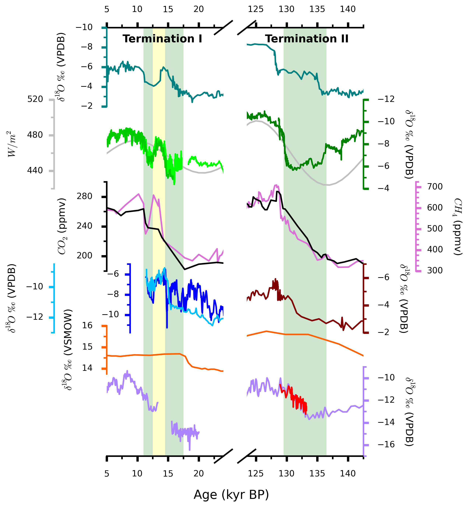
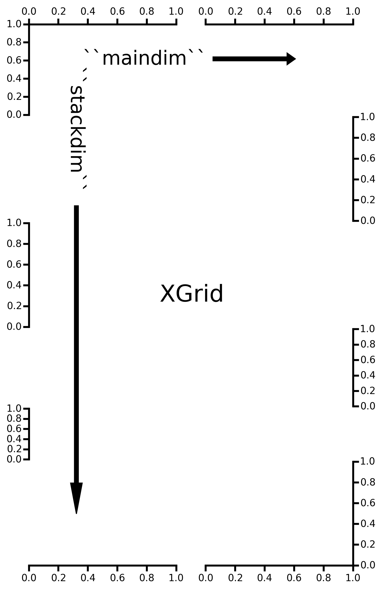
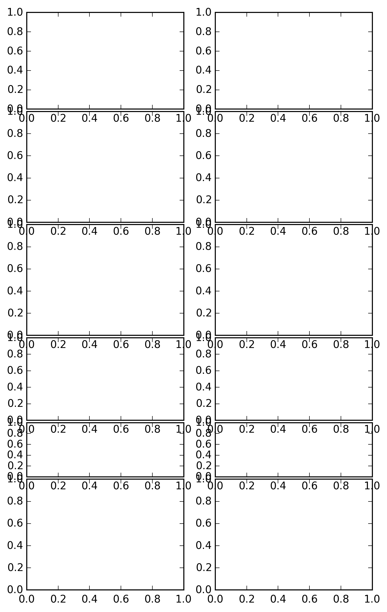
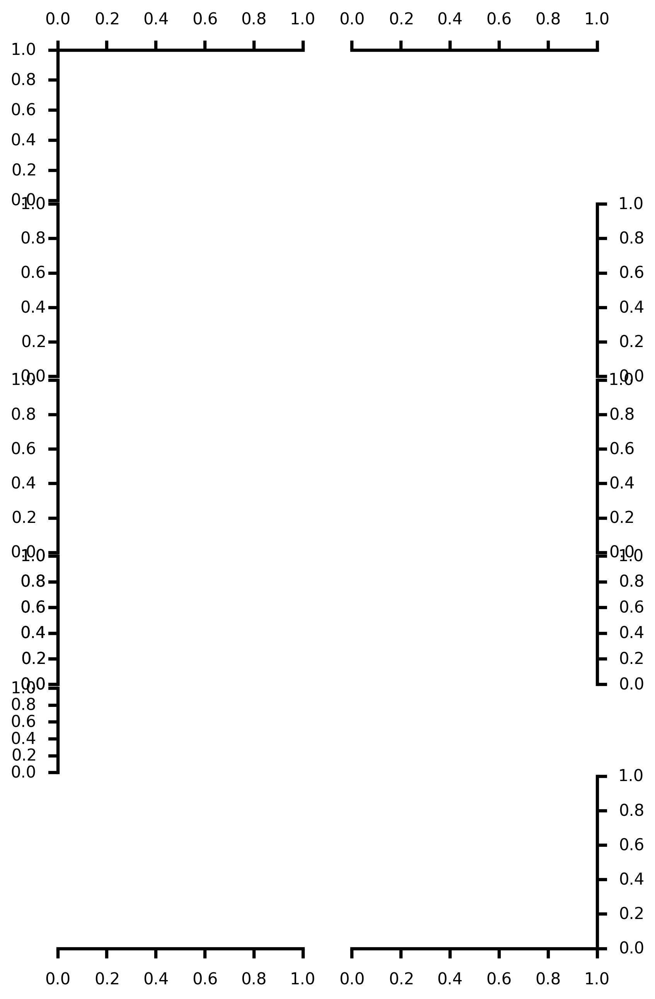
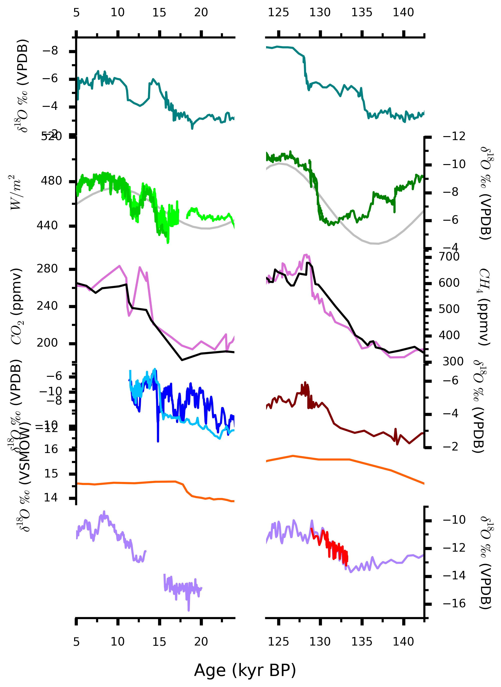

:author: Mellissa Cross
:email: cros0324@umn.edu, mellissa.cross@gmail.com
:institution: Department of Earth Sciences, University of Minnesota

-------------------------------------------------------------------------------------------------------------------------
TrendVis: an Elegant Interface for dense, sparkline-like, quantitative visualizations of multiple series using matplotlib
-------------------------------------------------------------------------------------------------------------------------

.. class:: abstract

   TrendVis is a plotting package that uses matplotlib to create information-dense, sparkline-like visualizations of multiple disparate data sets in a common plot area against a common variable.  This plot type is particularly well-suited for time-series data.  We discuss the rationale behind and the challenges associated with adapting matplotlib to this particular plot style, the TrendVis API and architecture, and various features available for users to customize and enhance the accessiblity of their figures.

.. class:: keywords

   time series visualization, matplotlib, plotting

Introduction
------------
Data visualization and presentation is a key part of scientific communication, and many disciplines depend on the visualization of multiple time-series or other series datasets.  The field of paleoclimatology (the study of past climate and climate change), for example, relies heavily on plots of multiple time-series or "depth series", where data are plotted against depth in a sediment or ice core or stalagmite. These plots are critical for placing new data in regional and global contexts and they facilitate interpretations of the nature, timing, and drivers of climate change. Figure :ref:`finishedproduct`, created using TrendVis, compares the climate and hydrological changes that occurred during the last two deglaciations, called "Terminations", as recorded by paleoclimate records from around the world, and against climate parameters like carbon dioxide (black), methane (pink) [Petit]_, and Northern Hemisphere summer insolation (the amount of solar energy received on an area, gray).

   A TrendVis figure illustrating the similarities and differences among climate records from Israel [BarMatthews]_,  China [Wang]_, [Dykoski]_, [Sanbao]_; Italy [Drysdale]_, and the American Southwest [Wagner]_, [Asmerom]_, and Great Basin [Winograd0]_, [Winograd1]_, [Lachniet]_, [Shakun]_ regions between the last deglaciation (Termination I) and the penultimate deglaciation (Termination II).  Most of these records are stalagmite oxygen isotope records- oxygen isotopes, depending on the location, may record temperature changes, monsoon intensity, changes in the seasonality of precipitation, or other factors. All data are available online as supplementary materials or through the National Climatic Data Center. :label:`finishedproduct`

Creating such plots can be difficult, however.  Many scientists depend on expensive software such as SigmaPlot and Adobe Illustrator.  With pure matplotlib [matplotlib]_, users have two options: display data in a grid of separate subplots or on top of each other using twinned axes. This works for two or three traces, but does not scale well and is unsatisfactory for larger datasets.  Instead of a clutter of smaller plots or a mess of overlain curves, the ideal style in cases with larger datsets is the style shown in Figure :ref:`finishedproduct`  one densely-plotted figure that permits direct comparison of curve features.  The key aim of TrendVis, available on GitHub_, is to facilitate the creation and accessibility of these plots in the scientific Python ecosystem using a matplotlib-based workflow.  Here we discuss how TrendVis interfaces with the matplotlib library to construct this complicated plot type and how users can easily customize and improve the accessibility of their TrendVis plots, and discuss several challenges faced in creating this plot type with matplotlib.  Additionally, an example workflow is given, showing how Figure :ref:`finishedproduct` was created.

.. _Github: https://github.com/mscross/trendvis

The TrendVis Figure Framework
-----------------------------
The backbone of TrendVis is the ``Grid`` class, in which the figure, basic attributes, and relatively orientation-agnostic methods are initialized.  The two subclasses of ``Grid``, ``XGrid`` and ``YGrid``, respectively have x and y as the main (common) axis and have y and x as the stacked (data) axes, thus determining the orientation and overall look of the figure.  As a common application of these types of plots is time-series data, we will examine TrendVis from the perspective of ``XGrid``.  A graphical representation of ``XGrid`` is shown in Figure :ref:`xgridex`.

   In ``XGrid``, ``stackdim`` refers to y axes (rows) and ``maindim`` indicates x axes (columns).  This is reversed in ``YGrid``. Both dimension labels begin in ``XGrid.axes[0][0]``. :label:`xgridex`

TrendVis figures appear to consist of a common plot space.  This, however, is an illusion carefully crafted via a framework of axes and a mechanism for  systematically hiding extra axes spines, ticks, and labels.  This framework and the lists that dictate spine, tick, and label visibility are created when the figure is initialized:

.. code-block:: python
   :linenos:

   paleofig = XGrid([7, 8, 8, 6, 4, 8], xratios=[1, 1],
                    figsize=(6,10))

First, we examine the construction of this framework.  The overall area of the figure is determined by ``figsize``.  The relative sizes of the rows (``ystack_ratios``, the first argument), however, is determined by the contents of ``ystack_ratios`` and the sum of ``ystack_ratios`` (``self.gridrows``), which in this case is 41.  Similarly, the contents and sum of ``xratios`` (``self.gridcols``)determine the relative sizes of the columns.  So, all axes in ``paleofig`` are initialized on a 41 row, 2 column grid within the 6 x 10 inch space set by ``figsize``.  The Axes in position 0,0, (:ref:'xgridex') spans 7/41 unit rows (0 through 6) and the first unit column; the next Axes created spans the same unit rows and the second unit column, finishing the first row of ``paleofig``.  The next row spans 8 unit rows, numbers 7 through 15.  This Axes creation process, shown in the code below, is repeated for all the values in ``ystack_ratios`` and ``xratios``, yielding a figure with 6 rows and 2 columns of Axes.  All Axes in the same row share a y axis, and all Axes in the same column share an x axis.

.. code-block:: python

   xpos = 0
   ypos = 0

   # Create axes row by row
   for rowspan in self.yratios:
       row = []

       for c, colspan in enumerate(self.xratios):
           sharex = None
           sharey = None

           # All ax in row share y with first ax in row
           if xpos > 0:
               sharey = row[0]

           # All ax in col share x with first ax in col
           if ypos > 0:
               sharex = self.axes[0][c]

           ax = plt.subplot2grid((self.gridrows,
                                  self.gridcols),
                                 (ypos, xpos),
                                 rowspan=rowspan,
                                 colspan=colspan,
                                 sharey=sharey,
                                 sharex=sharex)

           ax.patch.set_visible(False)

           row.append(ax)
           xpos += colspan

       self.axes.append(row)

       # Reset x position to left, move to next y pos
       xpos = 0
       ypos += rowspan

Axes are stored in ``paleofig.axes`` as a nested list, where the sublists contain Axes in the same rows.  Next, two parameters that dictate spine visibility are initialized:

``paleofig.dataside_list``
  This list indicates where each row's y axis spine, ticks, and label are visible.  This by default alternates sides from left to right (top to bottom in ``YGrid``), starting at left, unless indicated otherwise during the initialization of  ``paleofig``, or changed later on by the user.
``paleofig.stackpos_list``
  This list controls the x (main) axis visibility.  Each row's entry is based on the physical location of the axis in the plot; by default only the x axes at the top and bottom of the figure are shown and the x axes of middle rows are invisible.  Each list is exposed and can be user-modified, if desired, to meet the demands of the particular figure.

These two lists serve as keys to TrendVis formatting dictionaries and as arguments to Axes (and Axes child) methods.  At any point, the user may call:

.. code-block:: python
   :linenos:
   :linenostart: 3

   paleofig.cleanup_grid()

and this method will systematically adjust labelling and limit axis spine and tick visibility to the positions indicated by ``paleofig.dataside_list`` and ``paleofig.stackpos_list``, transforming the mess in Figure :ref:`preclean` to a far clearer and more accessible format in Figure :ref:`xgridex`.

   Freshly initialized ``XGrid``.  After running ``XGrid.cleanup_Grid()`` (and two formatting calls adjusting the spinewidth and tick appearance), the structure of Figure :ref:`xgridex` is left, in which stack spines are staggered, alternating sides according to ``XGrid.dataside_list``, starting at left.  :label:`preclean`

Creating Axes Twins
-------------------
Although for large datasets, using twinned axes as the sole plotting tool is unadvisable, select usage of twinned axes can improve data visualization.  In the case of ``XGrid``, a twinned Axes is a new Axes that shares the x axis of the original Axes and has a different y axis on the opposite side of the original y axis.  Using twins allows the user to directly overlay datasets.  TrendVis provides the means to easily and systematically create and manage entire rows (``XGrid``) or columns (``YGrid``) of twinned axes.

In our ``paleofig``, we need four new rows:

.. code-block:: python
   :linenos:
   :linenostart: 4

   paleofig.make_twins([1, 2, 3, 3])
   paleofig.cleanup_grid()

This creates twin x axes, one per column, across the four rows indicated and hides extraneous spines and ticks.  In figures like ``paleofig`` that have a main dimension greater than one (i.e., multiple columns), an issue arose in an earlier version of TrendVis with twin rows not sharing y axes as required and as occurs in all original rows.  This is problematic when attempting to change the y axis limits, as only the visible y axis will respond, and data plotted on other Axes in the row will not correspond to the new scale.  The axes in the twinned row are now forced to share y axes via:

.. code-block:: python

   twin_row[0].get_shared_y_axes().join(*twin_row)

After creation, the twin row information is appended to ``paleofig.dataside_list`` and ``paleofig.stackpos_list`` and twinned axes are stored at the end of the list of axes, which previously contained only original rows.  If the user decides to get rid of twin rows (``paleofig.remove_twins()``), ``paleofig.axes``, ``paleofig.dataside_list``, and ``paleofig.stackpos_list`` are returned to their state prior to adding twins.

   The results of making twins, performing another grid cleanup and some minor tick/axis formatting.  :label:`twin`

Accessing Axes
--------------
Retrieving axes, especially when dealing with twin axes in a figure with many hapazardly created twins, can sometimes be non-straightforward.  The following means are available to return individual axes from a TrendVis figure:

``paleofig.fig.axes[axes index]``
  matplotlib stores axes in a 1D list in ``Figure`` in the order of creation.  This method is easiest to use when dealing with an ``XGrid`` of only one column.
``paleofig.axes[row][column]``
  An ``XGrid`` stores axes in a nested list in the order of creation, no matter its dimensions.  Each sublist contains all axes that share the same y axis- a row.  The row index corresponds to the storage position in the list, not the actual physical position on the grid, but in original axes (those created when ``paleofig`` was initialized) these are the same.
``paleofig.get_axis()``
  Any axis can be retrieved from ``paleofig`` by providing its physical row number (and if necessary, column position) to ``paleofig.get_axis()``.  Twins can be parsed with the keyword argument ``is_twin``, which directs ``paleofig.twin_rownum()`` to find the index of the sublist containing the twin row.

In the case of ``YGrid``, the row, column indices are flipped: ``YGrid.axes[column][row]``.  Sublists correspond to columns rather than rows.

Plotting and Formatting
-----------------------
The original TrendVis procedurally generated a simple, 1-column version of ``XGrid``.  Since the figure was made in a single function call, all data had to be provided at once in order, and it all had to be line/point data, as only ``Axes.plot()`` was called.  The new, object-oriented TrendVis does provide ``make_grid()`` and ``plot_data()`` to enable easy figure initialization and quick line plotting on all axes.  However, fewer options are available via this interface.  The regular API is designed to be a highly flexible wrapper around matplotlib.  Axes are readily exposed via the matplotlib and TrendVis methods described above, and so the user can determine the most appropriate plotting functions for their figure.  The author has personally used ``Axes.errorbar()``, ``Axes.fill_betweenx()``, and ``Axes.plot()`` on two individual published TrendVis figures (see figures 3 and 4 in [Cross]_), which would not have been possible in the old procedural format.  As we only require line data for ``paleofig``, rather than make individual calls to each Axes to plt, we will use relatively shorter ``plot_data``.  The datasets have been loaded from a spreadsheet into individual 1D NumPy [NumPy]_ arrays containing age information ('or climate information:

.. code-block:: python
   :linenos:
   :linenostart: 6

   plot_data(paleofig,[[(sorq_age, sorq, '#008080')],
                       [(hu_age, hu, '#00FF00',[0]),
                        (do_age, do, '#00CD00', [0]),
                        (san_age, san, 'green', [1])],
                       [(co2age, co2, 'black')],
                       [(cor_age, cor, 'maroon', [1])],
                       [(dh_age, dh, '#FF6103')],
                       [(gb_age, gb, '#AB82FF'),
                        (leh_age, leh, 'red', [1])],
                       [(insol_age, insol, '0.75')],
                       [(ch4_age, ch4, 'orchid')],
                       [(fs_age, fs, 'blue')],
                       [(cob_age, cob, 'deepskyblue')]],
             marker=None, lw=2, auto_spinecolor=False)

Here, plotting datasets only requires a tuple of the x and y values and the color in a sublist in the appropriate row order.  Some tuples have a fourth element that indicates which column the dataset should be plotted on.  Without this element, the dataset will be plotted on all, or in this case both columns.  Setting different x axis limits for each column will mask this fact.

Although plots individualized on a per axis basis may be important to a user, most aspects of axis formatting should generally be uniform.  In deference to that need and to potentially the sheer number of axes in play, TrendVis contains wrappers designed to expedite these repetitive axis formatting tasks, including setting major and minor tick locators and dimensions, axis labels, and axis limits.

.. code-block:: python
   :linenos:
   :linenostart: 20

   paleofig.set_ylim([(3, -7, -2), (4, 13.75, 16),
                      (5, -17, -9),
                      (6, 420, 520, (7, 300, 725),
                      (8, -11.75, -5))])

   paleofig.set_xlim([(0, 5, 24), (1, 123.5, 142.5)])

   paleofig.reverse_yaxis([0, 1, 3])

   paleofig.set_all_ticknums([(5, 2.5), (5, 2.5)],
                             [(2,1),(2,1),(40,20),(2,1),
                              (1,0.5), (2,1),(40,20),
                              (100,25),(2,1),(2,1)])

   paleofig.set_ticks(major_dim=(7, 3), labelsize=11,
                      pad=4, minor_dim=(4, 2))

   paleofig.set_spinewidth(2)

   # Special characters for axis labels
   d18o = r'$\delta^{18}\!O$'
   d13c = r'$\delta^{13}\!C$'
   d234u = r'$\delta^{234}\!U_{initial}$'
   co2label = r'$CO_{2}$'
   ch4label = r'$CH_{4}$'
   mu = ur'$\u03BC$'
   vpdb = ' ' + ur'$\u2030$'+ ' (VPDB)'
   vsmow =' ' + ur'$\u2030$'+' (VSMOW)'

   paleofig.fig.suptitle('Age (kyr BP)', y=0.065,
                         fontsize=16)
   paleofig.set_ylabels([d18o + vpdb, d18o + vpdb,
                         co2label +' (ppmv)',
                         d18o + vpdb,
                         d18o + vsmow, d18o + vpdb,
                         r'$W/m^{2}$',
                         ch4label + ' (ppmv)', '',
                         d18o + vpdb, d13c + vpdb], fontsize=13)

   Figure after plotting paleoclimate time series records, editing the axes limits, and setting the tick numbering and axis labels.  At this point it is difficult to see which dataset belongs to which axis and to clearly make out the twin axis numbers and labels. :label:`plot`

In this plot style, there are two other formatting features that are particularly useful: moving data axis spines, and automatically coloring .  The first is the lateral movement of data axis (y axis in ``XGrid``, x axis in ``YGrid``) spines into and out of the plot space.  Although the TrendVis' default alternating data axis spine behavior results in distinct separation between y axes in ``paleofig``, adding twin rows disrupts this spacing, as shown in Figure :ref:`plot`.  This problem is exacerbated when compacting the figure, which is a typical procedure in this plot type, as it can improve both the look of the figure and its readability by reducing the amount of empty space and increasing the relative size of features in a given space.  The solution in ``XGrid`` plots is to move spines laterally- along the x dimension- out of the way of each other, into and out of the plot space.  TrendVis provides means to expedite the process of moving spines laterally out of the way of each other.  This can be performed in a single step:

.. code-block:: python
   :linenos:
   :linenostart: 58

   # Make figure more compact:
   paleofig.fig.subplots_adjust(hspace=-0.4)

   # Move spines
   # Shifts are in fractions of figure
   # Absolute position calc as 0 - shift (ax at left)
   # or 1 + shift (for ax at right)
   paleofig.move_spines(twin_shift=[0.45, 0.45,
                                    -0.2, 0.45])

In the above code, all four of the twinned visible y axis spines are moved by an individual amount; the user may set a universal ``twin_shift`` or move the y axis spines of the original Axes in the same way.  Alternatively, all TrendVis methods and attributes involved in ``paleofig.move_spines()`` are exposed, and the user can edit the axis shifts manually and then see the results via ``paleofig.execute_spineshift()``.  As the user-provided shifts are stored, if the user changes the arrangement of visible y axis spines (via ``paleofig.set_dataside()`` or by directly altering ``paleofig.dataside_list``), then all the user needs to do to get the old relative shifts applied to the new arrangement is get TrendVis to calculate new spine positions (``paleofig.absolute_spineshift()``) and perform the shift (``paleofig.execute_spineshift()``).

Although the movement of y axis spines allows the user to read each axis, there is still a lack of clarity in which curve belongs with which axis, which is a common problem for this plot type.  TrendVis' second useful feature is automatically coloring the data axis spines and ticks to match the color of the first curve plotted on that axis.  As we can see in Figure :ref:`icanread`, this draws a visual link between axis and data, permitting most viewers to easily see which curve belongs against which axis.

.. code-block:: python
   :linenos:
   :linenostart: 67

   paleofig.autocolor_spines()

.. figure:: readableplot.png

   Although the plot is very dense, the lateral movement of spines and coloring them to match the curves has greatly improved the accessibility of this figure relative to Figure :ref:`plot`.  The spacing between subplots has also been decreased.  :label:`icanread`

Visualizing Trends
------------------
Large stacks of curves are overwhelming to viewers.  In complicated figures, it is critical to not only keep the plot area tidy and link axes with data, as we saw above, but also to draw the viewer's eye to essential features.  This can be accomplished with shapes that span the entire figure, highlighting areas of importance or demarcating particular spaces.  In ``paleofig``, we are interested in the glacial terminations.  Termination II coincided with a North Atlantic cold period, while during Termination I there were two cold periods interrupted by a warm interval:

.. code-block:: python
   :linenos:
   :linenostart: 68

   # Termination I needs three bars, get axes that will
   # hold the lower left, upper right corners of bar
   ll = paleofig.get_axis(5)
   ur = paleofig.get_axis(0)
   alpha = 0.2

   paleofig.draw_bar(ll, ur, (11, 12.5), alpha=alpha,
                     edgecolor='none', facecolor='green')
   paleofig.draw_bar(ll, ur, (12.5, 14.5), alpha=alpha,
                     edgecolor='none', facecolor='yellow')
   paleofig.draw_bar(ll, ur, (129.5, 136.5), alpha=alpha,
                     edgecolor='none', facecolor='green')

   # Draw bar for Termination II, in column 1
   paleofig.draw_bar(paleofig.get_axis(5, xpos=1),
                     paleofig.get_axis(0, xpos=1),
                     (129.5, 136.5), facecolor='green',
                     edgecolor='none', alpha=alpha)

   # Label terminations
   ax2 = paleofig.get_axis(0, xpos=1)
   paleofig.ax2.text(133.23, -8.5, 'Termination II',
                     fontsize=14, weight='bold',
                     horizontalalignment='center')

   ax1 = paleofig.get_axis(0)
   paleofig.ax1.text(14, -8.5, 'Termination I',
                     fontsize=14, weight='bold',
                     horizontalalignment='center')

The user provides the axes containing the lower left corner of the bar and the upper right corner of the bar.  In the vertical bars of ``paleofig`` the vertical limits consist of the upper limit of the upper right axis and the lower limit of the lower left axis.  The horizontal upper and lower limits are provided in data units, for example (11, 12.5).  The default zorder is -1 in order to place the bar behind the curves, preventing data from being obscured or discolored, .

As these bars typically span multiple axes, they must be drawn in Figure space rather than on the Axes.  There are two main challenges associated with this need.  The first is converting data coordinates to figure coordinates.  In the private function ``_convert_coords()``, we transform data coordinates (``dc``)into axes coordinates, and then into figure coordinates:

.. code-block:: python

    ac = ax.transData.transform(dc)

    fc = self.fig.transFigure.inverted().transform(ac)

The figure coordinates are then used to determine the width, height, and positioning of the Rectangle in figure space.

TrendVis strives to be as order-agnostic as possible.  However, a patch drawn in Figure space is completely divorced from the data the patch is supposed to highlight.  If axes limits are changed, or the vertical or horizontal spacing of the plot is adjusted, then the bar will no longer be in the correct position relative to the data.

As a solution, for each bar drawn with TrendVis, the upper and lower horizontal and vertical limits, the upper right and lower left axes, and the index of the patch in XGrid.fig.patches are all stored as XGrid attributes.  Storing the patch index allows the user to make other types of patches that are exempt from TrendVis' patch repositioning.  When any of TrendVis' wrappers around matplotlib's subplot spacing adjustment, x or y limit settings, etc are used, the user can stipulate that the bars automatically be adjusted to new figure coordinates.  The stored data coordinates and axes are converted to figure space, and the x, y, width, and height of the existing bars are adjusted.  Alternatively, the user can make changes to axes space relative to figure space without adjusting the bar positioning and dimensions each time or without using TrendVis wrappers, and simply adjust the bars at the end.

TrendVis also enables a special kind of bar, a frame.  The frame is designed to anchor data axis spines, and appears around an entire column (row in ``YGrid``) of data axes- which in the case of one column is the entire plot space.  For a softer division of main axes stacks, the user can signify broken axes via cut marks on the broken ends of the main axes:

.. code-block:: python
   :linenos:
   :linenostart: 97

   paleofig.draw_cutout(di=0.075)

Similar to bars, frames are drawn in figure space and can sometimes be moved out of place when axes positions are changed relative to figure space, thus they are handled in the same way.  Cutouts, however, are actual line plots on the axes that live in axes space and will not be affected by adjustments in axes limits or subplot positioning.  With the cut marks drawn on ``paleofig``, we now have the dense but accessible plot shown in Figure :ref:`finishedproduct`.

Conclusions and Moving Forward
------------------------------
TrendVis is a package that expedites the process of creating complex figures with multiple x or y axes against a common y or x axis.  It is largely order-agnostic and exposes most of its attributes and methods in order to promote highly-customizable plot creation in this particular style.  In the long-term, with the help of the scientific Python community, TrendVis aims to become a widely-used higher level tool for the matplotlib plotting library and alternative to expensive software such as SigmaPlot and MatLab, and to time-consuming, error-prone practices like assembling Excel plots in vector graphics editing software.

References
----------
.. [Petit] J. R. Petit et al. *Climate and Atmospheric History of the Past 420,000 years from the Vostok Ice Core, Antarctica*
           Nature, 399:429-436, 1999.

.. [BarMatthews] M. Bar-Matthews et al. *Sea--land oxygen isotopic relationships from planktonic foraminifera and speleothems in the Eastern Mediterranean region and their implication for paleorainfall during interglacial intervals*,
                 Geochimica et Cosmochimica Acta, 67(17):3181-3199, 2003.

.. [Drysdale] R. N. Drysdale et al. *Stalagmite evidence for the onset of the Last Interglacial in southern Europe at 129 $\pm$1 ka*,
              Geophysical Research Letters, 32(24), 2005.

.. [Wang] Y. J. Wang et al. *A high-resolution absolute-dated late Pleistocene monsoon record from Hulu Cave, China*,
          Science, 294(5550):2345-2348, 2001.

.. [Dykoski] C. A. Dykoski et al., *A high-resolution, absolute-dated Holocene and deglacial Asian monsoon record from Dongge Cave, China*,
             Earth and Planetary Science Letters, 233(1):71-86, 2005.

.. [Sanbao] Y. J. Wang et al. *Millennial-and orbital-scale changes in the East Asian monsoon over the past 224,000 years*,
            Nature, 451(7182):1090-1093, 2008.

.. [Wagner] J. D. M. Wagner et al. *Moisture variability in the southwestern United States linked to abrupt glacial climate change*,
            Nature Geoscience, 3:110-113, 2010.

.. [Asmerom] Y. Asmerom et al. *Variable winter moisture in the southwestern United States linked to rapid glacial climate shifts*,
             Nature Geoscience, 3:114-117, 2010.

.. [Winograd0] I. J. Winograd et al. *Continuous 500,000-year climate record from vein calcite in Devils Hole, Nevada*,
               Science, 258(5080):255-260, 1992.

.. [Winograd1] I. J. Winograd et al. *Devils Hole, Nevada, $\delta$ 18 O record extended to the mid-Holocene*,
               Quaternary Research, 66(2):202-212, 2006.

.. [Lachniet] M. S. Lachniet et al. *Orbital control of western North America atmospheric circulation and climate over two glacial cycles*,
              Nature Communications, 5, 2014.

.. [Shakun] J. D. Shakun et al. *Milankovitch-paced Termination II in a Nevada speleothem?*
            Geophysical Research Letters, 38(18), 2011.

.. [matplotlib] J. D. Hunter. *Matplotlib: A 2D Graphics Environment*,
                Computing in Science & Engineering, 9:90-95, 2007.

.. [Cross] M. Cross et al. *Great Basin hydrology, paleoclimate, and connections with the North Atlantic: A speleothem stable isotope and trace element record from Lehman Caves, NV*,
           Quaternary Science Reviews, in press.

.. [NumPy] S. van der Walt et al. *The NumPy Array: A Structure for Efficient Numerical Computation*,
           Computing in Science & Engineering, 13:22-30, 2011.
