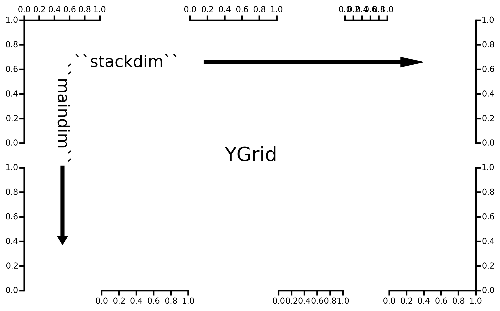

:author: Mellissa Cross
:email: cros0324@umn.edu, mellissa.cross@gmail.com
:institution: Department of Earth Sciences, University of Minnesota

-------------------------------------------------------------------------------------------------------------------------
TrendVis: an Elegant Interface for dense, sparkline-like, quantitative visualizations of multiple series using matplotlib
-------------------------------------------------------------------------------------------------------------------------

.. class:: abstract

   TrendVis is a plotting package that uses matplotlib to create information-dense, sparkline-like visualizations of multiple disparate data sets in a common plot area against a common variable.  This plot type is particularly well-suited for time-series data.  We discuss the rationale behind and the challenges associated with adapting matplotlib to this particular plot style, the TrendVis API and architecture, and various features available for users to customize and enhance the accessiblity of their figures.

.. class:: keywords

   time series visualization, matplotlib, plotting

Introduction
------------

Data visualization and presentation is a key part of scientific communication, and many disciplines depend on the visualization of multiple time-series or other series datasets.  The field of paleoclimatology (the study of past climate and climate change), for example, relies heavily on plots of multiple time-series or "depth series", where data are plotted against depth in a sediment or ice core or stalagmite. These plots are critical for placing new data in regional and global contexts and they facilitate interpretations of the nature, timing, and drivers of climate change.

Creating such plots can be difficult, however.  Many scientists depend on expensive software such as SigmaPlot and Adobe Illustrator.  With matplotlib, users have two options: display data in a grid of separate subplots or on top of each other using twinned axes. This works for two or three traces, but does not scale well and is unsatisfactory for larger datasets.  Instead of a clutter of smaller plots or a mess of overlain curves, the ideal style in cases with larger datsets is the style shown above:  one densely-plotted figure that permits direct comparison of curve features.  The key aim of TrendVis is to facilitate the creation and accessibility of these plots in the scientific Python ecosystem using a matplotlib-based workflow.  Here we discuss how TrendVis interfaces with the matplotlib library to construct this complicated plot type and how users can easily customize and improve the accessibility of their TrendVis plots, and discuss several challenges faced in creating this plot type with matplotlib.

The TrendVis Figure Framework
-----------------------------
The backbone of TrendVis is the ``Grid`` class, in which the figure, basic attributes, and relatively orientation-agnostic methods are initialized.  The two subclasses of ``Grid``, ``XGrid`` and ``YGrid``, respectively have x and y as the main (common) axis and have y and x as the stacked (data) axes, thus determining the orientation and overall look of the figure.  A graphical representation of YGrid and XGrid are shown in Figures :ref:`ygridex` and :ref:`xgridex`.  As a common application of these types of plots is time-series data, we will examine TrendVis from the perspective of ``XGrid``.

   In a ``YGrid``, the x axes (columns) are the stacked dimension or ``stackdim``, and y axes (rows) are the main dimension or ``maindim``.  Both dimension labels begin in ``YGrid.axes[0][0]``. :label:`ygridex`

.. figure:: xgrid_demo.png

   This ``XGrid`` has the same stacked and main dimensions as the ``YGrid`` above.  In XGrid, however, ``stackdim`` refers to y axes (rows) and ``maindim`` indicates x axes (columns).  Both dimension labels begin in ``XGrid.axes[0][0]``. :label:`xgridex`

TrendVis figures appear to consist of a common plot space.  This, however, is an illusion carefully crafted via a framework of axes and a mechanism for  systematically hiding extra axes spines, ticks, and labels.  The dimensions of the ``XGrid`` framework are determined by two arguments, ``ystack_ratios`` and ``xratios``.  Respectively, these are lists of the relative sizes of the desired stack dimension rows and main dimension columns.  In Figure :ref:`xgridex`, ``ystack_ratios == [7, 8, 8, 6, 4, 8]``, and ``xratios == [1, 1]``. The sum of ``ystack_ratios`` (``XGrid.gridrows``) is the height of the plot grid, and the sum of xratios (``XGrid.gridcols``) is the width of the plot grid.  Each item in ``ystack_ratios`` and ``xratios`` therefore becomes the heighth and width of each Axes.

To populate the figure, ``plt.subplot2grid()`` is used to initialize axes, moving first across the main dimension and then down the stack dimension.  Axes are stored in a nested list, where the sublists contains axes in the same row (column in ``YGrid``). All axes in a row share a y axis, and all axes in a column share an x axis.

.. code-block:: python

   xpos = 0
   ypos = 0

   # Create axes row by row
   for rowspan in self.yratios:
       row = []

       for c, colspan in enumerate(self.xratios):
           sharex = None
           sharey = None

           # All ax in row share y with first ax in row
           if xpos > 0:
               sharey = row[0]

           # All ax in col share x with first ax in col
           if ypos > 0:
               sharex = self.axes[0][c]

           ax = plt.subplot2grid((self.gridrows,
                                  self.gridcols),
                                 (ypos, xpos),
                                 rowspan=rowspan,
                                 colspan=colspan,
                                 sharey=sharey,
                                 sharex=sharex)

           ax.patch.set_visible(False)

           row.append(ax)
           xpos += colspan

       self.axes.append(row)

       # Reset x position to left, move to next y pos
       xpos = 0
       ypos += rowspan

After the axes framework is created, ``XGrid`` calls two ``Grid`` methods to intialize lists that indicate for each row: 1. where the y axis spine and ticks are visible (``XGrid.dataside_list``) and 2. where the x axis spine and ticks are visible (``XGrid.stackpos_list``), if at all, based on the physical location of the axis in the plot.  Each list is exposed and can be user-modified, if desired, to meet the demands of the particular figure.

These two lists serve as keys to TrendVis formatting dictionaries and as arguments to Axes (and Axes child) methods in ``XGrid.cleanup_grid()``.  When this method is called, ``XGrid`` systematically hides all unnecessary axis spines and ticks, and forces tick labelling to the indicated sides, transforming the mess in Figure :ref:`preclean` to a far clearer and more accessible format in Figure :ref:`xgridex`.

.. figure:: xgrid_preclean.png

   Freshly initialized ``XGrid``.  After running ``XGrid.cleanup_Grid()`` (and two formatting calls adjusting the spinewidth and tick appearance), the structure of Figure :ref:`xgridex` is left, in which stack spines alternate sides according to ``XGrid.dataside_list``, starting at left.  :label:`preclean`

Creating and Accessing Axes Twins
---------------------------------
Although for large datasets, using twinned axes as the sole plotting tool is unadvisable, select usage of twinned axes can improve data visualization.  TrendVis provides the means to easily and systematically create and manage twinned rows (``XGrid``) or columns (``YGrid``) of axes.

The method ``XGrid.make_twins()`` creates twin x axes, one per column, across the rows indicated.  An issue arose with twin rows in figures with a main dimension greater than one (i.e., in ``XGrid``, multiple columns).  The axes in the twinned row share x axes with the original axes, but do not share y axes with each other, as occurs in all original rows.  This is problematic when attempting to change the y axis limits, as only one axis will respond.  As a result, the axes in the twinned row are now forced to share y axes via:

.. code-block:: python

   twin_row[0].get_shared_y_axes().join(*twin_row)

After creation, the twin row information is appended to ``XGrid.dataside_list`` and ``XGrid.stackpos_list`` and twinned axes are stored at the end of the list of axes, which previously contained only original rows.  If the user decides to get rid of twin rows (``XGrid.remove_twins()``), ``XGrid.axes``, ``XGrid.dataside_list``, and ``XGrid.stackpos_list`` are returned to their state prior to adding twins.

.. figure:: twin.png

   The results of ``XGrid.make_twins([1, 2, 3, 3])``, performing another grid cleanup and some minor tick/axis formatting.  :label:`twin`

Retrieving axes, especially when dealing with twin axes in a figure with many hapazardly created twins, can sometimes be non-straightforward.  The following means are available to return individual axes from a TrendVis figure:

``XGrid.fig.axes[axes index]``
  matplotlib stores axes in a 1D list in ``Figure`` in the order of creation.  This method is easiest to use when ``XGrid`` is only one column.
``XGrid.axes[row][column]``
  ``XGrid`` stores axes in a nested list in the order of creation, no matter the dimensions of ``XGrid``.  Each sublist contains all axes that share the same y axis- a row.  The row index corresponds to the storage position in the list, not the actual physical position on the grid, but in original axes (created when ``XGrid`` was initialized) are these the same.
``XGrid.get_axis()``
  Any axis can be retrieved by providing its physical row number (and if necessary, column position) to ``XGrid.get_axis()``.  Twins can be parsed with the keyword argument ``is_twin``, which directs ``XGrid.twin_rownum()`` to find the index of the sublist containing the twin row.

In the case of ``YGrid``, the row, column indices are flipped: ``YGrid.axes[column][row]``.  Sublists correspond to columns rather than rows.

Plotting and Formatting
-----------------------
The original TrendVis procedurally generated a simple, 1-column version of ``XGrid``.  Since the figure was made in a single function call, all data had to be provided at once in order, and it all had to be line/point data, as only ``Axes.plot()`` was called.  The new, object-oriented TrendVis does provide ``make_grid()`` and ``plot_data()`` to enable easy figure initialization and quick line plotting on all axes.  However, fewer options are available via this interface.  The regular API is designed to be a highly flexible wrapper around matplotlib.  Axes are readily exposed via the matplotlib and TrendVis methods described above, and so the user can determine the most appropriate plotting functions for their figure.  The author has personally used ``Axes.errorbar()``, ``Axes.fill_betweenx()``, and ``Axes.plot()`` on a single TrendVis figure, which would not have been possible in the old procedural format.

Although plots individualized on a per axis basis may be important to a user, most aspects of axis formatting should generally be uniform.  In deference to that need and to potentially the sheer number of axes in play, TrendVis contains wrappers designed to expedite these repetitive axis formatting tasks, including setting major and minor tick locators and dimensions, axis labels, and axis limits.

.. figure:: plot.png

   Figure after plotting paleoclimate time series records, editing the axes limits, and setting the tick numbering and axis labels.  At this point it is difficult to see which dataset belongs to which axis and to clearly make out the twin axis numbers and labels. :label:`plot`

In this plot style, there are two other formatting features that are particularly useful.  The first is the lateral movement of data axis (y axis in ``XGrid``, x axis in ``YGrid``) spines.  Appropriately compacting the figure beyond the original matplotlib/TrendVis output (which can be accomplished via ``plt.subplots_adjust()``) can improve both the look of the figure and its readability by reducing the amount of empty space and increasing the relative size of features in a given space. However, when this is performed data axis spines and labels may begin to overlap with each other, particularly those of twins, which interrupt the default alternating spines pattern.  TrendVis provides means to expedite the process of moving spines laterally.  This can be performed all at once using ``XGrid.move_spines()``, in which the user provides a shift or shifts in fractions of the figure size and TrendVis determines the new absolute lateral positions of the spines and moves them to their new locations.  Alternatively, all TrendVis methods and attributes involved in ``XGrid.move_spines()`` are exposed, and the user can edit the axis shifts manually and then see the results via `XGrid.execute_spineshift()``.  As the user-provided shifts are stored, if the user changes the arrangement of visible y axis spines (via ``XGrid.set_dataside()`` or by directly altering ``XGrid.dataside_list``), then all the user needs to do to get the old relative shifts applied to the new arrangement is get TrendVis to calculate new spine positions and perform the shift.

A problem that often befalls plots in this style is a lack of clarity in which curve belongs with which axis, as well as where one axis begins and another ends.  TrendVis provides another unique formatting tool: coloring the data axis spines and ticks- but not tick labels- to match the color of the data plotted on that axis.  This draws a visual link between axis and data, permitting most viewers to easily see which curve belongs against which axis.

.. figure:: readableplot.png

   Although the plot is very dense, the lateral movement of spines and coloring them to match the curves has greatly improved the accessibility of this figure relative to Figure :ref:`plot`.  The spacing between subplots has also been decreased.  :label:`icanread`

Visualizing Trends
------------------
Large stacks of curves are overwhelming to viewers.  In complicated figures, it is critical to not only keep the plot area tidy and link axes with data, as we saw above, but also to draw the viewer's eye to essential features.  This can be accomplished with shapes that span the entire figure, highlighting areas of importance or demarcating particular spaces.  In TrendVis, this is a simple call:

.. code-block:: python

    XGrid.draw_bar(self, ll_axis, ur_axis, bar_limits,
                   orientation='vertical',zorder=-1,
                   make_adjustable=True, **kwargs)

The user provides the axes (which of course can be obtained via any of the methods described above) containing the lower left corner of the bar and the upper right corner of the bar.  In the case of a vertical bar on an XGrid, the vertical limits consist of the upper limit of the upper right axis and the lower limit of the lower left axis.  The horizontal upper and lower limits are provided in data units via the argument bar_limits.  The default zorder is -1 in order to place the bar behind the curves, preventing data from being obscured, and other formatting keywords can be provided.

As these bars typically span multiple axes, they must be drawn in Figure space rather than on the Axes.  There are two main challenges associated with this need.  The first is converting data coordinates to figure coordinates.  In the private function _convert_coords(), we transform data coordinates into axes coordinates, and then into figure coordinates:

.. code-block:: python

    ac = ax.transData.transform(dc)

    fc = XGrid.fig.transFigure.inverted().transform(ac)

The figure coordinates are then used to determine the width, height, and positioning of the Rectangle in figure space.

TrendVis strives to be as order-agnostic as possible.  However, a patch drawn in Figure space is completely divorced from the data the patch is supposed to highlight.  If axes limits are changed, or the vertical or horizontal spacing of the plot is adjusted, then the bar will no longer be in the correct position relative to the data:

This is where the make_adjustable keyword in the original call comes in.  If make_adjustable is True, which is recommended and default behavior, then the upper and lower horizontal and vertical limits, the upper right and lower left axes, and the index of the patch in XGrid.fig.patches will all be stored as XGrid attributes.  Storing the patch index allows the user to make other patches that will be exempt from TrendVis' patch repositioning.  When any of TrendVis' wrappers around matplotlib's subplot spacing adjustment, x or y limit settings, etc are used, the user can stipulate that the bars automatically be adjusted to new figure coordinates.  The stored data coordinates and axes are converted to figure space, and the x, y, width, and height of the existing bars are adjusted.  Alternatively, the user can make changes to axes space relative to figure space without adjusting the bar positioning and dimensions each time or without using TrendVis wrappers, and simply adjust the bars at the end using ``XGrid.adjust_bar_frame()``.

TrendVis also enables a special kind of bar, a frame.  The frame is designed to anchor data axis spines, and appears around an entire column of data axes- which in the case of one column is the entire plot space.  For a softer division of main axes stacks, the user can signify broken axes via cut marks on the broken ends of the main axes.  This is performed simply by calling ``XGrid.draw_cutouts()``.  Similar to bars, frames are drawn in figure space and can sometimes be moved out of place when axes positions are changed relative to figure space, thus they are handled in the same way.  Cutouts, however, are actual line plots on the axes that live in axes space and will not be affected by adjustments in axes limits or subplot positioning.

.. figure:: barredplot.png

   The addition of broken axes marks and labeled figure-spanning highlighting rectangles effectively draws the eye to the similarities and differences among the climate records between the last deglaciation (Termination I) and the penultimate deglaciation (Termination II).

Conclusions and the Way Forward
-------------------------------
TrendVis is a package that expedites the process of creating figures with multiple x or y axes against a common y or x axis.  It is largely order-agnostic and exposes most of its attributes and methods in order to promote intuitive, highly-customizable plot creation in this particular style.  IN the long-term, TrendVis aims to become a widely-used supplement to the matplotlib plotting library and alternative to expensive software such as SigmaPlot and MatLab, and to time-consuming, error-prone practices like assembling Excel plots in vector graphics editing software.  This package is young and has a lot of room for growth and new features, so pull requests are welcome!
