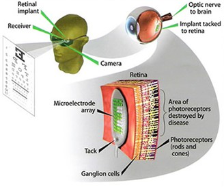
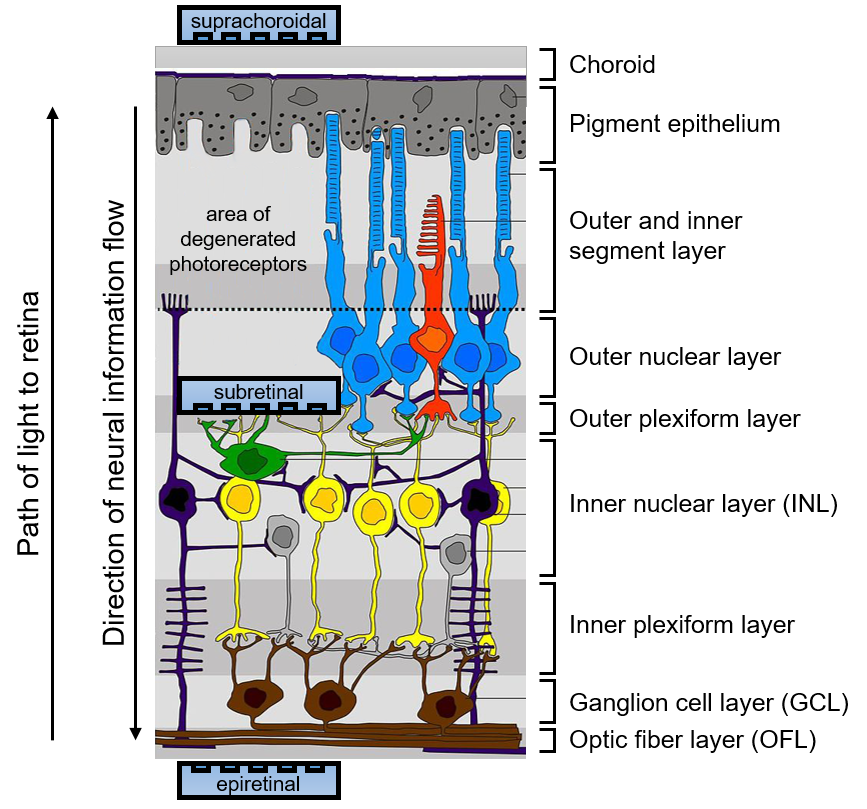
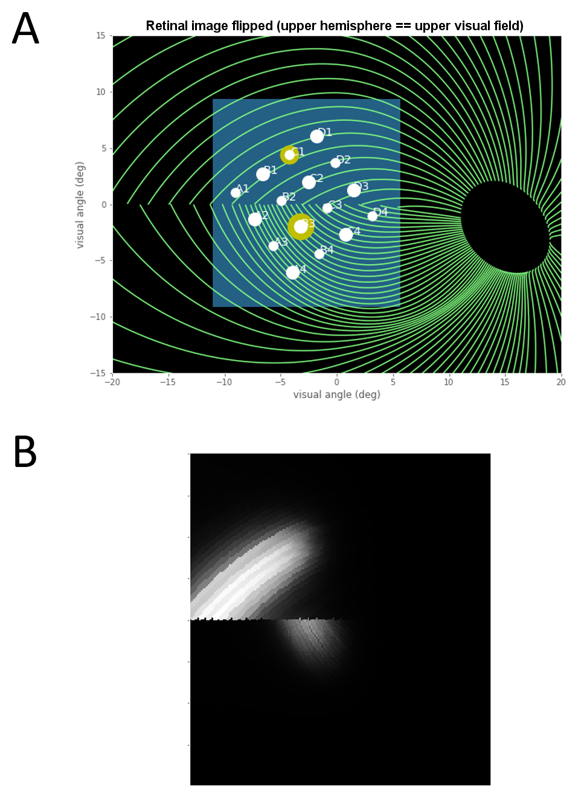
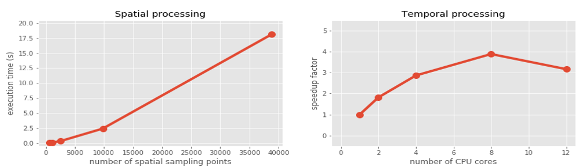

:author: Michael Beyeler
:email: mbeyeler@uw.edu
:institution: Department of Psychology, University of Washington
:institution: Institute for Neuroengineering, University of Washington
:institution: eScience Institute, University of Washington
:corresponding:

:author: Geoffrey M. Boynton
:email: gboynton@uw.edu
:institution: Department of Psychology, University of Washington

:author: Ione Fine
:email: ionefine@uw.edu
:institution: Department of Psychology, University of Washington

:author: Ariel Rokem
:email: arokem@gmail.com
:institution: eScience Institute, University of Washington
:institution: Institute for Neuroengineering, University of Washington

:bibliography: bibliography

:video: https://github.com/uwescience/pulse2percept

--------------------------------------------------------------------
pulse2percept: A Python-based simulation framework for bionic vision
--------------------------------------------------------------------

.. class:: abstract

   By 2020 roughly 200 million people worldwide will suffer from photoreceptor
   diseases such as retinitis pigmentosa and age-related macular degeneration,
   and a variety of retinal sight restoration technologies are being developed
   to target these diseases. One technology, analogous to cochlear implants, uses a grid of electrodes to
   stimulate remaining retinal cells.
   Two brands of retinal prostheses are currently approved for implantation in patients 
   with late stage photoreceptor disease.
   Clinical experience with these implants has made it apparent that
   the vision restored by these devices differs substantially
   from normal sight.    To better understand the outcomes of this technology, 
   we developed *pulse2percept*, an open-source Python implementation
   of a computational model that predicts the perceptual experience
   of retinal prosthesis patients across a wide range of implant configurations.
   A modular and extensible user interface
   exposes the different building blocks of the software,
   making it easy for users to simulate
   novel implants, stimuli, and retinal models.
   We hope that this library will contribute substantially to the field of medicine
   by providing a tool to accelerate the development of visual prostheses.

.. class:: keywords

   bionic vision, retinal implant, pulse2percept, prosthesis

Introduction
------------

Two frequent causes of blindness in the developed world
are age-related macular degeneration (AMD) and retinitis pigmentosa (RP) 
:cite:`Bunker1984,EyeDiseases2004`.
Both of these diseases have a hereditary component,
and are characterized by a progressive degeneration of photoreceptors
in the retina that lead to gradual loss of vision.

Microelectronic retinal prostheses have been developed in an effort
to restore sight to RP and AMD patients.
Analogous to cochlear implants,
these devices function by electrically stimulating 
surviving retinal neurons
in order to evoke neuronal responses that are transmitted
to the brain and interpreted by patients as visual percepts
(Fig. :ref:`figimplant`).
Two of these devices are already approved for commercial use,
and a number of other companies have either started 
or are planning to start clinical trials of devices in the near future.
Other types of technologies, such as optogenetics and genetic modification
are also areas of active research. Blinded individuals may
potentially be offered a wide range of sight restoration options
within a decade :cite:`Fine2015`.

One major challenge in the development of retinal prostheses
is predicting what patients will see when they use their devices.
Interactions between implant electronics and
the underlying neurophysiology cause nontrivial perceptual distortions
in both space and time :cite:`FineBoynton2015,Beyeler2017`
that severely limit the quality of the generated visual experience.

   Electronic retinal prosthesis.
   Light from the visual scene is captured by an external camera and
   transformed into electrical pulses delivered through microelectrodes
   to stimulate the retina.
   :label:`figimplant`

Our goal was to develop a simulation framework that could describe
the visual percepts of retinal prosthesis patients over space and time.
We refer to these simulations as ‘virtual patients’, 
analogous to the virtual prototyping that has
proved so useful in other complex engineering applications.

Here we present an open-source implementation of these models as part of
*pulse2percept*,
a BSD-licensed Python-based simulation framework :cite:`BSDLicense`
that relies on
the NumPy and SciPy stacks, as well as contributions
from the broader Python community.
Based on the detailed specification of a patient's implant configuration,
and given a desired electrical stimulus,
the model predicts the perceptual distortions experienced
by ‘virtual patients’ over both space and time.

We hope that this library will contribute substantially to the field of medicine
by providing a tool to accelerate the development of visual prostheses.
Researchers may use this tool to improve stimulation protocols of existing
implants or to aid development of future devices.
In addition, this tool might guide government agencies,
such as the FDA and Medicare,
in making reimbursement decisions.
Furthermore, this tool can be used to guide patients and doctors 
in their decision as to when or whether to be implanted,
and which device to select.

The remainder of this paper is organized as follows:
We start by introducing the neuroscience background necessary to understand the interactions between implant electronics and
the underlying neurophysiology. We then
detail the computational model that underlies *pulse2percept*,
before we give a simple usage example and go into implementation details.
We then review our solutions to various technical challenges,
and conclude by discussing the broader impact for this work
for computational neuroscience and neural engineering communities 
in more detail.

Background
----------

The first steps in seeing begin in the retina,
where a mosaic of photoreceptors 
converts incoming light into electrochemical signals
that encode the intensity of light as a function of position
(two dimensions), wavelength, and time :cite:`Rodieck1998`.
The electrochemical signal is passed on to 
specialized neuronal circuits
consisting of a variety of cell types
(such as bipolar, amacrine, and horizontal cells),
which act as feature detectors for basic sensory properties, such as spatial contrast and temporal frequency.
These sensory features are then encoded in parallel across approximately
1.5 million retinal ganglion cells, which form the output layer
of the retina.
Each ganglion cell relays the electrical signal to the brain
via a long axon fiber that passes from the ganglion cell body
to the optic nerve and on to the brain.

Diseases such as RP and AMD are characterized by a
progressive degeneration of photoreceptors,
gradually affecting other layers of the retina
:cite:`Humayun1999,Mazzoni2008`.
In severe end-stage RP, roughly 95% of photoreceptors,
20% of bipolar cells,
and 70% of ganglion cells degenerate :cite:`Santos1997`.
In addition, the remaining cells undergo corruptive re-modeling 
in late stages of the disease :cite:`Marc2003a,Marc2003b`,
so that little or no useful vision is retained.

Microelectronic retinal prostheses have been developed in an effort to 
restore sight to individuals suffering from RP or AMD.
Analogous to cochlear implants,
the goal of retinal prostheses is to electrically stimulate 
surviving bipolar or ganglion cells
in order to evoke neuronal responses that are interpreted by the brain
as visual percepts.
The electrical stimulus delivers charge to the cell membrane that 
depolarizes the neuron and opens voltage-sensitive ion channels.
This bypasses the natural presynaptic neurotransmitter excitation 
and causes the activated neurons to stimulate their postsynaptic targets.
Therefore, selective spatiotemporal modulation of retinal neurons 
with an array of electrodes should allow a prosthesis to 
coordinate retinal activity in place
of natural photoreceptor input :cite:`Weiland2016`.

Several types of retinal prostheses are currently in development.
These vary in their user interface, light-detection method, signal processing,
and microelectrode placement within the retina
(for a recent review see :cite:`Weiland2016`).
As far as our model is concerned, the critical factor is the placement
of the microelectrodes on the retina (Fig. :ref:`figretina`).
The three main locations for microelectrode implant placement are 
`epiretinal` (i.e., on top of the retinal surface, above the ganglion cells),
`subretinal` (i.e., next to the bipolar cells in the space of the missing photoreceptors),
and `suprachoroidal` (i.e., between the choroid and the sclera).
Each of these approaches is similar in that light from the visual scene
is captured via a camera and transformed into electrical pulses delivered through electrodes
to stimulate the retina.

   Diagram of the retina and common locations of retinal prosthesis microelectrode arrays.
   Retinitis pigmentosa causes severe photoreceptor degeneration.
   Epiretinal electrode arrays are placed in the vitreous, next to the optic fiber layer (OFL).
   Subretinal arrays are placed by creating a space between the choroid and remaining
   retinal tissue.
   Suprachoroidal arrays are placed behind the choroid.
   *pulse2percept* allows for simulation of processing in the inner nuclear layer (INL),
   ganglion cell layer (GCL), and optic fiber layer (OFL).
   Based on "Retina layers" by Peter Hartmann, CC BY-SA 3.0.
   :label:`figretina`

As mentioned above, two devices are currently approved for commercial
use and are being implanted in patients across the US and Europe:
the Argus II device
(epiretinal, Second Sight Medical Products Inc., :cite:`daCruz2016`)
and the Alpha-IMS system (subretinal, Retina Implant AG, :cite:`Stingl2015`).
At the same time, a number of other companies have either started
or are planning to start clinical trials in the near future,
potentially offering a wide range of sight restoration options
for the blind within a decade :cite:`Fine2015`.

.. figure:: figmodel.eps
   :align: center
   :figclass: w
   :scale: 35%

   Full model cascade.
   A simulated electrical stimulus is processed by a series of linear
   filtering and nonlinear processing steps that model the spatial
   (A, B) and temporal sensitivity (C-F) of the retinal tissue.
   An Argus I device is shown (16 electrodes of 260 or 520 microns
   diameter arranged in a checkerboard pattern).
   The output of the model is a prediction of the visual percept in
   both space and time (example frame shown), which can be compared
   to human patients' drawings.
   :label:`figmodel`

However, clinical experience with existing retinal prostheses makes it
apparent that the vision provided by these devices differs substantially
from normal sight.
Interactions between implant electronics and
the underlying neurophysiology cause nontrivial perceptual distortions
in both space and time :cite:`FineBoynton2015,Beyeler2017`
that severely limit the quality of the generated visual experience.
For example, stimulating a single electrode rarely produces 
the experience of a ‘dot’ of light,
instead leading to percepts that vary drastically in shape,
varying in description from ‘blobs’, to ‘streaks’ and ‘half-moons’.
The percept produced by stimulating a single electrode
with a continuous pulse train also fades over time,
usually disappearing over a course of seconds.
As a result, patients do not report seeing an interpretable world.
One patient describes it as like:
*"... looking at the night sky where you have millions of twinkly lights
that almost look like chaos"* :cite:`PioneerPress2015`.

Previous work by our group has focused on development of
computational models to describe 
some of these distortions for a small number of behavioral observations
in either space :cite:`Nanduri2012` or time :cite:`Horsager2009`.
Here we present a model that can describe spatial distortions,
temporal nonlinearities, and spatiotemporal interactions 
reported across a wide range of conditions, devices, and patients.

.. Our goal was to develop a simulation framework
.. that could describe patient percepts
.. over space and time -- a 'virtual patient'
.. analogous to the virtual prototyping
.. that has proved so useful in other complex engineering applications.
.. We hope that this library will contribute substantially to the field of medicine
.. by providing a tool to accelerate the development of visual prostheses
.. suitable for human trials.
.. For researchers this tool can be used to improve stimulation protocols 
.. for existing devices, and provide a design-tool for future devices.
.. For government agencies such as the FDA and Medicare this tool 
.. can help guide reimbursement decisions. 
.. For patients and doctors it can help guide patients and doctors in their decision 
.. as to when or whether to be implanted, and which device to select. 

.. Our simulation tool integrates and generalizes two computational models 
.. of bionic vision that separately explained spatial :cite:`Nanduri2012`
.. and temporal :cite:`Horsager2009` perceptual distortions
.. for the Second Sight Argus I and Argus II implants.

.. Here we present an open-source implementation of these models as part of
.. *pulse2percept*, a Python-based simulation framework that relies solely on
.. the NumPy and SciPy stacks, as well as contributions
.. from the broader Python community.
.. Based on the detailed specification of a patient's implant configuration,
.. and given a desired electrical stimulation protocol,
.. the model then predicts the perceptual distortions experienced
.. by this "virtual patient" over both space and time.

Computational Model of Bionic Vision
------------------------------------

Analogous to models of cochlear implants :cite:`Shannon1989`, the goal of our
computational model is to approximate,
via a number of linear filtering and nonlinear processing steps,
the neural computations that convert electrical pulse trains across multiple electrodes
into a perceptual experience in space and time. 

.. Our simulation tool integrates and generalizes two computational models 
.. of bionic vision that separately explained spatial :cite:`Nanduri2012`
.. and temporal :cite:`Horsager2009` perceptual distortions
.. for the Second Sight Argus I and Argus II implants.

Model parameters were chosen to fit data from a variety of behavioral experiments 
in patients with prosthetic devices.
For example, in threshold experiments patients were asked to report whether or not 
they detected a percept. 
Across many trials, the minimum stimulation current amplitude needed 
to reliably detect the presence of a percept on 80% of trials was found. 
This threshold was measured across a variety of pulse trains that varied across dimensions such as frequency, duty cycle, and duration. 
In other experiments patients reported the apparent brightness or size of percepts 
on a rating scale. 
In others patients drew the shapes of the percepts evoked by stimulation.
The model has been shown to generalize across individual
electrodes, patients, and devices, as well as across different experiments.
Detailed methods of how the model was validated 
can be found in :cite:`Horsager2009,Nanduri2012,Beyeler2017`.
Here we provide a brief overview of the model cascade.

The full model cascade for an Argus I epiretinal prosthesis is illustrated in
Fig. :ref:`figmodel`. 
The Argus I device simulated here consists of electrodes
of 260 :math:`\mu m` and 520 :math:`\mu m`
diameter, arranged in a checkerboard pattern (Fig. :ref:`figmodel` A).
In this example, input to the model is a pair of simulated pulse
trains phase-shifted by :math:`\delta` ms,
which are delivered to two individual simulated electrodes.

The first stages of the model describe the spatial distortions 
resulting from interactions 
between the electronics and the neuroanatomy of the retina. 
We assume that the current density caused by electrical stimulation decreases
as a function of distance from the edge of the electrode
:cite:`Ahuja2008`:

.. math::
   :label: eqcurrentspread

   c(d) = \frac{\alpha}{\alpha + d^n}

where :math:`d` is the 3D Euclidean distance to the electrode edge,
:math:`\alpha = 14000` and the exponent :math:`n=1.69`.
Current fields for two stimulated electrodes are shown, 
Fig. :ref:`figmodel` A
(the hotter the color, the higher the current).

Due to the fact that epiretinal implants sit on top of the optic fiber layer
(Fig. :ref:`figretina`),
they do not only stimulate ganglion cell bodies but also ganglion cell axons.
It is critical to note that, perceptually, activating an axon fiber that passes under a stimulated electrode
is indistinguishable from the percept that would be elicited by activating the corresponding ganglion cell *body*.
The produced visual percept will appear in the 
spatial location in visual space for which the corresponding ganglion cell and axon usually encodes information.
Ganglion cells send their axons on highly stereotyped
pathways to the optic disc (green lines in Fig. :ref:`figmodel` B),
which have been mathematically described :cite:`Jansonius2009`.
As a result, electrical stimulation of axon fibers leads to predictable
visual ‘streaks’ or ‘comet trails’ that are aligned with the axonal pathways.

We therefore convert the spatial map of current densities 
into a tissue activation map by accounting for axonal stimulation.
We model the sensitivity of axon fibers as decreasing exponentially
as a function of distance from the corresponding ganglion cell bodies.
The resulting tissue activation map across the retinal surface is shown
as a heatmap in Fig. :ref:`figmodel` B
(the hotter the color, the larger the amount of tissue stimulation).

The remaining stages of the model describe temporal nonlinearities. 
Every pixel of the tissue activation map is modulated over time by the applied
electrical pulse train in order to predict a perceived brightness value
that varies over time.
This involves applying a series of linear filtering 
(Fig. :ref:`figmodel` C, D, and F) 
and nonlinear processing (Fig. :ref:`figmodel` E) steps in the time domain
that are designed to approximate the processing of visual information 
within the retina and visual cortex.

Linear responses in Fig. :ref:`figmodel` C, D, and F
are modeled as temporal low-pass filters,
or ‘leaky integrators’,
using gamma functions of order :math:`n`:

.. math::
   :label: eqgamma

   \delta(t, n, \tau) = \frac{\exp(-t / \tau)}{\tau (n - 1)!} \Big( \frac{t}{\tau} \Big)^{n-1}

where :math:`t` is time,
:math:`n` is the number of identical, cascading stages,
and :math:`\tau` is the time constant of the filter.

The first temporal processing step convolves the
timeseries of tissue activation strengths :math:`f(t)`
at a particular spatial location
with a one-stage gamma function (:math:`n=1`,
time constant :math:`\tau_1 = 0.42` ms)
to model the impulse response function of retinal ganglion cells
(Fig. :ref:`figmodel` C):

.. math::
   :label: eqfast

   r_1(t) = f(t) * \delta(t, 1, \tau_1),

where :math:`*` denotes convolution.

Behavioral data suggests that the system becomes less sensitive
as a function of accumulated charge.
This is implemented by calculating the amount of accumulating charge
at each point of time in the stimulus, :math:`c(t)`,
and by convolving this accumulation with a second one-stage gamma function
(:math:`n=1`, time constant :math:`\tau_2 = 45.3` ms;
Fig. :ref:`figmodel` D).
The output of this convolution is scaled by a factor
:math:`\epsilon_1 = 8.3` and subtracted from :math:`r_1` (Eq. :ref:`eqfast`):

.. math::
   :label: eqacc

   r_2(t) = r_1(t) - \epsilon_1\big( c(t) * \delta(t, 1, \tau_2) \big).

The response :math:`r_2(t)` is then passed through a stationary
nonlinearity (Fig. :ref:`figmodel` E) to model the nonlinear input-output
relationship of ganglion cell spike generation:

.. math::
   :label: eqnonlinear

   r_3(t) = r_2(t) \frac{\alpha}{1 + \exp{\frac{\delta - \max_t{r_2(t)}}{s}}}

where :math:`\alpha = 14` (asymptote),
:math:`s = 3` (slope),
and :math:`\delta = 16` (shift) are chosen
to match the observed psychophysical data.

Finally, the response :math:`r_3(t)` is convolved with another low-pass
filter described as a three-stage gamma function
(:math:`n = 3`, :math:`\tau_3 = 26.3` ms)
intended to model slower perceptual processes in the brain
(Fig. :ref:`figmodel` F):

.. math::
   :label: eqslow

   r_4(t) = \epsilon_2 r_3(t) * \delta(t, 3, \tau_3),

where :math:`\epsilon_2 = 1000` is a scaling factor used to
scale the output to subjective brightness values in the range [0, 100].

The output of the model is thus a movie of brightness values that corresponds
to the predicted perceptual experience of the patient.
An example percept generated is shown 
on the right-hand side of Fig. :ref:`figmodel`
(‘predicted percept’, brightest frame in the movie).

.. Parameters of the model were fit to psychophysical data by
.. comparing predicted percepts to behavioral data from Argus I and II patients.

.. As can be seen in the figure above, 
.. any given electrode generally only stimulates a small subregion of the retina. 
.. As a consequence, when only a few electrodes are active significant speed savings 
.. can often be obtained by skipping pixels which will not be significantly stimulated 
.. by that electrode, for example pixels whose intensity values in this heat map 
.. are less than a certain percent (e.g. 25%) of the largest value. 

.. Actually, all parameter values are already given in text...so no need for the table

.. All parameter values are given in Table :ref:`tableparams`.

.. .. raw:: latex

..    \begin{table}[h]
..      \begin{tabular}{|r|r|r|}
..      \hline
..      Name & Parameter & Value \\
..      \hline
..      Time constant: ganglion cell impulse response & $\tau_1$ & 0.42 ms \\
..      Time constant: charge accumulation & $\tau_2$ & 45.3 ms \\
..      Time constant: cortical response & $\tau_3$ & 26.3 ms \\
..      \hline
..      \end{tabular}
..      \caption{Parameter values}
..      \label{tableparams}
..    \end{table}

Implementation and Results
--------------------------

Code Organization
~~~~~~~~~~~~~~~~~

The *pulse2percept* project seeks a trade-off between 
optimizing for computational performance
and ease of use.
To facilitate ease of use, we organized the software
as a standard Python package,
consisting of the following primary modules:

- :code:`api`: a top-level Application Programming Interface.
- :code:`implants`: implementations of the details of different retinal
  prosthetic implants. This includes Second Sight's Argus I and Argus II implants,
  but can easily be extended to feature custom implants (see Section Extensibility).
- :code:`retina`: implementation of a model of the retinal distribution 
  of nerve fibers, based on :cite:`Jansonius2009`, and an implementation of the 
  temporal cascade of events described in Eqs. 2-6.
  Again, this can easily be extended to custom temporal models (see Section Extensibility).
- :code:`stimuli`: implementations of commonly used electrical stimulation
  protocols, including methods for translating images and movies into simulated
  electrical pulse trains.
  Again, this can easily be extended to custom stimulation protocols 
  (see Section Extensibility).
- :code:`files`: a means to load/store data as images and videos.
- :code:`utils`: various utility and helper functions.

Basic Usage
~~~~~~~~~~~

Here we give a minimal usage example to produce the percept shown on the right-hand
side of Fig. :ref:`figmodel`.

Convention is to import the main :code:`pulse2percept` module
as :code:`p2p`. Throughout this paper, if a class is referred
to with the prefix :code:`p2p`, it means this class belongs to
the main pulse2percept library (e.g., :code:`p2p.retina`):

.. code-block:: python
   :linenos:

   import pulse2percept as p2p

:code:`p2p.implants`
....................

Our goal was to create electrode implant objects that could be configured 
in a highly flexible manner.  
As far as placement is concerned, 
an implant can be placed at a particular location
on the retina (:code:`x_center`, :code:`y_center`)
with respect to the fovea (in microns),
and rotated as you see fit (:code:`rot`):

.. code-block:: python
   :linenos:
   :linenostart: 2

   import numpy as np
   implant = p2p.implants.ArgusI(x_center=-800,
                                 y_center=0,
                                 h=80,
                                 rot=np.deg2rad(35))

Here, we make use of the :code:`ArgusI` array type, which provides pre-defined values
for array type (‘epiretinal’) and electrode diameters.
In addition, the distance between the array and the retinal tissue can be specified via the height parameter
(:code:`h`), either on a per-electrode basis (as a list) 
or using the same value for all electrodes (as a scalar).

The electrodes within the implant can also be specified. An implant is a wrapper around a list of
:code:`p2p.implants.Electrode` objects, which are accessible
via indexing or iteration (e.g., via
:code:`[for i in implant]`).
This allows for specification of electrode diameter, position, and distance to the retinal tissue
on a per-electrode basis.
Once configured, every :code:`Electrode` object in the implant can also be assigned a name
(in the Argus I implant, they are A1 - A16;
corresponding to the names that are commonly
used by Second Sight Medical Products Inc.).
The first electrode in the implant can be accessed both via its
index (:code:`implant[0]`) and its name (:code:`implant['A1']`).

Once the implant is created, it can be passed to the simulation framework.
This is also where you specify the back end
(currently supported are ‘serial’, ‘joblib’ :cite:`Joblib2016`,
and ‘dask’ :cite:`Dask2016`):

.. code-block:: python
   :linenos:
   :linenostart: 7

   sim = p2p.Simulation(implant, engine='joblib',
                        num_jobs=8)

The simulation framework provides a number of setter functions
for the different layers of the retina.
These allow for flexible specification of optional settings,
while abstracting the underlying functionality.

:code:`p2p.retina`
..................

This includes the implementation of a model of the retinal distribution of nerve fibers, 
based on :cite:`Jansonius2009`, and implementations of the temporal cascade of events 
described in Eqs. 2-6.

Things that can be set include the spatial sampling rate of
the optic fiber layer (:code:`ssample`) as well as the
spatial extent of the retinal patch to be simulated
(given by the corner points :code:`[xlo, ylo]` and :code:`[xhi, yhi]`).
If the coordinates of the latter are not given,
a patch large enough to fit the specified electrode array will be
automatically selected:

.. code-block:: python
   :linenos:
   :linenostart: 9

   ssample = 100  # microns
   num_axon_samples = 801
   sim.set_optic_fiber_layer(ssample=ssample,
                             num_axon_samples=801)

Similarly, for the ganglion cell layer we can choose one of the
pre-existing cascade models and specify a temporal sampling rate:

.. code-block:: python
   :linenos:
   :linenostart: 13

   tsample = 0.005 / 1000  # seconds
   sim.set_ganglion_cell_layer('Nanduri2012',
                               tsample=tsample)

As its name suggest, :code:`'Nanduri2012'` implements the model
detailed in :cite:`Nanduri2012`.
Other options include :code:`'Horsager2009'` :cite:`Horsager2009`
and :code:`'latest'`.

   Model input/output generated by the example code.
   (A) An epiretinal Argus I array is placed near the fovea, and
   two electrodes (‘C1’ and ‘B3’) are stimulated with 50 Hz,
   20 uA pulse trains. The plot is created by lines 34-36.
   Note that the retinal image is flipped, so that the upper
   hemisphere corresponds to the upper visual field.
   (B) Predicted visual percept (example frame shown).
   The plot is created by line 41.
   :label:`figinputoutput`

It's also possible to specify your own (custom) model, 
see Section Extensibility below.

:code:`p2p.stimuli`
...................

A stimulation protocol can be specified by assigning
stimuli from the :code:`p2p.stimuli` module to specific
electrodes.
An example is to set up a pulse train of particular stimulation
frequency, current amplitude and duration. 
Because of safety considerations, all real-world stimuli must be 
balanced biphasic pulse trains 
(i.e., they must have a positive and negative phase of equal area,
so that the net current delivered to the tissue sums to zero).

It is possible to specify a pulse train for each electrode in the implant as follows:

.. code-block:: python
   :linenos:
   :linenostart: 16

   # Stimulate two electrodes, others set to zero
   stim = []
   for elec in implant:
       if elec.name == 'C1' or elec.name == 'B3':
           # 50 Hz, 20 uA, 0.5 sec duration
           pt = p2p.stimuli.PulseTrain(tsample,
                                       freq=50.0,
                                       amp=20.0,
                                       dur=0.5)
       else:
           pt = p2p.stimuli.PulseTrain(tsample, freq=0)
       stim.append(pt)

However, since implants are likely to have electrodes numbering 
in the hundreds or thousands,
this method will rapidly become cumbersome 
when assigning pulse trains across multiple electrodes.
Therefore, an alternative is to assign pulse trains to electrodes
via a dictionary:

.. code-block:: python
   :linenos:
   :linenostart: 28

   stim = {
       'C1': p2p.stimuli.PulseTrain(tsample, freq=50.0,
                                    amp=20.0, dur=0.5)
       'B3': p2p.stimuli.PulseTrain(tsample, freq=50.0,
                                    amp=20.0, dur=0.5)
   }

At this point, we can highlight the stimulated electrodes in the array:

.. code-block:: python
   :linenos:
   :linenostart: 34

   import matplotlib.pyplot as plt
   %matplotlib inline
   sim.plot_fundus(stim)

The output can be seen in Fig. :ref:`figinputoutput` A.

Finally, the created stimulus serves as input to
:code:`sim.pulse2percept`, which is used to convert the
pulse trains into a percept.
This allows users to simulate the predicted percepts for simple input stimuli,
such as stimulating a pair of electrodes,
or more complex stimuli,
such as stimulating a grid of electrodes in the shape of the letter A.

At this stage in the model it is possible to consider which retinal layers 
are included in the temporal model,
by selecting from the following list
(see Fig. :ref:`figretina` for a schematic of the anatomy):

* :code:`'OFL'`: optic fiber layer (OFL), where ganglion cell axons reside,
* :code:`'GCL'`: ganglion cell layer (GCL), where ganglion cell bodies reside, and
* :code:`'INL'`: inner nuclear layer (INL), where bipolar cells reside.

A list of retinal layers to be included in the simulation is then passed
to the :code:`pulse2percept` method:

.. code-block:: python
   :linenos:
   :linenostart: 37

   # From pulse train to percept
   percept = sim.pulse2percept(stim, tol=0.25,
                               layers=['GCL', 'OFL'])

This allows the user to run simulations that include only the layers relevant
to a particular simulation.
For example, axonal stimulation and the resulting axon streaks can be ignored by
omitting :code:`'OFL'` from the list.
By default, all three supported layers are included.

Here, the output :code:`percept` is a :code:`p2p.utils.TimeSeries`
object that contains the time series data in its :code:`data`
container.
This time series consists of brightness values (arbitrary units in [0, 100])
for every pixel in the percept image.

Alternatively, it is possible to retrieve the brightest (mean over all pixels)
frame of the time series:

.. code-block:: python
   :linenos:
   :linenostart: 40

   frame = p2p.get_brightest_frame(percept)

Then we can plot it with the help of Matplotlib
(Fig. :ref:`figinputoutput` B):

.. code-block:: python
   :linenos:
   :linenostart: 41

   plt.imshow(frame, cmap='gray')

:code:`p2p.files`
.................

*pulse2percept* offers a collection of functions to convert the 
:code:`p2p.utils.TimeSeries` output into a movie file 
via scikit-video :cite:`ScikitVideo` and ffmpeg :cite:`FFmpeg`.

For example, a percept can be stored to an MP4 file as follows:

.. code-block:: python
   :linenos:
   :linenostart: 42

   # Save movie at 15 frames per second
   p2p.files.save_video(percept, 'mypercept.mp4',
                        fps=15)

For convenience, *pulse2percept* provides a function to load
a video file and convert it to the :code:`p2p.utils.TimeSeries`
format:

.. code-block:: python
   :linenos:
   :linenostart: 45

   # Load video as TimeSeries of size (M x N x T),
   # M: height, N: width, T: number of frames
   video = p2p.files.load_video('mypercept.mp4')

Analogously, *pulse2percept* also provides functionality to
go directly from images or videos to electrical stimulation on an
electrode array:

.. code-block:: python
   :linenos:
   :linenostart: 48

   from_img = p2p.stimuli.image2pulsetrain('myimg.jpg',
                                           implant)
   from_vid = p2p.stimuli.video2pulsetrain('mymov.avi',
                                           implant)

These functions are based on functionality provided by
scikit-image :cite:`ScikitImage2014` and scikit-video :cite:`ScikitVideo`, 
respectively, and come with a number of options to specify whether
brightness should be encoded as pulse train amplitude or frequency,
at what frame rate to sample the movie, whether to maximize or
invert the contrast, and so on.

Extensibility
~~~~~~~~~~~~~

As described above, our software is designed to allow for
implants, retinal models, and pulse trains to be customized.
We provide extensibility mainly through mechanisms of
class inheritance.

Retinal Implants
................

Creating a new implant involves inheriting from
:code:`p2p.implants.ElectrodeArray`
and providing a property :code:`etype`,
which is the electrode type
(e.g., :code:`'epiretinal'`, :code:`'subretinal'`):

.. code-block:: python
   :linenos:
   :linenostart: 52

   import pulse2percept as p2p

   class MyImplant(p2p.implants.ElectrodeArray):

       def __init__(self, etype):
           """Custom electrode array

           Parameters
           ----------
           etype : str
               Electrode type, {'epiretinal',
               'subretinal'}
           """
           self.etype = etype
           self.num_electrodes = 0
           self.electrodes = []

Then new electrodes can be added by utilizing the
:code:`add_electrodes` method of the base class:

.. code-block:: python
   :linenos:
   :linenostart: 68

   myimplant = MyImplant('epiretinal')
   r = 150  # electrode radius (um)
   x, y = 10, 20  # distance from fovea (um)
   h = 50  # height from retinal surface (um)
   myimplant.add_electrodes(r, x, y, h)

Retinal cell models
...................

Any new ganglion cell model is described as a series of
temporal operations that are 
carried out on a single pixel of the image.
It must provide a property called :code:`tsample`,
which is the temporal sampling rate,
and a method called :code:`model_cascade`,
which translates a single-pixel pulse train into
a single-pixel percept over time:

.. code-block:: python
   :linenos:
   :linenostart: 73

   class MyGanglionCellModel(p2p.retina.TemporalModel):
       def model_cascade(self, in_arr, pt_list, layers,
                         use_jit):
           """Custom ganglion cell model

           Parameters
           ----------
           in_arr : array_like
               2D array <#layers x #time points> of
               effective current values at a single
               pixel location.
           pt_list : list
               List of pulse train `data` containers.
           layers : list
               List of retinal layers to simulate.
               Choose from:
               - 'OFL': optic fiber layer
               - 'GCL': ganglion cell layer
               - 'INL': inner nuclear layer
           use_jit : bool
               If True, applies just-in-time (JIT)
               compilation to expensive computations
               for additional speedup (requires Numba)
           """
           return p2p.utils.TimeSeries(self.tsample,
                                       in_arr[0, :])

This method can then be passed to the simulation framework:

.. code-block:: python
   :linenos:
   :linenostart: 99

   mymodel = MyGanglionCellModel()
   sim.set_ganglion_cell_layer(mymodel)

It will then automatically be selected as the implemented ganglion cell
model when :code:`sim.pulse2percept` is called.

Stimuli
.......

The smallest stimulus building block provided by *pulse2percept*
consists of a single pulse of either positive current (anodic)
or negative current (cathodic),
which can be created via :code:`p2p.stimuli.MonophasicPulse`.
However, as described above,
any real-world stimulus must consist of
biphasic pulses with zero net current.
A single biphasic pulse can be created via 
:code:`p2p.stimuli.BiphasicPulse`.
A train of such pulses can be created via
:code:`p2p.stimuli.PulseTrain`.
This setup gives the user the opportunity to build their own
stimuli by creating pulse trains of varying
amplitude, frequency, and inter-pulse intervals.

In order to define new pulse shapes and custom stimuli,
the user can either inherit from any of these stimuli classes
or directly from :code:`p2p.utils.TimeSeries`.
For example, a biphasic pulse can be built from two monophasic
pulses as follows:

.. code-block:: python
   :linenos:
   :linenostart: 101

   from pulse2percept.stimuli import MonophasicPulse

   class MyBiphasicPulse(p2p.utils.TimeSeries):

       def __init__(self, pdur, tsample):
           """A charge-balanced pulse with a cathodic
              and anodic phase

           Parameters
           ----------
           tsample : float
               Sampling time step in seconds.
           pdur : float
               Single-pulse phase duration (seconds).
           """
           on = MonophasicPulse('anodic', pdur, tsample,
                                0, pdur)
           off = MonophasicPulse('cathodic', pdur,
                                 tsample, 0, pdur)
           on.append(off)
           utils.TimeSeries.__init__(self, tsample, on)

Implementation Details
~~~~~~~~~~~~~~~~~~~~~~

*pulse2percept*'s main technical challenge is computational cost:
the simulations require a fine subsampling of space,
and span several orders of magnitude in time. 
In the space domain the software needs to be able to simulate
electrical activation of individual retinal ganglion cells
on the order of microns.
In the time domain the model needs to be capable of 
dealing with pulse trains containing individual pulses 
on the sub-millisecond time scale that last over several seconds.

   Computational performance.
   (A) Compute time to generate an ‘effective stimulation map’ is shown as a function of
   the number of spatial sampling points used to characterize the retina.
   (B) Speedup factor (serial execution time / parallel execution time) is shown 
   as a function of the number of CPU cores.
   Execution times were collected for the an Argus II array (60 electrodes)
   simulating the letter ‘A’ (roughly 40 active electrodes, 20 Hz/20 uA pulse trains)
   over a period of 500 ms (:code:`tsample` was 10 microseconds,
   :code:`ssample` was 50 microns).
   Joblib and Dask parallelization back ends gave similar results. 
   :label:`figperformance` 

 
Like the brain, we solve this problem through parallelization. 
Spatial interactions are confined to an initial stage of processing
(Fig. :ref:`figmodel` A, B),
after which all spatial computations are parallelized
using two back ends (Joblib :cite:`Joblib2016` and Dask :cite:`Dask2016`), 
with both multithreading and multiprocessing options. 

However, even after parallelization, computing the temporal response
remains a computational bottleneck.
Initial stages of the temporal model require convolutions of arrays
(e.g., Eqs. 2 and 3) that describe responses of the model
at high temporal resolution
(sampling rates on the order of 10 microseconds) for
pulse trains lasting for at least 500 milliseconds. 
These numerically-heavy sections of the code are sped up using 
a conjunction of three strategies.
First, as described above, any given electrode generally only stimulates 
a subregion of the retina. 
As a consequence, when only a few electrodes are active,
we can often obtain substantial speed savings
by ignoring pixels which are not significantly stimulated by any electrode
(see tolerance parameter :code:`tol` on line 38 of the example code).
Second, electrical stimulation is often carried out at 
relatively low pulse train frequencies of less than 50 Hz. 
Since the individual pulses within the pulse train are usually very short 
(~75-450 microseconds), input pulse trains tend to be sparse.
We can exploit this fact to speed up computation time 
by avoiding direct convolution
with the entire time-series whenever possible, and
instead relying on a custom-built sparse convolution function.
Preprocessing of sparse pulse train arrays allows us to 
carry out temporal convolution only for those parts 
of the time-series that include nonzero current amplitudes. 
Finally, these convolutions are sped up wih LLVM-base compilation
implemented using Numba :cite:`Lam2015`.

Computational Performance
~~~~~~~~~~~~~~~~~~~~~~~~~

We measured computational performance of the model for 
both spatial and temporal processing
using a 12-core Intel Core i7-5930K 
operating at 3.50 GHz (64GB of RAM).

The initial stages of the model scale as a function of the number
of spatial sampling points in the retina,
as shown in Fig. :ref:`figperformance` A.
Since the spatial arrangement of axonal pathways does not depend
on the stimulation protocol or retinal implant,
*pulse2percept* automatically stores and re-uses the generated
spatial map depending on the specified set of spatial parameters.

The remainder of the model is carried out in parallel, 
with the resulting speedup factor shown in Fig. :ref:`figperformance` B.
Here, the speedup factor is calculated as the ratio of single-core execution time
and parallel execution time.
On this particular machine,
the maximum speedup factor is obtained with eight cores,
above which the simulation shifts from being CPU bound to being memory bound,
leading to a decrease in speedup.
At its best, simulating typical stimulation of an Argus II over a timecourse of
500 milliseconds (at 50 microns spatial resolution and 10 ms temporal resolution)
required 79 seconds of execution time.
According to line profiling,
most of the time is spent executing the slow convolutions (Fig. :ref:`figmodel` D, F),
thus heavily relying on the computational performance of the SciPy implementation
of the Fast Fourier Transform.
Due to the current design constraints (see Discussion),
the software is better suited for rapid prototyping
rather than real-time execution - although we aim to alleviate
this in the future through GPU parallelization
(via CUDA :cite:`Klockner2012` and Dask :cite:`Dask2016`)
and cluster computing (via Spark :cite:`Spark2016`).

Software availability and development
~~~~~~~~~~~~~~~~~~~~~~~~~~~~~~~~~~~~~

All code can be found at https://github.com/uwescience/pulse2percept,
with up-to-date source code documentation
available at https://uwescience.github.io/pulse2percept.
In addition, the latest stable release is available on the Python Package Index
and can be installed using pip:

.. code-block:: bash

  $ pip install pulse2percept

The library's test suite can be run as follows:

.. code-block:: bash

  $ py.test --pyargs pulse2percept --doctest-modules

All code presented in this paper is current as of the v0.2 release.

Discussion
----------

We presented here an open-source, Python-based framework for modeling
the visual processing in retinal prosthesis patients. 
This software generates a simulation of the perceptual experience 
of individual prosthetic users - a ‘virtual patient’. 

The goal of *pulse2percept* is to provide open-source simulations
that can allow any user to evaluate the perceptual experiences
likely to be produced across both current and future devices.
Specifically, the software is designed to meet 
four software design specifications:

- *Ease of use*: The intended users of this simulation include 
  researchers and government officials who collect or assess perceptual data 
  on prosthetic implants. These researchers are likely to be MDs rather than
  computer scientists, and might therefore lack technical backgrounds
  in computing. In the future, we plan for *pulse2percept*
  to become the back end of a web application similar to :cite:`Keshavan2017`.
- *Modularity*: As research continues in this field, 
  it is likely that the underlying computational models 
  converting electrical stimulation to patient percepts will improve. 
  The modular design of the current release makes it easy to update 
  individual components of the model.
- *Flexibility*: *pulse2percept* allows for rapid prototyping and integration with other
  analysis or visualization libraries from the Python community.
  It allows users to play with parameters, and use the ones that fit
  their desired device. Indeed, within most companies the specifications 
  of implants currently in design is closely guarded intellectual property.
- *Extensibility*: The software can easily be extended to include custom
  implants, stimulation protocols, and retinal models.

As a result of these design considerations, *pulse2percept* has a number
of potential uses.

.. New device development

Device developers can use virtual patients to get an idea of how their
implant will perform even before a physical prototype has been created.
This is reminiscent of the practice of virtual prototyping in other
engineering fields. It becomes possible to make predictions about the
perceptual consequences of individual design considerations,
such as specific electrode geometries and stimulation protocols.
As a result, virtual patients provide a useful tool for implant development,
making it possible to rapidly predict vision across
different implant configurations.
We are currently collaborating with two leading manufacturers
to validate the use of this software for both of these purposes.

.. For device developers, creating virtual patients with this software
.. can facilitate the development of improved pulse stimulation protocols
.. for existing devices, including generating datasets
.. for machine learning approaches for finding improved stimulation protocols 
.. that minimize spatial and temporal distortions.

.. Realistic estimate of current devices

Virtual patients can also play an important role
in the wider community.
To a naive viewer, simulations of prosthetic vision 
currently provided by manufacturers and the press
might provide misleading visual outcomes,
because these simulations do not take account of the substantial distortions
in space and time that are observed by actual patients.
On our website we provide example stimulations of real-world vision 
based on the *pulse2percept* virtual patient. 

.. DO WE WANT THIS PARAGRAPH?Device manufacturers currently develop 
.. their own behavioral tests, only test a limited number of patients 
.. (who vary widely in age and cognitive abilities),
.. and some only publish a selective subset of data. 
.. Even small differences in task protocols can have significant effects 
.. on how patients perform. 
.. As a result it has been extremely difficult to evaluate 
.. the relative effectiveness of different implants. 
.. Simulations such as ours can integrate help differentiate 
.. the vision quality provided by different devices.

Prosthetic implants are expensive technology - costing roughly $100k per patient. 
Currently, these implants are reimbursed on a trial-by-trial basis 
across many countries in Europe, 
and are only reimbursed in a subset of states in the USA.
Hence our simulations can help guide government agencies 
such as the FDA and Medicare in reimbursement decisions.
Most importantly, these simulations can help patients, 
their families, and doctors make an informed choice 
when deciding at what stage of vision loss 
a prosthetic device would be helpful. 

Acknowledgments
---------------
Supported by the Washington Research Foundation Funds for 
Innovation in Neuroengineering and Data-Intensive Discovery (M.B.), 
by a grant from the Gordon & Betty Moore Foundation and the 
Alfred P. Sloan Foundation to the University of Washington 
eScience Institute Data Science Environment (M.B. and A.R.), 
and by the National Institutes of Health 
(NEI EY-012925 to G.M.B., EY-014645 to I.F.).
Research credits for cloud computing were provided by 
Amazon Web Services.
