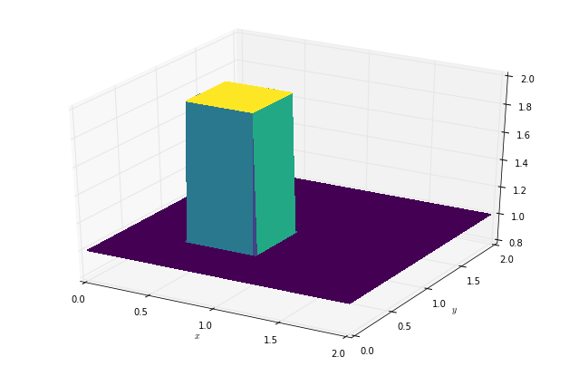
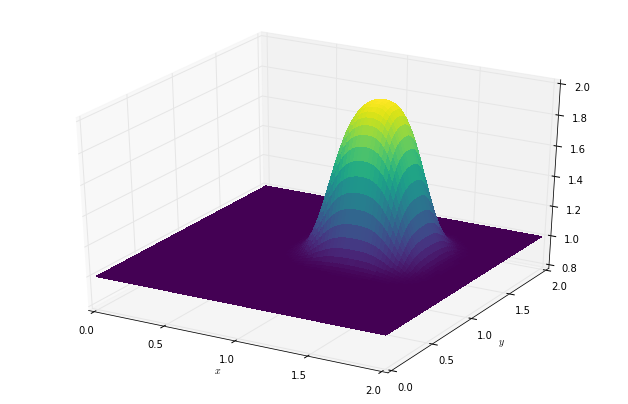

:author: Michael Lange
:email: michael.lange@imperial.ac.uk
:institution: Imperial College London
:corresponding:

:author: Navjot Kukreja
:email: n.kukreja@imperial.ac.uk
:institution: Imperial College London

:author: Fabio Luporini
:email: f.luporini12@imperial.ac.uk
:institution: Imperial College London

:author: Mathias Louboutin
:email: mloubout@eos.ubc.ca
:institution: The University of British Columbia

:author: Gerard J. Gorman
:email: g.gorman@imperial.ac.uk
:institution: Imperial College London

---------------------------------------------------------------
Optimised finite difference computation from symbolic equations
---------------------------------------------------------------

.. class:: abstract

Domain-specific high-productivity environments are playing an
increasingly important role in scientific computing due to the
increased levels of abstraction and automation they provide. In this
paper we introduce Devito, an open-source domain-specific framework for
solving partial differential equations from symbolic problem
definitions by the finite difference method. We highlight the
generation and automated execution of highly optimized stencil code
from only a few lines of high-level symbolic Python for a set of
operators used in seismic inversion problems, before exploring the use
of Devito for a range of scientific equations.

.. class:: keywords

    Finite difference, domain-specific languages, symbolic Python

Introduction
------------

Domain-specific high-productivity environments are playing an
increasingly important role in scientific computing. The increased
level of abstraction and automation provided by such frameworks not
only increases productivity and accelerates innovation, but allows the
combination of expertise from different specialised disciplines. This
synergy is necessary when creating the complex software stack needed
to solve leading edge scientific problems, since domain specialists as
well as high performance computing experts are required to fully
leverage modern computing architectures. Based on this philosophy we
introduce Devito, an open-source domain-specific framework for solving
partial differential equations from symbolic problem definitions by
the finite difference method.

Symbolic computation, where optimized numerical code is automatically
derived from a high-level problem definition, is a powerful technique
that allows domain scientists to focus on algorithmic development
rather than implementation details. For this reason Devito exposes an
API based on Python (SymPy) [Meuer17]_ that allow users to express
equations symbolically, from which it generates and executes optimized
stencil code via just-in-time (JIT) compilation. Using latest advances
in stencil compiler research, Devito thus provides domain scientists
with the ability to quickly and efficiently generate high-performance
kernels from only a few lines of Python code, making Devito composable
with existing open-source software.

While Devito was originally developed for seismic imaging workflows,
the automated generation and optimisation of stencil codes can be
utilised for a much broader set of computational problems. In this
paper we will give a brief overview of the design concepts and
Devito's key features before demonstrating the Devito API on a set of
classic examples from computational fluid dynamics (CFD). Based on
this, we will then highlight the use of Devito in an example of a
complex seismic inversion algorithms to demonstrate its use in
practical scientific applications and to showcase the performance
achieved by the auto-generated and optimised code.

Background
----------

Design and API
--------------

*The primary objective of the Devito DSL is to enable the quick and
effecitve creation of finite difference operators for use in a
realistic scientific modelling context. As such it is imperative for
Devito API to be composable with ...*

*So we create objects that behave symbolically like
functions, but carry real user data. One rationale for that duality
is that many stencil optimisation algorithms rely on data layout changes,
so that Devito needs to be in control of data handling as well as symbolics.*

*At the core we use SymPy for code-generation, although we provide
a small bit of high-level syntax on top. This allows us to automate
the finite difference discretisation through SymPy. Ultimately,
everything is based on an :code:`Operator`. This will accept SymPy
expression with symbolic replacement maps and compiler settings to
create kernels. The code-gen process happens in various stages, so
that we may use a "low-level" API to inject custom code.*

*<Placeholder: Layer diagram>*

Examples
--------

The follwoing CFD examples are based on Lorena Barba's CFD introduction blog:

http://lorenabarba.com/blog/cfd-python-12-steps-to-navier-stokes/

This will be followed by a quick demonstration of seismic inversion operators.

Linear Convection
~~~~~~~~~~~~~~~~~

We will demonstrate a basic Devito operator definition based on step
5, a linear two-dimensional convection flow. The governing equation we
are implementing here is:

.. math::
   :label: 2dconvection

   \frac{\partial u}{\partial t}+c\frac{\partial u}{\partial x}
           + c\frac{\partial u}{\partial y} = 0

A discretised version of this equation, using a forward difference
scheme in time and a backward difference scheme in space might be written
as

.. math::
   :label: 2dconvdiscr

   u_{i,j}^{n+1} = u_{i,j}^n-c \frac{\Delta t}{\Delta x}(u_{i,j}^n-u_{i-1,j}^n)-c \frac{\Delta t}{\Delta y}(u_{i,j}^n-u_{i,j-1}^n)

The first thing we need is a function object that we can take build
a timestepping scheme with. For this purpose Devito provides so-called
:code:`TimeData` objects that encapsulate functions that one may take space
and time derivatives of.

.. code-block:: python

    from devito import *

    c = 1.
    u = TimeData(name='u', shape=(nx, ny))

    u_dx = first_derivative(u, dim=x, side=left)
    u_dy = first_derivative(u, dim=y, side=left)

    eq = Eq(u.dt + c * u_dx + c * u_dy)

    [In] print eq
    [Out] Eq(-u(t, x, y)/s + u(t + s, x, y)/s
            + 2.0*u(t, x, y)/h - 1.0*u(t, x, y - h)/h
            - 1.0*u(t, x - h, y)/h, 0)

The above expression results in a :code:`sympy.Equation` object that
contains the fully discretised form of Eq. :ref:`2dconvection`,
including placeholder symbols for spacing in space (:code:`h`) and
time (:code:`s`). These spacign symbols will be resolved during the
code generation process, as described in **FORWARD-REF**. It is also
important to note here that the explicit generation of the space
derivatives :code:`u_dx` and :code:`u_dy` is due to the use of a
backward derivative in space to align with the original example. A
similar notation to the forward derivative in time (:code:`u.dt`) will
soon be provided.

In order to create a functional :code:`Operator` object, the
expression :code:`eq` needs to be re-arranged so that we may
solve for the unknown :math:`u_{i,j}^{n+1}`. This is easily achieved by using
SymPy's :code:`solve` utility.

.. code-block:: python

    from sympy import solve

    stencil = solve(eq, u.forward)[0]

    [In] print(stencil)
    [Out] (h*u(t, x, y) - 2.0*s*u(t, x, y)
         + s*u(t, x, y - h) + s*u(t, x - h, y))/h

The above variable :code:`stencil` now represents the RHS of
Eq. :ref:`2dconvdiscr`, allowing us to build a
:code:`devito.Operator` and apply it over an initial data set as
follows:

.. code-block:: python

    op = Operator(Eq(u.forward, stencil),
                  subs={h: dx, s:dt})

    # Set initial condition as a "hat function"
    u.data[:] = 1.
    u.data[int(.5 / dx):int(1 / dx + 1),
                int(.5 / dy):int(1 / dy + 1)] = 2.

    op(u=u, time=100)  # Apply for 100 timesteps

*<TODO: A few words about the substitutions>*
In the above example we initialise the data assigned to :code:`u` as

.. math::
   :type: eqnarray

   2\ \text{for}\ 0.5 \leq x, y \leq 1 \\
   1\ \text{everywhere else}

   Initial condition of :code:`u.data` in the 2D convection example.

   State of :code:`u.data` after 100 timesteps in convection example.

Laplace equation
~~~~~~~~~~~~~~~~

Burgers Equation
~~~~~~~~~~~~~~~~

Seismic Inversion
~~~~~~~~~~~~~~~~~

Automated code generation
-------------------------
The code generation process happens under the :code:`Operator` object
and relies on multiple compiler passes, as well as optimisation
stages.

Performance
~~~~~~~~~~~

YASK-Integration
~~~~~~~~~~~~~~~~

Discussion
----------

References
----------
.. [Meuer17] Meurer A, Smith CP, Paprocki M, Čertík O, Kirpichev SB,
             Rocklin M, Kumar A, Ivanov S, Moore JK, Singh S,
             Rathnayake T, Vig S, Granger BE, Muller RP, Bonazzi F,
             Gupta H, Vats S, Johansson F, Pedregosa F, Curry MJ,
             Terrel AR, Roučka Š, Saboo A, Fernando I, Kulal S,
             Cimrman R, Scopatz A. (2017) SymPy: symbolic computing in
             Python. PeerJ Computer Science 3:e103
             https://doi.org/10.7717/peerj-cs.103
