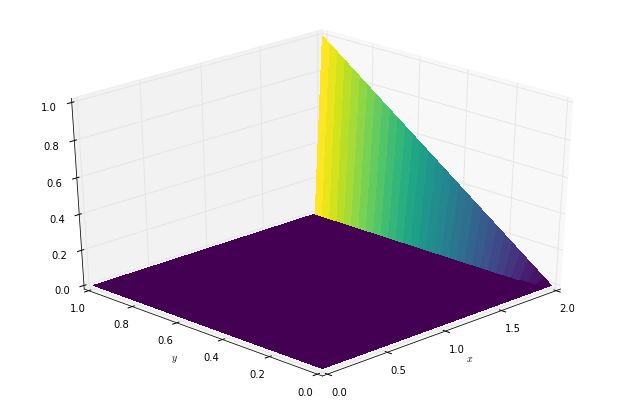
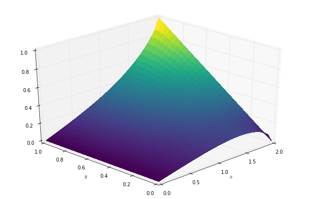

:author: Michael Lange
:email: michael.lange@imperial.ac.uk
:institution: Imperial College London
:corresponding:

:author: Navjot Kukreja
:email: n.kukreja@imperial.ac.uk
:institution: Imperial College London

:author: Fabio Luporini
:email: f.luporini12@imperial.ac.uk
:institution: Imperial College London

:author: Mathias Louboutin
:email: mloubout@eos.ubc.ca
:institution: The University of British Columbia

:author: Charles Yount
:email: chuck.yount@intel.com
:institution: Intel Corporation

:author: Gerard J. Gorman
:email: g.gorman@imperial.ac.uk
:institution: Imperial College London

---------------------------------------------------------------
Optimised finite difference computation from symbolic equations
---------------------------------------------------------------

.. class:: abstract

Domain-specific high-productivity environments are playing an
increasingly important role in scientific computing due to the
levels of abstraction and automation they provide. In this
paper we introduce Devito, an open-source domain-specific framework for
solving partial differential equations from symbolic problem
definitions by the finite difference method. We highlight the
generation and automated execution of highly optimized stencil code
from only a few lines of high-level symbolic Python for a set of
operators used in seismic inversion problems, before exploring the use
of Devito for a range of scientific equations.

.. class:: keywords

    Finite difference, domain-specific languages, symbolic Python

Introduction
------------

Domain-specific high-productivity environments are playing an
increasingly important role in scientific computing. The level
of abstraction and automation provided by such frameworks not only
increases productivity and accelerates innovation, but also allows the
combination of expertise from different specialised disciplines. This
synergy is necessary when creating the complex software stack needed
to solve leading edge scientific problems, since domain specialists as
well as high performance computing experts are required to fully
leverage modern computing architectures. Based on this philosophy we
introduce Devito, an open-source domain-specific framework for solving
partial differential equations (PDE) from symbolic problem definitions
by the finite difference method.

Symbolic computation, where optimized numerical code is automatically
derived from a high-level problem definition, is a powerful technique
that allows domain scientists to focus on algorithmic development
rather than implementation details. For this reason Devito exposes an
API based on Python (SymPy) [Meurer17]_ that allow users to express
equations symbolically, from which it generates and executes optimized
stencil code via just-in-time (JIT) compilation. Using latest advances
in stencil compiler research, Devito thus provides domain scientists
with the ability to quickly and efficiently generate high-performance
kernels from only a few lines of Python code, making Devito composable
with existing open-source software.

While Devito was originally developed for seismic imaging workflows,
the automated generation and optimisation of stencil codes can be
utilised for a much broader set of computational problems. In this
paper we will give a brief overview of the design concepts and
Devito's key features before demonstrating the Devito API on a set of
classic examples from computational fluid dynamics (CFD). Based on
this, we will then highlight the use of Devito in an example of a
complex seismic inversion algorithms to demonstrate its use in
practical scientific applications and to showcase the performance
achieved by the auto-generated and optimised code.

Background
----------

The attraction of using domain-specific languages to generically
solve PDEs via a high-level mathematical notation is by no means new
and has lead to various purpose-built software packages and compilers
dating back to 1962 [Iverson62]_, [Cardenas70]_ [Umetani85]_ [Cook88]_
[VanEngelen96]_. Following the emergence of Python as widely used
programming language in scientific research, embedded DSLs for more
specialised domains came to the fore, most notably the FEniCS
[Logg12]_ and Firedrake [Rathgeber16]_ frameworks that both implement
the unified Form Language (UFL) [Alnaes14]_ for the symbolic
definition of finite element problems in the weak form. The increased
level of abstraction that such high-level languages provide decouples
the problem definition from its implementation, thus allowing domain
scientists and mathematicians to focus on more advanced methods, such
as the automation of adjoint models as demonstrated by Dolfin-Adjoint
[Farrell13]_.

The performance optimisation of stencil computation on regular
cartesian grids for high-performance computing applications has also
received much attention in computer science research [Datta08]_
[Brandvik10]_ [Zhang12]_ [Henretty13]_ [Yount15]_. The primary focus
of most stencil compilers or DSLs, however, is on the optimisation of
synthetic problems which often limits their applicability for
practical scientific applications. The primary consideration here is
that most realistic problems often requires more than just a fast and
efficient PDE solver, which entails that symbolic DSLs embedded in
Python can benefit greatly from native interoperability with the
scientific Python ecosystem.

Design and API
--------------

The primary objective of Devito is to enable the quick and effective
creation of highly optimised finite difference operators for use in a
realistic scientific application context. As such, its design is
centred around composability with the existing Python software stack
to provide users with the tools to dynamically generate optimised
stencil computation kernels, but also to enable access to the full
scientific software stack in the Python ecosystem. In addition, to
accommodate the needs of "real life" scientific applications, a
secondary API is provided that enables users to inject custom
expressions, such as boundary conditions or sparse point
interpolation, into the generate kernels.

Moreover, the use of SymPy as the driver for the symbolic generation
of stencil expressions and the subsequent code-generation are at the
heart of the Devito philosophy. While SymPy is fully capable of
auto-generating low-level C code for pre-compiled execution from
high-level symbolic expressions, Devito is designed to combine theses
capabilities with the latest advances in stencil compiler technology.
The result is a framework that is capable of automatically generating
and optimising complex stencil code from high-level symbolic
definitions.

The Devito API is based around two key concepts that allow users to
express finite difference problems in a concise symbolic notation:

* **Symbolic data objects:** Devito's high-level symbolic objects
  behave like :code:`sympy.Function` objects and provide a set of
  shorthand notations for generating derivative expressions, while
  also managing user data. The rationale for this duality is that many
  stencil optimisation algorithms rely on data layout changes,
  mandating that Devito needs to be in control of data allocation and
  access.

* **Operator:** An :code:`Operator` creates, compiles and executes a
  single executable kernel from a set of SymPy expressions. The code
  generation and optimisation process involves various stages and
  accepts a mixture of high-level and low-level expressions to allow
  the injection of customised code.

Fluid Dynamics Examples
-----------------------

In the following section we are going to demonstrate the use of the
Devito API to implement two examples from classical fluid dynamics,
before highlighting the role of Devito operators in a seismic
inversion context.  Both CFD examples are based in part on tutorials
from the introductory blog "CFD Python: 12 steps to Navier-Stokes"[#]_
by the Lorena A. Barba group.

.. [#] http://lorenabarba.com/blog/cfd-python-12-steps-to-navier-stokes/

Linear Convection
~~~~~~~~~~~~~~~~~

We will demonstrate a basic Devito operator definition based on a
linear two-dimensional convection flow (step 5 in the original
tutorials). The governing equation we are implementing here is:

.. math::
   :label: 2dconvection

   \frac{\partial u}{\partial t}+c\frac{\partial u}{\partial x}
           + c\frac{\partial u}{\partial y} = 0

A discretised version of this equation, using a forward difference
scheme in time and a backward difference scheme in space might be written
as

.. math::
   :label: 2dconvdiscr

   u_{i,j}^{n+1} = u_{i,j}^n-c \frac{\Delta t}{\Delta x}(u_{i,j}^n-u_{i-1,j}^n)
   - c \frac{\Delta t}{\Delta y}(u_{i,j}^n-u_{i,j-1}^n)

where the subscripts :math:`i` and :math:`j` denote indices in the
space dimensions and the superscript :math:`n` denotes the index in
time, while :math:`\Delta t`, :math:`\Delta x`, :math:`\Delta y`
denote the spacing in time and space dimensions respectively.

The first thing we need is a function object with which we can build
a timestepping scheme. For this purpose Devito provides so-called
:code:`TimeData` objects that encapsulate functions that are
differentiable in space and time. With this we can either derive
symbolic expressions for the backward derivatives directly via the
:code:`first_derivative` utility, or use the shorthand notation
:code:`u.dt` provided by :code:`TimeData` objects toe derive the
forward derivative in time.

.. code-block:: python

    from devito import *

    c = 1.
    u = TimeData(name='u', shape=(nx, ny))

    u_dx = first_derivative(u, dim=x, side=left)
    u_dy = first_derivative(u, dim=y, side=left)

    eq = Eq(u.dt + c * u_dx + c * u_dy)

    [In] print eq
    [Out] Eq(-u(t, x, y)/s + u(t + s, x, y)/s
            + 2.0*u(t, x, y)/h - 1.0*u(t, x, y - h)/h
            - 1.0*u(t, x - h, y)/h, 0)

The above expression results in a :code:`sympy.Equation` object that
contains the fully discretised form of Eq. :ref:`2dconvection`,
including placeholder symbols for grid spacing in space (:code:`h`)
and time (:code:`s`). These spacing symbols will be resolved during
the code generation process, as described in the `code generation
section`_. It is also important to note here that the explicit
generation of the space derivatives :code:`u_dx` and :code:`u_dy` is
due to the use of a backward derivative in space to align with the
original example. A similar notation to the forward derivative in time
(:code:`u.dt`) will soon be provided.

In order to create a functional :code:`Operator` object, the
expression :code:`eq` needs to be re-arranged so that we may solve for
the unknown :math:`u_{i,j}^{n+1}`. This is easily achieved by using
SymPy's :code:`solve` utility and the Devito shorthand
:code:`u.forward` which denotes the furthest forward stencil point in
a time derivative (:math:`u_{i,j}^{n+1}`).

.. code-block:: python

   from sympy import solve

   stencil = solve(eq, u.forward)[0]

   [In] print(stencil)
   [Out] (h*u(t, x, y) - 2.0*s*u(t, x, y)
        + s*u(t, x, y - h) + s*u(t, x - h, y))/h

The above variable :code:`stencil` now represents the RHS of
Eq. :ref:`2dconvdiscr`, allowing us to construct a SymPy expression
that updates :math:`u_{i,j}^{n+1}` and build a :code:`devito.Operator`
from it. When creating this operator we also supply concrete values
for the spacing terms :code:`h` and :code:`s` via an additional
substitution map argument :code:`subs`.

.. code-block:: python

   op = Operator(Eq(u.forward, stencil),
                 subs={h: dx, s:dt})

   # Set initial condition as a "hat function"
   u.data[:] = 1.
   u.data[int(.5 / dx):int(1 / dx + 1),
          int(.5 / dy):int(1 / dy + 1)] = 2.

   op(u=u, time=100)  # Apply for 100 timesteps

Using this operator we can now re-create the example from the original
tutorial by initialising the data associated with the symbolic function
:math:`u`, :code:`u.data`,  with a "hat function" according to

.. math::
   :type: eqnarray

   2\ &\text{for}\ 0.5 \leq x, y \leq 1 \\
   1\ &\text{everywhere else}

.. figure:: 2dconv_init.png
   :scale: 42%
   :figclass: hbt

   Initial condition of :code:`u.data` in the 2D convection
   example. :label:`fig2dconv`

.. figure:: 2dconv_final.png
   :scale: 42%
   :figclass: hbt

   State of :code:`u.data` after 100 timesteps in convection
   example. :label:`fig2dconvfinal`

The initial condition and the final result after executing the operator
for 100 timesteps are depicted in Figures :ref:`fig2dconv` and
:ref:`fig2dconvfinal` respectively.

Laplace equation
~~~~~~~~~~~~~~~~

The above example showed how Devito can be used to create finite
difference stencil operators from only a few lines of high-level
symbolic code. For more complex examples, boundary conditions are
required though, which are not currently provided through the symbolic
high-level API. However, for exactly this reason, Devito provides a
low-level, or "indexed" API, where custom SymPy expressions can be
created with explicitly resolved grid accesses to manually inject
custom code into the auto-generation toolchain.

To demonstrate this, we will use the Laplace example from the original
CFD tutorials (step 9), which implements the steady-state heat equation
with Dirichlet and Neuman boundary conditions. The governing equation
for this problem is

.. math::
   :label: 2dlaplace

   \frac{\partial ^2 p}{\partial x^2} + \frac{\partial ^2 p}{\partial y^2} = 0

The rearranged discretised form is

.. math::
   :label: 2dlaplace_discr

   p_{i,j}^n = \frac{\Delta y^2(p_{i+1,j}^n+p_{i-1,j}^n)
           +\Delta x^2(p_{i,j+1}^n + p_{i,j-1}^n)}
           {2(\Delta x^2 + \Delta y^2)}

Using a similar approach to the previous example, we can construct
the SymPy expression to update the state of a field :math:`p`. For
demonstration purposes we will use two separate function objects
of type :code:`DenseData` in this example, since the Laplace equation
does not contain a time-dependence.

.. code-block:: python

   # Create two separate symbols with space dimensions
   p = DenseData(name='p', shape=(nx, ny),
                 space_order=2)
   pn = DenseData(name='pn', shape=(nx, ny),
                  space_order=2)

   # Define equation and solve for center point in `pn`
   eq = Eq(a * pn.laplace)
   stencil = solve(eq, pn)[0]
   # The update expression to populate buffer `p`
   eq_stencil = Eq(p, stencil)

Just as the original tutorial, our initial condition in this example
is :math:`p = 0` and the flow will be driven by the boundary
conditions

.. math::
   :type: eqnarray

   p=0\ &\text{at}\ x=0\\
   p=y\ &\text{at}\ x=2\\
   \frac{\partial p}{\partial y}=0\ &\text{at}\ y=0,\ 1

To implement these BCs we can utilise the :code:`.indexed` property
that Devito symbols provide to get a symbol of type
:code:`sympy.IndexedBase`, which in turn allows us to use matrix
indexing notation (square brackets) to create symbols of type
:code:`sympy.Indexed` instead of :code:`sympy.Function`. This notation
allows users to hand-code stencil expressions using explicit relative
grid indices, for example :code:`p[x, y] - p[x-1, y] / h` for the
discretized backward derivative :math:`\frac{\partial u}{\partial x}`.
The symbols :code:`x` and :code:`y` hereby represent the respective
problem dimensions and cause the expression to be executed over the
entire data dimension, similar to Python's :code:`:` operator.

The Dirichlet BCs in the Laplace example can thus be implemented by
creating a :code:`sympy.Eq` object that assign either fixed values or
a prescribed function, such as the utility symbol :code:`bc_top` in or
example, along the top and bottom boundary of our domain. To implement
the Neumann BCs we again follow the original tutorial by assigning the
second grid column from the side boundaries the value of the outermost
column. The resulting SymPy expressions can then be used alongside
the state update expression to create our :code:`Operator` object.

.. code-block:: python

   # Create an additional symbol for our prescibed BC
   bc_top = DenseData(name='bc_top', shape=(nx, ),
                      dimensions=(x, ))
   bc_top.data[:] = np.linspace(0, 1, nx)

   # Create explicit boundary condition expressions
   bc = [Eq(p.indexed[x, 0], 0.)]
   bc += [Eq(p.indexed[x, ny-1], bc_top.indexed[x])]
   bc += [Eq(p.indexed[0, y], p.indexed[1, y])]
   bc += [Eq(p.indexed[nx-1, y], p.indexed[nx-2, y])]

   # Build operator with update and BC expressions
   op = Operator(expressions=[eq_stencil] + bc,
                 subs={h: dx, a: 1.})

After building the operator, we can now use it in a time-independent
convergence loop, but we do need to make sure we switch between
buffers. The according initial condition and the resulting steady-state
solution are depicted in Figures :ref:`fig2dlaplace` and
:ref:`fig2dlaplacefinal` respectively.

.. code-block:: python

   l1norm = 1
   counter = 0
   while l1norm > 1.e-4:
       # Determine buffer order
       if counter % 2 == 0:
           _p, _pn = p, pn
       else:
           _p, _pn = pn, p

       # Apply operator
       op(p=_p, pn=_pn)

       # Compute L1 norm
       l1norm = (np.sum(np.abs(_p.data[:])
                 - np.abs(_pn.data[:]))
                 / np.sum(np.abs(_pn.data[:])))
       counter += 1

   Initial condition of :code:`pn.data` in the 2D Laplace
   example. :label:`fig2dlaplace`

   State of :code:`p.data` after convergence in Laplace
   example. :label:`fig2dlaplacefinal`

Seismic Inversion Example
-------------------------

The primary motivating application behind the design of Devito are
seismic exploration problems that require highly optimised wave
propagation operators for forward modelling and adjoint-based
inversion. Obviously, the speed and accuracy of the generated kernels
is of vital importance. Moreover, the ability to efficiently define rigorous
forward modelling and adjoint operators from high-level symbolic
definitions also implies that domain scientists are able to quickly
adjust the numerical method and discretisation to the individual problem
and hardware architecture [Louboutin17a]_. In the following example we will
demonstrate the generation of forward and adjoint operators for the
acoustic wave equation to implement the so-called adjoint test. The
governing equation is defined as

.. math::
    m \frac{\partial^2 u}{\partial t^2}
    + \eta \frac{\partial u}{\partial t} - \nabla^2 u = q

where :math:`u` denotes the pressure wave field, :math:`m` is the
square slowness, :math:`q` is the source term and :math:`\eta` denotes
the spatially varying dampening factor used to implement an absorbing
boundary condition.

On top of fast stencil operators, seismic inversion kernels also rely
on sparse point interpolation to inject the modelled wave as a point
source (:math:`q`) and to record the pressure at individual point
locations. To accommodate this, Devito provides another symbolic data
type :code:`PointData`, which allows the generation of sparse-point
interpolation expressions using the "indexed" low-level API. These
symbolic objects provide utility routines
:code:`pt.interpolate(expression)` and :code:`pt.inject(field,
expression)` to create symbolic expressions that perform linear
interpolation between the sparse points and the cartesian grid for
insertion into :code:`Operator` kernels. A separate set of explicit
coordinate values are associated with the sparse point objects for
this purpose in addition to the function values stored in the
:code:`data` property.

Adjoint Test
~~~~~~~~~~~~

The first step for implementing the adjoint test is to build a forward
operator that models the wave propagating through an isotropic
medium, where the square slowness of the wave is denoted as :math:`m`.
Since :code:`m`, as well as the boundary dampening function
:code:`eta`, are re-used between forward and adjoint runs the only
symbolic data object we need to create here is the wavefield :code:`u`
in order to implement and re-arrange our discretised equation
:code:`eqn` to form the update expression for :code:`u`.
      
In addition to the state update of :code:`u`, we are also inserting
two additional terms into the forward modelling operator:

* :code:`src_term` injects a pressure source at a point location
  according to a prescribed time series stored in :code:`src.data`
  that is accessible in symbolic form via the symbol :code:`src`.
  The scaling factor in :code:`src_term` is coded by hand but can 
  be automatically inferred.

* :code:`rec_term` adds the expression to interpolate the wavefield
  :code:`u` for a set of "receiver" hydrophones that measure the
  propagated wave at varying distances from the source for every time
  step. The resulting interpolated point data will be stored in
  :code:`rec.data` and is accessible to the user as a NumPy array.

.. code-block:: python

   def forward(model, m, eta, src, rec, order=2):
       # Create the wavefeld function
       u = TimeData(name='u', shape=model.shape,
                    time_order=2, space_order=order)

       # Derive stencil from symbolic equation
       eqn = m * u.dt2 - u.laplace + eta * u.dt
       stencil = solve(eqn, u.forward)[0]
       update_u = [Eq(u.forward, stencil)]

       # Add source injection and receiver interpolation
       src_term = src.inject(field=u,
                             expr=src * dt**2 / m)
       rec_term = rec.interpolate(expr=u)

       # Create operator with source and receiver terms
       return Operator(update_u + src_term + rec_term,
                       subs={s: dt, h: model.spacing})

After building a forward operator, we can now implement the adjoint
operator in a similar fashion. Using the provided symbols :code:`m`
and :code:`eta`, we can again define the adjoint wavefield :code:`v`
and implement its update expression from the discretised
equation. However, since the adjoint operator needs to operate
backwards in time there are two notable differences:

* The update expression now updates the backward stencil point in the
  time derivative :math:`v_{i,j}^{n-1}`, denoted as
  :code:`v.backward`.  In addition to that, the :code:`Operator` is
  forced to reverse its internal time loop by providing the argument
  :code:`time_axis=Backward`
* Since the acoustic wave equation is self-adjoint without dampening, 
  the only change required in the governing equation is to invert the
  sign of the dampening term :code:`eta * u.dt`. The first derivative
  is an antisymmetric operator and its adjoint minus itself.

Moreover, the role of the sparse point objects has now switched:
Instead of injecting the source term, we are now injecting the
previously recorded receiver values into the adjoint wavefield, while
we are interpolating the resulting wave at the original source
location. As the injection and interpolations are part of the kernel, 
we also insure that these two are adjoints of each other.

.. code-block:: python

   def adjoint(model, m, eta, srca, rec, order=2):
       # Create the adjoint wavefeld function
       v = TimeData(name='v', shape=model.shape,
                    time_order=2, space_order=order)

       # Derive stencil from symbolic equation
       # Note the inversion of the dampening term
       eqn = m * v.dt2 - v.laplace - eta * v.dt
       stencil = solve(eqn, u.forward)[0]
       update_v = [Eq(v.backward, stencil)]

       # Inject the previous receiver readings
       rec_term = rec.inject(field=v,
                             expr=rec * dt**2 / m)

       # Interpolate the adjoint-source
       srca_term = srca.interpolate(expr=v)

       # Create operator with source and receiver terms
       return Operator(update_v + rec_term + srca_term,
                       subs={s: dt, h: model.spacing},
                       time_axis=Backward)

Having established how to build the required operators we can now
define the workflow for our adjoint example.  For illustration
purposes we are using a utility object :code:`Model` that provides the
core information for seismic inversion runs, such as the values for
:code:`m` and the dampening term :code:`eta`, as well as the
coordinates of the point source and receiver hydrophones. It is worth
noting that the spatial discretisation and thus the stencil size of
the oeprators is still fully parameterisable.

.. code-block:: python

   # Create the seismic model of the domain
   model = Model(...)

   # Create source with Ricker wavelet
   src = PointData(name='src', ntime=ntime,
                   ndim=2, npoint=1)
   src.data[0, :] = ricker_wavelet(ntime)
   src.coordinates.data[:] = source_coords

   # Create empty set of receivers
   rec = PointData(name='rec', ntime=ntime,
                   ndim=2, npoint=101)
   rec.coordinates.data[:] = receiver_coords

   # Create empty adjoint source symbol
   srca = PointData(name='srca', ntime=ntime,
                    ndim=2, npoint=1)
   srca.coordinates.data[:] = source_coords

   # Create symbol for square slowness
   m = DenseData(name='m', shape=model.shape,
                 space_order=order)
   m.data[:] = model  # Set m from model data

   # Create dampening term from model
   eta = DenseData(name='eta', shape=shape,
                   space_order=order)
   eta.data[:] = model.dampening

   # Execute foward and adjoint runs
   fwd = forward(model, m, eta, src, rec)
   fwd(time=ntime)
   adj = adjoint(model, m, eta, srca, rec)
   adj(time=ntime)

   # Test prescribed against adjoint source
   adjoint_test(src.data, srca.data)

.. figure:: shot_record.png
   :scale: 50%

   Shot record of the measured point values in :code:`rec.data` after
   the forward run. :label:`figshotrecord`

The adjoint test is the core definition of the adjoint of a linear
operator. The mathematical correctness of the adjoint is required for
mathematical adjoint-based optimisations methods that are only
guarantied to converged with the correct adjoint. The test can be
written as:

.. math:: <src,\ adjoint(rec)> = <forward(src),\ rec>

The adjoint test can be used to verify the accuracy of the forward
propagation and adjoint operators and has been shown to agree for 2D
and 3D implementations [Louboutin17b]_. The shot record of the data
measured at the receiver locations after the forward run is shown in
:ref:`figshotrecord`.

.. _`code generation section`:

Automated code generation
-------------------------

The role of the :code:`Operator` in the previous examples is to
generate semantically equivalent C code to the provided SymPy
expressions, complete with loop constructs and annotations for
performance optimisation, such as OpenMP pragmas. Unlike many other
DSL-based frameworks, Devito employs actual compiler technology during
the code generation and optimisation process. The symbolic
specification is progressively lowered to C code through a series of
passes manipulating abstract syntax trees (AST), rather than working
with rigid templates. This software engineering choice has an
invaluable impact on maintainability, extensibility and composability.

The code generation process consists of a sequence of compiler passes,
which progressively lower the symbolic representation to C. Following
the initial resolution of explicit grid indices into the low-level
format, Devito is able to apply several types of automated performance
optimisation throughout the code generation pipeline, which are grouped
into two distinct sub-modules:

* **DSE - Devito Symbolic Engine:** The first set of optimisation
  passes consists of manipulating SymPy equations with the aim to
  decrease the number of floating-point operations performed when
  evaluating a single grid point. This initial optimisation is
  performed following an initial analysis of the provided expressions
  and consists of sub-passes such as common sub-expressions
  elimination, detection and promotion of time-invariants, and
  factorization of common finite-difference weights. These
  transformations not only optimize the operation count, but they also
  improve the symbolic processing and low-level compilation times of
  later processing stages.

* **DLE - Devito Loop Engine:** After the initial symbolic processing
  Devito schedules the optimised expressions in a set of loops by
  creating an Abstract Syntax Tree (AST). The loop engine (DLE) is now
  able to perform typical loop-level optimisations in mutiple passes
  by manipulating this AST, including data alignment through array
  annotations and padding, SIMD vectorization through OpenMP pragmas
  and thread parallelism through OpenMP pragmas. On top of that, loop
  blocking is used to fully exploit the memory bandwidth of a target
  architecture by increasing data locality and thus cache
  utilization. Since the effectiveness of the blocking technique is
  highly architecture-dependent, Devito can determine optimal block
  size through runtime auto-tuning.

Performance Benchmark
~~~~~~~~~~~~~~~~~~~~~

<*Hardware spec for (Endeavour?) Broadwell nodes.>*

.. figure:: acoustic_dle.pdf
   :scale: 60%

   *<Performance optimisation results for DLE with limited DSE.>*

<*Results for DLE and auto-tuned thread-parallel runs.>*

.. figure:: acoustic_maxperf.pdf
   :scale: 60%

   Performance benchmarks with

*<Full-throttle performance benchmarks. It is worth noting that peak
performance may drop with DSE, but that is expected as less "empty
flops" are performed.>*

Integration with YASK
~~~~~~~~~~~~~~~~~~~~~

As already explained, Devito is based upon actual compiler technology, and its
backend presents a highly modular structure, with each transformation pass
taking as input an AST and returning a new, different AST. One of the reasons
behind this software engineering strategy, which is clearly more challenging than a
template-based solution, is to ease the integration of external tools. One such
tool is the YASK stencil optimizer [Yount16]_. We are currently integrating
YASK within the DLE; YASK will replace some (but not all) of the existing DLE
passes.

The DLE passes are organized in a hierarchy of classes. Each class represents a
specific code transformation pipeline; each stage of the pipeline manipulates
ASTs. Integrating YASK becomes then a conceptually simple task, which boils
down to three actions: (i) adding a new transformation pipeline to the DLE;
(ii) adding a new array type, to ease storage layout transformations and data
views (YASK employs a data layout different than the conventional row-major
format); (iii) creating the proper Python bindings in YASK so that Devito can
drive the code generation process. At the moment of writing, some progress has
already been made: 1) Devito ASTs can now automatically be translated into YASK
ASTs through an extremely simple tree visitor; 2) a Devito-generated acoustic
wave equation code could be run from within YASK (i.e., with the input data
still coming from YASK users).

It has been shown that real-world stencil codes optimised through YASK may
achieve an exceptionally high fraction of the attainable machine peak [YASK].
Further, initial prototyping (manual optimization of Devito-generated code
through YASK) revealed that YASK may also outperform the loop optimization
engine currently available in Devito, besides ensuring seamless performance
portability across a range of computer architectures. On the other hand, YASK
is a C++ based framework that, unlike Devito, does not rely on symbolic
mathematics and processing; in other words, it operates at a much lower level
of abstraction. These observations, as well as the outcome of the initial
prototyping phase, motivate the on-going Devito-YASK integration effort.

Discussion
----------

References
----------

.. [Alnaes14] M. S. Alnæs, A. Logg, K. B. Ølgaard, M. E. Rognes,
              and G. N.  Wells, “Unified Form Language: a
              domain-specific language for weak formulations of
              partial differential equations,” ACM Transactions on
              Mathematical Software (TOMS), vol. 40,
              no. 2, p. 9, 2014.

.. [Brandvik10] T. Brandvik and G. Pullan, “Sblock: A framework for efficient
                stencil-based pde solvers on multi-core platforms,” in Proceedings
                of the 2010 10th IEEE International Conference on Computer and
                Information Technology, ser. CIT ’10. Washington, DC, USA:
                IEEE Computer Society, 2010, pp. 1181–1188. [Online]. Available:
                http://dx.doi.org/10.1109/CIT.2010.214

.. [Cardenas70] Cárdenas, A. F. and Karplus, W. J.: PDEL -- a language
                for partial differential equations, Communications of
                the ACM, 13, 184–191, 1970.

.. [Cook88] Cook Jr, G. O.: ALPAL: A tool for the development of
            large-scale simulation codes, Tech. rep., Lawrence
            Livermore National Lab., CA (USA), 1988.

.. [Datta08] K. Datta, M. Murphy, V. Volkov, S. Williams, J. Carter, L. Oliker,
             D. Patterson, J. Shalf, and K. Yelick, “Stencil computation optimization
             and auto-tuning on state-of-the-art multicore architectures,” in
             Proceedings of the 2008 ACM/IEEE Conference on Supercomputing,
             SC ’08. Piscataway, NJ, USA: IEEE Press, 2008, pp. 4:1–4:12.
             [Online]. Available: http://dl.acm.org/citation.cfm?id=1413370.1413375

.. [Farrell13] Farrell, P. E., Ham, D. A., Funke, S. W., and
               Rognes, M. E.: Automated Derivation of the Adjoint of
               High-Level Transient Finite Element Programs, SIAM
               Journal on Scientific Computing, 35, C369–C393,
               doi:10.1137/120873558,
               http://dx.doi.org/10.1137/120873558, 2013.

.. [Henretty13] T. Henretty, R. Veras, F. Franchetti, L.-N. Pouchet, J. Ramanujam, and
                P. Sadayappan, “A stencil compiler for short-vector simd
                architectures,” in Proceedings of the 27th
                International ACM Conference on International
                Conference on Supercomputing, ser. ICS ’13. New York,
                NY, USA: ACM, 2013, pp. 13–24. [Online]. Available:
                http://doi.acm.org/10.1145/2464996.2467268

.. [Iverson62] Iverson, K.: A Programming Language, Wiley, 1962.

.. [Logg12] Logg, A., Mardal, K.-A., Wells, G. N., et al.: Automated
            Solution of Differential Equations by the Finite Element
            Method, Springer, doi:10.1007/978-3-642-23099-8, 2012.

.. [Louboutin17a] Louboutin, M., Lange, M., Herrmann, F. J., Kukreja,
                  N., and Gorman, G.: Performance prediction of
                  finite-difference solvers for different computer
                  architectures, Computers Geosciences, 105, 148--157,
                  https://doi.org/10.1016/j.cageo.2017.04.014, 2017.

.. [Louboutin17b] M. Louboutin, M. Lange, F. Luporini, N. Kukreja, F. Herrmann,
                  P. Velesko, and G. Gorman: Code generation from
                  symbolic finite-difference for geophysical
                  exploration. In preparation for Geoscientific Model
                  Development (GMD), 2017.

.. [Meurer17] Meurer A, Smith CP, Paprocki M, Čertík O, Kirpichev SB,
             Rocklin M, Kumar A, Ivanov S, Moore JK, Singh S,
             Rathnayake T, Vig S, Granger BE, Muller RP, Bonazzi F,
             Gupta H, Vats S, Johansson F, Pedregosa F, Curry MJ,
             Terrel AR, Roučka Š, Saboo A, Fernando I, Kulal S,
             Cimrman R, Scopatz A. (2017) SymPy: symbolic computing in
             Python. PeerJ Computer Science 3:e103
             https://doi.org/10.7717/peerj-cs.103

.. [Rathgeber16] Rathgeber, F., Ham, D. A., Mitchell, L., Lange, M.,
                 Luporini, F., McRae, A. T. T., Bercea, G.,
                 Markall, G. R., and Kelly, P. H. J.: Firedrake:
                 automating the finite element method by composing
                 abstractions. ACM Trans. Math. Softw.,
                 43(3):24:1–24:27, 2016. URL:
                 http://arxiv.org/abs/1501.01809, arXiv:1501.01809,
                 doi:10.1145/2998441.

.. [Umetani85] Umetani, Y.: DEQSOL A numerical Simulation Language for
               Vector/Parallel Processors, Proc. IFIP TC2/WG22, 1985, 5,
               147–164, 1985.

.. [VanEngelen96] R. Van Engelen, L. Wolters, and G. Cats, “Ctadel: A
                  generator of multi-platform high performance codes
                  for pde-based scientific applications,” in
                  Proceedings of the 10th international conference on
                  Supercomputing. ACM, 1996, pp. 86–93.

.. [Yount15] C. Yount, "Vector Folding: Improving Stencil Performance
             via Multi-dimensional SIMD-vector Representation," 2015
             IEEE 17th International Conference on High Performance
             Computing and Communications, 2015 IEEE 7th International
             Symposium on Cyberspace Safety and Security, and 2015
             IEEE 12th International Conference on Embedded Software
             and Systems, New York, NY, 2015, pp. 865-870.
             https://doi.org/10.1109/HPCC-CSS-ICESS.2015.27

.. [Yount16] C. Yount, J. Tobin, A. Breuer and A. Duran, "YASK—Yet
             Another Stencil Kernel: A Framework for HPC Stencil
             Code-Generation and Tuning," 2016 Sixth International
             Workshop on Domain-Specific Languages and High-Level
             Frameworks for High Performance Computing (WOLFHPC), Salt
             Lake City, UT, 2016, pp. 30-39.
             https://doi.org/10.1109/WOLFHPC.2016.08

.. [Zhang12] Y. Zhang and F. Mueller, “Auto-generation and auto-tuning of 3d
             stencil codes on gpu clusters,” in Proceedings of the Tenth International
             Symposium on Code Generation and Optimization, ser. CGO ’12.
             New York, NY, USA: ACM, 2012, pp. 155–164. [Online]. Available:
             http://doi.acm.org/10.1145/2259016.2259037
