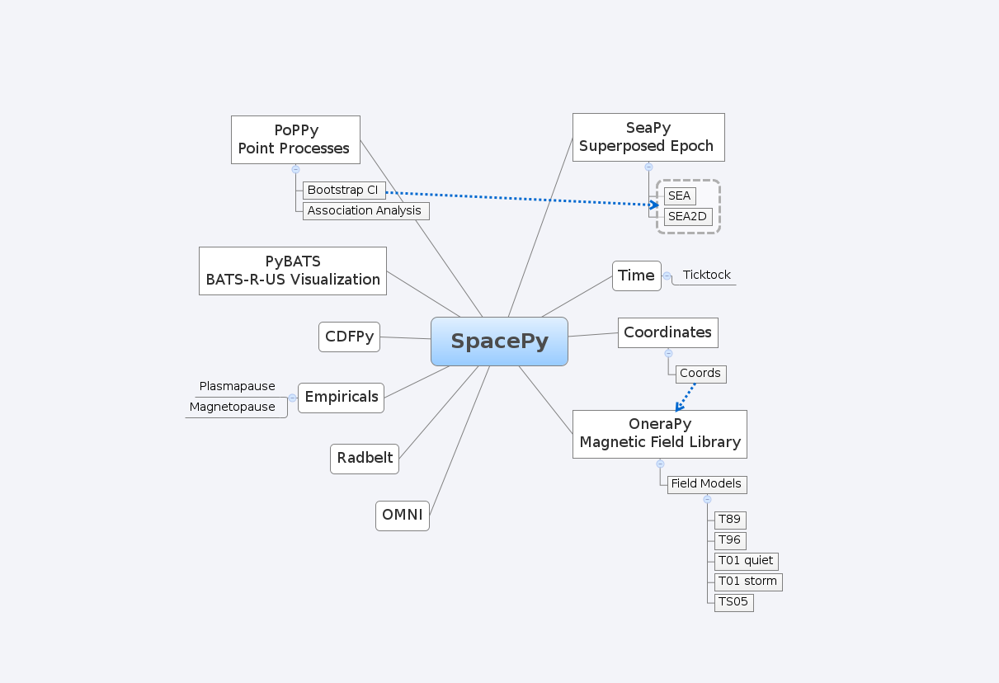
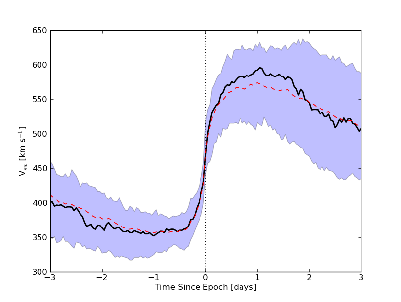
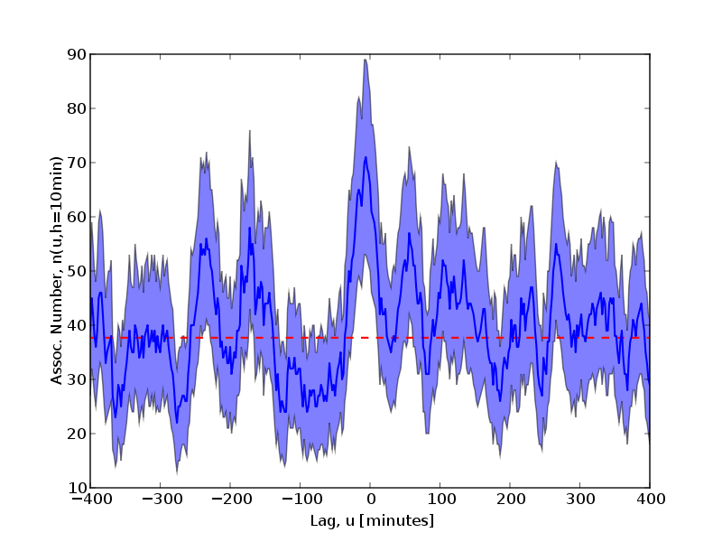
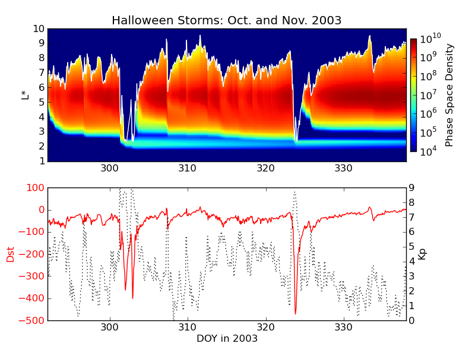
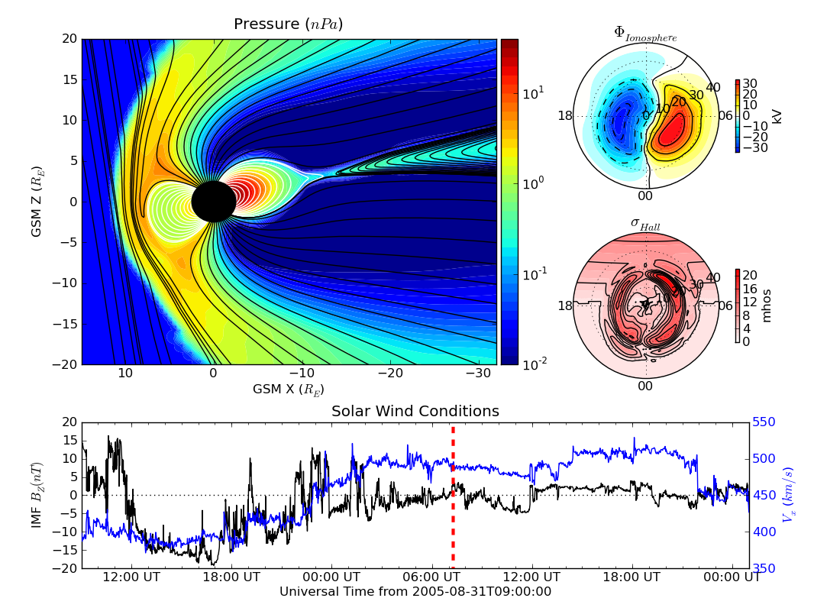

.. role:: raw-math(raw)
    :format: latex html

:author: Steven K. Morley
:email: smorley@lanl.gov
:institution: Los Alamos National Laboratory

:author: Daniel T. Welling
:email: dwelling@lanl.gov
:institution: Los Alamos National Laboratory

:author: Josef Koller
:email: jkoller@lanl.gov
:institution: Los Alamos National Laboratory

:author: Brian A. Larsen
:email: balarsen@lanl.gov
:institution: Los Alamos National Laboratory

:author: Michael G. Henderson
:email: mghenderson@lanl.gov
:institution: Los Alamos National Laboratory

:author: Jonathan Niehof
:email: jniehof@lanl.gov
:institution: Los Alamos National Laboratory

----------------------------------------------------------------
SpacePy - A Python-based library of tools for the space sciences
----------------------------------------------------------------

.. class:: abstract

Space science deals with the bodies within the solar system and the
interplanetary medium; the primary focus is on atmospheres and above - at
Earth the short timescale variation in the the geomagnetic field, the Van
Allen radiation belts and the deposition of energy into the upper
atmosphere are key areas of investigation. SpacePy is a package for
Python, targeted at the space sciences, that aims to make basic data
analysis, modeling and visualization easier. It builds on the capabilities
of the well-known NumPy and matplotlib packages. Publication quality
output direct from analyses is emphasized. The SpacePy project seeks to
promote accurate and open research standards by providing an open
environment for code development. In the space physics community there has
long been a significant reliance on proprietary languages that restrict
free transfer of data and reproducibility of results. By providing a
comprehensive library of widely-used analysis and
visualization tools in a free, modern and intuitive language, we hope that
this reliance will be diminished for non-commercial users.
SpacePy includes implementations of widely used empirical models,
statistical techniques used frequently in space science (e.g. superposed
epoch analysis), and interfaces to advanced tools such as electron drift
shell calculations for radiation belt studies. SpacePy also provides
analysis and visualization tools for components of the Space Weather
Modeling Framework including streamline tracing in vector fields. 
Further development is currently underway. External libraries, which 
include well-known magnetic field models, high-precision time 
conversions and coordinate transformations are accessed 
from Python using ctypes and f2py. The rest of the tools have been 
implemented directly in Python.
The provision of open-source tools to perform common tasks will provide
openness in the analysis methods employed in scientific studies and will
give access to advanced tools to all space scientists, currently 
distribution is limited to non-commercial use.

Introduction
------------

For the purposes of this article we define space science as the study of the
plasma environment of the solar system. That is, the Earth and other planets 
are all immersed in the Sun's tenuous outer atmosphere (the heliosphere), and
all are affected in some way by natural variations in the Sun. This is of 
particular importance at Earth where the magnetized plasma flowing out from the
Sun interacts with Earth's magnetic field and can affect technological systems
and climate. The primary focus here is on planetary 
atmospheres and above - at Earth the short timescale variation in the the 
geomagnetic field, the Van Allen radiation belts [Mor10]_ and the 
deposition of energy into the upper atmosphere [Mly10]_ are key areas of 
investigation.

SpacePy was conceived to provide a convenient library for common tasks in the
space sciences. A number of routine analyses used in space science are much 
less common in other fields (e.g. superposed epoch analysis) and modules to 
perform these analyses are provided.
This article describes the initial release of SpacePy (0.1.0), available from 
Los Alamos National Laboratory. at http://spacepy.lanl.gov. Currently SpacePy is
available on a non-commercial research license, but open-sourcing of the software
is in process.

SpacePy organization
--------------------

As packages such as NumPy, SciPy and matplotlib have become de facto standards
in Python, we have adopted these as the prerequisites for SpacePy.

The SpacePy package provides a number of modules, for a variety of tasks, which 
will be briefly described in this article. HTML help
for SpacePy is generated using epydoc and is bundled with the package. This can be 
most easily accessed on import of SpacePy (or any of its modules) by running the 
help() function in the appropriate namespace. A schematic of the organization of SpacePy 
is shown in figure 1. In this article we will describe the core modules of SpacePy 
and provide some short examples of usage and output.

The most general of the bundled modules is *Toolbox*. At the time of writing this
contains (among others): a convenience function for graphically displaying the contents
of dictionaries recursively; windowing mean calculations; optimal bin width 
estimation for histograms via the Freedman-Diaconis method; an update function 
to fetch the latest OMNI (solar wind/geophysical index) database and 
leap-second list; comparison of two time series for overlap or common elements.

   
   A schematic of the organization and contents of the SpacePy package
   at the time of writing.

The other modules have more specific aims and are primarily based on new classes.
*Time* provides a container class for times in a range of time systems, conversion 
between those systems and extends the functionality of datetime for space science use. 
*Coordinates* provides a class, and associated functions, for the handling of 
coordinates and transformations between common coordinate systems. *IrbemPy* is a 
module that wraps the IRBEM magnetic field library. *Radbelt* implements a 1-D 
radial diffusion code along with diffusion coefficient calculations 
and plotting routines. *SeaPy* provides generic one- and two-dimensional superposed 
epoch analysis classes and some plotting and statistical testing for superposed 
epoch analysis. *PoPPy* is a module for analysis of point processes, in particular 
it provides association analysis tools. *Empiricals* provides implementations of some
common empirical models such as plasmapause and magnetopause locations. *PyBATS* 
is an extensive sub-package providing tools for the convenient reading, writing 
and display of output from the Space Weather Modeling Framework (a collection 
of coupled models of the Sun-Earth system). *PyCDF* is a fully object-oriented 
interface to the NASA Common Data Format library.

Time conversions
----------------

SpacePy provides a time module that enables convenient manipulation of times 
and conversion between time systems commonly used in space sciences:
    
    1. NASA Common Data Format (CDF) epoch
    #. International Atomic Time (TAI)
    #. Coordinated Universal Time (UTC)
    #. Gregorian ordinal time (RDT)
    #. Global Positioning System (GPS) time
    #. Julian day (JD)
    #. modified Julian day (MJD)
    #. day of year (DOY)
    #. elapsed days of year (eDOY)
    #. UNIX time (UNX)
    
This is implemented as a container class built on the
functionality of the core Python datetime module.
To illustrate its use, we present code which instantiates a ``Ticktock`` object,
and fetches the time in different systems:
    
>>> import spacepy.time as spt
SpacePy: Space Science Tools for Python
SpacePy is released under license. 
See __licence__ for details, 
and help() for HTML help.
>>> ts = spt.Ticktock([`2009-01-12T14:30:00',
...                    `2009-01-13T14:30:00'],
...                    `ISO')
>>> ts
Ticktock([`2009-01-12T14:30:00',
          `2009-01-13T14:30:00']),
          dtype=ISO
>>> ts.UTC
[datetime.datetime(2009, 1, 12, 14, 30),
 datetime.datetime(2009, 1, 13, 14, 30)]
>>> ts.TAI
array([  1.61046183e+09,   1.61054823e+09])
>>> ts.isoformat(`microseconds')
>>> ts.ISO
[`2009-01-12T14:30:00.000000',
 `2009-01-13T14:30:00.000000']

Coordinate handling
-------------------

Coordinate handling and conversion is performed by the *coordinates* module.
This module provides the *Coords* class for coordinate data management. 
Transformations between cartesian and spherical coordinates are implemented 
directly in Python, but the coordinate conversions are currently handled as 
calls to the IRBEM library.

In the following example two locations are specified in a geographic cartesian
coordinate system and converted to spherical coordinates in the geocentric solar
magnetospheric (GSM) coordinate system. The coordinates are stored as object 
attributes. For coordinate conversions times must be supplied as many of the 
coordinate systems are defined with respect to, e.g., the position of the Sun, 
or the plane of the Earth's dipole axis, which are time-dependent.

>>> import spacepy.coordinates as spc
>>> import spacepy.time as spt
>>> cvals = spc.Coords([[1,2,4],[1,2,2]],
...                    `GEO', `car')
>>> cvals.ticktock = spt.Ticktock(
...     [`2002-02-02T12:00:00',
...      `2002-02-02T12:00:00'],
...     `ISO')
>>> newcoord = cvals.convert(`GSM', `sph')

A new, higher-precision C library to perform time conversions, coordinate 
conversions, satellite ephemeris calculations, magnetic field modeling and
drift shell calculations - the LANLGeoMag (LGM) library - is currently being 
wrapped for Python and will eventually replace the IRBEM library as the 
default in SpacePy.

The IRBEM library
-----------------

ONERA (Office National d'Etudes et Recherches Aerospatiales) provide a 
FORTRAN library, the IRBEM library [Bos07]_, that provides routines to 
compute magnetic coordinates for any location in the Earth's magnetic 
field, to perform coordinate conversions, to compute magnetic field vectors 
in geospace for a number of external field models, and to propagate 
satellite orbits in time.

A number of key routines in the IRBEM library have been wrapped uing f2py,
and a \`thin layer' module *IrbemPy* has been written for easy access to 
these routines. Current functionality includes calls to calculate the local
magnetic field vectors at any point in geospace, calculation of the magnetic
mirror point for a particle of a given pitch angle (the angle between a 
particle's velocity vector and the magnetic field line that it immediately 
orbits such that a pitch angle of 90 degrees signifies gyration perpendicular 
to the local field) anywhere in geospace, and calculation of electron drift 
shells in the inner magnetosphere.

As mentioned in the description of the *Coordinates* module, access is also 
provided to the coordinate transformation capabilities of the IRBEM library.
These can be called directly, but *IrbemPy* is easier to work with using ``Coords``
objects. This is by design as we aim to incorporate the LGM library and
replace the calls to IRBEM with calls to LGM without any change to the
*Coordinates* syntax.

OMNI
----

The OMNI database [Kin05]_ is an hourly resolution, multi-source data set
with coverage from November 1963; higher temporal resolution versions of 
the OMNI database exist, but with coverage from 1995. The primary data are
near-Earth solar wind, magnetic field and plasma parameters. However, a 
number of modern magnetic field models require derived input parameters,
and [Qin07]_ have used the publicly-available OMNI database to provide
a modified version of this database containing all parameters necessary 
for these magnetic field models. These data are currently updated and 
maintained by Dr. Bob Weigel and are available through ViRBO (Virtual 
Radiation Belt Observatory) [#]_.

.. [#] http://virbo.org/QinDenton

In SpacePy this data is made available on request on install; if not downloaded
when SpacePy is installed and attempt to import the *omni* module will 
ask the user whether they wish to download the data. Should the user 
require the latest data, the ``update`` function within ``spacepy.toolbox`` can 
be used to fetch the latest files from ViRBO.

As an example, we fetch the OMNI data for the powerful \``Hallowe'en'' storms of 
October and November, 2003.  These geomagnetic storms were driven by two 
solar coronal mass ejections that reached the Earth on October 29th and 
November 20th.

>>> import spacepy.time as spt
>>> import spacepy.omni as om
>>> import datetime as dt
>>> st = dt.datetime(2003,10,20)
>>> en = dt.datetime(2003,12,5)
>>> delta = dt.timedelta(days=1)
>>> ticks = spt.tickrange(st, en, delta, `UTC')
>>> data = om.get_omni(ticks)

*data* is a dictionary containing all the OMNI data, by variable, for the timestamps
contained within the ``Ticktock`` object *ticks*

Superposed Epoch Analysis
-------------------------

Superposed epoch analysis is a technique used to reveal consistent responses,
relative to some repeatable phenomenon, in noisy data [Chr08]_. Time series of the variables
under investigation are extracted from a window around the epoch and all data 
at a given time relative to epoch forms the sample of events at that lag. The 
data at each time lag are then averaged so that fluctuations not 
consistent about the epoch cancel. In many superposed epoch analyses the mean of 
the data at each time *u* relative to epoch, is used to 
represent the central tendency. In SeaPy we calculate both the mean and the median, since the median is a more robust 
measure of central tendency and is less affected by departures from normality.
SeaPy also calculates a measure of spread at each time relative to epoch when 
performing the superposed epoch analysis; the interquartile range is the default, but the
median absolute deviation and bootstrapped confidence intervals of the median (or mean)
are also available. The output of the example below is shown in figure 2.

>>> import spacepy.seapy as se
>>> import spacepy.omni as om
>>> import spacepy.toolbox as tb
>>> epochs = se.readepochs(`SI_GPS_epochs_OMNI.txt')
>>> st, en = datetime.datetime(2005,1,1),
...          datetime.datetime(2009,1,1)
>>> einds, oinds = tb.tOverlap([st, en],
...                            om.omnidata[`UTC'])
>>> omni1hr = array(om.omnidata[`UTC'])[oinds]
>>> delta = datetime.timedelta(hours=1)
>>> window= datetime.timedelta(days=3)
>>> sevx = se.Sea(om.omnidata[`velo'][oinds],
...               omni1hr, epochs, window, delta)
>>> sevx.sea()
>>> sevx.plot(epochline=True, yquan=`V$_{sw}$',
              xunits=`days', yunits=`km s$^{-1}$')

   A typical output from the SpacePy Sea class using OMNI solar wind velocity data.
   The black line marks the superposed epoch median, the red dashed line marks the 
   superposed epoch mean, and the blue fill marks the interquartile range. This 
   figure was generated using the code in the text and a list of 67 events 
   published by [Mor10]_.

More advanced features of this module have been used in analyses
of the Van Allen radiation belts and can be found in the peer-reviewed literature 
[Mor10]_.

Association analysis
--------------------

This module provides a point process class ``PPro`` and methods for 
association analysis (see, e.g., [Mor07]_). This module is
intended for application to discrete time series of events to assess 
statistical association between the series and to calculate confidence limits.
Since association analysis is rather computationally expensive, this example
shows timing. To illustrate its use, we here reproduce the analysis of [Wil09]_
using SpacePy. After importing the necessary modules, and assuming the data
has already been loaded, ``PPro`` objects are instantiated. The association 
analysis is performed by calling the ``assoc`` method and bootstrapped 
confidence intervals are calculated using the ``aa_ci`` method. It should be 
noted that this type of analysis is computationally expensive and, though 
currently implemented in pure Python may be rewritten using Cython or C to 
gain speed.

>>> import datetime as dt
>>> import spacepy.time as spt
>>> onsets = spt.Ticktock(onset_epochs, `CDF')
>>> ticksR1 = spt.Ticktock(tr_list, `CDF')
>>> lags = [dt.timedelta(minutes=n)
...         for n in xrange(-400,401,2)]
>>> halfwindow = dt.timedelta(minutes=10)
>>> pp1 = poppy.PPro(onsets.UTC, ticksR1.UTC,
...                  lags, halfwindow)
>>> pp1.assoc()
>>> pp1.aa_ci(95, n_boots=4000)
>>> pp1.plot()

    Reproduction of the association analysis done by [Wil09]_, using the *PoPPy*
    module of SpacePy. The figure shows a significant association around zero
    time lag between the two point processes under study (northward turnings of
    the interplanetary magnetic field and auroral substorm onsets).

The output is shown in figure 3 and can be compared to figure 6a of [Wil09]_.

NASA Common Data Format
-----------------------

.. |IDL| unicode:: IDL U+2122
.. |MatLab| unicode:: MatLab U+2122
.. |Csharp| unicode:: C U+0023

At the time of writing, limited support for NASA CDF [#]_ has been
written in to SpacePy. NASA themselves have worked with the developers of
both |IDL| and |MatLab|. In addition to
the standard C library for CDF, they provide a FORTRAN interface and an
interface for Perl -- the latest addition is support for |Csharp|. As Python is 
not supported by the NASA team, but is growing in popularity in the space 
science community we have written a module to handle CDF files.

.. [#] http://cdf.gsfc.nasa.gov/

The C library is made available in Python using *ctypes* and an object-oriented "thin
layer" has been written to provide a Pythonic interface. For example, to
open and query a CDF file, the following code is used:

>>> import spacepy.pycdf as cdf
>>> myfile = cdf.CDF()
>>> myfile.keys()

The CDF object inherits from the ``collections.MutableMapping`` object and provides the
user a familiar 'dictionary-like' interface to the file contents. Write and edit 
capabilities are also fully supported, further development is being targeted towards 
the generation of ISTP-compliant CDF files [#]_ for the upcoming Radiation Belt Storm Probes 
(RBSP) mission.

As an example of this use, creating a new CDF from a master (skeleton) CDF has 
similar syntax to opening one:

>>> cdffile = cdf.CDF('cdf_file.cdf',
...                   'master_cdf_file.cdf')

This creates and opens ``cdf_filename.cdf`` as a copy of ``master_cdf_filename.cdf``. The
variables can then be populated by direct assignment, as one would populate any new object.
Full documentation can be found both in the docstrings and on the SpacePy website.

.. [#] http://spdf.gsfc.nasa.gov/sp_use_of_cdf.html

Radiation belt modeling
-----------------------

Geosynchronous communications satellites are especially vulnerable to 
outer radiation belt electrons that can penetrate deep into the system and cause 
electrostatic charge buildup on delicate electronics.  
The complicated physics combined with outstanding operational challenges 
make the radiation belts an area of intense research. A simple yet 
powerful numerical model of the belts is included in SpacePy in the *RadBelt* 
module. This module allows users to easily set up a scenario to 
simulate, obtain required input data, perform the computation, then 
visualize the results.  The interface is simple enough to allow users 
to easily include an analysis of radiation belt conditions in larger 
magnetospheric studies, but flexible enough to allow focused, in-depth 
radiation belt research.

The model is a radial diffusion model of trapped electrons of a single energy 
and a single pitch angle. The heart of the problem of radiation belt modeling through the diffusion 
equation is the specification of diffusion coefficients, source and loss terms.  
Determining these values is a complicated problem that is tackled in a 
variety of different ways, from first principles approaches to simpler 
empirical relationships.  The *RadBelt* module approaches this with a paradigm 
of flexibility: while default functions that specify these values are given, 
many are available and additional functions are easy to specify.  Often, the 
formulae require input data, such as the Kp or Dst indices.  This is true for 
the *RadBelt* defaults.  These data are obtained automatically from the OMNI 
database, freeing the user from the tedious task of fetching data and building 
input files.  This allows simple comparative studies between many different 
combinations of source, loss, and diffusion models.

Use of the *RadBelt* module begins with instantiation of an ``RBmodel`` object.  
This object represents a version of the radial diffusion code whose settings 
are controlled by its various object attributes.  Once the code has been 
properly configured, the time grid is created by specifying a start and stop 
date and time along with a step size.  This is done through the ``setup_ticks`` 
instance method that accepts *datetime* or *Ticktock* arguments.  Finally, the 
``evolve`` method is called to perform the simulation, filling the ``PSD``
attribute with phase space densities for all *L* and times specified during 
configuration.  The instance method ``plot`` yields a quick way to visualize 
the results using matplotlib functionality. The example given models the phase 
space density during the \``Hallowe'en'' storms of 2003.
The results are displayed in figure 4.  In the top frame, the 
phase space density is shown.  The white line plotted over the spectrogram 
is the location of the last closed drift shell, beyond which the electrons 
escape the magnetosphere.  Directly below this frame is a plot of the two 
geomagnetic indices, Dst and Kp, used to drive the model.  With just a handful 
of lines of code, the model was setup, executed, and the results were visualized.

>>> from spacepy import radbelt as rb
>>> import datetime as dt
>>> r = rb.RBmodel()
>>> starttime = dt.datetime(2003,10,20)
>>> endtime   = dt.datetime(2003,12,5)
>>> delta = dt.timedelta(minutes=60)
>>> r.setup_ticks(starttime, endtime, 
...               delta, dtype=`UTC')
>>> r.evolve()
>>> r.plot(clims=[4,11])

    RadBelt simulation results for the 2003 Hallowe'en storms.  The top 
    frame shows phase space density as a function of drift shell and time.
    The bottom frame shows the geomagnetic Kp and Dst indices during the 
    storm.

Visualizing space weather models
--------------------------------

The Block Adaptive Tree Solar wind Roe-type Upwind Scheme code, or BATS-R-US, 
is a widely used numerical model in the space science community.  It is a 
magnetohydrodynamic (MHD) code [Pow99]_, which means 
it combines Maxwell's equations for electromagnetism with standard fluid 
dynamics to produce a set of equations suited to solving spatially large systems 
while using only modest computational resources.  It is unique among other MHD 
codes in the space physics community because of its automatic grid refinement, 
compile-time selection of many different implementations (including multi fluid, 
Hall resistive, and non-isotropic MHD), and its library of run-time options (such 
as solver and scheme configuration, output specification, and much more).  
It has been used in a 
plethora of space applications, from planetary simulations (including Earth 
[Wel10b]_ and Mars [Ma07]_) to solar and interplanetary investigations 
[Coh09]_.  As a key component of the Space Weather Modeling 
Framework (SWMF) [Tot07]_, it has been coupled to many 
other space science numerical models in order to yield a true \`sun to mud'
simulation suite that handles each region with the appropriate set of 
governing equations.

Visualizing output from the BATS-R-US code comes with its own challenges.  
Good analysis requires a combination of two and three dimensional plots, the 
ability to trace field lines and stream lines through the domain, and the 
slicing of larger datasets in order to focus on regions of interest.  Given 
that BATS-R-US is rarely used by itself, it is also important to be able to 
visualize output from the coupled codes used in conjunction.  Professional 
computational fluid dynamic visualization software solutions excel at the 
first points, but are prohibitively expensive and often leave the user 
searching for other solutions when trying to combine the output from all 
SWMF modules into a single plot.  Scientific computer languages, such as 
|IDL| and |Matlab|, are flexible enough to tackle the latter issue, but do not 
contain the proper tools required by fluid dynamic applications.  Because 
all of these solutions rely on proprietary software, there are always license 
fees involved before plots can be made.

The *PyBats* package of SpacePy attempts to overcome these difficulties by 
providing a free, platform independent way to read and visualize 
BATS-R-US output as well as output from models that are coupled to it.  
It builds on the functionality of NumPy and matplotlib to provide specialized 
visualization tools that allow the user to begin evaluating and exploring 
output as quickly as possible.

The core functionality of *PyBats* is a set of classes that read and write 
SWMF file formats.  This includes simple ASCII log files, ASCII input files, 
and a complex but versatile self-descriptive binary format.  Because many 
of the codes that are integrated into the SWMF use these formats, including 
BATS-R-US, it is possible to begin work right away with these classes.  
Expanded functionality is found in code-specific modules.  These contain 
classes to read and write output files, inheriting from the *PyBats* base 
classes when possible.  Read/write functionality is expanded in these 
classes through object methods for plotting, data manipulation, and common 
calculations.

    Typical output desired by users of BATS-R-US and the SWMF. The upper 
    left frame is a cut through the noon-midnight meridian of the 
    magnetosphere as simulated by BATS-R-US at 7:15 UT on September 1, 
    2005.  The dial plots to the left are the ionospheric electric 
    potential and Hall conductivity at the same time as calculated by 
    RIM.  Below are the solar wind conditions driving both models.

Figure 5 explores the capabilities of *PyBats*.  The figure is a typical 
medley of desired output from a basic simulation that used only two models: 
BATS-R-US and the Ridley Ionosphere Model.  Key input data that drove the 
simulation is shown as well. Creating the upper left frame of figure 5, a two dimensional 
slice of the simulated magnetosphere saved in the SWMF binary format, would 
require far more work if the base classes were chosen.  The `bats` submodule 
expands the base capability and makes short work of it.  Relevant syntax is 
shown below.  The file is read by instantiating a `Bats2d` object.  Inherited 
from the base class is the ability to automatically detect bit ordering and 
the ability to carefully walk through the variable-sized records stored in 
the file. The data is again stored in a dictionary as is grid information; there 
is no time information for the static output file.  Extra information, such as 
simulation parameters and units, are also placed into object attributes. The 
unstructured grid is not suited for matplotlib, so the object method *regrid* 
is called.  The object remembers that it now has a regular grid; all data and 
grid vectors are now two dimensional arrays.  Because this is a computationally 
expensive step, the regridding is performed to a resolution of 0.25 Earth radii 
and only for a subset of the total domain.  The object method ``contourf``, a 
wrapper to the matplotlib method of the same name, is used to add the pressure 
contour to an existing axis, ``ax``.  The wrapped function accepts keys to the 
*grid* and *data* dictionaries of the `Bats2d` object to prevent the command 
from becoming overly verbose.  Extra keyword arguments are passed to matplotlib's 
``contourf`` method.  If the original file contains the size of the inner boundary 
of the code, this is reflected in the object and the method ``add_body`` is used 
to place it in the plot.

>>> import pybats.bats as bats
>>> obj = bats.Bats2d(`filename')
>>> obj.regrid(0.25, [-40, 15], [-30,30])
>>> obj.contourf(ax, `x', `y', `p')
>>> obj.add_body(ax)
>>> obj.add_planet_field(ax)

The placement of the magnetic field lines is a strength of the *bats* module.  
Magnetic field lines are simply streamlines of the magnetic field vectors 
and are traced through the domain numerically using the Runge-Kutta 4 method. 
This step is implemented in C 
to expedite the calculation and wrapped using f2py. The ``Bats2d`` method 
``add_planet_field`` is used to add multiple field lines; this method finds 
closed (beginning and ending at the inner boundary), open (beginning or 
ending at the inner boundary, but not both), or pure solar wind field lines 
(neither beginning or ending at the inner boundary) and attempts to plot them 
evenly throughout the domain.  Closed field lines are colored white to 
emphasize the open-closed boundary.  The user is naive to all of this, 
however, as one call to the method works through all of the steps.

The last two plots, in the upper right hand corner of figure 5, 
are created through the code-specific *rim* module, designed to handle output 
from the Ridley Ionosphere Model (RIM) [Rid02]_.  

*PyBats* capabilities are not limited to what is shown here.  The ``Stream`` class 
can extract values along the streamline as it integrates, enabling powerful 
flow-aligned analysis.  Modules for other codes coupled to BATS-R-US, including 
the Ring current Atmosphere interactions Model with Self-Consistent Magnetic 
field (RAM-SCB, *ram* module) and the Polar Wind Outflow Model (PWOM, *pwom* 
module) are already in place.  Tools for handling virtual satellites (output 
types that simulate measurements that would be made if a suite of instruments 
could be flown through the model domain) have already been used in several 
studies.  Combining the various modules yields a way to richly visualize the 
output from all of the coupled models in a single language. *PyBats* is also 
in the early stages of development, meaning that most of the 
capabilities are yet to be developed.  Streamline capabilities are currently 
being upgraded by adding adaptive step integration methods and advanced 
placement algorithms.  ``Bats3d`` objects are being developed to complement the 
more frequently used two dimensional counterpart.  A GUI interface is also 
under development to provide users with a point-and-click way to add field 
lines, browse a time series of data, and quickly customize plots.  Though these 
future features are important, *PyBats* has already become a viable free 
alternative to current, proprietary solutions.

SpacePy in action
-----------------

A number of key science tasks undertaken by the SpacePy team
already heavily use SpacePy. Some articles in peer-reviewed
literature have been primarily produced using the package 
(e.g. [Mor10]_, [Wel10a]_). The Science Operations Center for 
the RBSP mission is also incorporating SpacePy into its 
processing stream.

The tools described here cover a wide range of routine analysis
and visualization tasks utilized in space science. This software is currently
available on a non-commercial research license, but the process to release
it as free and open-source software is underway. Providing 
this package in Python makes these tools accessible to all, 
provides openness in the analysis methods employed in scientific 
studies and will give access to advanced tools to all space 
scientists regardless of affiliation or circumstance. The SpacePy team 
can be contacted at spacepy-info@lanl.gov.

References
----------

.. [Bos07]  D. Boscher, S. Bourdarie, P. O'Brien and T. Guild
            *ONERA-DESP library v4.1*,
            http://irbem.sourceforge.net/, 2007.
.. [Chr08]  C. Chree
            *Magnetic declination at Kew Observatory, 1890 to 1900*,
            Phil. Trans. Roy. Soc. A,
            208, 205–246, 1908.
.. [Coh09]  O. Cohen, I.V. Sokolov, I.I. Roussev, and T.I. Gombosi
            *Validation of a synoptic solar wind model*,
            J. Geophys. Res., 113, 3104, doi:10.1029/2007JA012797, 2009.
.. [Kin05]  J.H. King and N.E. Papitashvili
            *Solar wind spatial scales in and comparisons of hourly Wind and ACE plasma and 
            magnetic field data*,
            J. Geophys. Res., 110, A02209, 2005.
.. [Ma07]   Y.J. Ma, A.F. Nagy, G. Toth, T.E. Cravens, C.T. Russell, T.I. Gombosi,
            J.-E. Wahlund, F.J. Crary, A.J. Coates, C.L. Bertucci, F.M. Neubauer
            *3D global multi-species Hall-MHD simulation of the Cassini T9 flyby*,
            Geophys. Res. Lett., 34, 2007.
.. [Mly10]  M.G. Mlynczak, L.A. Hunt, J.U. Kozyra, and J.M. Russell III
            *Short-term periodic features observed in the infrared cooling of the 
            thermosphere and in solar and geomagnetic indexes from 2002 to 2009*
            Proc. Roy. Soc. A, doi:10.1098/rspa.2010.0077, 2010.
.. [Mor07]  S.K. Morley and M.P. Freeman
            *On the association between northward turnings of the interplanetary 
            magnetic field and substorm onset*,
            Geophys. Res. Lett., 34, L08104, 2007.
.. [Mor10]  S.K. Morley, R.H.W. Friedel, E.L. Spanswick, G.D. Reeves, J.T. Steinberg, 
            J. Koller, T. Cayton, and E. Noveroske
            *Dropouts of the outer electron radiation belt
            in response to solar wind stream interfaces: Global Positioning System observations*,
            Proc. Roy. Soc. A, doi:10.1098/rspa.2010.0078, 2010.
.. [Pow99]  K. Powell, P. Roe, T. Linde, T. Gombosi, and D.L. De Zeeuw
            *A solution-adaptive upwind scheme for ideal magnetohydrodynamics*,
            J. Comp. Phys., 154, 284-309, 1999.
.. [Qin07]  Z. Qin, R.E. Denton, N. A. Tsyganenko, and S. Wolf
            *Solar wind parameters for magnetospheric magnetic field modeling*,
            Space Weather, 5, S11003, 2007.
.. [Rid02]  A.J. Ridley and M.W. Liemohn
            *A model-derived storm time asymmetric ring current driven electric 
            field description*
            J. Geophys. Res., 107, 2002.
.. [Tot07]  Toth, G., D.L.D. Zeeuw, T.I. Gombosi, W.B. Manchester, A.J. Ridley,
            I.V. Sokolov, and I.I. Roussev
            *Sun to thermosphere simulation of the October 28-30, 2003 storm with 
            the Space Weather Modeling Framework*,
            Space Weather, 5, S06003, 2007.
.. [Vai09]  R. Vainio, L. Desorgher, D. Heynderickx, M. Storini, E. Fluckiger, 
            R.B. Horne, G.A. Kovaltsov, K. Kudela, M. Laurenza, S. McKenna-Lawlor, 
            H. Rothkaehl, and I.G. Usoskin
            *Dynamics of the Earth's Particle Radiation Environment*,
            Space Sci. Rev., 147, 187--231, 2007.
.. [Wel10a] D.T. Welling, and A.J. Ridley
            *Exploring sources of magnetospheric plasma using multispecies MHD*,
            J. Geophys. Res., 115, 4201, 2010.
.. [Wel10b] D.T. Welling, V. Jordanova, S. Zaharia, A. Glocer, and G. Toth
            *The effects of dynamic ionospheric outflow on the ring current*,
            Los Alamos National Laboratory Technical Report, LA-UR 10-03065, 2010.
.. [Wil09]  J.A. Wild, E.E. Woodfield, and S.K. Morley,
            *On the triggering of auroral substorms by northward turnings in the 
            interplanetary magnetic field*, 
            Ann. Geophys., 27, 3559-3570, 2009.
