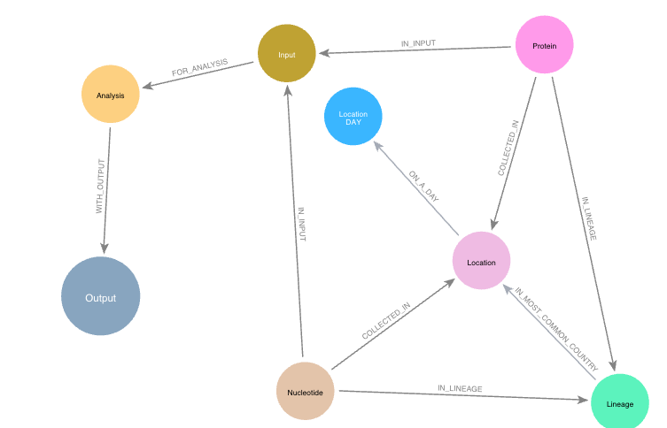
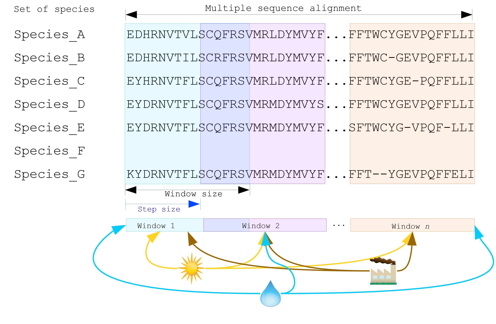
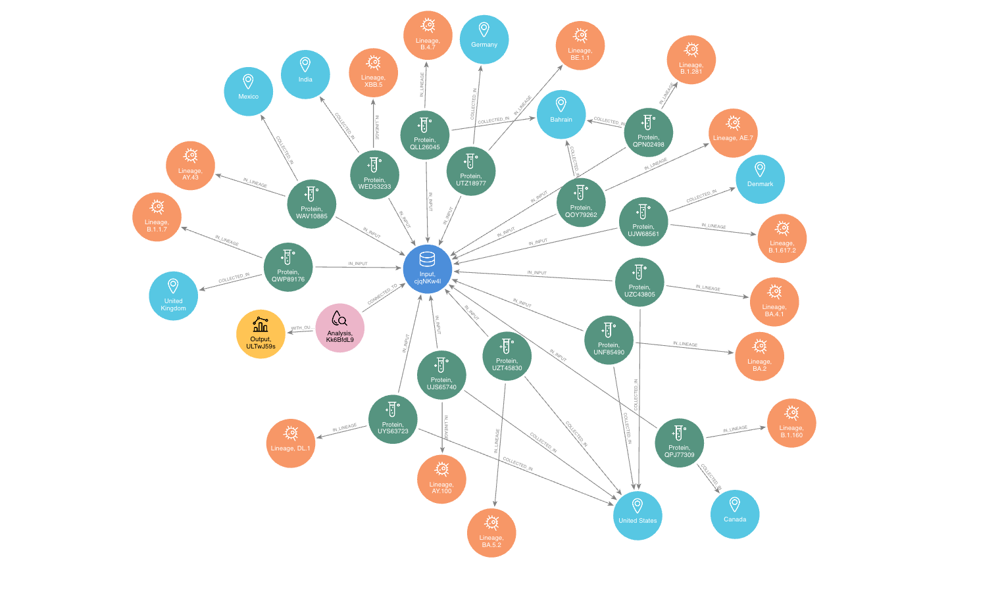
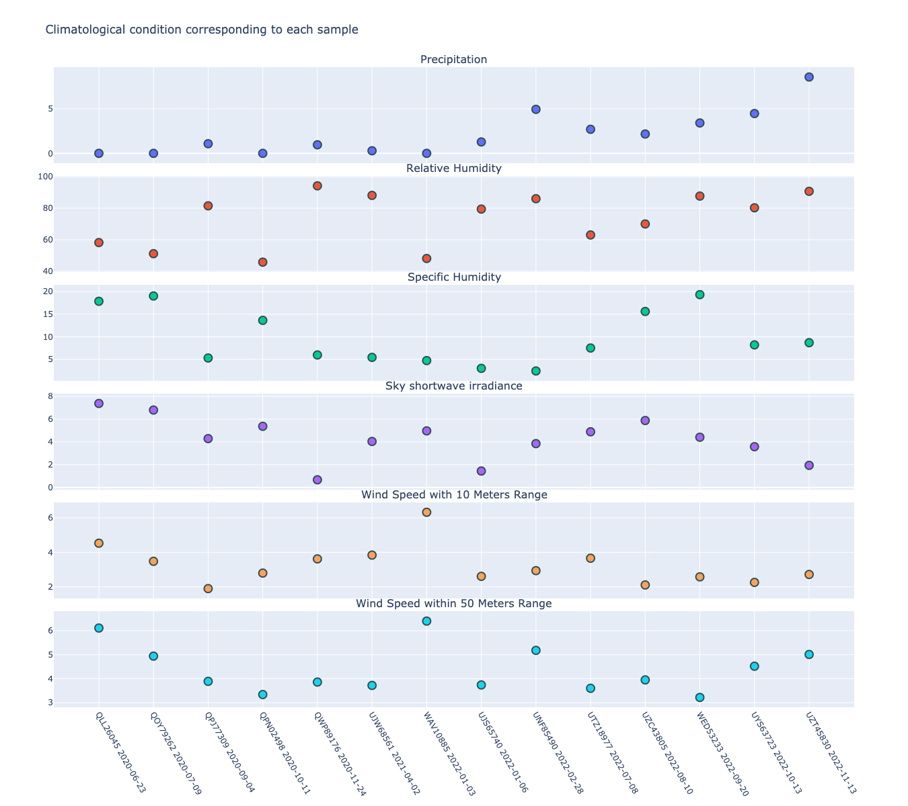
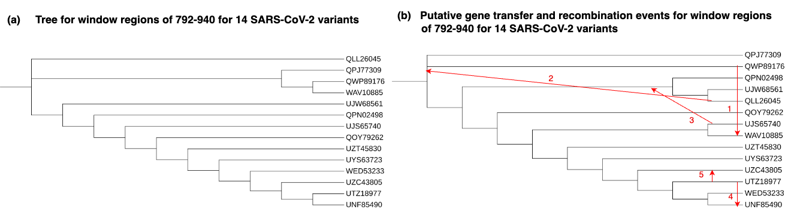
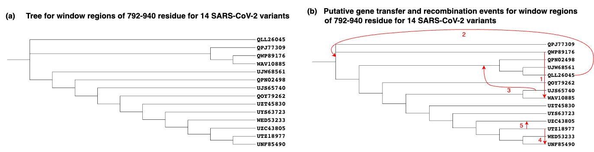

:author: Wanlin Li
:email: Nadia.Tahiri@USherbrooke.ca
:institution: Department of Computer Science, University of Sherbrooke, Sherbrooke, Canada

:author: Nadia Tahiri*
:email: Nadia.Tahiri@USherbrooke.ca
:institution: Department of Computer Science, University of Sherbrooke, Sherbrooke, Canada

:bibliography: mybib

-----------------------------------------------------------------------------------------------------------------------------
aPhyloGeo-Covid: A Web Interface for Reproducible Phylogeographic Analysis of SARS-CoV-2 Variation using Neo4j and Snakemake 
-----------------------------------------------------------------------------------------------------------------------------

.. class:: abstract

   The gene sequencing data, along with the associated lineage tracing and research data generated 
   throughout the Coronavirus disease 2019 (COVID-19) pandemic, constitute invaluable resources that profoundly 
   empower phylogeography research. To optimize the utilization of these resources, we have developed an interactive 
   analysis platform called aPhyloGeo-Covid, leveraging the capabilities of Neo4j, Snakemake, and Python. This platform enables researchers 
   to explore and visualize diverse data sources specifically relevant to  SARS-CoV-2 for phylogeographic analysis. 
   The integrated Neo4j database acts as a comprehensive repository, consolidating COVID-19 pandemic-related sequences information, 
   climate data, and demographic data obtained from public databases, facilitating efficient filtering and organization of input data for 
   phylogeographical studies. Presently, the database encompasses over 113,774 nodes and 194,381 relationships. Additionally, aPhyloGeo-Covid provides a scalable and reproducible phylogeographic workflow for investigating the intricate relationship between geographic features and the patterns of variation in diverse SARS-CoV-2 variants. The code repository of platform is publicly accessible on 
   GitHub (https://github.com/tahiri-lab/iPhyloGeo/tree/iPhylooGeo-neo4j), providing researchers with a valuable tool to analyze 
   and explore the intricate dynamics of SARS-CoV-2 within a phylogeographic context.
   

.. class:: keywords

   Phylogeography, Neo4j, Snakemake, Dash, SARS-CoV-2

Introduction
------------

Phylogeography is a field of study that investigates the geographic distribution of genetic lineages within a particular species, 
including viruses. It combines principles from evolutionary biology and biogeography to understand how genetic variation is distributed 
across various spatial scales :cite:`dellicour2019using`. In the context of viruses, phylogeography aims to uncover the evolutionary 
history and spread of viral lineages by analyzing their genetic sequences and geographical locations. By examining the genetic diversity 
of viruses collected from various geographic locations, researchers can reconstruct the patterns of viral dispersal and track the movement 
and transmission dynamics of viral populations over time :cite:`vogels2023phylogeographic` :cite:`franzo2022phylodynamic` :cite:`munsey2021phylogeographic`. 
In phylogeographic studies of viruses, the integration of genetic sequences, geographic information, and temporal data is essential. 
Integrating genetic sequences with geographical data enables researchers to conduct robust analysis of phylogenetic relationships among viral strains and uncover intricate patterns of viral migration and transmission across diverse regions.Through the integration of genetic and temporal information, researchers can derive insights into the timescale of viral evolution and elucidate the origins as well as dispersal patterns of distinct viral lineages :cite:`holmes2004phylogeography`. 

Throughout the COVID-19 pandemic, researchers worldwide sequenced the genomes of thousands of SARS-CoV-2 viruses. 
These endeavors have significantly enhanced researchers' ability to analyze the intricate temporal and geographic dynamics of virus evolution and dissemination, consequently playing a pivotal role in informing the development of effective public health strategies for the proactive control of future outbreaks.
However, the abundance of genetic sequences and the accompanying geographic and temporal data are scattered across multiple databases, making it challenging to extract, validate, and integrate the information. 
For instance, in order to conduct a phylogeographic study in SARS-CoV-2, a researcher require access to data regarding the geographic distribution of specific lineages. This includes information on the predominant countries in which these lineages are prevalent, along with the earliest and latest recorded detection dates. The Pango Lineages Report serves as a valuable resource for obtaining such data :cite:`o2021tracking`. 
Following this, researchers can utilize databases such as NCBI Virus resource :cite:`brister2015ncbi` or GISAID :cite:`khare2021gisaid` to access sequencing data corresponding to the identified country and lineage. 
Daily climate data (e.g., humidity, wind speed, and temperature) for each location involved during the pandemic can be obtained from reputable sources such as NASA/POWER DailyGridded Weather :cite:`marzouk2021assessment`. To supplement the analysis, epidemiological information, including COVID-19 testing and vaccination rates, can be sourced from projects such as Our World in Data :cite:`mathieu2021global`. 
In summary, conducting phylogeographic research in viruses entails not only the meticulous screening and selection of sequencing data but also the proficient management of associated geographic information and the integration of substantial volumes of environmental data. This multifaceted process can be time-consuming and susceptible to errors.
The challenges associated with data collection, extraction, and integration have hindered the advancement of phylogeographic research within the field :cite:`mccormack2013applications` :cite:`mcgaughran2022comparative`. 

To tackle these challenges, we employed the highly scalable and adaptable Neo4j graph database management system :cite:`guia2017graph` for the storage, management, and querying of extensive SARS-CoV-2 variants-related data. Differing from traditional relational databases that employ tables and rows, Neo4j represents data as an interconnected network of nodes and relationships :cite:`timon2021overview`. By leveraging graph theory, this framework offers a robust foundation for modeling, storing, and analyzing intricate relationships between entities :cite:`angles2012comparison` :cite:`vicknair2010comparison`.

On the other hand, while recent phylogeographic studies have extensively analyzed the genetic data of species across different geographic regions, many have primarily focused on species distribution or provided visual representations, without investigating the correlation between specific genes (or gene segments) and environmental factors :cite:`uphyrkina2001phylogenetics` :cite:`luo2004phylogeography` 
:cite:`taylor2020intercontinental` :cite:`aziz2022phylogeography`. To bridge this gap, a novel algorithm applying sliding windows to scan the genetic sequence information related to their climatic conditions was developed by our team :cite:`koshkarov2022phylogeography`. This algorithm utilizes sliding windows to scan genetic sequence information in relation to climatic conditions. Multiple sequences are aligned and segmented into numerous alignment windows based on predefined window size and step size. To assess the relationship between variation patterns within species and geographic features, the Robinson and Foulds metric :cite:`robinson1981comparison` was employed to quantify the dissimilarity between the phylogenetic tree of each window and the topological tree of geographic features. 
Nonetheless, this process was computationally intensive as each window needed to be processed independently. Additionally, determining 
the optimal sliding window size and step size often required multiple parameter settings to optimize the analysis. Thus, reproducibility played a critical role in this process. 

To address these challenges, we devised a phylogeographic pipeline that harnesses the capabilities of Snakemake, a modern computational workflow management system :cite:`koster2012snakemake`. Distinguishing itself from other workflow management systems such as Galaxy :cite:`jalili2020galaxy` and Nextflow :cite:`spivsakova2023nextflow`, Snakemake stands out as a Python-based solution, guaranteeing exceptional portability and the convenience of executing Snakefiles with a Python installation :cite:`wratten2021reproducible`. Leveraging various Python packages, including Biopython :cite:`cock2009biopython` and Pandas :cite:`mckinney2010` :cite:`lemenkova2019processing`, the Snakemake workflow efficiently handles tasks such as sequencing data reading and writing, as well as conducting phylogenetic analysis. Given these capabilities, Snakemake serves as an optimal choice for aPhyloGeo-Covid. Furthermore, Snakemake supports parallel execution of jobs, significantly enhancing the performance and speed of the pipeline. 
This pipeline implementation facilitates efficient and reproducible analysis, thereby streamlining the phylogeographic research workflow of the aPhyloGeo-Covid.

With a clear focus on addressing the aforementioned limitations, this study aims to develop an integrated, open-source phylogeographic analysis platform. This platform consists of two vital components: data pre-processing and phylogeographical analysis.
In the data pre-processing phase, we employ searchable graph databases, enabling rapid exploration and offering a visual overview of SARS-CoV-2 lineages and their associated environmental factors. This efficient approach allows researchers to navigate through vast datasets and extract pertinent information for their analyses. 
In the subsequent phylogeographical analysis phase, our modularized Snakemake workflow is utilized to examine how genetic variation patterns within different SARS-CoV-2 variants align with geographic features. Leveraging this workflow, researchers can systematically and reproducibly investigate the relationship between viral genetic diversity and specific geographic factors. By adopting this comprehensive approach, a deeper understanding of the intricate interplay among viral evolution, transmission dynamics, and environmental influences can be achieved.

Methodology
-----------

A diverse range of data sources pertaining to SARS-CoV-2, covering the period from January 1, 2020, to December 31, 2022, were meticulously extracted, transformed, and loaded into a Neo4j graph database. These sources encompassed: 

(1) SARS-CoV-2 sequences from the SARS-CoV-2 Data Hub :cite:`hatcher2017virus`
(2) Lineage development information from Cov-Lineages :cite:`o2021tracking`
(3) Population density by country, positivity rates, vaccination rates, diabetes rates, aging data from Our World in Data :cite:`mathieu2021global`
(4) Climate data from NASA/POWER :cite:`marzouk2021assessment` 

To enable efficient querying, configuration of analysis parameters, and output generation within the database, a driver object was established using the Neo4j Python driver to establish seamless connections with the Neo4j database. For phylogeographic analysis, a streamlined workflow was implemented using the Snakemake workflow management system, ensuring an efficient and structured analysis process. Moreover, the interactive visualization capabilities offered by the Dash-Plotly library :cite:`hossain2019visualization` :cite:`liermann2021dynamic` were leveraged for data exploration, analysis parameter setting, and interactive visualization of results, enhancing the interpretability and user-friendliness of the platform.

Data Integration 
++++++++++++++++

Within the Neo4j database, five labels were employed to effectively organize the data, encompassing Lineage, Protein, Nucleotide, Location, and Location Day (See Figure :ref:`fig1`). The Protein and Nucleotide labels serve as repositories for sequencing data information, including accession number, sequence length, collection date, and collected country. The Lineage label stores lineage development information, encompassing the most common country, latest date, and earliest date associated with each lineage. Climate information such as temperature, precipitation, wind speed, humidity, and sky shortwave irradiance for each location and specific day is stored under the LocationDay label. The Location label contains fundamental information regarding hospitals, health, and the economy of each country, encompassing GDP, median age, life expectancy, population, proportion of people aged 65 and older, proportion of smokers, proportion of extreme poverty, diabetes prevalence, human development index, and other pertinent factors (See Table :ref:`labelProp`).

.. raw:: latex

   \begin{table}[htb]
   \caption{Neo4j schema labels and properties for data integration.}
   \label{tab:labelProp}
   \small
   \vspace{-6pt}
   \begin{center}
       \begin{tabular}{p{2cm}|p{4.5cm}}
            \hline
            \textbf{Label} & \textbf{Properties List}  \\ \hline
            Protein & accession number, sequence length, collection date, collected country \\ 
            Nucleotide & accession number, sequence length, collection date, collected country \\ 
            Lineage & most common country, latest date, earliest date \\ 
            Location Day & temperature, precipitation, wind speed, humidity, sky shortwave irradiance \\ 
            Location & GDP, median age, life expectancy, population, proportion of people aged 65 and older, proportion of smokers, proportion of extreme poverty, diabetes prevalence, human development index \\ \hline
        \end{tabular}
   \end{center}
   \end{table}

Lineage nodes establish connections with Nucleotide and Protein nodes, representing the relationships between lineages and their corresponding genetic sequence data. Moreover, Lineage nodes establish relationships with Location nodes, utilizing the most common occurrence rate as a property. This design empowers researchers to determine the most common countries based on lineage names or search for lineages that were predominant in specific countries during specific time periods. This well-structured and interconnected design within the Neo4j database enhances the ability to explore, analyze, and extract meaningful insights from the integrated phylogeographic dataset.

   Schema of Neo4j Database for Phylogeographic Analysis of SARS-CoV-2 Variation. The schema includes key entities and relationships essential for organizing and querying data related to samples of protein, samples of nucleotide, locations, lineages, analysis input, output and parameters. Each entity represents a distinct aspect of the analysis process and facilitates efficient data organization and retrieval. :label:`fig1`

Input exploration
+++++++++++++++++

An interactive platform using Dash-Plotly :cite:`hossain2019visualization` :cite:`liermann2021dynamic` was developed for efficient data exploration and selection.  
The integration of the Dash platform with the Neo4j graph database allows for the seamless retrieval of pertinent data from interconnected nodes based on user-provided keywords related to lineages or locations. This functionality enables efficient identification and filtering of datasets for subsequent phylogeographic analysis. The integration of the powerful Neo4j database with the user-friendly interactive platform facilitates seamless data exploration and selection, supporting researchers in their comprehensive analysis of SARS-CoV-2 variation.

The aPhyloGeo-Covid offers two distinct approaches for selecting input datasets: 1) lineage-based approach for retrieving corresponding sequences based on selected lineage name and 2) location-based approach for retrieving corresponding sequences based on selected location and time period.

1. Lineage-based approach for retrieving corresponding sequences based on selected lineage name
+++++++++++++++++++++++++++++++++++++++++++++++++++++++++++++++++++++++++++++++++++++++++++++++

The multi-step process is facilitated by the Neo4j Python package :cite:`jordan2014neo4j` and the interactive Dash web page. 
Initially, specific lineages of interest are selected from a checklist provided on the Dash web page. 
Subsequently, the selected lineages are utilized to query the graph database, extracting information about the predominant countries where these lineages are prevalent. The earliest and latest recorded dates, along with their corresponding predominant rates, are also retrieved. 
The obtained results are presented as an interactive Dash Table, providing an interface for applying column and row filters. This functionality allows for the exclusion of irrelevant locations or lineages based on specific research criteria. Additionally, predominant rates can be applied as a filter to exclude certain samples.  
Finally, based on the filtered table and the selected sequence type, all related sequences are extracted by accession number. These filtered sequences are then collected as input data for subsequent phylogeographic analysis.

Updating the sample table based on provided lineage names and sequence types, as mentioned earlier, is a crucial step in exploring input data for phylogeographic analysis. The following callback function accepts a sequence type (amino acid or nucleotide) and a list of selected lineage names as input and generates a Dash table containing relevant sample information as the output.

.. code-block:: python

   @app.callback(
       Output('lineage-table', 'data'),
       Input('button-confirm', 'n_clicks'),
       State('checklist-lineage', 'value'),
       State('dropdown-seqType', 'value')
   )
   def update_lineage_table(n_clicks, 
                           checklist_value, 
                           seqType_value):
       ...
       starts_with_conditions = " OR ".join(
               [f'n.lineage STARTS WITH "{char}"' 
                    for char in checklist_value])
       query = f"""
         MATCH (n:Lineage) - [r] -> (l: Location)
         WHERE {starts_with_conditions}
         RETURN n.lineage as lineage, 
                n.earliest_date as earliest_date, 
                n.latest_date as latest_date, 
                l.iso_code as iso_code, 
                n.most_common_country as country,  
                r.rate as rate
                   """
       cols = ['lineage', 'earliest_date', 
                'latest_date', 'iso_code',
                'country', 'rate']
       
       if checklist_value and seqType_value:
         #Query in Neo4j database
         # Transform Cypher results to dataframe
          df=neo_manager.queryToDataframe(query,cols)
          table_data = df.to_dict('records')
          return table_data
       ....

2. Location-based approach for retrieving corresponding sequences based on selected location and time period
++++++++++++++++++++++++++++++++++++++++++++++++++++++++++++++++++++++++++++++++++++++++++++++++++++++++++++

Specific locations and a date period are defined by employing the Dash web page.
Subsequently, the Neo4j database is queried to identify lineages prevalent in the specified locations during the defined time period. 
The retrieved information includes the earliest and latest detected dates of the lineages in each country, along with their predominant rates. To present these findings, an interactive Dash Table is employed, facilitating the application of filters to exclude study areas or lineages below a predetermined threshold. Subsequently, the accession numbers of the corresponding sequences are extracted from the graph database. These filtered sequences are then collected for subsequent phylogeographic analysis.

The following function updates the sample table by incorporating selected start and end dates, sequence type and a list of selected locations.
A Cypher query is employed to retrieve lineage data from the Neo4j database and apply filtering based on specified location and date criteria. This function empowers researchers to explore lineage data associated with diverse geographic regions within a specified date range.

.. code-block:: python

   @app.callback(
       Output('location-table', 'data'),
       Input('button-confirm', 'n_clicks'),
       State('date-range-lineage', 'start_date'),
       State('date-range-lineage', 'end_date'),
       State('checklist-location', 'value'),
       State('dropdown-seqType', 'value')
   )
   def update_table(n_clicks, 
                     start_date, 
                     end_date, 
                     checklist_value, 
                     seqType_value):
       ...
       query = f"""
         MATCH (n:Lineage) - [r] -> (l: Location)
         WHERE 
           n.earliest_date > datetime("{start_date}") 
          AND 
           n.earliest_date < datetime("{end_date}")
          AND 
           l.location in {checklist_value}
         RETURN n.lineage as lineage, 
                n.earliest_date as earliest_date, 
                n.latest_date as latest_date, 
                l.iso_code, 
                l.location as country,  
                r.rate
                   """
               cols = ['lineage', 'earliest_date', 
                       'latest_date', 'iso_code',
                       'country', 'rate']
       if start_date_string and end_date_string 
               and checklist_value and seqType_value:
           # Transform Cypher results dataframe
           df=neo_manager.queryToDataframe(query,cols)
           table_data = df.to_dict('records')
           return table_data
        ...

In summary, these approaches enable user-guided sequencing searches. Once the input sequences are defined, an Input node is generated in our graph database and appropriately labeled. This Input node establishes connections with the relevant sequencing (Nucleotide or Protein) nodes used in the analysis, highlighting relationships between the input data and the corresponding sequences. Each Input node is assigned a unique ID, which is provided for reference and traceability. These user-driven approaches provide a robust framework for sequencing searches, allowing researchers to define and explore input data relationships.

The generation of unique ID for nodes plays a crucial role in ensuring traceability for each analysis. To address this requirement, the provided function ensures that every new node is assigned a traceable ID.

.. code-block:: python

   def generate_unique_name(nodesLabel):
       driver = GraphDatabase.driver(URI,
                                     auth=("neo4j", 
                                     password))
       with driver.session() as session:
           random_name = generate_short_id()

           result = session.run(
               "MATCH (u:" + nodesLabel + 
               " {name: $name}) 
               RETURN COUNT(u)", 
               name=random_name)
           count = result.single()[0]

           while count > 0:
               random_name = generate_short_id()
               result = session.run(
                   "MATCH (u:" + nodesLabel + 
                   " {name: $name}) RETURN COUNT(u)", 
                   name=random_name)
               count = result.single()[0]

           return random_name
                       

The following function facilitates the integration of input nodes with relationships to relevant sequence nodes within the Neo4j database, thereby enhancing the organization and management of input data and analysis entities in the network.

.. code-block:: python

   def add_Input_Neo(nodesLabel, 
                   inputNode_name, 
                   id_list):
       # Execute the Cypher query
       driver = GraphDatabase.driver(URI,
                                     auth=("neo4j", 
                                     password))

       # Create a new node 
       with driver.session() as session:
           session.run(
              "CREATE (userInput:Input {name: $name})", 
              name=inputNode_name)
       # Perform MATCH query to retrieve nodes
       with driver.session() as session:
           result = session.run(
              "MATCH (n:" + nodesLabel + ")" +
              "WHERE n.accession IN $id_lt RETURN n",
              nodesLabel=nodesLabel,
              id_lt=id_list)
           # Create relationship for each matched node
           with driver.session() as session:
               for record in result:
                   other_node = record["n"]
                   session.run(
                      "MATCH (u:Input {name: $name}), 
                             (n:" + nodesLabel + 
                           " {accession: $id}) "
                       "CREATE (n)-[r:IN_INPUT]->(u)",
                       name=inputNode_name, 
                       nodesLabel=nodesLabel, 
                       id=other_node["accession"])

Parameters setting and tuning
++++++++++++++++++++++++++++++
 
After defining the input data, which includes sequence data and associated location information, researchers can utilize the platform to select the analysis parameters. This pivotal step entails creating an Analysis label, where the parameter values are stored as properties. These parameters encompass the step size, window size, RF distance threshold, bootstrap threshold, and the list of environmental factors involved in the analysis. Furthermore, a connection is established between the Input Node and the Analysis Node, offering several advantages. Firstly, it allows researchers to compare results obtained from the same input samples but with different parameter settings. Secondly, it facilitates the comparison of analysis results obtained using the same parameter settings but different input samples. The interconnected Input, Analysis, and Output nodes (See Figure :ref:`fig1`) ensure the repeatability and comparability of analysis results.

After confirming the parameters, the corresponding sequences are downloaded from NCBI :cite:`brister2015ncbi` using the Biopython package :cite:`cock2009biopython`, followed by performing multiple sequence alignments (MSA) :cite:`edgar2006multiple` using the MAFFT method :cite:`katoh2013mafft`. Subsequently, the Snakemake workflow is triggered in the backend, taking the alignment results and associated environmental data as input. Once the analysis is completed, a unique output ID is generated, enabling the results to be queried on the web platform.

The following function performs the preparation and storage of parameters and input data, subsequently triggering the workflow.

.. code-block:: python

   def trigger_workflow(df_params_geo):
      df = pd.DataFrame(df_params_geo)
      analysisNode = generate_unique_name("Analysis")
      outputNode = generate_unique_name("Output")
      
      # record parameters in config file
      with open('config/config.yaml', 'r') as file:
         config = yaml.safe_load(file)
      # Update the values
      config['accession_lt'] = df['id'].tolist()  
      config['feature_names'] = df.columns.tolist()
      config['analysis_name'] = analysisNode
      config['output_name'] = outputNode
      # create geographic input dataset
      csv_file_name = config['geo_file']
      dff.to_csv(csv_file_name, 
                  index=False, 
                  encoding='utf-8')  
      # create sequence input dataset
      aln_file_name = config['seq_file']
      seq_beforeMSA_fname = aln_file_name + '_raw'
      if config['data_type'] == 'aa':
         db_type = "protein"
      else:
         db_type = "nucleotide"
      accession_list = config['accession_lt']

      # update config dictionary to the YAML file
      with open('config/config.yaml', 'w') as file:
         yaml.dump(config, file)
      # (6) download sequences from NCBI 

      seq_manager.downFromNCBI(
                     db_type, 
                     accession_list, 
                     seq_beforeMSA_fname)
      # (6) alignment
      seq_manager.align_MAFFT(seq_beforeMSA_fname,
                              aln_file_name)
      # (7) run aphylogeo snakemake workflow
      os.system("snakemake --cores all")
      # (8) In Neo4j create :Analysis node
      neo_manager.addAnalysisNeo()

      # (9) When Analysis finished, 
       #save output dataframe into Output node
      neo_manager.addOutputNeo()
        ...

Output exploration
++++++++++++++++++

After each analysis, a unique output node is generated in the Neo4j graph database, connected to interrelated nodes that store input and parameter information, forming an intricate network of relationships. 
Through the ID of output node, analysis results can be conveniently traced and accessed. 
The platform not only facilitates querying individual results but also empowers the comparison of multiple analysis outcomes. 
Furthermore, as the platform is utilized, this network of input, analysis, and output nodes expands, enabling the acquisition of valuable insights from the data and facilitating comprehensive analysis of the phylogeographic patterns of SARS-CoV-2 variation.

Snakemake workflow for phylogeographic analysis
+++++++++++++++++++++++++++++++++++++++++++++++

To investigate the potential correlation between the diversity of specific genes or gene fragments and their geographic distribution, a sliding window strategy was employed in addition to traditional phylogenetic analyses. As depicted in Figure :ref:`fig2`, firstly, the multiple sequence alignment (MSA) was partitioned into windows by specifying the sliding window size and sliding window progress step size. Then a phylogenetic tree for each window was constructed. Secondly, cluster analyses for each geographic factor were performed by calculating a distance matrix and creating a reference tree based on the distance matrix and the Neighbor-Joining clustering method :cite:`saitou1987neighbor` :cite:`mihaescu2009neighbor`. Reference trees (based on geographic factors) and phylogenetic trees (based on sliding windows) were defined on the same set of leaves (i.e., names of species). Subsequently, the correlation between phylogenetic and reference trees was evaluated using the Robinson and Foulds (RF) distance calculation :cite:`robinson1981comparison`. RF distances were calculated for each combination of the phylogenetic tree and the reference tree. Finally, bootstrap and RF thresholds were applied to identify gene fragments in which patterns of variation within species coincided with a particular geographic feature. These fragments can serve as informative reference points for future studies. 

By scanning the complete Multiple Sequence Alignment sequences with a sliding window strategy, the phylogeographic research can effectively focus on sequence information for specific window lengths. To address the integration of genetic and environmental data, complex computational workflows are required, consisting of multiple interdependent processing steps. The aPhyloGeo snakemake workflow addresses this challenge by connecting each step through Snakemake rules, resulting in a comprehensive and easily automatable workflow. This workflow ensures reproducibility and facilitates result comparability across different sampling strategies, window sizes, and step sizes. Additionally, the aPhyloGeo workflow enables efficient processing of large datasets on parallel and distributed systems, leading to reasonable runtime. 

Various tools and software were utilized to accomplish these analysis tasks, including Biopython :cite:`cock2009biopython`, raxml-ng :cite:`kozlov2019raxml`, fasttree :cite:`price2009fasttree`, and Python libraries such as robinson-foulds, NumPy :cite:`van2011numpy`, and Pandas :cite:`mckinney2010` :cite:`bernard2016python`. A manuscript for aPhyloGeo-pipeline is available on Github Wiki (https://github.com/tahiri-lab/aPhyloGeo-pipeline/wiki).

   
   Integrated analysis of genetic data and environmental data. The aPhyloGeo workflow can analyze both amino acid sequence alignment data and nucleic acid sequence alignment data. By setting the window size and step size, the alignment of multiple sequences was segmented into sliding windows. For each sliding window, Robinson and Foulds distances are computed for every combination of the sliding window of phylogenetic tree and the reference tree created from environmental factors. :label:`fig2`
   

Results and discussion
------------------------

The SARS-CoV-2 virus has a genome size of approximately 30kb (See Figure :ref:`fig3`). The first two-thirds of its genome, located at the 5'-terminal, encodes the instructions for the synthesis of two major proteins, namely pp1a and pp1ab. 
Following viral enzyme processing, these proteins are transformed into 16 smaller non-structural proteins (Nsps). Specifically, ORF1a encodes nsp1–nsp10, while ORF1b encodes nsp1–nsp16, which play pivotal roles in viral replication and transcription :cite:`khan2021structures`. 
Consequently, our first assessment of the aPhyloGeo-Covid performance focused on the pp1a region.

.. figure:: figure3.png

   Schematic presentation of the SARS-CoV-2 genome Structure. SARS-CoV-2 follows the typical Betacoronavirus genome organization. The full-length RNA genome of approximately 29,903 nucleotides contains a replicase complex (composed of ORF1a and ORF1b) and four genes responsible for the production of structural proteins: Spike gene (S), Envelope gene (E), Membrane gene (M), and Nucleocapsid gene (N). :label:`fig3`

To identify and filter the appropriate datasets for further phylogeographic analysis around pp1a, 14 lineages starting with the codes AE, AY, B, BA, BE, DL, or XBB were selected from the checklist on the aPhyloGeo-Covid web page. Subsequently, with the Neo4j graph database, eight relevant locations were retrieved, where at least one of selected lineage was most prevalent (See Figure :ref:`fig4`). 
An input node was created based on the lineages with connections of all the nodes of input sequences.
The aPhyloGeo-Covid web page facilitated the definition of specific parameters for analysis, including a step size of 3 residues, a window size of 100 residues, an RF distance threshold of 100%, a bootstrap threshold of 0%, and a list of climate factors such as humidity, wind speed, sky shortwave irradiance, and precipitation (See Figure :ref:`fig5`). 
These parameters were associated with the node of analysis and stored as properties within the node. Finally, the Snakemake workflow was triggered in the backend. At the completion of analysis, an output node with a unique identifier was generated within the Neo4j graph database (See Figure :ref:`fig4`).

   
   The networks of a single analysis experiment. For a specific analysis, the network highlights all entities serving as input data sources and their relationships. The Input node establishes connections between the data source objects and the specific analysis object. The Analysis node captures the parameters associated with the analysis, while the Output node stores the resulting analysis data. :label:`fig4`

In this analysis experiment, we used aPhyloGeo-Covid to query preloaded climatic data from our Neo4j database for each sample connected to the input node. The climatic data was based on the most prevalent country and the time of initial collection.
The meteorological parameters considered in our analysis included Precipitation Corrected, Relative Humidity at 2 Meters, Specific Humidity at 2 Meters, All Sky Surface Shortwave Downward Irradiance, Wind Speed within a 10-Meter Range, and Wind Speed within a 50-Meter Range. For statistical analysis, a user-defined average calculation interval of 3 days was applied.
As shown in Figure :ref:`fig5` the 14 samples exhibited a range of precipitation from 0 mm/day to 8.57 mm/day with an average of 2.13 mm/day. 
The specific humidity ranged from 2.44 g/kg to 19.33 g/kg, averaging at 9.77 g/kg. 
The relative humidity ranged from 45.76% to 94.22%, with an average of 73.17%.
Compared to other parameters, wind speed variability and sky surface shortwave downward irradiance showed relatively small variations across the samples. 
The sky surface shortwave downward irradiance ranged from 0.67 kW-hr/m2/day to 7.38 kW-hr/m2/day, with an average of 4.25 kW-hr/m2/day. 
The wind speed at 10 meters ranged from 1.90 m/s to 6.32 m/s, averaging at 3.24 m/s, while the wind speed at 50 meters ranged from 3.22 m/s to 6.40 m/s with an average of 4.39 m/s

   Climatic conditions of each sample in most common country at the time of first collection. The climate factors involved include Precipitation Corrected (mm/day), Relative Humidity at 2 Meters (%), Specific Humidity at 2 Meters (g/kg), All Sky Surface Shortwave Downward Irradiance (kW-hr/m^2/day), Wind Speed within 10 Meters Range (m/s), Wind Speed within 50 Meters Range (m/s). :label:`fig5`
   
   
   

At the end of the aPhyloGeo-Covid analysis workflow, a table was generated containing the RF distance between the phylogenetic tree of that window and the reference tree of a particular environmental feature. 
The distribution of normalized RF distances resulting from the phylogeographic analysis of the input dataset is presented in Figure :ref:`fig6`. 
Windows exhibiting relatively lower RF distances merit further investigation. As illustrated in Figure :ref:`fig6`, the RF distance range from 87.82% to 100%. Among the six climatic factors involved in the analysis, the sliding window region with the lower RF distance was exclusively identified in the integrated analysis involving precipitation.  
For this exploration, a scanning approach was employed, utilizing a window size of 100 residues and a step size of 3 residues for sequence analysis. 
Within the regions identified with low RF distance, special attention should be given to regions 792-940. Notably, a consistently low RF distance value of 81.82% was observed across all 17 windows spanning positions from 792 to 840. 
Furthermore, in accordance with SWISS-MODEL :cite:`waterhouse2018swiss`, the previous research validates the presence of a specific region of Nsp3 called Ubl1 (110 residues, position 819-929) within the identified sequence region.
Ni et al. (2023) :cite:`ni2023structural` revealed that the Ubl1 protein of SARS-CoV-2 exhibits competitive binding with RNA molecules to the N protein, resulting in the dissociation of viral ribonucleoprotein complexes. 
Based on these findings, they propose a model that explains how the N protein binding to the Ubl1 domain of Nsp3 leads to the dissociation of viral ribonucleoprotein complexes. 

   

   Variation of normalized Robinson and Foulds (RF) distance on the Multiple Sequence Alignment (MSA) for different climate facters. A sliding window approach with a window size of 100 residues and a step size of 3 residues was applied. X-axis indicates the start position of sliding windows on the MSA. Various colors represent six analysed climate factors which are relative humidity (blue), specific humidity (green), wind speed within 10 meters range (yellow), wind speed within 50 meters range (brown), sky shortwave irradiance (red), and precipitation (purple). :label:`fig6`
   
Our phylogeography-based exploration revealed a notable correlation between mutations in the region [792-940] and precipitation. As a reproducible phylogeographic platform, aPhyloGeo-Covid offers the potential to expand the sample size for further investigation and facilitates the comparability of analysis results.

In addition of correlation analysis between correlation diversity of subfregment of gene and climate condition, we also inferred the ORF1a phylogeny and window regions 792-940 of ORF1a using the RAxML-NG method :cite:`kozlov2019raxml`, and then conducted a detailed horizontal gene transfer (HGT) and recombination analyses (See Figure :ref:`fig7`) using the HGT-Detection program available on the T-Rex web server :cite:`boc2012t`.
The HGT-Detection program allows one to infer all possible horizontal gene transfer events for a given group of species by reconciling the species tree (i.e. ORF1a gene tree in our case) with different gene phylogenies built for regions of individual genes :cite:`boc2011towards` :cite:`denamur2000evolutionary`.
Significantly, every identified horizontal gene transfer event can be understood from three perspectives: Firstly, it may signify a distinct complete or partial HGT occurrence between genetically distant species. Secondly, it could indicate the occurrence of parallel evolution, where the involved species underwent similar genetic changes independently. Lastly, it could also indicate the emergence of a new species (referred to as a gene transfer recipient) resulting from the recombination of the donor species genome with that of a neighboring recipient in the species' evolutionary history :cite:`makarenkov2021horizontal`.

.. raw:: latex

   \begin{table*}
   \label{tab:HGT}
 
        \caption{Putative horizontal gene transfer events in the window regions of 792-940 residue (amino acid sequences) of 14 SARS-Cov-2 variants.}
       \begin{tabular}{p{1cm}|p{1cm}|p{1cm}|p{1cm}|p{2cm}}
            \hline
            \textbf{Iteration} & \textbf{RF distance} & \textbf{BD distance} & \textbf{Origin Subtree} & \textbf{Destination Subtree} \\ \hline
            1 & 10 & 7.5 & QWP89176 & WAV10885 \\ 
            2 & 6 & 3.5 & QLL26045 & (QPJ77309, QWP89176, WAV10885) \\ 
            3 & 4 & 2.5 & UJS65740 &  (QLL26045, QPJ77309, QPN02498, QWP89176, UJW68561, WAV10885) \\ 
            4 & 2 & 1.5 & UTZ18977 &  UNF85490 \\ 
            5 & 0 & 0.0 & (UNF85490, UTZ18977) & UZC43805\\ \hline
        \end{tabular}
        
        {\raggedright RF distance: Robinson and Foulds distance. \par}
        {\raggedright BD: Bipartition Dissimilarity. \par}
   
   \end{table*}

The minimum-cost transfer scenario with five HGTs necessary to reconcile the variants and gene phylogenies is shown in Figure :ref:`fig7` (HGTs are depicted by numbered arrows). The analysis initially measured the Robinson and Foulds distance (RF) between the phylogenetic tree of ORF1a and the inferred phylogenetic trees of the window regions 792-940 of ORF1a, yielding a dissimilarity of 16. Five iterations led to the identification of HGT events (See Table :ref:`HGT`): the first iteration detected an HGT from subtree QWP89176 to subtree WAV10885 (RF = 10 and BD = 7.5), followed by an HGT from subtree QLL26045 to subtrees QPJ77309, QWP89176, and WAV10885 (RF = 6 and BD = 3.5). The third iteration revealed an HGT from subtree UJS65740 to subtrees QLL26045, QPJ77309, QPN02498, QWP89176, UJW68561, and WAV10885 (RF = 4 and BD = 2.5). In the fourth iteration, an HGT event occurred from subtree UTZ18977 to subtree UNF85490 (RF = 2 and BD = 1.0). Finally, the fifth iteration showed an HGT from subtrees UNF85490 and UTZ18977 to subtree UZC43805 (RF = 0 and BD = 0.0). Overall, five HGT events were identified throughout the analysis.

   
   Putative horizontal gene transfer events found for the window regions of 792-940 residue (amino acid sequences) of 14 SARS-Cov-2 variants. (a) presents the phylogenetic tree of the window regions 792-940 of ORF1a. (b) presents the phylogenetic tree of ORF1a (amino acid sequences) with putative horizontal gene transfers mapped into it.  :label:`fig7`
   
   

Conclusions and future work
---------------------------

This project demonstrates the creation of an open-source, interactive platform that aims to enhance phylogeographic research. By integrating graph databases and a modularized Snakemake workflow, the platform effectively addresses the challenges posed by manual tools, streamlining the extraction, validation, and integration of genetic and environmental data. The platform primarily focuses on advancing the analysis of geographic and environmental data associated with SARS-CoV-2.

The utilization of the platform leads to the accumulation of diverse findings, contributed by researchers conducting various analyses. As more researchers join the platform, this network of data sources and analysis outputs continues to expand. The centralized database acts as a repository, providing researchers with access to a wide range of results and facilitating exploration and knowledge sharing within the scientific community. 
Although the platform is currently undergoing testing, it is expected that the interconnectedness of analyses will increase as the platform gains popularity and attracts more researchers. This network enables researchers to compare their findings and identify meaningful patterns. Overall, the platform facilitates the dissemination of research findings, encourages collaboration and building upon each previous work, and fosters a sense of community and scientific advancement.

To further enhance aPhyloGeo-Covid, several potential avenues for improvement can be explored:

1. Expanding the scope of available data resources, with a specific focus on augmenting geographic and environmental data. By enriching and diversifying the dataset, the aPhyloGeo-Covid project can unlock greater potential to uncover valuable insights regarding the dynamics of SARS-CoV-2 transmission and its intricate relationship with geographical and environmental variables.

2.	Broadening the scope of phylogeographic analysis and comprehensively investigating the evolutionary dynamics and spatial spread of the virus can be achieved by expanding the existing pipeline of aPhyloGeo-Covid. In addition to the current pipeline, which focuses on exploring the correlation between specific genes or gene fragments and their geographic distribution, incorporating additional phylogeographic analysis workflows is recommended. By incorporating a diverse range of analysis approaches, aPhyloGeo-Covid can offer a more extensive toolkit for studying the evolutionary dynamics and spatial dissemination of SARS-CoV-2. This expanded toolkit will contribute to a more comprehensive understanding of the virus and its transmission patterns.

3.	To meet the increasing research demands and accommodate larger datasets, prioritizing scalability and efficiency is crucial in the development of aPhyloGeo-Covid. Enhancing scalability and efficiency will enable the platform to handle substantial volumes of data while maintaining optimal performance. This capability is vital for researchers and public health practitioners, as it ensures fast and reliable analyses, even as the data continues to grow. By ensuring scalability and efficiency, aPhyloGeo-Covid can effectively support decision-making processes and provide valuable insights into the spatial spread and evolution of SARS-CoV-2.

Acknowledgements
----------------

The authors thank SciPy conference and reviewers for their valuable comments on this paper. 
This work was supported by the Natural Sciences and Engineering Research Council of Canada, the Université de Sherbrooke grant, 
and the Centre de recherche en écologie de l’Université de Sherbrooke (CREUS).

