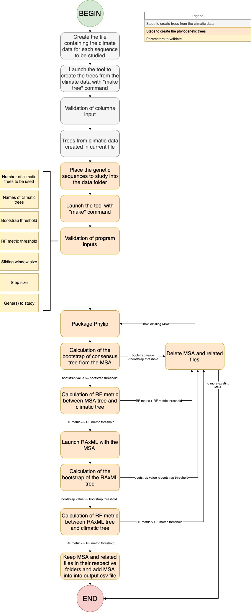
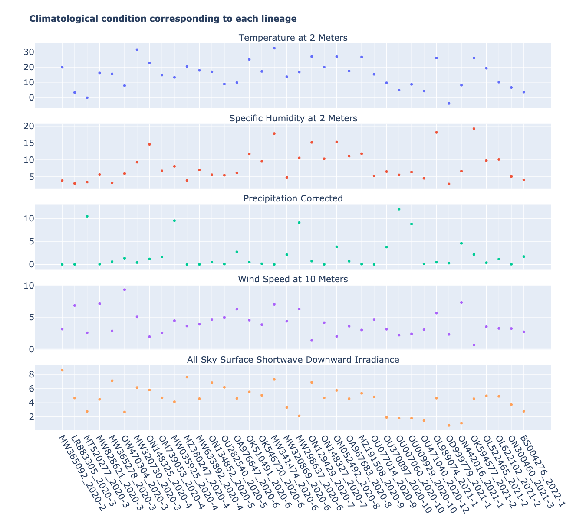
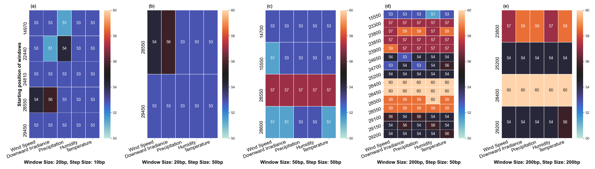
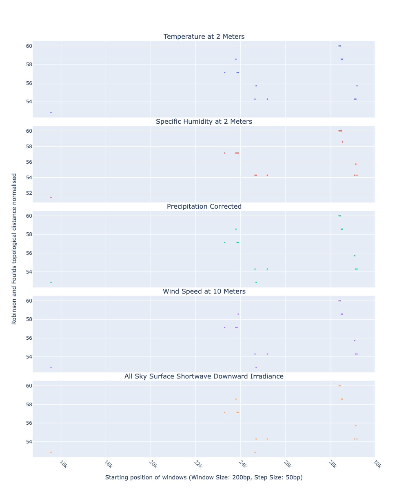

:author: Wanlin Li
:email: wanlin.li@usherbrooke.ca
:institution: Department of Computer Science, University of Sherbrooke, Sherbrooke, QC J1K2R1, Canada

:author: Aleksandr Koshkarov
:email: aleksandr.koshkarov@usherbrooke.ca
:institution: Department of Computer Science, University of Sherbrooke, Sherbrooke, QC J1K2R1, Canada
:institution: Center of Artificial Intelligence, Astrakhan State University, Astrakhan, 414056, Russia

:author: My-Linh Luu
:email: luu.my-linh@courrier.uqam.ca 
:institution: Department of Computer Science,  University of Quebec at Montreal, Montreal, QC, Canada

:author: Nadia Tahiri
:email: Nadia.Tahiri@USherbrooke.ca
:institution: Department of Computer Science, University of Sherbrooke, Sherbrooke, QC J1K2R1, Canada

:bibliography: mybib

-------------------------------------------------------------
Phylogeo: Analysis of genetic and climatic data of SARS-CoV-2
-------------------------------------------------------------

.. class:: abstract

   Due to the fact that the SARS-CoV-2 pandemic reaches its peak, researchers around the globe are combining efforts to investigate the genetics of different variants to better deal with its distribution. This paper discusses phylogeographic approaches to examine how patterns of divergence within SARS-CoV-2 coincide with geographic features, such as climatic features.
   We developed a python-based bioinformatic pipeline called Phylogeo for phylogeographic analysis to help researchers better understand the distribution of the virus in specific regions via a configuration file, and then run all the analysis operations in a single run. In particular, the Phylogeo tool determines which parts of the genetic sequence undergo a high mutation rate depending on geographic conditions, using a sliding window that moves along the genetic sequence alignment in user-defined steps and a window size. As a Python-based cross-platform program, Phylogeo works on Windows®, MacOS X® and GNU/Linux. The implementation of this pipeline has been made publicly available on GitHub (https://github.com/tahiri-lab/phylogeography-algo).

.. class:: keywords

    Phylogeography, SARS-CoV-2, Bioinformatics, Genetic, Climatic Condition

Introduction
------------

The global pandemic caused by severe acute respiratory syndrome coronavirus 2 (SARS-CoV-2) is at its peak and more and more variants of SARS-CoV-2 were described over time. Among these, some are considered variants of concern (VOC) by the World Health Organization (WHO) due to their impact on global public health, such as Alpha (B.1.1.7), Beta (B.1.351), Gamma (P.1), Delta (B.1.617.2), and Omicron (B.1.1.529) :cite:`CRADD22`. Although significant progress was made in vaccine development and mass vaccination is being implemented in many countries, the continued emergence of new variants of SARS-CoV-2 threatens to reverse the progress made to date. Researchers around the world collaborate to better understand the genetics of the different variants, as well as the factors that influence the epidemiology of this infectious disease. Genetic studies of the different variants contributed to the development of vaccines to better combat the spread of the virus. Studying the factors (e.g., environment, host, agent of transmission) that influence epidemiology helps us to limit the continued spread of infection and prepare for the future re-emergence of diseases caused by subtypes of coronavirus :cite:`LFZK06`. However, few studies report associations between environmental factors and the genetics of different variants. Different variants of SARS-CoV-2 are expected to spread differently depending on geographical conditions, such as the meteorological parameters. The main objective of this study is to find clear correlations between genetics and geographic distribution of different variants of SARS-CoV-2.

Several studies showed that COVID-19 cases and related climatic factors correlate significantly with each other (:cite:`[OCFC20]`; :cite:`SDPMS20`; :cite:`SMSKSGB22`). :cite:`OCFC20` reported a decrease in the rate of SARS-CoV-2 progression with the onset of spring and summer in the northern hemisphere. :cite:`SDPMS20` suggested a negative correlation between mean temperature by country and the number of SARS-CoV-2 infections, along with a positive correlation between rainfall and SARS-CoV-2 transmission. This contrasts with the results of the study by :cite:`SMSKSGB22`, which showed that an increase in temperature led to an increase in the spread of SARS-CoV-2. The results of :cite:`CPKGWBB21` imply that a country located 1000 km closer to the equator can expect 33% fewer cases of SARS-CoV-2 per million population. Some virus variants may be more stable in environments with specific climatic factors. :cite:`SMSKSGB22` compared mutation patterns of SARS-CoV-2 with time series of changes in precipitation, humidity, and temperature. They suggested that temperatures between 43°F and 54°F, humidity of 67-75%, and precipitation of 2-4 mm may be the optimal environment for the transition of the mutant form from D614 to G614.

In this study, we examine the geospatial lineage of SARS-CoV-2 by combining genetic data and metadata from associated sampling locations. Thus, an association between genetics and the geographic distribution of SARS-CoV-2 variants can be found. We focus on developing a new algorithm to find relationships between a reference tree (i.e., a tree of geographic species distributions, temperature trees, habitat precipitation trees, or others) with their genetic compositions. This new algorithm can help find which genes or which subparts of a gene are sensitive or favorable to a given environment.

Problem statement and proposal
------------------------------

Phylogeography is the study of the principles and processes that govern the distribution of genealogical lineages, particularly at the intraspecific level. The geographic distribution of species is often correlated with the patterns associated with the species' genes (:cite:`A00`, :cite:`KM02`)
In a phylogeographic study, three major processes must be considered (:cite:`N92`) which are:

1.	Genetic drift is the result of allele sampling errors. These errors are due to generational transmission of alleles and geographical barriers. Genetic drift is a function of the size of the population. Indeed, the larger the population, the lower the genetic drift. This is due to the ability to maintain genetic diversity in the original population. By convention, we say that an allele is fixed if it reaches the frequency of 100% and we say that it is lost if it reaches the frequency of 0%.

2.	Gene flow or migration is an important process for conducting a phylogeographic study. It is the transfer of alleles from one population to another, increasing intrapopulation diversity and decreasing interpopulation diversity.

3.	There are many selections in all species, let us indicate the two most important ones when they are important for a phylogeographic study.
   
   a.	Sexual selection is a phenomenon resulting from an attractive characteristic between two species. This selection is therefore a function of the size of the population.
   
   b.	Natural selection is a function of both fertility, mortality and adaptation of a species to a habitat. adaptation of a species to a habitat.

Populations living in different environments with varying climatic conditions are subject to pressures that can lead to evolutionary divergence and reproductive isolation (:cite:`OS98`; :cite:`S01`).  Phylogeny and geography are then correlated. This study therefore aims to present an algorithm to show the possible correlation between certain genes or gene fragments and the geographical distribution of species.

In this study, we focused on SARS-CoV-2 to understand the correlation between the occurrence of different variants and the climate environment. Identifying ways in which patterns of divergence within SARS-CoV-2 variants coincide with geographic features can be difficult for several reasons. 

Most studies in phylogeography consider only genetic data without directly considering climatic data. They indirectly take this information as a basis for locating the habitat of the species. We have developed the first version of a phylogeography that integrates climate data. The sliding window strategy will provide more robust results, as it will particularly highlight the area sensitive to climate adaptation. 

Methods and Python scripts
--------------------------

In order to achieve our goal, we designed a workflow and then developed a script in Python version 3.9. It interacts with multiple bioinformatic programs, taking nucleotide data as input, and performs multiple phylogenetic analyses using a sliding window approach. The process is divided into three main steps (see Figure 1).

The first step involves collecting data to search for quality viral sequences that are essential for the condition of our results. All sequences were retrieved from the NCBI Virus website (National Center for Biotechnology Information). In total, 20 regions were selected to represent 38 gene sequences of SARS-CoV-2. After collecting genetic data, we extracted 5 climatic factors for the 20 regions, i.e., temperature, humidity, precipitation, wind speed, and sky surface shortwave downward irradiance. This data was obtained from the NASA website (https://power.larc.nasa.gov/).

In the second step, trees are created with climatic data and genetic data, respectively. For climatic data, we calculated the dissimilarity between each pair of variants (i.e., from different climatic conditions), resulting in a symmetric square matrix. From this matrix, the neighbor joining algorithm was used to construct the climate tree. The same approach was implemented for genetic data. Using nucleotide sequences from the 38 SARS-CoV-2 lineages, phylogenetic reconstruction is repeated to construct genetic trees, considering only the data within a window that moves along the alignment in user-defined steps and window size.

In the third step, the phylogenetic trees constructed in each sliding window are compared with the climatic trees using the Robinson and Foulds topological distance (:cite:`RF81`). The distance was normalized by 2n-6, where n is the number of leaves (i.e., taxa). The proposed approach considers bootstrapping. The implementation of sliding window technology provides a more accurate identification of regions with high gene mutation rates. 

As a result, we highlighted a correlation between parts of genes with a high rate of mutations depending on the geographic distribution of viruses, which emphasizes the emergence of new variants (i.e., Delta, Alpha, Gamma, Beta, and Omicron).

The creation of phylogenetic trees, as mentioned above, is an important part of the solution and includes the main steps of the developed pipeline. The main parameters of this part are as follows:

.. code-block:: python

   def create_phylo_tree(g...):
    ...
    for file in files:
        try:
            ...
            create_bootstrap()
            run_dnadist()
            run_neighbor()
            run_consense() 
            filter_results(...)
            ...
        except Exception as error:
            raise 

This function takes gene data, window size, step size, bootstrap threshold, threshold for the Robinson and Foulds distance, and data names as input parameters. Then the function sequentially connects the main steps of the pipeline: align_sequence(gene), sliding_window(window_size, step_size), create_bootstrap(), run_dnadist(), run_neighbor(), run_consense(), and filter_results with parameters. As a result, we obtain a phylogenetic tree (or several trees), which is written to a file.

The sliding window strategy can detect genetic fragments depending on environmental parameters, but this work requires time-consuming data preprocessing and the use of several bioinformatics programs. For example, we need to verify that each sequence identifier in the sequencing data always matches the corresponding metadata. If samples are added or removed, we need to check whether the sequencing dataset matches the metadata and make changes accordingly. In the next stage we need to align the sequences and integrate everything step by step into specific software such as MUSCLE, Consense, Seqboot, RF, Dnadist, Neighbor, and raxmlHPC. The use of each software requires expertise in bioinformatics. In addition, the intermediate analysis steps inevitably generate many intermediate files, the management of which not only consumes the time of the biologist, but is also subject to errors, which reduces the reproducibility of the study. At present, there are only a few systems designed to automate the analysis of phylogeography. In this context, the development of a computer program for a better understanding of the nature and evolution of coronavirus is essential for the advancement of clinical research.

   The workflow of the algorithm. The operations within this workflow include several blocks. The blocks are highlighted by different three colors. The first block (the light pink color) is responsible for creating the trees based on the climate data. The second block (the dark yellow color) performs the function of input parameter validation. The third block (the light-yellow color) allows the creation of phylogenetic trees. This is the most important block and the basis of this study, through the results of which the user receives the output data with the necessary calculations. :label:`fig1`

Dataset
-------
Through significant advances in the generation and exchange of SARS-CoV-2 genomic data in "real time", international spread of lineages is tracked and recorded on the website (cov-lineages.org/global_report.html) (:cite:`OHPWBKU21`). In this study, we focused on the 38 complete SARS-CoV-2 lineages collected from their first reported location at their earliest reported date (Table 1). 

The Pango lineage nomenclature system is hierarchical and fine-scaled and is designed to capture the leading edge of pandemic transmission. Each Pango lineage aims to define an epidemiologically relevant phylogenetic cluster, for instance, an introduction into a distinct geographic area with evidence of onward transmission (:cite:`RHOHMRP20`). The creation of Pango lineages follows two guiding principles. First, Pango lineages signify groups or clusters of infections with a shared ancestry. If the entire pandemic can be thought of as a vast branching tree of transmission, then the Pango lineages represent individual branches within that tree. Second, Pango lineages are intended to highlight epidemiologically relevant events, such as the appearance of the virus in a new location, a rapid increase in the number of cases, or the evolution of viruses with new phenotypes (:cite:`OSUJHMR21`). Therefore, our study focuses on SARS-CoV-2 lineages that were first identified and widely disseminated in a particular country during a certain period. We selected 38 lineages with regional characteristics for further study. Based on location information, complete nucleotide sequencing data for these 38 lineages was collected from the NCBI Virus website (https://www.ncbi.nlm.nih.gov/labs/virus/vssi/#/). In the case of the availability of multiple sequencing results for the same lineage in the same country, we selected the sequence whose collection date was closest to the earliest date presented. If there are several sequencing results for the same country on the same date, the sequence with the least number of ambiguous characters (N per nucleotide) is selected.

.. raw:: latex

   \begin{table*}

     \begin{longtable*}{|l|l|l|l||l|l|l|l|}
        \hline
         Lineage & Most Common Country                & Earliest Date & Accession Number & Lineage & Most Common Country & Earliest Date & Accession Number\\ \hline
         A.2.3     & United Kingdom 100.0\% & 2020-03-12    & OW470304.1                                                    & L.2     & Netherlands 73.0\%   & 2020-03-23    & LR883305                                                      \\ \hline
         AE.2      & Bahrain 100.0\%        & 2020-06-23    & MW341474                                                      & L.4     & USA 100.0\%          & 2020-06-29    & OK546730                                                      \\ \hline
         AH.1      & Switzerland 100.0\%    & 2021-01-05    & OD999779                                                      & M.2     & Switzerland 90.0\%   & 2020-10-26    & OU009929                                                      \\ \hline
         AK.2      & Germany   100.0\%      & 2020-09-19    & OU077014                                                      & N.1     & USA   91.0\%         & 2020-03-25    & MT520277                                                      \\ \hline
         B.1.1.107 & United Kingdom 100.0\% & 2020-06-06    & OA976647                                                      & N.3     & Argentina   96.0\%   & 2020-04-17    & MW633892                                                      \\ \hline
         B.1.1.172 & USA   100.0\%          & 2020-04-06    & MW035925                                                      & N.4     & Chile   92.0\%       & 2020-03-25    & MW365278                                                      \\ \hline
         BA.2.24   & Japan   99.0\%         & 2022-01-27    & BS004276                                                      & N.6     & Chile   98.0\%       & 2020-02-16    & MW365092                                                      \\ \hline
         C.1       & South  Africa 93.0\%   & 2020-04-16    & OM739053.1                                                    & N.7     & Uruguay   100.0\%    & 2020-06-18    & MW298637                                                      \\ \hline
         C.17      & Egypt 69.0\%           & 2020-04-04    & MZ380247                                                      & N.8     & Kenya   94.0\%       & 2020-06-23    & OK510491                                                      \\ \hline
         C.20      & Switzerland 85.0\%     & 2020-10-26    & OU007060                                                      & N.9     & Brazil   96.0\%      & 2020-09-25    & MZ191508                                                      \\ \hline
         C.23      & USA   90.0\%           & 2020-05-11    & ON134852                                                      & P.1.13  & USA   100.0\%        & 2021-02-24    & OL522465                                                      \\ \hline
         C.31      & USA   87.0\%           & 2020-08-11    & OM052492                                                      & P.1.7.1 & Peru 94.0\%          & 2021-02-07    & OK594577                                                      \\ \hline
         C.36      & Egypt 34.0\%           & 2020-03-13    & MW828621                                                      & P.2     & Brazil   58.0\%      & 2020-04-13    & ON148325                                                      \\ \hline
         C.37      & Peru 43.0\%            & 2021-02-02    & OL622102                                                      & P.3     & Philippines   83.0\% & 2021-01-08    & OL989074                                                      \\ \hline
         C.7       & Denmark 100.0\%        & 2020-05-11    & OU282540                                                      & P.7     & Brazil   71.0\%      & 2020-07-01    & ON148327                                                      \\ \hline
         D.2       & Australia 100.0\%      & 2020-03-19    & MW320730                                                      & Q.2     & Italy 99.0\%         & 2020-12-15    & OU471040                                                      \\ \hline
         D.3       & Australia 100.0\%      & 2020-06-14    & MW320869                                                      & Q.3     & USA   99.0\%         & 2020-07-08    & ON129429                                                      \\ \hline
         D.4       & United Kingdom 80.0\%  & 2020-08-13    & OA967683                                                      & Q.6     & France   92.0\%      & 2021-03-02    & ON300460                                                      \\ \hline
         D.5       & Sweden 65.0\%          & 2020-10-12    & OU370897                                                      & Q.7     & France   86.0\%      & 2021-01-29    & ON442016                                                      \\ \hline
     \end{longtable*}

     \caption{Area Comparisons \DUrole{label}{quanitities-table}}

   \end{table*}

For this study, the meteorological parameters of the selected countries were considered. The parameters include Temperature at 2 Meters, Specific Humidity at 2 Meters, Precipitation Corrected, Wind Speed at 10 Meters, and All Sky Surface Shortwave Downward Irradiance. The daily data for the above parameters were collected from the NASA website (https://power.larc.nasa.gov/). Since the data was available only for specific cities, we focused on the city in which the sequence was collected. Considering that the spread of the virus in a country and the data statistics are time-consuming, we collected climatological data for the three days before the earliest reporting date (Table 1) corresponding to each lineage and averaged them for analysis.

   Heatmap of Robinson and Foulds topological distance in alignment windows. :label:`fig2`

Results
-------
In this section, we describe the results obtained by our dataset (see Data section) using our new algorithm (see Method section).

The size of sliding window and advanced step for the sliding window play important roles in analysis. We restricted our conditions to certain values. For comparation, we applied 5 combinations of parameters (window size and step size) to the same dataset. These include the choice of different window sizes (20bp, 50bp, 200bp) and step sizes (10bp, 50bp, 200bp). Those combinations of window sizes and step sizes allow us to have 3 different strategies of movement (overlapping, nonoverlapping, with gaps). Here we fixed the couple (window size, step size) to some values (20, 10), (20, 50), (50, 50), (200, 50) and (200, 200). 

1.	Robinson and Foulds baseline and bootstrap threshold: In this study, the phylogenetic trees constructed in each sliding window are compared with the climatic trees using the Robinson and Foulds topological distance (RF distance). We defined the value of RF distance obtained for regions without any mutations as the baseline. Although different sample sizes and sample sequence characteristics can cause differences in the baseline, however, regions without any mutation are often accompanied by very low bootstrap values. Using the distribution of bootstrap values and combining it with the validation of alignment visualization, we confirmed that the RF baseline value in this study was 50 and the bootstrap values corresponding to this baseline was smaller than 10.

2.	The implementation of sliding window technology with bootstrap threshold provides a more accurate identification of regions with high gene mutation rates. Figure 3 shows the general pattern of RF distance changes over alignments windows with different climate conditions on bootstrap value greater than 10. The trend of RF variation under different climatic conditions does not vary much throughout this whole sequence sliding window scan, which may be related to the correlation between climatic factors (Wind Speed, Downward Irradiance, Precipitation, Humidity, Temperature). Windows starting from or containing position (28550bp) were screened in all five scans for different combinations of window size and step size. The window formed by position 29200bp to position 29470bp is screened out in all four scans except the combination of 50bp window size with 50bp step size. As can be seen from Figure 3, when gaps are present in the scan (window size: 20bp, step size: 50bp), some potential mutation windows are not screened compared to other movement strategies because the sequences of the gap part are not computed by the algorithm. In addition, when the window size is small, the capture of the window mutation signal becomes more sensitive, especially when the number of samples is small. At this time, a single base change in a single sequence can cause a change in the value of RF. Therefore, a high quality of sequencing data is required to prevent the error caused by ambiguous characters (N in nucleotide) on RF values. And when a larger window size (200bp) is selected, the overlapping movement strategy (window size: 200bp, step size 50bp) allows the signal of base mutations to be repeatedly verified and enhanced in adjacent window scans compared to the non-overlapping strategy (window size: 200bp, step size: 200bp). In this situation, the range of RF values is relatively large, and the number of windows eventually screened is relatively greater. Because of the small number of the SARS-CoV-2 lineages sequences we analyzed in this study, we chose to scan the alignment sequences with a larger window and overlapping movement strategy for further analysis (window size: 200bp, step size 50bp).

3.	RF distance quantified the difference between phylogenetic tree constructed in certain sliding window and climatic tree constructed in corresponding climatic data. Relatively low RF distance values represent relatively more similarity between phylogenetic tree and climatic tree. With our algorithm based on the sliding window technique, regions with high mutation rates can be identified (Fig 4). Subsequently, we compare the RF values of these regions. If there is a correlation between the occurrence of mutations and the climate factors studied, then regions with relatively low RF values (the alignment position of 15550bp – 15600bp and 24650bp-24750bp) are more likely to be correlated with climate factors than the other loci screened for mutations. 

4.	Our pipeline can also be applied to phylogeographic studies of other species. In cases where it is determined (or assumed) that the occurrence of a mutation is associated with certain geographic factors, our pipeline can help to highlight mutant regions and specific mutant regions within them that are more likely to be associated with that geographic parameter. Our algorithm can provide a reference for further biological studies.

   Heatmap of Robinson and Foulds topological distance over alignment windows. Five different combinations of parameters were applied (a) window size = 20bp and step size = 10bp; (b) window size = 20bp and step size = 50bp; (c) window size = 50bp and step size = 50bp; (d) window size = 200bp and step size = 50bp; and (e) window size = 200bp and step size = 200bp. Robinson and Foulds topological distance was used to quantify the distance between phylogenetic tree constructed in certain sliding window and climatic tree constructed in corresponding climatic data (wind speed, downward irradiance, precipitation, humidity, temperature). :label:`fig3`

   Robinson and Foulds (RF) topological distance normalized changes over the alignment windows. Multiple phylogenetic analyses were performed using a sliding window (window size = 200 bp and step size = 50 bp). Phylogenetic reconstruction was repeated considering only data within a window that moved along the alignment in steps. The RF normalized topological distance was used to quantify the distance between the phylogenetic tree constructed in each sliding window and the climate tree constructed in the corresponding climate data (wind speed, downward irradiance, precipitation, humidity, temperature). Only regions with high genetic mutation rates were marked in the figure.  :label:`fig4`

Conclusions and Future Work
---------------------------
In this paper, a bioinformatics pipeline for phylogeographic analysis is designed to help researchers better understand the distribution of viruses in specific regions using genetic and climate data. We propose a new algorithm called phylogeo that allows the user to quickly and intuitively create trees from genetic and climate data. Using a sliding window, the algorithm finds specific regions on the viral genetic sequences that can be correlated to the climatic conditions of the region.  To our knowledge, this is the first study of its kind that incorporates climate data into this type of study. It aims to help the scientific community by facilitating research in the field of phylogeography. Our solution runs on Windows®, MacOS X® and GNU/Linux and the code is freely available to researchers and collaborators on GitHub (https://github.com/tahiri-lab/phylogeography-algo).

As a future work on the project, we plan to incorporate the following additional features:

1.	We can handle large amounts of data, especially when considering many countries and longer time periods (dates). In addition, since the size of the sliding window and the forward step play an important role in the analysis, we need to perform several tests to choose the best combination of parameters. In this case, it is important to provide faster performance of this solution, and we plan to adapt the code to parallelize the computations. In addition, we intend to use the resources of Compute Canada and Compute Quebec for these high load calculations.

2.	To enable further analysis of this topic, it would be interesting to relate the results obtained, especially the values obtained from the best positions of the multiple sequence alignments, to the dimensional structure of the proteins, or to the map of the selective pressure exerted on the indicated alignment fragments.

3.	We can envisage a study that would consist in selecting only different phenotypes of a single species, for example, Homo Sapiens, in different geographical locations. In this case, we would have to consider a larger geographical area in order to significantly increase the variation of the selected climatic parameters. Such a study would consist in observing the evolution of the genes of the selected species according to different climatic parameters.

4.	We intend to develop a website that can help biologists, ecologists and other interested professionals to perform calculations in their phylogeography projects faster and easier. We plan to create a user-friendly interface with the input of the necessary initial parameters and the possibility to save the results (for example, by sending them to an email). These results will include calculated parameters and visualizations.

Acknowledgements
----------------

The authors thank the members of PyCon Canada for their valuable comments on this project. We would like to thank SciPy conference, Dillon Niederhut, David Shupe, Chris Calloway, and anonymous reviewers for their valuable comments on this manuscript. This work was supported by Natural Sciences and Engineering Research Council of Canada and Fonds de Recherche sur la Nature et Technologies of Quebec

References
----------
.. [Atr03] P. Atreides. *How to catch a sandworm*,
           Transactions on Terraforming, 21(3):261-300, August 2003.

.. [A00] Avise, J. C. (2000). Phylogeography: the history and formation of species. Harvard university press. DOI: https://doi.org/10.1093/icb/41.1.134  
.. [CPKGWBB21] Chen, S., Prettner, K., Kuhn, M., Geldsetzer, P., Wang, C., Bärnighausen, T., & Bloom, D. E. (2021). Climate and the spread of COVID-19. Scientific Reports, 11(1), 1-6. DOI: https://doi.org/10.1038/s41598-021-87692-z  
.. [CRADD22] Cascella, M., Rajnik, M., Aleem, A., Dulebohn, S. C., & Di Napoli, R. (2022). Features, evaluation, and treatment of coronavirus (COVID-19). Statpearls [internet]. 
.. [KM02] Knowles, L. L., & Maddison, W. P. (2002). Statistical phylogeography. Molecular Ecology, 11(12), 2623-2635. DOI: https://doi.org/10.1046/j.1365-294x.2002.01637.x  
.. [LFZK06] Lin, K. U. N., Fong, D. Y. T., Zhu, B., & Karlberg, J. (2006). Environmental factors on the SARS epidemic: air temperature, passage of time and multiplicative effect of hospital infection. Epidemiology & Infection, 134(2), 223-230. DOI: https://doi.org/10.1017/S0950268805005054 
.. [N92] Nagylaki, T. (1992). Rate of evolution of a quantitative character. Proceedings of the National Academy of Sciences, 89(17), 8121-8124. DOI: https://doi.org/10.1073/pnas.89.17.8121  
.. [OCFC20] Oliveiros, B., Caramelo, L., Ferreira, N. C., & Caramelo, F. (2020). Role of temperature and humidity in the modulation of the doubling time of COVID-19 cases. MedRxiv. DOI: https://doi.org/10.1101/2020.03.05.20031872  
.. [OHPWBKU21] O'Toole, Á., Hill, V., Pybus, O. G., Watts, A., Bogoch, I. I., Khan, K., ... & UK, G. (2021). Tracking the international spread of SARS-CoV-2 lineages B. 1.1. 7 and B. 1.351/501Y-V2 with grinch. Wellcome open research, 6. DOI: https://doi.org/10.12688/wellcomeopenres.16661.2   
.. [OS98] Orr, M. R., & Smith, T. B. (1998). Ecology and speciation. Trends in Ecology & Evolution, 13(12), 502-506. DOI: https://doi.org/10.1016/s0169-5347(98)01511-0  
.. [OSUJHMR21] O’Toole, Á., Scher, E., Underwood, A., Jackson, B., Hill, V., McCrone, J. T., ... & Rambaut, A. (2021). Assignment of epidemiological lineages in an emerging pandemic using the pangolin tool. Virus Evolution, 7(2), veab064. DOI: https://doi.org/10.1093/ve/veab064  
.. [RF81] Robinson, D. F., & Foulds, L. R. (1981). Comparison of phylogenetic trees. Mathematical biosciences, 53(1-2), 131-147. DOI: https://doi.org/10.1016/0025-5564(81)90043-2  
.. [RHOHMRP20] Rambaut, A., Holmes, E. C., O’Toole, Á., Hill, V., McCrone, J. T., Ruis, C., ... & Pybus, O. G. (2020). A dynamic nomenclature proposal for SARS-CoV-2 lineages to assist genomic epidemiology. Nature microbiology, 5(11), 1403-1407. DOI: https://doi.org/10.1038/s41564-020-0770-5 
.. [S01] Schluter, D. (2001). Ecology and the origin of species. Trends in ecology & evolution, 16(7), 372-380. DOI: https://doi.org/10.1016/s0169-5347(01)02198-x  
.. [SDPMS20] Sobral, M. F. F., Duarte, G. B., da Penha Sobral, A. I. G., Marinho, M. L. M., & de Souza Melo, A. (2020). Association between climate variables and global transmission oF SARS-CoV-2. Science of The Total Environment, 729, 138997. DOI: https://doi.org/10.1016/j.scitotenv.2020.138997 
.. [SMSKSGB22] Sabarathinam, C., Mohan Viswanathan, P., Senapathi, V., Karuppannan, S., Samayamanthula, D. R., Gopalakrishnan, G., ... & Bhattacharya, P. (2022). SARS-CoV-2 phase I transmission and mutability linked to the interplay of climatic variables: a global observation on the pandemic spread. Environmental Science and Pollution Research, 1-18. DOI: https://doi.org/10.1007/s11356-021-17481-8  

