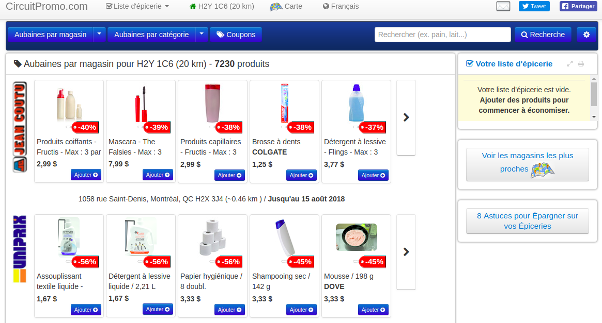

:author: Nadia Tahiri
:email: tahiri.nadia@courrier.uqam.ca
:institution: University of Quebec at Montreal
:corresponding:

:bibliography: scipy

-----------------------------------------------------------------------------------------------------
An intelligent shopping list based on the application of partitioning and machine learning algorithms
-----------------------------------------------------------------------------------------------------

.. class:: abstract
   
   A shopping list is an integral part of the shopping experience for many consumers. 
   Several mobile retail studies indicate that potential customers place the highest 
   priority on features that help them create and manage personalized shopping lists. 
   First, we propose to develop a new model of machine learning written in Python3.6 
   and plan to predict which grocery products the consumer in buy again or 
   will try to buy for the first time, and in which store(s) will the area he will shop. 
   Second, we will develop a smart shopping list template to provide consumers with a 
   personalized weekly shopping list based on their historical shopping history and 
   known preferences. As explanatory variables, we will use available grocery shopping histories, 
   store promotion information for the given region, as well as product price statistics.

.. class:: keywords

   machine learning, prediction, pandas, numpy, scipy, sklearn, tensorflow
   

Introduction
------------

A typical grocery retailer offers consumers thousands of promotions every week 
to attract more consumers and thus improve their economic performance (Tanusondjaja et al., 2016). 
Studies by Walters and Jamil (2002, 2003) found that about 39% of all items purchased 
during an inter-category grocery were specials of the week and about 30% of consumers 
surveyed were very sensitive to product prices, buying more promotional items than regular items. 
With the recent expansion of machine learning methods, including deep learning, 
it seems appropriate to develop a series of methods that allow retailers to offer consumers attractive 
and cost-effective shopping baskets, as well as to offer consumers tools 
to create smart personalized weekly shopping lists based on historical purchases, 
known preferences and specials available in local stores.

A shopping list is an integral part of the shopping experience for many consumers. 
Shopping lists serve, for example, as a reminder, a budgeting tool, 
or an effective way to organize weekly grocery shopping. 
In addition, several mobile retail studies indicate that potential customers place 
the highest priority on features that help them create and manage personalized 
shopping lists interactively (Newcomb et al., 2003, Fazliu 2017).

Methods
-------

By using the grocery shopping database in Canada MyGroceryTour.ca, 
we will first look for the partitioning of consumers into classes that will group 
them efficiently based on purchases made. 
This classification will then be used in the prediction stage. 
Since real consumer data contains thousands of individual articles, 
we focus primarily on categories of articles. 
The principal component analysis (linear and polynomial PCA) will first be performed to better visualize the initial data 
and to choose the number of main components to use when partitioning consumers into classes. 
The application of efficient partitioning methods, such as K-means and X-means, 
will make it possible to determine the number of classes of consumers, 
as well as their distribution by class.

Secondly, we will develop a statistical model to predict which products previously purchased will be 
in the next order of the consumer. By using explanatory variables, such as available grocery shopping histories, 
information on current promotions in stores in the given region, and commodity price statistics, 
we will develop a model of machine learning and able to:

(i) Predict which groceries the consumer will want to buy again 
or will try to buy for the first time, and in which store(s) in the area he will shop;
(ii) Create a smart shopping list by providing the consumer 
with a weekly shopping list customized based on their purchase history and known preferences. 
This list will also include recommendations regarding the optimal quantity of each product suggested and the store(s) 
where these products are to be purchased. We will also calculate the consumer's optimal weekly commute 
using the generalized commercial traveller algorithm.

The F1 statistics maximization algorithm (Ye et al., 2012), 
based on dynamic programming, will be used to meet the objective (i), 
which will be of major interest to retailers and distributors. 
A deep learning method (Goodfellow et al., 2016), based on recurrent neuron networks (RNN) 
and convolutional neuron network (CNN), and implemented in Google's TensorFlow tool (Dean et al., 2015), 
will be used to meet objective (ii), which will be of major interest to consumers.

The problem will be reformulated as a binary prediction task: given a consumer, 
the history of his previous purchases and a product with his price history, 
to predict whether or not the given product will be included in the grocery list of the consumer. 
Our approach will be to adapt a variety of generative models to existing data, i.e., 
first-level models, and to use the internal representations of 
these models as features of the second-level models. 
Recurrent neural networks and convolutional neural networks will be used at the first learning level 
and forward propagation neural networks (Feedforward NN) 
will be used at the second level of learning.

Table 1 summarizes top-level models used by our algorithm

.. raw:: latex

   \begin{table}

     \begin{longtable}{lcc}
     \hline
     \textbf{Representation} & \textbf{Description} & \textbf{Type}\tabularnewline
     \hline
     \textcolor{blue}{Products} & \textcolor{blue}{\begin{tabular}{@{}c@{}} Model P$(\text{product}_{i}\in \text{order}_{t+1})$\\ with orders$_{t-h,t}$, $h>0$.\end{tabular}}& \textcolor{blue}{\begin{tabular}{@{}c@{}}LSTM\\ (300 neurons)\end{tabular}} \\
     \hline
     Categories & Predicts P$(\exists i:\text{product}_{i,t+1} \in \text{category}_r)$. & \begin{tabular}{@{}c@{}}LSTM\\ (300 neurons)\end{tabular}\\
     \hline
     Size & Predict the size of the order$_{t+1}$. & \begin{tabular}{@{}c@{}}LSTM\\ (300 neurons)\end{tabular}\\
     \hline
     \textcolor{blue}{\begin{tabular}{@{}c@{}}Users \\ Products \end{tabular}} & \textcolor{blue}{Decomposed $V_{(u \times p)}=W_{(u \times d)}	H^T_{(p \times d)}$} & \textcolor{blue}{\begin{tabular}{@{}c@{}}Dense\\ (50 neurons)\end{tabular}}\\
     \hline
     \end{longtable}

     \caption{Top-level models used.}

   \end{table}

   
.. figure:: figures/mygrocerytour_circuit.png

   This figure shows circuit using generalized commercial traveller algorithm. the improvement over the course of this study in the DESI 
   spectral extraction throughput. :label:`circuit`
   

   This figure shows circuit using generalized commercial traveller algorithm. the improvement over the course of this study in the DESI 
   spectral extraction throughput. :label:`site`
   
.. figure:: figures/products_F1.png

   This figure shows circuit using generalized commercial traveller algorithm. the improvement over the course of this study in the DESI 
   spectral extraction throughput. :label:`site`
   
.. figure:: figures/order_frequency.png

   This figure shows circuit using generalized commercial traveller algorithm. the improvement over the course of this study in the DESI 
   spectral extraction throughput. :label:`site`
   
.. figure:: figures/product_pca.png

   This figure shows circuit using generalized commercial traveller algorithm. the improvement over the course of this study in the DESI 
   spectral extraction throughput. :label:`site`
   
.. figure:: figures/pearsonr.png

   This figure shows circuit using generalized commercial traveller algorithm. the improvement over the course of this study in the DESI 
   spectral extraction throughput. :label:`site`
   
.. figure:: figures/violon.png
   :align: center
   :scale: 20%
   :figclass: wt
 
   
Conclusions and Future Work
---------------------------

We analyzed grocery shopping data generated by the consumers of the site MyGroceryTour.ca.
We developed a new machine learning model to predict which grocery products the consumer will
buy and in which store(s) of the region he/she will do grocery shopping.
We created an intelligent shopping list based on the shopping history of consumer and his/her
known preferences.
The originality of our approach, compared to the existing algorithms, is that in addition to the
purchase history we also consider promotions, possible purchases in different stores and the
distance between these stores and the home of consumer.

Acknowledgments
---------------
The authors thank PyCon Canada for their valuable comments on this project. This work used
resources of the Calcul Canada. This work was supported by Natural Sciences 
and Engineering Research Council of Canada and Fonds de Recherche sur la Nature et Technologies of Quebec. 
The funds provided by these funding institutions have been used. 
We thank also reviewers and SciPy.

References
----------