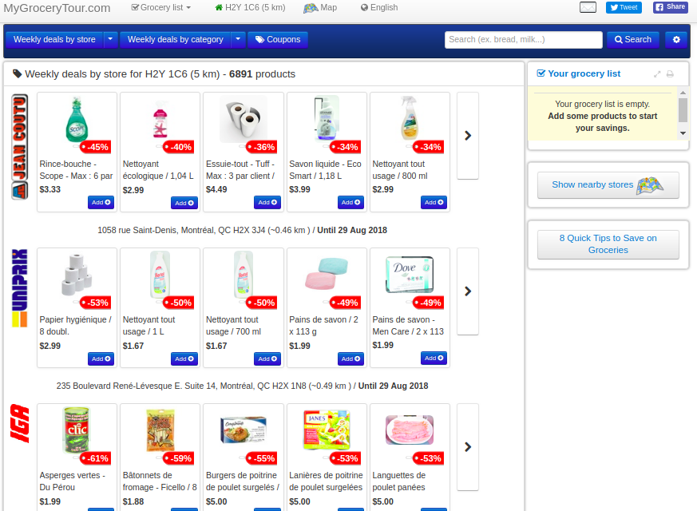
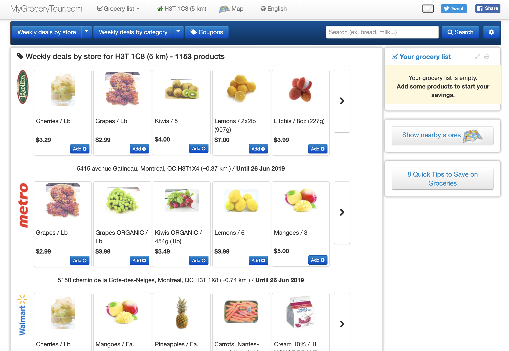
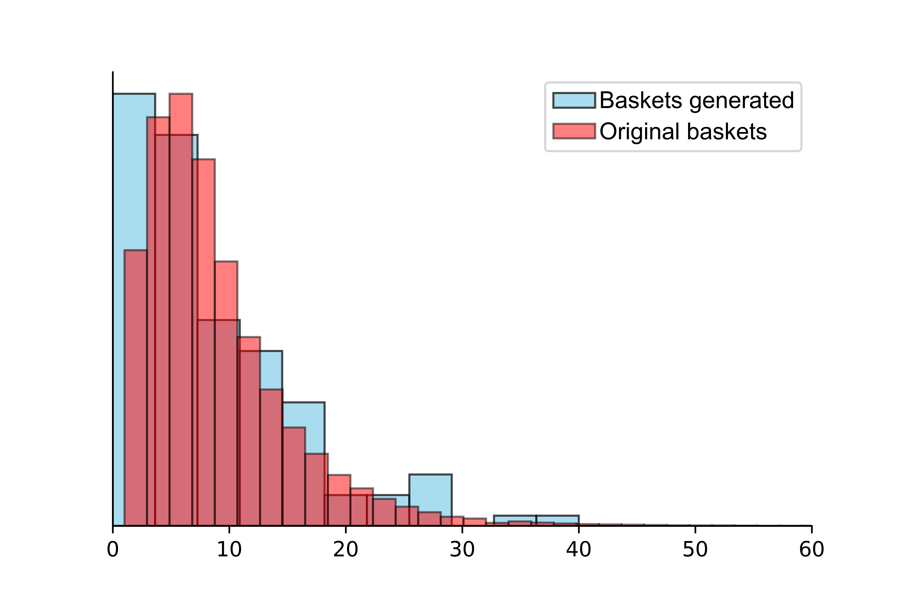
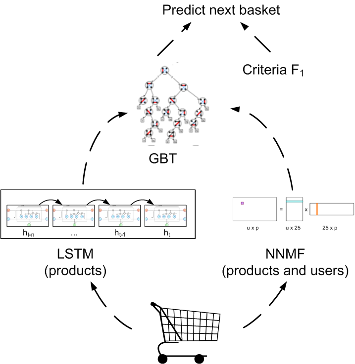
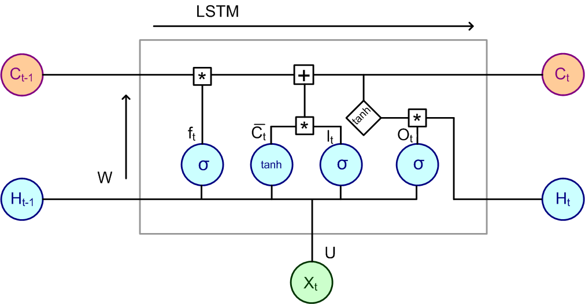
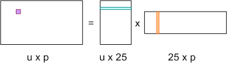
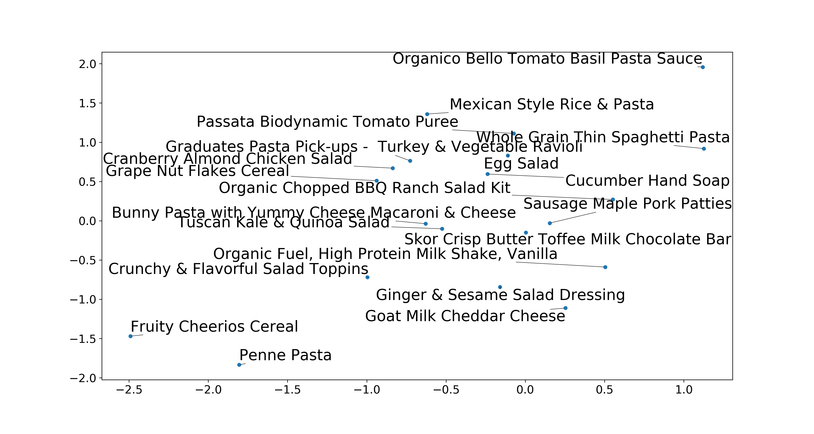
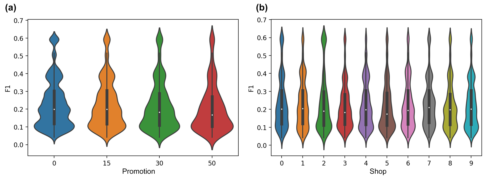
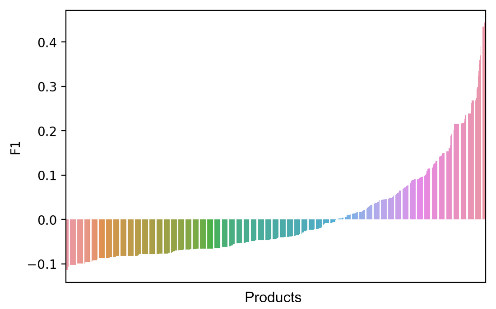

:author: Nadia Tahiri
:email: tahiri.nadia@courrier.uqam.ca
:institution: Département d’Informatique, Université du Québec à Montréal, Case postale 8888, Succursale Centre-ville, H3C 3P8 Montréal, Canada
:corresponding:

:author: Bogdan Mazoure
:email: bogdan.mazoure@mail.mcgill.ca
:institution: Montreal Institute for Learning Algorithms (MILA) and McGill University,Montréal, Canada

:author: Vladimir Makarenkov
:email: vladimir.makarenkov@uqam.ca
:institution: Département d’Informatique, Université du Québec à Montréal, Case postale 8888, Succursale Centre-ville, H3C 3P8 Montréal, Canada

-----------------------------------------------------------------------------------------------------
An intelligent shopping list based on the application of partitioning and machine learning algorithms
-----------------------------------------------------------------------------------------------------

.. class:: abstract
   
  A grocery list is an integral part of the shopping experience of many consumers. Several mobile retail studies of grocery apps indicate that potential customers place the highest priority on features that help them to create and manage personalized shopping lists. 
  First, we propose a new deep learning model implemented in Python 3 that predicts which grocery products the consumer will buy again or will try to buy for the first time, and in which store(s) the purchase will be made. 
  Second, we introduce a smart shopping template to provide consumers with a personalized weekly shopping list based on their shopping history and known preferences. 
  As the explanatory variables, we used available grocery shopping history, weekly product promotion information for a given region, as well as the product price statistics.

.. class:: keywords

   Machine Learning, Prediction, Long short-term memory, Convolutional Neural Network, Gradient Tree Boosting, :math:`F_1`, Python, Sklearn, Tensorflow

Introduction
------------

A typical grocery retailer offers consumers thousands of promotions every week        
to attract more consumers and thus improve its economic performance [TTR16]_.
The studies by Walters and Jamil (2002, 2003) ([WJ02]_ and [WJ03]_) report that about 39% of all items purchased
during a grocery shopping are weekly specials, and about 30% of consumers
surveyed are very sensitive to the product prices, buying more promotional items than regular ones. 
With the recent expansion of machine learning methods, including deep learning, 
it seems appropriate to develop a series of methods that allow retailers to offer consumers attractive 
and cost-effective shopping baskets, as well as to offer tools 
to create smart personalized weekly shopping lists based on the purchase history, known preferences, and weekly specials available in local stores.

A grocery list is an integral part of the shopping experience of many consumers. 
Such lists serve, for example, as a reminder, a budgeting tool, 
or an effective way to organize weekly grocery shopping. 
In addition, several mobile retail studies indicate that potential customers place the highest priority on features that help them to create and manage personalized shopping lists interactively [NPS03]_ and [SZA16]_.

Problem statement and proposal
------------------------------

In this section, we present the problem statement and describe the considered machine learning architecture.
First, by using a Canadian grocery shopping database `MyGroceryTour.ca` [#]_ (see Figure :ref:`MyGroceryTour`), 
we partitioned consumers into classes based on their purchase histories. 
Then, this classification was used at the prediction stage. 
Since the real consumer data contained thousands of individual articles, we regrouped the products by their categories. 
A principal component analysis (linear and polynomial PCA [Jol11]_) was first carried out to visualize the raw data  
and select the number of the main components to use when partitioning consumers into classes. 
The application of efficient partitioning methods, such as K-means [Jai10]_ and X-means [PM+00]_, 
allowed us to determine the number of classes of consumers, as well as their distribution by class.
We used the Calinski-Harabazs cluster validity index [CH74]_ to determine the number of cluster in K-means. 
The Silhouette index [RPJ87]_ could be also used for this purpose. 

   
   Screenshot of the MyGroceryTour.ca website for the postal code H3T 1C8 in Montreal. 
   The website has been created to test our new machine learning model. 
   It has been written in JavaScript, Bootstrap, and Python. :label:`MyGroceryTour` 

.. [#] MyGroceryTour.ca

Second, we developed a statistical model to predict which products previously purchased by a given consumer will be present 
in his/her next order. By using explanatory variables, such as available grocery shopping histories, 
information on the current promotions in stores of a given region, and commodity price statistics, 
we developed a machine learning model which is able to:

i. Predict which groceries the consumer will want to buy again or will try to buy for the first time, as well as in which store(s) (within the area they usually shop in) the purchase(s) will be made;
ii. Create a smart shopping list by providing the consumer with a weekly shopping list, customized based on his/her purchase history and known preferences. 

This list may also include recommendations regarding the optimal quantity of every product suggested.   
We also calculate the consumer's optimal weekly commute using the generalized travelling salesman algorithm (see Figure :ref:`circuit`).

   
   Screenshot of the MyGroceryTour.ca website displaying an optimal shopping journey calculated using the generalized travelling salesman algorithm. :label:`circuit`

An :math:`F_1` statistics maximization algorithm [NCLC12]_ (see the Statistics section), based on dynamic programming, was used to achieve the objective (i). 
This will be of major interest to retailers and distributors. 
A deep learning method [GBC16]_, based on Recurrent Neural Networks (RNN) 
and Convolutional Neural Network (CNN), both implemented using the TensorFlow library [HLYX18]_, 
was used to achieve the objective (ii). This can provide significant benefits to consumers.

Our prediction problem can be reformulated as a binary prediction task. Given a consumer, 
the history of his/her previous purchases and a product with its price history, 
predict whether or not this product will be included in the grocery list of the consumer. 
Our approach applies a generative model to process the existing data, i.e., 
first-level models, and then uses the internal representations of 
these models as features of the second-level models. 
RNNs and CNNs were used at the first learning level 
and forward propagation neural networks (Feed-forward NN) 
were used at the second learning level.

Thus, depending on the user's :math:`u` and the user's purchase history
(:math:`order_{t-h:t}`, :math:`h > 0`), we predict the probability that the product :math:`i` is included
in the current shopping basket :math:`order_{t+1}` of :math:`u`.

Dataset
-------

In this section, we discuss the details of our synthetic and real datasets,
the latter obtained from our website `MyGroceryTour.ca`.

Features
========

All features used in our study are presented below:

- **user\_id**: the user ID. We anonymized all data used in our study. :math:`user\_id \in \underbrace{\{1 \cdots 374\}}_{\text{reals}} \cup \underbrace{\{375 \cdots 1,374\}}_{\text{generated}}`
- **order\_id**: unique number of the basket. :math:`order\_id \in \mathbb{Z}`
- **store\_id**: unique number of the store. :math:`store\_id \in \{1 \cdots 10\}` 
- **distance**: distance to the store. :math:`distance \in \mathbb{R}^+`
- **product\_id**: unique number of the product. :math:`product\_id = 49,684`. We tested our model with 1,000 products only (out of 49,684 products), which belonged to 5 out of the 24 available categories, i.e., `Fruits-Vegetables`, `Pasta-Flour`, `Organic Food`, `Beverages`, and `Breakfast`; the rest of the categories were not considered in our tests.
- **category\_id**: unique category number for a product. :math:`category\_id \in \{1 \cdots 24\}`  
- **reorder**: the reorder was equal to 1 if the product has been ordered by this user in the past, 0 else. :math:`reorders \in \{0,1\}`
- **special**: discount percentage, by interval, applied to the product price at the time of purchase. :math:`special \in \{[0\%,15\%[, [15\%,30\%[, [30\%,50\%[, [50\%,100\%[\}`

In total, we processed the data of 1374 users (i.e., consumers). Among them, we had 374 real users and 1000 users whose behaviour was generated following the distribution of real users (see Figure 3) and 
the consumer statistics available in the report by Statistics Canada (2017). The product categories were available for each product. 
So, the product category was one of the explanatory variables used in the model. 
In total, we considered 5 (of 24) product categories. 
The current version of our model does not allow a new product to be bought by the user (i.e., every user can only buy products that were present in at least one of its previous shopping baskets). 
We only considered real users having a sufficient number of previous shopping baskets available (>50 baskets). 
The average basket size was also used to predict the content of the current basket size for each user.

Two types of features, categorical and quantitative variables, were present in our data.
Only the `distance` and `special` features were quantitative variables, the rest of them were categorical.
To handle the categorical variables, we applied a hashing scheme to deal 
with large scale categorical features.
We used the `LabelEncoder` function of the `scikit-learn` package of Python (version 3).

Consumer profile
================

According to a Statistics Canada report(2017) there exist 3 consumer profiles (see [WJ03]_, [WJ02]_, and [TNTK16]_). 
The first profile represents the consumers who buy only promotional items.
The second profile represents the consumers who always buy the same products (without considering promotions).
Finally, the third profile represents the consumers who buy different products whether they are in special or not.
On our model, we consider this information and make the prediction more personalized with respect to the consumer’s profile.

Data Synthesis
==============

Since the real dataset was not large enough to apply an appropriate deep learning model, its size was increased by adding simulated data following the distribution of real ones.
The original dataset was composed of 374 users. It may be not enough to apply an appropriate machine learning method, and 1000 simulated users were added to our dataset.
Thus, 72.7% of our data were simulated (i.e., 1000 out of 1374 user histories were simulated).
Here, we describe the simulated part of our dataset, 
and present in detail the results of the simulation step.
For :math:`store\_id`, we started with an initial store and changed stores based on the proportion of common products between baskets.
If we assume that the store coordinates are normally and independently distributed :math:`\mathcal{N}(0,\sigma^2)`, 
the distance between this store and the consumer home located at the origin :math:`(0,0)` follows a Rayleigh distribution [KR05]_ with the :math:`\sigma` parameter.
Finally, we increased the value of the `special` random variable. Its value has been drawn from a Boltzmann distribution [AAR+18]_.
We made sure that the generated baskets followed the same distribution that the original basket in terms of the basket size
(see Figure :ref:`orderfrequency`).

 
   Difference in the basket size distribution between **Baskets generated** in blue and **Original baskets** in red.  :label:`orderfrequency`

Preprocessing dataset
=====================

Initially, the data were saved in CSV files and stored in a MySQL database, taking 1.4 GB of disk space. Then, the data were organized in a dataframe and processed using our Python script.
We launched the preprocessing data tasks on the servers of Compute Canada. This step was carried out using 172 nodes 
and 40 cores with an Intel Gold 6148 Skylake CPU(2.4 GHz), and  NVidia V100SXM2(16 GB of memory). We preprocessed the user data, 
the product data, and the department data. The preprocessing had a 48 hour limit and used 32 GB of RAM memory.

Models
------

In this section, we present the workflow (see Figure :ref:`workflow`) and the models being used.
The graphical representation of the workflow allowing one to predict the current consumer’s basket using the three following models: LSTM, NNMF, and GBT shown here (see also the next section).

   
   The graphical illustration of the proposed model intended to predict the content of the current grocery basket. 
   At the first level of the model the LSTM and NNMF networks were used. 
   At the second level of the model, the GBT model was applied. 
   Finally, at the last step we predicted the current grocery basket content using :math:`F_1`. 
   :label:`workflow`

Long short-term memory (LSTM) network
=====================================

The LSTM [HS97]_ is a recurrent neural network (RNN) that has an input, a hidden memory block, and an output layer. 
The memory block contains 3 gate units, namely the input, forget, 
and output with a self-recurrent connection neuron [HS97]_.

- **Input gate** learns what information should be stored in the memory block.
- **Forget gate** learns how much information from the memory block should be retained or forgotten.
- **Output gate** learns when the stored information can be used.

Figure :ref:`lstm` illustrates the proposed architecture and summarizes the details of our network model. 

A combined RNN and CNN network was trained to predict the probability that a given user will order a given product at each timestep.
A timestep was defined by the composition of the basket and the store location on the map (see Figure 2). 
Here, RNN was a single-layer LSTM and CNN was a 6-layer causal CNN with dilated convolutions.
The width of the CNN was equal to 1374 (i.e., the number of users), the height was equal to 8 (i.e., the number of features), and the depth was equal to 100 (i.e., the number of orders).
The last layer was a fully-connected layer which was making the final classification.
The CNN network was used as a feature extractor and the LSTM network as a sequential learner.

  
   This figure shows a chain-structured LSTM network. An LSTM architecture contains the forget, learn, remember, and uses gates that determine the importance of the input data.
   In the LSTM unit represented in this figure, there are four different functions: sigmoid (:math:`\sigma`), hyperbolic tangent (:math:`tanh`), multiplication (:math:`*`), and sum (:math:`+`),
   making it easier to update the weights during the backpropagation process. Here :math:`X_{t}` denotes the input vector, :math:`H_{t-1}` is the previous cell output, :math:`C_{t-1}` is the previous cell memory, 
   :math:`H_{t}` is the current cell output, :math:`C_{t}` is the current cell memory,
   :math:`f_t` is the forget gate with sigmoid function :math:`sigma`, :math:`\overline{C_t}` and :math:`I_t` corresponds to the input gate with `tanh` function, and finally :math:`O_t` is the output gate with :math:`sigma` function.
   :label:`lstm`

Overall characteristics of the neural networks used in our work are as follow:

.. code-block:: python

    nn = rnn(
     reader=dr,
     log_dir=os.path.join(base_dir, 
                          'logs'),
     checkpoint_dir=os.path.join(base_dir, 
                                'checkpoints'),
     prediction_dir=os.path.join(base_dir, 
                                'predictions'),
     optimizer='adam',
     learning_rate=.001,
     lstm_size=512,
     batch_size=64,
     num_training_steps=300,
     early_stopping_steps=10,
     warm_start_init_step=0,
     regularization_constant=0.0,
     keep_prob=1.0,
     enable_parameter_averaging=False,
     num_restarts=2,
     min_steps_to_checkpoint=100,
     log_interval=20,
     num_validation_batches=4,
    )

We considered the `Adam` optimizer, which is a good default implementation of gradient descent. 
The learning rate was equal to 0.001 to control how long the weights should be updated in response to the estimated gradient at the end of each batch. 
The size of the hidden state of an LSTM unit was fixed to 512.
Batch size corresponds to the number of samples between updates of the model weights. It was set to 64 during the training process. Also, we set to 4 the number of validation batches.
The Tensorflow package was used to implement our `rnn` class that account for the features described in the previous section.
The `rnn` class structure was organized using the four following functions: 1) constructor function, 2) loss score function calculation, 3) getter function, and 4) output score function.

.. code-block:: python

     import TFBaseModel

     class rnn(TFBaseModel):
       def __init__(self, 
                    lstm_size,
                    dilations, 
                    filter_widths, 
                    skip_channels, 
                    residual_channels, 
                    **kwargs):
          ...
       def calculate_loss(self):
          ...
       def get_input_sequences(self):
          ...
       def calculate_outputs(self, x):
         ...

Non-negative matrix factorization (NNMF) network
================================================

Non-negative matrix factorization NNMF [LS01]_ is a series of algorithms in multivariate analysis and linear algebra in which a matrix X is factorized into two matrices W and H having the property that all three matrices have no negative elements. 
This non-negativity makes the resulting matrices easier to utilize.
We factorize the matrix :math:`X` (i.e., matrix of `user\_id` by `product\_id`) into two matrices :math:`W`
(i.e., `user\_id`) and :math:`H` (i.e., `product\_id`), so that the matrix representation can be formulated as: 
:math:`X \approx WH` (see Figure :ref:`nnmf`).

    Decomposition of the `user_id` (`u` in Figure) by `product_id` (`p` in Figure). The first matrix accounts for the products purchased by the user (i.e., order count), 
    whereas the second and the third matrices account for the representations of the user and the product, respectively.
    :label:`nnmf`

NNMF is a powerful machine learning method. It has been proved that NNMF converge to at least a locally optimal solution [LS01]_. In our study, NNMF was trained on the matrix of the :math:`user \times product` counts.

Gradient Boosted Tree (GBT) network
===================================

GBT [Fri02]_ is an iterative algorithm that combines simple parameterized functions with low performance 
(i.e., high prediction error) to produce a highly accurate prediction rule. GBT utilizes an ensemble of weak
learners to boost performance; this makes it a good candidate model for predicting the grocery shopping list. 
It requires little data preprocessing and tuning of parameters, while yielding interpretable results, 
with the help of partial dependency plots and other investigation tools. 
Further, GBT can be used to model complex interactions to get a simple recommendation system and be applied in both classification and 
regression with a variety of response distributions, including Gaussian [Car03]_, Bernoulli [CMW16]_, Poisson [PJ73]_, and Laplace [Tay19]_.
The real shopping history lists were not always complete, but missing values in the collected data can be easily managed by applying variable imputation methods.

The data were divided into two groups (training and validation sets), which comprised 90% and 10% of the data, respectively.
The strategy used was to merge real and simulated data and then split them into two groups (training and validation sets). 
The test set was composed of both real and simulated data.
The final model included two neural networks and a GBT classifier.
Once trained, it was used to predict in "real time" the content of the current grocery basket, based on the history of purchases and the current promotions in the neighbouring stores.
Here, the "real time" does not mean "second-by-second", but rather "day-by-day". We scheduled it using the crontab tool. 
Based on the validation loss function, we removed the following parameters from our input data: 1) LSTM category and 2) LSTM size of the next basket.

The last layer included a GTB classifier used to predict the products that will be purchased during the current week. 
The GBT model was modelled using "by user" and "by order" frameworks.
The classifier applied contained two classes: 0 (i.e., the product will be bought) and 1 (i.e., the product won’t be bought).

First level model (feature extraction)
======================================

Our goal was to find a diverse set of representations using neural networks (see Table 1). 
Table 1 summarizes the top-level models used by the algorithm. We described each type of model used for every representation (e.g., `Products`, `Category`, `Size of the basket`, and `Users`).
We estimated the probability of the :math:`product_i` to be included into 
the next basket :math:`order_{t+1}` with :math:`orders_{t-h}`, 
where :math:`t` represents the current time, 
:math:`t+1` represents the next time,
and :math:`t-h` represents all previous time periods (i.e., time history).
We decomposed the matrix {user :math:`times` product} into two matrices, one corresponding to the user and another to the product, and calculated the probability to have the :math:`product_i` in the next :math:`order_{t+1}`, taking into account
the purchase history of the current user. We used an LSTM network with 300 neurons.
Finally, we optimized the size of the next order by minimizing the root mean square error (RMSE).

.. raw:: latex

   \begin{table}

     \begin{longtable}{lcc}
     \hline
     \textbf{Representation} & \textbf{Description} & \textbf{Type}\tabularnewline
     \hline
     \textcolor{blue}{Products} & \textcolor{blue}{\begin{tabular}{@{}c@{}} Predict P$(\text{product}_{i}\in \text{order}_{t+1})$\\ with orders$_{t-h,t}$, $h>0$.\end{tabular}}& \textcolor{blue}{\begin{tabular}{@{}c@{}}LSTM\\ (300 neurons)\end{tabular}} \\
     \hline
     Categories & Predict P$(\exists i:\text{product}_{i,t+1} \in \text{category}_r)$. & \begin{tabular}{@{}c@{}}LSTM\\ (300 neurons)\end{tabular}\\
     \hline
     Size & Predict the size of the order$_{t+1}$. & \begin{tabular}{@{}c@{}}LSTM\\ (300 neurons)\end{tabular}\\
     \hline
     \textcolor{blue}{\begin{tabular}{@{}c@{}}Users \\ Products \end{tabular}} & \textcolor{blue}{Decomposed $V_{(u \times p)}=W_{(u \times d)} H^T_{(p \times d)}$} & \textcolor{blue}{\begin{tabular}{@{}c@{}}Dense\\ (50 neurons)\end{tabular}}\\
     \hline
     \end{longtable}

     \caption{Top-level models used. Here, we report the representation, the description, the type of products, the categories, the size of baskets, and the matrix users/products.}
         \label{tab:model1}

   \end{table}

Latent representations of entities (embeddings)
===============================================

For each :math:`a \in \mathcal{A}`, an embedding :math:`T:\mathcal{A} \rightarrow \mathbb{R}^{d}` returns a vector :math:`d`-dimensionel.
If :math:`\mathcal{A} \subset \mathbb{Z}`, :math:`T` is a matrix :math:`|\mathcal{A}|\times d` learned by backpropagation. We represented in Table 2 all dimensions of each model used.

.. raw:: latex

    \begin{table}
        
        \begin{longtable}{lcc}
        \hline
        \textbf{Model} & \textbf{Embedding} & \textbf{Dimensions}\tabularnewline
        \hline
        LSTM Products & Products & $49,684 \times 300$\\
        \hline
        LSTM Products & Categories & $24 \times 50$\\
        \hline
        LSTM Products & Categories & $50 \rightarrow 10$\\
        \hline
        LSTM Products & Users & $1,374 \times 300$\\
        \hline
        NNMF & Users & $1,374 \times 25$\\
        \hline
        NNMF & Products & $49,684 \times 25$\\
        \hline        
        \end{longtable}

        \caption{Dimensions of the representations learned by different models at the first level of the model.}
        \label{tab:model2}

    \end{table}

Second level model: Composition of baskets
==========================================

The resulting basket was chosen according to the final reorganization probabilities, selecting the subset of products with the expected maximum :math:`F_1` score, see [LEN14]_ and [NCLC12]_.
This score is frequently used when the relevant elements are scarce:

.. math::
   
   \max_\mathcal{P} \mathbb{E}_{p'\in \mathcal{P}}[F_1(\mathcal{P})]=\max_\mathcal{P}\mathbb{E}_{p'\in \mathcal{P}}\bigg[\frac{2\sum_{i\in \mathcal{P}}\text{TP}(i)}{\sum_{i\in \mathcal{P}}(2\text{VP}(i)+\text{FN}(i)+\text{FP}(i))}\bigg],

where True Positive :math:`(TP)=\mathbb{I}[\lfloor p(i)\rceil=1]\mathbb{I}[R_i=1]`, False Negative :math:`(FN)=\mathbb{I}[\lfloor p(i)\rceil=0]\mathbb{I}[R_i=1]`, False Positive :math:`(FP)=\mathbb{I}[\lfloor p(i)\rceil=1]\mathbb{I}[R_i=0]` and :math:`R_i=1` if the product :math:`i` was bought in the basket :math:`p'\in \mathcal{P}`, else :math:`0`.\\
We used :math:`\mathbb{E}_{X}[F_1(Y)]=\sum_{x\in X}F_1(Y=y|x)P(X=x)`.

Statistics
----------

Here, we present the results obtained using our new model. 
The *F-measure* (see Equation 1) metric was used to evaluate the performance of the model.

Statistical score
=================

*F-measure*, or :math:`F_1`, is a well-known and reliable evaluation statistic (see [JOA05]_).
The :math:`F_1` value of 1 means perfect accuracy.

.. math::
   :label: e:matrix
   
   F-measure = F1 = \frac{2 \times Precision \times Recall}{(Precision + Recall)}.

Python Script
-------------

The final reorder probabilities were computed as the weighted average of the outputs from the second-level models. The final basket was chosen by using these probabilities and selecting the product subset with a maximum expected F1-score.
In our implementation, we used `f1_optimizer` implemented in the `F1Optimizer` package. The implementation of [NCLC12]_ is available in [F1Optimizer]_.
The select_products function in the Python script was the following:

.. code-block:: python
    :linenos:
    
    from f1_optimizer import F1Optimizer

    def select_products(x):
     series = pd.Series()

     for prod in x['product_id'][x['label'] > 0.5:
       if prod != 0:
        true_products = [str(prod)].values]
       else:
        true_products = ['None'].values]

     if true_products:
      true_products = ' '.join(true_products)
     else:
      true_products = 'None'

     prod_preds_dict = dict(zip(x['product_id'].values,
                                x['prediction'].values))
     none_prob = prod_preds_dict.get(0, None)
     del prod_preds_dict[0]

     other_products = np.array(prod_preds_dict.keys())
     other_probs = np.array(prod_preds_dict.values())

     idx = np.argsort(-1*other_probs)
     other_products = other_products[idx]
     other_probs = other_probs[idx]

     opt = F1Optimizer.max_expectation(other_probs,
                                       none_prob)

     best_prediction = ['None'] if opt[1] else []
     best_prediction += list(other_products[:opt[0]])

     if best_prediction:
      predicted_products = ' '.join(map(str, 
                                    best_prediction))
     else:
      predicted_products = 'None'

     series['products'] = predicted_products
     series['true_products'] = true_products

     return true_products, predicted_products, opt[-1]

Results
-------

Figure :ref:`productpca` illustrates PCA of 20 random products projected into two dimensions.
These results indicate the presence of the cluster of products, including the Pasta sauce and Pasta group articles.
They can help identify the consumer buying behaviour (see Table 2).

   
   Embeddings of 20 random products projected into 2 dimensions. :label:`productpca`

They show that some products are frequently bought together with the other products. 
Such a clustering was not used explicitly in our model, but a good artificial network model is supposed to capture and take it into account implicitly in order to provide a better prediction.
The distribution of :math:`F_1` in Figure :ref:`violon` (a) indicates that the profiles of all promotions are similar. 
In the perspective, it would be interesting to include in our model the product weight based on some additional available statistics. 
For example, according to Statistics Canada - 2017, only 5% of all specials had a rebate of 50% and larger, whereas 95% of them had a smaller rebate. The use of such weights could make the model more robust. 

Figure :ref:`violon` (b) indicates that all stores follow similar profiles in our model. 
This plot presents the distribution of the F1-score results with respect to the promotions and stores. 
We can observe that the distributions of the promotions and stores are very similar. 
Finally, this plot suggests the absence of the bias for these two model parameters.
Figure :ref:`productsF1` and Table 3 report the values of the :math:`F_1` metric for the products whose inclusion into the consumer’s basket was either very easy or very hard to predict. 
Table 3 presents only the products with the five highest and the five lowest values of :math:`F_1` (the average, in this case, was taken over all users who purchased these products). 
The group of products, which were easy to predict, includes the articles of restriction regimes 
such as `diet cranberry fruit juice`, `purified water`, and `total 0% blueberry acai greek yogurt`.

   
   Distribution of the :math:`F_1` scores for the features rebates (a) and stores (b). :label:`violon`

.. raw:: latex
    
    \begin{table}

        \begin{longtable}{lc}
        \hline
        \textbf{Product} & \textbf{$F_1$} \\
        \hline
    Gogo Squeez Organic Apple Strawberry Applesauce &  0.042057 \\
            Organic AppleBerry Applesauce on the Go &  0.042057 \\
                           Carrot And Celery Sticks &  0.042057 \\
             Gluten Free Peanut Butter Berry  Chewy &  0.042057 \\
                   Organic Italian Balsamic Vinegar &  0.049325 \\ 
        \hline
                         Diet Cranberry Fruit Juice &  0.599472 \\
                                     Purified Water &  0.599472 \\
     Vanilla Chocolate Peanut Butter Ice Cream Bars &  0.599472 \\
  Total 0\% with Honey Nonfat Greek Strained Yogurt &  0.590824 \\
              Total 0\% Blueberry Acai Greek Yogurt &  0.590824 \\
        \hline
        \end{longtable}
        \caption{The products with five lowest and five highest values of $F_1$ are reported.}
    \end{table}   

   
   Distribution of the :math:`F_1` scores relative to the products around average. :label:`productsF1`

.. raw:: latex
    
    \begin{table}

        \begin{longtable}{|l|c|}
        \hline
           \textbf{Product} &  \textbf{Number of baskets} \\
        \hline
                     Banana &   6138 \\
               Strawberries &   3663 \\
       Organic Baby Spinach &   1683 \\
                      Limes &   1485 \\
                 Cantaloupe &   1089 \\
              Bing Cherries &    891 \\
         Small Hass Avocado &    891 \\
         Organic Whole Milk &    891 \\
                Large Lemon &    792 \\
 Sparkling Water Grapefruit &    792 \\
        \hline
        \end{longtable}
        \caption{The 10 most popular products included in the predicted baskets. The top products were taken from a subset comprising 2\% of all available products.}
  \end{table}

.. figure:: figures/pearsonr.png
   :align: center
   :figclass: wt
   :scale: 3%

   Distribution of the :math:`F_1` scores with respect to the consumers (a) and products(b). :label:`pearsonr`

In addition, Figure 10 presents the distribution of :math:`F_1` with respect to the consumers and products.
We also evaluated the prediction quality of our model using the `sklearn` metrics (see below):

.. code-block:: python

   from sklearn.metrics import make_scorer, 
                               accuracy_score, 
                               f1_score, 
                               recall_score
  
The results reported in Table 5 suggest that a better model accuracy was obtained when the original dataset of 374 real users was enriched by 1,000 artificial users. The accuracy of 49% was obtained for the augmented dataset, compared to the accuracy of 27% for the original dataset. 

.. raw:: latex
    
    \begin{table}

        \begin{longtable}{lccc}
        \hline
        \textbf{Statistics} & \textbf{Real} & \textbf{Real and augmented} \\
        \textbf{score} & \textbf{data} & \textbf{data} \\

        \hline
            Accuracy & 0.27 & 0.49\\
            Precision & 0.27 & 0.49\\
            Recall & 0.51 & 0.7\\
            F-measure & 0.22 & 0.37\\
        \hline
        \end{longtable}
        \caption{Statistical scores results obtained for real data, and for real + artificial augmented data.}
  \end{table}

Conclusion and future work
---------------------------

We analyzed grocery shopping data generated by the users of the site `MyGroceryTour.ca`.
We developed a new deep learning model to predict which grocery products the consumer will
buy and in which store(s) of the region he/she will do grocery shopping.
We created an intelligent shopping list based on the shopping history of each consumer and his/her known shopping preferences.
The originality of our approach, compared to the existing methods, is that in addition to the purchase history, we also considered the promotions available, possible purchases in different stores, and the distance between these stores and the consumer’s home.

We have modelled the habits of the *MyGroceryTour.ca* site consumers using deep neural networks.
Two types of neural networks were applied at the learning stage: Recurrent neural networks (RNN) and Forward-propagating neural networks (Feedforward NN).
The value of the :math:`F_1` statistic accounting for the quality of the model could be increased in the future by considering additional explanatory features and product weights. The constant influx of new data on *MyGroceryTour.ca*
will allow us to improve the model’s results. 

In the future, we plan to predict the grocery store that will be visited next, and include the recommended product quantities for the basket proposed to the user. 

Acknowledgments
---------------

The authors thank the members of PyCon Canada for their valuable comments on this project. 
We also thank the SciPy conference members, Dillon Niederhut, David Shupe, Chris Calloway, as well as anonymous reviewers for their valuable comments on this manuscript. 
This work used resources of Compute Canada, and was supported by Natural Sciences and Engineering Research Council of Canada and Fonds de Recherche sur la Nature et Technologies of Quebec.

Abbreviations
-------------

- CNN - Convolutional Neural Network
- GBT  - Gradient Tree Boosting
- LSTM - Long Short-Term Memory
- ML - Machine Learning
- NN - Neural Networks
- NNMF - Non-Negative Matrix Factorization
- PCA - Principal Component Analysis
- RMSE - Root Mean Square Error
- RNN - Recurrent Neural Networks

References
----------

.. [AAR+18] Amin, Mohammad H., Evgeny Andriyash, Jason Rolfe, Bohdan Kulchytskyy, and Roger Melko. 
            *Quantum boltzmann machine*.
            Physical Review X, 8(2):021050, 2018.
            DOI: https://doi.org/10.1103/PhysRevX.8.021050
.. [Car03] Rasmussen, Carl Edward. *Gaussian processes in machine learning*.
           In Summer School on Machine Learning, pp. 63:71. Springer, Berlin, Heidelberg, 2003.
           DOI: https://doi.org/10.1007/978-3-540-28650-9_4 
.. [CH74] Caliński, T. and Harabasz, J., 1974. *A dendrite method for cluster analysis*. 
          Communications in Statistics-theory and Methods, 3(1), pp.1-27.
          DOI: https://doi.org/10.1080/03610917408548446
.. [CMW16] Maddison, Chris J., Andriy Mnih, and Yee Whye Teh. 
           *The concrete distribution: A continuous relaxation of discrete random variables*. 
           arXiv preprint arXiv:1611.00712, 2016.
           https://arxiv.org/pdf/1611.00712.pdf 
.. [F1Optimizer] Kaggle post, *F1-Score Expectation Maximization in O(n²)*, 2017.
           https://www.kaggle.com/mmueller/f1-score-expectation-maximization-in-o-n
.. [Fri02] Jerome H. Friedman. *Stochastic gradient boosting*. Computational
           Statistics & Data Analysis, 38(4):367–378, 2002.
           DOI: https://doi.org/10.1016/S0167-9473(01)00065-2
.. [GBC16] Ian Goodfellow, Yoshua Bengio, and Aaron Courville. *Deep
           learning*. MIT press, 2016.
.. [HLYX18] Hao, L., Liang, S., Ye, J. and Xu, Z., 2018. 
           *TensorD: A tensor decomposition library in TensorFlow*. 
           Neurocomputing, 318, pp. 196-200.
           DOI: https://doi.org/10.1016/j.neucom.2018.08.055
.. [HS97] Sepp Hochreiter and Jurgen Schmidhuber. *Long short-term memory*.
          Neural computation, 9(8):1735–1780, 1997.
          DOI: https://doi.org/10.1162/neco.1997.9.8.1735 
.. [Jai10] Anil K Jain. *Data clustering: 50 years beyond k-means*. Pattern
           recognition letters, 31(8):651–666, 2010.
           DOI: https://doi.org/10.1016/j.patrec.2009.09.011 
.. [JOA05] Joachims, T., 2005. *A support vector method for multivariate performance measures*. 
           In Proceedings of the 22nd international conference on Machine learning (pp. 377-384). ACM.
           DOI: https://dl.acm.org/citation.cfm?doid=1102351.1102399
.. [Jol11] Ian Jolliffe. *Principal component analysis*. Springer, 2011.
           DOI: https://doi.org/10.1007/978-3-642-04898-2_455 
.. [KR05] Debasis Kundu and Mohammad Z Raqab. *Generalized rayleigh
          distribution: different methods of estimations*. Computational
          statistics & data analysis, 49(1):187–200, 2005.
          DOI: https://doi.org/10.1016/j.csda.2004.05.008 
.. [LEN14] Zachary C Lipton, Charles Elkan, and Balakrishnan
           Naryanaswamy. *Optimal thresholding of classifiers to maximize
           f1 measure*. In Joint European Conference on Machine Learning
           and Knowledge Discovery in Databases, pp. 225–239. Springer,
           2014.
           DOI: https://doi.org/10.1007/978-3-662-44851-9_15
.. [LS01] Lee, D.D. and Seung, H.S. *Algorithms for non-negative matrix factorization*. 
          In Advances in neural information processing systems, pp. 556-562, 2001.
.. [NCLC12] Ye Nan, Kian Ming Chai, Wee Sun Lee, and Hai Leong Chieu.
            *Optimizing f-measure: A tale of two approaches*. arXiv preprint
            arXiv:1206.4625, 2012.
            https://arxiv.org/ftp/arxiv/papers/1206/1206.4625.pdf
.. [NPS03] Erica Newcomb, Toni Pashley, and John Stasko. *Mobile computing
           in the retail arena*. In Proceedings of the SIGCHI Conference
           on Human Factors in Computing Systems, pp. 337–344. ACM,
           2003.
           DOI: https://doi.org/10.1145/642667.642670 
.. [PJ73] Consul, Prem C., and Gaurav C. Jain. 
          *A generalization of the Poisson distribution*. 
          Technometrics 15(4):791-799, (1973).
.. [PM+00] Dan Pelleg, Andrew W Moore, et al. *X-means: extending kmeans
           with efficient estimation of the number of clusters*. In Icml,
           volume 1, pp. 727–734, 2000.
.. [RPJ87] Rousseeuw, P.J., 1987. *Silhouettes: a graphical aid to the interpretation and validation of cluster analysis*. 
           Journal of computational and applied mathematics, 20, pp.53-65. 
           DOI: https://doi.org/10.1016/0377-0427(87)90125-7
.. [SZA16] Szpiro, S., Zhao, Y. and Azenkot, S. 
           *Finding a store, searching for a product: a study of daily challenges of low vision people*. 
           In Proceedings of the 2016 ACM International Joint Conference on Pervasive and Ubiquitous Computing,
           pp. 61-72. ACM, 2016.
           DOI: https://doi.org/10.1145/2971648.2971723	   
.. [Tay19] Taylor, James W. *Forecasting value at risk and expected shortfall using a 
           semiparametric approach based on the asymmetric Laplace distribution*.
           Journal of Business & Economic Statistics 37(1):121-133, 2019.
           DOI: https://doi.org/10.1080/07350015.2017.1281815
.. [TNTK16] Arry Tanusondjaja, Magda Nenycz-Thiel, and Rachel Kennedy.
            *Understanding shopper transaction data: how to identify crosscategory
            purchasing patterns using the duplication coefficient*.
            International Journal of Market Research, 58(3):401–419, 2016.
            DOI: https://doi.org/10.2501/ijmr-2016-026 
.. [TTR16] Arry Tanusondjaja, Giang Trinh, and Jenni Romaniuk. *Exploring
           the past behaviour of new brand buyers*. International Journal of
           Market Research, 58(5):733–747, 2016.
           DOI: https://doi.org/10.2501/ijmr-2016-042 
.. [WJ02] Rockney Walters and Maqbul Jamil. *Measuring cross-category
          specials purchasing: theory, empirical results, and implications*.
          Journal of Market-Focused Management, 5(1):25–42, 2002.
.. [WJ03] Rockney G Walters and Maqbul Jamil. *Exploring the relationships
          between shopping trip type, purchases of products on promotion,
          and shopping basket profit*. 
          Journal of Business Research, 56(1):17–29, 2003.
          DOI: https://doi.org/10.1016/s0148-2963(01)00201-6
    
