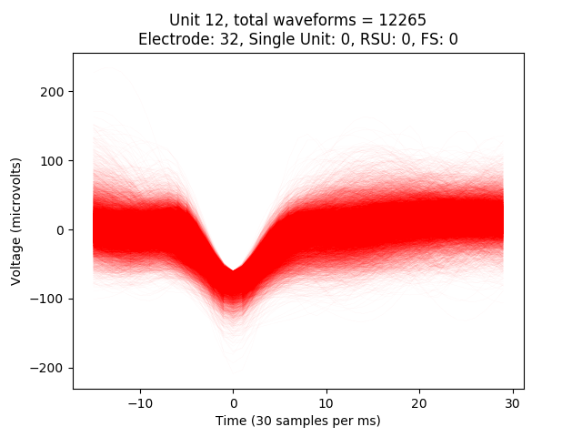
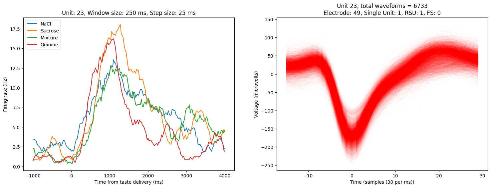
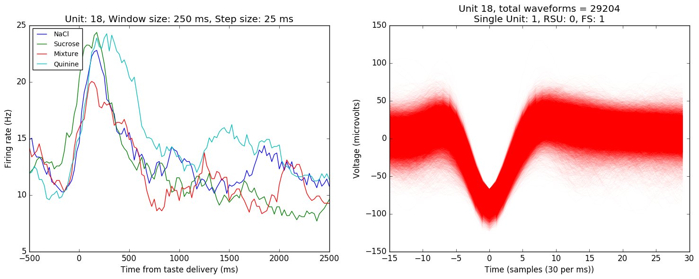

:author: Narendra Mukherjee
:email: narendra@brandeis.edu
:institution: Graduate Program in Neuroscience, Brandeis University, Waltham, MA, USA
:corresponding:

:author: Donald B Katz
:email: dbkatz@brandeis.edu
:institution: Department of Psychology, Brandeis University, Waltham, MA, USA
:institution: Volen National Center for Complex Systems, Brandeis University, Waltham, MA, USA

:author: Joseph Wachutka
:email: wachutka@brandeis.edu
:institution: Graduate Program in Neuroscience, Brandeis University, Waltham, MA, USA
:bibliography: mybib

:video: https://github.com/narendramukherjee/blech_clust

--------------------------------------------------------------------------------------------------------------------
Python meets systems neuroscience: affordable, scalable and open-source electrophysiology in awake, behaving rodents
--------------------------------------------------------------------------------------------------------------------

.. class:: abstract

In-vivo electrophysiology, the recording of neurons in the brains of awake, behaving animals, is currently undergoing paradigm shifts. There is a push towards moving to open-source technologies that can: 1) be adjusted to specific experiments; 2) be shared with ease; and 3) more affordably record from larger numbers of electrodes simultaneously. Here we describe our construction of a system that satisfies these three desirable properties using the scientific Python stack and Linux. Using a Raspberry Pi to control experimental paradigms, we build a completely open-source, HDF5-based analysis (spike sorting) toolkit in Python. This toolkit can be easily parallelized on HPCs or standalone computers and scales to incorporate increasing electrode counts and longer recordings. Our rig costs about $5000, an order of magnitude less than many comparable commercially available electrophysiology systems.    

.. class:: keywords

   in-vivo electrophysiology, Python, open-source, HDF5   

Introduction
------------

The process of recording neural activity in awake, behaving animals (in-vivo extracellular electrophysiology, hereafter ‘ephys’) is key to understanding how the brain drives complex behaviors. Typically, this process involves voltage recordings from bundles of microwire electrodes (10-20 microns in diameter) surgically implanted into the brain regions of interest. Across hundreds of papers, ephys has increased our understanding of brain function and behavior in a wide range of animal species from invertebrates (locusts and grasshoppers – :cite:`Stopfer2003991` :cite:`Bhavsar201563`) to fishes :cite:`Chou87`, birds :cite:`liberti2016unstable`, rodents :cite:`jones2007natural` and primates :cite:`Ghazanfar5004`. Ephys in awake, behaving animals provides an unprecedented view of the complex and highly variable neural dynamics that underlie accurate behavioral responses. It provides an unique degree of resolution at both the spatial and temporal (sub-millisecond) scales, yielding insights into brain structure and function ranging from the cellular :cite:`Heynen9801` to the systems :cite:`howard2014bidirectional` :cite:`gurden1999integrity` levels.

The world of ephys hardware and software has classically been dominated by proprietary and closed-source technologies. These closed-source designs are, by default, not easily modifiable to suit specific experimental circumstances, and, like any closed-source technology, go against the philosophy of open science :cite:`siegle2015neural`. It is also harder for other investigators to replicate experimental results obtained by the use of such proprietary software, given that most calculations and operations happen *under-the-hood*, with underlying algorithms either being opaque or not technically accessible to researchers of all skill levels :cite:`ince2012case`. Furthermore, proprietary ephys hardware and software is prohibitively expensive, and poses a high ‘barrier to entry’ for neuroscientists starting to set up their laboratories or working under tight budgetary constraints in smaller schools — particularly those in nations in which research funding is scarce. Finally, the use of closed-source technologies has ensured that ephys hardware and software packages are slow to change. In fact, dominant ephys technology has been virtually unchanged for the last 20 years despite the fact that electronics and computing technology have taken giant strides forward in that time.

With reproducible and affordable science in mind, some ephys laboratories have recently started to explore open source ephys hardware and software :cite:`siegle2015neural`. The possible value of this move is manifold: new ephys hardware and software, apart from being open-source, affordable and reproducible, can easily ‘scale’ with growing experiment and data sizes. It is, therefore, much easier with open-source technology to follow the trend in modern ephys towards increasing ‘channel counts’ - recording from hundreds, or even thousands, of electrodes implanted in several different brain regions to understand the inter-regional coordination that underlies brain function and animal behavior.

In this paper, we describe a completely open-source, Python-based hardware and software setup that we are currently using to study the role of gustatory (taste) cortex in taste-related learning and behavior in rats. We use a Raspberry Pi based system to coordinate the various stimulus control needs of our experiments. This includes the delivery of precise amounts of taste solutions to the animals :cite:`katz2002taste` and the optogenetic perturbation of the firing of neurons in the taste cortex with laser sources :cite:`li2016sensory` :cite:`pastrana2011optogenetics`. To handle the ephys signals, we use chips from Intan_ Technologies and a HDF5 and Python-based software setup for spike sorting_ :cite:`lewicki1998review` and analysis.

.. _Intan: http://intantech.com/RHD2000_evaluation_system.html
.. _sorting: http://www.scholarpedia.org/article/Spike_sorting 

In addition to briefly describing the physical system, below we describe the computations involved at every step of our spike sorting toolchain, highlighting software principles that make such an analysis setup: 1) scale with increased channel counts and longer recordings; and 2) easily parallelized on computing environments. We demonstrate the use of this system to record and analyze ephys data from 64 electrodes simultaneously in the taste cortex of rats and mice. Finally, we compare and contrast our approach to the traditional ephys and spike sorting toolchain and point out future directions of improvement keeping the modern ephys experiment in mind.

Animal care, handling and surgeries
-----------------------------------

We use adult, female Long-Evans rats (300-325g) and adult mice (15-20g) in our experiments. They are prepared with surgically implanted bundles of microwire electrodes bilaterally in the gustatory (taste) cortex and intra-oral cannulae (IOCs) behind the cheek for delivering taste solutions. All animal care and experiments comply with the Brandeis University Institutional Animal Care and Use Committee (IACUC) guidelines. For more details on experimental protocols, see :cite:`sadacca2016behavioral`.

Raspberry Pi based behavior control system
------------------------------------------

We use a Raspberry Pi running Ubuntu-MATE_ to weave together the various behavioral paradigms of our experiments. This includes 1) delivering precise amounts of taste solutions to the animals via pressurized solenoid valves, 2) measuring the animals’ licking responses with an analog-to-digital converter (ADC) circuit and 3) controlling laser sources for optogenetic perturbation. Most of these steps involve controlling the digital I/O pins (DIO) of the Pi – the Rpi.GPIO package provides convenient functions:

.. _Ubuntu-MATE: http://ubuntu-mate.org/raspberry-pi

.. code-block:: python
    
    import RPi.GPIO as GPIO
    # The BOARD mode allows referring to the GPIO pins 
    # by their number on the board
    GPIO.setmode(GPIO.BOARD)
    # Set port 1 as an output
    GPIO.setup(1, GPIO.OUT)
    # Send outputs to port 1
    GPIO.output(1, 1)
    GPIO.output(1, 0)
    
Electrode bundles and microdrives
---------------------------------

We build *opto-trode* bundles with 32 nichrome-formvar microwires (0.0015 inch diameter, a-msystems.com), a 200 :math:`{\mu}` fiber for optogenetics, and 3D printed microdrives. Our custom built drives cost about $50 and their designs are freely available for use and modification at the Katz_ lab website.

.. _Katz: https://sites.google.com/a/brandeis.edu/katzlab/technology  

Electrophysiology hardware
--------------------------

We use an open-source ephys recording system from Intan_ Technologies for neural recordings. The RHD2000 series ephys recording headstages connect to electrode bundles implanted in the animal’s brain and contain 32-128 amplifiers and ADCs. The Intan data acquisition system offers an open-source C++ based graphical interface that can record up to 512 electrodes (4 headstages) simultaneously at sampling rates of up to 30kHz/channel. This recording system is relatively robust to AC noise, because the electrode signals are digitized right on the headstage itself, but we additionally encase the animal’s behavior and recording chamber in a Faraday cage constructed with standard aluminum insect netting.

Electrophysiology in systems neuroscience
-----------------------------------------

In-vivo ephys is unique in systems neuroscience in the temporal and spatial view it provides into the role of the brain in generating accurate behavioral responses. Ephys typically involves the placement of a bundle :cite:`sadacca2016behavioral` or spatially structured array_ :cite:`wang2015theta` of electrodes in a brain region of interest. After the animal recovers from the surgical implantation of electrodes, its behavior in tightly controlled experimental paradigms is correlated with neural activity in the brain region being recorded from. The study of sensory systems (vision, somatosensation, olfaction, taste, etc) in the brain, for instance, involves an awake, behaving animal experiencing different sensory stimuli while ehpys recordings are performed in the corresponding sensory cortex (or other involved regions). In addition, ephys electrodes are often implanted in multiple brain regions in the same animal in order to understand the role of inter-regional coordination in the animal's behavior.

We study taste processing in adult mice and rats - as stated previously, we surgically implant bundles of 64 microwire electrodes bilaterally (32 wires in each hemisphere) in the gustatory (taste) cortex (among many other regions). Our basic experimental setup involves the animal tasting solutions of different kinds (sweet - sucrose or bitter - quinine, for instance) while its reactivity (spit/swallow responses) to the tastes are being recorded on video or through electromyography (EMG) from the jaw muscles :cite:`li2016sensory`. All this while, we record electrical activity in the taste cortex using the implanted electrodes and eventually try to understand the animals behavior in the light of the activity of the neurons being recorded from. 

The essential step in the analysis of ephys data, therefore, is to isolate (and identify) the activity of single neurons from the raw voltage recordings from the implanted electrodes. As shown in Figure 1, this involves high-pass filtering the raw voltage signals (see next section for more details) to identify putative action potentials (or '*spikes*'). These spikes then need to be '*sorted*' into groups based on whether they are inferred to be originating from same or different neurons (also called 'units'). This entire pipeline is, therefore, called '*spike sorting*'. Typically, we are able to isolate 10-40 neurons/units from our recordings with 64 electrodes - we then go on to correlate the responses of this population of recorded units with the animal's behavior in our experimental paradigms (see :cite:`sadacca2016behavioral`, :cite:`li2016sensory` as examples).    

.. _array: https://en.wikipedia.org/wiki/Multielectrode_array
 
Scientific Python stack for data analysis – spike sorting
---------------------------------------------------------

The recent push in ephys experiments towards increased channel counts and longer recordings poses significant data handling and analysis challenges. Each of the implanted electrodes needs to be sampled at frequencies in the range of 20-30kHz if it is to clearly render action potentials (the signature binary voltage waveforms, about 1ms in duration, that neurons produce when active – also called ‘*spikes*’, hence the name ‘*spike sorting*’). In our experiments, we sample signals coming from 64 electrodes at 30kHz for upto 2 hours, generating datasets that total 10-30GB in size. Datasets of such sizes cannot be loaded into memory and processed in serial – there is evidently a need to convert the data to a format that allows access to specific parts of the data and can support a parallel computing framework. 

The Hierarchical Data Format (HDF5) is ideal for dealing with such big numerical datasets. We use the Pytables_ package to build, structure and modify HDF5 files at every point in our spike sorting and analysis toolchain. Pytables allows data to be stored and extracted from HDF5 files in the convenient form of numpy_ arrays.  We decided to use individual electrodes as storage and computation splits, storing the voltage recording from each electrode as a separate array in the HDF5 file with its analysis assigned to a separate process.

.. _Pytables: http://www.pytables.org/
.. _numpy: https://docs.scipy.org/doc/numpy-1.12.0/reference/generated/numpy.array.html 

We adopt a semi-supervised approach to spike sorting, starting with a (parallelized) set of automated filtering and clustering steps that can be fine-tuned by the experimenter (who presumably comes equipped with expert knowledge about action potential shapes actually observed in the brain). Our setup therefore involves 3 distinct steps (all the code is available on Github_):

.. _Github: https://github.com/narendramukherjee/blech_clust 

1. Pre-processing (**blech_clust.py**) – Constructs a HDF5 file post-experiment with the raw binary data recorded by the Intan system, acquires the clustering parameters from the user and creates a shell file that runs the actual processing step in parallel.
2. Processing (**blech_process.py**) – Runs filtering and clustering steps on the voltage data from every electrode and plots out the results.
3. Post-processing (**blech_post_process.py**) – Removes raw recordings from the HDF5 file and compresses it, and then allows the user to sieve out real spikes from the putative spikes plotted in step 2.

Pre-processing
--------------

The pre-processing starts by building a HDF5 file for the ephys dataset with separate nodes for raw neural electrodes, digital inputs and outputs. This structuring of different aspects of the data into separate nodes is a recurrent feature of our toolchain. The Pytables library provides a convenient set of functions for this purpose:

.. code-block:: python

    # modified from blech_clust.py
    import tables
    # Create hdf5 file, and make group for raw data
    hf5 = tables.open_file(hdf5_name[-1]+'.h5', 'w',
              title = hdf5_name[-1])
    # Node for raw electrode data
    hf5.create_group('/', 'raw')
    # Node for digital inputs 
    hf5.create_group('/', 'digital_in')
    #Node for digital outputs
    hf5.create_group('/', 'digital_out')
    hf5.close()
    
We have set up Pytables *extendable arrays* (EArrays) to read the electrode and digital input data saved by the Intan system. Extendable arrays are akin to standard Python lists in the sense that their size can be ‘extended’ as data is appended to them – unlike lists, however, they are a homogeneous data class and cannot store different types together. The Intan system saves all the data as integers in binary files and therefore, EArrays of type int (defined by IntAtom in Pytables) are perfect for this purpose. These EArrays can be constructed and filled as follows:

.. code-block:: python

    # Modified from create_hdf_arrays() in read_file.py
    # Open HDF5 file with read and write permissions - r+
    hf5 = tables.open_file(file_name, 'r+')
    # 2 ports/headstages each with 32 
    # electrodes in our experiments
    n_electrodes = len(ports)*32
    # All the data is stored as integers
    atom = tables.IntAtom()
    # Create arrays for neural electrodes
    for i in range(n_electrodes):
    	el = hf5.create_earray('/raw', 
    	                       'electrode%i' % i,
    	                        atom, (0,))
    hf5.close()
    
    # Modified from read_files() in read_file.py
    # Open HDF5 file with read and write permissions - r+
    hf5 = tables.open_file(file_name, 'r+')
    # Fill data from electrode 1 on port A
    # Electrode data are stored in binary files
    # as 16 bit signed integers
    # Filenames of binary files as defined
    # by the Intan system
    data = np.fromfile('amp-A-001.dat', 
                       dtype = np.dtype('int16')) 
    hf5.flush()
    hf5.close()
    
To facilitate the spike sorting process, we use the easygui_ package to integrate user inputs through a simple graphical interface. Finally, we use GNU Parallel :cite:`Tange2011a` to run filtering and clustering on every electrode in the dataset in a separate process. GNU Parallel is a great parallelization tool on .nix systems, and allows us to: 1) assign a minimum amount of RAM to every process and 2) resume failed processes by reading from a log file.

.. _easygui: http://easygui.readthedocs.io/en/master/

Processing
----------

The voltage data from the electrodes are stored as signed integers in the HDF5 file in the pre-processing step – they need to be converted into actual voltage values (in microvolts) as floats. The datasheet of the Intan RHD2000_ system gives the transformation as:

.. _RHD2000: http://intantech.com/files/Intan_RHD2000_series_datasheet.pdf

.. math::
   
    voltage (\mu V) = 0.195 * voltage (int)

Spikes are high frequency events that typically last for 1-1.5 ms – we therefore remove low frequency transients by bandpass filtering the data in 300-3000 Hz using a 2-pole Butterworth filter as follows:

.. code-block:: python

    # Modified from get_filtered_electrode()
    # in clustering.py
    from scipy.signal import butter
    from scipy.signal import filtfilt 
    m, n = butter(2, [300.0/(sampling_rate/2.0),
                  3000.0/(sampling_rate/2.0)], 
                  btype = 'bandpass') 
    filt_el = filtfilt(m, n, el)

Depending on the position of the electrode in relation to neurons in the brain, action potentials appear as transiently large positive or negative deflections from the mean voltage detected on the electrode. Spike sorting toolchains thus typically impose an amplitude threshold on the voltage data to detect spikes.  In our case (i.e., cortical neurons recorded extracellularly with microwire electrodes), the wide swath of action potentials appear as negative voltage deflections from the average – we therefore need to choose segments of the recording that go *below* a predefined threshold. The threshold we define is based on the median of the electrode’s absolute voltage (for details, see :cite:`quiroga2004unsupervised`):

.. code-block:: python

    # Modified from extract_waveforms() in clustering.py
    m = np.mean(filt_el)
    th = 5.0*np.median(np.abs(filt_el)/0.6745)
    pos = np.where(filt_el <= m - th)[0]

We treat each of these segments as a ‘*putative spike*’. We locate the minimum of each segment and slice out 1.5ms (0.5ms before the minimum, 1ms after = 45 samples at 30kHz) of data around it. These segments, having been recorded digitally, are eventually approximations of the actual analog signal with repeated samples. Even at the relatively high sampling rates that we use in our experiments, it is possible that these segments are significantly ‘jittered’ in time and their shapes do not line up exactly at their minima due to sampling approximation. In addition, due to a variety of electrical noise that seeps into such a recording, we pick up a large number of segments that have multiple troughs (or minima) and are unlikely to be action potentials. To deal with these issues, we ‘dejitter’ the set of potential spikes by interpolating their shapes (using scipy.interpolate.interp1d), up-sampling them 10-fold using the interpolation, and finally picking just the segments that can be lined up by their unique minimum. 

This set of 450-dimensional putative spikes now needs to be sorted into two main groups: one that consists of actual action potentials recorded extracellularly and the other that consists of noise. In addition, an electrode can record action potentials from multiple neurons - the group consisting of real spikes, therefore, needs to be further sorted into one or more groups depending upon the number of neurons that were recorded on the electrode. We start this process by first splitting up the set of putative spikes into several *clusters* by fitting a Gaussian Mixture Model (GMM) :cite:`lewicki1998review`. GMM is an unsupervised clustering technique that assumes that the data originate from several different groups, each defined by a Gaussian distribution (in our case over the 450 dimensions of the putative spikes). Classifying the clusters that the GMM picks as noise or real spikes is eventually a subjective decision (explained in the post-processing section). The user picks the best solution with their expert knowledge in the manual part of our semi-automated spike sorting toolchain (which is potentially time cosuming for recordings with large numbers of electrodes, see *Discussion* for more details).    

Each putative spike waveform picked by the procedure above consists of 450 samples after interpolation – there can be more than a million such waveforms in a 2 hour recording from each electrode. Fitting a GMM in such a high dimensional space is both processor time and memory consuming (and can potentially run into the curse-of-dimensionality_). We therefore reduce the dimensionality of the dataset by picking the first 3 components produced through principal component analysis (PCA) :cite:`bro2014principal` using the scikit-learn package :cite:`scikit-learn`. These principal components, however, are known to depend mostly on the amplitude-induced variance in shapes of recorded action potential waveforms – to address this possibility, we scale each waveform by its energy (modified from :cite:`Fee1996175`), defined as follows, before performing the PCA:

.. _curse-of-dimensionality: https://en.wikipedia.org/wiki/Curse_of_dimensionality
    
.. math::
    	
    Energy = \frac{1}{n} \sqrt{\sum_{i=1}^{450} X_i^{2}}

where :math:`X_i = i^{th}` component of the waveform

Finally, we feed in the energy and maximal amplitude of each waveform as features into the GMM in addition to the first 3 principal components. Using scikit-learn’s GMM API, we fit GMMs with cluster numbers varying from 2 to a user-specified maximum number (usually 7 or 8). Each of these models is fit to the data several times (usually 10) and the best fit is chosen according to the Bayesian Information Criterion (BIC) :cite:`bhat2010derivation`. 

The clustering results need to be plotted for the user to be able to pick action potentials from the ‘noise’ in the post-processing step. The most important in these sets of plots are the actual waveforms of the spikes clustered together by the GMM and the distribution of their inter-spike-intervals (ISIs) (more details in the post-processing step). Plotting the waveforms of the putative spikes in every cluster produced by the GMM together, however, is the most memory-expensive step of our toolchain. Each putative spike is 1.5ms (or 45 samples) long, and there can be tens of thousands of spikes in every cluster (see Figures :ref:`fig1`, :ref:`fig2`, :ref:`fig3`, :ref:`fig4`). For a 2 hour recording with 64 electrodes, the plotting step with matplotlib :cite:`Hunter:2007` can consume upto 6GB of memory although the PNG files that are saved to disk are only of the order of 100KB. High memory consumption during plotting also limits the possibility of applying this spike sorting framework to recordings that are several hours long – as a potential substitute, we have preliminarily set up a live plotting toolchain using Bokeh_ that can be used during the post-processing step. We are currently trying to work out a more memory-efficient plotting framework, and any suggestions to that end are welcome.

.. _Bokeh: http://bokeh.pydata.org/en/latest/docs/dev_guide.html

Post-processing
---------------

Once the parallelized processing step outlined above is over, we start the post-processing step by first deleting the raw electrode recordings (under the ‘raw’ node) and compressing the HDF5 file using ptrepack_ as follows:

.. _ptrepack: http://www.pytables.org/usersguide/utilities.html
 
.. code-block:: python

    # Modified from blech_post_process.py 
    hf5.remove_node('/raw', recursive = True)
    # Use ptrepack with compression level = 9 and
    # compression library = blosc
    os.system("ptrepack --chunkshape=auto --propindexes 
              --complevel=9 --complib=blosc " + hdf5_name
              + " " + hdf5_name[:-3] + "_repacked.h5")
    
The logic of the post-processing step revolves around allowing the user to look at the GMM solutions for the putative spikes from every electrode, pick the solution that best splits the noise and spike clusters, and choose the cluster numbers that corresponds to spikes. The GMM clustering step, being unsupervised in nature, can sometimes put spikes from two (or more) separate neurons (with very similar energy-scaled shapes, but different amplitudes) in the same cluster or split the spikes from a single neuron across several clusters. In addition, the actual action potential waveform observed on a electrode depends on the timing of the activity of the neurons in its vicinity – co-active neurons near an electrode can additively produce spike waveforms that have smaller amplitude and are noisier (called ‘multi’ units) (Figure :ref:`fig1`) than single, isolated neurons (called ‘single’ units, Figures :ref:`fig2` and :ref:`fig3`). Therefore, we set up utilities to merge and split clusters in the post-processing step – users can choose to merge clusters when the spikes from a single neuron have been distributed across clusters or split (with a GMM clustering using the same features as in the processing step) a single cluster if it contains spikes from separate neurons. 

   A multi unit - 45 samples (1.5ms) on the time/x axis. Compare to the single units in Figures :ref:`fig2` and :ref:`fig3` and note that these spikes have smaller amplitudes and are noisier. Multi units are produced by the co-activity of multiple neurons near the electrode. :label:`fig1`
   

   
   **Right:** A regular spiking unit (RSU) - 45 samples (1.5ms) on the time/x axis. Note the 2 inflection points as the spikes go back to baseline from their minimum - this is characteristic of the shape of RSUs. RSUs represent the activity of excitatory cortical pyramidal neurons on ephys records - these spikes are slow and take about 1ms (20-30 samples) to go back up to baseline from their minimum. **Left:** Peri-stimulus time histogram (PSTH) - Plot of the activity of the RSU around the time of stimulus (taste) delivery (0 on the time/x axis). Note the dramatic increase in firing rate (spikes/second) that follows taste delivery. 0.1M Sodium Chloride (NaCl), 0.15M Sucrose, 1mM Quinine-HCl and a 50:50 mixture of 0.1M NaCl and 0.15M Sucrose were used as the taste stimuli. :label:`fig2`
   

   **Right:** A fast spiking unit (FS) - 45 samples (1.5ms) on the time/x axis. Compare to Figure :ref:`fig2` and note that this unit has narrower/faster spikes that take only 5-10 samples (1/3 ms) to go back up to baseline from their minimum. FSs represent the activity of (usually inhibitory) cortical interneurons on ephys records. **Left:** Peri-stimulus time histogram (PSTH) of the FS. Note the dramatic increase in firing rate (spikes/second) that follows taste delivery. Also compare to Figure :ref:`fig2` and note that the FS has a much higher firing rate (more spikes) than the RSU. 0.1M Sodium Chloride (NaCl), 0.15M Sucrose, 1mM Quinine-HCl and a 50:50 mixture of 0.1M NaCl and 0.15M Sucrose were used as the taste stimuli. :label:`fig3`
   
.. figure:: Cluster4_waveforms.png
   :figclass: bht

   A noise cluster - 45 samples (1.5ms) on the time/x axis. Compare to the multi unit in Figure :ref:`fig1` and the single units in Figures :ref:`fig2` and :ref:`fig3` :label:`fig4`

HDF5, once again, provides a convenient format to store the single and multi units that the user picks from the GMM results. We make a ‘sorted_units’ node in the file to which units are added in the order that they are picked by the user. In addition, we make a ‘unit_descriptor’ table that contains metadata about the units that are picked – these metadata are essential in all downstream analyses of the activity of the neurons in the dataset. To setup such a table through Pytables, we first need to create a class describing the datatypes that the columns of the table will hold and then use this class as the description while creating the table.

.. code-block:: python

    # Modified from blech_post_process.py
    # Define a unit_descriptor class to be used 
    # to add things (anything!) about the sorted
    # units to a pytables table
    class UnitDescriptor(tables.IsDescription):
    	electrode_number = tables.Int32Col()
    	single_unit = tables.Int32Col()
    	regular_spiking = tables.Int32Col()
    	fast_spiking = tables.Int32Col()
    
    # Make a table describing the sorted units. 
    # If unit_descriptor already exists, just open it up
    try:
    	table = hf5.create_table('/', 'unit_descriptor', 
    	                    description = UnitDescriptor)
    except Exception:
    	table = hf5.root.unit_descriptor
    
Cortical neurons (including gustatory cortical neurons that we record from in our experiments) fall into two major categories – 1) excitatory pyramidal cells that define cortical layers and have long range connections across brain regions, and 2) inhibitory interneurons that have short range connections. In ephys records, pyramidal cells produce relatively large and slow action potentials at rates ranging from 5-20 Hz (spikes/s) (Figure :ref:`fig2`). Interneurons, on the other hand, have much higher spiking rates (usually from 30-50Hz, and sometimes upto 70 Hz) and much faster (and hence, narrower) action potentials (Figure :ref:`fig3`). Therefore, in the unit_descriptor table, we save the type of cortical neuron that the unit corresponds to in addition to the electrode number it was located on and whether its a single unit. In keeping with classical ephys terminology, we refer to putative pyramidal neuron units as ‘regular spiking units (RSU)’ and interneuron units as ‘fast spiking units (FS)’ :cite:`mccormick1985comparative` :cite:`hengen2013firing`. In addition, anatomically, pyramidal cells are much larger and more abundant than interneurons in cortical regions :cite:`yokota2011functional` :cite:`adachi2013anatomical` :cite:`peng2017layer` – expectedly, in a typical gustatory cortex recording, 60-70% of the units we isolate are RSUs. This classification of units is in no way restrictive – new descriptions can simply be added to the unit_descriptor class to account for recordings in a sub-cortical region that contains a different electrophysiological unit.

Apart from the shape of the spikes (look at Figures :ref:`fig1`, :ref:`fig2`, :ref:`fig3`, :ref:`fig4` to compare spikes and typical noise) in a cluster, the distribution of their inter-spike-intervals (ISIs) (plotted in the processing step) is another important factor in differentiating single units from multi units or noise. Due to electrochemical constraints, after every action potential, neurons enter a ‘*refractory period*’ - most neurons cannot produce another spike for about 2ms. We, therefore, advise a relatively conservative ISI threshold while classifying single units – in our recordings, we designate a cluster as a single unit only if <0.01% (<1 in 10000) spikes fall within 2ms of another spike.

Finally, we consider the possibility that since the processing of the voltage data from each electrode happens independently in a parallelized manner, we might pick up action potentials from the same neuron on different electrodes (if they are positioned close to each other). We, therefore, calculate ‘*similarity*’ between every pair of units in the dataset – this is the percentage of spikes in a unit that are within 1ms of spikes in a different unit. This metric should ideally be very close to 0 for two distinct neurons that are spiking independently – in our datasets, we consider units that have similarity greater than 20% as the same neuron and discard one of them from our downstream analysis. To speed up this analysis, especially for datasets that have 20-40 neurons each with >10000 spikes, we use Numba’s just-in-time compilation (JIT) feature (http://numba.pydata.org/numba-doc/dev/reference/jit-compilation.html):

.. code-block:: python

    # Modified from blech_units_distance.py
    from numba import jit
    @jit(nogil = True)
    def unit_distance(this_unit_times, other_unit_times):
    	this_unit_counter = 0
    	other_unit_counter = 0
    	for i in range(len(this_unit_times)):
    		for j in range(len(other_unit_times)):
    			if np.abs(this_unit_times[i]
    			         - other_unit_times[j])
    			         <= 1.0:
    				this_unit_counter += 1
    				other_unit_counter += 1
    	return this_unit_counter, other_unit_counter
    	
Discussion
----------

In-vivo extracellular electrophysiology in awake, behaving animals provides a unique spatiotemporal glimpse into the activity of populations of neurons in the brain that underlie the animals’ behavioral responses to complex stimuli. Recording, detecting, analyzing and isolating action potentials of single neurons in a brain region in an awake animal poses a variety of technical challenges, both at the hardware and software levels. Rodent and primate electrophysiologists have classically used proprietary hardware and software solutions in their experiments – these closed-source technologies are expensive, not suited to specific experimental contexts and hard to adapt to sharing and collaboration. The push towards open, collaborative and reproducible science has spurred calls for affordable, scalable open-source experimental setups. In this paper, we have outlined a Raspberry Pi and scientific Python-based solution to these technical challenges and described its successful use in electrophysiological and optogenetic experiments in the gustatory (taste) cortex of awake mice and rats. Our setup can scale as data sizes grow with increasingly longer recordings and larger number of electrodes, and costs ~$5000 (compared to up to $100k for a comparable proprietary setup).

Our approach uses the HDF5 data format at its heart that allows us to organize all of the data (and their associated metadata) under specific nodes in the same file. This approach has several advantages over traditional practices of organizing ephys data. Firstly, HDF5 is a widely used cross-platform data format that has convenient APIs in all major programming languages. Secondly, having all the data from an experimental session in the same file (that can be easily compressed – we use ptrepack in the post-processing step) makes data sharing and collaboration easier. Thirdly, HDF5 files allow quick access to desired parts of the data during analysis – as a consequence, larger than memory workflows can easily be supported without worrying about the I/O overhead involved. Lastly, in our setup, we splice the storage and processing of the data by individual electrodes – this allows us to run the processing step in parallel on several electrodes together bringing down processing time significantly.

The standard approach of picking units in ephys studies involves arbitrary, user-defined amplitude threshold on spike waveforms during ephys recordings and manually drawing polygons around spikes from a putative unit in principal component (PC) space. This process is very time consuming for the experimenter and is prone to human errors. Our semi-automated approach to spike sorting is faster and more principled than the standard approach - we automate both these steps of the traditional spike sorting toolchain by using an amplitude threshold that depends on the median voltage recorded on an electrode and clustering putative spikes with a Gaussian Mixture Model (GMM). The user’s expertise only enters the process in the last step of our workflow — they label the clusters picked out by the GMM as noise, single unit or multi unit based on the shapes of the spike waveforms and their ISI distributions. As the number of electrodes in an electrophysiological recording is already starting to run into the hundreds and thousands, there is a need to automate this last manual step as well – this can be achieved by fitting supervised classifiers to the units (and their types) picked out manually in a few training datasets. As the waveforms of spikes can depend upon the brain region being recorded from, such an approach would likely have to applied to every brain region separately.

During the pre-processing step, we restrict our setup to pick only *negative* spikes – those in which the voltage deflection goes *below* a certain threshold. While most extracellular spikes will appear as negative voltage deflections (due to the fact that they are being mostly recorded from outside the axons of neurons), sometimes an electrode, depending on the brain region, ends up being close enough to the cell body of a neuron to record positive spikes. Our pre-processing step requires only trivial modifications to include positive deflections ‘*above*’ a threshold as spikes as well.

The use of the HDF5 format and the ease of supporting larger-than-memory workflows allows our toolchain to scale to longer recordings and increased electrode counts. However, as explained previously, plotting all the spike waveforms in a cluster together during the processing step using matplotlib is a major memory bottleneck in our workflow. We are working on still more efficient workarounds, and have devised a live plotting setup with Bokeh (that plots 50 waveforms at a time) that can be used during post processing instead. In addition, recordings running for several hours (or days) have to account for the change in spike waveforms induced by ‘*electrode drift*’ - the electrode moves around in the fluid medium of the brain with time. The live plotting module is potentially useful in such longer recordings as well – it can be used to look at spikes recorded in small windows of time (30 minutes say) to see if their shapes change with time.

We are currently attempting to fold our Python based ephys analysis setup into the format of a Python package that can be used by electrophysiologists (using the Intan recording system) to analyze their data with ease on a shared computing resource or on personal workstations. We think that using the scientific Python stack will make previously hidden *under-the-hood* spike sorting principles clearer to the average electrophysiologist, and will make implementing downstream analyses on these data easier.  

Acknowledgements
----------------

This work was supported by National Institutes of Health (NIH) grants R01 DC006666-00 and R01 DC007703-06 to DBK. NM was supported by the Howard Hughes Medical Institute (HHMI) International Graduate Fellowship through the duration of this work. The National Science Foundation's (NSF) Extreme Science and Engineering Discovery Environment (XSEDE) supported the computational needs for this work through grant IBN170002 to DBK and NM.   

We would like to thank Dr. Francesco Pontiggia for helping us solidify many of our data handling and computing ideas and Dr. Jian-You Lin for being the first independent tester of our toolchain. NM would additionally like to thank Shrabastee Banerjee for providing many hours of insights on statistical and programming ideas and pushing for this work to be written up in the first place. 

Declaration of interest
-----------------------

The authors declare no competing financial interests.
   	
References
----------

