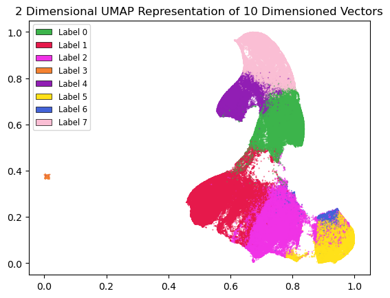
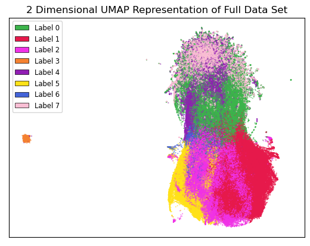

:author: Nathan Jacobi
:email: Nathan.Jacobi@uga.edu
:institution: Computer Science Department, University of Georgia

:author: Ivan Mo
:email: Ivan.Mo@uga.edu
:institution: Computer Science Department, University of Georgia
:institution: Linguistics Department, University of Georgia

:author: Albert You
:email: Albert.You@uga.edu
:institution: Computer Science Department, University of Georgia

:author: Krishi Kishore
:email: krishikishore10@gmail.com
:institution: Computer Science Department, University of Georgia

:author: Zane Page
:email: zaneapage@gmail.com
:institution: Computer Science Department, University of Georgia

:author: Shannon P. Quinn
:email: spq@uga.edu
:institution: Computer Science Department, University of Georgia
:institution: Cellular Biology Department, University of Georgia

:author: Tim Heckman
:email: heckman@uga.edu
:institution: Computer Science Department, University of Georgia
:institution: Public Health Department, University of Georgia

:bibliography: mybib

--------------------------------------------------------
Temporal Word Embeddings Analysis for Disease Prevention
--------------------------------------------------------

.. class:: abstract

Human languages' semantics and structure constantly change over time through mediums such as culturally significant events.
By viewing the semantic changes of words during notable events, contexts of existing and novel words can be predicted for similar, current events.
By studying the initial outbreak of a disease and the associated semantic shifts of select words,
we hope to be able to spot social media trends to prevent future outbreaks faster than traditional methods.
To explore this idea, we generate a temporal word embedding model that allows us to study word semantics evolving over time.
Using these temporal word embeddings, we use machine learning models to predict words associated with the disease outbreak.

.. class:: keywords

Natural Language Processing, Word Embeddings, Bioinformatics, Social Media, Disease Prediction

Introduction & Background
-------------------------

Human languages experience continual changes to their semantic structures.
Natural language processing techniques allow us to examine these semantic alterations through methods such as word embeddings.
Word embeddings provide low dimension numerical representations of words, mapping lexical meanings into a vector space.
Words that lie close together in this vector space represent close semantic similarities :cite:`vec13`.
This numerical vector space allows for quantitative analysis of semantics and contextual meanings, allowing for more use in machine learning models that utilize human language.

We hypothesize that disease outbreaks can be predicted faster than traditional methods by studying word embeddings and their semantic shifts during past outbreaks.
By surveying the context of select medical terms and other words associated with a disease during the initial outbreak,
we create a generalized model that can be used to catch future similar outbreaks quickly.
By leveraging social media activity, we predict similar semantic trends can be found in real time.
Additionally, this allows novel terms to be evaluated in context without requiring a priori knowledge of them,
allowing potential outbreaks to be detected early in their lifespans, thus minimizing the resultant damage to public health.

Given a corpus spanning a fixed time period, multiple word embeddings can be created at set temporal intervals, which can then be studied to track contextual drift over time.
However, a common issue in these so-called “temporal word embeddings” is that they are often unaligned - or the embeddings do not lie within the same embedding space.
Past proposed solutions to aligning temporal word embeddings require multiple separate alignment problems to be solved,
or for “anchor words” – words that have no contextual shifts between times – to be used for mapping one time period to the next :cite:`dia16`.
Yao et al. propose a solution to this alignment issue, shown to produce accurate and aligned temporal word embeddings,
through solving one joint alignment problem across all time slices, which we utilize here :cite:`dwe18`.

Methodology
-----------

Data Collection & Pre-Processing
================================

Our data set is a corpus *D* of over 7 million tweets collected from Scott County, Indiana from the dates January 1st, 2014 until January 17th, 2017.
The data was lent to us from Twitter after a data request, and has not yet been made publicly available. 
During this time period, an HIV outbreak was taking place in Scott County, with an eventual 215 confirmed cases being linked to the outbreak :cite:`oxy16`.
Gonsalves et al. predicts an additional 126 undiagnosed HIV cases were linked to this same outbreak :cite:`sco18`.
The state's response led to questioning if the outbreak could have been stemmed or further prevented with an earlier response :cite:`pol17`.
Our corpus was selected with a focus on tweets related to the outbreak.
By closely studying the semantic shifts during this outbreak, we hope to accurately predict similar future outbreaks before they reach large case numbers, allowing for a critical, earlier response.

To study semantic shifts through time, the corpus was split into 18 temporal buckets, each spanning a 2 month period. All data utilized in scripts was handled via the pandas Python package.
The corpus within each bucket is represented by :math:`D_{t}`, with t representing the temporal slice. Within each 2 month period, tweets were split into 12 pre-processed output csv files.
Pre-processing steps first removed retweets, links, images, emojis, and punctuation.
Common stop words were removed from the tweets using the NLTK Python Package, and each Tweet was then tokenized.
A vocabulary dictionary was then generated for each of the 18 temporal buckets, containing each unique word and a count of its occurrences within its respective bucket.
The vocabulary dictionaries for each bucket were then combined into a global vocabulary dictionary, containing the total counts for each unique word across all 18 buckets.
Our experiments utilized two vocabulary dictionaries: the first being the 10,000 most frequently occurring words from the global vocabulary for ensuring proper generation of embedding vectors; 
the second being a combined vocabulary of 15,000 terms, including our target HIV/AIDS related terms.
This combined vocabulary consisted of the top 10,000 words across *D* as well as an additional 473 HIV/AIDS related terms that occurred at least 8 times within the corpus.
The 10,000th most frequent term in *D* occurred 39 times, so to ensure results were not influenced by sparsity in the less frequent HIV/AIDS terms, 
4527 randomly selected terms with occurrences between 10 and 25 times were added to the vocabulary, bringing it to a total of 15,000 terms. 
The HIV/AIDS related terms came from a list of 1,031 terms we compiled, primarily coming from the U.S. Department of Veteran Affairs published list of HIV/AIDS related terms, 
and other terms we thought were pertinent to include, such as HIV medications and terms relating to sexual health :cite:`dva05`. 

.. [#] All code used can be found here https://github.com/quinngroup/Twitter-Embedding-Analysis/

Temporally Aligned Vector Generation
====================================

Generating word2vec embeddings is typically done through 2 primary methods: continuous bag-of-words (CBOW) and skip-gram :cite:`vec13`.
Our methods use a CBOW approach at generating embeddings, which generates a word’s vector embedding based on the context the word appears in,
i.e the words in a window range surrounding the target word. Following pre-processing of our corpus, steps for generating word embeddings were
applied to each temporal bucket. For each time bucket, co-occurrence matrices were first created, with a window size w = 5. These matrices contained
the total occurrences of each word against every other within a window range :math:`L` of 5 words within the corpus at time t. Each co-occurrence matrix was of
dimensions :math:`\lvert V \rvert \times \lvert V \rvert`. Following the generation of each of these co-occurrence matrices, a :math:`\lvert V \rvert \times \lvert V \rvert` dimensioned Positive Pointwise Mutual Information
matrix was calculated. The value in each cell was calculated as follows:

.. math::

   \text{PPMI}(t, L)_{w,c} = \text{max}\{\text{PMI}(D_t, L)_{w,c},0\},

where w and c are two words in *V*. Embeddings generated by word2vec can be approximated by PMI matrices, where given embedding vectors utilize the following equation :cite:`dwe18`:

.. math::

   u^{T}_{w}u_c \approx \text{PMI}(D, L)_{w,c}

Each embedding *u* has a reduced dimensionality d, typically around 25 - 200.
Each PPMI from our data set is created independently from each other temporal bucket.
After these PPMI matrices are made, temporal word embeddings can be created using the method proposed by Yao et al. :cite:`dwe18`.
The proposed solution focuses on the equation:

.. math::

   U(t)U(t)^T \approx \text{PPMI}(t,L)

where U is a set of embeddings from time period t.
Decomposing each PPMI(t) will yield embedding U(t), however each U(t) is not guaranteed to be in the same embedding space.
Yao et al. derives :math:`U(t)A = B` with the following equation [2]_ [3]_ [4]_ :cite:`dwe18`:

.. [#] :math:`\gamma` represents the forcing regularizer. :math:`\lambda` represents Frobenius norm regularizer. :math:`\tau` represents smoothing regularizer.
.. [#] Y(t) represents PPMI(t).
.. [#] The original equation uses W(t), but this acts as identical to U(t) in the code. We replaced it here to improve readability.

.. math::

   A = U(t)^TU(t) + (\gamma + \lambda + 2\tau)I ,

.. math::
   
   B = Y(t)U(t) + \gamma U(t) + \tau (U(t - 1) + U(t + 1))

To decompose PPMI(t) in our model, SciPy’s linear algebra package was utilized to solve for eigendecomposition of each PPMI(t), and the top 100 terms were kept to generate an embedding of d = 100.
The alignment was then applied, yielding 18 temporally aligned word embedding sets of our vocabulary, with dimensions :math:`\lvert V \rvert \times d`, or 15,000 x 100.
These word embedding sets are aligned spatially and in terms of rotations, however there appears to be some spatial drift that we hope to remove by tuning hyperparameters.
Following alignment, these vectors are usable for experimentation and analysis.

Predictions for Detecting Modern Shifts
=======================================

Following the generation of temporally aligned word embedding, they can be used for semantic shift analysis.
Using the word embedding vectors generated for each temporal bucket, a 2 new data sets were created to use for determining patterns in the semantic shifts surrounding HIV outbreaks.
Both of these data sets were constructed using our second vocabulary of 15,000 terms, including the 473 HIV/AIDS related terms, and each term's embedding of d = 100 that were generated by the dynamic embedding model. 
The first experimental data set was the shift in the d = 100 embedding vector between each time bucket and the one that immediately followed it. 
These shifts were calculated by simply subtracting the next temporal and initial vectors from each other.
In addition to the change in the 100 dimensioned vector between each time bucket and it's next, the initial and next 10 dimensional embeddings were included from each, which were generated using the same dynamic embedding model.
This yielded each word having 17 observations and 121 features: {d_vec0 … d_vec99, v_init_0 … v_init_9, v_fin_0 … v_fin_9, label}, and this data set will be referred to as "data_121".
The reasoning to include these lower dimensional embeddings was so that both the shift and initial and final positions in the embedding space would be used in our machine learning algorithms.
The other experimental data set was constructed similarly, but rather than subtracting the two vectors and including lower dimensions vectors, the initial and final 100 dimensioned vectors were listed as features.
This allowed machine learning algorithms to have access to the full positional information of each vector alongside the shift between the two.
This yielded each word having 17 observations and 201 features: {vec_init0 … vec_init99, vec_fin0 … vec_fin99, label}, and this data set will be referred to as "data_201".
With the 15,000 terms each having 17 observations, it led to a total of 255,000 observations.
It should be noted that in addition to the vector information, the data sets also listed the number of days since the outbreak began, the predicted number of cases at that point in time, from :cite:`sco18`, and the total magnitude of the shift in the vector between the corresponding time buckets.
All these features were dropped prior to use within the models, as the magnitude feature was held colinearity with the other positional features, and the case and day data will not be available in predicting modern outbreaks. 
Using these data, two machine learning algorithms were applied: unsupervised k-means clustering, and a supervised neural network.

K-means Clustering
==================

To try to examine any similarities within shifts, k-means clustering was performed on the data sets at first.
Initial attempts at k-means with the d = 100 dimensioned embeddings yielded extremely large inertial values, and poor results. 
In an attempt to reduce inertia, features for data that k-means would be performed onto were assessed.
K-means was performed on a reduced dimensionality data set, with embedding vectors of dimensionality d = 10, however this led to strict convergence, and poor results again.
The data set with the change in an embeddings vector, data_121, remained to contain the changes of the vectors, as well as the two dimensional representation of the vector for the initial and next time bucket generated by UMAP, rather than the 10 dimensional representation.
The second data set, data_201, always led to strict convergence on clustering, even when reduced to just the 10 dimensional representations. Therefore, k-means was performed explicitly on the data_121 set, with the 2 dimensional representations along side the 100 dimensional change in the vectors. 
Seperate two dimensional UMAP representations were generated for use as a feature and for visual examination.
The data set also did not have the term's label listed as a feature for clustering. 

Inertia at convergence on clustering for k-means was reduced significantly after features were reassassed, as much as 86%, yielding significantly better results.
Following the clustering, the results were analyzed to determine which clusters contained the higher than average incidence rates of medical terms and HIV/AIDS related terms.
These clusters can then be considered target clusters, and large incidences of words being clustered within these can be flagged as indicative as a possible outbreak.

Neural Network Predictions
==========================

K-means clustering revealed measurable differences in trajectories of medical and HIV related terms compared to non-medical terms.
In addition to this model, we created a neural network model for binary classification of our terms. 
Our target class was terms that we hypothesized were closely related to the HIV epidemic in Scott County, i.e. any word in our HIV terms list. 
Several iterations with varying number of layers, activation functions, and nodes within each layer were attempted to maximize performance. 
Each model used an 80% training, 20% testing split on these data. However, two variations were performed of this split on training and testing data.
The first was randomly splitting all 255,000 observations, without care of some observations for a term being in both training set and some being in the testing set.
This split of data will be refered to as "mixed" data, as the terms are mixed between the splits. The second split of data split the 15,000 words into 80% training and 20% testing.
After the vocabulary was split, the corresponding observations in the data were split accordingly, leaving all observations for each term within the same split. 
Additionally, we tested a neural network that would input the same data, either data_201 or data_121, with the addition of the label assigned to that observation by the k-means model as a feature. 

The neural network model used was four layers, with three ReLu layers with 128, 256, and 256 neurons, followed by a single neuron sigmoid output layer.
This neural network was constructed using the Keras module of the TensorFlow library.
The main difference between all of them was the input data itself. The input data were as follows: data_201 with and without k-means labels, data_121 with and without k-means labels. 
On each of these, there were two splits of the training and testing data, as in the prior mentioned "mixed" terms. 
Parameters of the neural network layers were adjusted, but results did not improve significantly across the data sets. All models were trained with a varying number of epochs: 50, 100, 150, and 200.
Additionally, several certainty thresholds for a positive classification were tested on each of the models. The best results from each will be listed in the results section.
As we begin implementation of these models on other HIV outbreak related data sets, the proper certainty thresholds can be better determined.
The goal of these models, in addition was to correctly identifying terms we classified as related to the outbreak, was to discover new terms that shift in similar ways to the HIV terms we labeled. 

Results
-------

Analysis of Embeddings
======================

.. table:: Spearman's correlation coefficients for w2v vectors and dynamic word embedding (dwe) vectors for all 18 temporal clusters against the SimLex word pair data set. :label:`simlexscores`
   :class: w
   
   +--------------+------------------+------------------+-------------------+-----------------+-----------------+------------------+
   | Time Bucket  | w2v Score (MEN)  | dwe Score (MEN)  | Difference (MEN)  | w2v Score (SL)  | dwe Score (SL)  | Difference (SL)  |
   +==============+==================+==================+===================+=================+=================+==================+
   | 0            | 0.437816         | 0.567757         | 0.129941          | 0.136146        | 0.169702        | 0.033556         |
   +--------------+------------------+------------------+-------------------+-----------------+-----------------+------------------+
   | 1            | 0.421271         | 0.561996         | 0.140724          | 0.131751        | 0.167809        | 0.036058         |
   +--------------+------------------+------------------+-------------------+-----------------+-----------------+------------------+
   | 2            | 0.481644         | 0.554162         | 0.072518          | 0.113067        | 0.165794        | 0.052727         |
   +--------------+------------------+------------------+-------------------+-----------------+-----------------+------------------+
   | 3            | 0.449981         | 0.543395         | 0.093413          | 0.137704        | 0.163349        | 0.025645         |
   +--------------+------------------+------------------+-------------------+-----------------+-----------------+------------------+
   | 4            | 0.360462         | 0.532634         | 0.172172          | 0.169419        | 0.158774        | -0.010645        |
   +--------------+------------------+------------------+-------------------+-----------------+-----------------+------------------+
   | 5            | 0.353343         | 0.521376         | 0.168032          | 0.133773        | 0.157173        | 0.023400         |
   +--------------+------------------+------------------+-------------------+-----------------+-----------------+------------------+
   | 6            | 0.365653         | 0.511323         | 0.145669          | 0.173503        | 0.154299        | -0.019204        |
   +--------------+------------------+------------------+-------------------+-----------------+-----------------+------------------+
   | 7            | 0.358100         | 0.502065         | 0.143965          | 0.196332        | 0.152701        | -0.043631        |
   +--------------+------------------+------------------+-------------------+-----------------+-----------------+------------------+
   | 8            | 0.380266         | 0.497222         | 0.116955          | 0.152287        | 0.154338        | .002051          |
   +--------------+------------------+------------------+-------------------+-----------------+-----------------+------------------+
   | 9            | 0.405048         | 0.496563         | 0.091514          | 0.149980        | 0.148919        | -0.001061        |
   +--------------+------------------+------------------+-------------------+-----------------+-----------------+------------------+
   | 10           | 0.403719         | 0.499463         | 0.095744          | 0.145412        | 0.142114        | -0.003298        |
   +--------------+------------------+------------------+-------------------+-----------------+-----------------+------------------+
   | 11           | 0.381033         | 0.504986         | 0.123952          | 0.181667        | 0.141901        | -0.039766        |
   +--------------+------------------+------------------+-------------------+-----------------+-----------------+------------------+
   | 12           | 0.378455         | 0.511041         | 0.132586          | 0.159254        | 0.144187        | -0.015067        |
   +--------------+------------------+------------------+-------------------+-----------------+-----------------+------------------+
   | 13           | 0.391209         | 0.514521         | 0.123312          | 0.145519        | 0.147816        | 0.002297         |
   +--------------+------------------+------------------+-------------------+-----------------+-----------------+------------------+
   | 14           | 0.405100         | 0.519095         | 0.113995          | 0.151422        | 0.152477        | 0.001055         |
   +--------------+------------------+------------------+-------------------+-----------------+-----------------+------------------+
   | 15           | 0.419895         | 0.522854         | 0.102959          | 0.117026        | 0.154963        | 0.037937         |
   +--------------+------------------+------------------+-------------------+-----------------+-----------------+------------------+
   | 16           | 0.400947         | 0.524462         | 0.123515          | 0.158833        | 0.157687        | -0.001146        |
   +--------------+------------------+------------------+-------------------+-----------------+-----------------+------------------+
   | 17           | 0.321936         | 0.525109         | 0.203172          | 0.170925        | 0.157068        | -0.013857        |
   +--------------+------------------+------------------+-------------------+-----------------+-----------------+------------------+
   | **Average**  | **0.437816**     | **0.567757**     | **0.129941**      | **0.151334**    | **0.155059**    | **0.003725**     |
   +--------------+------------------+------------------+-------------------+-----------------+-----------------+------------------+

.. figure:: plot0.png
   :figclass: w
   :scale: 10%

   2 Dimensional Representation of Embeddings from Time Bucket 0. :label:`plot0`

.. figure:: plot17.png
   :figclass: w
   :scale: 10%

   2 Dimensional Representation of Embeddings from Time Bucket 17. :label:`plot17`

To ensure accuracy in word embeddings generated in this model, we utilized word2vec (w2v), a proven neural network method of embeddings :cite:`vec13`.
For each temporal bucket, a static w2v embedding of d = 100 was generated to compare to the temporal embedding generated from the same bucket.
These vectors were generated from the same corpus as the ones generated by the dynamic model. 
As the vectors do not lie within the same embedding space, the vectors cannot be directly compared.
As the temporal embeddings generated by the alignment model are influenced by other temporal buckets, we hypothesize notably different vectors.
Methods for testing quality in :cite:`dwe18` rely on a semi-supervised approach: the corpus used is an annotated set of New York Times articles,
and the section (Sports, Business, Politics, etc.) are given alongside the text, and can be used to assess strength of an embedding.
Additionally, the corpus used spans over 20 years, allowing for metrics such as checking the closest word to leaders or titles, such as "president" or "NYC mayor" throughout time.
These methods show that this dynamic word embedding alignment model yields accurate results.

Major differences can be attributed to the word2vec model only being given a section of the corpus at a time, while our model had access to the entire corpus across all temporal buckets.
Terms that might not have appeared in the given time bucket might still appear in the embeddings generated by our model, but not at all within the word2vec embeddings.
For example, most embeddings generated by the word2vec model did not often have hashtagged terms in their top 10 closest terms, while embeddings generated by our model often did.
As hashtagged terms are very relevant in terms of ongoing events, keeping these terms can give useful information to this outbreak.
Modern hashtag terms will likely be the most common novel terms that we have no prior knowledge on, and we hypothesize that these terms will be relevant to ongoing outbreaks.

Given that our corpus spans a significantly shorter time period, and does not have annotations, we use existing baseline data sets of word similarities. 
We evaluated the accuracy of both model's vectors using a baseline sources for the semantic similarity of terms.
The first source used was SimLex-999, which contains 999 word pairings, and human generated similarity scores, on a scale of 0-10, where 10 is the highest similarity :cite:`sim15`.  
Cosine similarities for each pair of terms in SimLex-999 were calculated for both the w2v model vectors as well as vectors generated by the dynamic model for each temporal bucket. 
Pairs containing terms that were not present in the model generated vectors were omitted for that models similarity measurments. 
The cosine similarities were then compared to the assigned SimLex scores, using the Spearman's rank correlation coefficient.
The results of this baseline can be seen in table :ref:`simlexscores`.
The Spearman's coefficient of both sets of embeddings, averaged across all 18 temporal buckets, was .151334 for the w2v vectors, and .15506 for the dynamic word embedding (dwe) vectors.
The dwe vectors slightly outperformed the w2v baseline in this test of word similarities. 
However, it should be noted that these Spearman's coefficients are very low compared to baselines such as in :cite:`ewe19`, where the average Spearman's coefficient amongst common models was .38133 on this data set of words.
These models, however, were trained on corpus generated from Wikipedia pages - wiki2010. The lower Spearman's coefficients can likely be accounted to our corpus.
In 2014-2017, when this corpus was generated, Twitter had a 140 character limit on tweets. The limited characters have been shown to affect user's language within their tweets, likely affecting our embeddings. 
Boot et al. show that Twitter increasing the character limit to 280 characters in 2017 impacted the language within the tweets :cite:`clt19`.
As we test this pipeline on more modern Twitter data, the character increase in 2017 is something to keep in mind.

The second source of baseline MEN Test Collection, containing 3,000 pairs with similarity scores of 0-50, with 50 being the most similar :cite:`mds14`. 
Following the same methodology for assessing the strength of embeddingss as we did for the SimLex-999 set, the Spearman's coefficients from this set yielded much better results than from the SimLex-999 set. 
The Spearman's coefficients, averaged across all 18 temporal buckets, was .39532 for the w2v embeddings, and .52278 for the dwe embeddings. 
The results of this baseline can be seen in table :ref:`menscores`.
The dwe significantly outperformed the w2v baseline on this set, but still did not reach the average correlation of .7306 that other common models achieved in the baseline tests in :cite:`ewe19`. 

Two dimensional representations of embeddings, generated by UMAP, can be seen in figure :ref:`plot0` and figure :ref:`plot17`.
Figure :ref:`plot0` represents the embedding generated for the first time bucket, while figure :ref:`plot17` represents the embedding generated for the final time bucket.
These UMAP represntations use cosine distance as their metric over Euclidian distance, leading to more dense clusters and more accurate represenations of nearby terms witin the embedding space.
The section of terms outlying from the main grouping appears to be terms that do not appear often within that temporal cluster itself, but may appear several times later in a temporal bucket.
Figure :ref:`plot0` contains a zoomed in view of this outlying group, as well as a subgrouping on the outskirts of the main group, containing food related terms. 
The majority of these terms are terms that would likely be hashtagged frequently during a brief time period within the one temporal bucket. 
These terms are still relevant to study, as hashtagged terms that appear frequently for a brief period of time are most likely extremely attached to an ongoing event.
In future iterations, the length of each temporal bucket will be decreased, hopefully giving more temporal buckets access to terms that only appear within one currently. 

K-Means Clustering Results
==========================
The results of the k-means clustering can be seen below in figures :ref:`umap10dim` and :ref:`umapdataset`.
Figure :ref:`umap10dim` shows the results of k-means clustering with the corresponding 2 dimensional UMAP positions generated from the 10 dimensional vector that were used as features in the clustering.
Figure :ref:`umapdataset` shows the results of k-means clustering with the corresponding 2 dimensional UMAP representation of the entire data set used in clustering.
The k-means clustering revealed semantic shifts of HIV related terms being clustered with higher incidence than other terms in one cluster. 
Incidence rates for all terms and HIV terms in each cluster can be seen in table :ref:`hivterm` and figure :ref:`hivplot`.
This increased incidence rate of HIV related terms in certain clusters leads us to hypothesize that semantic shifts of terms in future datasets can be clustered using the same k-means model,
and analyzed to search for outbreaks.
Clustering of terms in future data sets can be compared to these clustering results, and similarities between the data can be recognized.

.. table:: Distribution of HIV terms and all terms within k-means clusters :label:`hivterm`

   +------------+------------+-------------------+-------------+
   | Cluster    | All Words  | HIV Terms         | Difference  |
   +============+============+===================+=============+
   | 0          | 0.173498   | 0.287048          | 0.113549    |
   +------------+------------+-------------------+-------------+
   | 1          | 0.231063   | 0.238876          | 0.007814    |
   +------------+------------+-------------------+-------------+
   | 2          | 0.220039   | 0.205600          | -0.014440   |
   +------------+------------+-------------------+-------------+
   | 3          | 0.023933   | 0.000283          | -0.023651   |
   +------------+------------+-------------------+-------------+
   | 4          | 0.108078   | 0.105581          | -0.002498   |
   +------------+------------+-------------------+-------------+
   | 5          | 0.096149   |0.084276           | -0.011873   |
   +------------+------------+-------------------+-------------+
   | 6          | 0.023525   | 0.031391          | 0.007866    |
   +------------+------------+-------------------+-------------+
   | 7          | 0.123714   | 0.046946          | -0.076768   |
   +------------+------------+-------------------+-------------+

.. figure:: hiv_plot.png

   Bar graph showing k-means clustering distribution of HIV terms against all terms. :label:`hivplot`
   

   Results of k-means clustering shown over the 2 dimensional UMAP representation of the 10 dimensional embeddings. :label:`umap10dim`

   Results of k-means clustering shown over the 2 dimensional UMAP representation of the full data set. :label:`umapdataset`

Neural Network Results
======================

Neural network models we generated showed promising results on classification of HIV related terms.
The goal of the models was to identify and discover terms surrounding the HIV outbreak, therefore we were not concerned about the rate of false positive terms.
False positive terms likely had semantic shifts very similar to the HIV related terms, and therefore can be related to the outbreak.
These terms can be labeled as potentially HIV related while studying future data sets, which can aid the identifying of if an outbreak is ongoing during the time tweets in the corpus were tweeted.
We looked for a balance of finding false positive terms without lowering our certainty threshold to include too many terms.
Results of the data_201 set can be seen in :ref:`nn201`, and results of the data_121 set can be seen in :ref:`nn121`.
The epochs column shows the number of training epochs on the models, as well as if the words were mixed between the training and testing data, denoted by "Mix".
The certainty threshold for the unmixed split in both was .01, and .1 for the mixed split in the data_201 results.

.. table:: Results of the neural network run on the data_201 set. :label:`nn201`
   :class: w

   +--------+--------------------------------------------------------------+-------------------------------------------------------------+
   |        |                      With K-Means Label                      |                    Without K-Means Label                    |
   +========+==========+===========+=========+======+=======+=======+======+==========+===========+========+======+=======+=======+======+
   | Epochs | Accuracy | Precision |  Recall |  TP  |   FP  |   TN  |  FN  | Accuracy | Precision | Recall |  TP  |   FP  |   TN  |  FN  |
   +--------+----------+-----------+---------+------+-------+-------+------+----------+-----------+--------+------+-------+-------+------+
   |   50   |  0.9589  |   0.0513  |  0.0041 |   8  |  148  | 48897 | 1947 |  0.9571  |   0.1538  | 0.0266 |  52  |  286  | 48759 | 1903 |
   +--------+----------+-----------+---------+------+-------+-------+------+----------+-----------+--------+------+-------+-------+------+
   |   100  |  0.9589  |   0.0824  |  0.0072 |  14  |  156  | 48889 | 1941 |  0.9608  |   0.0893  | 0.0026 |   5  |   51  | 48994 | 1950 |
   +--------+----------+-----------+---------+------+-------+-------+------+----------+-----------+--------+------+-------+-------+------+
   |   150  |  0.6915  |   0.0535  |  0.422  |  825 | 14602 | 34443 | 1330 |  0.7187  |   0.0451  | 0.3141 |  614 | 13006 | 36039 | 1341 |
   +--------+----------+-----------+---------+------+-------+-------+------+----------+-----------+--------+------+-------+-------+------+
   |   200  |  0.7397  |   0.0388  |  0.2435 |  476 | 11797 | 37428 | 1479 |  0.7566  |   0.0399  | 0.2317 |  453 | 10912 | 38133 | 1502 |
   +--------+----------+-----------+---------+------+-------+-------+------+----------+-----------+--------+------+-------+-------+------+
   |  50Mix |  0.9881  |   0.9107  |  0.7967 | 1724 |  169  | 48667 |  440 |  0.9811  |   0.9417  | 0.5901 | 1277 |   79  | 48757 |  887 |
   +--------+----------+-----------+---------+------+-------+-------+------+----------+-----------+--------+------+-------+-------+------+
   | 100Mix |  0.9814  |   0.9418  |  0.0598 | 1294 |   80  | 48756 |  870 |  0.9823  |   0.909   | 0.6465 | 1399 |  140  | 48696 |  765 |
   +--------+----------+-----------+---------+------+-------+-------+------+----------+-----------+--------+------+-------+-------+------+
   | 150Mix |  0.9798  |   0.9595  | 0.05471 | 1184 |   50  | 48786 |  980 |  0.9752  |   0.9934  | 0.4191 |  907 |   6   | 48830 | 1257 |
   +--------+----------+-----------+---------+------+-------+-------+------+----------+-----------+--------+------+-------+-------+------+
   | 200Mix |  0.9736  |   0.9846  |  0.3835 |  83  |   14  | 48823 | 1334 |   0.977  |   0.9834  | 0.4658 | 1008 |   17  | 48819 | 1156 |
   +--------+----------+-----------+---------+------+-------+-------+------+----------+-----------+--------+------+-------+-------+------+

.. table:: Results of the neural network on the data_121 set. :label:`nn121`
   :class: w

   +--------+------------------------------------------------------------+------------------------------------------------------------+
   |        |                     With K-Means Label                     |                    Without K-Means Label                   |
   +========+==========+===========+========+======+======+=======+======+==========+===========+========+======+======+=======+======+
   | Epochs | Accuracy | Precision | Recall |  TP  |  FP  |   TN  |  FN  | Accuracy | Precision | Recall |  TP  |  FP  |   TN  |  FN  |
   +--------+----------+-----------+--------+------+------+-------+------+----------+-----------+--------+------+------+-------+------+
   |   50   |  0.9049  |   0.0461  | 0.0752 |  147 | 3041 | 46004 | 1808 |   0.935  |   0.0652  | 0.0522 |  102 | 1463 | 47582 | 1853 |
   +--------+----------+-----------+--------+------+------+-------+------+----------+-----------+--------+------+------+-------+------+
   |   100  |  0.9555  |   0.1133  | 0.0235 |  46  |  360 | 48685 | 1909 |  0.8251  |   0.0834  | 0.3565 |  697 | 7663 | 41382 | 1258 |
   +--------+----------+-----------+--------+------+------+-------+------+----------+-----------+--------+------+------+-------+------+
   |   150  |  0.9554  |   0.0897  | 0.0179 |  35  |  355 | 48838 | 1935 |  0.9572  |   0.0957  | 0.0138 |  27  |  255 | 48790 | 1928 |
   +--------+----------+-----------+--------+------+------+-------+------+----------+-----------+--------+------+------+-------+------+
   |   200  |  0.9496  |   0.0335  | 0.0113 |  22  |  635 | 48410 | 1933 |  0.9525  |   0.0906  | 0.0266 |  52  |  522 | 48631 | 1905 |
   +--------+----------+-----------+--------+------+------+-------+------+----------+-----------+--------+------+------+-------+------+
   |  50Mix |  0.9285  |   0.2973  | 0.5018 | 1086 | 2567 | 46269 | 1078 |   0.974  |   0.4062  | 0.4501 |  974 | 1424 | 47412 | 1190 |
   +--------+----------+-----------+--------+------+------+-------+------+----------+-----------+--------+------+------+-------+------+
   | 100Mix |  0.9475  |   0.3949  | 0.4464 |  966 | 1480 | 47356 | 1198 |  0.9493  |   0.4192  | 0.5134 | 1111 | 1539 | 47297 | 1053 |
   +--------+----------+-----------+--------+------+------+-------+------+----------+-----------+--------+------+------+-------+------+
   | 150Mix |  0.9344  |   0.3112  | 0.4496 |  973 | 2154 | 46682 | 1191 |  0.9514  |   0.4291  |  0.439 |  950 | 1264 | 47572 | 1214 |
   +--------+----------+-----------+--------+------+------+-------+------+----------+-----------+--------+------+------+-------+------+
   | 200Mix |  0.9449  |   0.3779  | 0.4635 | 1003 | 1651 | 47185 | 1161 |   0.95   |   0.4156  | 0.4395 |  951 | 1337 | 47499 | 1213 |
   +--------+----------+-----------+--------+------+------+-------+------+----------+-----------+--------+------+------+-------+------+

These results show that classification of terms surrounding the Scott County HIV outbreak is achievable, but the model will need to be refined on more data.
It can be seen that the mixed term split of data led to a high rate of true positives, however it quickly became overfit to the training data with false positives dropping to low rates on models with higher epochs.
Additionally, accuracy begins to increase between 150 and 200 epoch models on the no mixed split, so even higher epoch models might improve results further on the no mixed split.
Outliers, such as in the true positives in data_121 with 100 epochs without k-means labels, can be explained by the certainty threshold. If the certainty threshold was .05 on that model, true positives would have been 86, and false positives would have been 1129.
A precise certainty threshold can be found as we test this model on other HIV related data sets and control data sets. 
With enough experimentation and data, a set can be run through our pipeline and a certainty of there being a potential HIV outbreak can be generated by a future model.

Conclusion
----------

Our results prove promising, with high accuracy and decent recall on classification of HIV/AIDS related terms, as well as potentially discovering new terms related to the outbreak.
we could begin examining and generating thresholds of what might be indicative of an outbreak. 
To improve results, metrics for our word2vec baseline model and statistical analysis could be further explored, as well as exploring previously mentioned noise and biases from our data.
Additionally, sparsity of data in earlier temporal buckets may lead to some loss of accuracy.
Fine tuning hyperparameters of the alignment model through grid searching would likely even further improve these results.
We predict that given more data sets, containing tweets from areas and times that had similar HIV/AIDS outbreaks to Scott County, as well control data sets that are not directly related to an HIV outbreak,
we could determine a threshold of words that would define a county as potentially undergoing an HIV outbreak.
With a refined pipeline and model such as this, we hope to be able to begin biosurveillance to try to prevent future outbreaks.

Future Work
-----------
Case studies of previous datasets related to other diseases and collection of more modern tweets could not only provide critical insight into relevant medical activity,
but also further strengthen and expand our model and its credibility.
There is a large source of data potentially related to HIV/AIDS on Twitter, so finding and collecting this data would be a crucial first step.
One potent example of data could be from the 220 United States counties determined by the CDC to be considered vulnerable to HIV and/or viral hepatitis outbreaks due to injection drug use,
similar to the outbreak that occurred in Scott County :cite:`vul16`.
Our next data set that is being studied are tweets from Cabell County, West Virginia, from January of 2018 through 2020. During this time a very similar HIV outbreak to the one that took place in Scott County in 2014 :cite:`cwv20`. 
The end goal is to create a pipeline that can perform live semantic shift analysis at set intervals of time within these counties, and classify these shifts as they happen.
A future model can predict whether or not the number of terms classified as HIV related is indicative of an outbreak.
If enough of terms classified by our model as potentially indicative of an outbreak become detected, or if this future model predicts a possible outbreak, public health officials can be notified and the severity of a possible outbreak can mitigated if properly handled.

Additionally, we would like to resasses our embedding model to try and improve embeddings generated and understanding of the semantic shifts.
This project has been ongoing for several years, and new models, such as the use of bidrectional encoders, as in BERT :cite:`bdt18`, have proven to have high performance. BERT based models have also been used for temporal embedding studies, such as in :cite:`ctr19`, a study focused on clincal corpora. 
We predict that updating our pipeline to match more modern methodology can lead to more effective disease detection.

Expansion into other social media platforms would increase the variety of data our model has access to, and therefore what our model is able to respond to.
With the foundational model established, we would be able to focus on converting the data and addressing the differences between social networks (e.g. audience and online etiquette).
Reddit and Instagram are two points of interest due to their increasing prevalence, as well as vastness of available data.

An idea for future implementation following the generation of a generalized model would be creating a web application.
The ideal audience would be medical officials and organizations, but even public or research use for trend prediction could be potent.
The application would give users the ability to pick from a given glossary of medical terms, defining their own set of significant words to run our model on.
Our model would then expose any potential trends or insight for the given terms in contemporary data, allowing for quicker responses to activity.
Customization of the data pool could also be a feature, where tweets and other social media posts are narrowed down to specific geographic regions or smaller time windows, yielding more specified results.
