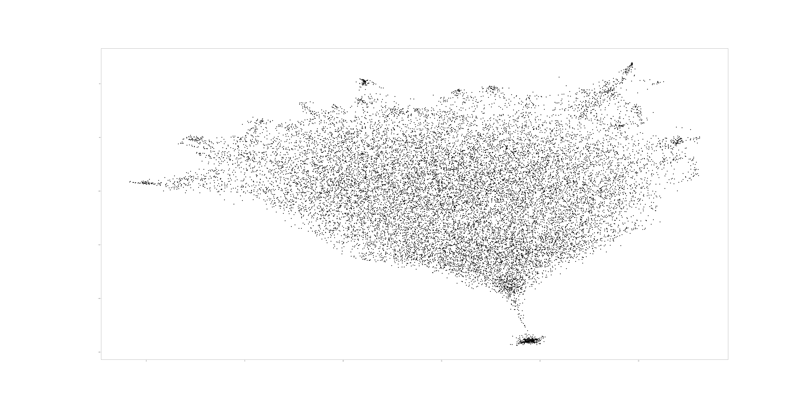
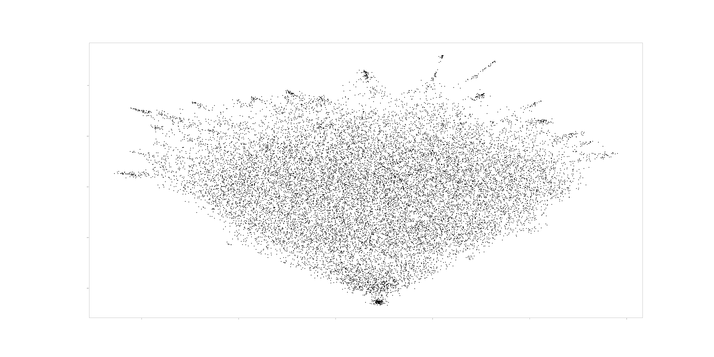
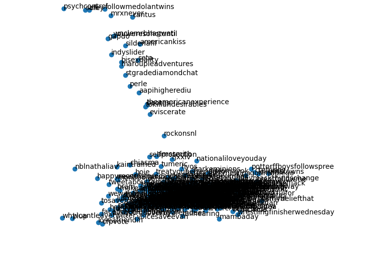
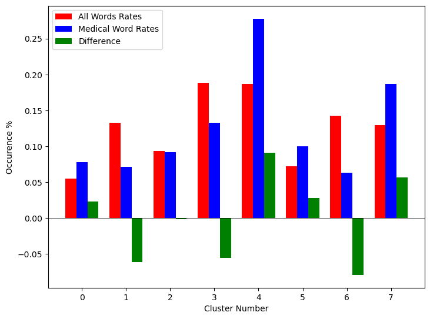
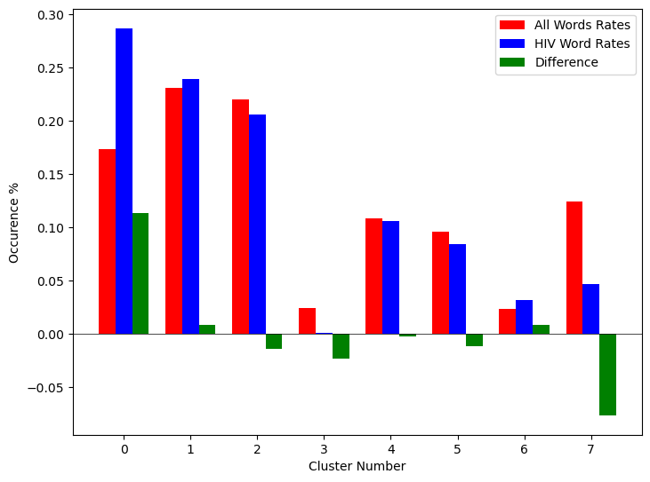

:author: Nathan Jacobi
:email: Nathan.Jacobi@uga.edu
:institution: Computer Science Department, University of Georgia

:author: Ivan Mo
:email: Ivan.Mo@uga.edu
:institution: Computer Science Department, University of Georgia
:institution: Linguistics Department, University of Georgia

:author: Albert You
:email: Albert.You@uga.edu
:institution: Computer Science Department, University of Georgia

:author: Krishi Kishore
:email: krishikishore10@gmail.com
:institution: Computer Science Department, University of Georgia

:author: Zane Page
:email: zaneapage@gmail.com
:institution: Computer Science Department, University of Georgia

:author: Shannon P. Quinn
:email: spq@uga.edu
:institution: Computer Science Department, University of Georgia
:institution: Cellular Biology Department, University of Georgia

:author: Tim Heckman
:email: heckman@uga.edu
:institution: Computer Science Department, University of Georgia
:institution: Public Health Department, University of Georgia

:bibliography: mybib

--------------------------------------------------------
Temporal Word Embeddings Analysis for Disease Prevention
--------------------------------------------------------

.. class:: abstract

Human languages’ semantics and structure constantly change over time through mediums such as culturally significant events. By viewing the semantic changes of words during notable events, contexts of existing and novel words can be predicted for similar, current events. By studying the initial outbreak of a disease and the associated semantic shifts of select words, we hope to be able to spot social media trends to prevent future outbreaks faster than traditional methods. To explore this idea, we generate a temporal word embedding model that allows us to study word semantics evolving over time.

.. class:: keywords

Natural Language Processing, Word Embeddings, Bioinformatics, Social Media, Disease Prediction

Introduction & Background
-------------------------

Human languages experience continual changes to their semantic structures. Natural language processing techniques allow us to examine these semantic alterations through methods such as word embeddings. Word embeddings provide low dimension numerical representations of words, mapping lexical meanings into a vector space. Words that lie close together in this vector space represent close semantic similarities :cite: `vec13`. This numerical vector space allows for quantitative analysis of semantics and contextual meanings, allowing for stronger machine learning models that utilize human language.

We hypothesize that disease outbreaks can be predicted faster than traditional methods by studying word embeddings and their semantic shifts during past outbreaks. By surveying the context of select medical terms and other words associated with a disease during the initial outbreak, we create a generalized model that can be used to catch future similar outbreaks quickly. By leveraging social media activity, we predict similar semantic trends can be found in real time. Additionally, this allows novel terms to be evaluated in context without requiring a priori knowledge of them, allowing potential outbreaks to be detected early in their lifespans, thus minimizing the resultant damage to public health.

Given a corpus spanning a fixed time period, multiple word embeddings can be created at set temporal intervals, which can then be studied to track contextual drift over time. However, a common issue in these so-called “temporal word embeddings” is that they are often unaligned - or the embeddings do not lie within the same embedding space. Past proposed solutions to aligning temporal word embeddings require multiple separate alignment problems to be solved, or for “anchor words” – words that have no contextual shifts between times – to be used for mapping one time period to the next :cite: `dia16`. Yao et al. propose a solution to this alignment issue, shown to produce accurate and aligned temporal word embeddings, through solving one joint alignment problem across all time slices, which we utilize here :cite: `dwe18`.

Methodology
-----------

Data Collection & Pre-Processing
================================

Our data set is a corpus *D* of over 7 million Tweets collected from Scott County, Indiana from the dates January 1st, 2014 until January 17th, 2017. During this time period, an HIV outbreak was taking place in Scott County, with an eventual 215 confirmed cases being linked to the outbreak :cite: `oxy16`. Gonsalves et al. predicts an additional 126 undiagnosed HIV cases were linked to this same outbreak :cite: `sco18`. The state's response led to questioning if the outbreak could have been stemmed or further prevented with an earlier response :cite: `pol17`. Our corpus was selected with a focus on Tweets related to the outbreak. By closely studying the semantic shifts during this outbreak, we hope to accurately predict similar future outbreaks before they reach large case numbers, allowing for a critical, earlier response.

To study semantic shifts through time, the corpus was split into 18 temporal buckets, each spanning a 2 month period. The corpus within each bucket is represented by *D_t*, with t representing the temporal slice. Within each 2 month period, Tweets were split into 12 pre-processed output csv files. Pre-processing steps first removed retweets, links, images, emojis, and punctuation. Common stop words were removed from the Tweets using the NLTK Python Package, and each Tweet was then tokenized. A vocabulary dictionary was then generated for each of the 18 temporal buckets, containing each unique word and a count of its occurrences within its respective bucket. The vocabulary dictionaries for each bucket were then combined into a global vocabulary dictionary, containing the total counts for each unique word across all 18 buckets. Our experiments utilized two vocabulary dictionaries: the first being the 10,000 most frequently occurring words from the global vocabulary; the second being a list of medical terms taken from a published list of terms taken from combining two medical spell check libraries. The combined vocabulary *V* consisted of the top 10,000 words across *D* as well as an additional 8,156 medical terms that occurred within all data handled in scripts utilized the pandas Python package. Additionally, we created a vocabulary of 227 HIV/AIDS specific medical terms to be used in analysis.

.. _repository: https://github.com/glutanimate/wordlist-medicalterms-en

Temporally Aligned Vector Generation
====================================

Generating word embeddings can be done through 2 primary methods: continuous bag-of-words (CBOW) and skip-gram :cite: `vec13`. Our methods use a CBOW approach at generating embeddings, which generates a word’s vector embedding based on the context the word appears in, i.e the words in a window range surrounding the target word. Following pre-processing of our corpus, steps for generating word embeddings were applied to each temporal bucket. Each time bucket First, co-occurrence matrices were created, with a window size w = 5. These matrices contained the total occurrences of each word against every other within a range of 5 words within the corpus *D_t*. Each co-occurrence matrix was of dimensions *V* x *V*. Following the generation of each of these co-occurrence matrices, a *V* x *V* dimensioned Positive Pointwise Mutual Information matrix was calculated. The value in each cell was calculated as follows:

.. math::

\text{PPMI}(t, L)_{w,c} = \text{max}\{\text{PMI}(D_t, L)_{w,c},0\},

where w and c are two words in *V* Embeddings generated by word2vec utilize PMI matrices, where given embedding vectors utilize the following equation :cite: `dwe18`:

.. math::

u^{T}_{w}u_c \approx \text{PMI}(D, L)_{w,c}

Each embedding *u* has a reduced dimensionality d, typically around 25 - 200. Each PPMI from our data set is created independently from each other temporal bucket.
After these PPMI matrices are made, temporal word embeddings can be created using the method proposed by Yao et al. :cite: `dwe18`. The proposed solution focuses on the equation:

.. math::

U(t)U(t)^T \approx \text{PPMI}(t,L)

where U is a set of embeddings from time period t. Decomposing each PPMI(t) will yield embedding U(t), however each U(t) is not guaranteed to be in the same embedding space. Yao et al. derives :math: U(t)A = B with the following equation :cite: `dwe18`:

.. math::

A = U(t)^TU(t) + (\gamma + \lambda + 2\tau)I,\\B = Y(t)U(t) + \gamma U(t) + \tau (U(t - 1) + U(t + 1))

.. [#] Y(t) represents PPMI(t).
.. [#] The original equation uses W(t), but this acts as identical to U(t) in the code. We replaced it here to improve readability.

To decompose PPMI(t) in our model, SciPy’s linear algebra package was utilized to solve for eigendecomposition of each PPMI(t), and the top 100 terms were kept to generate an embedding of d = 100. The alignment was then applied, yielding 18 temporally aligned word embedding sets of our vocabulary, with dimensions V x d, or 18,156 x 100. These word embedding sets are aligned spatially and in terms of rotations, however there appears to be some spatial drift that we hope to remove by tuning hyperparameters. Following alignment, these vectors are usable for experimentation and analysis.

Predictions for Detecting Modern Shifts
=======================================

Following the generation of temporally aligned word embedding, they can be used for semantic shift analysis. Machine learning algorithms can easily recognize patterns between past and present semantic shifts, but for our purposes, the problem becomes determining which patterns are indicative of the disease outbreak that was ongoing during the initial Scott County HIV outbreak. Our initial solution involves determining patterns within medical related terms, as those words are semantically linked to a medical emergency such as this outbreak. Using the word embedding vectors generated for each temporal bucket, a new data set was created to use for determining semantic shift patterns. All 18 temporal observations of each word were included in this data set, however rather than using the embedding for each word for each temporal bucket, the change in the embeddings between each consecutive bucket was used instead, subtracting the first temporal bucket's embedding from the second. Additionally, the two dimensional representation of initial and next positions of each embedding were listed as features. These two dimensional representations of the word embeddings were generated using UMAP for dimensionality reduction, with a set random state to ensure a shared space. This yielded each word having 17 observations and 104 features: {d_vec0 … d_vec99, x0, y0, x1, y1}.

The data was then split into 80% training and 20% testing. Using these training data, K-means clustering was performed to try to classify each observation. Several iterations with various parameters were attempted, but all led had converging inertia values of over 20,000. Therefore features were reassessed, and embedding vectors were created again with dimension d = 10, yielding 14 features per observation. Inertia at convergence on 8 cluster K-Means was reduced to around 3,000, yielding significantly better results. Following the clustering, the results were analyzed to determine which clusters contained the higher than average incidence rates of medical terms and HIV/AIDS related terms. These clusters are then considered target clusters, and large incidences of words being clustered within these can be flagged as indicative as a possible outbreak.

Results
-------

Analysis of Embeddings
======================

.. table:: Five closest words of hand-selected terms compared between word2vec and dynamic word embeddings generated by our model :label: `compare`

+----------------------+-------------+-------------+--------------+----------------+-------------+
| Word                 | 1st closest | 2nd closest | 3rd closest  | 4th closest    | 5th closest |
+======================+=============+=============+==============+================+=============+
| gymnastics (dwe)     | olympics    | olympic     | nowadays     | medal          | everytime   |
+----------------------+-------------+-------------+--------------+----------------+-------------+
| gymnastics (w2v)     | downfall    | empire      | swept        | qualifying     | heel        |
+----------------------+-------------+-------------+--------------+----------------+-------------+
| sanders (dwe)        | bernie      | democratic  | nominated    | demsinphilly   | obama       |
+----------------------+-------------+-------------+--------------+----------------+-------------+
| sanders (w2v)        | wikileaks   | agencies    | podesta      | infowars       | israeli     |
+----------------------+-------------+-------------+--------------+----------------+-------------+
| username (dwe)       | snapchat    | profile     | instagram    | deleted        | comment     |
+----------------------+-------------+-------------+--------------+----------------+-------------+
| username (w2v)       | discipline  | writer      | seals        | merit          | nanti       |
+----------------------+-------------+-------------+--------------+----------------+-------------+

.. table:: The percentage and counts of our vocabulary sharing a given number of closest words (out of the top 15) between word2vec and our model for time bucket #17. :label: `sharedclosest`

+-----------------------------------------+-------------------------+----------------------+
|          Number of Shared Closest Words | Percent Occurrences     | No. Occurrences      |
+=========================================+=========================+======================+
| 1                                       | 0.54913                 | 9970                 |
+-----------------------------------------+-------------------------+----------------------+
| 2                                       | 0.157579                | 2861                 |
+-----------------------------------------+-------------------------+----------------------+
| 3                                       | 0.0846                  | 1536                 |
+-----------------------------------------+-------------------------+----------------------+
| 4                                       | 0.052765                | 958                  |
+-----------------------------------------+-------------------------+----------------------+
| 5                                       | 0.032606                | 592                  |
+-----------------------------------------+-------------------------+----------------------+
| 6                                       | 0.019057                | 346                  |
+-----------------------------------------+-------------------------+----------------------+
| 7                                       | 0.01041                 | 189                  |
+-----------------------------------------+-------------------------+----------------------+
| 8                                       | 0.005398                | 98                   |
+-----------------------------------------+-------------------------+----------------------+
| 9                                       | 0.002258                | 41                   |
+-----------------------------------------+-------------------------+----------------------+
| 10                                      | 0.000551                | 10                   |
+-----------------------------------------+-------------------------+----------------------+
| 11                                      | 0.0000551               | 1                    |
+-----------------------------------------+-------------------------+----------------------+
| 12                                      | 0                       | 0                    |
+-----------------------------------------+-------------------------+----------------------+
| 13                                      | 0                       | 0                    |
+-----------------------------------------+-------------------------+----------------------+
| 14                                      | 0                       | 0                    |
+-----------------------------------------+-------------------------+----------------------+
| 15                                      | 0                       | 0                    |
+-----------------------------------------+-------------------------+----------------------+

To ensure accuracy in word embeddings generated in this model, we utilized word2vec (w2v), a proven neural network method of embeddings :cite: `vec13`. For each temporal bucket, a static w2v embedding of d = 100 was generated to compare to the temporal embedding generated from the same bucket. As the vectors do not lie within the same embedding space, the vectors cannot be directly compared. Instead, we compare shared nearby words between the vectors. As the temporal embeddings generated by the alignment model are influenced by other temporal buckets, we hypothesize notably different vectors. Methods for testing quality in :cite: `dwe18` rely on a semi-supervised approach: the corpus used is an annotated set of New York Times articles, and the section (Sports, Business, Politics, etc.) are given alongside the text, and can be used to assess strength of an embedding. Additionally, the corpus used spans over 20 years, allowing for metrics such as checking the closest word to leaders or titles, such as “president” or “NYC mayor” throughout time. These methods show that the dynamic word embedding alignment model yields accurate results.

Given that our corpus spans a significantly shorter time period, and does not have annotations, we use a very rudimentary method of analysis, comparing the closest n = 15 words between the word2vec embeddings and the temporal embeddings. The number of shared closest words from the temporal word embedding and the corresponding word2vec embedding was recorded, and the overall frequency across all embeddings can be seen in table :ref: `sharedclosest`. Major differences can be attributed to the word2vec model only being given a section of the corpus at a time, while our model had access to the entire corpus across all temporal buckets. Terms that might not have appeared in the given time bucket might still appear in the embeddings generated by our model, but not at all within the word2vec embeddings. For example, most embeddings generated by the word2vec model did not often have hashtagged terms in their top 15 closest terms, while embeddings generated by our model often did. As hashtagged terms are very relevant in terms of ongoing events, keeping these terms can give useful information to this outbreak. Additionally, modern hashtag terms will likely be the most common novel terms that we have no priori knowledge on.

Visual examination of closest words from our embeddings compared to closest words from word2vec embeddings initially lead us to believe that our embeddings are more accurate in some cases. For example, the closest fifteen words to the term ‘gymnastics’ in our model are as follows: ['olympics', 'olympic', 'nowadays', 'medal', 'everytime', 'rochester', 'discharges', 'synchronized', 'swimming', 'cms', 'entertaining', 'dislocate', 'redundant', 'rio', 'metric']. Considering the 2016 Rio Summer Olympics occurred during the dates spanned by our corpus, we believe this is an accurate representation of gymnastics semantic meaning. The closest fifteen words from the word2vec embeddings on the other hand (['downfall', 'empire', 'swept', 'qualifying', 'heel', 'bronze', 'vinny', 'squared', 'blossom', 'cascade', 'popped', 'kora', 'fuuuck', 'pedro', 'nutshell']) appear to hold much less relevance outside of the term ‘bronze’ and ‘qualifying’. More examples such as this can be seen in table :ref: `compare`, where the top 5 nearest terms to a few selected terms are listed, where we represents the dynamic word embeddings generated by our model and w2v represents embeddings generated by word2vec. Improving our baseline models could be done through finding ways to improve accuracy of the word2vec model, or by implementing GloVe, another tested word embedding method :cite: `glv14`. It should be noted that this is a solely visual analysis of our embeddings, and a quantitative study should be performed to strengthen this.

Two dimensional representations of embeddings, generated by UMAP, can be seen in figure :ref: `plot0` and figure :ref: `plot17`. Figure :ref: `plot0` represents the embedding generated for the first time bucket, while figure :ref: `plot17` represents the embedding generated for the final time bucket. Visual analysis shows an outlying cluster at the bottom of the first embedding space that becomes spread out and more integrated into the embeddings by the final embedding space. A closer view of this outlying cluster, with labels (figure :ref: `zoomed_plot0`), show that most terms appear to be hashtags or typos, that likely do not appear often or at all in the first temporal bucket. By the time the final temporal bucket is reached, these terms have appeared in the corpus and meanings can be learned from all the temporal buckets, leading to a less dense representation of these terms, and more integration into the embedding space.

	2 Dimensional Representation of Embeddings from Time Bucket 0 :label: `plot0`

	2 Dimensional Representation of Embeddings from Time Bucket 17 :label: `plot17`

	Zoomed in 2D Embeddings of Outlying Cluster in Time Bucket 0 :label: `zoomed_plot0`

Prediction of Modern Shifts
===========================

The results of clustering led to semantic shifts of medical related terms and HIV related terms having higher incidences than other terms in 2 clusters each: clusters 3 and 7 for HIV terms, and clusters 4 and 7 for medical related terms. Incidence rates for all terms and medical terms in each cluster can be seen in table :ref: `medterm` and figure :ref: `med_plot`, and HIV related terms in table :ref: `hivterm` and figure :ref: `hiv_plot`. This increased incidence rate of HIV and medical related terms in certain clusters leads us to hypothesize that semantic shifts of terms in future datasets can be clustered using the KMeans model, and analyzed to search for outbreaks. If certain clusters begin having an increased rate of appearing, it can be flagged for a potential outbreak.

.. table:: Distribution of medical terms and all terms within k-means clusters :label: `medterm`

+------------+------------+-------------------+-------------+
| Cluster    | All Words  | Medical Terms     | Difference  |
+============+============+===================+=============+
| 0          | 0.055184   | 0.077877          | 0.022693    |
+------------+------------+-------------------+-------------+
| 1          | 0.132719   | 0.070984          | -0.06173    |
+------------+------------+-------------------+-------------+
| 2          | 0.093325   | 0.09203           | -0.0013     |
+------------+------------+-------------------+-------------+
| 3          | 0.188303   | 0.132459          | -0.05584    |
+------------+------------+-------------------+-------------+
| 4          | 0.187044   | 0.277972          | 0.090929    |
+------------+------------+-------------------+-------------+
| 5          | 0.071675   | 0.099538          | 0.027864    |
+------------+------------+-------------------+-------------+
| 6          | 0.142118   | 0.062721          | -0.0794     |
+------------+------------+-------------------+-------------+
| 7          | 0.129633   | 0.186419          | 0.056786    |
+------------+------------+-------------------+-------------+

	Bar Graph Showing KMeans Clustering Distribution of Medical Terms against All Terms :label: `med_plot`

.. table:: Distribution of HIV terms and all terms within k-means clusters :label: `hivterm`

+------------+------------+-------------------+-------------+
| Cluster    | All Words  | HIV Terms         | Difference  |
+============+============+===================+=============+
| 0          | 0.055184   | 0.031584          | -0.0236     |
+------------+------------+-------------------+-------------+
| 1          | 0.132719   | 0.137035          | 0.004317    |
+------------+------------+-------------------+-------------+
| 2          | 0.093325   | 0.020886          | -0.07244    |
+------------+------------+-------------------+-------------+
| 3          | 0.188303   | 0.25675           | 0.068447    |
+------------+------------+-------------------+-------------+
| 4          | 0.187044   | 0.151808          | -0.03524    |
+------------+------------+-------------------+-------------+
| 5          | 0.071675   | 0.059603          | -0.01207    |
+------------+------------+-------------------+-------------+
| 6          | 0.142118   | 0.120734          | -0.02138    |
+------------+------------+-------------------+-------------+
| 7          | 0.129633   | 0.2216            | 0.091967    |
+------------+------------+-------------------+-------------+

	Bar Graph Showing KMeans Clustering Distribution of HIVl Terms against All Terms :label: `hiv_plot`

Conclusion
----------

Our results prove promising, as there was a statistically noticeable difference in clustering of semantic shifts in HIV and medical related terms compared to the full vocabulary. However, there were various biases in our data that occurred, such as bots skewing data by repeating a plethora of tweets, misspellings, and hashtags, but initial results show a classifiable difference. This was evident through our K-Means clustering metric, which revealed the overall percentages of words each cluster maintained throughout all temporal buckets. To improve results, metrics for our word2vec baseline model and statistical analysis could be further explored, as well as exploring previously mentioned noise and biases from our data. Additionally, sparsity of data in earlier temporal buckets may lead to some loss of accuracy. Fine tuning hyperparameters of the alignment model through grid searching would likely further improve these results.

Future Work
-----------

Case studies of previous datasets related to other diseases and collection of more modern Tweets could not only provide critical insight into relevant medical activity, but also further strengthen our model and its credibility. One potent example is the 220 United States counties determined by the CDC to be considered vulnerable to HIV and/or viral hepatitis outbreaks due to injection drug use, similar to the outbreak that occurred in Scott County :cite: `vul16`. Using the model generated by our experiments can allow us to set up an early detection system for an HIV outbreak in these counties, by analyzing social media data in these select areas. The end goal is to create a pipeline that can perform semantic shift analysis at set intervals of time, and detect words that fit our classification of “outbreak indicative” terms. If enough of these terms become detected, public health officials can be notified the severity of a possible outbreak has the potential to be mitigated if properly handled.

Expansion into other social media platforms would increase the variety of data our model has access to, and therefore what our model is able to respond to. With the foundational model established, we would be able to focus on converting the data and addressing the differences between social networks (e.g. audience and online etiquette). Reddit and Instagram are two points of interest due to their increasing prevalence, as well as vastness of available data.

An idea for future implementation following the generation of a generalized model would be creating a web application. The ideal audience would be medical officials and organizations, but even public or research use for trend prediction could be potent. The application would give users the ability to pick from a given glossary of medical terms, defining their own set of significant words to run our model on. Our model would then expose any potential trends or insight for the given terms in contemporary data, allowing for quicker responses to activity. Customization of the data pool could also be a feature, where Tweets and other social media posts are narrowed down to specific geographic regions or smaller time windows, yielding more specified results.
