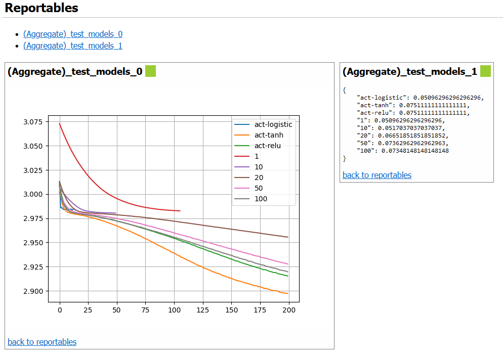
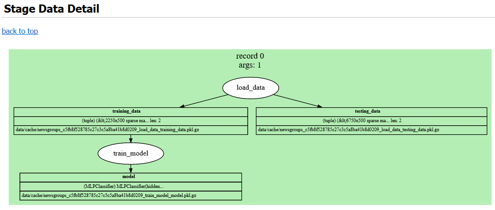

.. raw:: latex

    \makeatletter
    \let\@oldmakefntext\@makefntext
    \renewcommand\@makefntext[1]{%
      \noindent\makebox[0pt][r]{}#1}
    \makeatother

    \footnotetext{Notice: This manuscript has been authored by UT-Battelle, LLC, under
    contract DE-AC05-00OR22725 with the US Department of Energy (DOE). The US
    government retains and the publisher, by accepting the article for
    publication, acknowledges that the US government retains a nonexclusive,
    paid-up, irrevocable, worldwide license to publish or reproduce the
    published form of this manuscript, or allow others to do so, for US
    government purposes. DOE will provide public access to these results of
    federally sponsored research in accordance with the DOE Public Access Plan
    (http://energy.gov/downloads/doe-public-access-plan).
    }

    \makeatletter
    \let\@makefntext\@oldmakefntext
    \makeatother

:author: Nathan Martindale
:email: martindalena@ornl.gov
:institution: Oak Ridge National Laboratory
:orcid: 0000-0002-5036-5433
:corresponding:

:author: Jason Hite
:email: hitejm@ornl.gov
:institution: Oak Ridge National Laboratory
:orcid: 0000-0001-8931-5815

:author: Scott Stewart
:email: stewartsl@ornl.gov
:institution: Oak Ridge National Laboratory
:orcid: 0000-0003-4320-5818

:author: Mark Adams
:email: adamsmb@ornl.gov
:institution: Oak Ridge National Laboratory
:orcid: 0000-0002-5414-2800

:copyright_holder: Oak Ridge National Laboratory.

:bibliography: mybib

-----------------------------------------------------
Design of a Scientific Data Analysis Support Platform
-----------------------------------------------------

.. class:: abstract

    Software data analytic workflows are a critical aspect of modern scientific
    research and play a crucial role in testing scientific hypotheses. A typical
    scientific data analysis life cycle in a research project must include
    several steps that may not be fundamental to testing the hypothesis, but are
    essential for reproducibility. This includes tasks that have analogs to
    software engineering practices such as versioning code, sharing code among
    research team members, maintaining a structured codebase, and tracking
    associated resources such as software environments. Tasks unique to
    scientific research include designing, implementing, and modifying code that
    tests a hypothesis. This work refers to this code as *an experiment*, which
    is defined as a software analog to physical experiments.

    A software experiment manager should support tracking and reproducing
    individual experiment runs, organizing and presenting results, and storing
    and reloading intermediate data on long-running computations. A software
    experiment manager with these features would reduce the time a researcher
    spends on tedious busywork and would enable more effective collaboration.
    This work discusses the necessary design features in more depth, some of the
    existing software packages that support this workflow, and a custom
    developed open-source solution to address these needs.

.. class:: keywords

    reproducible research, experiment life cycle, data analysis support

Introduction
============

Modern science increasingly uses software as a tool for conducting research and
scientific data analyses. The growing number of libraries and frameworks
facilitating this work has greatly lowered the barrier to usage, allowing more
researchers to benefit from this paradigm. However, as a result of the
dependence on software, there is a need for more thorough integration of sound
software engineering practices with the scientific process. The 
fragility of complex environments containing heavily interconnected packages coupled with a 
lack of provenance of the artifacts generated throughout the development of an
experiment increases the potential for long-term problems, undetected bugs, and
failure to reproduce previous analyses.

Fundamentally, science revolves around the ability for others to repeat and
reproduce prior published works, and this has become a difficult task with many
computation-based studies. Often, scientists outside of a computer science field
may not have training in software engineering best practices, or they may simply
disregard them because the focus of a researcher is on scientific publications
rather than the analysis software itself. Lack of documentation and provenance
of research artifacts and frequent failure to publish repositories for data and
source code has led to a crisis in reproducibility in artificial intelligence
(AI) and other fields that rely heavily on computation
:cite:`stoddenPublishingStandardsComputational2013`,
:cite:`donohoReproducibleResearchComputational2009`,
:cite:`hutsonArtificialIntelligenceFaces2018`.  One study showed that
quantifiably few machine learning (ML) papers document specifics in how they ran
their experiments :cite:`gundersenReproducibleAIReproducible2018`. This gap
between established practices from the software engineering field and how
computational research is conducted has been studied for some time, and the
problems that can stem from it are discussed at length in
:cite:`storerBridgingChasmSurvey2018`.

To mitigate these issues, computation-based research requires better
infrastructure and tooling :cite:`pengReproducibleResearchComputational2011` as
well as applying relevant software engineering principles
:cite:`storerBridgingChasmSurvey2018`,
:cite:`duboisMaintainingCorrectnessScientific2005` to allow data scientists to
ensure their work is effective, correct, and reproducible. In this paper we
focus on the ability to manage reproducible workflows for scientific experiments
and data analyses. We discuss the features that software to support this might
require, compare some of the existing tools that address them, and finally
present the open-source tool Curifactory which incorporates the proposed design
elements.

Related Work
============

Reproducibility of AI experiments has been separated into three different
degrees :cite:`gundersenStateArtReproducibility2018`: *Experiment reproduciblity*,
or repeatability, refers to using the same code implementation with the same
data to obtain the same results. *Data reproducibility*, or replicability, is
when a different implementation with the same data outputs the same results.
Finally, *method reproducibility* describes when a different implementation with
different data is able to achieve consistent results. These degrees are
discussed in :cite:`gundersenReproducibleAIReproducible2018`, comparing the
implications and trade-offs on the amount of work for the original researcher
versus an external researcher, and the degree of generality afforded by a
reproduced implementation. A repeatable experiment places the greatest burden on
the original researcher, requiring the full codebase and experiment to be
sufficiently documented and published so that a peer is able to correctly repeat
it. At the other end of the spectrum, method reproducibility demands the
greatest burden on the external researcher, as they must implement and run the
experiment from scratch.  For the remainder of this paper, we refer to
"reproducibility" as experiment reproducibility (repeatability). Tooling that is
able to assist with documentation and organization of a published experiment
reduces the amount of work for the original researcher and still allows for the
lowest level of burden to external researchers to verify and extend previous
work.

In an effort to encourage better reproducibility based on datasets, the
Findable, Accessible, Interoperable, and Reusable (FAIR) data principles
:cite:`wilkinsonFAIRGuidingPrinciples2016` were established. These principles
recommend that data should have unique and persistent identifiers, use common
standards, and provide rich metadata description and provenance, allowing both
humans and machines to effectively parse them. These principles have been
extended more broadly to software :cite:`lamprechtFAIRPrinciplesResearch2020`,
computational workflows :cite:`gobleFAIRComputationalWorkflows2020`, and to
entire data pipelines :cite:`mitchellFAIRDataPipeline2021`.

Various works have surveyed software engineering practices and identified
practices that provide value in scientific computing contexts, including various
forms of unit and regression testing, proper source control usage, formal
verification, bug tracking, and agile development methods
:cite:`storerBridgingChasmSurvey2018`,
:cite:`duboisMaintainingCorrectnessScientific2005`. In particular,
:cite:`storerBridgingChasmSurvey2018` described many concepts from agile
development as being well suited to an experimental context, where the current
knowledge and goals may be fairly dynamic throughout the project. They noted
that although many of these techniques could be directly applied, some required
adaptation to make sense in the scientific software domain. 

Similar to this paper, two other works
:cite:`deelmanWorkflowsEScienceOverview2009`,
:cite:`wrattenReproducibleScalableShareable2021` discuss sets of design aspects
and features that a workflow manager would need.  Deelman et al. describe the
life cycle of a workflow as composition, mapping, execution, and provenance
capture :cite:`deelmanWorkflowsEScienceOverview2009`. A workflow manager must
then support each of these aspects. Composition is how the workflow is
constructed, such as through a graphical interface or with a text configuration
file. Mapping and execution are determining the resources to be used for a
workflow and then utilizing those resources to run it, including distributing
to cloud compute and external representational state transfer (REST) services. This also refers to scheduling
subworkflows/tasks to reuse intermediate artifacts as available.
Provenance, which is crucial for enabling repeatability, is
how all artifacts, library versions, and other relevant metadata are tracked
during the execution of a workflow.

Wratten, Wilm, and Göke surveyed many bioinformatics pipline and workflow
management tools, listing the challenges that tooling should address: data
provenance, portability, scalability, and re-entrancy
:cite:`wrattenReproducibleScalableShareable2021`. Provenance is defined the
same way as in :cite:`deelmanWorkflowsEScienceOverview2009`, and further states
the need for generating reports that include the tracking information and
metadata for the associated experiment run.  Portability |---| allowing set up
and execution of an experiment in a different environment |---| can be a
challenge because of the dependency requirements of a given system and the ease
with which the environment can be specified and reinitialized on a different
machine or operating system. Scalability is important especially when large
scale data, many compute-heavy steps, or both are involved throughout the
workflow.  Scalability in a manager involves allowing execution on a
high-performance computing (HPC) system or with some form of parallel compute.
Finally they mention re-entrancy, or the ability to resume execution of a
compute step from where it last stopped, preventing unnecessary recomputation of
prior steps.

One area of the literature that needs further discussion is the design of
automated provenance tracking systems. Existing workflow management tools
generally require source code modifications to take full advantage of all
features. This can entail a significant learning curve and places additional
burden on the researcher. To address this, some sources propose automatic
documentation of experiments and code through static source code analysis
:cite:`namakiVamsaAutomatedProvenance2020`,
:cite:`redyukAutomatedDocumentationEndtoEnd2019`.

Beyond the preexisting body of knowledge about software engineering
principles, other works
:cite:`sandveTenSimpleRules2013`, :cite:`kellyFiveRecommendedPractices2009a` describe
recommended rules and practices to follow when conducting computation-based
research. These include avoiding manual data manipulation in favor
of scripted changes, keeping detailed records of how results are produced
(manual provenance), tracking the versions of libraries and programs used,
and tracking random seeds. Many of these ideas can be assisted or
encapsulated through appropriate infrastructure decisions, which is the premise
on which this work bases its software reviews.

Although this paper focuses on the scientific workflow, a growing related field
tackles many of the same issues from an industry standpoint:
machine learning operations (MLOps) :cite:`goyalMachineLearningOperations2020`.
MLOps, an ML-oriented version of DevOps, is concerned with
supporting an entire data science life cycle, from data acquisition to deployment
of a production model. Many of the same challenges are present, reproducibility
and provenance are crucial in both production and research workflows
:cite:`rufDemystifyingMLOpsPresenting2021`. Infrastructure, tools, and practices 
developed for MLOps may also hold value in the scientific community.

A taxonomy for ML tools that we reference throughout this work is from
:cite:`quarantaTaxonomyToolsReproducible`, which describes a characterization of
tools consisting of three primary categories: general, analysis support, and
reproducibility support, each of which is further subdivided into aspects to
describe a tool. For example, these subaspects include data visualization,
web dashboard capabilities, experiment logging, and the interaction modes the
tool supports, such as a command line interface (CLI) or application
programming interface (API).

Design Features
===============

We combine the two sets of capabilities from
:cite:`deelmanWorkflowsEScienceOverview2009` and
:cite:`wrattenReproducibleScalableShareable2021` with the taxonomy from
:cite:`quarantaTaxonomyToolsReproducible` to propose a set of six design
features that are important for an experiment manager. These include
orchestration, parameterization, caching, reproducibility, reporting, and
scalability. The crossover between these proposed feature sets are shown in
Table :ref:`works`. We expand on each of these in more depth in the subsections
below.

.. raw:: latex

   \setlength{\tablewidth}{1.5\linewidth}

.. table:: Comparing design features listed in various works. :label:`works`
    :class: w
    :widths: auto

    +-------------------+-----------------------------------------------+---------------------------------------------------+------------------------------------------------------+
    | This work         | :cite:`deelmanWorkflowsEScienceOverview2009`  | :cite:`wrattenReproducibleScalableShareable2021`  | Taxonomy :cite:`quarantaTaxonomyToolsReproducible`   |
    +===================+===============================================+===================================================+======================================================+
    | Orchestration     | Composition                                   |  |---|                                            | Reproducibility/pipeline creation                    |
    +-------------------+-----------------------------------------------+---------------------------------------------------+------------------------------------------------------+
    | Parameterization  | |---|                                         | |---|                                             | |---|                                                |
    +-------------------+-----------------------------------------------+---------------------------------------------------+------------------------------------------------------+
    | Caching           | |---|                                         | Re-entrancy                                       | |---|                                                |
    +-------------------+-----------------------------------------------+---------------------------------------------------+------------------------------------------------------+
    | Reproducibility   | Provenance                                    | Provenance, portability                           | Reproducibility                                      |
    +-------------------+-----------------------------------------------+---------------------------------------------------+------------------------------------------------------+
    | Reporting         | |---|                                         | |---|                                             | Analysis/visualization, web dashboard                |
    +-------------------+-----------------------------------------------+---------------------------------------------------+------------------------------------------------------+
    | Scalability       | Mapping, execution                            | Scalability                                       | Analysis/computational resources                     |
    +-------------------+-----------------------------------------------+---------------------------------------------------+------------------------------------------------------+

    
Orchestration
-------------

*Orchestration* of an experiment refers to the mechanisms used to chain and
compose a sequence of smaller logical steps into an overarching pipeline. This
provides a higher-level view of an experiment and helps abstract away some of
the implementation details. Operation of most workflow managers is based on a
directed acyclic graph (DAG), which specifies the stages/steps as nodes and the
edges connecting them as their respective inputs and outputs. The intent with
orchestration is to encourage designing distinct, reusable steps that can easily
be composed in different ways to support testing different hypotheses or
overarching experiment runs. This allows greater focus on the design of the
experiments than the implementation of the underlying functions that the
experiments consist of. As discussed in the taxonomy
:cite:`quarantaTaxonomyToolsReproducible`, pipeline creation can consist of a
combination of scripts, configuration files, or a visual tool. This aspect falls
within the composition capability discussed in
:cite:`deelmanWorkflowsEScienceOverview2009`.

Parameterization
----------------

*Parameterization* specifies how a compute pipeline is customized for a
particular run by passing in configuration values to change aspects of the
experiment. The ability to customize analysis code is crucial to conducting a
compute-based experiment, providing a mechanism to manipulate a variable under
test to verify or reject a hypothesis.

Conventionally, parameterization is done either through specifying parameters in
a CLI call or by passing configuration files in a format like JSON or YAML. As
discussed in :cite:`deelmanWorkflowsEScienceOverview2009`, parameterization
sometimes consists of more complicated needs, such as conducting parameter
sweeps or grid searches. There are libraries dedicated to managing parameter
searches like this, such as hyperopt :cite:`bergstraMakingScienceModel2013` used
in :cite:`rufDemystifyingMLOpsPresenting2021`.

Although not provided as a design capability in the other works, we claim the
mechanisms provided for parameterization are important, as these mechanisms are
the primary way to configure, modify, and vary experiment code without
explicitly changing the stage code itself or modifying hard-coded values. This
means that a recorded parameter set can better "describe" an experiment run,
increasing provenance and making it easier for another researcher to understand
what pieces of an experiment can be readily changed and explored.

Some support is provided for this in :cite:`deelmanWorkflowsEScienceOverview2009`,
stating that the necessity of running many slight variations on workflows sometimes leads to
the creation of ad hoc scripts to generate the variants, which leads to
increased complexity in the organization of the codebase. Improved mechanisms to
parameterize the same workflow for many variants helps to manage this
complexity.

Caching
-------

Refining experiment code and finding bugs is often a lengthy iterative process,
and removing the friction of constantly rerunning all intermediate steps every
time an experiment is wrong can improve efficiency. Caching values between
each step of an experiment allows execution to resume at a certain spot in the
pipeline, rather than starting from scratch every time. This is defined as
*re-entrancy* in :cite:`wrattenReproducibleScalableShareable2021`.

In addition to increasing the speed of rerunning experiments and running new
experiments that combine old results for analysis, caching is useful to help
find and debug mistakes throughout an experiment. Cached outputs from each step
allow manual interrogation outside of the experiment. For example, if a cleaning
step was implemented incorrectly and a user noticed an invalid value in an
output data table, they could use a notebook to load and manipulate the
intermediate artifact tables for that data to determine what stage introduced
the error and what code should be used to correctly fix it.

Reproducibility
---------------

Mechanisms for reproducibility are one of the most important features for a
successful data analysis support platform. Reproducibility is challenging
because of the complexity of constantly evolving codebases, complicated and
changing dependency graphs, and inconsistent hardware and environments.
Reproducibility entails two subcomponents: provenance and portability. This
falls under the provenance aspect from
:cite:`deelmanWorkflowsEScienceOverview2009`, both data provenance and
portability from :cite:`wrattenReproducibleScalableShareable2021`, and the
entire reproducibility support section of the taxonomy
:cite:`quarantaTaxonomyToolsReproducible`.

*Data provenance* is about tracking the history, configuration, and steps taken
to produce an intermediate or final data artifact. In ML this would include the
cleaning/munging steps used and the intermediate tables created in the process,
but provenance can apply more broadly to any type of artifact an experiment may
produce, such as ML models themselves, or "model provenance"
:cite:`sugimuraBuildingReproducibleMachine2018`. Applying provenance beyond just
data is critical, as models may be sensitive to the specific sets of training
data and conditions used to produce them
:cite:`hutsonArtificialIntelligenceFaces2018`. This means that everything
required to directly and exactly reproduce a given artifact is recorded, such as
the manipulations applied to its predecessors and all hyperparameters used
within those manipulations.

*Portability* refers to the ability to take an experiment and execute it outside
of the initial computing environment it was created in
:cite:`wrattenReproducibleScalableShareable2021`. This can be a challenge if all
software dependency versions are not strictly defined, or when some dependencies
may not be available in all environments. Minimally, allowing portability
requires keeping explicit track of all packages and the versions used. A 2017
study :cite:`olorisadeReproducibilityMachineLearningBased2017` found that even
this minimal step is rarely taken. Another mechanism to support portability is
the use of containerization, such as with Docker or Podman
:cite:`sugimuraBuildingReproducibleMachine2018`.

Reporting
---------

Reporting is an important step for analyzing the results of an experiment,
through visualizations, summaries, comparisons of results, or combinations
thereof. As a design capability, *reporting* refers to the mechanisms available for
the system to export or retrieve these results for human analysis. Although data
visualization and analysis can be done manually by the scientist, tools to
assist with making these steps easier and to keep results organized are valuable
from a project management standpoint. Mechanisms for this might include a web
interface for exploring individual or multiple runs. Under the taxonomy
:cite:`quarantaTaxonomyToolsReproducible`, this falls primarily within analysis
support, such as data visualization or a web dashboard.

Scalability
-----------

Many data analytic problems require large amounts of space and compute resources, often
beyond what can be handled on an individual machine. To efficiently
support running a large experiment, mechanisms for scaling execution are
important and could include anything from supporting parallel computation on
an experiment or stage level, to allowing the execution of jobs on remote
machines or within an HPC context. This falls within both mapping and execution
from :cite:`deelmanWorkflowsEScienceOverview2009`, the scalability aspect from
:cite:`wrattenReproducibleScalableShareable2021`, and the computational resources
category within the taxonomy :cite:`quarantaTaxonomyToolsReproducible`.

Existing Tools
==============

A wide range of pipeline and workflow tools have been developed to support many
of these design features, and some of the more common examples include DVC
:cite:`kuprieievDVCDataVersion2022` and MLFlow
:cite:`MLflowMachineLearning2022`. We briefly survey and analyze a small sample
of these tools to demonstrate the diversity of ideas and their applicability in
different situations. Table :ref:`comparison-table` compares the support of each
design feature by each tool.

.. raw:: latex

    \begin{table*}
        \begin{longtable*}{llllllll}
        \toprule
            ~ & \textbf{Orchestration} & \textbf{Parameterization} & \textbf{Caching} & \textbf{Provenance} & \textbf{Portability} & \textbf{Reporting} & \textbf{Scalability} \\ \toprule
            DVC & + & + & ++ & + & + & + & + \\ 
            MLFlow & ~ & + & * & ++ & ++ & ++ & ++ \\ 
            Sacred & + & ++ & * & ++ & + & + & ~ \\ 
            Kedro & + & + & * & + & ++ & ++ & ++ \\ 
            Curifactory & + & ++ & ++ & ++ & ++ & + & + \\ 
            \toprule
        \end{longtable*}

        \caption{Supported design features in each tool. Note, + indicates that a feature is
        supported, ++ indicates very strong support, and * indicates tooling
        that supports caching artifacts as a provenance tool but does not provide a
        mechanism for automatically reloading cached values as a form of re-entrancy.
        \DUrole{label}{comparison-table}}
    \end{table*}

DVC
---

DVC :cite:`kuprieievDVCDataVersion2022` is a Git-like version control tool for
datasets. Orchestration is done by specifying *stages*, or runnable script
commands, either in YAML or directly on the CLI. A stage is specified with output
file paths and input file paths as dependencies, allowing an implicit
pipeline or DAG to form, representing all the processing steps. Parameterization
is done by defining within a YAML file what the possible parameters are, along with
the default values. When running the DAG, parameters can be customized on the
CLI. Since inputs and outputs are file paths, caching and re-entrancy 
come for free, and DVC will intelligently determine if certain stages do not
need to be re-computed. 

A saved experiment or state is frozen into each commit, so all parameters and
artifacts are available at any point. No explicit tracking of
the environment (e.g., software versions and hardware info) is present, but this 
could be manually included by tracking it in a separate file. Reporting can be 
done by specifying per-stage metrics to track in the YAML configuration. The CLI
includes a way to generate HTML files on the fly to render requested plots.
There is also an external "Iterative Studio" project, which provides a live web
dashboard to view continually updating HTML reports from DVC. For scalability,
parallel runs can be achieved by queuing an experiment multiple times in the CLI.

MLFlow
------

MLFlow :cite:`MLflowMachineLearning2022` is a framework for managing the entire
life cycle of an ML project, with an emphasis on scalability and
deployment. It has no specific mechanisms for orchestration, instead
allowing the user to intersperse MLFlow API calls in an existing codebase.
Runnable scripts can be provided as entry points into a configuration YAML,
along with the parameters that can be provided to it. Parameters are changed
through the CLI. Although MLFlow has extensive capabilities for tracking
artifacts, there are no automatic re-entrancy methods. Reproducibility is a
strong feature, and provenance and portability are well supported. The tracking
module provides provenance by recording metadata such as the Git commit,
parameters, metrics, and any user-specified artifacts in the code. Portability
is done by allowing the environment for an entry point to be specified as a Conda
environment or Docker container. MLFlow then ensures that the environment is set
up and active before running. The CLI even allows directly specifying a GitHub
link to an mlflow-enabled project to download, set up, and then run the associated
experiment. For reporting, the MLFlow tracking UI lets the user view and compare
various runs and their associated artifacts through a web dashboard. For
scalability, both distributed storage for saving/loading artifacts as well as
execution of runs on distributed clusters is supported.

Sacred
------

Sacred :cite:`greffSacredInfrastructureComputational2017` is a Python library and
CLI tool to help organize and reproduce experiments. Orchestration is managed
through the use of Python decorators, a "main" for experiment entry point
functions and "capture" for parameterizable functions, where function arguments are
automatically populated from the active configuration when called. Parameterization is
done directly in Python through applying a config decorator to a function that
assigns variables. Configurations can also be written to or read from JSON and
YAML files, so parameters must be simple types. Different observers can be
specified to automatically track much of the metadata, environment information,
and current parameters, and within the code the user can specify additional
artifacts and resources to track during the run. Each run will store the
requested outputs, although there is no re-entrant use of these cached values.
Portability is supported through the ability to print the versions of libraries
needed to run a particular experiment. Reporting can be done through a specific
type of observer, and the user can provide custom templated reports that are
generated at the end of each run.

Kedro
-----

Kedro :cite:`Alam_Kedro_2022` is another Python library/CLI tool for managing
reproducible and modular experiments. Orchestration is particularly well done
with "node" and "pipeline" abstractions, a node referring to a single compute
step with defined inputs and outputs, and a pipeline implemented as an ordered list of
nodes. Pipelines can be composed and joined to create an overarching workflow.
Possible parameters are defined in a YAML file and either set in other parameter
files or configured on the CLI. Similar to MLFlow, while tracking outputs are
cached, there's no automatic mechanism for re-entrancy. Provenance is achieved by
storing user-specified metrics and tracked datasets for each run, and it has a
few different mechanisms for portability. This includes the ability to export 
an entire project into a Docker container. A separate Kedro-Viz tool provides
a web dashboard to show a map of experiments, as well as showing each tracked
experiment run and allowing comparison of metrics and outputs between them.
Projects can be deployed into several different cloud providers, such as
Databricks and Dask clusters, allowing for several options for scalability.

Curifactory
===========

Curifactory :cite:`martindaleCurifactory2022` is a Python API and CLI tool for
organizing, tracking, reproducing, and exporting computational research
experiments and data analysis workflows. It is intended primarily for smaller
teams conducting research, rather than production-level or large-scale ML
projects. Curifactory is available on GitHub [#]_ with an open-source
BSD-3-Clause license. Below, we describe the mechanisms within Curifactory to
support each of the six capabilities, and compare it with the tools discussed above.

.. [#] https://github.com/ORNL/curifactory

Orchestration
-------------

Curifactory provides several abstractions, the lowest level of which is a
*stage*. A stage is a function that takes a defined set of input variable names,
a defined set of output variable names, and an optional set of caching
strategies for the outputs. Stages are similar to Kedro's nodes but implemented
with :code:`@stage()` decorators on the target function rather than passing the
target function to a :code:`node()` call. One level up from a stage is an
*experiment*: an experiment describes the orchestration of these stages as shown
in Figure :ref:`orchestration`, functionally chaining them together without
needing to explicitly manage what variables are passed between the stages. 

.. figure:: curifactory_orchestration.png

    Stages are composed into an experiment. :label:`orchestration`

.. code-block:: python

    @stage(inputs=None, outputs=["data"])
    def load_data(record):
        # every stage has the currently active record
        # passed to it, which contains the "state", or 
        # all previous output values associated with
        # the current argset, as defined in the
        # Parameterization section
        # ...

    @stage(inputs=["data"], outputs=["model", "stats"])
    def train_model(record, data):
        # ...

    @stage(inputs=["model"], outputs=["results"])
    def test_model(record, model):
        # ...

    def run(argsets, manager):
        """An example experiment definition.
        
        The primary intent of an experiment is to run 
        each set of arguments through the desired 
        stages, in order to compare results at the end.  
        """
        for argset in argsets:
            # A record is the "pipeline state" 
            # associated with each set of arguments. 
            # Stages take and return a record, 
            # automatically handling pushing and 
            # pulling inputs and outputs from the 
            # record state.
            record = Record(manager, argsets)
            test_model(train_model(load_data(record)))
    

Parameterization
----------------

Parameterization in Curifactory is done directly in Python scripts. The user
defines a dataclass with the parameters they need throughout their various
stages in order to customize the experiment, and they can then define parameter
files that each return one or more instances of this arguments class. All stages
in an experiment are automatically given access to the current argument set in
use while an experiment is running. 

While configuration can also be done directly in Python in Sacred, Curifactory
makes a different trade-off: A parameter file or :code:`get_params()` function in
Curifactory returns an array of one or more argument sets, and arguments can directly
include complex Python objects. Unlike Sacred, this means Curifactory cannot
directly translate back and forth from static configuration files, but in
exchange allows for grid searches to be defined directly and easily in a single
parameter file, as well as allowing argument sets to be composed or even inherit
from other argument set instances. This allows a great deal of flexibility, and
is valuable in experiments where a large range of parameters need to be tested.
Importantly, Curifactory can still encode representations of arguments into JSON
for provenance, but this is a one directional transformation.

.. code-block:: python
    
    @dataclass
    class MyArgs(curifactory.ExperimentArgs):
        """Define the possible arguments needed in the 
        stages."""
        random_seed: int = 42
        train_test_ratio: float = 0.8
        layers: tuple = (100,)
        activation: str = "relu"

    def get_params():
        """Define a simple grid search: return
        many arguments instances for testing."""
        args = []
        layer_sizes = [10, 20, 50, 100]
        for size in layer_sizes:
            args.append(MyArgs(name=f"network_{size}",
                layers=(size,)))
        return args

Caching
-------

Curifactory supports per-stage caching, similar to memoization, through a set of
easy-to-use caching strategies. When a stage executes, it uses the specified
cache mechanism to store the stage outputs to disk, hashed based on the
experiment name and arguments used. When the experiment is re-executed, if it finds
an existing output on disk based on the hash, it short-circuits the stage
computation and simply reloads the previously cached files, allowing a form of
re-entrancy. Adding this caching
ability to a stage is done through simply providing the list of caching
strategies to the stage decorator, one for each output:

.. code-block:: python

    @stage(
        inputs=["data"],
        outputs=["training_set", "testing_set"],
        cachers=[PandasCSVCacher]*2
    ):
    def split_data(record, data):
        # stage definition

Reproducibility
---------------

As mentioned before, reproducibility consists of tracking provenance and
metadata of artifacts as well as providing a means to set up and repeat an
experiment in a different compute environment. To handle provenance, Curifactory
automatically records metadata for every experiment run executed, including a
logfile of the console output, current Git commit hash, argument sets used and
the rendered versions of those arguments, and the CLI command used to start the
run. The final reports from each run also include a graphical
representation of the stage DAG, and shows each output artifact and what its
cache file location is.

Curifactory has two mechanisms to fully track and export an experiment run. The
first is to execute a "full store" run, which creates a single exported folder
containing all metadata mentioned above, along with a copy of every cache file
created, the output run report (mentioned below), as well as a Python
requirements.txt and Conda environment dump, containing a list of all packages in the
environment and their respective versions. This run folder can then be
distributed. Reproducing from the folder consists of setting up an
environment based on the Conda/Python dependencies as needed, and running the experiment
command using the exported folder as the cache directory. 

The second mechanism is a command to create a Docker container that includes the
environment, entire codebase, and artifact cache for a specific experiment run.
Curifactory comes with a default Dockerfile for this purpose, and running the
experiment with the Docker flag creates an image that exposes a Jupyter notebook
to repeat the run and keep the artifacts in memory, as well as a file server
pointing to the appropriate cache for manual exploration and inspection.
Directly reproducing the experiment can be done either through the exposed
notebook or by running the Curifactory experiment command inside of the image.

Reporting
---------

While Curifactory does not run a live web dashboard like MLFlow, DVC's Iterative
Studio, and Kedro-viz, every experiment run outputs an HTML experiment report and
updates a top-level index HTML page linking to the new report, which can be
browsed from a file manager or statically served if running from an external
compute resource. Although simplistic, this reduces the dependencies and
infrastructure needed to achieve a basic level of reporting, and produces
stand-alone folders for consumption outside of the original environment if
needed.

Every report from Curifactory includes all relevant metadata mentioned above,
including the machine host name, experiment sequential run number, Git commit
hash, parameters, and command line string. Stage code can add
user-defined objects to output in each report, such as tables, figures, and so
on. Curifactory comes with a default set of helpers for several basic types of
output visualizations, including basic line plots, entire Matplotlib figures,
and dataframes.

The output report also contains a graphical representation of the DAG for the
experiment, rendered using Graphviz, and shows the artifacts produced by each
stage and the file path where they are cached. An example of some of the
components of this report are rendered in figures :ref:`reportheader`,
:ref:`reportreportables`, :ref:`reportmap`, and :ref:`reportmapdeep`.

.. figure:: report_header.png

    Metadata block at the top of a report. :label:`reportheader`

    User-defined objects to report ("reportables"). :label:`reportreportables`

.. figure:: report_map.png

    Graphviz rendering of experiment DAG. Each large colored area represents a single record associated with a specific argset. White ellipses are stages, and the blocks in between them are the input and output artifacts. :label:`reportmap`

    

    Graphviz rendering of each record in more depth, showing cache file paths and artifact data types. :label:`reportmapdeep`

Scalability
-----------

Curifactory has no integrated method of executing portions of jobs on external
compute resources like Kedro and MLFlow, but it does allow local multi-process
parallelization of parameter sets. When an experiment run would entail executing
a series of stages for each argument set in series, Curifactory can divide the
collection of argument sets into one subcollection per process, and runs the
experiment in parallel on each subcollection. By taking advantage of the caching
mechanism, when all parallel runs complete, the experiment reruns in a single
process to aggregate all of the precached values into a single report. 

Conclusion
==========

The complexity in modern software, environments, and data analytic approaches
threaten the reproducibility and effectiveness of computation-based studies.
This has been compounded by the lack of standardization in infrastructure tools
and software engineering principles applied within scientific research domains.
While many novel tools and systems are in development to address these
shortcomings, several design critieria must be met, including the ability to
easily compose and orchestrate experiments, parameterize them to manipulate
variables under test, cache intermediate artifacts, record provenance of all
artifacts and allow the software to port to other systems, produce output
visualizations and reports for analysis, and scale execution to the resource
requirements of the experiment. We developed Curifactory to address these
criteria specifically for small research teams running Python based experiments.

Acknowledgements
================

The authors would like to acknowledge the US Department of Energy, National
Nuclear Security Administration’s Office of Defense Nuclear Nonproliferation
Research and Development (NA-22) for supporting this work.

References
==========
