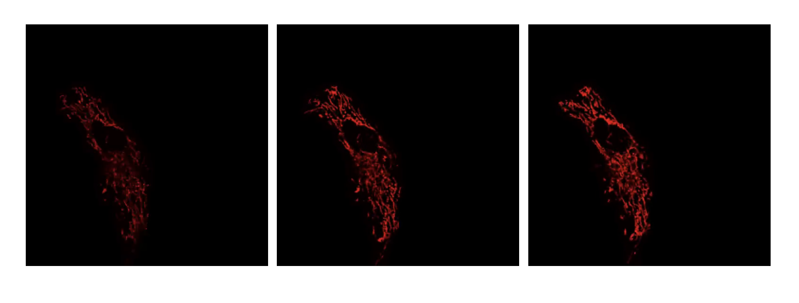
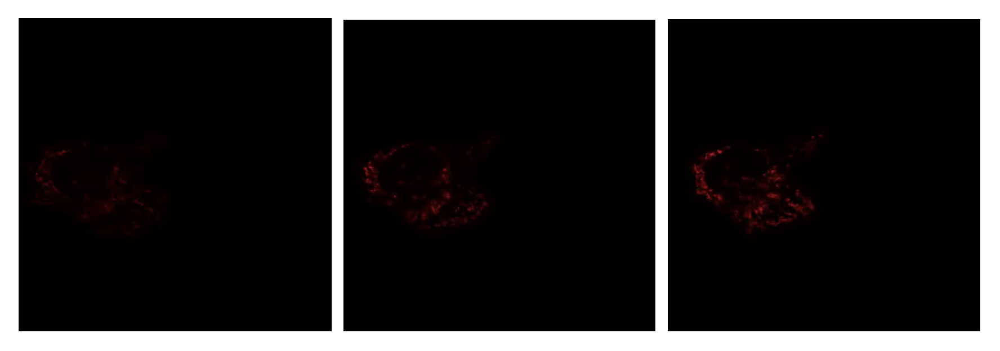

:author: Neelima Pulagam
:email: np26102@uga.edu
:institution: Department of Computer Science, University of Georgia, Athens, GA 30602 USA

:author: Marcus Hill
:email: marcdh@uga.edu
:institution: Department of Computer Science, University of Georgia, Athens, GA 30602 USA

:author: Mojtaba Fazli
:email: Mojtaba@uga.edu
:institution: Department of Computer Science, University of Georgia, Athens, GA 30602 USA

:author: Rachel Mattson
:email: rachel.mattson@uga.edu
:institution: Department of Cognitive Science, University of Georgia, Athens, GA 30602 USA

:author: Meekail Zain
:email: meekail.zain@uga.edu
:institution: Department of Computer Science, University of Georgia, Athens, GA 30602 USA

:author: Andrew Durden
:email: andrewdurden@uga.edu
:institution: Department of Computer Science, University of Georgia, Athens, GA 30602 USA

:author: Frederick D Quinn
:email: fquinn@uga.edu
:institution: Department of Infectious Diseases, University of Georgia, Athens, GA 30602 USA

:author: S Chakra Chennubhotla
:email: chakracs@pitt.edu
:institution: Department of Computational and Systems Biology, University of Pittsburgh, Pittsburgh, PA 15232 USA

:author: Shannon P Quinn
:email: spq@uga.edu
:institution: Department of Computer Science, University of Georgia, Athens, GA 30602 USA
:institution: Department of Cellular Biology, University of Georgia, Athens, GA 30602 USA

:bibliography: references

:corresponding:

--------------------------------------------------------------------------------------------------------------
Classification of Diffuse Subcellular Morphologies
--------------------------------------------------------------------------------------------------------------

.. class:: abstract

Characterizing dynamic sub-cellular morphologies in response to perturbation remains a challenging and important problem. Many organelles are anisotropic and difficult to segment, and few methods exist for quantifying the shape, size, and quantity of these organelles. The OrNet (Organelle Networks) framework models the diffuse organelle structures as social networks using graph theoretic and probabilistic approaches. Specifically, this architecture tracks the morphological changes in mitochondria because its structural changes offer insight into the adverse effects of pathogens on the host and aid the diagnosis and treatment of diseases; such as tuberculosis. The OrNet framework offers a segmentation pipeline to preprocess confocal imaging videos that display various mitochondrial morphologies into social network graphs. Earlier methods of anomaly detection in organelle structures include manual identification by researchers in the biology domain. Although those approaches were successful, manual classification is time consuming, tedious, and error-prone. Existing convolutional architectures do not have the capability to adapt to general graphs and fail to represent diffuse organelle morphologies due their amorphous characteristic. Thus, we propose the two different methods to perform classification on these organelles that captures their dynamic behaviors and identifies the fragmentation and fusion of mitochondria. One is a graph deep learning architecture, and the second is an approach that finds a graph representation for each social network and uses a traditional machine learning method for classification. Recent studies have demonstrated graph neural network models perform well on time-series imaging tasks, and the graph architectures are better able to represent amorphous and spatially diffuse structures such as mitochondria. Alternatively, much research has established traditional machine learning methods to be promising and robust models. Testing and comparing different architectures and models will effectively improve the robustness of categorizing distinct structural changes in subcellular organelle structures that is very useful for identifying infection patterns, offering a new way to understand cellular health and dynamic responses. 

Introduction
------------

Automation of cell classification remains to be a challenging but very important problem that offers significant benefits to immunology and biomedicine. Specifically, classification of sub cellular perturbations can help characterize healthy cells from infected cells. Morphological changes of sub cellular organelles play a vital role in providing insight into infection patterns :cite:`Ramond_2019`.

Tuberculosis (TB), a bacterial disease that mainly infects the lungs, causes structural changes to the mitochondria of cells that have been infected. :cite:`Delogu2013`.This ancient disease, although curable and treatable, can be fatal when not diagnosed properly and remains to be the world’s leading infectious disease killer having claimed 1.4 million lives in 2019 alone. Each following year brings rising cases of drug resistant TB, with more than 10 million people falling ill with active TB each year. A deeper understanding of the pathogenic processes associated with new infections will allow for the development of effective drug regimens. Although much research has been conducted on the disease, there are many questions on the mechanisms of pathogenesis that remain unanswered. Automating the process of classification offers a faster way to study the rising number of mutations of the Mtb pathogen which will help with the development of treatment plans and vaccines :cite:`Delogu2013`.

Recent advancements in fluorescence microscopy and biomedical imaging have offered new ways to analyze these pathogens and their effects on cell health :cite:`durden18`. Previous studies have proposed artificial intelligence based cell classifiers using convolutional neural networks :cite:`oei_2019` , :cite:`yao_2019`. These networks had a few shortcomings due to the diversity of cells in any system and the studies in modeling different biological phenomena have been disproportionate. Most segmentation tasks deal with morphologies of cells and nuclei. These structures are much easier to segment, model and track than spatially diffuse structures such as mitochondria. Mitochondria act as significant signaling platforms in the cell whose dynamics modulate in response to pathogens to maintain their environment :cite:`Ramond_2019`. Infections induce mitochondrial changes and automating the classification of these anomalies will lead to more knowledge on the morphological changes which can further help create targeted therapies. 

 
We propose two methods to classify mitochondria based on their dynamics by representing the subcellular structures as social network graphs. Graphs offer an effective way to represent the amorphous mitochondrial structures and capture the different spatial morphologies. Furthermore, machine learning on graphs is becoming a very relevant and ubiquitous task that has made significant contributions to deep learning, helping find solutions to several problems in the biomedicine domain. 

We analyze the cells of the last frame of the video data that portray the cells after the fusion or fission event to classify which structural change has occurred. We explore two methods that utilize graph machine learning and have proven to be effective in characterizing morphological events given only the last frame of the video. The first involves using an aggregate statistic that acts as a graph representaion and a traditional classifier to sort the different frames. The next method involves a graph neural network architecture that utilizes graph convolutional and pooling layers to categorize the different frames. Both methods show to be effective methods for classifying the different classes of mitochondira.  

   The first, middle and last frames on a control cell with no chemical exposure. :label:`fig1`

.. figure:: llo.png
   :scale: 45%
   :figclass: w
   :align: center

   The first, middle and last frames on an cell exposed to listeriolysin O (llo). The frames show the resulting fragmentation. :label:`fig23`

   The first, middle and last frames on an cell exposed mitochondrial- division inhibitor 1 (mdivi). The frames show the resulting fusion. :label:`fig3` 

Background
----------

Mitochondria
++++++++++++

Mitochondria are double-membrane organelles that act as the powerhouse of the cell because they generate a high amount of Adenosine triphosphate (ATP), an energy-carrying molecule that is essential for many fuctions and processes in living cells, modulate programmed cell death pathways :cite:`Ramond_2019`.  One of their critical roles includes shaping the functions of immune cells during infection. Their network structure allows for the dynamic regulation which is necessary to maintain a functional state and allows the mitochondria to be morphologically and functionally independent within cells :cite:`Karbowski_2003`. These morphologies ,fission and fusion, are common events in mitochondria allowing it to continuously change and adapt in response to changes in energy and stress status. Mitochondrial fission, characterized by the cell dispersing and fragmenting over time, allows for damaged organelles to have a quick turnover and fusion allows for the mitochondria to continuously adapt to environmental needs. The fusion of mitochondria is characterized by the mitochondria fusing togheter allowign the mitochondria to merge with other mitochondria that have different defects than itself. Additionally, frequent fusion and fission within the dynamic network is a sign of efficient mitochondrial DNA (mtDNA) complementation as a result of fusing mitochondria which allows for the exchange of genomes :cite:`Karbowski_2003`. These functions are regulated by the frequency of fusion and fusion events. Studies show that the rate of these changes serves as the efficient means of maintaining a good cell environment :cite:`liu_2020`. An excess of either function could lead to mitochondrial fragmentation, a sign of cell dysfunction.

Anomalies in a cell’s dynamics are very telling of the health of a cell and could be a result of toxic conditions. In recent studies, it has been shown that pathogens attack the host by disturbing the metabolic hub of the cell that is mitochondria. Evidence suggests some pathogens interfere with the mitochondrial network to favor their own replication. Bacteria induce rapid mitochondrial fragmentation by releasing listeriolysin O (LLO) into the mitochondria which causes membrane potential loss and eventually a drop in ATP production :cite:`Reishi_2019`. Mitochondria and their dynamics not only help regulate the cell environment but also play a huge role in controlling cell functions during pathogen invasion. Studying the disturbance in these mitochondrial dynamics could help track and detect infections in a quicker manner. Changes in the mitochondria network requires effective detection, and modeling them as a social network and applying graph classification offers a viable solution.

Cell Classification
+++++++++++++++++++
Advancements to microscopy and deep learning has led way to a new generation of cell and cell morphologies classification techniques. More recently, image based analyses have advanced past single cell classification and are able to allow morphological profiling as seen in :cite:`Meng_2019`. :cite:`Meng_2019` examines the advantages and challenges of different machine learning algorithms useful for large-scale label free multi-class cell classification tasks which would be applicable to a diverse set of biological applications ranging from cancer screening to drug identification. The authors propose a single cell classification network that uses a convolutional neural network (CNN) architecture and compare it against traditional methods such as k-nearest neighbors and support vector machines. The CNN architecture proves to be an effective method for human somatic cell types and their morphologies. These morphologies are easier to segment and analyze than spatially diffuse structures like mitochondria. 

Transfer learning has also given rise to novel advancements and shows much promise in cell classification tasks :cite:`Moran_2018`. :cite:`Moran_2018` utilizes a hybrid between generative adversarial networks (GANs) and transfer learning dubbed transferring of pertained generating adversarial networks (TOP-GAN) to classify various cancer cells. This approach tackles the main bottleneck of deep learning, small training datasets. To cope with the problem, :cite:`Moran_2018` suggests using a large number of unclassified images from other cell types. This solution is valid only for the context of a few problems. The problem is another label-free multi-class classification problem trying to categorize different types of healthy and unhealthy cancer cells. The context of the problem allows the model to train on a variety of different cells which can then be applied to classify several other types of cells. 

Our problem, although having a relatively small data size, does not allow to generalize between different cells. We propose a model that uses only the spatial-temporal aspects of subcellular organelles, in this case the last frames of videos tracking the fusion and fission events, to classify between healthy and unhealthy cells. 

Another transfer learning method that deals specifically with classifying organelle morphology is :cite:`Li_2021`. This approach applies CNNs and their advantages of automatic feature engineering and invariance of learning non-linear, input-output mapping to predict morphological abnormalities in plant cells.  :cite:`Li_2021` looks at the morphologies of three different subcellular organelles in plant cells, chloroplasts, mitochondria, and peroxisomes to categorize abnormal perturbations. This results in three different types of images for each class with numerous organelles distributed across every image. Nine variants of five different CNN-based models were tested, Inception-v3 :cite:`Szegedy_2015`, VGG16 :cite:`Simonyan_2015`, ResNet :cite:`He_2016`, DenseNet220 :cite:`Huang_2017`, and MobileNet-v2 :cite:`Sandler_2018`, all of which proved to be effective methods. 

Our problem deals primarily with using mitochondria to categorize anomalies in the cell. Plant cells and their functions vary largely compared to human cells. Most work in cell classification, thus far, deals largely with image data as is and utilizes a CNN or hybrid architecture due to their advantages for analyzing visual imagery. We leverage the principles of graph theory to model the mitochondrial patterns as a social network to study the changing topology of the graphs. Additionally, we look to apply a supervised single-class classification to single frames of mitochondria after a morphological change has occurred. 

Graph Learning 
++++++++++++++
Graph machine learning has been drawing increasing attention in recent years due to its versatility and numerous applications especially in biomedical research. Graphs offer a unique way to represent complex systems as set of entities (vertices) and relationships (edges) :cite:`Zhou_2020`. Graphs are able to capture the relationships between several biological entities including cells, genes, molecules, diseases and drugs. This area of deep learning has been showing much promise in modeling the interactions of various cell functions. In our work, we propose classification in a lesser known setting, categorizing the graph as a whole to categorize the different morphologies by analyzing their topologies. Thus, we explored a couple graph neural networks (GNNs), a class of deep learning methods designed to perform inference on graph data :cite:`Battaglia_2018`. GNNs have proven to be very robust models because they are able to generalize to adapt to dynamic graphs and new unseen graphs. Following the success of word embeddings, node embeddings rose to prominence with DeepWalk :cite:`Perozzi_2014`, an embedding method often referred to as the first graph embedding for representation learning :cite:`Zhou_2020`. 

One of our methods does employ a simple embedding method based extracting graph feature information using node feature statistics. Although :cite:`Hamilton_2017` explains these traditional methods to be  limited and sometime inflexible, the method showed favorable results in our experiments. Several new methodologies to produce embeddings followed after DeepWalk but the methods  suffer a few drawbacks: node embeddings are computationally inefficient because the number of parameters increased with number of nodes as a result of no shared parameters and the direct embeddings lacked the ability to generalize to a new data. As a means to solve these problems and drawing inspiration to generalize CNNs, GNNs were proposed to aggregate information from the graph structure and better capture the elements and dependencies of the graphs. 

There are two main operations at the core of GNNs, convolution and pooling layers. Convolution layers are used to learn a non-linear transformation of the input graphs perform message passing between the nodes and their neighborhoods. Pooling layers aim to reduce the number of nodes in the graph into a single vector representation and have a similar role to pooling in traditional convolutional neural networks for learning hierarchical representations :cite:`Grattarola_2020`.

Because of their general nature, graph neural networks are applicable to three different tasks: node level tasks, link level tasks and graph level tasks. The most applicable task for our problem context is graph level because we attempt to perform classification of graph structures, where each whole graph is assigned a label.

For the context of our problem we utilize graph convolution operations defined by graph convolutional networks in :cite:`Kipf_2016` and a GCS layer operations used to build graph neural networks with convolutional auto-regressive moving average filters also known as ARMA filters :cite:`Bianchi_2021`. 

Data
----

Microscopy Imagery
++++++++++++++++++
The data consists of a series of live confocal imaging videos that portray the various mitochondrial morphologies in HeLA cells. Figures :ref:`fig1` , :ref:`fig23` and :ref:`fig3` show the raw images of the first, middle and last frames of cells that belong to three different classes.  For visualization purposes, the cell was transfected with the DsRed2-Mito-7 protein which gives the mitochondria a red hue. Three different groups of cells with different dynamics were captured: a group experiencing fragmentation from being exposed to toxin listeriolysin O (llo) as seen in figure ref:`fig23`, another group experiencing fusion as a result of being exposed to mitochondrial- division inhibitor 1 (mdivi) as seen in figure :ref:`fig3` and finally a control group that was not exposed to any chemical as seen in figure :ref:`fig1`. All the videos were taken using a Nikon A1R confocal microscope. The camera captured 20,000 frames per video with dimensions 512x512 pixels, i.e one image every 10 seconds for the length of the video. All the cells were kept at a temperature of 37 degrees C and 5% CO2 levels for the duration of imaging. 

Graph Data
++++++++++
From the 114 videos, we take the last frame and create node features for each single cell video. The dataset we used to train and test our methods contains a node feature matrix and an adjacency matrix for last frames of 114 videos. 

The existing OrNet [#]_ frameworks utilizes Gaussian mixture models (GMMs) to construct the social networks graphs. GMMs were used to determine the spatial regions of the microscope imagery that constructed mitochondrial cluster graphs by iteratively updating the parameters of the underlying mixture distribution until they converged.  The parameters of the mixture distributions, post convergence, were used to construct the social network graph :cite:`durden18`, :cite:`Hill_2020`, :cite:`Fazli_2020`. The Gaussian mixture components update over each frame to track the morphologies and the last frames show the social network graph of Gaussians after a series of events. It is for this reason, we use the last frames as the mixture components in the last frame are most indiative of the morphology.

.. [#]  https://github.com/quinngroup/ornet

The nodes in the graph correspond to the gaussian mixture components, and the statistics that describe each mixture distribution act as the features. The Gaussian distributions are 2-dimensional, because they model the spatial locations of mitochondrial clusters in the microscopy imagery. Intuitively, the five node features correspond to the location of the Gaussian, the shape of its distribution, and the density of the mitochondrial cluster. Computationally, the location of the gaussian is represented by the pixel coordinates of the center of the distribution, which corresponds to the means of both dimensions; the shape is defined by the variance of each dimension; and the density of the mitochondrial cluster is represented by the number of pixels that are "members" of the mixture component, meaning it is more probable that those pixel belong to the given mixture distribution than any of the others.

After the data preprocessing, there are 114 feature matrices of the shape [N,5] where N is the number of nodes in the mitochondrial cluster and a fully connected adjacency matrix of shape [N,N] that belong to one of three classes: llo which indicates a fusion event, mdivi which indicates a fission event and control, which indicates no abnormal morphology. Both the feature matrix and the adjacency matrix serve as the input to the GNN and there is a target variable associated with each input either 1 or 0 depending on the context of the problem. 

Methodology
-----------

To contextualize the empirical results, we split the problem up into two different binary classification problems. One problem is to differentiate between the fusion and fission events, i.e categorize between llo and mdivi groups. And the second is to categorize between the fusion event and no abnormal changes i.e, categorize between llo and control and between mdivi and control. 

GNN
+++
We trained two different architectures one for each of the two classification problems at hand. One involves a GCN and second is a  slightly altered GCN architecture with a trainable skip connection called a GCS layer :cite:`Bianchi_2021`. Each of the GCN and GCS layers were followed by a MinCut Pooling layer :cite:`Bianchi_2019_Mincut` to get a more refined graph representation after each layer. The models accept a node feature matrix, X, and an adjacency matrix, A; each matrix individually is uninformative to the model but combined they provide the model with enough information about the graph structure. 
The GCS filter operation is similar to :cite:`Kipf_2016` with an additional skip connection which has shown to sometimes be more applicable to graph classification. The generally known GCN convolution operation looks like the following,

.. math::
	 \bar{X}^{t+1} = \sigma(LX^{(t)}W^{(t)}) 
 
where :math:`\sigma` is the non linear activation function, :math:`W^{(t)}` is the weight matrix at t-th neural network layer and :math:`L` is the graph Laplacian which can be computed using the normalized grpah adjacency matrix :math:`\hat{A}` and identiy matrix :math:`I`. :math:`L = I-\hat{A}`

The GCS operation which has an additional skip connection looks like the following

.. math::
	\bar{X}^{t+1} = \sigma(LX^{(t)}W^{(t)} + XV)

where :math:`\sigma` is the non linear activation function that can be ReLU, sigmoid or hyperbolic tangent (tanh) functions. W and V are trainable parameters. :math:`L` is the graph Laplacian which can be computed using the normalized grpah adjacency matrix :math:`\hat{A}` and identiy matrix :math:`I`. :math:`L = I-\hat{A}`
Each GCS layer is localized in the node space, and it performs a filtering operations between the local neighboring nodes through the skip connection and the initial node features X :cite:`Bianchi_2021`.

.. raw:: latex

   \begin{table*}
   \centering
   \begin{longtable*}{llllllll}
                           &                & \multicolumn{2}{l}{}           & \multicolumn{2}{l}{}       & \multicolumn{2}{l}{}           \\
                           &                &       &                        &       &                    &       &                        \\
                           &                &       &                        &       &                    &       &                        \\
                           & Accuracy       & \multicolumn{2}{c}{Precision~} & \multicolumn{2}{c}{Recall} & \multicolumn{2}{c}{F-1 Score}  \\
                           & -              & Mdivi & LLO                    & Mdivi & LLO                & Mdivi & LLO                    \\
   Median - Random Forest  & 0.770          & 0.908 & 0.739                  & 0.500 & 0.959              & 0.624 & 0.832                  \\
   Mean - Random Forest    & 0.743          & 0.871 & 0.718                  & 0.452 & 0.948              & 0.574 & 0.814                  \\
   Min - Random Forest     & \textbf{0.812} & 0.893 & 0.792                  & 0.629 & 0.941              & 0.721 & 0.857                  \\
   Max - Random Forest     & 0.707          & 0.824 & 0.687                  & 0.374 & 0.939              & 0.494 & 0.791                  \\
   Median - Decision Trees & 0.764          & 0.890 & 0.737                  & 0.495 & 0.952              & 0.613 & 0.828                  \\
   Mean - Decision Trees   & 0.741          & 0.860 & 0.718                  & 0.455 & 0.941              & 0.572 & 0.812                  \\
   Min - Decision Trees    & 0.781          & 0.866 & 0.762                  & 0.565 & 0.931              & 0.664 & 0.835                  \\
   Max - Decision Trees    & 0.720          & 0.825 & 0.702                  & 0.418 & 0.932              & 0.531 & 0.798                  \\
   Median - kNN            & 0.670          & 0.588 & 0.752                  & 0.662 & 0.676              & 0.615 & 0.705                  \\
   Mean - kNN              & 0.747          & 0.718 & 0.778                  & 0.650 & 0.815              & 0.669 & 0.790                  \\
   Min - kNN               & 0.702          & 0.610 & 0.795                  & 0.725 & 0.686              & 0.659 & 0.732                  \\
   Max - kNN               & 0.579          & 0.479 & 0.646                  & 0.464 & 0.659              & 0.462 & 0.647                 
   \end{longtable*}
   \caption{Results for Mdivi vs. LLO task using traditional classifiers and SMOTE oversampling technique \DUrole{label}{mdivi-llo-smote}}
   \end{table*}

.. raw:: latex

   \begin{table*}
   \centering
   \begin{tabular}{llllllll}
                           & Accuracy       & \multicolumn{2}{c}{Precision~} & \multicolumn{2}{c}{Recall} & \multicolumn{2}{c}{F-1 Score}  \\
                           & -              & Control & LLO                  & Control & LLO              & Control & LLO                  \\
   Median - Random Forest  & 0.745          & 0.835   & 0.733                & 0.413   & 0.944            & 0.530   & 0.823                \\
   Mean - Random Forest    & 0.780          & 0.937   & 0.752                & 0.446   & 0.979            & 0.581   & 0.849                \\
   Min - Random Forest     & 0.739          & 0.819   & 0.730                & 0.403   & 0.941            & 0.517   & 0.820                \\
   Max - Random Forest     & \textbf{0.826} & 0.927   & 0.804                & 0.586   & 0.970            & 0.696   & 0.876                \\
   Median - Decision Trees & 0.749          & 0.837   & 0.737                & 0.421   & 0.945            & 0.536   & 0.826                \\
   Mean - Decision Trees   & 0.763          & 0.875   & 0.746                & 0.439   & 0.958            & 0.559   & 0.836                \\
   Min - Decision Trees    & 0.721          & 0.757   & 0.721                & 0.393   & 0.918            & 0.493   & 0.805                \\
   Max - Decision Trees    & 0.814          & 0.923   & 0.791                & 0.555   & 0.969            & 0.671   & 0.869                \\
   Median - kNN            & 0.636          & 0.512   & 0.714                & 0.509   & 0.712            & 0.500   & 0.708                \\
   Mean - kNN              & 0.703          & 0.635   & 0.739                & 0.500   & 0.825            & 0.545   & 0.776                \\
   Min - kNN               & 0.634          & 0.504   & 0.711                & 0.493   & 0.719            & 0.488   & 0.710                \\
   Max - kNN               & 0.560          & 0.391   & 0.651                & 0.388   & 0.664            & 0.382   & 0.652               
   \end{tabular}
   \caption{Results for Control vs. LLO task using traditional classifiers and SMOTE oversampling technique \DUrole{label}{control-llo-smote}}
   \end{table*}

.. raw:: latex

   \begin{table*}
   \centering
   \begin{tabular}{llllllll}
                           & Accuracy       & \multicolumn{2}{c}{Precision~} & \multicolumn{2}{c}{Recall} & \multicolumn{2}{c}{F-1 Score}  \\
                           & -              & Control & Mdivi                & Control & Mdivi            & Control & Mdivi                \\
   Median - Random Forest  & \textbf{0.781} & 0.905   & 0.731                & 0.637   & 0.924            & 0.731   & 0.811                \\
   Mean - Random Forest    & 0.750          & 0.876   & 0.705                & 0.595   & 0.905            & 0.688   & 0.786                \\
   Min - Random Forest     & 0.755          & 0.904   & 0.704                & 0.580   & 0.931            & 0.685   & 0.795                \\
   Max - Random Forest     & 0.763          & 0.890   & 0.717                & 0.610   & 0.916            & 0.704   & 0.798                \\
   Median - Decision Trees & 0.734          & 0.888   & 0.683                & 0.546   & 0.921            & 0.653   & 0.778                \\
   Mean - Decision Trees   & 0.731          & 0.865   & 0.686                & 0.562   & 0.900            & 0.659   & 0.772                \\
   Min - Decision Trees    & 0.719          & 0.869   & 0.670                & 0.524   & 0.913            & 0.630   & 0.767                \\
   Max - Decision Trees    & 0.737          & 0.870   & 0.692                & 0.566   & 0.908            & 0.664   & 0.778                \\
   Median - kNN            & 0.613          & 0.692   & 0.591                & 0.433   & 0.794            & 0.512   & 0.671                \\
   Mean - kNN              & 0.691          & 0.726   & 0.677                & 0.602   & 0.781            & 0.648   & 0.719                \\
   Min - kNN               & 0.576          & 0.600   & 0.566                & 0.444   & 0.708            & 0.496   & 0.622                \\
   Max - kNN               & 0.596          & 0.590   & 0.604                & 0.555   & 0.637            & 0.563   & 0.611               
   \end{tabular}
   \caption{Results for Control vs. Mdivi task using traditional classifiers and SMOTE oversampling technique \DUrole{label}{control-mdivi-smote}}
   \end{table*}

The graph convolution layer of each model is followed by the MinCut Pooling layer :cite:`Bianchi_2019_Mincut`. This method is based on the minCUT optimization problem which finds a cut of the graph that still preserves the topology and representation of the graph. It computes a soft clustering of the input graphs and outputs a reduced node features and adjacency matrix. The dimensions are reduced to the parameter k which is specified when calling the pooling layer. 
Finally, the last layer of both architectures is a global pooling architecture that pools the graph by computing the sum of the inputs node features. Then the model is through a Dense layer, a fully connected output layer 
The architectures were trained using Adam optimizer, and L2 penalty loss with weight 1e-3 and 16 hidden units. The GCS layers used a tanh activation function. The MinCut pooling layer is set to output N/2 nodes in the first layer and N/4 at the second layer and N is the average order of the graphs in the dataset. The Dense layer used a sigmoid activation function and we used binary cross entropy for the loss. The models ran for 3000 epochs.

Graph level features using node statistics
++++++++++++++++++++++++++++++++++++++++++

This approach deals with finding a good graph representation by using a method similar to bag of nodes. Because the available number of graphs for each class are limited, we create a graph feature by reducing the node features to a vector of statistics. We created four different statistics to act as the graph features: min, max, mean and median. Meaning, for each of the node features, one aggregate statistic (min, max, mean or median) is applied to create a vector of size 5 that would serve as an input for the classifiers. After all the data instances are reduced to a vector, we apply a stratified split using an 80-20 train-test-split. Note, the stratified split preserves the proportions of the classes. This is done before any oversampling technique to ensure that all the samples used for testing are from the original data. Then for the training set we apply the synthetic minority oversampling technique (SMOTE) to oversample the minority classes as a solution to combat the class imbalance. A dataset with imbalanced classes such as the case in this problem could keep a classifier from effectively learning the decision boundary. SMOTE :cite:`Chawla_2003` does not simply duplicate the elements of the minority class but rather synthesizes new instances. This unique oversampling technique selects examples that are close to the original elements in the feature space by drawing a line between two random existing instances and creating a new instance at a point along the line. This method is very effective because the new samples that are created are realistic instances of the minority class and it helps balance the class distributions. We used oversampled graph features as input data for three traditional machine learning algorithms to classify the features into a specific class, k-nearest neighbors, decision tree classifier and random forest classifier. 

Experiments and Results
-----------------------

We test the performance of our methods on three different classification tasks: (i) categorize between the last frame images of mitochondria that have been exposed to toxin listeriolysin (class llo) and mitochondria that have been exposed to mitochondrial- division inhibitor 1 (class mdivi), (ii)categorize between the last frames of mitochondria that have been exposed to toxin listeriolysin (class llo) and mitochondria that was exposed to no external stimuli to serve as a control group (class control) and (iii) categorize between  mitochondria that have been exposed to mitochondrial- division inhibitor 1 (class mdivi) and mitochondria that was exposed to no external stimuli to serve as a control group (class control).
The three classification problems help evaluate all possible differences in the morphologies. Both classification tasks that deal with distinguishing between class llo versus class control and class mdivi versus class control are meant to explore whether our methods can distinguish between anomalous and healthy cells. The classification task that deals with llo and mdivi data investigates whether the methods can distinguish between two different types of anomalies (fusion and fission). 

Due to the class imbalance and relatively small size of the dataset, (llo had 54 instances, mdivi had 31 instances and control had 29 instances) we decided to take two different approaches for the methods. One solution was to downsample the llo class which is the majority class to help the GNN methods. We also used this downsampling method for the traditional classifiers to compare the different methodologies effectively. Specifically, this downsampling technique was chosen to keep the model from randomly guessing the llo class for every test instance. Therefore, 19 frames of each of the three classes were used for training and 12 frames were used for testing. The sequence of frames that were in the training and test sets for each run varied as they were randomly subsampled for each time. We used two GNN architectures and three different classifiers with four aggregate stattistics resulting in twelve traditonal methods total. 

Alternatively, we utilized an oversampling technique on the input data, which consited of the graph representation vectors, for the traditional classifiers. The input data for the traditional classifiers was first split into training and test sets. Eigty percent of each class was reserved for testing and the remaining twenty perenct for testing. The frames chosen for training and test set for each run were randomly subsampeld for each run. Then sythetic minority oversampling technique (SMOTE) was applied to the data reserved for training to balance the classes. After oversampling, the training set for the Llo-Control classification problem had 44 samples of each class and the test set had 6 control instances and 10 llo instances. The Mdivi-Llo task also had 44 instances of each class in the training set and had a test set consisting of 7 mdivi instances and 10 llo. Lastly, the Mdivi-Control task had 25 instances of each class for training and 6 instances of each respective class for testing. The train-test split was applied prior to oversampling to ensure that only real data points are used for testing. Oversampling was only possible with the data for the traditonal methods as it is not possible to apply an oversampling technique to create entire graphs and their node features. The input data for GNNs is a graph and its node features. Furthermore, the shape of each graph varied based on the instance which would make oversampling difficult and ineffective at producing new data instances.

Both the traditional classifier and GNN methods fully train on the test set and evaluate on the testing set. We measured the number of correctly classified instances of each model and used the accuracy as the main metric to evaluate the performance of our models. Additionally, we include the precision, recall and F-1 scores for each class to show the statistical significance of the results. 

Tables :ref:`mdivi-llo-smote`, :ref:`control-llo-smote`, :ref:`control-mdivi-smote` contain the results for oversampled data using traditional classifiers. Table :ref:`mdivi-llo-smote` shows the results for classifying mdivi and llo data instances using oversampling with SMOTE. For this task, random forest classifer using the min aggregate statistic produced the best results with an accuracy of 0.812. Table :ref:`control-llo-smote` shows the results for classifying llo and control data instances using oversampling with SMOTE. Max random forest had the performed in distinguishing control versus llo frames with an accuracy of 0.826. Table :ref:`control-mdivi-smote` shows the results for classifying mdivi and control data instances using oversampling with SMOTE with Median-Random Forest having the highest accuracy at 0.781.

Tables :ref:`llo-mdivi`, :ref:`control-llo`, :ref:`control-mdivi` contain the results for of the traditional classifiers and the graph neural network architectures with the downsampled data. Table :ref:`llo-mdivi` shows the results for control-llo classification task with Max-Random Forest and GNNs with GCS layers having best accuracy of 0.68 and 0.686 respectively. Table :ref:`llo-mdivi` shows the results for mdivi-llo classificaiton. This task had four methods that had the best accuracy, GNN with GCS layers with an accuracy of 0.736 and Mean-Random Forest, Median-Decision trees and Max-kNN all three of which had an accuracy of 0.73. Lastly, table :ref:`control-mdivi` shows the results for Mdivi-control classification. The highest accuracy for this task was Min-Random Forest with an accuracy of 0.619.

Discussion
----------

Overall, both methods have proven to be effective in classifying anomalies in mitochondria. The methods also prove that the node features effectively capture the properties of three different organelle morphologies and graphs are an effective way to represent mitochondria. It is clear from the results that oversampling the data is a good way to train the models well and make better predictions. So, it is worth noting that especially the deep learning models, which are known to be extremely data hungry, could benefit even more so from having more data. 

When the data is oversampled, the random forest classifier performs well consitently but the aggregate statistic varies for each task. It is also interesting to note that the recall metric is disproportionately better for one class in every task. For llo-mdivi and llo-control tasks, this can potentially be attributed to oversampling the minority class and the majority class, which is llo in both cases, having more real data instances.

When the data was downsampled, there was a considerable drop in performance as depicted by tables :ref:`llo-mdivi`, :ref:`control-llo`, :ref:`control-mdivi`. In this sampling method, the recall scores for the two classes in all three tasks appear to be closer which can again be potentially be attributed to training on all real data. The best metrics varied across each of the tasks. Graph deep learning methods performed well in the control-llo task and mdivi-llo task. Random forest continued to oupefrom most methods except for the mdivi-llo task, in which Max-kNN and Median-decision trees had high accuracies. 

Conclusion
----------

Healthy dynamics of subcellular organelles are vital to their metabolic functions. Identifying anomalies in the dynamics is a challenging but important task. In this work, we propose two approaches to classifying different cell morphologies utilizing only the last frames of videos capturing mitochondrial fusion and fission. One method takes the node features and applies a general statistic to make one graph level feature to serve as input for a traditional classifier.  Another approach proposes using a graph neural network architecture to perform graph classification that take in a node feature matrix and an adjacency matrix as inputs. We show that both approaches are effective ways to classify between anomalous and regular mitochondria and between two different types of anomalous morphologies. Furthermore, we prove graph neural networks show much promise in classifying and perhaps even tracking the mitochondria and their morphologies. 

.. raw:: latex

   \begin{table*}
   \centering
   \begin{tabular}{llllllll}
                           & Accuracy & \multicolumn{2}{c}{Precision~} & \multicolumn{2}{c}{Recall} & \multicolumn{2}{c}{F-1 Score}  \\
                           & -        & Control & LLO                  & Control & LLO              & Control & LLO                  \\
   GNN with GCS Layers     & 0.59     & 0.58    & 0.6                  & 0.59    & 0.59             & 0.58    & 0.59                 \\
   GNN with GCS Layers     & \textbf{0.686}    & 0.5     & 0.83                 & 0.75    & 0.62             & 0.6     & 0.71                 \\
   Median - Random Forest  & 0.59     & 0.6     & 0.58                 & 0.55    & 0.64             & 0.57    & 0.61                 \\
   Mean - Random Forest    & 0.45     & 0.44    & 0.46                 & 0.36    & 0.55             & 0.4     & 0.5                  \\
   Min - Random Forest     & 0.41     & 0.38    & 0.43                 & 0.27    & 0.55             & 0.32    & 0.48                 \\
   Max - Random Forest     & \textbf{0.68}     & 0.7     & 0.67                 & 0.64    & 0.73             & 0.67    & 0.7                  \\
   Median - Decision Trees & 0.59     & 0.6     & 0.58                 & 0.55    & 0.64             & 0.57    & 0.61                 \\
   Mean - Decision Trees   & 0.55     & 0.54    & 0.56                 & 0.64    & 0.45             & 0.58    & 0.5                  \\
   Min - Decision Trees    & 0.5      & 0.5     & 0.5                  & 0.36    & 0.64             & 0.42    & 0.56                 \\
   Max - Decision Trees    & 0.64     & 0.71    & 0.6                  & 0.45    & 0.82             & 0.56    & 0.69                 \\
   Median - kNN            & 0.55     & 0.57    & 0.53                 & 0.36    & 0.73             & 0.44    & 0.62                 \\
   Mean - kNN              & 0.41     & 0.25    & 0.44                 & 0.09    & 0.73             & 0.13    & 0.55                 \\
   Min - kNN               & 0.41     & 0.33    & 0.44                 & 0.18    & 0.64             & 0.24    & 0.52                 \\
   Max - kNN               & 0.41     & 0.38    & 0.43                 & 0.27    & 0.55             & 0.32    & 0.48                
   \end{tabular}
   \caption{Results for Control vs. LLO task using traditional classifiers and GNNs. The data was undersampled meaning the training set had 19 instances of each class and the test set had 11 instances of each class. \DUrole{label}{control-llo}}
   \end{table*}

.. raw:: latex

   \begin{table*}
   \centering
   \begin{tabular}{llllllll}
                           & \multicolumn{1}{c}{Accuracy} & \multicolumn{2}{c}{Precision~} & \multicolumn{2}{c}{Recall} & \multicolumn{2}{c}{F-1 Score}  \\
                           & -                            & Mdivi & LLO                    & Mdivi & LLO                & Mdivi & LLO                    \\
   GNN with GCS Layers     & \textbf{0.736}               & 0.75  & 0.67                   & 0.69  & 0.73               & 0.72  & 0.7                    \\
   GNN with GCS Layers     & 0.58                         & 0.58  & 0.58                   & 0.58  & 0.58               & 0.58  & 0.58                   \\
   Median - Random Forest  & 0.55                         & 0.55  & 0.55                   & 0.55  & 0.55               & 0.55  & 0.55                   \\
   Mean - Random Forest    & \textbf{0.73}                & 0.73  & 0.73                   & 0.73  & 0.73               & 0.73  & 0.73                   \\
   Min - Random Forest     & 0.55                         & 0.55  & 0.55                   & 0.55  & 0.55               & 0.55  & 0.55                   \\
   Max - Random Forest     & 0.45                         & 0.45  & 0.45                   & 0.45  & 0.45               & 0.45  & 0.45                   \\
   Median - Decision Trees & \textbf{0.73}                & 0.78  & 0.69                   & 0.64  & 0.82               & 0.7   & 0.75                   \\
   Mean - Decision Trees   & 0.64                         & 0.71  & 0.6                    & 0.45  & 0.82               & 0.56  & 0.69                   \\
   Min - Decision Trees    & 0.55                         & 0.56  & 0.54                   & 0.45  & 0.64               & 0.5   & 0.58                   \\
   Max - Decision Trees    & 0.55                         & 0.53  & 0.57                   & 0.73  & 0.36               & 0.62  & 0.44                   \\
   Median - kNN            & 0.5                          & 0.5   & 0.5                    & 0.36  & 0.64               & 0.42  & 0.56                   \\
   Mean - kNN              & 0.5                          & 0.5   & 0.5                    & 0.64  & 0.36               & 0.56  & 0.42                   \\
   Min - kNN               & 0.59                         & 0.56  & 0.75                   & 0.91  & 0.27               & 0.69  & 0.4                    \\
   Max - kNN               & \textbf{0.73}                & 0.73  & 0.73                   & 0.73  & 0.73               & 0.73  & 0.73                  
   \end{tabular}
   \caption{Results for Mdivi vs. LLO task using traditional classifiers and GNNs. The data was undersampled meaning the training set had 19 instances of each class and the test set had 11 instances of each class. \DUrole{label}{llo-mdivi}}
   \end{table*}

.. raw:: latex

   \begin{table*}
   \centering
   \begin{tabular}{llllllll}
                           & Accuracy      & \multicolumn{2}{c}{Precision~} & \multicolumn{2}{c}{Recall} & \multicolumn{2}{c}{F-1 Score}  \\
                           & -             & Control & Mdivi                & Control & Mdivi            & Control & Mdivi                \\
   GNN with GCS Layers     & 0.619         & 0.6     & 0.64                 & 0.64    & 0.6              & 0.64    & 0.6                  \\
   GNN with GCN Layers     & 0.57          & 0.6     & 0.55                 & 0.55    & 0.6              & 0.57    & 0.57                 \\
   Median - Random Forest  & 0.55          & 0.56    & 0.54                 & 0.45    & 0.64             & 0.5     & 0.58                 \\
   Mean - Random Forest    & 0.64          & 0.67    & 0.62                 & 0.55    & 0.73             & 0.6     & 0.67                 \\
   Min - Random Forest     & \textbf{0.69}          & 0.69    & 0.68                 & 0.80    & 0.56             & 0.73    & 0.62                 \\
   Max - Random Forest     & 0.55          & 0.57    & 0.53                 & 0.36    & 0.73             & 0.44    & 0.62                 \\
   Median - Decision Trees & 0.55          & 0.56    & 0.54                 & 0.45    & 0.64             & 0.5     & 0.58                 \\
   Mean - Decision Trees   & 0.64          & 0.67    & 0.62                 & 0.55    & 0.73             & 0.6     & 0.67                 \\
   Min - Decision Trees    & 0.55          & 0.55    & 0.55                 & 0.55    & 0.55             & 0.55    & 0.55                 \\
   Max - Decision Trees    & 0.59          & 0.62    & 0.57                 & 0.45    & 0.73             & 0.53    & 0.64                 \\
   Median - kNN            & 0.5           & 0.5     & 0.5                  & 0.45    & 0.55             & 0.48    & 0.52                 \\
   Mean - kNN              & 0.57          & 0.7     & 0.59                 & 0.34    & 0.66             & 0.52    & 0.62                 \\
   Min - kNN               & 0.64          & 0.67    & 0.62                 & 0.55    & 0.73             & 0.6     & 0.67                 \\
   Max - kNN               & 0.55          & 0.57    & 0.53                 & 0.36    & 0.73             & 0.44    & 0.62                
   \end{tabular}
   \caption{Results for Mdivi vs. Control task using traditional classifiers and GNNs. The data was undersampled meaning the training set had 19 instances of each class and the test set had 11 instances of each class.\DUrole{label}{control-mdivi}}
   \end{table*}

