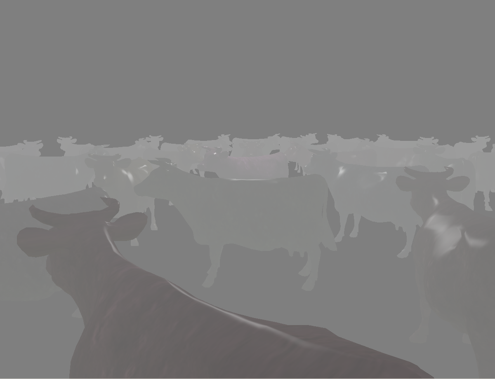
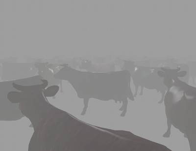
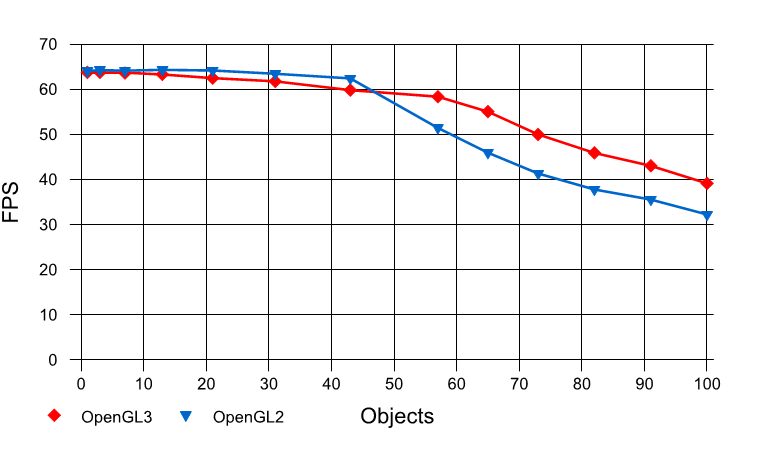

:author: Nick Bray
:email: ncbray@google.com
:institution: Google

------------------------------------------------
PyStream: Compiling Python onto the GPU
------------------------------------------------

.. class:: abstract

PyStream is a static compiler that can radically transform Python code and run it on a Graphics Processing Unit (GPU).  Python compiled to run on the GPU is ~100,000x faster than when interpreted on the CPU.  The PyStream compiler is specially designed to simplify the development of real-time rendering systems by allowing the entire rendering system to be written in a single, highly productive language.  Without PyStream, GPU-accelerated real-time rendering systems must contain two separate code bases written in two separate languages: one for the CPU and one for the GPU.  Functions and data structures are not shared between the code bases, and any common functionality must be redundantly written in both languages.  PyStream unifies a rendering system into a single, Python code base, allowing functions and data structures to be transparently shared between the CPU and the GPU.  A single, unified code base makes it easy to create, maintain, and evolve a high-performance GPU-accelerated application.

.. class:: keywords

   pystream, compiling python, gpu

Introduction
------------

High-performance computer hardware can be difficult to program because ease of programming is often traded for raw performance.  For example, graphics processing units (GPUs) are traditionally programmed in languages that either restrict memory use or explicitly expose the memory hierarchy to the programmer.  The OpenGL Shading Language (GLSL) is an example of the first, and OpenCL is an example of the second.  Neither type of language is particularly easy to use, rather they are designed to address a potential bottleneck for GPU architectures: memory bandwidth.  GPUs pack enough functional units into a single chip that overall performance can easily be limited by the memory subsystem's ability to feed data to the functional units.

Ease of programming is not the only issue when using GPU-specific languages.  These languages are specialized for performance-critical numeric computations and are not suitable for writing a complete application.  For instance, these languages cannot load data from disk or provide a graphical user interface.  Instead, GPU languages typically provide APIs to interoperate with a different, general-purpose language.  Using these APIs results in an application with two code bases, each with distinct semantics.  Additional *glue code* is also required overcome the impedance mismatch between the code bases.  Glue code is used to remap and transfer data structures from one code base to another.  Glue code is also used to invoke functions across the language boundary.

   Naïve background color. :label:`cow-fog-incorrect`

   Background color calculation using shared code. :label:`cow-fog-correct`

Constructing a GPU-accelerated application with two code bases and glue code has a number of software engineering costs.  For instance, any data transferred between the CPU and the GPU must have its structure defined in both languages and have glue code to remap and transfer the data.  Any modification to such a data structure will require modifying all its definitions.  Certain functions may also need to be duplicated so they can be used in each code base.  For example, Figure :ref:`cow-fog-incorrect` shows a rendering system where the background color - calculated on the CPU - does not take into account the color processing performed on the GPU.  Figure :ref:`cow-fog-correct` shows the same rendering system, but with the color-processing code duplicated on the CPU and applied to the background color.  Ultimately, applications that incorporate GPU-specific languages tend to resist change because data structures and functions in two code bases must be kept in sync.  This complicates the process of maintaining and evolving such an application.

PyStream
--------------

PyStream [Bra10]_ is a static source-to-source compiler that translates Python code into GLSL for use in real-time graphical rendering.  PyStream also generates the glue code necessary to seamlessly invoke the generated GLSL code from a Python application.  PyStream allows applications incorporating GPU-accelerated real-time rendering to be written as a single, unified Python code base.  This allows the high productivity of the Python language to be used while also gaining the performance of GPU acceleration.  PyStream  sidesteps the problems that arise from having two code bases, which would otherwise diminish the productivity gains of using Python.

Programming a GPU with Python allows the use of object-oriented programming, polymorphic functions, and other programming language features that are often not available in GPU-specific languages.    Python also has the advantage of being more concise.  In practice, Python code is roughly five to seven times more terse than the corresponding GLSL code.

Language Restrictions
---------------------

PyStream can compile a restricted subset of Python onto the GPU.  Restrictions are necessary to make the compilation process tractable.  Restrictions are also necessary because of the fundamental limitations of modern GPU hardware.  PyStream's restricted subset of Python provides, at minimum, the functionality of GLSL but with the syntax, semantics, and abstraction mechanisms of Python, as well as complete integration with Python applications.  PyStream requires the following to translate code onto a GPU:

* A closed world.
* No global side effects.
* No recursive function calls.
* Bounded memory usage.

To statically compile a Python program, a closed world must be created.  If a program can call a function that the compiler knows nothing about, then the compiler must assume that the function can have arbitrary side effects: rewriting globals, classes, and other data structures.  In such a situation, a static compiler cannot prove anything about the program and therefore cannot transform it in any meaningful way.  To prevent this situation, PyStream disallows the execution of unknown code.  Dynamic code compilation and execution, such as through the use of ``exec`` and ``eval``, is forbidden.  In addition, modules are imported at compile time and assumed to never change thereafter.

GLSL has several restrictions, when compared to Python, and they are adopted by PyStream so that it can generate GLSL code.  For instance, GLSL programs are constrained to have no global side effects.  Code compiled by PyStream must behave the same.  GLSL does not allow recursive function calls because it is designed to run on hardware without a call stack.  This restriction is adopted by PyStream.  Similarly, GLSL is designed to run in an environment where memory is statically allocated for each processor.  PyStream in turn requires that the code it compiles have bounded memory usage, allowing the compiler to statically allocate memory.

In practice, the most significant of these restrictions appears to be the need for bounded memory usage.  This restriction prevents the use of recursive data structures and most mutable ``list``, ``dict``, and ``set`` objects.  For example, if a program appends to a list inside of a loop, the compiler will be unable to determine the maximum size of the list.  Future improvements to the compiler may allow it to bound the number of loop iterations in some cases, this problem is equivalent to the halting problem in the general case.

Most of these restrictions are applied after the compiler optimizes a program.  For example, a highly polymorphic function may initially appear to be recursive, but this recursion can disappear once the function has been duplicated and specialized for the different situations in which it is called.  As will be discussed later, PyStream uses a novel approach for representing Python programs. This approach treats the Python interpreter as part of the program being compiled.  There are often recursive calls through the interpreter, such as when the addition of a vector type is implemented in terms of the addition of its scalar elements.  This pattern is so pervasive that disallowing recursive calls before optimizations are applied would disallow most Python programs.  Problematically, disallowing recursive calls after compilation requires that a programmer must understand how the compiler behaves.  Although this conceit is undesirable, it is necessary.

PyStream currently does not support a number of Python features, including exceptions and closures.  These features will be supported in the future.

PyStream in Practice
--------------------

   An image produced by the example rendering system. :label:`ao-complete`

A real-time rendering system was developed with the PyStream compiler to validate the design of the compiler.  The example rendering system implements the core algorithms used by the game Starcraft 2 [Fil08]_.  Rendering systems typically use many different algorithms to produce a final image.  These algorithms are divided into *shader programs* that that are executed on batches of data sent to the GPU.  The example rendering system contains 8 different shader programs.  A shader programs is further  subdivided into several individual *shaders* that process different kinds of data, such as vertices in a 3D model or pixels being written into an image.  The code for one of the shader programs in the example rendering system is included below.

.. code-block:: python

   class AmbientPass(ShaderProgram):

     def shadeVertex(self, context, pos, texCoord):
       context.position = pos
       return texCoord,

     def shadeFragment(self, context, texCoord):
       # Sample the underlying geometry
       g = self.gbuffer.sample(texCoord)
       # Sample the ambient occlusion
       ao = self.ao.texture(texCoord).xyz
       # Calculate the lighting
       ambientLight = self.env.ambientColor(g.normal)*ao
       # Modulate the output
       color=vec4(g.diffuse*ambientLight, 1.0)
       context.colors = (color,)

This shader program performs a specific kind of lighting calculation for the example rendering system.  PyStream's shader programs are a Pythonic version of GLSL's shader programs.  The previous shader program is implemented as a class that contains two shader methods: a vertex shader and a fragment shader.  The first two arguments for each shader are special.  The ``self`` argument holds data that is constant during the execution of the shader.  The ``context`` argument holds an object with shader-specific fields.  For example, colors written to the ``context.colors`` field inside of a fragment shader will be written into the image(s) being rendered after the shader has been executed.  All subsequent arguments correspond to streams of data being fed into the shader.  Return values correspond to streams of data produced by the shader.

Python's abstraction mechanisms are used throughout the example rendering system.  For instance, algorithms for calculating how light reflects off surfaces are encapsulated in polymorphic ``Material`` objects.  This allows the appearance of a surface to be controlled by composing a shader object with different types of material objects.  Rendering systems often contain custom code generators [Mit07]_ because the GPU-specific language they are using does not natively support polymorphism.

Compiling Python
-----------------

PyStream takes a novel approach to compiling Python that is simpler and more flexible than previous approaches [Sal04], [Pyp11].  The key to PyStream's approach is that it keeps its internal representation of the program it is compiling as simple as possible.  Compiling Python can be potentially complicated because the language is filled with numerous special cases.  For example, adding two objects together can result in the ``__add__`` method being called on the first object, the ``__radd__`` method being called on the second object, or an exception being thrown.  More precisely, the interpreter can do all of the above for a single operation if both methods exist but return ``NotImplemented``.  Calling either method can result in arbitrary code being executed and can have arbitrary side effects, so the precise definition of the addition operator is both complicated and ambiguous.  Any relationship between Python's addition operator and the mathematical concept of addition is a convention and not an intrinsic part of the language.  Virtually every Python operation can execute arbitrary code, even operations such as reading an attribute of an object.

Prior to PyStream, Python compilers attempted to embed extensive knowledge of Python's semantics into their algorithms.  For example, every analysis algorithm and optimization would need to implicitly understand how the interpreter dispatched addition operations.  Typically this knowledge was not precise, and did not cover every corner case.  PyStream takes a different approach. Instead of trying to embed a complete knowledge of Python's semantics into its algorithms, it treats the interpreter as if it were a library being called by the Python program. This allows PyStream to easily and accurately analyze Python's complex semantics without complicating the compiler.  The consequence of this approach is that PyStream appears to process three times as much code as other Python compilers.  This extra code would need to be evaluated one way or the other, PyStream evaluates it explicitly as code rather than implicitly inside the compiler.

Because PyStream treats the interpreter as part of the program,  standard optimizations such as dead code elimination and function inlining are extremely effective at eliminating Python's run time overhead.  Interpreter functions are initially quite complicated, but they are typically optimized down to a single operation and later inlined.  In addition to the standard optimizations, several Python-specific transformations are also performed.  For example,  method calls are optimized to eliminate the creation of bound method objects wherever possible.

Mapping Python onto the GPU
---------------------------

After analyzing and optimizing a program, PyStream then maps it onto the GPU.  One of the biggest challenges in mapping a Python shader program onto the GPU is the presence of memory operations.  GLSL does not support pointers in any form: the address of an objects cannot be taken, and function arguments are passed by value.  Python, on the other hand, hold every object by reference.    PyStream bridges this semantic gap by eliminating as many memory operations as possible and then emulating the rest.

Before even trying to map a program onto the GPU, PyStream aggressively eliminates as many memory operations as possible.  If PyStream can eliminate every memory operation, translating the program into GLSL is trivial.  The optimizations PyStream performs are a mixture of load/store elimination and shader-specific transformations such as flattening the input and output data structures for each shader into a list of local variables.  In practice, these optimization eliminate almost all the memory operations in the example rendering system.

It is not always possible to eliminate every memory operation, however.  PyStream uses two different strategies to emulate the remaining memory operations.  If an object is never modified or is only held by a single reference at a time, PyStream copies the object as needed rather than treating it as a distinct memory location.  If an object is held by multiple references and also modified, PyStream places it in an array of objects and uses an index into the array as a pointer to the object.

Performance
-------------

The example rendering system demonstrates that PyStream is quite effective at compiling Python shaders.  A manual inspection of the generated GLSL code reveals that it is close to what would be written by hand.  Quantitatively, PyStream provides a massive speedup for the compiled shaders.  The following table shows the time taken to draw one million pixels with a Python shader program when it is interpreted on the CPU  versus when it is compiled onto the GPU.  Measurements were taken on a AMD Athlon 64 X2 3800+ CPU with a NVidia 9800 GT GPU running Windows XP and Python 2.6.4.

.. For some reason Miktex doesn't like this table, so a raw version (below)is used instead.
   +-----------+-------------------+----------+
   |  Shader   |   CPU   |   GPU   | Speedup  |
   +===========+=========+=========+==========+
   | material  | 220.5 s | 5.62 ms | 39,211x  |
   | skybox    | 35.5 s  | 0.81 ms | 43,568x  |
   | ssao      | 444.9 s | 1.44 ms | 308,958x |
   | bilateral | 429.1 s | 1.49 ms | 288,956x |
   | ambient   | 64.1 s  | 0.84 ms | 76,310x  |
   | light     | 127.1 s | 0.95 ms | 133,789x |
   | blur      | 74.2 s  | 0.54 ms | 138,692x |
   | post      | 442.6 s | 9.57 ms | 46,272x  |
   | average   | 180.8 s | 1.23 ms | 146,712x |
   +-----------+---------+---------+----------+

.. raw:: latex

   \begin{tabular}{|c|c|c|c|}
   \hline
   \textbf{Shader} & \textbf{CPU} & \textbf{GPU} & \textbf{Speedup} \tabularnewline
   \hline
   material & 220.5 s & 5.62 ms & 39,211x \tabularnewline
   \hline
   skybox & 35.5 s & 0.81 ms & 43,568x \tabularnewline
   \hline
   ssao & 444.9 s & 1.44 ms & 308,958x \tabularnewline
   \hline
   bilateral & 429.1 s & 1.49 ms & 288,956x \tabularnewline
   \hline
   ambient & 64.1 s & 0.84 ms & 76,310x \tabularnewline
   \hline
   light & 127.1 s & 0.95 ms & 133,789x \tabularnewline
   \hline
   blur & 74.2 s & 0.54 ms & 138,692x \tabularnewline
   \hline
   post & 442.6 s & 9.57 ms & 46,272x \tabularnewline
   \hline
   average & 180.8 s & 1.23 ms & 146,712x \tabularnewline
   \hline
   \end{tabular}

On average, the shaders in the example rendering system run 146,712x faster when compiled onto the GPU than when interpreted on the CPU.  The CPU timings are synthetic and only measure the execution time of the shader code and neglect the time required to sample textures and other functionality in the rendering system.  The GPU timings take all costs into account, so the speedup is understated.  Five orders of magnitude speedup is reasonable, however.  Compiling an optimized Python program into C can provide two orders of magnitude speedup [Sal04]_.  For unoptimized programs taking full advantage of Python's abstraction mechanisms, an additional order of magnitude of speedup can be achieved because a static compiler can inline functions and globally optimize the program whereas an interpreter always pays the abstraction overhead.  Switching from a CPU to a GPU can easily provide another two orders of magnitude speedup for real-time rendering, a task the GPU was designed for.  Taken together, this easily explains the net speedup.

   Performance of the example rendering system as the number of objects drawn is increased. :label:`object-scaling`

Figure :ref:`object-scaling` shows the performance of the example rendering system, in frames per second (FPS), as the number of objects drawn increases.  Drawing more objects requires more computation, and will naturally reduce the rate at which images are produced.  Rendering systems may be bottlenecked by factors other than computation; they can also be limited by the rate that glue code can transfer data to the GPU.  PyStream can generate glue code for both OpenGL 2 and OpenGL 3.    OpenGL 3 has features that let it transfer data more efficiently to the GPU.  As seen in the figure, these features can offer a ~20% speed improvement when the rendering system is bottlenecked by its glue code.  This demonstrates an interesting benefit of PyStream: future proofing.  PyStream can take advantage of new features offered by GPUs and GPU APIs without requiring modifications to the rendering system.

Conclusion
----------

PyStream takes a unique approach to high-performance high-level programming.  The compiler can map a significant portion of a general-purpose language onto a GPU, and allow a complete GPU-accelerated application to be written with a single code base.  This demonstrates that productive high-level languages and high performance are not mutually exclusive, even for critical computational kernels.

References
----------
.. [Bra10] N. C. Bray.  *PyStream: Python Shaders Running on the GPU*,
           PhD thesis, Department of Electrical and Computer Engineering, University of Illinois at Urbana-Champaign.

.. [Fil08] D. Filion and R. McNaughton, *Effects & techniques*, SIGGRAPH '08: ACM SIGGRAPH 2008 Classes, pp. 133-164.

.. [Mit07] M. Mittring, *Finding next gen: CryEngine 2*, SIGGRAPH '07: ACM SIGGRAPH 2007 Courses, 2007, pp. 97-121.

.. [Pyp11] Online: http://codespeak.net/pypy/dist/pypy/doc/

.. [Sal04] M. Salib, *Starkiller: A static type inferencer and compiler for Python*, M.S. thesis, Department of Electrical Engineering and Computer Science, Massachusetts Institute of Technology.

