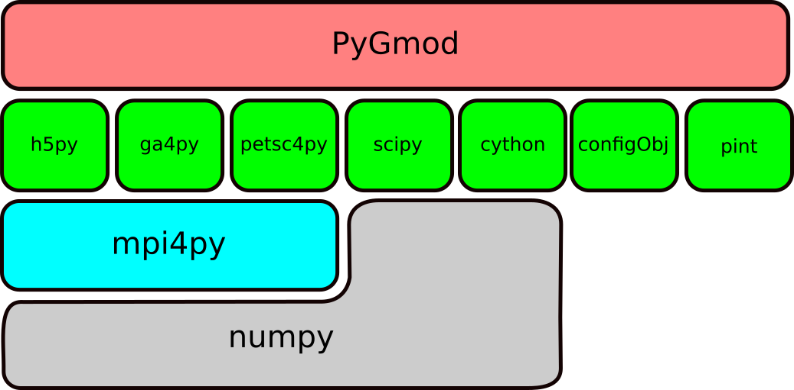
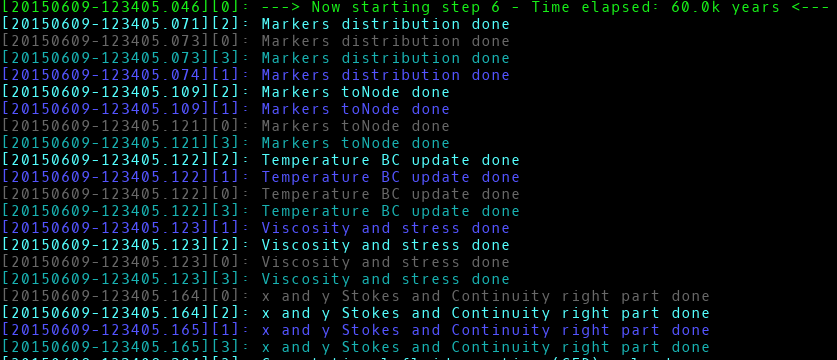
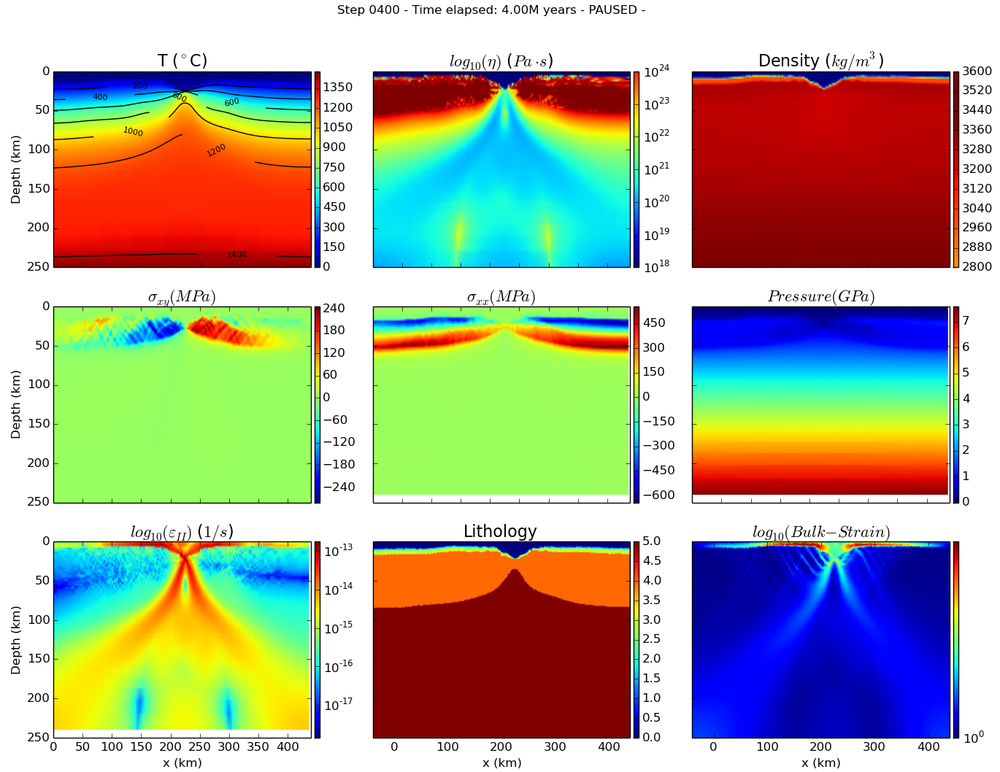

:author: Nicola Creati
:email: ncreati@inogs.it
:institution: Istituto Nazionale di Oceanografia e di Geofisica Sperimentale, OGS

:author: Roberto Vidmar
:email: rvidmar@inogs.it
:institution: Istituto Nazionale di Oceanografia e di Geofisica Sperimentale, OGS

:author: Paolo Sterzai
:email: psterzai@inogs.it
:institution: Istituto Nazionale di Oceanografia e di Geofisica Sperimentale, OGS

:video: https://www.youtube.com/watch?v=PTEgs7salEc

------------------------------------------------
Geodynamic simulations in HPC with Python
------------------------------------------------

.. class:: abstract

The deformation of the Earth surface reflects the action of several forces that act inside the planet. To understand how the Earth surface evolves complex models must be built to reconcile observations with theoretical numerical simulations. Starting from a well known numerical methodology already used among the geodynamic scientific community, PyGmod has been developed from scratch in the last year. The application simulates 2D large scale geodynamic processes by solving the conservation equations of mass, momentum, and energy by a finite difference method with a marker-in-cell technique. 
Unlike common simulation code written in Fortran or C this code is written in Python. The code implements a new approach that takes advantage of the hybrid architecture of the latest HPC machines. In PyGmod the standard MPI is coupled with a threading architecture to speed up some critical computations. Since the OpenMP API cannot be used with Python, threading is implemented in Cython. In addition a realtime visualization library has been developed to inspect the evolution of the model during the computation. 

.. class:: keywords

   HPC, numerical modelling, geodynamics

Introduction
------------

The dynamics of surface and deep Earth processes, referred as geodynamics, is a challenging subject in geosciences since the establishment of plate tectonics in the late 1960s. The outer shell of the Earth is split into a number of thin, rigid plates that are in relative motion with respect to one another [Mor68]_. Most of the earthquakes, volcanic eruptions and mountain buildings occur at plate boundaries [Tur02]_. Geology started to move from a descriptive approach to a quantitative one [McK69]_, [Min70]_. Numerical modeling in geodynamics is necessary because tectonic processes are too slow and too deep in the Earth to be observed directly. In the last 30 years numerical geodynamic modeling has developed very rapidly thanks to the introduction of new numerical techniques and the availability of powerful computers [Ger10]_. Several of the known problems in computational science, such as the non-linear nature of rock rheology, the multicomponent nature of the systems and other thermodynamic variables, can now be managed. In the past years computer clusters of different architectures (shared memory systems, distributed memory systems and distributed shared memory systems) have become available to most researchers. To take full advantage of the power of these machines, parallel algorithms and software packages must be developed. However, geoscience researchers often do not have enough knowledge to build and debug parallel software. While in the last fifteen years several numerical methods and libraries have been developed to solve many of the equations needed to model geodynamic problems, almost all of them are written in C/C++ or Fortran. Sometimes geodynamic modeling is done with commercial software [Pas02]_ [Jar11]_ to reduce the effort of solving equations, as well as writing and debugging a new application.
By exploiting several years of Python experience with remote sensing and geoscience topics, a numerical geodynamic modeling application, PyGmod, has been developed in the last twelve months. The development of PyGmod occurred within the PRACE-OGS research project, which is concerned with HPC applications for oceanographic and geophysical numerical simulations.

Scientific Context
------------------

PyGmod can simulate different geodynamic scenarios (e.g. plate subduction/collision, magma intrusion, continental drifting, etc. [Tur02]_) and processes. The main target of PyGmod is the study of extensional geodynamic contexts. The application has been developed as a tool for understanding the genesis and evolution of extensional continental zones (rifts).
Rifts and their final product, passive margins, are the expression of fundamental processes continually shaping planetary surfaces [Tur02]_. They are sites of magmatic fluid and volatile transfer from the mantle to the surface trough flood basalt and alkaline magmatism, and from the surface to the mantle via surface weathering, hydrothermal systems and serpentinization.
Sedimentary sequences contained within the segmented rift systems record the interplay between tectonics and climate throughout basin evolution, and they may sequester large volumes of CO2 and hydrocarbons. Like subduction margins, rifts may be sites of voluminous and explosive volcanism. Passive margins are sites of enormous landslides and destructive earthquakes [Jac97]_ [Buc04]_. The poor understanding of rift initiation is partly due to the fact that extensive stretching, syn- and post-rift magmatism, and post breakup sedimentation usually overprint and bury the record of incipient extension at mature rifts and rifted margins. Understanding how, why and when rifts initiate and localize is important for defining factors controlling their dynamics. The relative importance of these factors during the inception and earliest development of a new rift is controversial.

Core Development
----------------

PyGmod is inspired by some examples available in the geodynamic literature [Ger10]_ [Deu08]_. These codes have been studied, ported to Python and tested. The first Python version was serial, was based on the Numpy [Van11]_ and Scipy [Jon01]_ packages to manage arrays and solved the governing differential equations. The parallel version of the algorithm has been developed on a multicore commodity PC with the target of the distributed shared memory architecture systems available at CINECA [Cin]_. The porting of PyGmod from the commodity PC to a supercomputer was not straightforward beacuse every supercomputer has a different hardware architecture. The MPI message-passing system has been adopted while the Python multiprocessing module was avoided because it is not available on all supercomputers (e.g. the IBM Blue Gene series [Gil13]_).
The management of parallel distributed arrays has been possible thanks to the Global Array Toolkit (GA) library [Nie06]_ which is available in Python as ga4py. GA hides all the complexity of managing the distributed arrays between the nodes making them available simply as Numpy arrays. The parallel solution of the governing equations is done using the well known PETSc library provided by the petsc4py package [Dal11]_. Simulation results are stored in an HDF5 file using the h5py [Col13]_ package.
Ga4py, petsc4py and h5py are all depending on mpi4py [Dal05]_ [Dal11]_ and provide a higher level interface that greatly reduces the parallel programming effort. Practically all the MPI communication in PyGmod is hidden by the previous three packages and there are only few direct calls to MPI methods (Figure :ref:`fig1`).

   
      PyGmod layer diagram. :label:`fig1` 

   
      Example of on-screen log outputby four MPI tasks running with log level "info". :label:`fig2`

PyGmod Structure
----------------

PyGmod is a 2D thermomechanical code based on an well known geodynamic modeling methodology characterized by the solution of conservative finite difference schemes [Pat80]_ coupled with the marker-in-cell method [Ger03]_ [Ger07]_ [Deu08]_. The deformation of rocks is modeled as flow of variable viscous material as in computational fluid dynamics [Ver07]_. The governing equations reflect the conservation laws of physics:

- conservation of mass,
- conservation of momentum (rate of change of momentum is equal to the sum of forces on the fluid particle, second law of Newton),
- conservation of energy (first law of thermodynamics).

These equations are coupled with rock rheological laws that take in account stress, strain-rate, viscosity, temperature, pressure and composition.
The solution is achieved by a finite difference conservative schema and coupled with the the moving-marker Lagrangian approach [Bra86]_. The equations are solved on an Eulerian grid while the markers are a cloud of points which covers the grid. The marker-in-cell methodology is characterized by several interpolation processes from the markers to the nodes of the grid and back [Ger03]_ [Deu08]_. These are atomic calculations whose execution time depends on the number of markers and the type of interpolator (linear, bilinear, cubic, etc.). Implementation of this algorithm is usually done on shared memory architecture computers using the OpenMP API [Gor06]_.
These interpolations unfortunately cannot be vectorized by Numpy as they need the allocation of large temporary arrays for every MPI process and the memory available can be very little even if the number of processors is huge. For example, the IBM BG/Q at CINECA has only 1 Gb of RAM available to each MPI process even if the system has 160K cores [Gil13]_.
      
      
GA greatly helps to create, distribute and manage all the arrays, both 1D and 2D, providing a shared memory style programming environment in the context of a distributed array data structures. GA arrays are global and can be used as if they were stored in a shared memory environment. All details of the data distribution, addressing, and data access are encapsulated in the global array objects. The basic shared memory operations supported include get, put, scatter, and gather. These operations are truly one-sided/unilateral and will complete regardless of any action taken by the remote process(es) which own(s) the referenced data.

PyGmod uses a modified GA version which implements the ARMCI-MPI [Armci]_ RMA (Remote Memory Access) one-sided communication because the standard GA implementation, available at the time of the development of PyGmod, worked only on few hardware architectures.

The MPI topology implemented by a global array is used to split the 2D domain in Cartesian blocks along the vertical and horizontal axes and to assign to each block the markers which belong to it. Each block of data is then extended to partially overlap its neighbors to avoid border effects. Markers move inside the model domain at every time step iteration and the local portion of markers inside each Cartesian block must be extracted again. In each time iteration, most of the calculation is done on the local portion of the markers and on the grid nodes using only Numpy arrays and methods. Numerical calculation on local arrays has been vectorized by Numpy methods wherever possible. The following is an example of a block of code that has been vectorized to speed up computation (up to 75x) by removing a double for-loop:

.. code-block:: python
    
    # Original code
    (r0, c0), (r1, c1) = ga.distribution(self.dexy)
    for i in range(dexy.shape[0]):
        for j in range(dexy.shape[1]):
            dexy[i, j] = (
                0.5 * ((vx[i + 1, j] - vx[i, j]) /
                self.dyc[i + r0] + 
                (vy[i, j + 1] - vy[i, j]) / 
                self.dxc[j + c0]))
    
    # Vectorized code
    i = np.arange(dexy.shape[0])
    j = np.arange(dexy.shape[1])
    dexy[:] = (
        0.5 * ((vx[i + 1, :][:, j] - 
        vx[i, :][:, j]) / self.dyc[i + r0, np.newaxis] + 
        (vy[i, :][:, j + 1] - vy[i, :][:, j]) / 
        self.dxc[j + c0]))

The governing equations are solved using the PETSc library provided by petsc4py. PyGmod uses direct equation solvers to achieve accurate solutions like MUMPS [Ame00]_ or Superlu [Li03]_ beacuse the problem is 2D and current supercomputers provide enough memory. Unfortunately GA arrays cannot be directly passed to PETSc solvers so local processor ranges of PETSc sparse arrays and vectors must be extracted and the corresponding data block must be retrieved as Numpy arrays from the global array instance. The following is an example of the extraction of the local portion of a quantity from a global array needed later to fill PETSc arrays:

.. code-block:: python

    # Get local PETSC ranges
    istart, iend = l.getOwnershipRange()
    
    # Calculate equivalent local block of 
    # GA array ranges
    c0 = istart / dofs / (ynum - 1)
    c1 = iend / dofs / (ynum - 1) + 2
    r0 = 0
    r1 = ynum - 1  

    # From global GA array get needed block as
    # Numpy array	    	
    local_array = ga.get(
        global_array, (r0, c0), (r1, c1))	

In this example, *l* is a PETSc distributed bi-dimensional array, *dofs* is the degree of freedom of the system, and *ynum* is the total number of rows of the model. The local array is used to fill the local PETSc portion of the sparse arrays and vectors. The local solution of the equations, a Numpy array, is then put back in the corresponding global array. 

PyGmod communicates with the user by a logging system, based on MPI, that helps the tracking of each step of the simulation and is of paramount importance in debugging the code. The *MPILog* class uses an *MPI.File* object's methods to write logging information to standard output (Figure :ref:`fig2`) or to a file. Six log levels are defined: *critical*, *error*, *warning*, *notice*, *info* and *debug*, with warning as the default. Each MPI process writes its log to the same file in a different color. Log level as well as processor ID number can be filtered out. 
Log calls are invoked according to the following syntax:

.. code-block:: python

    log.info(...)
    log.error(...)
    log.critical(...)

Each of these is a pythonic shortcut to the write method of the *MPILog* object:

.. code-block:: python

       def write(self, inmsg, watch=['all'], 
           rank=True, mono=False, level=INFO):

In this example *inmsg* is the message string, *watch* is the list of processors to which the message applies,  *rank* is a switch to hide the processor rank from the message, *mono* disables colorized messages, and *level* defines the minimum level at which the message will be printed. 

   
      RTV screenshot of a rift simulation. :label:`fig3`

Each simulation is controlled by a single configuration file handled by the ConfigObj [Cfg]_ package. This file provides some general physical constants, modeling switches, PETSc equation solver options, mesh geometry and size, lithological geometry, initial distribution of temperature, boundary conditions, and topography. Units of measurements can be included in the configuration file because the parsing system implemented converts the units to the right ones needed by PyGmod checking also for dimensionality consistency. This has been accomplished adopting the Pint [Pint]_ package. The configuration file is organized in several sections as in the following condensed example::

    # Physical constants
    gx  =  0.  m / s**2
    gy  =  9.81 m / s**2
    
    # Ouput file
    output_file = 'extension.hdf5'
    log_file = 'extension.log'
     
    # Stokes solver options
    stokesSolver = """
        ksp_type=preonly
        pc_type=lu
        pc_factor_mat_solver_package=superlu_dist
        mat_superlu_dist_colperm=PARMETIS
        mat_superlu_dist_parsymbfact=1
        """
    ...
    # Specific sections
    [Mesh]
        model = "extension"
        SizeAlongX = 400000
        SizeAlongY = 300000
        NumberOfNodesAlongX = 161
        NumberOfNodesAlongY = 61
        NumberOfMarkersAlongX = 500
        NumberOfMarkersAlongY = 400
        DistributionOfNodesAlongX = """(
            'Variable(0.0, 100000.0, 2000.0, 30, 
                      rtol=True)',
            'Constant(100000.0, 300000.0, 100)',
            'Variable(300000.0,    400000, 2000.0, 
                      30, rtol=False)'
            )"""
        DistributionOfNodesAlongY = """(
            'Constant(0.0, 80000.0, 40)',
            'Variable(80000.0, 300000, 2000.0, 
                      20, rtol=False)'
            )"""

    # Lithological/Rheological model
    [Lithologies]
 
        [["Lithospheric mantle"]]   
          density = 3300 * kg/m**3
          melt_density = 2700 * kg/m**3
          sinFI0 = 0.6 * dimensionless
          sinFI1 = 0.0 * dimensionless
          GAM1 = 0.1 * dimensionless

    # Geometry of polygons where
    # lithologies are defined
    [Polygons]
        lid = """
                0 32
                0 95
               48 95
               48 32
               """
    [Thermal Boundary Condition]            
    ...
    [Fluid Boundary Condition]
    ...
    [Topography]
    ...
    
Modeling results are stored in HDF5 files created by the parallel (MPI) version of the h5py package. Each time iteration is saved in a different HDF5 file (evolution step) to avoid large files. A main output file also contains a copy of the configuration which generated the simulation for the entire evolution.

Results of the simulation can be explored by a viewer application module called Real Time Viewer (RTV). RTV code is based on Matplotlib [Hun07]_ and plots some of the quantities calculated in the simulation (Figure :ref:`fig3`). Because the visualization of over a million markers as a cloud of points can be challenging, data are interpolated during the simulation using the power of MPI and saved in the HDF5 file as arrays. Thus, each processor interpolates only a small image patch from its own local markers pool. The interpolation uses the *griddata* module of Scipy with a nearest neighbors switch. RTV can plot data from a real-time simulation showing the current evolution step or historical data.

Each simulation can be interrupted by the user or by the operating system and restarted from the last completed time iteration without any data loss. 

Performance
-------------

PyGmod was built using optimized third party libraries to speed up the computation and avoid the direct calls to MPI primitives needed for the parallelization wherever possible. Some sections (e.g. the mesh and topography objects) and some arrays are not yet parallel. These objects and arrays are replicated on all tasks since the size of the problems used to develop the code was not so big so as to require further optimization. Further parallelization should increase the speed and decrease the memory allocation. 
Tests proved that marker interpolation is a critical operation that can take a large amount of time. Interpolation is done in for-loops as the atomic nature of the algorithm used forbids the use of Numpy methods. Marker points contribute to the resolution of the model and they tend to be on the order of millions dramatically slowing down the computation. The following code is an example of one of the interpolations in PyGmod:

.. code-block:: python
       
        # Loop over markers
        for mk in range(len(idx)):

            # Check if data is in the model domain
            if self.inDomain(...):

                # Find upper left node of the grid 
                # from marker coordinates
                xn, yn, dx, dy = self.ul_node(...)

                # Linear interpolation method
                self.markerBint(...)

The loop operates over all the markers inside the block assigned to each processor and every time iteration step calls the interpolation methods several times. Because Python loops are inherently slow, Cython has been used to speed up markers interpolation. Most of the original Python code has been ported to Cython with minor modifications, just adding static typing and using pointers for arrays. The net increase of speed with this simple technique is almost three orders of magnitude (Table :ref:`table`).
The performance has been further improved by threading the interpolation methods. Thanks to Cython [Beh11]_, the Global Interpreter Lock (GIL) can be removed to make the threads concurrent. Loops are split into threads and each of them owns only a small section of the block of markers assigned locally to every processor.
More tests are now taking place on the HPC facilities provided by CINECA to understand the scalability and further optimize the code.

Final Remarks
-------------

PyGmod shows that it is possible to build a simulation code that runs efficiently on HPC computers with a small programming effort. Available third party Python packages (Figure :ref:`fig1`) greatly reduced the work needed to parallelize the algorithms. Petsc4py, ga4py, mpi4py and h5py are efficient and handle of all the necessary communication.
Pure Python code can be optimized further by using different switches or methods provided by external packages (e.g. equation solvers). PyGmod is young code that works without any C or Fortran. It can be modified with minor effort, adapted to the needs of the research, and extended including other geodynamic phenomena like melting, fluid migration, phase changes, etc.. Open-source and efficient libraries and packages available in the Python universe overcome the myth that Python is only a scripting language not suited for computationally intensive purposes or that cannot be used on HPC facilities. 
     
.. table:: Performance comparision between interpolation code adopting Cython and threading. :label:`table`

   +--------------------+----------+
   | Interpolation      | Speedup  |
   +====================+==========+
   | Pure Python        | 1        |
   +--------------------+----------+
   | Cython             | 725      |
   +--------------------+----------+
   | Cython (2 Threads) | 1187     |
   +--------------------+----------+
   | Cython (4 Threads) | 2056     |
   +--------------------+----------+

   
References
----------
.. [Ame00] P.R. Amestoy, I.S. Duff, J.Y. L'Excellent, *Multifrontal parallel distributed symmetric and unsymmetric
           solvers*, Comput. Methods in Appl. Mech. Eng., 184:501-520, 2000.          
.. [Armci] ARMCI-MPI: https://github.com/jeffhammond/armci-mpi.
.. [Beh11] S. Behnel, R. Bradshaw, C. Citro, L. Dalcin, D. Sverre Seljebotn, K.Smith, *Cython: The Best of Both Worlds*,
           Computing in Science & Engineering, 13(2):31-39, 2011.
.. [Bra86] J.U. Brackbill, H.M. Ruppel, *FLIP: A method for adaptively zoned, particle-in-cell calculations of fluid 
           flows in two dimensions*, Journal of Computational Physics, 65(2): 314-343, 1986.
.. [Buc04] W.R. Buck, *Consequences of Asthenospheric Variability on Continental Rifting*, in Rheology and Deformation
           of the lithosphere at comntinental margins, editors G.D. Karner, B. Taylor, N.W. Driscolland D.L. Kohlstedt, Columbia University Press, 1-31, 2004.          
.. [Cfg]   R. Dennis, E. Courtwright, 
           https://github.com/DiffSK/configobj.
.. [Cin]   Cineca, http://www.cineca.it.
.. [Col13] A. Collette, 
           *Python and HDF5, Unlocking Scientific Data*, O'Riley ed., 152 pp, 2013.
.. [Dal11] L. Dalcin, P. Kler, R. Paz, A. Cosimo, *Parallel Distributed Computing using Python*, 
           Advances in Water Resources, 34(9):1124-1139, 2011.
.. [Dal05] L. Dalcin, R. Paz, M. Storti, *MPI for Python*, Journal of Parallel and Distributed Computing, 65(9),   
           1108-1115, 2005.
.. [Deu08] Y. Deubelbeiss, B.J.P. Kaus, *Comparison of Eulerian and Lagrangian numerical techniques for the Stokes
           equations in the presence of strongly varying viscosity*, Physics of the Earth and Planetary Interiors, 171:92-111, 2008.
.. [Ger10] T.V. Gerya, *Introduction to Numerical Geodynamic Modelling*, Cambridge University Press ed., 345 pp, 2010.
.. [Ger07] T.V. Gerya, D.A. Yuen, *Robust characteristics method for modelling multiphase visco-elasto-plastic thermo
           -mechanical problems*, Phys. Earth Planet. Interiors, 163:83-105, 2007.
.. [Ger03] T.V. Gerya, D.A. Yuen, *Characteristics-based marker-in-cell method with conservative finite-differences
           schemes for modeling geological flows with strongly variable transport properties*, Phys. Earth Planet. Interiors, 140: 293-318, 2003.
.. [Gil13] M. Gilge, 
           *IBM System Blue Gene Solution Blue Gene/Q Application Development*, IBM RedBook ed., 188 pp, 2013.
.. [Gor06] W. Gorczyk, T.V. Gerya, J.A.D. Connolly, D.A. Yuen, M. Rudolph, *Large-scale rigid-body rotation in the
           mantle wedge and its implications for seismic tomography*, G^3, 7, doi:10.1029/2005GC001075, 2006
.. [Hun07] J.D.Hunter, *Matplotlib: A 2D graphics environment*, Computing In Science & Engineering, 9(3):90-95, 2007.
.. [Jac97] J. Jackson, T. Blenkinsop, *The Bilila-Mtakataka fault in Malawi: An active, 100-km long, normal fault 
           segment in thick seismogenic crust*, Tectonics 16(1):137-150, 1997.
.. [Jar11] M. Jarosinskia, F. Beekmanb, L. Matencob, S. Cloetingh, *Mechanics of basin inversion: Finite element
           modelling of the Pannonian Basin System*, Tectonophysics, 502:121-145, 2011.
.. [Jon01] E. Jones, T. Oliphant, E. Peterson, *SciPy: Open Source Scientific Tools for Python*, http://www.scipy.org/,
           2001.
.. [Li03]  X.S. Li, J. W. Demmel, *SuperLU_DIST: A Scalable Distributed-Memory Sparse Direct Solver for Unsymmetric
           Linear Systems*, CM Trans. Mathematical Software, 29(2):110-140, 2003.
.. [McK69] D. McKenzie, R.L. Parker, *The North Pacific: an example of tectonics on a sphere*,
           Nature, 216(5122): 1276–1280, 1967.
.. [Min70] J.W Minear, M.F. Toksoz, *Thermal regime of a downgoing slab and new global tectonics*, Tectonics, 75(8):1397–1419, 1970.
.. [Mor68] W. Morgan, *Rises, Trenches, Great Faults, and Crustal Blocks*,
           Journal of Geophysical Research, 73(6):1959-1982, 1968.
.. [Nie06] J. Nieplocha, B. Palmer, V. Tipparaju, M. Krishnan, H. Trease, E. Apra, *Advances, Applications and
           Performance of the Global Arrays Shared Memory Programming Toolkit*, International Journal of High Performance Computing Applications, 20(2):203-231, 2006.
.. [Pas02] C. Pascal, S. Cloetingh, *Rifting in heterogeneous lithosphere: Inferences from numerical modeling of the
           northern North Sea and the Oslo Graben*, Tectonics, 21(6):1-15, 2002.
.. [Pat80] S. Patankar, *Numerical Heat Transfer and Fluid Flow*, Hemisphere Series on Computational Methods in
           Mechanics and Thermal Science, CRC Press ed., 180 pp, 1980.
.. [Pint]  H.E. Grecco, *Pint*, http://pint.readthedocs.org/en/0.6/.
.. [Tur02] D.L. Turcotte, S. G. Schubert, *Geodynamics*, Cambridge University Press ed., 456 pp, 2002.
.. [Van11] S. van der Walt, S.C. Colbert, G. Varoquaux, *The NumPy Array: A Structure for Efficient Numerical
           Computation*, Computing in Science & Engineering, 13:22-30, 2011.
.. [Ver07] H.K. Versteeg, M. Malalasekera, *An Introductio to Computational Fluid Dynamics*, Pearson Education ed., 503 pp,
           2007.
           
