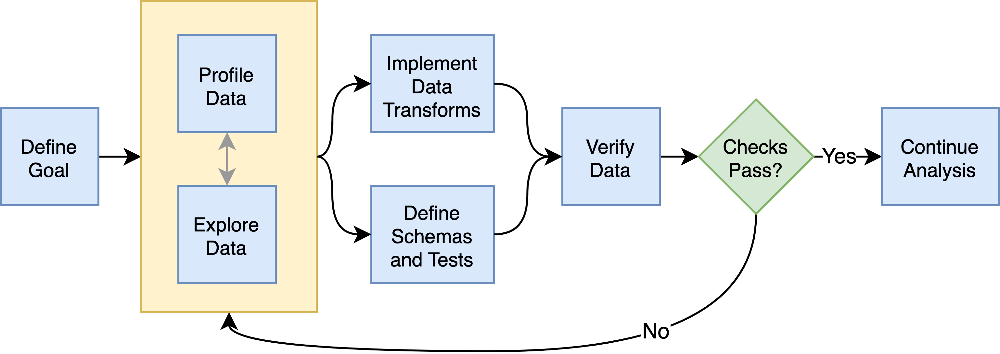

:author: Niels Bantilan
:email: niels@union.ai
:institution: Union.ai
:institution: pyOpenSci
:bibliography: references

--------------------------------------------
Pandera: Going Beyond Pandas Data Validation
--------------------------------------------

.. class:: abstract

   Data quality remains a core concern for practitioners in machine learning,
   data science, and data engineering, and many specialized packages have emerged
   to fulfill the need of validating and monitoring data and models. However, as
   the open source community creates new data processing frameworks - notably,
   new highly performant entrants such as Polars - existing data quality frameworks
   need to catch up to support them, and in some cases, the Python community
   more broadly creates new data validation libraries for these new data frameworks.
   This paper outlines pandera's motivation and challenges that took it from being
   a pandas-only data validation framework :cite:`niels_bantilan-proc-scipy-2020`
   to one that is extensible to other non-pandas-compliant dataframe-like libraries.
   It also provides a informative case study of the technical and organizational
   challenges associated with expanding the scope of a library beyond its original
   boundaries.

.. class:: keywords

   data validation, data testing, data science, machine learning, data engineering

Introduction
------------

Data validation is the process of falsifying data against a particular set of
assumptions :cite:`van2018statistical`. Framed differently, it is the act of
verifying data against a a set of properties and constraints that are explicitly
established by the data practitioner. In this context, the term "data practitioner"
refers to anyone who using a programming language to analyze, transform, or otherwise process data.
It includes, but is not limited to, data scientists, data engineers,
data analysts, machine learning engineers, and machine learning researchers.
This paper describes the trajectory of pandera from a pandas-only validation
library to a more generic framework that can validate any dataframe-like object.

Origins
-------

Pandera started as a small project in 2018 with the goal of providing a lightweight,
flexible, and expressive API to validate pandas DataFrames :cite:`mckinney-proc-scipy-2010`.
This introductory section provides a brief primer on data validation with pandera,
providing insights into how its design facilitates code-first schema authoring
and maintenance. The operating assumption is that this, in turn, gives rise to
safer and more robust data pipelines.

Why Validate Data?
++++++++++++++++++

As stated in the introduction, data validation is the act of falsifying (or verifying)
data against a particular set of assumptions, expressed as a schema of validation rules.
These rules are explicitly established by the data practitioner without interference
from automated processes, like data profiling, and verified at runtime on real-world data.

In machine learning (ML) and statistical analysis use cases, this is critical
because invalid data, e.g. incorrect types, invalid values, and otherwise
corrupted data, can pass silently along a data pipeline and propagate those
errors to various endpoints, which cause adverse ripple-effects to the downstream
consumers that rely on high-quality data. These endpoints can be models, analyses,
and visualizations, and errors in any of these artifacts call into question the
trustworthiness of the conclusions that they entail. Though this is especially
important in scientific research and business-critical applications, data validation
ought to be a core part of the quality assurance pipeline of data teams.

The data practitioner can build statistical domain knowledge about the data they
are working with by inspecting the data via exploratory data analysis (EDA), automatically
profiling the data with any number of tools at their disposal, or a combination
of these two approaches. By building a mental model of how their data looks like
and envisioning a set of constraints that express what the ideal "clean" dataset
looks like, the data practitioner can then encode this understanding as a schema that they
can use to validate new incoming data. This schema then serves not only as documentation
for themselves and future maintainers, but also as a stateless data drift
monitoring system for data transformation, model training, and production inference
pipelines. The benefit of this statelessness is that the data practitioner can
reason about what counts as valid data through their code and their version control
system of choice, which captures changes in the assumptions about valid data
over time.

However, the process of writing down these schemas is a laborious and often
thankless task and not as exciting as getting to the modeling/analysis/visualization
part of the development process. As stated in :cite:`niels_bantilan-proc-scipy-2020`, to
lower the barrier to explicitly writing down schemas for maintaining data quality,
pandera was created with the following design principles in mind:

1. Expressing schemas as code should feel familiar to pandas users.
2. Data validation should be compatible with the different workflows and tools in
   in the data science and ML stack without a lot of setup or configuration.
3. Defining custom validation rules should be easy.
4. The validation interface should make the debugging process easier.
5. Integration with existing code should be as seamless as possible.

These principles were codified to guide the development of pandera project towards
ease of learning and incremental adoption.

Pandera's Programming Model
+++++++++++++++++++++++++++

With these principles in mind, pandera sought to be minimally invasive, quick to
integrate into existing data science and ML code-bases, and easy to learn for
data scientists, data engineers, and ML engineers who use Python (refer to the
*Related Tools* section of :cite:`niels_bantilan-proc-scipy-2020` for a
discussion of similar projects in the Python space). The original object-based
syntax makes it clear how defining a DataFrameSchema is similar to defining
pandas DataFrames:

.. code-block:: python

   import pandera as pa

   schema = pa.DataFrameSchema({
       "column1": pa.Column(
           int, pa.Check.gt(0)
       ),
       "column2": pa.Column(
           str, pa.Check.isin([*"ABC"])
       ),
       "column3": pa.Column(
           float,
           pa.Check.in_range(
               min_value=0.0,
               max_value=1.0,
           )
       ),
   })

In the example above, we expect our data to have three columns that have
specific names, data types, and data value constraints. By reading the code
the data practitioner themselves or their collaborators can immediately see what the
minimum requirements are for valid data. For example, the `pa.Check.gt(0)` constraint
indicates that `column1` just alwyas be greater than zero.

Pandera emphasizes code-first schema authoring and maintenance. As opposed to
yaml-, json- or UI-based schema authoring, code-first schemas lower the barrier
for DS/ML practitioners to create and maintain these schemas because
they don't have to learn a DSL or a set of entirely new concepts.

The hypothesis was that this would give rise to safer and more robust data
pipelines in different parts of the data ecosystem: from research projects in
academia, to nonprofits seeking to create valuable data assets, or to industry
practitioners who want to use pandas in a production ETL pipeline. Pandera's
core programming model is simple:

   The pandera programming model is an iterative loop between building statistical domain
   knowledge, implementing data transforms and schemas, and verifying data. :label:`fig1`

Pandera embraces the data testing development process, which involves validating
real data as well as the functions that produce them. The process of developing
data pipelines with data testing in mind involves the iterative definition of
both data transformations and schemas, which can be used as "fancy assertions"
in your code, or as reusable components in the pipeline's unit test suite.

As depicted in :ref:`fig1`, this process is roughly as follows: by whatever means
necessary, typically via EDA or data profiling (the programmatic creation
of summary statistics and visualization), the data practitioner arrives at a schema,
which states the columns and properties that the data should adhere to. The
schema is then used to validate data in-line, or at the interface boundary of
critical functions in the data pipeline. The data practitioner can start with a basic schema,
which may include column names and their expected types. As they build
more statistical domain knowledge about what counts as valid data, the can refine the
schemas to better fit the requirements of their analysis using ``Check``\s.

.. code-block:: python

   import pandas as pd

   # inline validation
   data = pd.DataFrame({
       "column1": [1, 2, 3],
       "column2": ["A", "B", "C"],
       "column3": [0.2, 0.41, 0.87],
   })
   schema.validate(data)

   # validating the input-output function boundary
   @pa.check_input(schema)
   def transform(data):
       ...
   
   # pandera automatically validates the input
   # when the transform function is called
   transform(data)

If validation succeeds, the schema returns the valid data. If it fails, pandera
raises a SchemaError or SchemaErrors exception. These exceptions contain metadata
about what caused the failure at varying levels of granularity: either at the
schema-level, e.g. wrong column types, or at the data-value-level, e.g. numbers
being out of range:

.. code-block:: python

   invalid_data = pd.DataFrame({
       "column1": [1, -1, 3],
       "column2": ["A", "B", "D"],
       "column3": [0.2, 0.41, 100.0],
   })
   # try to validate as all columns and constraints
   # before raising an error with lazy=True
   try:
       schema.validate(data, lazy=True)
   except pa.errors.SchemaErrors as exc:
       print("Failure cases")
       print(
           exc.failure_cases[
               ["column", "failure_case", "index"]
           ]
       )

   # Output:
   Failure cases
       column failure_case  index
   0  column1           -1      1
   1  column2            D      2
   2  column3        100.0      2

The exception raised during validation contains several attributes, including
the original failed data in the ``.data`` attribute, but more importantly, it
contains a normalized DataFrame view of all the failure cases in the data via
the ``.failure_cases`` attribute. This is reported at the most granular level
so that the data practitioner can quickly understand what's wrong with their data.

Evolution
---------

After its first set of releases, pandera continued to improve with bug fixes,
feature enhancements, and documentation improvements. This section highlights
four major events in pandera's development. In chronological order, these
events were: documentation improvements, support for a class-based API,
data synthesis strategies, and the pandera type system.

Documentation Improvements
++++++++++++++++++++++++++

Documentation is one of the most critical pieces to any software project. Even
if the underlying code is well-written, performant, and useful, ultimately if the
documentation is unclear or otherwise difficult to read and navigate, the software
itself will be inaccessible to end users.

The first set of major contributions came with the help of Nigel Markey, who
helped considerably in documentation efforts, making pandera easy to learn and
adopt through examples, tutorials, and a comprehensive API reference. This helped
pandera to become part of pyOpenSci :cite:`pyopensci`, which helped further improve its
quality and usability through further review and refinement.

Class-based API
+++++++++++++++

The second major improvement in pandera was contributed by Jean-Francois Zinque,
who implemented the class-based syntax that's more akin to Python dataclasses
and the pydantic library :cite:`pydantic`. This modernized pandera to use syntax that was familiar
to developers who use classes as types to express the form and properties
of the data structures they want to use.

.. code-block:: python

   class Model(pa.DataFrameModel):
      column1: int = pa.Field(gt=0, lt=100)
      column2: str = pa.Field(isin=[*"ABC"])
      column3: float = pa.Field(
          in_range={"min_value": 0.0, "max_value": 1.0}
      )

This also enabled pandera to take advantage of type hints as a convenient way
of expressing the input-output types of a function and enforcing data quality at
runtime.

.. code-block:: python

   from pandera.typing import DataFrame

   class Input(pa.DataFrameModel):
       x: float
       y: float
      
   class Output(Input):
       z: float

       @pa.dataframe_check
       def check_z(cls, df):
           """Column z must be the sum of x and y."""
           return df["z"] == (df["x"] + df["y"])

   # This decorator does runtime checks on the
   # input and output dataframe.
   @pa.check_types
   def fn(data: DataFrame[Input]) -> DataFrame[Output]:
       return data.assign(z=lambda df: df.x + df.y)

Data Synthesis Strategies
+++++++++++++++++++++++++

The third major improvement was adding support for data synthesis strategies
using the hypothesis library :cite:`MacIver2019Hypothesis`. This expanded pandera's scope from a data
validation library to a “data testing” toolkit by allowing the data practitioner to easily
create mock data for testing not only real data, but the functions that
produce/clean/transform the data. Note that the `hypothesis` library for doing property-based
testing is not to be confused with statistical `Hypothesis` checks, which were
already supported by pandera.

.. code-block:: python

   import pytest
   from hypothesis import given
   
   # This will generate data for testing the correct
   # implementation of fn
   @given(Input.strategy(size=3))
   def test_fn(input_data)
       fn(input_data)

   class WrongInput(pa.DataFrameModel):
       a: int
       b: str

   # This will fail on the output check
   @given(WrongInput.strategy(size=3))
   def test_fn_wrong_input(input_data)
       with pytest.raises(pa.SchemaError):
           fn(input_data)

Hypothesis handles generating valid data under the pandera schema's constraints,
which relieves the developer from manually hand-crafting dataframes and allows
unit tests to catch edge cases that would not otherwise be caught by the
hand-crafted test cases. This can be seamlessly integrated with `pytest`, since
one can think of pandera schemas as essentially "fancy assertion" statements.

Pandera Type System
+++++++++++++++++++

Finally, the fourth major improvement was contributed by Jean-Francois Zinque,
who implemented pandera's type system, which provides a consistent interface for
defining semantic and logical types not only for pandas, but also potentially for
other dataframe libraries like pyspark and modin.

This allows pandera users to, for example, implement an ``IPAddress`` type, which
requires both specifying the data type and checking the actual
values of the data to verify:

.. code-block:: python

   import re
   from typing import Optional, Iterable, Union
   from pandera import dtypes
   from pandera.engines import pandas_engine

   @pandas_engine.Engine.register_dtype
   @dtypes.immutable
   class IPAddress(pandas_engine.NpString):

       REGEX = re.compile(
           r"(\d{1,3}\.\d{1,3}\.\d{1,3}\.\d{1,3})"
       )

       def check(
           self,
           pandera_dtype: dtypes.DataType,
           data_container: Optional[pd.Series] = None,
       ) -> Union[bool, Iterable[bool]]:
           # ensure that the data container's data
           # type is correct
           correct_type = super().check(pandera_dtype)
           if not correct_type:
               return correct_type
            if data_container is None:
                raise ValueError

           # ensure IP address pattern
           return data_container.map(
               lambda x: self.REGEX.match(x) is not None
           )

   # using it in a DataFrame model
   class IPAddressModel(pa.DataFrameModel):
       ip_address: IPAddress

Expanding Scope
---------------

After gaining traction over the years, the author, the contributors, and the
growing community of pandera users also began to expand pandera's scope to
support pandas-compliant data frameworks such as GeoPandas :cite:`kelsey_jordahl_2020_3946761`,
Dask :cite:`matthew_rocklin-proc-scipy-2015`, Modin :cite:`petersohn2020scalable`,
and Pyspark Pandas :cite:`pyspark-pandas` (formerly Koalas). As requests for other
dataframe-like libraries increased in frequency, it became clear that pandera in
its existing state was not well-suited for extension beyond Pandas objects.

Design Weaknesses
+++++++++++++++++

The fundamental design flaw in pandera's internals was that the schema specification
and validation engine were interleaved through out the code base. This presented the
following challenges for supporting non-pandas dataframe libraries:

- **Schemas were strongly coupled to pandas**: The schema class had a lot of
  assumptions about pandas, which manifested as method calls and operations that assumed that
  pandera was operating on a pandas DataFrame.
- **Checks were strongly coupled to pandas**: Pandera has core checks that are
  exposed in the schema/schema component object, which were all implemented with
  pandas-specific code.
- **Error reporting assumed in-memory data**: Error reporting of metadata and
  value checks assumed in-memory, small-to-medium-sized datasets. For any larger
  scale data that requires a distributed dataframe, the error-reporting mechanism
  doesn't work well because the worst case scenario of all data values being
  invalid would produce an failure case report that was
  potentially even larger than the original data.
- **Leaky abstractions**: The pandera schema API leaked certain pandas-specific
  abstractions, e.g. Index and MultiIndex, which don't apply to other frameworks,
  e.g. Spark and Polars.

These weaknesses were uncovered after-the-fact, when the author and contributors
analyzed the existing codebase to determine how to best support other dataframe
objects.

Design Strengths
++++++++++++++++

With these limitations in mind, it's also important to note some of the design
choices that significantly eased the subsequent internals rewrite. In particular:

- **Generic schema interface**: Within the domain of tabular, dataframe-like
  datastructures, pandera's schema API is generic enough to support both columnar
  and row-wise statistical data objects, which can be defined as objects that
  expose methods for statistical analysis.
- **Flexible Check abstraction**: pandera's ``Check`` object — the core validator
  abstraction — was sufficiently flexible. Check functions assume that it returns
  a boolean scalar, Series or DataFrame. This allows data pandera to report value
  errors at varying levels of granularity: e.g. for distributed dataframes, reporting
  all failure cases incurs unacceptable overhead for distributed dataframes, which
  would require full table scans.
- **Flexible type system**: The type system was also  sufficiently flexible to support
  types for different dataframe libraries, allowing for simple types, generic types,
  parameterized types, and logical types.

Rewriting Pandera Internals
---------------------------

For practical purposes, the first set of DataFrame libraries supported by pandera
were pandas-compliant frameworks such as GeoPandas, Modin, Dask, and Koalas (now ``pyspark.pandas``).
Even though these libraries do deviate somewhat from the pandas API, they were
close enough such that the parts of the pandas API that pandera leveraged were just a
subset of the full API. Therefore, supporting these additional libraries required
only a few code changes :cite:`pandera-pr-660`. This approach was the path to
least resistance for making data validation more scalable, and validating the
notion that the community would actually find it useful.

In contrast, in order to support additional non-pandas-compliant libraries like pyspark,
polars, and vaex, pandera needed to overhaul the schema objects by decoupling the schema
specification from the validation engine. At a high-level, the approach was to introduce
the following abstractions:

- A ``pandera.api`` subpackage, which contains the schema specification that
  defines the properties of an underlying data structure.
- A ``pandera.backends`` subpackage, which leverages the schema specification and
  implements the actual validation logic.
- A backend registry, which maps a particular API specification to a backend based
  on the DataFrame type being validated.
- A common type-aware Check namespace and registry, which registers type-specific
  implementations of built-in checks and allows contributors to easily add new
  built-in checks.

This new architecture allows contributors to implement a schema validator for
any data structure they want. In pseudo-code, supporting a fictional dataframe
library called ``sloth`` it would look something like:

.. code-block:: python

   import sloth as sl
   from pandera.api.base.schema import BaseSchema
   from pandera.backends.base import BaseSchemaBackend

   class DataFrameSchema(BaseSchema):
       def __init__(self, **kwargs):
           # add properties that this dataframe
           # would contain

   class DataFrameSchemaBackend(BaseSchemaBackend):
       def validate(
           self,
           check_obj: sl.DataFrame,
           schema: DataFrameSchema,
           *,
           **kwargs,
       ):
           # implement custom validation logic

   # register the backend
   DataFrameSchema.register_backend(
       sloth.DataFrame,
       DataFrameSchemaBackend,
   )

Similarly, the built-in checks can easily be extended to support ``sloth``
data structures:

.. code-block:: python

   import sloth as sl

   from pandera.api.extensions import register_builtin_check

   @register_builtin_check(
       aliases=["eq"],
       error="equal_to({value})"
   )
   def equal_to(
       data: sl.Series, value: Any
   ) -> sl.Series:
       return data.equals(value)

Organizational and Development Challenges
+++++++++++++++++++++++++++++++++++++++++

Although the road to an internals rewrite was fairly straightforward from a
technical perspective, there were additional meta-challenges that added to the
complexity of implementing the rewrite in practice:

- **Multi-tasking the rewrite with PR reviews**: As with any open source project,
  there were community-contributed PRs for bug fixes and feature enhancements,
  many of which created merge conflicts since they assumed the pre-rewrite state
  of the code base. The author had to block such contributions until the rewrite
  was complete and fast-forward these PRs to fit the structure of the new code base.
- **Centralized knowledge**: Because the author was the primary maintainer of
  the project and was the only maintainer who understood the codebase as a whole
  well enough to make the changes, incorporating non-conflicting pull requests took
  time away from the rewrite, further delaying the timeline that would unblock
  other would-be contributors who wanted to implement support for other libraries, e.g. polars.
- **Informal governance**: Because pandera has an informal contributor and
  governance structure, the author effectively made unilateral decisions with
  respect to the abstractions necessary to decouple the schema specification from
  the validation backend. This turned out to be appropriate, with a successful case of a
  community-contributed ``pyspark.sql`` integration being almost complete as of
  the writing of this paper. This integration is planned for release in the next
  minor version ``0.16.0``. However, the pandera project would benefit from a
  more formal governance structure involving a broader set of stakeholders when
  it comes to wide-sweeping internal or user-facing changes.

Retrospective
+++++++++++++

With all of these challenges in mind, the internals rewrite was completed in
pull request 913 :cite:`pandera-pr-913` on January 24th, 2023 and the follow-up
pull request 1109 :cite:`pandera-pr-1109` on March 13th, 2023. A few factors
facilitated the rewrite itself and also reduced the risk of regressions:

- **Unit tests**: A comprehensive unit test suite caught many issues, but not
  all of them. This was partly due to lack of complete test coverage, but
  new tests also had to be written for abstractions introduced during the re-write process.
- **Localized pandas coupling**: Pandas-specific code was mostly localized in
  easy-to-identify locations in the codebase.
- **Lessons learned from pandas-compliant integrations**: Earlier integrations
  with pandas-compliant libraries revealed operations/assumptions that are likely
  to break in out-of-core DataFrame libraries, which typically involved indexes
  and sorting assumptions.

In retrospect, there are additionally things the author would have done
differently to make pandera more flexible and extensible:

- **Thoughtful design work**: With some careful design work, it would have been
  obvious to decouple schema specification from validation backend much sooner.
- **Library-independent error reporting**: Make error reporting more flexible by
  decoupling error reporting data structures from the specific DataFrame library,
  e.g. by using native python data structures like lists and dictionaries instead
  of pandas DataFrames to report failure cases.
- **Decoupling metadata from data**: Distinguish between DataFrame metadata schema
  errors (e.g. missing columns) and data value errors (e.g. out-of-range values).
- **Investing in governance and community**: Invest more in governance and formalize
  contributor and community RFC processes sooner to help with design and feature
  enhancement efforts.

Updated Design Principles
+++++++++++++++++++++++++

Given all of the developments and updates that pandera has seen in recent years,
pandera's design principles also need to be updated with one amendment and one
additions:

1. **Amendment**: Expressing schemas as code should feel familiar to *Python
   users, regardless of the dataframe library they're using*.
2. Data validation should be compatible with the different workflows and tools in
   in the data science and ML stack without a lot of setup or configuration.
3. Defining custom validation rules should be easy.
4. The validation interface should make the debugging process easier.
5. Integration with existing code should be as seamless as possible.
6. **Addition**: *Extending the interface to other statistical data structures should
   be easy using a core set of building blocks and abstractions.*

Conclusion
----------

Pandera has evolved from a pandas-specific data validation library to a
comprehensive toolkit that provides a standard schema interface for easily extending
and supporting validation backends for arbitrary statistical data containers.
This paper provides an overview of data validation and testing, focusing on
pandera's core programming model and its extended functionality to support
property-based testing. This paper also provides a useful case study of the
technical and organizational challenges associated with expanding the scope of a
library beyond its original boundaries.

The author's hope is that, by highlighting the technical and organizational
dimensions of this evolution, that other open source authors and maintainers can
learn and avoid some of the pitfalls encountered during the internals rewrite
that now enables pandera to support a whole suite of statistical data containers
moving forward.
