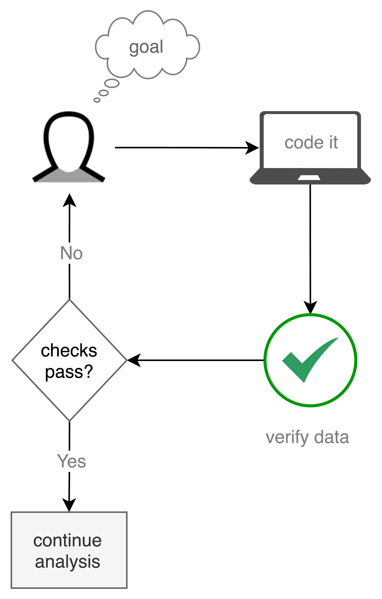
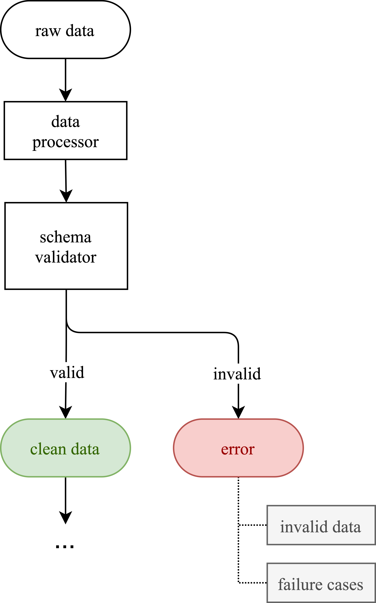

:author: Niels Bantilan
:email: niels.bantilan@gmail.com
:institution: Talkspace
:institution: pyOpenSci
:orcid: 0000-0003-1713-5772
:corresponding:
:bibliography: refs

:video: https://youtu.be/PxTLD-ueNd4

=========================================================
pandera: Statistical Data Validation of Pandas Dataframes
=========================================================

.. class:: abstract

   ``pandas`` is an essential tool in the data scientist’s toolkit for modern
   data engineering, analysis, and modeling in the Python ecosystem. However,
   dataframes can often be difficult to reason about in terms of their data
   types and statistical properties as data is reshaped from its raw form to
   one that’s ready for analysis. Here, I introduce pandera, an open source
   package that provides a flexible and expressive data validation API designed
   to make it easy for data wranglers to define dataframe schemas. These
   schemas execute logical and statistical assertions at runtime so that
   analysts can spend less time worrying about the correctness of their
   dataframes and more time obtaining insights and training models.

.. class:: keywords

   data validation, data engineering

Introduction
------------

``pandas`` :cite:`mckinney-proc-scipy-2010` has become an indispensible part of
the data scientist's tool chain, providing a powerful interface for data
processing and analysis for tabular data. In recent years numerous open source
projects have emerged to enhance and complement the core pandas API in various
ways. For instance, ``pyjanitor`` :cite:`eric-ma-proc-scipy-2019`
:cite:`pyjan`, ``pandas-ply`` :cite:`pdply`, and ``siuba`` :cite:`sba` are
projects that provide alternative data manipulation interfaces inspired by the
R ecosystem, ``pandas-profiling`` :cite:`pdpf` automatically creates data
visualizations and statistics of dataframes, and ``dask``
:cite:`rocklin2015dask` provides parallelization capabilities for a variety of
data structures, pandas dataframes among them.

This paper introduces a data validation tool called ``pandera``, which provides
an intuitive, flexible, and expressive API for validating pandas data
structures at runtime. The problems that this library attempts to address
are two-fold. The first is that dataframes can be difficult to reason about in
terms of their contents and properties, especially when they undergo many steps
of transformations in complex data processing pipelines. The second is that,
even though ensuring data quality is critical in many contexts like scientific
reporting, data analytics, and machine learning, the data validation process
can produce considerable cognitive and software development overhead.
Therefore, this tool focuses on making it as easy as possible to perform data
validation in a variety of contexts and workflows in order to lower the
barrier to explicitly defining and enforcing the assumptions about data.

In the following sections I outline the theoretical underpinnings and practical
appications of data validation, describe in more detail the specific
architecture and implementation of the ``pandera`` package, and compare and
contrast it with similar tools in the Python and R ecosystems.

Data Validation Definition
--------------------------

Data validation is the process by which the data analyst decides whether or not
a particular dataset fulfills certain properties that should hold true in order
to be useful for some purpose, like modeling or visualization. In other
words, data validation is a falsification process by which data is deemed valid
with respect to a set of logical and statistical assumptions
:cite:`van2018statistical`. These assumptions are typically formed by
interacting with the data, where the analyst may bring to bear some prior
domain knowledge pertaining to the dataset and data manipulation task at hand.
Notably, even with prior knowledge, exploratory data analysis is an essential
part of the workflow that is part of the data wrangling process.

More formally, we can define data validation in its most simple form as a
function:

.. math::
   :label: valfunc

   v(x) \twoheadrightarrow \{ {True}, {False} \}

Where :math:`v` is the validation function, :math:`x` is the data to validate,
and the output is a boolean value. As :cite:`van2019data` points out, the
validation function :math:`v` must be a surjective (onto) function that covers
the function's entire range in order to be meaningful. To see why, consider a
validation function that always returns :math:`True` or always returns
:math:`False`. Such a function cannot falsify any instantiation of the dataset
:math:`x` and therefore fails to provide any meaningful information about the
validity of any dataset [#]_. Although the above formulation covers a wide
variety of data structures, this paper will focus on tabular data.

.. [#] There are nuances around how to formulate the domain of the function
       :math:`v`. For a more comprehensive formal treatment of data validation,
       refer to :cite:`van2019data` and :cite:`van2018statistical`

Types of Validation Rules
-------------------------

:cite:`van2019data` distinguishes between technical validation rules and
domain-specific validation rules. Technical validation rules describe the
variables, data types, and meta-properties of what constitutes a valid or
invalid data structure, such as uniqueness and nullability. On the other hand,
domain-specific validation rules describe properties of the data that are
specific to the particular topic under study. For example, a census dataset
might contain ``age``, ``income``, ``education``, and ``job_category`` columns
that are encoded in specific ways depending on the way the census was
conducted. Reasonable validation rules might be:

* The ``age`` and ``income`` variables must be positive integers.
* The ``age`` variable must be below 122 [#]_.
* Records where ``age`` is below the legal working age should have ``NA``
  values in the ``income`` field.
* ``education`` is an ordinal variable that must be a member of the ordered
  set ``{none, high school, undergraduate, graduate}``.
* ``job_category`` is an unordered categorical variable that must be a member of
  the set ``{professional, manegerial, service, clerical, agricultural, technical}``.

.. [#] The age of the oldest person:
       https://en.wikipedia.org/wiki/List_of_the_verified_oldest_people

We can also reason about validation rules in terms of the statistical and
distributional properties of the data under validation. We can think about at
least two flavors of statistical validation rules: deterministic, and
probabilistic. Probabilistic checks explicitly express uncertainty about the
statistical property under test and encode notions of stochasticity and
randomness. Conversely, deterministic checks express assertions about the data
based on logical rules or functional dependencies that do not explicitly
incorporate any assumptions about randomness into the validation function.

Often times we can express statistical properties about data using
deterministic or probabilistic checks. For example, "the mean age among the
``graduate`` sample tends to be higher than that of the ``undergraduate``
sample in the surveyed population" can be verified deterministically by simply
computing the means of the two samples and applying the logical rule
:math:`mean(age_{graduate}) > mean(age_{undergraduate})`. A probabilistic
version of this check would be to perform a hypothesis test, like a t-test with
a pre-defined alpha value. Most probabilistic checks can be reduced to
deterministic checks, for instance by simply evaluating the truth/falseness of
a validation rule using the test statistic that results from the hypothesis
test and ignoring the p-value. Doing this simplifies the validation rule but
trades off simplicity for being unable to express uncertainty and statistical
significance. Other examples of such probabilistic checks might be:

* The ``income`` variable is positively correlated with the ``education``
  variable.
* ``income`` is negatively correlated with the dummy variable
  ``job_category_service``, which is a variable derived from the
  ``job_category`` column.

Data Validation in Practice
---------------------------

Data validation is part of a larger workflow that involves processing raw data
to produce of some sort of statistical artifact like a model, visualization, or
report. In principle, if one can write perfect, bug-free code that parses,
cleans, and reshapes the data to produce these artifacts, data validation would
not be necessary. In practice, however, data validation is critical for
preventing the silent passing of an insidious class of data integrity error,
which is otherwise difficult to catch without explicitly making assertions at
runtime. These errors could lead to misleading visualizations, incorrect
statistical inferences, and unexpected behavior in machine learning models.
Explicit data validation becomes even more important when the end product
artifacts inform business decisions, support scientific findings, or generate
predictions about people or things in the real world.

   Data validation as an iterative software development process.
   :label:`datavalprocess`

Consider the process of constructing a dataset for training a machine learning
model. In this context, the act of data validation is an iterative loop that
begins with the analyst's objective and a mental model of what the data should
"look" like. She then writes code to produce the dataset of interest,
simultaneously inspecting, summarizing, and visualizing the data in an
exploratory fashion, which in turn enables her to build some intuition and
domain knowledge about the dataset.

She can then codify this intuition as a set of assumptions, implemented as a
validation function, which can be called against the data to ensure that they
adhere to those assumptions. If the validation function evaluates to ``False``
against the data during development time, the analyst must decide whether to
refactor the processing logic to fulfill the validation rules or modify the
rules themselves [#]_.

In addition to enforcing correctness at runtime, the resulting validation
function also documents the current state of assumptions about the dataset for
the benefit of future readers or maintainers of the codebase.

.. [#] In the latter scenario, the degenerate case is to remove the validation
       function altogether, which exposes the program to the risks associated
       with silently passing data integrity errors. Practically, it is up to
       the analyst to determine an appropriate level of strictness that
       catches cases that would produce invalid outputs.

The role of the analyst, therefore, is to encode assumptions about data as a
validation function and maintain that function as new datasets pass through the
processing pipeline and the definition of valid data evolves over time. One
thing to note here is that using version control software like git :cite:`git`
would keep track of the changes of the validation rules, enabling maintainers
or readers of the codebase to inspect the evolution of the contract that the
data must fulfill to be considered valid.

Design Principles
-----------------

``pandera`` is a flexible and expressive API for ``pandas`` data validation,
where the goal is to provide a data engineering tool that (i) helps pandas
users reason about what clean data means for their particular data processing
task and (ii) enforce those assumptions at run-time. The following are the
principles that have thus far guided the development of this project:

* Expressing validation rules should feel familiar to ``pandas`` users.
* Data validation should be compatible with the different workflows and tools
  in the data science toolbelt without a lot of setup or configuration.
* Defining custom validation rules should be easy.
* The validation interface should make the debugging process easier.
* Integration with existing code should be as seamless as possible.

These principles articulate the use cases that I had when surveying the Python
ecosystem for ``pandas`` data validation tools.

Architecture
------------

``pandera`` helps users define schemas as contracts that a :code:`pandas`
dataframe must fulfill. This contract specifies deterministic and statistical
properties that must hold true to be considered valid with respect to a
particular analysis. Since ``pandera`` is primarily a data engineering tool,
the validation function defined in Equation (:ref:`valfunc`) needs to be
slightly refactored:

.. math::
   :label: schemafunc

   s(v, x) \rightarrow \begin{cases} \mbox{x,} & \mbox{if } v(x) = true \\ \mbox{error,} & \mbox{otherwise} \end{cases}

Where :math:`s` is a *schema* function that takes the validation function from
Equation (:ref:`valfunc`) and some data as input and returns the data itself if
it is valid and an :math:`error` otherwise. In ``pandera``, the :math:`error`
is implemented as a :code:`SchemaError` exception that contains the invalid
data as well as a ``pandas`` dataframe of failure cases that contains the index
and failure case values that caused the exception.

The primary rationale for extending validation functions in this way is
that it enables users to compose schemas with data processing functions, for
example, :math:`s \circ f(x)` is a composite function that first applies a
data processing function :math:`f` to the dataset :math:`x` and then validates
the output with the schema :math:`s`. Another possible composite function,
:math:`f \circ s(x)`, applies the validation function to :math:`x` before
applying the :math:`f`, effectively guaranteeing that inputs to :math:`f`
fulfill the contract enforced by :math:`s`.

This formulation of data validation facilitates the interleaving of data
processing and validation code in a flexible manner, allowing the user to
decide the critical points of failure in a pipeline where data validation would
make it more robust to abherrant data values.

   High-level architecture of ``pandera``. In the simplest case, raw data
   passes through a data processor, is checked by a schema validator, and
   flows through to the next stage of the analysis pipeline if the validation
   checks pass, otherwise an error is raised. :label:`architecture`

Core Features
-------------

DataFrameSchemas as Contracts
~~~~~~~~~~~~~~~~~~~~~~~~~~~~~

The main concepts of ``pandera`` are *schemas*, *schema components*, and
*checks*. Schemas are callable objects that are initialized with validation
rules. When called with compatible data as an input argument, a schema object
returns the data itself if the validation checks pass and raises a
``SchemaError`` when they fail. Schema components behave in the same way as
schemas but are primarily used to specify validation rules for specific parts
of a ``pandas`` object, e.g. columns in a dataframe. Finally, checks allow the
users to express validation rules in relation to the type of data that the
schema or schema component are able to validate.

More specifically, the central objects in pandera are the ``DataFrameSchema``,
``Column``, and ``Check``. Together, these objects enable users to express
schemas upfront as contracts of logically grouped sets of validation rules that
operate on pandas dataframes. For example, consider a simple dataset containing
data about people, where each row is a person and each column is an attribute
about that person:

.. code-block:: python

   import pandas as pd

   dataframe = pd.DataFrame({
       "person_id": [1, 2, 3, 4],
       "height_in_feet": [6.5, 7, 6.1, 5.1],
       "date_of_birth": pd.to_datetime([
           "2005", "2000", "1995", "2000",
       ]),
       "education": [
           "highschool", "undergrad", "grad", "undergrad",
       ],
   })

We can see from inspecting the column names and data values that we can bring
some domain knowledge about the world to express our assumptions about what
are considered valid data.

.. code-block:: python

   import pandera as pa
   from pandera import Column

   typed_schema = pa.DataFrameSchema(
       {
           "person_id": Column(pa.Int),

           # numpy and pandas data type string
           # aliases are supported
           "height_in_feet": Column("float"),
           "date_of_birth": Column("datetime64[ns]"),

           # pandas dtypes are also supported
           # string dtype available in pandas v1.0.0+
           "education": Column(
               pd.StringDtype(),
               nullable=True
           ),
       },

       # coerce types when dataframe is validated
       coerce=True
   )

   typed_schema(dataframe)  # returns the dataframe

Validation Checks
~~~~~~~~~~~~~~~~~

The ``typed_schema`` above simply expresses the columns that are expected to be
present in a valid dataframe and their associated data types. While this is
useful, users can go further by making assertions about the data values that
populate those columns:

.. code-block:: python

   import pandera as pa
   from pandera import Column, Check

   checked_schema = pa.DataFrameSchema(
       {
           "person_id": Column(
               pa.Int,
               Check.greater_than(0),
               allow_duplicates=False,
           ),
           "height_in_feet": Column(
               "float",
               Check.in_range(0, 10),
           ),
           "date_of_birth": Column(
              "datetime64[ns]",
              Check.less_than_or_equal_to(
                  pd.Timestamp.now()
              ),
           ),
           "education": Column(
               pd.StringDtype(),
               Check.isin([
                   "highschool",
                   "undergrad",
                   "grad",
               ]),
               nullable=True,
           ),
       },
       coerce=True
   )

The schema definition above establishes the following properties about the
data:

* the ``person_id`` column is a positive integer, which is a common
  way of encoding unique identifiers in a dataset. By setting
  ``allow_duplicates`` to ``False``, the schema indicates that this column
  is a unique identifier in this dataset.
* ``height_in_feet`` is a positive float whose maximum value is 10 feet, which
  is a reasonable assumption for the maximum height of human beings.
* ``date_of_birth`` cannot be a date in the future.
* ``education`` can take on the acceptable values in the set
  ``{"highschool", "undergrad", "grad"}``. Supposing that these data
  were collected in an online form where the ``education`` field input was optional,
  it would be appropriate to set ``nullable`` to ``True`` (this argument is
  ``False`` by default).

Error Reporting and Debugging
~~~~~~~~~~~~~~~~~~~~~~~~~~~~~

If a dataframe passed into the ``schema`` callable object does not
pass the validation checks, ``pandera`` provides an informative error message:

.. code-block:: python

   invalid_dataframe = pd.DataFrame({
       "person_id": [6, 7, 8, 9],
       "height_in_feet": [-10, 20, 20, 5.1],
       "date_of_birth": pd.to_datetime([
           "2005", "2000", "1995", "2000",
       ]),
       "education": [
           "highschool", "undergrad", "grad", "undergrad",
       ],
   })

   checked_schema(invalid_dataframe)

.. code-block:: python

   # Exception raised:
   SchemaError:
   <Schema Column: 'height_in_feet' type=float>
   failed element-wise validator 0:
   <Check _in_range: in_range(0, 10)>
   failure cases:
               index  count
   failure_case
    20.0         [1, 2]      2
   -10.0            [0]      1

The causes of the ``SchemaError`` are displayed as a dataframe where the
``failure_case`` index is the particular data value that failed the
``Check.in_range`` validation rule, the ``index`` column contains a list of
index locations in the invalidated dataframe of the offending data values, and
the ``count`` column summarizes the number of failure cases of that particular
data value.

For finer-grained debugging, the analyst can catch the exception using the
``try...except`` pattern to access the data and failure cases as attributes in
the ``SchemaError`` object:

.. code-block:: python

   from pandera.errors import SchemaError

   try:
       checked_schema(invalid_dataframe)
   except SchemaError as e:
       print("Failed check:", e.check)
       print("\nInvalidated dataframe:\n", e.data)
       print("\nFailure cases:\n", e.failure_cases)

.. code-block:: python

   # Output:
   Failed check: <Check _in_range: in_range(0, 10)>

   Invalidated dataframe:
      person_id  height_in_feet date_of_birth   education
   0          6           -10.0    2005-01-01  highschool
   1          7            20.0    2000-01-01   undergrad
   2          8            20.0    1995-01-01        grad
   3          9             5.1    2000-01-01        none

   Failure cases:
      index  failure_case
   0      0         -10.0
   1      1          20.0
   2      2          20.0

In this way, users can easily access and inspect the invalid dataframe and
failure cases, which is especially useful in the context of long method
chains of data transformations:

.. code-block:: python

   raw_data = ...  # get raw data
   schema = ...  # define schema

   try:
       clean_data = (
          raw_data
          .rename(...)
          .assign(...)
          .groupby(...)
          .apply(...)
          .pipe(schema)
       )
   except SchemaError as e:
       # e.data will contain the resulting dataframe
       # from the groupby().apply() call.
       ...

Pipeline Integration
~~~~~~~~~~~~~~~~~~~~

There are several ways to interleave ``pandera`` validation code with data
processing code. As shown in the example above, one can use a schema by simply
using it as a callable. Users can also sandwich data preprocessing code between
two schemas; one schema that ensures the raw data fulfills certain assumptions,
and another that ensures the processed data fulfills another set of
assumptions that arise as a consequence of the data processing. The following
code provides a toy example of this pattern:

.. code-block:: python

   in_schema = pa.DataFrameSchema({
       "x": Column(pa.Int)
   })

   out_schema = pa.DataFrameSchema({
       "x": Column(pa.Int),
       "x_doubled": Column(pa.Int),
       "x_squared": Column(pa.Int),
   })

   raw_data = pd.DataFrame({"x": [1, 2, 3]})
   processed_data = (
       raw_data
       .pipe(in_schema)
       .assign(
           x_doubled=lambda d: d["x"] * 2,
           x_squared=lambda d: d["x"] ** 2,
       )
       .pipe(out_schema)
   )

For more complex pipelines that handle multiple steps of data transformations
with functions, ``pandera`` provides a decorator utility for validating the
inputs and outputs of functions. The above example can be refactored into:

.. code-block:: python

   @pa.check_input(in_schema)
   @pa.check_output(out_schema)
   def process_data(raw_data):
       return raw_data.assign(
           x_doubled=lambda df: df["x"] * 2,
           x_squared=lambda df: df["x"] ** 2,
       )

   processed_data = process_data(raw_data)

Custom Validation Rules
~~~~~~~~~~~~~~~~~~~~~~~

The ``Check`` class defines a suite of built-in methods for common operations,
but expressing custom validation rules are easy. In the simplest case, a custom
column check can be defined simply by passing a function into the ``Check``
constructor. This function needs to take as input a pandas ``Series`` and
output either a boolean or a boolean ``Series``, like so:

.. code-block:: python

   Column(checks=Check(lambda s: s.between(0, 1)))

The ``element_wise`` keyword argument changes the expected function signature
to a single element in the column, for example, a logically equivalent
implementation of the above validation rule would be:

.. code-block:: python

   Column(
       checks=Check(
           lambda x: 0 <= x <= 1, element_wise=True
       )
   )

``Check`` objects can also be used in the context of a ``DataFrameSchema``,
in which case the function argument should take as input a pandas ``DataFrame``
and output a boolean, a boolean ``Series``, or a boolean ``DataFrame``.

.. code-block:: python

   # assert that "col1" is greater than "col2"
   schema = pa.DataFrameSchema(
       checks=Check(lambda df: df["col1"] > df["col2"])
   )

Currently, in the case that the check function returns a boolean ``Series`` or
``DataFrame``, all of the elements must be ``True`` in order for the validation
check to pass.

Advanced Features
-----------------

Hypothesis Testing
~~~~~~~~~~~~~~~~~~

To provide a feature-complete data validation tool for data scientists,
``pandera`` subclasses the ``Check`` class to define the ``Hypothesis`` class
for the purpose of expressing statistical hypothesis tests. To illustrate one
of the use cases for this feature, consider a toy scientific study where a
control group receives a placebo and a treatment group receives a drug that is
hypothesized to improve physical endurance. The participants in this study then
run on a treadmill (set at the same speed) for as long as they can, and running
durations are collected for each individual.

Even before collecting the data, we can define a schema that expresses our
expectations about a positive result:

.. code-block:: python

   from pandera import Hypothesis

   endurance_study_schema = pa.DataFrameSchema({
       "subject_id": Column(pa.Int),
       "arm": Column(
           pa.String,
           Check.isin(["treatment", "control"])
       ),
       "duration": Column(
           pa.Float, checks=[
              Check.greater_than(0),
              Hypothesis.two_sample_ttest(
                  # null hypothesis: the mean duration
                  # of the treatment group is equal
                  # to that of the control group.
                  sample1="treatment",
                  relationship="greater_than",
                  sample2="control",
                  groupby="arm",
                  alpha=0.01,
              )
           ]
       )
   })

Once the dataset is collected for this study, we can then pass it through the
schema to validate the hypothesis that the group receiving the drug increases
physical endurance, as measured by running duration.

As of version ``0.4.0``, the suite of built-in hypotheses is limited to the
``two_sample_ttest`` and ``one_sample_ttest``, but creating custom hypotheses
is straight-forward. To illustrate this, another common hypothesis test might
be to check if a sample is normally distributed. Using the
`scipy.stats.normaltest <https://docs.scipy.org/doc/scipy/reference/generated/scipy.stats.normaltest.html>`_
function, one can write:

.. code-block:: python

   import numpy as np
   from scipy import stats

   dataframe = pd.DataFrame({
      "x1": np.random.normal(0, 1, size=1000),
   })

   schema = pa.DataFrameSchema({
       "x1": Column(
           checks=Hypothesis(
              test=stats.normaltest,
              # null hypothesis:
              # x1 is normally distributed with
              # alpha value of 0.01
              relationship=lambda k2, p: p > 0.01
           )
       ),
   })

   schema(dataframe)

Conditional Validation Rules
~~~~~~~~~~~~~~~~~~~~~~~~~~~~~

If we want to validate the values of one column conditioned on another, we can
provide the other column name in the `groupby` argument. This changes the
expected ``Check`` function signature to expect an input dictionary where the
keys are discrete group levels in the conditional column and values are pandas
``Series`` objects containing subsets of the column of interest. Returning to
the endurance study example, we could simply assert that the mean running
duration of the treatment group is greater than that of the control group
without assessing statistical significance:

.. code-block:: python

   simple_endurance_study_schema = pa.DataFrameSchema({
       "subject_id": Column(pa.Int),
       "arm": Column(
           pa.String,
           Check.isin(["treatment", "control"])
       ),
       "duration": Column(
           pa.Float, checks=[
              Check.greater_than(0),
              Check(
                  lambda duration_by_arm: (
                      duration_by_arm["treatment"].mean()
                      > duration_by_arm["control"].mean()
                  ),
                  groupby="arm"
              )
           ]
       )
   })

Functional dependencies are a type of conditional validation rule that
expresses a constraint between two sets of variables in a relational data
model :cite:`armstrong1974dependency` :cite:`bohannon2007conditional`. For
example, consider a dataset of biological species where each row is a species
and each column is a classification in the classic hierarchy of
``kingdom -> phylum -> class -> order ... -> species``. We can assert that "if
two species are in the same ``phylum``, then they must be in the same
``kingdom``":

.. code-block:: python

   species_schema = pa.DataFrameSchema({
       "phylum": Column(pa.String),
       "kingdom": Column(
           pa.String,
           Check(
               # there exists only one unique kingdom
               # for species of the same phylum
               lambda kingdoms: all(
                   kingdoms[phylum].nunique() == 1
                   for phylum in kingdoms
               ),
               # this can also be a list of columns
               groupby="phylum"
           )
       )
   })

However, in order to make the assertion "if two species are in the same
``order``, then they must be in the same ``class`` and ``phylum``", we have to
use dataframe-level checks since the above pattern can only operate on values
of a single column grouped by one or more columns.

.. code-block:: python

   species_schema = pa.DataFrameSchema(
       checks=Check(
           lambda df: (
               df.groupby("order")
               [["phylum", "class"]]
               .nunique() == 1
           )
       )
   )

Use Case Vignettes
------------------

This section showcases the types of use cases that ``pandera`` is designed to
address via hypothetical vignettes that nevertheless illustrate how ``pandera``
can be beneficial with respect to the maintainability and reproducibility of
analysis/model pipeline code. These vignettes are based on my experience using
this library in research and production contexts.

Catching Type Errors Early
~~~~~~~~~~~~~~~~~~~~~~~~~~

Consider a dataset of records with the fields ``age``, ``occupation``, and
``income``, where we would like to predict ``income`` as a function of the
other variables. A common type error that arises, especially when processing
unnormalized data or flat files, is the presence of values that violate our
expectations based on domain knowledge about the world:

.. code-block:: python

   data = """age,occupation,income
   30,nurse,90000
   25,data_analyst,75000
   45 years,mechanic,45000
   21 year,community_organizer,41000
   -100,wait_staff,27000
   """

In the above example, the ``age`` variable needs to be cleaned so that its
values are positive integers, treating negative values as null.

.. code-block:: python

   import pandas as pd
   import pandera as pa
   from io import StringIO

   schema = pa.DataFrameSchema(
       {
           "age": pa.Column(
               pa.Float,
               pa.Check.greater_than(0),
               nullable=True,
           ),
           "occupation": pa.Column(pa.String),
           "income": pa.Column(pa.Float),
       },
       coerce=True
   )

   pd.read_csv(StringIO(data)).pipe(schema)
   # ValueError:
   # invalid literal for int() with base 10: '45 years'

Defining a data cleaning function would be standard practice, but here we can
augment this function with guard-rails that would catch ``age`` values that
cannot be cast into a float type and convert negative values to nulls.

.. code-block:: python

   @pa.check_output(schema)
   def clean_data(df):
       return df.assign(
           age=(
               df.age.str.replace("years?", "")
               .astype("float64").mask(lambda x: x < 0)
           )
       )

   training_data = (
       pd.read_csv(StringIO(data)).pipe(clean_data)
   )

The implementation of ``clean_data`` now needs to adhere to the ``schema``
defined above. Supposing that the data source is refreshed periodically from
some raw data feed, additional records with age values like ``22 years and 7
months`` would be caught early in the data cleaning portion of the pipeline, and
the implementation within ``clean_data`` would have to be refactored to
normalize these kinds of more complicated values.

Though this may appear to be a trivial problem, validation rules on
unstructured data types like text benefit greatly from even simple validation
rules, like checking that values are non-empty strings and contain at least a
minimum number of tokens, before sending the text through a tokenizer to
produce a numerical vector representation of the text. Without these validation
checks, these kinds of data integrity errors would pass silently through the
pipeline, only to be unearthed after a potentially expensive model training
run.

Reusable Schema Definitions
~~~~~~~~~~~~~~~~~~~~~~~~~~~

In contexts where the components of an ML pipeline are handled by different
services, we can reuse and modify schemas for the purposes of model training
and prediction. Since schemas are just python objects, schema definition
code can be placed in a module e.g. ``schemas.py``, which can then be imported
by the model training and prediction modules.

.. code-block:: python

   # schemas.py
   feature_schema = schema.remove_columns(["income"])
   target_schema = pa.SeriesSchema(pa.Int, name="income")

   # model_training.py
   from schemas import feature_schema, target_schema

   @pa.check_input(feature_schema, "features")
   @pa.check_input(target_schema, "target")
   def train_model(features, target):
       estimator = ...
       estimator.fit(features, target)
       return estimator

   # model_prediction.py
   from schemas import feature_schema, target_schema

   @pa.check_input(feature_schema, "features")
   @pa.check_output(target_schema)
   def predict(estimator, features):
       predictions = estimator.predict(features)
       return pd.Series(predictions, name="income")

Unit Testing Statistically-Typed Functions
~~~~~~~~~~~~~~~~~~~~~~~~~~~~~~~~~~~~~~~~~~

Once functions are decorated with ``check_input`` or ``check_output``, we can
write unit tests for them by generating synthetic data that produces the
expected results. For example, here is a test example using ``pytest``
:cite:`pytest`:

.. code-block:: python

   # test_clean_data.py
   import pandera as pa
   import pytest

   def test_clean_data():
       valid_data = pd.DataFrame({
           "age": ["20", "52", "33"],
           "occupation": ["barista", "doctor", "chef"],
           "income": [28000, 150000, 41000],
       })
       clean_data(valid_data)

       # non-normalized age raises an exception
       invalid_data = valid_data.copy()
       invalid_data.loc[0, "age"] = "20 years and 4 months"
       with pytest.raises(ValueError):
           clean_data(invalid_data)

       # income cannot be null
       invalid_null_income = valid_data.copy()
       invalid_null_income.loc[-1, "income"] = None
       with pytest.raises(pa.errors.SchemaError):
           clean_data(invalid_null_income)

This last use case would be further enhanced by property-based testing
libraries like ``hypothesis`` :cite:`MacIver2019Hypothesis`
:cite:`david_r_maciver_2020_3859851` that could be used to generate
synthetic data against which to test schema-decorated functions.

Documentation
-------------

Documentation for ``pandera`` is hosted on `ReadTheDocs <https://pandera.readthedocs.io/>`_,
where tutorials on core and experimental features are available, in addition
to full API documentation.

Limitations
-----------

The most notable limitation of ``pandera`` is the computational cost of running
validation checks at runtime. This limitation applies to any data validation
code, which trades off increased run-time for type safety and data integrity.
The project currently uses ``airspeed-velocity`` :cite:`asv` for a few
basic run-time and memory usage benchmarks, but more extensive performance
profiling is warranted to give users a better sense of this trade-off. The
other trade-off to consider is the additional development time associated with
defining robust and meaningful schemas versus the time spent debugging silent
data integrity issues, which is particularly costly in areas like machine
learning where model debugging occurs after training a model.

A related limitation is that type-checking schemas are practical for large
datasets (e.g. datasets that do not fit onto disk in a modern laptop), but
validation checks that verify statistics on one or more columns can become
expensive. For this reason, the default ``Check`` function signature is
expected to be a ``Series`` in order to encourage users to use the optimized
``pandas.Series`` methods. In theory, ``pandera`` schemas can be coupled with
parallelization tools like ``dask`` :cite:`rocklin2015dask` to perform data
validation in these settings.

Two other limitations of the current state of the package are that:

* The built-in ``Hypothesis`` methods are currently limited in scope, and
  implementing wrapper methods to the ``scipy`` implementations of commonly
  used distributional tests (e.g. normality test, chi-squared test, and
  KL-divergence) would encourage the use of hypothesis tests in schemas.
* Expressing functional dependencies is currently inelegant and would benefit
  from a higher-level abstraction to improve usability.

Roadmap
-------

The ``pandera`` project started as a naive excursion into seeing whether pandas
dataframes could be statically typed, as gradual typing is becoming adopted by
the Python community since the :code:`typing` module was introduced in Python 3.5.
The project evolved into a tool that emphasizes the verification of the
statistical properties of data, which requires run-time validation.

The direction of this project has been driven, in large part, by its
contributors, and will continue to be via feature requests on the github repo.
There are a number of experimental features that are currently available in
version :code:`0.4.0+` that aim to speed up the iteration loop of defining
schemas at development time through interactive analysis:

* `schema inference <https://pandera.readthedocs.io/en/v0.4.2/API_reference.html#schema-inference>`_:
  the ``pandera.infer_schema`` function takes as input a dataframe and outputs
  an automatically generated draft schema that the user can iterate on.
* `yaml/module serialization <https://pandera.readthedocs.io/en/v0.4.2/API_reference.html#io-utils>`_:
  this feature enables the user to write schemas (inferred or otherwise) to
  a yaml file or python script, which are editable artifacts to iterate on.

Additionally, a few feature proposals would benefit from discussion and feedback
from the wider scientific computing and data science community:

* Synthetic data generation based on schema definitions
  [`issue 200 <https://github.com/pandera-dev/pandera/issues/200>`_].
* Domain-specific schemas, types, and checks, e.g. for the machine learning
  use case, provide first-class support for validation checks between target
  and feature variables
  [`issue 179 <https://github.com/pandera-dev/pandera/issues/179>`_].
* Expressing a tolerance level for the proportion of values that fail a
  validation ``Check``
  [`issue 183 <https://github.com/pandera-dev/pandera/issues/183>`_].

There are several ways to
`contribute <https://github.com/pandera-dev/pandera/blob/master/.github/CONTRIBUTING.md>`_
for interested readers:

* Improving documentation by adding examples, fixing bugs, or clarifying the
  the writing.
* Feature requests: e.g. requests for additional built-in ``Check`` and
  ``Hypotheses`` methods.
* Submit new issues or pull requests for existing issues.

Related Tools
-------------

This project was inspired by the ``schema`` and ``pandas_schema`` Python
packages and the ``validate`` R package :cite:`van2019data`. Initially when
assessing the Python landscape for ``pandas``-centric data validation tools, I
found that they did not match my use cases because they (a) often resulted in
verbose and over-specified validation rulesets, (b) introduced many new
library-specific concepts and configuration steps, (c) lacked documentation of
core functionality and usage patterns, and/or (d) are no longer maintained.

Here is my assessment of data validation tools that are currently being
maintained in the Python ecosystem:

* ``great_expectations`` :cite:`ge`: this is a mature, batteries-included data
  validation library centered around the concept of **expectations**. It
  provides a UI to manage validation rules and supports integrations with many
  database systems and data manipulation tools. This framework extends the
  ``pandas.DataFrame`` class to include validation methods prefixed with
  ``expect_*`` and a suite of built-in rules for common use cases. Defining
  custom validation rules involves subclassing the ``PandasDataset`` class
  and defining specially-decorated methods with function signatures that adhere
  to library-specific standards.
* ``schema`` :cite:`schema`: a light-weight data validator for generic Python
  data structures. This package and ``pandera`` share the schema interface
  where the schema object returns the data itself if valid and raises an
  ``Exception`` otherwise. However, this library does not provide additional
  functionality for ``pandas`` data structures.
* ``pandas_schema`` :cite:`ps`: a ``pandas`` data validation library with a
  comprehensive suite of built-in validators. This package was the inspiration
  for the *schema component* design where a ``Column`` object specifies
  properties of a dataframe column, albeit the specific implementations are
  considerably different. It provides built-in validators and supports defining
  custom validation rules. Unlike ``pandera`` which outputs the validated data,
  the output of validating a dataframe with ``pandas_schema`` is an iterable of
  errors that are intended to be inspected via ``print`` statements.

The key features that differentiate ``pandera`` from similar packages in the
Python ecosystem are the following:

* ``check_input`` and ``check_output`` function decorators enable seamless
  integration with existing data processing/analysis code.
* ``Check`` validation rules are designed primarily for customizability, with
  built-in methods as a convenience for common validation rules.
* ``Hypothesis`` validation rules provide a tidy-first :cite:`wickham2014tidy`
  interface for hypothesis testing.
* Ease of debugging, as ``SchemaErrors`` contain the invalidated data as well as
  a tidy dataframe of the failure cases with their corresponding column/index
  locations.
* Schema inference and serialization capabilities enable the creation of draft
  schemas that users can iterate on and refine.
* Clear and comprehensive documentation on core and advanced features.

Conclusion
----------

This paper introduces the :code:`pandera` package as a way of expressing
assumptions about data and falsifying those assumptions at run time. This tool
is geared toward helping data engineers and data scientists during the software
development process, enabling them to make their data proprocessing workflows
more readable, robust, and maintainable.

Acknowledgements
----------------

I would like to acknowledge the `pyOpenSci <https://www.pyopensci.org/>`_
community for their support and the ``pandera`` contributors who have made
significant improvements and enhancements to the project.
