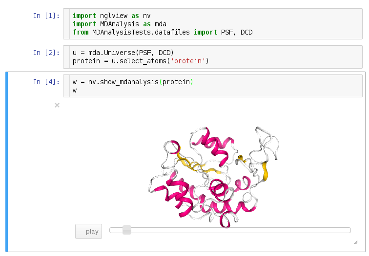
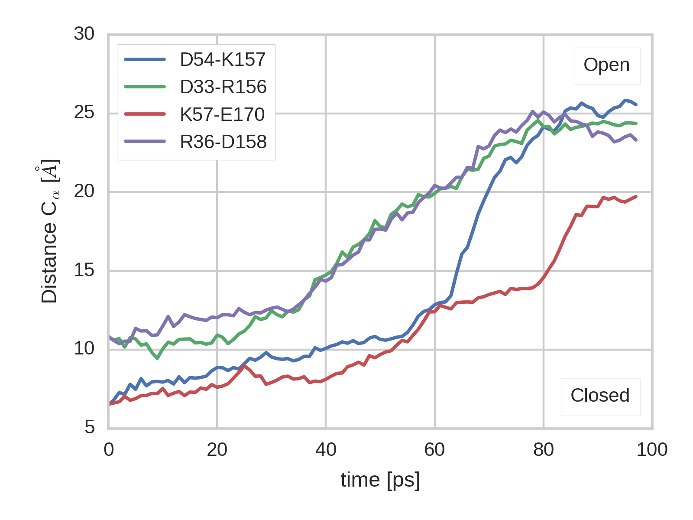

.. -*- mode: rst; mode: visual-line; fill-column: 9999; coding: utf-8 -*-

:author: Richard J. Gowers
:email: richardjgowers@gmail.com
:institution: University of Manchester, Manchester, UK
:institution: University of Edinburgh, Edinburgh, UK
:equal-contributor:

:author: Max Linke
:email: max.linke@biophys.mpg.de
:institution: Max Planck Institut für Biophysik, Frankfurt, Germany
:equal-contributor:

:author: Jonathan Barnoud
:email: j.barnoud@rug.nl
:institution: University of Groningen, Groningen, The Netherlands
:equal-contributor:

:author: Tyler J. E. Reddy
:email: tyler.reddy@bioch.ox.ac.uk
:institution: University of Oxford, Oxford, UK

:author: Manuel N. Melo
:email: m.n.melo@rug.nl
:institution: University of Groningen, Groningen, The Netherlands

:author: Sean L. Seyler
:email: slseyler@asu.edu
:institution: Arizona State University, Tempe, Arizona, USA

:author: Jan Domanski
:email: jan.domanski@bioch.ox.ac.uk
:institution: University of Oxford, Oxford, UK

:author: David L. Dotson
:email: dldotson@asu.edu
:institution: Arizona State University, Tempe, Arizona, USA

:author: Sébastien Buchoux
:email: sebastien.buchoux@u-picardie.fr
:institution: Université de Picardie Jules Verne, Amiens, France

:author: Ian M. Kenney
:email: Ian.Kenney@asu.edu
:institution: Arizona State University, Tempe, Arizona, USA

:author: Oliver Beckstein
:email: oliver.beckstein@asu.edu
:institution: Arizona State University, Tempe, Arizona, USA
:corresponding:

:bibliography: ``mdanalysis``

.. STYLE GUIDE
.. ===========
.. see https://github.com/MDAnalysis/scipy_proceedings/wiki
.. .
.. Writing
..  - use present tense
.. .
.. Formatting
..  - restructured text
..  - hard line breaks after complete sentences (after period)
..  - paragraphs: empty line (two hard line breaks)
.. .
.. Workflow
..  - use PRs (keep them small and manageable)

.. definitions (like \newcommand)

.. |Calpha| replace:: :math:`\mathrm{C}_\alpha`

-------------------------------------------------------------------------------------
MDAnalysis: A Python Package for the Rapid Analysis of Molecular Dynamics Simulations
-------------------------------------------------------------------------------------

.. class:: abstract

MDAnalysis (http://mdanalysis.org) is a library for structural and temporal analysis of molecular dynamics (MD) simulation trajectories and individual protein structures.
MD simulations of biological molecules have become an important tool to elucidate the relationship between molecular structure and physiological function.
Simulations are performed with highly optimized software packages on HPC resources but most codes generate output trajectories in their own formats so that the development of new trajectory analysis algorithms is confined to specific user communities and widespread adoption and further development is delayed.
MDAnalysis addresses this problem by abstracting access to the raw simulation data and presenting a uniform object-oriented Python interface to the user.
It thus enables users to rapidly write code that is portable and immediately usable in virtually all biomolecular simulation communities.
The user interface and modular design work equally well in complex scripted workflows, as foundations for other packages, and for interactive and rapid prototyping work in IPython_  / Jupyter_ notebooks, especially together with molecular visualization provided by nglview_ and time series analysis with pandas_.
MDAnalysis is written in Python and Cython_ and uses NumPy_ arrays for easy interoperability with the wider scientific Python ecosystem.
It is widely used and forms the foundation for more specialized biomolecular simulation tools.
MDAnalysis is available under the GNU General Public License v2.

.. _IPython: http://ipython.org/
.. _Jupyter: http://jupyter.org/
.. _nglview: https://github.com/arose/nglview
.. _pandas: http://pandas.pydata.org/
.. _NumPy: http://www.numpy.org
.. _Cython: http://cython.org/

.. class:: keywords

   molecular dynamics simulations, science, chemistry, physics, biology

.. For example file, see ../00_vanderwalt/00_vanderwalt.rst
.. Shows how to do figures, maths, raw latex, tables, citations

Introduction
------------

.. initial copy and paste

Molecular dynamics (MD) simulations of biological molecules have become an important tool to elucidate the relationship between molecular structure and physiological function.
Simulations are performed with highly optimized software packages on HPC resources but most codes generate output trajectories in their own formats so that the development of new trajectory analysis algorithms is confined to specific user communities and widespread adoption and further development is delayed.
Typical trajectory sizes range from gigabytes to terabytes so it is typically not feasible to convert trajectories into a range of different formats just to use a tool that requires this specific format.
Instead, a framework is required that provides a common interface to raw simulation data.
Here we describe the MDAnalysis library :cite:`Michaud-Agrawal:2011fu` that addresses this problem by abstracting access to the raw simulation data.
MDAnalysis presents a uniform object-oriented Python interface to the user.
Since its original publication in 2011 :cite:`Michaud-Agrawal:2011fu`, MDAnalysis has been widely adopted and has undergone substantial changes.
Here we provide a short introduction to MDAnalysis and its capabilities and provide and overview over recent improvements.

Overview
--------

MDAnalysis is written in Python and Cython_ and uses NumPy_ arrays :cite:`Vanderwalt2011` for easy interoperability with the wider scientific Python ecosystem.
Although the primary dependency is NumPy_, other Python packages such as netcdf4_  and BioPython_ :cite:`Hamelryck:2003fv` also provide specialized functionality to the core of the library (Figure :ref:`fig:structure`).

.. figure:: figs/mdanalysis_structure.pdf

   Structure of the MDAnalysis package.
   MDAnalysis consists of the "core" with the *Universe* class as the primary entry point for users.
   The *MDAnalysis.analysis* package contains independent modules that make use of the core to implement a wide range of algorithms to analyze MD simulations.
   The *MDAnalysis.visualization* package contains a growing number of tools that are specifically geared towards calculating visual representations such as, for instance, streamlines of molecules. :label:`fig:structure`

MDAnalysis currently supports more than 25 different file formats and covers the vast majority of data formats that are used in the biomolecular simulation community, including the formats required and produced by the most popular packages NAMD, Amber, Gromacs, CHARMM, LAMMPS, DL_POLY, HOOMD.
The user interface provides "physics-based" abstractions (e.g. "atoms", "bonds", "molecules") of the data that can be easily manipulated by the user.
It hides the complexity of accessing data and frees the user from having to implement the details of different trajectory and topology file formats (which by themselves are often only poorly documented and just adhere to certain "community expectations" that can be difficult to understand for outsiders).

The user interface and modular design work equally well in complex scripted workflows, as foundations for other packages like ENCORE_ :cite:`Tiberti:2015fk` and ProtoMD_ :cite:`Somogyi:2016aa`, and for interactive and rapid prototyping work in IPython_ :cite:`Perez2007`/Jupyter_ notebooks, especially together with molecular visualization provided by nglview_ and time series analysis with pandas_ :cite:`McKinney2010`.
Since the original publication :cite:`Michaud-Agrawal:2011fu`, improvements in speed and data structures make it now possible to work with terabyte-sized trajectories containing up to ~10 million particles.
MDAnalysis also comes with specialized analysis classes in the ``MDAnalysis.analysis`` module that are unique to MDAnalysis such as *LeafletFinder*, a graph-based algorithm for the analysis of lipid bilayers :cite:`Michaud-Agrawal:2011fu`, or *Path Similarity Analysis* for the quantitative comparison of macromolecular conformational changes :cite:`Seyler:2015fk`.

MDAnalysis is available in source form under the GNU General Public License v2 from GitHub as `MDAnalysis/mdanalysis`_, and as PyPi_ and conda_ packages.
The documentation_ is extensive and includes an `introductory tutorial`_.
The develoment community is very active with more than five active core developers and many community contributions in every release.
We use modern software development practices :cite:`Wilson:2014aa,Stodden:2014tg` with continous integration (provided by *Travis CI*) and an extensive automated testsuite (containing over 3500 tests with >92% coverage for our core modules).
Development occurs on *GitHub* through pull requests that are reviewed by core developers and other contributors, supported by the results from the automated tests, test coverage reports provided by *Coveralls*, and *QuantifiedCode* code quality reports.
Users and developers communicate extensively on the `community mailing list`_ (*Google* groups) and the GitHub issue tracker; new users and developers are very welcome.
The development and release process is transparent to users.
Releases are numbered according to the `semantic versioning`_ convention so that users can immediately judge the impact of a new release on their existing code base, even without having to consult the CHANGELOG documentation.
Old code is slowly deprecated so that users have ample opportunity to update the code although we generally attempt to break as little code as possible.
When backwards-incompatible changes are inevitable, we provide tools (based on the Python standard library's *lib2to3*) to automatically refactor code or warn users of possible problems with their existing code.

.. _PyPi: https://pypi.python.org/pypi/MDAnalysis
.. _conda: https://anaconda.org/mdanalysis/dashboard
.. _community mailing list: https://groups.google.com/forum/#!forum/mdnalysis-discussion
.. _ENCORE: https://github.com/encore-similarity/encore
.. _ProtoMD: https://github.com/CTCNano/proto_md
.. _introductory tutorial: http://www.mdanalysis.org/MDAnalysisTutorial/
.. _documentation: http://docs.mdanalysis.org
.. _`MDAnalysis/mdanalysis`: https://github.com/MDAnalysis/mdanalysis
.. _semantic versioning: http://semver.org
.. _netcdf4: http://unidata.github.io/netcdf4-python/
.. _BioPython: http://biopython.org/wiki/Biopython

Basic Usage
-----------

The core object in MDAnalysis is the Universe which acts as a nexus for accessing all data contained within a simulation.
It is initialised by passing the filenames of the topology and trajectory files, with a multitude of different formats supported in these roles.
The topology acts as a description of all the particles in the system while the trajectory describes their behavior over time.

.. show loading a Universe and creating basic selections
.. check that this selection makes chemical sense!
.. code-block:: python

   import MDAnalysis as mda

   # Create a Universe based on simulation results
   u = mda.Universe('topol.tpr', 'traj.trr')

   # Create a selection of atoms to work with
   ag = u.atoms.select_atoms('backbone')

The select_atoms method allows for AtomGroups to be created using a human readable syntax which allows queries according to properties, logical statements and geometric criteria.

.. more selection examples, these include
.. logic operations (NOT AND)
.. geometry based (AROUND)
.. other group based (GROUP)
.. TODO (maybe): brackets, OR, cylinder/sphere?
.. code-block:: python

   # Select all solvent within a set distance from protein atoms
   ag = u.select_atoms('resname SOL and around 5.0 protein')

   # Select all heavy atoms in the first 20 residues
   ag = u.select_atoms('resid 1:20 and not prop mass < 10.0')

   # Use a preexisting AtomGroup as part of another selection
   sel1 = u.select_atoms('name N and not resname MET')
   sel2 = u.select_atoms('around 2.5 group Nsel', Nsel=sel1)

   # Perform a selection on another AtomGroup
   sel1 = u.select_atoms('around 5.0 protein')
   sel2 = sel1.select_atoms('type O')

The AtomGroup acts as a representation of a group of particles, with the properties of these particles made available as NumPy arrays.

.. accessing data from an atomgroup
.. topology data
.. trajectory data
.. code-block:: python

   ag.names
   ag.charges
   ag.positions
   ag.velocities
   ag.forces

The data from MD simulations comes in the form of a trajectory which is a frame by frame description of the motion of particles in the simulation.
Today trajectory data can often reach sizes of hundreds of GB.
Reading all these data into memory is slow and impractical.
To allow the analysis of such large simulations on an average workstation (or even laptop) MDAnalysis will only load a single frame of a trajectory into memory at any time.

The trajectory data can be accessed through the trajectory attribute of a Universe.
Changing the frame of the trajectory object updates the underlying arrays that AtomGroups point to.
In this way the positions attribute of an AtomGroup within the iteration over a trajectory will give access to the positions at each frame.
Through this approach only a single frame of data is present in memory at any time, allowing for large datasets, from half a million particles :cite:`Ingolfsson2014` to tens of millions, to be dissected with minimal resources.

.. show working with the trajectory object to access the time data
.. code-block:: python

   # the trajectory is an iterable object
   len(u.trajectory)

   # seek to a given frame
   u.trajectory[72]
   # iterate through every 10th frame
   for ts in u.trajectory[::10]:
       ag.positions

Example: Per-residue RMSF
~~~~~~~~~~~~~~~~~~~~~~~~~

As a complete example consider the calculation of the |Calpha| root mean square fluctuation (RMSF) :math:`\rho_i` that characterizes the mobility of a residue math:`i` in a protein:

.. math::
   :label: eq:RMSF
   
   \rho_i = \sqrt{\left\langle\left(\mathbf{x}_i(t) - \langle\mathbf{x}_i\rangle\right)\right\rangle}

The code in Figure :ref:`fig:rmsf-example` A shows how MDAnalysis in combination with NumPy can be used to implement Eq. :ref:`eq:RMSF`.
The topology information and the trajectory are loaded into a ``Universe`` instance; |Calpha| atoms are selected with the MDAnalysis selection syntax and stored as the ``AtomGroup`` instance ``ca``.
The main loop iterates through the trajectory using the MDAnalysis trajectory iterator.
The coordinates of all selected atoms become available in a NumPy array ``ca.positions`` that updates for each new time step in the trajectory.
Fast operations on this array are then used to calculate variance over the whole trajectory.
The final result is plotted with matplotlib as the RMSF over the residue numbers, which are conveniently provided as an attribute of the ``AtomGroup`` (Figure :ref:`fig:rmsf-example` B).

.. figure:: figs/rmsf_Example.pdf

   Example for how to calculate the root mean square fluctuation (RMSF) for each residue in a protein with MDAnalysis and NumPy. **A**: Based on the input simulation data (topology and trajectory in the Gromacs format (TPR and XTC), MDAnalysis makes coordinates of the selected |Calpha| atoms available as NumPy arrays. From these coordinates, the RMSF is calculated by averaging over all frames in the trajectory. The RMSF is then plotted with ``matplotlib``. The algorithm to calculate the variance in a single pass is due to Welford :cite:`Welford:1962aa`. **B**: |Calpha| RMSF for each residue. :label:`fig:rmsf-example`

The example demonstrates how the abstractions that MDAnalysis provides enable users to write very concise code where the computations on data are cleanly separated from the task of extracting the data from the simulation trajectories.
These characteristics make it easy to rapidly prototype new algorithms.
In our experience, most new analysis algorithms are developed by first prototyping a simple script (like the one in :ref:`fig:rmsf-example`), often inside a Jupyter_ notebook.
Then the code is cleaned up, tested and packaged into a module.
In the next section, we describe the analysis code that is included as modules with MDAnalysis.

Interactive Use and Visualization
---------------------------------

MDAnalysis works equally well as an interactive tool as it does in scripted workflows.
In particular, Universes and AtomGroups can be visualized in Jupyter_ notebooks using nglview_, which gives a convenience function for parsing these objects (Figure :ref:`fig:nglview`).

   MDAnalysis can be used with nglview_ to directly visualize molecules and trajectories in Jupyter_ notebooks. :label:`fig:nglview`.

As an example for calculating various observables we will demonstrate how to quantify the zipper motion of Adenylate Kinase, as reported by :cite:`Beckstein2009`.
We are using the select_atoms method to select the :math:`\text{C}_\alpha` of residue 157 and 54.
When we iterate over the trajectory with :code:`enumerate(u.trajectory)` the positions of the selected atoms are updated inplace and we record the distance between them.

.. code-block:: python

   ca = u.atoms.select_atoms('protein and name CA')
   atoms = ca.select_atoms('resid 157 or resid 54')
   dists = np.empty(u.trajectory.n_frames)

   for i, ts in enumerate(u.trajectory):
       dists[i] = np.linalg.norm(atoms.positions[0]-
                                 atoms.positions[1])

In Figure :ref:`fig:zipper-motion` the calculate distance this atom pair and others are shown.
The complete example can be found as a gist_ online.

   MDAnalysis is also ideal to quickly analyze the relative motion of atom pairs.
   Here we show the distances between :math:`\text{C}_\alpha` atoms of selected residue pairs from a Adenylate Kinase simulation.
   The code to calculate the distances is shown in this chapter.

.. _gist: https://gist.github.com/kain88-de/edc3e17e9ee8d8dc6c3a1d8c8af9fa34

Analysis Module
---------------

In the ``MDAnalysis.analysis`` module we provide a large variety of standard analysis algorithms, like RMSD (root mean square distance) and RMSF (root mean square fluctuation) calculations, RMSD-optimized structural superposition :cite:`PuLiu_FastRMSD_2010`, native contacts :cite:`Best2013,Franklin2007`, or analysis of hydrogen bonds as well as unique algorithms, such as the *LeaftleftFinder* in ``MDAnalysis.analysis.leaflet`` :cite:`Michaud-Agrawal:2011fu` and *Path Similarity Analysis* (``MDAnalysis.analysis.psa``) :cite:`Seyler:2015fk`.
Historically these algorithms were contributed by various researchers as individual modules to satisfy their own needs but this lead to some fragmentation in the user interface.
We have recently started to unify the interface to the different algorithms with an `AnalysisBase` class.
Currently ``PersistenceLength``, ``InterRDF``, ``LinearDensity`` and ``Contacts`` analysis have been ported.
``PersistenceLength`` calculates the persistence length of a polymer, ``InterRDF`` calculates the pairwise radial distribution function inside of a molecule, ``LinearDensity`` generates a density along a given exis and ``Contacts`` analysis native contacts, as described in more detail below.
The API to these different algorithms is being unified with a common ``AnalysisBase`` class, with an emphasis on keeping it as generic and universal as possible so that it becomes easy to, for instance, parallelize analysis.
Most other tools hand the user analysis algorithms as black boxes.
We want to avoid that and allow the user to adapt an analysis to their needs.

The new ``Contacts`` class is a good example a generic API that allows easy adaptations of algorithms while still offering an easy setup for standard analysis types.
The ``Contacts`` class is calculating a contact map for atoms in a frame and compares it with a reference map using different metrics.
The used metric then decides which quantity is measued.
A common quantity is the fraction of native contacts, where native contacts are all atompairs that are close to each other in a reference structure.
The fraction of native contacts is often used in protein folding to determine when a protein is folded.
For native contacts two major types of metrics are considered: ones based on differentiable functions :cite:`Best2013` and ones based on hard cut-offs  :cite:`Franklin2007` (which we set as the default implementation).
We have designed the API to choose between the two metrics and pass user defined functions to develop new metrics or measure other quantities.
This generic interface allowed us to implement a "q1q2" analysis :cite:`Franklin2007` on top of the ``Contacts`` class.
Below is incomplete code example that shows how to implement a q1q2 analysis, the default value for the *method* kwarg is overwritten with a user defined method *radius_cut_q*.
A more detailed explantion can be found in the docs.

.. code-block:: python

   def radius_cut_q(r, r0, radius):
       y = r <= radius
       return y.sum() / r.size

   contacts = Contacts(u, selection,
                       (first_frame, last_frame),
                       radius=radius,
                       method=radius_cut_q,
                       start=start, stop=stop,
                       step=step,
                       kwargs={'radius': radius})

This type of flexible analysis algorithm paired with a collection of base classes allow quick and easy analysis of simulations as well as development of new ones.

New data Structures
-------------------

Originally MDAnalysis followed a strict object-oriented approach with a separate instance of an Atom object for each particle in the simulation data.
The AtomGroup then simply stored its contents as a list of these Atom instances.
With simulation data commonly containing 10\ :sup:`6` particles this solution did not scale well and so recently this design was overhauled to improve the scalability of MDAnalysis.

Because all Atoms have the same property fields (i.e. mass, position) it is possible to store this information as a single NumPy array for each property.
Now an AtomGroup can keep track of its contents as a simple integer array, which can be used to slice these property arrays to yield the relevant data.

Overall this approach means that the same number of Python objects are created for each Universe, with the number of particles only changing the size of the arrays.
This translates into a much smaller memory footprint (1.3 GB vs. 3.6 GB for a 10.1 M atom system) highlighting the memory cost of millions of simple Python objects.

This transformation of the data structures from an Array of Structs to a Struct of Arrays also better suits the typical access patterns within MDAnalysis.
It is quite common to compare a single property across many Atoms, but rarely are different properties within a single Atom compared.
Additionally, it is possible to utilise NumPy's faster indexing rather than using a list comprehension.
This new data structure has lead to performance improvements in our whole codebase.
The largest improvement is in accessing subsets of Atoms which is now over 40 times faster, see Tables :ref:`tab:performance-slicing-atomgroup`, :ref:`tab:performance-accessing-attributes` and :ref:`tab:performance-loading-gro`.

.. table:: Performance comparison of subselecting an AtomGroup from an existing one using the  new system (upcoming release v0.16.0) against the old (v0.15.0). Subselections were slices of the same size (82,056 atoms). Times are given in milliseconds, with shorter times being better. The benchmarks systems were taken from the `vesicle library`_. :cite:`Kenney:2015aa` and are listed with their approximate number of particles ("# atoms"). :label:`tab:performance-slicing-atomgroup`

      +----------+----------+----------+----------+
      | # atoms  | v0.15.0  | v0.16.0  | speed up |
      +==========+==========+==========+==========+
      | 1.75 M   |    19    |    0.45  |  42      |
      +----------+----------+----------+----------+
      | 3.50 M   |    18    |    0.54  |  33      |
      +----------+----------+----------+----------+
      | 10.1 M   |    17    |    0.45  |  38      |
      +----------+----------+----------+----------+

.. table:: Performance comparison of accessing attributes with new AtomGroup data structures (upcoming release v0.16.0) compared with the old Atom classes (v0.15.0). Times are given in milliseconds, with shorter times being better. The same benchmark systems as in Table :ref:`tab:performance-slicing-atomgroup` were used. :label:`tab:performance-accessing-attributes`

      +----------+----------+----------+----------+
      | # atoms  | v0.15.0  | v0.16.0  | speed up |
      +==========+==========+==========+==========+
      | 1.75 M   | 250      | 35       |   7.1    |
      +----------+----------+----------+----------+
      | 3.50 M   | 490      | 72       |   6.8    |
      +----------+----------+----------+----------+
      | 10.1 M   | 1500     | 300      |   5.0    |
      +----------+----------+----------+----------+

.. table:: Performance comparison of loading a topology file with 1.75 to 10 million atoms with new AtomGroup data structures (upcoming release v0.16.0) compared with the old Atom classes (v0.15.0). Loading times are given in seconds, with shorter times being better. The same benchmark systems as in Table :ref:`tab:performance-slicing-atomgroup` were used. :label:`tab:performance-loading-gro`

      +----------+-----------+----------+----------+
      | # atoms  | v0.15.0   | v0.16.0  | speed up |
      +==========+===========+==========+==========+
      | 1.75 M   | 18        | 5        |  3.6     |
      +----------+-----------+----------+----------+
      | 3.50 M   | 36        | 11       |  3.3     |
      +----------+-----------+----------+----------+
      | 10.1 M   | 105       | 31       |  3.4     |
      +----------+-----------+----------+----------+

.. _`vesicle library`: https://github.com/Becksteinlab/vesicle_library

Conclusions
-----------

MDAnalysis provides a uniform interface to simulation data, which comes in a bewildering array of formats.
It enables users to rapidly write code that is portable and immediately usable in virtually all biomolecular simulation communities.
It has a very active international developer community with researchers that are expert developers and users of a wide range of simulation codes.
MDAnalysis is widely used (the original paper :cite:`Michaud-Agrawal:2011fu` has been cited more than 195 times) and forms the foundation for more specialized biomolecular simulation tools.
Ongoing and future developments will improve performance further, introduce transparent parallelisation schemes to utilize multi-core systems efficiently, and interface with the `SPIDAL library`_ for high performance data analytics algorithms.

Acknowledgements
----------------

RG was supported by BBSRC grant BB/J014478/1.
ML was supported by the Max Planck Society.
TR was supported by the Canadian Institutes of Health Research, the Wellcome Trust, the Leverhulme Trust, and Somerville College. Computational resources were provided by PRACE, HPC-Europa2, CINES (France), and the SBCB unit (Oxford).
SLS was supported in part by a Wally Stoelzel Fellowship from the Department of Physics at Arizona State University.
DLD was in part supported by a Molecular Imaging Fellowship from the Department of Physics at Arizona State University
IMK was supported by a REU supplement to grant ACI-1443054 from the National Science Foundation.
OB was supported in part by grant ACI-1443054 from the National Science Foundation.
JD was in part supported by a Wellcome Trust grant 092970/Z/10/Z.

References
----------
.. We use a bibtex file ``mdanalysis.bib`` and use
.. :cite:`Michaud-Agrawal:2011fu` for citations; do not use manual
.. citations

.. _`SPIDAL library`: http://spidal.org
