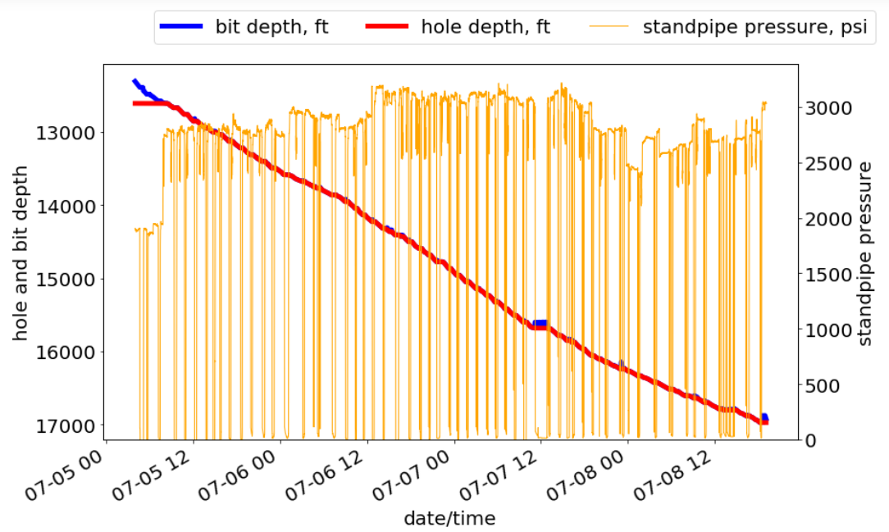
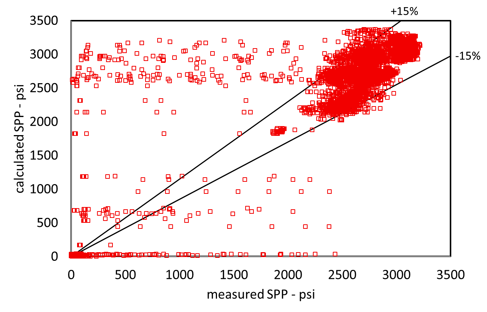
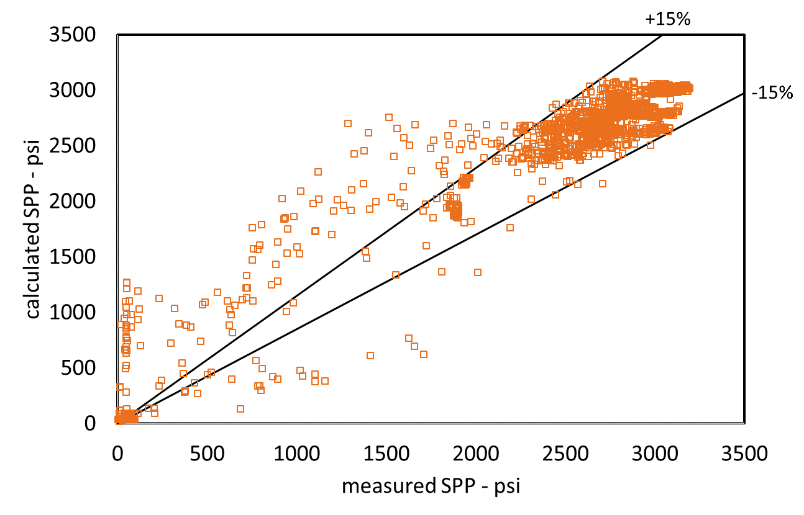
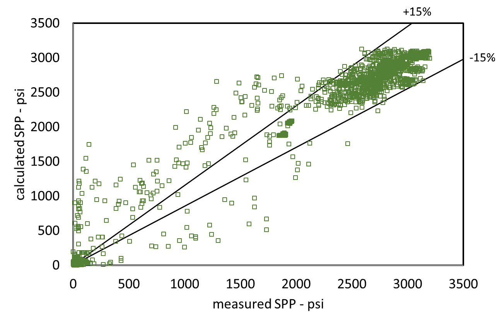
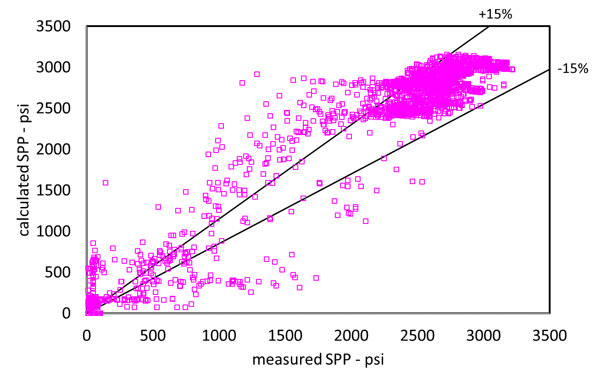
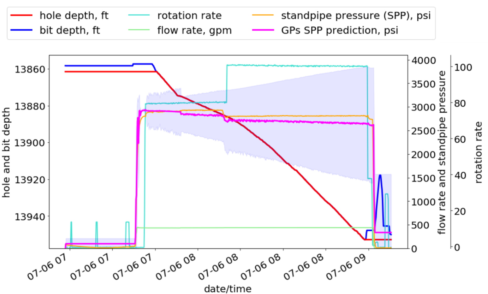
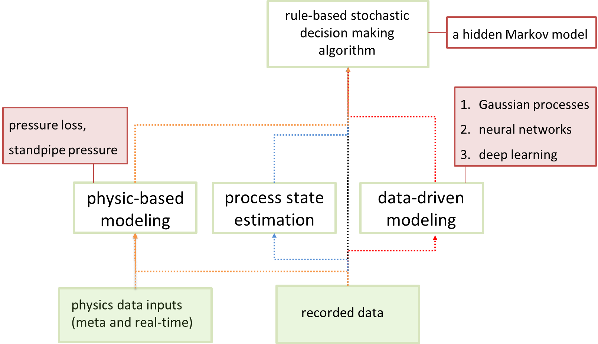
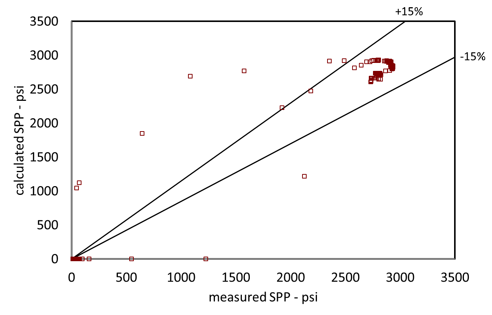
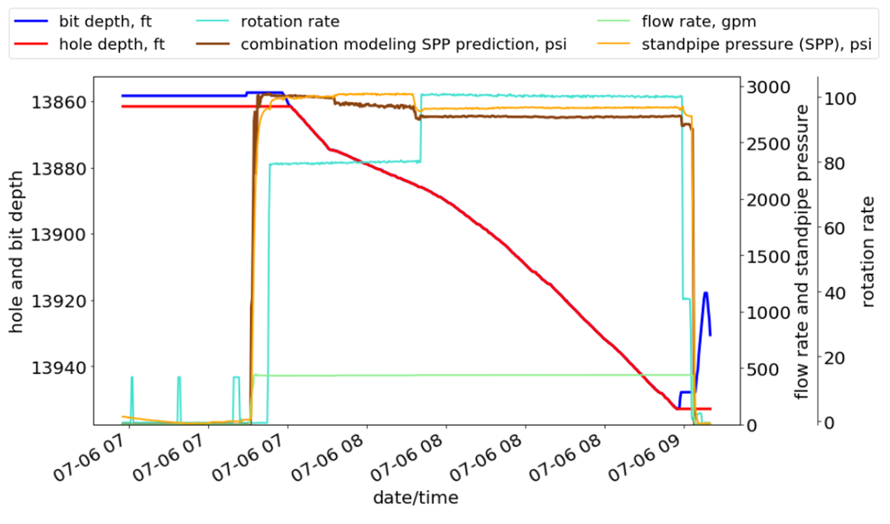

:author: Oney Erge
:email: oneyerge@utexas.edu
:institution: The University of Texas at Austin 
:orcid: 0000-0002-2687-9135

:author: Eric van Oort 
:email: vanoort@austin.utexas.edu
:institution: The University of Texas at Austin 
:bibliography: refs 

---------------------------------------------------------------------------------------------
Combining Physics-Based and Data-Driven Modeling for Pressure Prediction in Well Construction
---------------------------------------------------------------------------------------------

.. class:: abstract

  A framework for combining physics-based and data-driven models to improve well construction is presented in this study. Additionally, the proposed approach provides a more robust and accurate model that mitigates the disadvantages of using purely physics-based or data-driven models. This approach can provide improved model-based control of drilling rig actuators (assocated with mud pumps, pipe handling systems, etc.).

  Traditionally, models based on physics including Hagen-Poiseuille flow, Hooke’s law, etc. are used during well construction. Physics-based models facilitate the design of the drilling plan and are vital to safely and successfully drilling wellbores. There are two major shortcomings, however, to using purely physics-based models. First, the models can be inaccurate if the physical dynamics are not fully accounted for. Accurately capturing data to describe these processes can be involved, complex or prohibitively expensive. Second, these models must be maintained and calibrated during drilling, which requires a large amount of operator input and is liable to human error. On the other hand, pure data-driven approaches are unable to represent underlying mechanism dynamics and often struggle to properly capture causal relationships. It is shown in this work combining physics and data-driven modeling provides a more robust framework for well planning and execution.

  Machine learning techniques are combined with physics-based models via a rule-based stochastic hidden Markov model, using the modeling of frictional pressure losses during fluid circulation in the well as an example. Gaussian processes, neural networks and a deep learning model are trained and executed together with a physics model that is directly derived using first principles. 

  The results show that combination modeling can accurately predict the pressure losses even outperforming the physics-based and purely data-driven modeling. The proposed approach has a good potential to allow safer, optimized well construction operations.

.. class:: keywords

   deep learning, machine learning, combining physics-based modeling and data-driven modeling, hydraulics modeling, frictional pressure loss modeling.

1.Introduction
--------------

Well construction for energy (geothermal, oil and gas) is an inherently complex multi-disciplinary process. This process includes the interplay of solid, fluid and rock systems and requires managing subsurface events that are usually not measured or observed directly. In an attempt to digitally twin the process as much as possible, physics-based models are used during drilling wells. Physics-based models assist in the decision-making, especially in the well planning and design phases. Notably, modeling the fluid flow and managing the pressure in the wellbore is key to the safe and successful construction of wellbores.

In drilling, physics-based fluid flow models are derived directly from the first principles, using mass, momentum and energy equations. The sets of equations used to estimate the fluid behavior, are non-linear, lacking an analytical solution and can only be solved numerically. However, these numerical solutions are computationally expensive and generally fail to provide a practical real-time solution. Additionally, physics-based models have two major weaknesses: first, in a dynamic, complex system (i.e. well construction), all of the physics is typically not understood, given that the initial conditions are usually unknown. Therefore, the physics is not modeled accurately, resulting in inaccuracies; second, during any given process, input parameters change and the model should be constantly maintained to obtain useful results.

The advances of computational power and exponential growth of data have made data-driven modeling more viable and popular. Across various domains, data-driven models are being explored in an attempt to compare their performance to the physics-based models. The largest shortcoming of purely data-driven models, however, it that they are often black-box models, lacking  a connection to underlying physics and thereby complicating interpretability. In other words, a specific outcome or decision by the data-driven models may not be logically understood by the human expert. Combining the two approaches may alleviate the crucial shortcoming of each approach individually. 

In this work, we conducted physics-based simulations and trained data-driven models (neural networks and Gaussian processes) using an actual drilling dataset. We developed a hidden Markov model comprising of the process state and domain knowledge. The proposed approach shows potential to attain the best features of both approaches, and thereby allow for safer and more optimized well construction operations.

2.Literature Review
-------------------

Combining physics-based and data-driven modeling, i.e. hybrid modeling, is a relatively new field of research :cite:`karpatne2017physics`. The current literature is limited and spread across various domains. Consequently, the literature review below includes examples from distinct domains and diverse discussions. It should be noted that there are discrepancies in the terminology used in the literature of hybrid modeling. Although discussing the correct terminology/definitions is not within the scope of this paper, we do point out several of these discrepancies in the following. 

:cite:`an2013options` investigated several prognostics techniques to predict the remaining useful life (RUL) of structural components (i.e. steel, aluminum), analyzing fatigue crack length growth over several loading cycles. They classified these prognostic techniques for condition-based maintenance (CBM) under three categories: physics-based, data-driven and hybrid models. In terms of data-driven modeling, the authors used neural networks (NN) and Gaussian Processes (GPs). For the physics-based and hybrid models, the authors referred to the two correlation type models as physics-based models and combined them with particle filters (PF) and Bayesian method (BM). They found that physics-based models provide significantly better accuracy at long-term RUL prediction. In case where the physics model is not available, purely data-driven models can be used for short term prediction. 

:cite:`karpatne2017physics` presented a framework to combine a physics-based model with neural networks, referring to the approach as physics guided neural networks (PGNN). They included a physics-based loss function in the learning objective of the neural networks, and applied this framework to model the temperature of lakes. By combining physics-based and data-driven modeling, better scientific consistency was achieved. They discovered the need for calibration to be a significant disadvantage of the physics-based models, which can be time-consuming. However, in this study, the physics-based model was actually a function containing a set of curve-fitted coefficients, i.e. a correlation. It is not derived using the first principles, but uses coefficients that are estimated using measurements taken on some physical dynamics. It is therefore not strictly a physics-based model. Their results showed that PGNN outperformed a purely data-driven method (NN) in terms of accuracy and consistency.

:cite:`kloss2017combining` evaluated several approaches in the context of robots interacting with the physical world via analytical models, data-driven and hybrid models. They also analyzed the advantages and disadvantages of neural networks-based learning approaches for planar pushing. By applying neural networks to extract the physics model’s inputs, they used the second stage of a reduced analytical model. In short, they used neural networks for perception and the analytical model for prediction. Two significant advantages of hybrid modeling were noted to be the reduction in the required amount of training data as well as the improvement in the generalization of physical interaction providing physically meaningful results.

:cite:`rahman2018hybrid` used data-driven modeling to accelerate the computational speed of a solver for incompressible flows. The computationally stiff part of the Poisson equation is solved through the data-driven approach, while the non-stiff part is handled with the incompressible flow solver. Orthogonal base functions are used in the reduced-order model space to solve the Poisson equation. By doing so, it is computationally significantly cheaper compared to a solver using finite differencing. Through data exchange between the full and reduced-order spaces, they achieved a significant reduction in the computational cost. 

:cite:`kaneko2018combining` noted that physics-based models, especially for drillstring dynamics, are not adequate for real-time operations. First, there are a lot of unknown parameters. Second, the physics model needs to be constantly tuned to fit the actual data. Their hybrid modeling approach was to use a recurrent neural network to train using the historical data of an ongoing drilling operation, and subsequently predict the drillstring dynamics in real-time. They recommended using the physics simulations of drillstring dynamics in case there is not enough data to properly train the network.

:cite:`duraisamy2019turbulence` incorporated data-driven modeling into traditional turbulence modeling, with the intent to quantify and reduce uncertainties. They used statistical inference to extract model coefficients and discrepancies to improve the overall turbulent flow modeling accuracy. They combined physics-based and data-driven modeling in this order: first, the model discrepancy term is extracted via statistical inference from the datasets of interest. Then data-driven techniques are applied to calculate the discrepancies in the variables associated with the mean flow and turbulence. Finally, these discrepancies are given as input to Reynolds averaged Navier-Stokes (RANS) solvers as a correction to the traditional turbulence models in order to improve the overall accuracy. They highlighted that when using a data-driven approach, the uncertainties need to be presented and the physical and mathematical constraints need to be taken into account. Their work also showed that machine learning models need to be combined with physics models to produce credible results. 

:cite:`gavrishchaka2019synergy` proposed a framework to combine physics-based (domain-focused) and data-driven (domain-agnostic) models to analyze physiological data and quantify the physiological state and abnormalities. They included expert knowledge into the modeling via a boosting-based ensemble learning algorithm, and presented several applications on how to combine various data sources to quantify neurological abnormalities. They used simulated data (heart rates simulated using differential equations) to compliment the accumulated measurements, and applied deep neural networks for predictions. At one of their examples using gait data, combining the domain and data-driven modeling allowed more accurate detection rates of abnormalities at a level of 40-50%. Overall, they strongly emphasized the use of simulated data to properly train the data-driven models by increasing the data quantity.

:cite:`pulpeiro2019modeling` used a set of submodels in series to analyze the changes in the temperature and pressure across an engine system. They used a mix of physics-based (for charge-air intercooler, engine cylinder) and empirical (for intake and exhaust manifold) models to predict critical temperatures and pressures in the gas exchange system to facilitate model-based control. They also used artificial neural networks for the turbocharger submodel. By combining this set of submodels, the results showed a fair agreement with the measurements. 

:cite:`marino2019combining` outlined the advantages of combining physics-based and data-driven modeling to obtain improved inductive bias, improved scalability to larger datasets and better interpretability. They experimented using this approach with a system of pendulum, acrobat, cartpole and multibody dynamics. They proposed an Explicit Variational Gaussian Process, where they incorporated the domain knowledge through an explicit linear prior, which is developed using Newtonian mechanics. They concluded that black-box models ignore the structure of the problem and are less explainable, and increased interpretatbility by combining modeling approaches.  

3. Modeling the Flow of Non-Newtonian Fluids in Well Construction 
-----------------------------------------------------------------

In the circulation system of a well under construction, the drilling fluid travels through the surface lines into the drillstring, passes through the nozzles of the bit and returns to the surface through the annulus. Frictional pressure losses in the circulation system are measured at the standpipe as standpipe pressure (SPP). Several parameters have a significant effect on the SPP, such as depth, flow rate, rotation of the drillstring, etc. The effects need to be modeled in agreement with drilling fluid behavior in the particular well geometry. Doing so, is key to be able to accurately predict the pressure losses such that well circulating pressures can be managed within the constraints of the so-called drilling margin. 

Well contruction fluids (drilling fluid, completion fluids, cementing fluids etc.) are generally thixotropic non-Newtonian fluids that are shear-rate, temperature- and pressure-dependent. The rheological behavior of the drilling fluids is preferably modeled in accordance with the three-parameter Herschel and Bulkley fluid model  (:cite:`herschel1926konsistenzmessungen`), which is given by: 

.. math::
   :label: HerschelandBulkley

   \tau = \tau_y + K\dot{\gamma}^m

where :math:`\tau` is shear stress, :math:`\tau_y` is yield stress, :math:`K` is consistency index, :math:`\dot{\gamma}` is shear-rate and :math:`m` is flow behavior index. 

The SPP was predicted considering this rheological model and making use of an actual drilling dataset obtained for Well “A”. This dataset pertains to a 4200 ft. drilling section and contains about 500K datapoints. In Fig. :ref:`egfigure1`, the hole vs. bit depth curve with the SPP of Well A is presented. 

    Hole and bit depth vs. time curve of Well A. :label:`egfigure1`

3.1. Physics-based modeling
---------------------------

Flow in the circulation system during drilling can be summarized in three parts: flow in pipes (surface lines and inside the drillstring), annuli and the bit. Pump pressure (assuming no back-pressure applied on the annular side) is given as:

.. math::
   :label: pumppressure

   P_{pump} = \Delta P_{surface} + \Delta P_{drillstring} + \Delta P_{bit} + \Delta P_{annulus}

where :math:`P_{pump}` is pump pressure, :math:`\Delta P_{surface}` is the pressure loss in the surface pipes, :math:`\Delta P_{drillstring}` is the pressure loss in the drillstring, :math:`\Delta P_{bit}` pressure loss at the bit and and :math:`\Delta P_{annulus}` is the pressure loss in the annulus. The standpipe pressure is measured at the downstream, high-pressure end of the pump, and can be approximated by the pump pressure while ignoring the minor frictional pressure loss contribution of the surface lines. 

Physics-based modeling of the Herschel and Bulkley fluid flow at each individual geometry was accomplished with the equations presented in the literature (:cite:`bourgoyne1991applied`, :cite:`aadnoy2009advanced`). For the flow in annuli, the equations from  (:cite:`erge2015effects`) were used, which consider the effects of drillpipe eccentricity within the wellbore and rotation of the drillpipe on frictional pressure losses. The physics-based equations are derived from the first principles and were coded in Python. An iterative numerical scheme was programmed for the Herschel and Bulkley fluid flow in pipes and annuli. SciPy’s scipy.optimize (:cite:`2020SciPy-NMeth`) was used to solve for the turbulent flow friction factor. Numba  (:cite:`lam2015numba`) was used to accelerate the handling of computationally heavy functions. 

At each time-step, a physics-based estimation was made for the entire dataset. Prediction performance, calculated vs. measured SPP of Well A is presented in Fig. :ref:`egfigure2`.

   Physics-based model results of calculated vs. measured SPP values. :label:`egfigure2`

The results show that the physics model underestimates the standpipe pressure, mainly because of the transient events occurring while turning the pumps on or off. An in-depth analysis suggests steady-state models estimate a zero pressure when the pumps are turned off. However, in reality, when the pumps are turned off, the pressure does not immediately drop to zero. It means that there is a delay between the flow rate and pressure, which is not accounted for in steady-state physics models.

3.2. Data-driven modeling
-------------------------

Deep learning neural networks perform very well in capturing the complex relationships of the data (:cite:`haykin1994neural`). A PyTorch (:cite:`paszke2019pytorch`) implementation of a single and multi-layered neural network was developed to learn from the drilling time-series sensory data. The network was trained with flow rate, rotation rate, bit depth and hole depth to predict the standpipe pressure. Before training the network, the data was preprocessed and transformed using Scikit-Learn’s preprocessing library (:cite:`pedregosa2011scikit`). And, the training and test datasets are converted into NumPy (:cite:`oliphant2006guide`; :cite:`5725236`) arrays. 

While training the networks, Adam (:cite:`kingma2014adam`) was used as the optimizer for the model. At each epoch, a backward pass was made and the weights of the networks were updated. The Visdom (:cite:`visdom`) library was used to visualize the loss function while the network was being trained. For most of the figures in this paper, the matplotlib library (:cite:`hunter2007matplotlib`) was used for visualization.

Several analyses were conducted to assess various neural network configurations to find feasible setups and good performance on drilling time-series data. First, the data was randomly shuffled and split using the PyTorch’s random_split function to a 4:1 training to test ratio. Then, a single hidden layer neural network was trained. The performance results are presented in Fig. :ref:`egfigure3`. Results show that even a single hidden layer neural network shows good performance, and that a 4:1 randomly shuffled learning provides a significant accuracy for this particular dataset. A quantitative analysis about the accuracy is presented in table :ref:`mtable`.

   Data-driven model results of calculated vs. measured SPP values. Obtained by using neural networks, a single hidden layer, randomly sampling, and a 4-to-1 training-to-test ratio. :label:`egfigure3`

For deep learning, the number of hidden layers were varied. It was found that approximately ten hidden layers appear to provide satisfactory results in terms of computational performance and accuracy for this particular drilling dataset. The results are shown in Fig. :ref:`egfigure4`. In comparison with a single layer neural network, the accuracy was slightly better, and the time to train the neural network was shortened.

   Data-driven model results of calculated vs. measured SPP values. Obtained by using neural networks, ten hidden layers, randomly sampling, and a 4-to-1 training-to-test ratio. :label:`egfigure4`

Additionally, a real-time system was assumed. Instead of randomly shuffling the data, the training data was divided into sequential intervals. The network was trained using the first two-thirds of the data to predict the standpipe pressure for the remaining one-third. The results are presented in Fig. :ref:`egfigure5`. The network was able to identify the correlation of drilling parameters for the one-third progression of the drilling without the knowledge of the deeper sections. By only training from the initial two-thirds, the results still provided good performance for the latter one-third. The results show that even without randomly shuffling data and training the network, a good performance was obtained with this intervals-in-sequences approach.

   Data-driven model results of calculated vs. measured SPP values. Obtained by using neural networks, ten hidden layers, trained in sequential intervals. Learned first two-thirds of the dataset and predict the subsequent one-third. :label:`egfigure5`

Non-paramteric regression modeling using Gaussian Processes (GP) was also performed for this particular dataset. Scikit-Learn’s GP library was used with a Matérn kernel (:cite:`rasmussen2003gaussian`) as follows:

.. math::
   :label: maternkernel

    k_{Mat\acute{e}rn} = \frac{2^{1 - \nu}}{\Gamma (\nu)}(\frac{ \sqrt{2\nu r}}{\ \ell \  })^\nu K_{\nu}(\frac{ \sqrt{2\nu r}}{\ \ell \ }  ) 

where :math:`\nu` and :math:`\ \ell \ ` (length scale) are the hyperparameters of the kernel. . The parameter :math:`\nu` controls the smoothness of the learned function. In particular, the approximated function becomes smoother as the :math:`\nu` value gets larger. At :math:`\nu = \infty`, the kernel becomes the Radial Basis Function (RBF) kernel. 

For this particular drilling dataset, the priors and results of various kernels were analyzed. The Matérn kernel and a mixed kernel of RBF and WhiteKernel showed superior performance in comparison to others. Results from the Matérn kernel with :math:`\nu = 0.5` and :math:`\ \ell \ = 1.0` are presented.

Using the GPs, only a subsample of the entire drilling dataset was analyzed due to memory restrictions. The data was partitioned into so-called drilling stands, which consist  of lenghts of three ~30 ft. drillpipe sections connected together. The reason for such stand-by-stand partitioning of the data was to get an abstract representation of the drilling process, and to localize the GPs training into drilling intervals. 

In this example, the data from four historical stands were used in training the GPs to predict the SPP values for one stand into the future. The time-series results are shown in Fig. :ref:`egfigure6`. Note that GPs also provided the cone of uncertainty with their prediction. The prediction performance is presented in Fig. :ref:`egfigure7`. The results show that the predictions using GPs based on learning from the previous four stands show good agreement with the measurements.

   Data-driven model results presented in drilling time-series data of Well A. Obtained by using Gaussian Processes with a Matérn kernel with :math:`\nu = 0.5` and :math:`\ \ell \ = 1.0`. :label:`egfigure6`

.. figure:: fig7.png

   Data-driven model results of calculated vs. measured SPP values. Obtained by using Gaussian Processes with a Matérn kernel with  :math:`\nu = 0.5` and :math:`\ \ell \ = 1.0`. :label:`egfigure7`

3.3. Combination of the Physics-Based and Data-Driven Modeling
--------------------------------------------------------------

After obtaining the results from the physics-based and data-driven modeling, a rule-based stochastic decision-making algorithm was developed to combine these models. A hidden Markov model was constructed using the Pomegranate (:cite:`schreiber2017pomegranate`) library. 

Both the physics-based and data-driven models were combined with the process state of the operation and included in the hidden Markov model, as illustrated in Fig. :ref:`egfigure8`. The process state was calculated by analyzing the multitude of sensor measurements (such as hookload, standpipe pressure, etc.) to analytically determine the rig state (:cite:`hamzah2019automated`). A simple pattern recognition technique, i.e. regular expressions (:cite:`kleene1951representation`), which can be implemented through Python’s re library or NumPy’s (:cite:`oliphant2006guide`) numpy.where function, proved sufficient to calculate these rig states.  

The hidden Markov model combined the information from the historical data, the process state, the physics-based and the data-driven model, following the flow chart shown in Fig. :ref:`egfigure8`.

   Combination of physics-based and data-driven modeling flow chart. :label:`egfigure8`

In this implementation of the hidden Markov model, the observable state is a string representation of the combined results from the physics-based and data-driven models and the rig’s state. The hidden state is the combined ideal result given the circumstance. 

Through the hidden Markov model some rules can be applied. A rule can for instance state that the likelihood of zero SPP can be significant for certain process state(s). For example, the SPP should be zero if drilling is temporarily halted and the drillstring is in slips with a zero flow rate. The Viterbi algorithm (:cite:`viterbi1967error`) can then be used to calculate the path of the maximum likelihood. 

As another example, we can identify inaccuracies of the physics-based model by understanding the operational state and historical SPP data. Doing so, yields an advantage to the data-driven model. The hidden Markov model will then attribute a higher weight and trust to the data-driven model. Comparatively, the results from the data-driven model can be unrealistic for various reasons (i.e. outliers, sensor errors, etc.), and the physics model can be assigned a higher weight. 

By applying such rules, as an example, the combination modeling of physics and GPs model is achieved and the results are presented in Fig. :ref:`egfigure9`.

   Proposed combined modeling results of calculated vs. measured SPP values. Physics-based model and GPs results are combined through a hidden Markov model. :label:`egfigure9`

The results showed good performance when the physics-based and data-driven models were combined. In Fig. :ref:`egfigure10`, the results of the combination modeling in time-series is presented. 

   Combined modeling results presented in time-series drilling dataset. :label:`egfigure10`

The hidden Markov model was able to provide better results through the application of relatively simple rules in comparison with using physics-based or data-driven modeling separately. The results show that the combined model outperformed all others. The summary of the results and their statistical significance are presented in the table :ref:`mtable`.

.. table:: Summary of the results from experimenting with various modeling approaches. :label:`mtable`

   +----------------------+------+------+-----------+---------+
   |                      | RMSE | R^2  | Median AE | Mean AE |
   +======================+======+======+===========+=========+
   | Physics Model        | 619.4| 0.699| 93.7      | 256.6   |
   +----------------------+------+------+-----------+---------+
   | NN [randomly sampled]| 163.5| 0.979| 78.4      | 106.7   |
   +----------------------+------+------+-----------+---------+
   | Deep Learning        | 158.0| 0.980| 60.5      | 92.1    |
   | [randomly sampled]   |      |      |           |         |
   +----------------------+------+------+-----------+---------+
   | Deep Learning        | 213.9| 0.963| 148.7     | 172.2   |
   | [sequential interval]|      |      |           |         |
   +----------------------+------+------+-----------+---------+
   | Gaussian Processes   | 140.3| 0.987| 99.0      | 107.4   |
   +----------------------+------+------+-----------+---------+
   | Combination model    | 109.4| 0.992| 74.8      | 71.4    |
   +----------------------+------+------+-----------+---------+

4. Conclusions 
--------------

A framework for combining physics-based and data-driven modeling is proposed through a rule-based stochastic decision-making algorithm. Physics-based modeling of standpipe pressure was performed using equations derived from first principles.. In addition, various data-driven modeling approaches were explored using a well dataset. Then, the two approaches were combined through the use of a hidden Markov model.  

The combined model clearly outperforming all other models. Moreover, it managed to predict better results even while the pumps were off, a circumstance for which the data-driven model estimated unrealistic positive pressures. 

Drilling critically relies on properly managing fluid circulating pressure in the wellbore for safety and efficiency. Through the proposed combination modeling, circulating pressure can be better predicted, which will lead to safer and more (cost-)efficient operations. Note that the proposed framework is not limited to the prediction of circulating pressure, and can be extended to other well construction domains.

Acknowledgment
--------------

The authors thank the Rig Automation and Performance Improvement in Drilling (RAPID) group at The University of Texas at Austin and its sponsors for their guidance and support.

Nomenclature
------------

:math:`K: \ \quad consistency  \  index,Pa\ s^m  \\* K_{\nu}: \quad  modified  \  Bessel  \  function  \\*  m: \ \quad flow \ behavior \ index \\*  P: \ \quad pressure, Pa \\*  k:\ \quad kernel   \  function` 

Greek Letters
-------------

:math:`\tau: \ \quad shear \ stress, Pa  \\* \dot{\gamma}:  \ \quad  shear \  rate, 1/s   \\* \nu:  \ \quad hyperparameter \  of \  Mat\acute{e}rn \ kernel  \\*  \ \ell \ : \ \quad length \  scale \  of \  Mat\acute{e}rn \  kernel`

Subscripts
----------

:math:`y: \ \quad yield`

