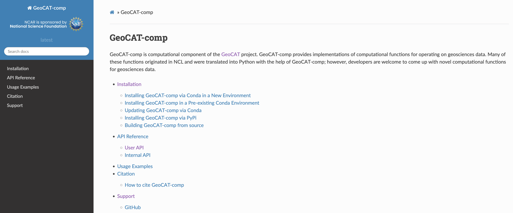
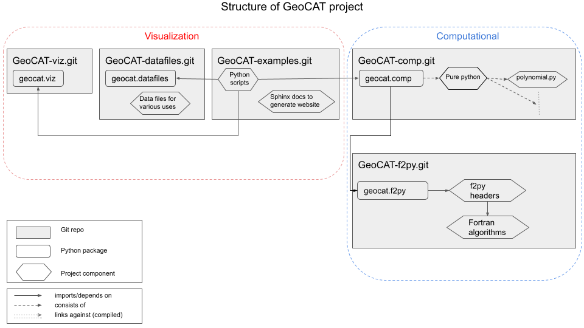

:author: Orhan Eroglu
:email: oero@ucar.edu
:institution: National Center for Atmospheric Research
:corresponding:

:author: GeoCAT member 1
:email: email
:institution: National Center for Atmospheric Research

:author: GeoCAT member 2
:email: email
:institution: National Center for Atmospheric Research

:author: GeoCAT member 3
:email: email
:institution: National Center for Atmospheric Research

:author: John Clyne
:email: clyne@ucar.edu
:institution: National Center for Atmospheric Research

:bibliography: references

:video: https://www.youtube.com/watch?v=34zFGkDwJPc

---------------------------------------------------------------------------------------------------------------------------
The Geoscience Community Analysis Toolkit: An Open Development, Community Driven Toolkit in the Scientific Python Ecosystem
---------------------------------------------------------------------------------------------------------------------------

.. class:: abstract

The Geoscience Community Analysis Toolkit (GeoCAT) team develops and maintains
data analysis and visualization tools on structured and unstructured grids for
the geosciences community in the scientific Python ecosystem. In response to
dealing with increasing geoscientific data sizes, GeoCAT prioritizes scalability,
ensuring its implementations to be scalable from personal laptops to HPC clusters.
Another major goal of the GeoCAT team is to ensure community involvement throughout
the whole project lifecycle, which is realized through an open development mindset
by encouraging the users/contributors to get involved in any decision-making.

.. class:: keywords

   data analysis, geocat, geoscience, open development, open source, scalability,
   visualization

Introduction
------------

The Geoscience Community Analysis Toolkit (GeoCAT) team, established in 2019,
leads the software engineering efforts of the National Center for Atmospheric
Research (NCAR)’s “Pivot to Python” initiative :cite:`pivot19`. GeoCAT essentially
aims at creating scalable data analysis and visualization tools on structured and
unstructured grids for the geosciences community in the scientific Python
ecosystem. The GeoCAT team is committed to open development, which helps the
team prioritize community involvement at any level of the project lifecycle
alongside having the whole software stack open-sourced.

GeoCAT created several, now-established, Python tools that are hosted and
managed publicly on Github to develop computation and visualization functions,
which  are built on cornerstone Pangeo :cite:`pangeo18` (i.e. a community platform
for big data geoscience) packages such as Xarray :cite:`xarray17`, Dask
:cite:`dask15`, as well as Jupyter Notebooks, and is compatible with Numpy. Dask
compatibility allows the GeoCAT-comp functions to scale from personal laptops to
high performance computing systems such as NCAR’s Casper, Cheyenne, and upcoming
Derecho clusters :cite:`ams22heather`.

Briefly, GeoCAT-comp houses computational operators for applications ranging from
regridding and interpolation, to climatology and meteorology. GeoCAT-examples
provides over 140 publication-quality plotting scripts in Python for Earth
sciences. It also houses Jupyter notebooks with high-performance, interactive
plots that enable features such as pan and zoom on fine-resolution geoscience
data (e.g. ~3 km data rendered within a few tens of seconds to few minutes on
personal laptops). GeoCAT-viz enables higher-level implementation of Matplotlib
and Cartopy plotting capabilities through it's variety of easy to use
visualization convenience functions for GeoCAT-examples. GeoCAT also maintains
WRF-Python (Weather Research and Forecasting), which works with WRF-ARW model
output and provides diagnostic and interpolation routines.

GeoCAT was recently awarded Project Raijin, which is an NSF EarthCube-funded
effort :cite:`raijinaward21`. Its goal is to enhance the open-source analysis
and visualization tool landscape by developing community-owned, sustainable,
scalable tools that facilitate operating on unstructured climate and global
weather data in the scientific Python ecosystem. Throughout this three-year
project, GeoCAT will work on the development of data analysis and
visualization functions that operate directly on the native grid as well as
establish an active community of user-contributors.

This paper will provide insights about the GeoCAT's software stack and
current status, team scope and near-term plans, open development methodology,
as well as ways of community involvement.

GeoCAT Software
---------------

The GeoCAT team develops and maintains several open-source software tools. Before
describing those tools, it is vital to explain in detail how the team implements the
continuous integration and continuous delivery/deployment (CI/CD) in consistence
for all of those tools.

Continuous Integration and Continuous Delivery/Deployment (CI/CD)
=================================================================

GeoCAT employs a continuous delivery model, which has been achieved through the use
of a monthly package release cycle on package management systems and package indexes
such as Conda :cite:`conda` and PyPI :cite:`conda`. This model helps the team make
new functions available as soon as they are implemented and address potential errors
pretty quickly. To assist this process, the team utilizes advanced  technologies
throughout Github assets to ensure automation, unit testing and code coverage, as
well as licensing and reproducibility. Figure :ref:`fig1badges`, for example,
illustrates the set of badges from one of our software tools, GeoCAT's computational
component, GeoCAT-comp, which shows the near real-time status of each CI/CD
implementation at any time in the Github repository homepage.

CI build tests of our repositories are implemented and
automated (for pushed commits, pull requests, and daily scheduled execution) via
Github Actions workflows :cite:`githubactions`, and the "CI" badge shows if those
workflows are passing or failing. Similarly, the "CONDA-BUILDS" badge shows if the
conda recipe works successfully for the repository. The percent code coverage through
unit tests are being analyzed with the "codecov" Python package :cite:`codecov`, and
its overall results as well as details per code script can be seen via the "COVERAGE"
badge. Each of our software repositories has a corresponding documentation page that
is populated mostly-automatically through Sphinx Python documentation generator
:cite:`sphinx` and published through ReadTheDocs :cite:`readthedocs` via an automated
building/versioning schema. The "DOCS" badge provides a link to the documentation page
as well as shows failures, if any, with the documentation rendering process. Figure
:ref:`fig2rtd` shows the documentation homepage of GeoCAT-comp for instance. The
"NCAR" and "PYPI" badges in the "Package" row shows and links to the latest versions
of the software tool distributed through NCAR's Conda channel and PyPI, respectively.
The "LICENSE" badge provides a link to our software licenses, which is Apache License
version 2.0 for all of the GeoCAT stack that enables the redistribution of the
open-source software products on an "AS IS" basis. Finally, to provide reproducibility
of our software products (either for the latest or any older version), we publish
version-specific Digital Object Identifiers (DOIs), which can be accessed through the
"DOI" badge. This allows the end-user to accurately cite the specific version of the
GeoCAT tools they used for scientific/research purposes.

.. figure:: figures/fig1_badges.png
   :scale: 35%
   :figclass: bht

   GeoCAT-comp's badges in the beginning of its README file (i.e. the home page of
   the Githug repository) :cite:`geocatcomprepo` :label:`fig1badges`

   GeoCAT-comp documentation homepage built with Sphinx using a theme provided by
   ReadTheDocs :cite:`geocatcomprtd` :label:`fig2rtd`

GeoCAT-comp
===========

GeoCAT-comp is the computational component of the GeoCAT project as can be seen in
Figure :ref:`fig2rtd`, and it houses implementations of geoscience data analysis
functions. Novel research and development is conducted for analyzing structured as
well as unstructured grid data from various research fields such as climate,
weather, atmosphere, ocean, etc. In addition, some of the functionalities of
GeoCAT-comp are inspired/reimplemented from NCAR Command Language (NCL).

Spherical harmonics (both decomposition and recomposition as well as area
weighting); Fourier transforms such as band-block, band-pass, low-pass, and
high-pass; meteorological variables such as relative humidity, dewpoint temperature,
heat index, saturation vapure pressure, etc.; climatology functions such as climate
average over multiple years, daily/monthly/seasonal averages, as well as anomalies;
regridding of curvilinear grid to rectilinear grid, unstructured grid to rectilinear
grid, curvilinear grid to unstructured grid, and vice versa; interpolation methods
such as bilinear interpolation of a rectilinear to another rectilinear grid,
hybrid-sigma levels to isobaric levels, and sigma to hybrid coordinates; empirical
orthogonal function (EOF) analysis; are some of the functions that are made
available through GeoCAT-comp :cite:`geocatcomprtd`.

   GeoCAT project structure with all of the software tools
   :cite:`geocatcontribguide` :label:`fig3structure`

Many of the computational functions in GeoCAT are implemented in pure Python.
However, there are some others that are implemented in Fortran but wrapped up
in Python. To facilitate contribution, the whole GeoCAT-comp structure is split
into two repositories with respect to being either pure-Python or Python with
compiled codes (i.e. Fortran) implementations. Such implementation layers are
handled within GeoCAT-comp and GeoCAT-f2py repositories, respectively.

GeoCAT-comp code-base does not explicitly contain or require any compiled
code, making it more accessible to the general Python community at large.
In addition, GeoCAT-f2py is automatically installed through GeoCAT-comp
installation, and all functions contained in the "geocat.f2py" package are
imported transparently into the "geocat.comp" namespace. Thus, GeoCAT-comp
serves as a user API to access the entire computational toolkit even though
its Github repository itself only contains pure Python code from the
developer’s perspective. Whenever prospective contributors want to add new
computational functionality implemented as pure Python, GeoCAT-comp is the
Github repository to deal with. Therefore, there is no onus on contributors
of pure Python code to build/compile/test any compiled code (i.e. Fortran)
at GeoCAT-comp level.

GeoCAT-examples
===============

G

Project Raijin
--------------

To realize this, GeoCAT
created the Xarray-based Uxarray package to recognize unstructured grid models
through partnership with the geoscience community groups.

Open Development
----------------

To ensure community involvement at any level in the development lifecycle, GeoCAT
is committed to an open development model. With this model, we not only
have our code-base open-sourced but also ensure most of the project assets that are
directly related to the software development lifecycle are publicly accessible.
In order to implement this model, GeoCAT provides all of its software tools as
Github repositories with publicly accessible Github project boards and roadmaps,
issue tracking and development reviewing, comprehensive documentation for
users/contributors such as Contributor’s Guide and toolkit-specific
documentation, along with community announcements on the GeoCAT blog.
Furthermore, GeoCAT encourages community feedback and contribution at any level
with inclusive and welcoming language.

Community engagement
--------------------

Additionally, to further promote user engagement with the
geoscience community, GeoCAT has contributed multiple Python tutorials to
the web-based, community-owned, educational resources created through Project
Pythia. The GeoCAT team has also encouraged undergraduate and graduate student
engagement in the python ecosystem through participation in NCAR's Summer
Internships in Parallel Computational Science (SIParCS).

