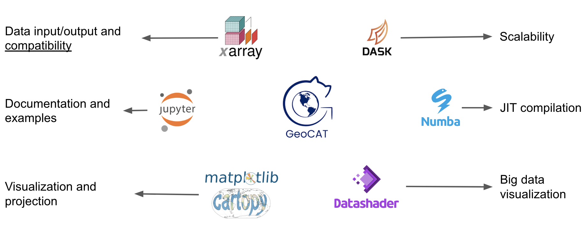
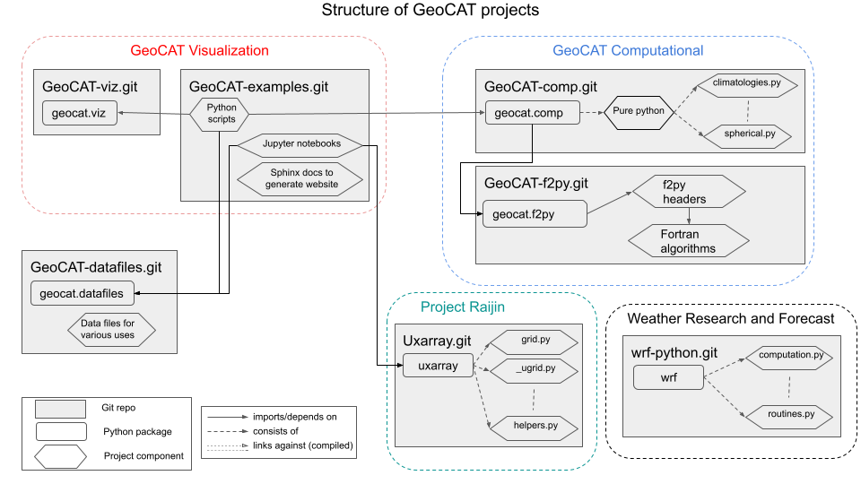
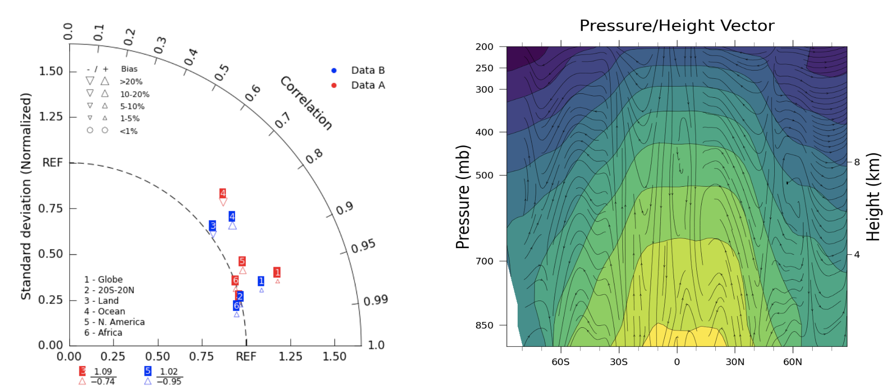
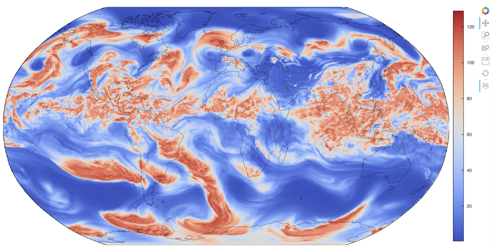
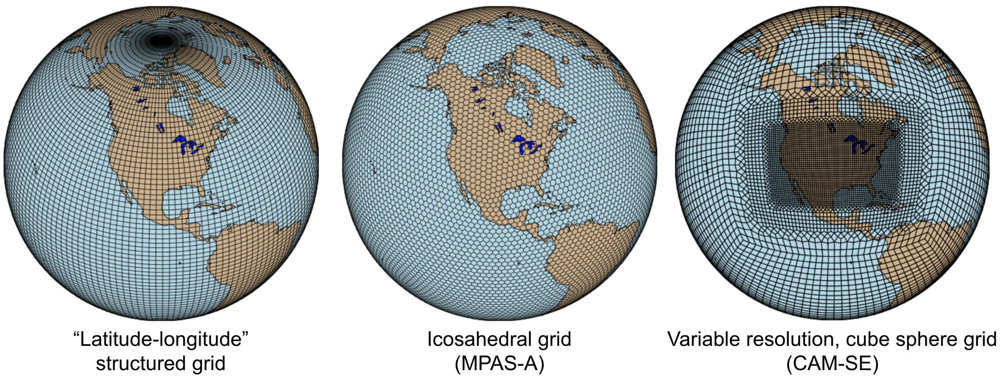

:author: Orhan Eroglu
:email: oero@ucar.edu
:institution: National Center for Atmospheric Research
:corresponding:

:author: Anissa Zacharias
:email: anissaz@ucar.edu
:institution: National Center for Atmospheric Research

:author: Michaela Sizemore
:email: misi1684@ucar.edu
:institution: National Center for Atmospheric Research

:author: Alea Kootz
:email: akootz@ucar.edu
:institution: National Center for Atmospheric Research

:author: Heather Craker
:email: hcraker@ucar.edu
:institution: National Center for Atmospheric Research

:author: John Clyne
:email: clyne@ucar.edu
:institution: National Center for Atmospheric Research

:bibliography: references

:video: https://www.youtube.com/watch?v=34zFGkDwJPc

---------------------------------------------------------------------------------------------------------------------------
The Geoscience Community Analysis Toolkit: An Open Development, Community Driven Toolkit in the Scientific Python Ecosystem
---------------------------------------------------------------------------------------------------------------------------

.. class:: abstract

The Geoscience Community Analysis Toolkit (GeoCAT) team develops and maintains
data analysis and visualization tools on structured and unstructured grids for
the geosciences community in the Scientific Python Ecosystem (SPE). In response to
dealing with increasing geoscientific data sizes, GeoCAT prioritizes scalability,
ensuring its implementations are scalable from personal laptops to HPC clusters.
Another major goal of the GeoCAT team is to ensure community involvement throughout
the whole project lifecycle, which is realized through an open development mindset
by encouraging users and contributors to get involved in decision-making. With this
model, we not only have our project stack open-sourced but also ensure most of the
project assets that are directly related to the software development lifecycle are
publicly accessible.

.. class:: keywords

   data analysis, geocat, geoscience, open development, open source, scalability,
   visualization

Introduction
------------

The Geoscience Community Analysis Toolkit (GeoCAT) team, established in 2019,
leads the software engineering efforts of the National Center for Atmospheric
Research (NCAR) “Pivot to Python” initiative :cite:`pivot19`. Before then,
NCAR Command Language (NCL) :cite:`ncl` was developed by NCAR as an interpreted,
domain-specific language that was aimed to support the analysis and
visualization needs of the global geosciences community. NCL had been serving
several tens of thousands of users for decades. It is still available for use
but has not been actively developed as it has been in maintenance mode.

The initiative had an initial two-year roadmap with major milestones being: (1)
Replicating NCL’s computational routines in Python, (2) training and support for
transitioning NCL users into Python, and (3) moving tools into an open development
model. GeoCAT aims to create scalable data analysis and visualization tools on
structured and unstructured grids for the geosciences community in the SPE. The
GeoCAT team is committed to open development, which helps the team prioritize
community involvement at any level of the project lifecycle alongside having the
whole software stack open-sourced.

GeoCAT has seven Python tools for geoscientific computation and visualization.
These tools are built upon the Pangeo :cite:`pangeo18` ecosystem. In particular,
they rely on Xarray :cite:`xarray17`, and Dask :cite:`dask15`, as well as they are
compatible with Numpy and use Jupyter Notebooks for demonstration purposes. Dask
compatibility allows the GeoCAT functions to scale from personal laptops to high
performance computing (HPC) systems such as NCAR’s Casper,
Cheyenne, and upcoming Derecho clusters :cite:`ams22craker`. Additionally, GeoCAT
also utilizes Numba, an open source just-in-time (JIT) compiler :cite:`numba`, to
translate Python and NumPy code into machine codes in order to get faster
executions wherever possible. GeoCAT's visualization components rely on Matplotlib
:cite:`matplotlib` for most of the plotting functionalities, Cartopy
:cite:`cartopy` for projections, as well as the Datashader and Holoviews stack
:cite:`datashader` for big data rendering. Figure :ref:`fig1coretech` shows these
technologies with their essential roles around GeoCAT.

   The core Python technologies on which GeoCAT relies on :label:`fig1coretech`

Briefly, GeoCAT-comp houses computational operators for applications ranging from
regridding and interpolation, to climatology and meteorology. GeoCAT-examples
provides over 140 publication-quality plotting scripts in Python for Earth
sciences. It also houses Jupyter notebooks with high-performance, interactive
plots that enable features such as pan and zoom on fine-resolution, unstructured
geoscience data (e.g. ~3 km data rendered within a few tens of seconds to a few
minutes on personal laptops). This is achieved by making use of the connectivity
information in the unstructured grid and rendering data via the Datashader and
Holoviews ecosystem :cite:`datashader`. GeoCAT-viz enables higher-level
implementation of Matplotlib and Cartopy plotting capabilities through its
variety of easy to use visualization convenience functions for GeoCAT-examples.
GeoCAT also maintains WRF-Python (Weather Research and Forecasting), which works
with WRF-ARW model output and provides diagnostic and interpolation routines.

GeoCAT was recently awarded Project Raijin, which is an NSF EarthCube-funded
effort :cite:`raijinaward21` :cite:`clyne2021project`. Its goal is to enhance
the open-source analysis and visualization tool landscape by developing
community-owned, sustainable, scalable tools that facilitate operating on
unstructured climate and global weather data in the SPE. Throughout this
three-year project, GeoCAT will work on the development of data analysis and
visualization functions that operate directly on the native grid as well as
establish an active community of user-contributors.

This paper will provide insights about GeoCAT's software stack and current
status, team scope and near-term plans, open development methodology, as well
as current pathways of community involvement.

GeoCAT Software
---------------

The GeoCAT team develops and maintains several open-source software tools. Before
describing those tools, it is vital to explain in detail how the team implements the
continuous integration and continuous delivery/deployment (CI/CD) in consistence
for all of those tools.

Continuous Integration and Continuous Delivery/Deployment (CI/CD)
=================================================================

GeoCAT employs a continuous delivery model, with a monthly package release cycle on
package management systems and package indexes such as Conda :cite:`conda` and PyPI
:cite:`conda`. This model helps the team make new functions available as soon as
they are implemented and address potential errors quickly. To assist this process,
the team utilizes multiple tools throughout GitHub assets to ensure automation,
unit testing and code coverage, as well as licensing and reproducibility. Figure
:ref:`fig2badges`, for example, shows the set of badges displaying the near
real-time status of each CI/CD implementation in the GitHub repository homepage
from one of our software tools.

CI build tests of our repositories are implemented and
automated (for pushed commits, pull requests, and daily scheduled execution) via
GitHub Actions workflows :cite:`githubactions`, with the `CI` badge shown in Figure
:ref:`fig2badges` displaying the status (i.e. pass or fail) of those workflows.
Similarly, the `CONDA-BUILDS` badge shows if the conda recipe works successfully for
the repository. The Python package "codecov" :cite:`codecov` analyzes the percentage
of code coverage from unit tests in the repository. Additionally, the overall results
as well as details for each code script can be seen via the `COVERAGE` badge. Each of
our software repositories has a corresponding documentation page that is populated
mostly-automatically through the Sphinx Python documentation generator :cite:`sphinx`
and published through ReadTheDocs :cite:`readthedocs` via an automated building and
versioning schema. The `DOCS` badge provides a link to the documentation page along
with showing failures, if any, with the documentation rendering process. Figure
:ref:`fig3rtd` shows the documentation homepage of GeoCAT-comp. The `NCAR` and `PYPI`
badges in the `Package` row shows and links to the latest versions of the software
tool distributed through NCAR's Conda channel and PyPI, respectively. The `LICENSE`
badge provides a link to our software licenses, Apache License version 2.0
:cite:`apache`, for all of the GeoCAT stack, enabling the redistribution of the
open-source software products on an "as is" basis. Finally, to provide reproducibility
of our software products (either for the latest or any older version), we publish
version-specific Digital Object Identifiers (DOIs), which can be accessed through
the `DOI` badge. This allows the end-user to accurately cite the specific version
of the GeoCAT tools they used for science or research purposes.

.. figure:: figures/fig2_badges.png
   :scale: 35%
   :figclass: bht

   GeoCAT-comp's badges in the beginning of its README file (i.e. the home page of
   the Githug repository) :cite:`geocatcomprepo` :label:`fig2badges`

.. figure:: figures/fig3_rtd.png
   :align: center
   :scale: 30%
   :figclass: w

   GeoCAT-comp documentation homepage built with Sphinx using a theme provided by
   ReadTheDocs :cite:`geocatcomprtd` :label:`fig3rtd`

GeoCAT-comp (and GeoCAT-f2py)
=============================

GeoCAT-comp is the computational component of the GeoCAT project as can be seen in
Figure :ref:`fig4structure`. GeoCAT-comp houses implementations of geoscience data
analysis functions. Novel research and development is conducted for analyzing both
structured and unstructured grid data from various research fields such as climate,
weather, atmosphere, ocean, among others. In addition, some of the functionalities
of GeoCAT-comp are inspired or reimplemented from the NCL in order to address the
first goal of the "Pivot to Python effort. For that purpose, 114 NCL routines were
selected, excluding some functionalities such as date routines, which could be
handled by other packages in the Python ecosystem today. These functions were
ranked by order of website documentation access from most to least, and
prioritization was made based on those ranks. Today, GeoCAT-comp provides the same
or similar capabilities of about 39% (44 out of 114) of those functions.

Some of the functions that are made available through GeoCAT-comp are listed below,
for which the GeoCAT-comp documentation :cite:`geocatcomprtd` provides signatures and
descriptions as well as links to the usage examples:

- Spherical harmonics (both decomposition and recomposition as well as area
  weighting)

- Fourier transforms such as band-block, band-pass, low-pass, and high-pass

- Meteorological variable computations such as relative humidity, dew-point
  temperature, heat index, saturation vapor pressure, and more

- Climatology functions such as climate average over multiple years,
  daily/monthly/seasonal averages, as well as anomalies

- Regridding of curvilinear grid to rectilinear grid, unstructured grid to
  rectilinear grid, curvilinear grid to unstructured grid, and vice versa

- Interpolation methods such as bilinear interpolation of a rectilinear to another
  rectilinear grid, hybrid-sigma levels to isobaric levels, and sigma to hybrid
  coordinates

- Empirical orthogonal function (EOF) analysis

   GeoCAT project structure with all of the software tools
   :cite:`geocatcontribguide` :label:`fig4structure`

Many of the computational functions in GeoCAT are implemented in pure Python.
However, there are others that were originally implemented in Fortran but are
now wrapped up in Python with the help of Numpy's F2PY, Fortran to Python
interface generator. This is mostly because re-implementing some functions
would require understanding of complicated algorithm flows and implementation
of extensive unit tests that would end up taking too much time, compared to
wrapping their already-implemented Fortran routines up in Python. Furthermore,
outside contributors from science background would keep considering to add
new functions to GeoCAT from their older Fortran routines in the future. To
facilitate contribution, the whole GeoCAT-comp structure is split into two
repositories with respect to being either pure-Python or Python with compiled
code (i.e. Fortran) implementations. Such implementation layers are handled
with the GeoCAT-comp and GeoCAT-f2py repositories, respectively.

GeoCAT-comp code-base does not explicitly contain or require any compiled
code, making it more accessible to the general Python community at large.
In addition, GeoCAT-f2py is automatically installed through GeoCAT-comp
installation, and all functions contained in the "geocat.f2py" package are
imported transparently into the "geocat.comp" namespace. Thus, GeoCAT-comp
serves as a user API to access the entire computational toolkit even though
its GitHub repository itself only contains pure Python code from the
developer’s perspective. Whenever prospective contributors want to
contribute computational functionality in pure Python, GeoCAT-comp is the
only GitHub repository they need to deal with. Therefore, there is no onus
on contributors of pure Python code to build, compile, or test any compiled
code (e.g. Fortran) at GeoCAT-comp level.

GeoCAT-examples (and GeoCAT-viz)
================================

GeoCAT-examples :cite:`geocatexamplesrepo` was created to address a few of
the original milestones of NCAR's "Pivot to Python" initiative: (1) to
provide the geoscience community with well-documented visualization examples
for several plotting classes in the SPE, and (2) to help transition NCL users
into the Python ecosystem through providing such resources. It was born in
early 2020 as the result of a multi-day hackathon event among the GeoCAT team
and several other scientists and developers from various NCAR labs/groups. It
has since grown to house novel visualization examples and showcase the
capabilities of other GeoCAT components, like GeoCAT-comp, along with
newer technologies like interactive plotting notebooks. Figure
:ref:`fig5cmap` illustrates one of the unique GeoCAT-examples cases that
was aimed at exploring the best practices for data visualization
like choosing color blind friendly colormaps.

.. figure:: figures/fig5_cmap.png
   :scale: 28%
   :figclass: bht

   Comparison between NCL (left) and Python (right) when choosing a
   colormap; GeoCAT-examples aiming at choosing color blind friendly
   colormaps :cite:`ams22sizemore` :label:`fig5cmap`

The GeoCAT-examples :cite:`geocatexamplesrtd` gallery contains over 140
example Python plotting scripts, demonstrating functionalities from Python
packages like Matplotlib, Cartopy, Numpy, and Xarray. The gallery includes
plots from a range of visualization categories such as box plots, contours,
meteograms, overlays, projections, shapefiles, streamlines, and trajectories
among others. The plotting categories and scripts under GeoCAT-examples
cover almost all of the NCL plot types and techniques. In addition,
GeoCAT-examples houses plotting examples for individual GeoCAT-comp analysis
functions.

Despite Matplotlib and Cartopy's capabilities to reproduce almost all
of NCL plots, there was one significant caveat with using their low-level
implementations against NCL: NCL's high-level plotting functions allowed
scientists to plot most of the cases in only tens of lines of codes (LOC)
while the Matplotlib and Cartopy stack required writing a few hundred
LOC. In order to build a higher-level implementation on top of Matplotlib
and Cartopy while recreating the NCL-like plots (from vital plotting
capabilities that were not readily available in the Python ecosystem at
the time such as Taylor diagrams and curly vectors to more stylistic
changes such as font sizes, color schemes, etc. that resemble NCL plots),
the GeoCAT-viz library :cite:`geocatvizrepo` was implemented. Use of
functions from this library in GeoCAT-examples significantly reduces the
LOC requirements for most of the visualization examples to comparable
numbers to those of NCL's. Figure :ref:`fig6viz` shows Taylor diagram
and curly vector examples that have been created with the help of
GeoCAT-viz. To exemplify how GeoCAT-viz helps keep the LOC comparable
to NCL, one of the Taylor diagrams (i.e. Taylor_6) took 80 LOC in NCL,
and its Python implementation in GeoCAT-examples takes 72 LOC. If many
of the Matplotlib functions (e.g. figure and axes initialization,
adjustment of several axes parameters, call to plotting functions for
Taylor diagram, management of grids, addition of titles, contours, etc.)
used in this example weren't wrapped up in GeoCAT-viz :cite:`geocatvizrepo`,
the same visualization would easily end up in around two hundred LOC.

   Taylor diagram and curly vector examples that created with the help
   of GeoCAT-viz :label:`fig6viz`

Recently, the GeoCAT team has been focused on interactive plotting
technologies, especially for larger data sets that contain millions of
data points. This effort was centered on unstructured grid visualization
as part of Project Raijin, which is detailed in a later section in this
manuscript. That is because unstructured meshes are a great research and
application field for big data and interactivity such as zoom in/out for
regions of interest. As a result of this effort, we created a new
notebooks gallery under GeoCAT-examples to house such interactive data
visualizations. The first notebook, a screenshot from which is shown in
Figure Figure :ref:`fig7mpas`, in this gallery is implemented via the
Datashader and Holoviews ecosystem :cite:`datashader`, and it provides
a high-performance, interactive visualization of a Model for Prediction
Across Scales (MPAS) Global Storm-Resolving Model weather simulation
dataset.  The interactivity features are pan and zoom to reveal greater
data fidelity globally and regionally. The data used in this work is
the courtesy of the DYAMOND effort :cite:`stevens2019dyamond` and has
varying resolutions from 30 km to 3.75 km. Our notebook in the gallery
uses the 30 km resolution data for the users to be able to download and
work on it in their local configuration. However, our work with the
3.75 km resolution data (i.e. about 42 million hexagonal cells globally)
showed that rendering the data took only a few minutes on a decent
laptop, even without any parallelization. The main reason behind such
a high performance was that we used the cell-to-node connectivity
information in the MPAS data to render the native grid directly (i.e.
without remapping to the structured grid) along with utilizing the
Datashader stack. Without using the connectivity information, it would
require to run much costly Delaunay triangulation. The notebook provides
a comparison between these two approaches as well.

   The interactive plot interface from the MPAS visualization
   notebook in GeoCAT-examples :label:`fig7mpas`

GeoCAT-datafiles
================

GeoCAT-datafiles is GeoCAT's small data storage component as a Github
repository. This tool houses many datasets in different file formats such as
NetCDF, which can be used along with other GeoCAT tools or ad-hoc data needs
in any other Python script. The datasets can be accessed by the end-user
through a lightweight convenience function:

.. code-block:: python

   geocat.datafiles.get("folder_name/filename")

GeoCAT-datafiles fetches the file by simply reading from the local storage,
if any, or downloading from the GeoCAT-datafiles repository, if not in the
local storage, with the help of Pooch framework :cite:`geocatvizrepo`.

WRF-Python
==========

WRF-Python was created in early 2017 in order to replicate NCL's Weather
Research and Forecasting (WRF) package in the SPE, and it covers 100% of
the routines in that package. About two years later, NCAR's “Pivot to
Python” initiative was announced, and the GeoCAT team has taken over
development and maintenance of WRF-Python.

The package focuses on creating a Python package that eliminates the need
to work across multiple software platforms when using WRF datasets. It
contains more than 30 computational (e.g. diagnostic calculations, several
interpolation routines) and visualization routines that aim at reducing
the amount of post-processing tools necessary to visualize WRF output
files.

Even though there is no continuous development in WRF-Python, as is seen
in the rest of the GeoCAT stack, the package is still maintained with
timely responses and bug-fix releases to the issues reported by the
user community.

Project Raijin
--------------

“Collaborative Research: EarthCube Capabilities: Raijin: Community Geoscience
Analysis Tools for Unstructured Mesh Data”, i.e. Project Raijin, of the
consortium between NCAR and Pennsylvania State University has been awarded by
NSF 21-515 EarthCube for an award period of 1 September, 2021 - 31 August,
2024 :cite:`raijinaward21`. Project Raijin aims at developing community-owned,
sustainable, scalable tools that facilitate operating on unstructured climate
and global weather data :cite:`raijin`. The GeoCAT team is in charge of the
software development of Project Raijin, which mainly consists of implementing
visualization and analysis functions in the SPE to be executed on native
grids. While doing so, GeoCAT is also responsible for establishing an open
development environment, clearly documenting the implementation work, and
aligning deployments with the project milestones as well as SPE
requirements and specifications.

GeoCAT has created the Xarray-based Uxarray package :cite:`uxarrayrepo` to
recognize unstructured grid models through partnership with geoscience community
groups. UXarray is built on top of the built-in Xarray Dataset functionalities
while recognizing several unstructured grid formats (UGRID, SCRIP, and Exodus
for now). Since there are more unstructured mesh models in the community than
UXarray natively supports, its architecture will also support addition of new
models. Figure :ref:`fig8raijin` shows the regularly structured
“latitude-longitude” grids versus a few unstructured grid models.

   Regular grid (left) vs MPAS-A & CAM-SE grids :label:`fig8raijin`

The UXarray project has implemented data input/output functions for UGRID,
SCRIP, and Exodus, as well as methods for surface area and integration
calculations so far. The team is currently conducting open discussions
(through GitHub Discussions) with community members, who are interested
in unstructured grids research and development in order to prioritize
data analysis operators to be implemented throughout the project lifecycle.

Scalability
-----------

GeoCAT is aware of the fact that today's geoscientific models are capable of
generating huge sizes of data. Furthermore, these datasets, such as those
produced by global convective-permitting models, are going to grow
even larger in size in the future. Therefore, computational and visualization
functions that are being developed in the geoscientific research and
development workflows need to be scalable from personal devices (e.g. laptops)
to HPC (e.g. NCAR's Casper, Cheyenne, and upcoming Derecho clusters) and cloud
platforms (e.g. AWS).

In order to keep up with the scalability objectives, GeoCAT functions are
implemented to operate on Dask arrays in addition to natively supporting
NumPy arrays and Xarray DataArrays. Therefore, the GeoCAT functions
can trivially and transparently be parallelized to be run on shared-memory and
distributed-memory platforms after having Dask cluster/client properly
configured and functions fed with Dask arrays or Dask-backed Xarray
DataArrays (i.e. chunked Xarray DataArrays that wrap up Dask arrays).

Open Development
----------------

To ensure community involvement at every level in the development lifecycle,
GeoCAT is committed to an open development model. In order to implement this
model, GeoCAT provides all of its software tools as GitHub repositories with
public GitHub project boards and roadmaps, issue tracking and development
reviewing, comprehensive documentation for users and contributors such as
Contributor’s Guide :cite:`geocatcontribguide` and toolkit-specific documentation,
along with community announcements on the GeoCAT blog. Furthermore, GeoCAT
encourages community feedback and contribution at any level with inclusive and
welcoming language. As a result of this, community requests and feedback have
played significant role in forming and revising the GeoCAT roadmap and projects'
scope.

Community engagement
--------------------

To further promote engagement with the geoscience community, GeoCAT organizes
and attends various community events. First of all, scientific conferences and
meetings are great venues for such a scientific software engineering project
to share updates and progress with the community. For instance, the American
Meteorological Society (AMS) Annual Meeting and American Geophysical Union
(AGU) Fall Meeting are two significant scientific events that the GeoCAT team
presented one or multiple publications every year since its birth to
inform the community. The annual Scientific Computing with Python (SciPy)
conference is another great fit to showcase what GeoCAT has been conducting
in geoscience. The team also attended The International Conference for High
Performance Computing, Networking, Storage, and Analysis (SC) a few times to
keep up-to-date with the industry state-of-the-arts in these technologies.

Creating internship projects is another way of improving community
interactions as it triggers collaboration through GeoCAT, institutions,
students, and university in general. The GeoCAT team, thus,encourages
undergraduate and graduate student engagement in the Python ecosystem
through participation in NCAR's Summer Internships in Parallel Computational
Science (SIParCS). Such programs are quite beneficial for both students and
scientific software development teams. To exemplify, GeoCAT-examples and
GeoCAT-viz in particular has received significant contributions through
SIParCS in 2020 and 2021 summers (i.e. tens of visualization
examples as well as important infrastructural changes were made available
by our interns) :cite:`ams22craker` :cite:`lincoln2021expanding`
:cite:`ams21craker`. Furthermore, the team has created three essential and
one collaboration project through SIParCS 2022 summer through which advanced
geoscientific visualization, unstructured grid visualization and data
analysis, Fortran to Python algorithm and code development, as well as
GPU optimization for GeoCAT-comp routines will be investigated.

Project Pythia
==============

The GeoCAT effort is also a part of the NSF funded Project Pythia. Project
Pythia aims to provide a public, web-accessible training resource that could
help educate earth scientists to more effectively use the SPE and cloud
computing for dealing with big data in geosciences. GeoCAT helps with Pythia
development through content creation and infrastructure contributions.
GeoCAT has also contributed several Python tutorials (such as Numpy,
Matplotlib, Cartopy, etc.) to the educational resources created through
Project Pythia. These materials consist of live tutorial sessions,
interactive Jupyter notebook demonstrations, Q&A sessions, as well as
published video recording of the event on Pythia's Youtube channel. As a
result, it helps us engage with the community through multiple channels.

Future directions
-----------------

GeoCAT aims to keep increasing the number of data analysis and visualization
functionalities in both structured and unstructured meshes with the same pace
as has been done so far. The team will continue prioritizing scalability and
open development in future development and maintenance of its software tools
landscape. To achieve the goals with scalability of our tools, we will ensure
our implementations are compatible with the state-of-the-art and up-to-date
with the best practices of the technology we are using, e.g. Dask. To
enhance the community involvement in our open development model, we will
continue interacting with the community members through significant
events such as Pangeo community meetings, scientific conferences,
tutorials and workshops of GeoCAT's own as well as other community
members; we will keep our timely communication with the stakeholders
through GitHub assets and other communication channels.
