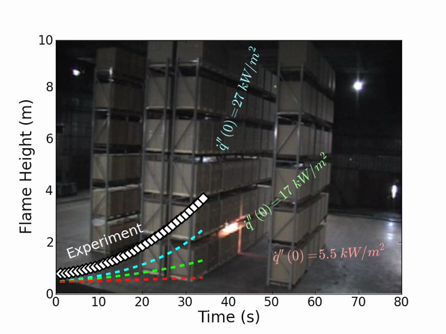
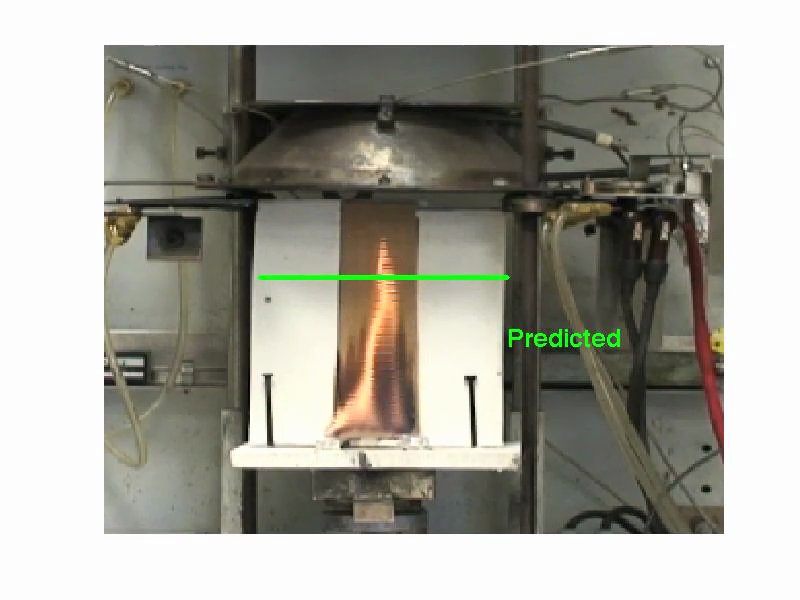
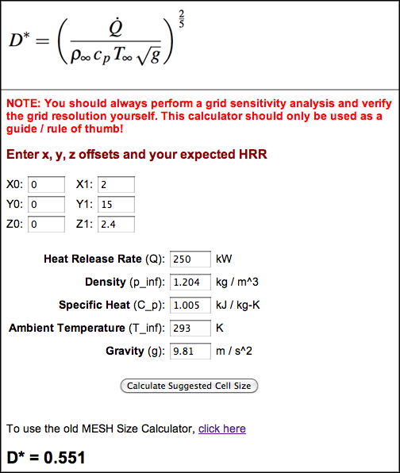
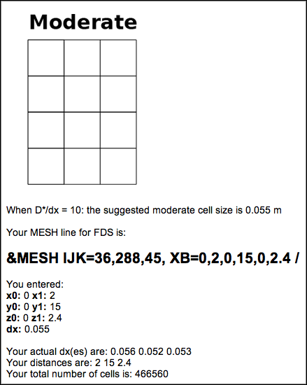
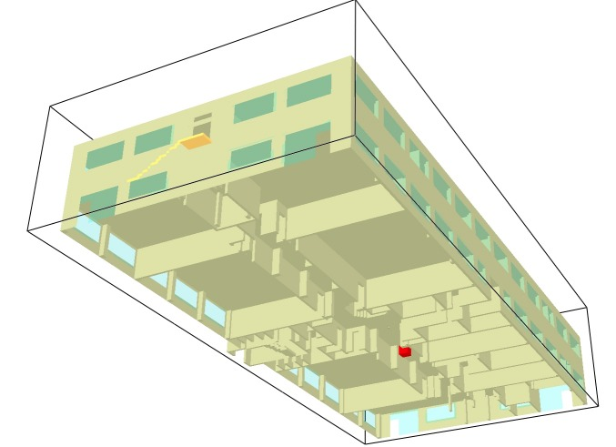

:author: Kristopher Overholt
:email: koverholt@gmail.com
:institution: University of Texas at Austin

---------------------------------------------------------
Numerical Pyromaniacs: The Use of Python in Fire Research
---------------------------------------------------------

.. class:: abstract

   Python along with various numerical and scientific libraries was used to
   create tools that enable fire protection engineers to perform various
   calculations and tasks including educational instruction, experimental work,
   and data visualization. Examples of web calculators and tools for creating
   3D geometry for fire models using Python are presented. The use of Python in
   the fire research field will foster many new ideas, tools, and innovation in
   the field of fire protection research and engineering.

.. class:: keywords

    fire protection engineering, fluid dynamics, visualization

Introduction
------------

The use of Python in fire protection engineering and fire research has many useful applications and allows for an abundance of possibilities for the fire science community. Recently, Python has been used to create data analysis tools for fire experiments and simulation data, to assist users with fire modeling and fire dynamics calculations, to perform flame height tracking for warehouse fires and bench-scale tests using GUI programs, and to present flame spread results using a visual method of superimposed video plotting. These tools have emerged in the form of web applications, GUIs, and data reduction scripts which interact with existing computational fluid dynamics (CFD) tools such as the freely available and open-source fire modeling program, Fire Dynamics Simulator [FDS]_, which is maintained by the National Institute of Standards and Technology (NIST).

Python (and its associated scientific and numerical libraries) is the perfect tool for the development of these tools, which  advance the capabilities of the fire research community, due to its free and open source nature and widespread, active community. Thus, it is important to identify efforts and projects that allow engineers and scientists to easily dive into learning Python programming and to utilize it in an environment that is familiar and efficient for practical engineering use.

Along this line, tools and packages such as the Enthought Python Distribution [EPD]_ and Python(x,y) [pythonxy]_ help with the installation of Python and its associated scientific and numerical packages. Other tools such as Spyder [SPY]_ and Sage [SAGE]_  allow engineers and students to work in a familiar environment that is similar to commercial engineering programs with the advantage of a full-featured programming language that is based on an open-source foundation.

Another application of Python in fire research is for the verification and validation of fire models. As with other CFD tools, the developers of fire models have recently become interested in the use of verification and validation to assess the performance and accuracy of the models regarding their correct physical representation. The process of validation compares the results from the computer model to analytical results or experimental data and involves a large amount of data and plots. For this purpose, we can use Python to automate our workflow and generate plots from updated data, and we are considering using Python to generate regression statistics between newer versions of the fire modeling software so that we can better quantify the numerical variations that are related to changes in the CFD code.

From data fitting to creating publication-quality plots using matplotlib [MPL]_, Python is quickly emerging as a useful tool for engineers and scientists to interact with data in a meaningful and programmatic manner that is familiar to them. In a time when a budget cut can result in numerous dropped licenses for proprietary data analysis software (which can cause the proprietary scripts and data sets to be unusable), Python is in the position to become more ubiquitous in fire protection engineering and the engineering field in general.

Superimposed Video Plotting Method
----------------------------------

A few years ago, while I was attending a fire conference, a presenter showed a video with real-time seismic data plots superimposed over a video of the burning building where the measurements were being taken from. This was certainly a useful way to convey multiple streams of information visually and allow the data tell a story. Because videos can convey much more information than static plots, this method allows for both qualitative and quantitative information to be communicated simultaneously.

Shortly thereafter, I created a Python script and used matplotlib to import videos, adjust frame rates, plot on the imported figures, and export the video frames with plots. I used the script to generate video plots of warehouse commodity fire tests with actual and predicted flame heights vs. time, as shown in Figure :ref:`warehousefig`.

    :label:`warehousefig` Plot of flame height vs. time on a warehouse fire video created with Python and matplotlib.

I also used the script to show video plots of the predicted flame heights for small-scale tests, as shown in Figure :ref:`bench`.

    :label:`bench` Plot of flame height vs. time on a bench-scale experiment video created with Python and matplotlib.

Real-time video plots are a great visual method for teaching, communication, and telling a story with your data. At the time of this writing, no existing programs or tools are available for this process. Python was a great tool for this purpose, and it would not require much more effort to create a GUI for this tool.

Web Tools and Engineering Calculators
-------------------------------------
As I was learning Python a few years ago and using it in my research, I created a spreadsheet tool that would generate text input lines for a 3D mesh for a fire modeling tool (FDS) that involved tedious calculations and Poisson-friendly integer requirements. After repeatedly running these calculations by hand one, I created a Python script to generate the appropriate numbers and parameters to use in a text input file, and I wanted to share this tool with others. Based on some simple Python CGI examples, I created a mesh size calculator web tool. Previously, I had never created a web application, but with Python it was quite easy and fun. The interface for the web calculator is shown in Figure :ref:`mesh`.

    :label:`mesh` Interface for FDS mesh size calculator web tool.

Today, on my website [FDSmesh]_, the mesh calculator web tool gets used about 1,000 times a month by engineers and scientists around the world. The source code of the web tool is freely available on Google Code under the MIT License and is linked from the webpage that contains the web calculator. Because the source code is available, this will hopefully be helpful to others who want to create a simple web calculator tool using Python. The output of the web calculator is shown in Figure :ref:`mesh2`.

    :label:`mesh2` Results from FDS mesh calculator web tool.

Since then, I have also developed a few other web calculators. Some future tools that I wish to develop include a suite of fire engineering and fire dynamics tools that can be used online. A legacy computer tool for fire protection engineers is a program called FPETool (fire protection engineering tool) [FPETool]_, which contains a set of fire dynamics calculations, and this program was heavily used in the 1980s and 1990s. FPETool is still available as a free download from NIST, but only as a DOS executable. Because of this, the suite of tools and fire dynamics calculators in FPEtool are no longer used in the field. The equations and methods in FPEtool could be recreated as a web-based, open-source, and community-supported project using Python. Python offers our field the ability to easily and quickly create web tools, from simple calculators to complex web applications, and this results in a more efficient workflow for engineers, a method for third-party developers to contribute to the fire modeling community, and promotion of the effective use of fire dynamics and tools for life safety design work.

Creating 3D Geometry for Fire Models
------------------------------------
Regarding the increasing amount of interaction between Python and fire models, third-party developers in the fire modeling community (including myself) have recently released a tool to model 3D geometry and generate a text-based input file for the FDS fire modeling software. The tool is called BlenderFDS and is an extension for [Blender]_ that was written in Python. Before the release of BlenderFDS, users of FDS had to create geometry for a case either manually using a text editor or by using a commercial user interface. Now, using BlenderFDS, FDS users can create complex buildings and irregular geometry (e.g., cylinders, angled roofs) and automatically have the geometry broken up into the rectilinear format that FDS requires.

Blender handles the interactive creation and manipulation of 3D objects, and BlenderFDS then voxelizes the 3D geometry into rectilinear shapes and outputs a text-based FDS input file. BlenderFDS works by scanning the geometry in Blender on the x, y, and z axis and then generating optimized obstruction lines with 3D coordinates in ASCII format. Using this method, complex objects can be represented as multiple lines of simplified geometry in the FDS input file. This approach could be used in other fields that utilize 3D modeling to help with the creation of input files. The interface for the BlenderFDS extension in Blender is shown in Figure :ref:`blenderfds`.

.. figure:: testcase_obj2obst

    :label:`blenderfds` Interface for creating and exporting 3D fire model geometry in Blender.

BlenderFDS allows for the quick creation of complex geometry in a visual manner, and it can even be used to model an entire building, as shown in Figure :ref:`blenderfds2`.

    :label:`blenderfds2` 3D geometry output shown in FDS that was generated using the BlenderFDS plugin.

We hope to continue adding functionality to BlenderFDS and create a comprehensive GUI for creating input files for fire models, and we (the developers) have appreciated the ease of use and the implementation process of using Python with Blender for this project. The source code for the BlenderFDS project is freely available on the [BlenderFDS]_ website on Google Code and is licensed under the GNU GPL. We are also exploring additional 3D fire modeling solutions in Blender and other popular CFD postprocessing tools, which will be discussed in the next section.

Visualizing Smoke and Fire for CFD simulations
-----------------------------------------------
With the availability of numerous CFD-related tools such as [Paraview]_, [Mayavi]_, and Blender, we have been exploring the use of these tools for the visualization of realistic and scientifically-based fire and smoke for 3D fire simulations. An example of the improved rendering of fire and smoke in the upcoming release of Blender 2.5 is shown in Figure :ref:`flames`.

    :label:`flames` Realistic flames and smoke rendered in Blender [Price]_.

Such a visualization tool would allow for graphical improvements in the output and a standardized data format for visualization and analysis for CFD tools. Finally, such a tool would also allow for more community involvement and support for the visualization software.

Future Plans for Python in Fire Research
----------------------------------------

The use of Python in fire protection engineering is still in its early stages; future applications in the fire research field include additional fire dynamics and engineering web calculation tools, tools to analyze and visualize output from CFD programs such as FDS, and the design and implementation of a standardized, open format for experimental fire test data.

Interactive data analysis tools that are based on Python, such as Spyder and Sage, will allow Python to be used more in the engineering field as a flexible, free, and powerful tool with a supportive and active community. For Python to be used more in the engineering field as a replacement for commercial tools, more emphasis should be placed on the development of interactive data analysis and GUI tools.

Python can also be utilized more in tools such as Blender (for geometry creation), Spyder (for interactive data analysis and scripting), or Mayavi (for visualization), which allows for the possibility of many new innovations in fire research. Additionally, Python can be incorporated into the field of CFD and high performance computing.

In conclusion, the use of Python in fire protection engineering and fire research is of utmost importance because these fields involve public safety and strive to produce safer buildings and materials to protect people and property around the world from the dangers of fire. Python and the scientific Python community are a good fit for this endeavor, and I hope to interact and learn more from the Python community to create additional solutions that can advance our field.

References
----------

.. [FDS] http://fire.nist.gov/fds

.. [EPD] http://www.enthought.com/products/epd.php

.. [pythonxy] http://code.google.com/p/pythonxy/

.. [SPY] http://code.google.com/p/spyderlib/

.. [SAGE] http://www.sagemath.org/

.. [MPL] http://matplotlib.sourceforge.net/

.. [FDSmesh] http://www.koverholt.com/fds-mesh-size-calc

.. [FPETool] http://www.bfrl.nist.gov/866/fmabbs.html#FPETOOL

.. [Blender] http://www.blender.org/

.. [BlenderFDS] http://www.blenderfds.org

.. [Paraview] http://www.paraview.org/

.. [Mayavi] http://mayavi.sourceforge.net/
           
.. [Price] Used with permission from Andrew Price, http://www.blenderguru.com
